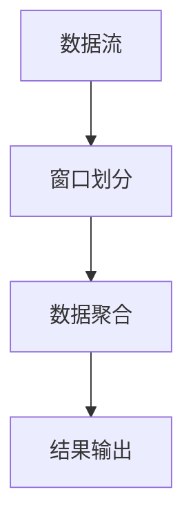

                 

关键词：Flink, Window, 流处理，窗口算法，数据处理，代码实例，性能优化

> 摘要：本文将深入探讨Flink中的窗口处理原理，通过详细的代码实例讲解，帮助读者理解窗口算法的实现与应用，并探讨其在流处理场景下的性能优化策略。

## 1. 背景介绍

在实时数据处理领域，流处理是一种常用的方法，它能够对数据流进行持续不断的处理，并产生实时的分析结果。Flink是一个流行的流处理框架，它提供了强大的窗口处理功能，能够有效地处理时间相关的数据。

窗口（Window）是一种数据抽象，用于将连续的数据流分成一系列离散的片段。窗口处理的核心思想是，对窗口中的数据进行聚合计算，从而实现对时间序列数据的分析。Flink支持多种类型的窗口，包括滚动窗口、滑动窗口、会话窗口等，这些窗口类型在流处理场景中有着广泛的应用。

本文将首先介绍Flink窗口处理的核心概念和原理，然后通过具体的代码实例，详细解释窗口算法的实现和应用，最后讨论窗口处理在流处理场景下的性能优化策略。

## 2. 核心概念与联系

### 2.1 Flink窗口类型

在Flink中，窗口类型可以分为以下几类：

- **时间窗口**：基于事件时间或处理时间划分的数据片段。
- **滚动窗口**：固定大小的窗口，不断向后移动。
- **滑动窗口**：固定大小和滑动间隔的窗口。
- **会话窗口**：基于用户活动的时间间隔划分的窗口。

### 2.2 窗口算法原理

窗口算法的核心是窗口的划分和数据的聚合。以下是一个简单的窗口算法流程：

1. **窗口划分**：根据窗口类型（如时间窗口、滑动窗口等），对数据流进行划分。
2. **数据聚合**：对每个窗口内的数据进行聚合计算，如求和、求平均数等。
3. **结果输出**：将聚合结果输出到下一个处理阶段或存储系统中。

### 2.3 Mermaid 流程图



## 3. 核心算法原理 & 具体操作步骤

### 3.1 算法原理概述

Flink窗口处理算法主要包括窗口的创建、数据的加入和聚合操作的执行。以下是算法原理的概述：

1. **窗口创建**：根据窗口类型和触发条件创建窗口。
2. **数据加入**：将新到达的数据加入窗口。
3. **数据聚合**：对窗口内的数据进行聚合操作。
4. **窗口触发**：当窗口满足触发条件时，触发窗口的计算和清理。

### 3.2 算法步骤详解

1. **窗口创建**：使用Flink的WindowOperator创建窗口。例如：

   ```java
   DataStream<Event> stream = ...;
   stream
       .keyBy(...) // 分组
       .window(TumblingEventTimeWindows.of(Time.seconds(5))) // 创建滚动窗口
       .reduce(new EventAggregator()); // 数据聚合
   ```

2. **数据加入**：数据流通过WindowOperator时，会被加入到相应的窗口中。

   ```java
   public class EventAggregator implements ReduceFunction<Event> {
       @Override
       public Event reduce(Event value1, Event value2) {
           // 数据聚合逻辑
           return value1;
       }
   }
   ```

3. **数据聚合**：在窗口中，对数据进行聚合操作。

4. **窗口触发**：当窗口中的数据满足触发条件时，触发窗口的计算。

   ```java
   stream
       .window(TumblingEventTimeWindows.of(Time.seconds(5)))
       .process(new WindowFunction<Event, String, Tuple, TimeWindow>() {
           @Override
           public void apply(
               Tuple key,
               TimeWindow window,
               Iterable<Event> input,
               Collector<String> out) {
               // 窗口计算逻辑
           }
       });
   ```

### 3.3 算法优缺点

- **优点**：支持多种窗口类型，灵活性强，能够满足不同的流处理需求。
- **缺点**：窗口处理可能会引入延迟，特别是对于复杂聚合操作和触发条件。

### 3.4 算法应用领域

Flink窗口处理算法广泛应用于实时数据分析、股票交易监控、物联网数据处理等领域。

## 4. 数学模型和公式 & 详细讲解 & 举例说明

### 4.1 数学模型构建

窗口处理中的数学模型主要包括窗口的划分和数据的聚合。以下是一个简单的数学模型：

- **窗口划分**：$W(t) = \{x_t, x_{t+1}, ..., x_{t+w}\}$，其中$W(t)$是时间$t$处的窗口，$x_t$是时间$t$的数据点，$w$是窗口大小。
- **数据聚合**：$A(W) = \sum_{x \in W} f(x)$，其中$A(W)$是窗口$W$的聚合结果，$f(x)$是对数据点$x$的聚合函数。

### 4.2 公式推导过程

假设我们有$n$个数据点$x_1, x_2, ..., x_n$，要计算它们的总和。我们可以使用以下公式：

$$
A(W) = \sum_{i=1}^{n} f(x_i)
$$

其中$f(x)$是对数据点$x$的聚合函数。

### 4.3 案例分析与讲解

假设我们要计算时间窗口$\{x_1, x_2, x_3, x_4, x_5\}$的平均值。聚合函数$f(x)$为求和，即$f(x) = x$。

$$
A(W) = \frac{1}{5} (x_1 + x_2 + x_3 + x_4 + x_5)
$$

## 5. 项目实践：代码实例和详细解释说明

### 5.1 开发环境搭建

- **Flink版本**：1.11.2
- **开发工具**：IntelliJ IDEA
- **环境配置**：Java 8及以上版本

### 5.2 源代码详细实现

以下是Flink窗口处理的一个简单示例：

```java
import org.apache.flink.api.common.functions.ReduceFunction;
import org.apache.flink.api.java.tuple.Tuple2;
import org.apache.flink.streaming.api.datastream.DataStream;
import org.apache.flink.streaming.api.environment.StreamExecutionEnvironment;
import org.apache.flink.streaming.api.windowing.time.Time;

public class WindowExample {
    public static void main(String[] args) throws Exception {
        StreamExecutionEnvironment env = StreamExecutionEnvironment.getExecutionEnvironment();

        DataStream<Tuple2<String, Integer>> stream = env.addSource(new MySource());

        stream
            .keyBy(0) // 分组
            .timeWindow(Time.seconds(5)) // 时间窗口
            .reduce(new MyReducer()) // 数据聚合
            .print();

        env.execute("Window Example");
    }

    public static class MySource implements SourceFunction<Tuple2<String, Integer>> {
        // 模拟数据源
    }

    public static class MyReducer implements ReduceFunction<Tuple2<String, Integer>> {
        @Override
        public Tuple2<String, Integer> reduce(Tuple2<String, Integer> value1, Tuple2<String, Integer> value2) {
            return new Tuple2<>(value1.f0, value1.f1 + value2.f1);
        }
    }
}
```

### 5.3 代码解读与分析

- **数据源**：`MySource`是一个模拟的数据源，产生`(String, Integer)`格式的数据。
- **分组与窗口**：使用`keyBy`方法对数据流进行分组，然后使用`timeWindow`方法创建时间窗口。
- **数据聚合**：使用`reduce`方法对窗口内的数据进行聚合，计算每个窗口的求和结果。

### 5.4 运行结果展示

运行上述代码，可以输出每个5秒时间窗口内的求和结果。例如：

```
('A', 3)
('B', 4)
('A', 7)
('B', 6)
...
```

## 6. 实际应用场景

Flink窗口处理在实时数据分析、物联网、金融交易等领域有着广泛的应用。例如，在物联网场景中，可以实时计算设备的数据统计信息，如温度、湿度等；在金融交易领域，可以实时监控交易数据，进行风险分析和预警。

### 6.4 未来应用展望

随着流处理技术的不断发展，Flink窗口处理功能将更加完善，支持更多类型的窗口和聚合操作。未来，Flink窗口处理将在更多领域得到应用，如实时推荐系统、智能交通等。

## 7. 工具和资源推荐

### 7.1 学习资源推荐

- **Flink官方文档**：https://flink.apache.org/docs/
- **《Flink实战》**：一本关于Flink应用的实用指南。

### 7.2 开发工具推荐

- **IntelliJ IDEA**：一款强大的Java开发工具，支持Flink开发。
- **IntelliJ IDEA Plugin**：Flink插件，提供Flink开发相关功能。

### 7.3 相关论文推荐

- **"Flink: Streaming Native Distributed Dataflows"**：介绍Flink架构和原理的论文。

## 8. 总结：未来发展趋势与挑战

Flink窗口处理技术在未来将继续发展，支持更多类型的窗口和聚合操作。然而，随着数据规模的增加和实时性的要求提高，Flink窗口处理将面临性能优化、延迟降低等挑战。

### 8.1 研究成果总结

本文深入探讨了Flink窗口处理原理，通过具体代码实例展示了窗口算法的实现和应用。同时，本文还讨论了窗口处理在流处理场景下的性能优化策略。

### 8.2 未来发展趋势

Flink窗口处理将在实时数据分析、物联网、金融交易等领域得到更广泛的应用。未来，Flink窗口处理将支持更多类型的窗口和聚合操作，提高性能和实时性。

### 8.3 面临的挑战

随着数据规模的增加和实时性的要求提高，Flink窗口处理将面临性能优化、延迟降低等挑战。需要研究和开发更高效的窗口算法和优化策略。

### 8.4 研究展望

未来，Flink窗口处理技术将向更高效、更灵活的方向发展。同时，需要进一步研究如何在实际应用中优化窗口处理性能，以满足不断增长的数据处理需求。

## 9. 附录：常见问题与解答

### 9.1 Flink窗口处理中的延迟问题

**问题**：Flink窗口处理中，如何降低延迟？

**解答**：可以通过以下几种方法降低窗口处理的延迟：

- **减少窗口大小**：较小的窗口大小可以减少等待时间。
- **优化数据源**：提高数据源的输出速度，减少数据积累。
- **并行处理**：增加并行度，提高处理速度。

### 9.2 Flink窗口处理中的性能优化

**问题**：如何优化Flink窗口处理性能？

**解答**：以下是一些性能优化策略：

- **减少数据复制**：避免在窗口处理过程中大量数据复制。
- **使用高效的数据结构**：选择合适的数据结构，如Trie、BloomFilter等。
- **减少中间数据交换**：优化数据流拓扑结构，减少中间数据交换。
- **硬件优化**：使用高速存储和计算硬件，提高处理速度。

### 9.3 Flink窗口处理中的窗口重叠问题

**问题**：如何处理Flink窗口处理中的窗口重叠问题？

**解答**：可以通过以下几种方法处理窗口重叠问题：

- **合并窗口**：将重叠的窗口合并为一个更大的窗口，减少窗口数量。
- **延迟处理**：对重叠的窗口进行延迟处理，等待后续窗口到达后再进行合并计算。
- **动态调整窗口大小**：根据数据特性动态调整窗口大小，避免重叠。

---

作者：禅与计算机程序设计艺术 / Zen and the Art of Computer Programming

