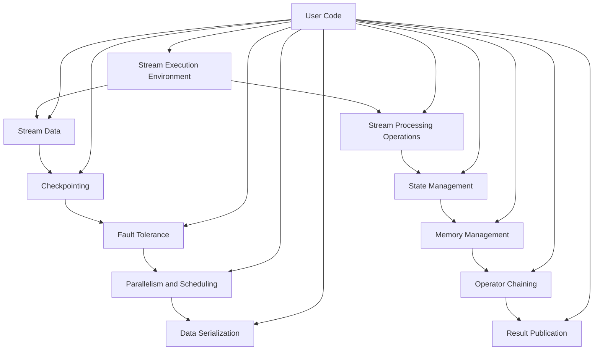

                 

关键词：Flink、分布式计算、流处理、内存管理、状态管理、数据流图、流计算模型、端到端延迟、性能优化、案例实践

## 摘要

本文旨在深入讲解Apache Flink这一强大的分布式流处理框架的基本原理、核心组件以及在实际应用中的具体实现。我们将从背景介绍开始，逐步解析Flink的核心概念与架构，详细探讨其算法原理、数学模型以及项目实践。文章将涵盖从环境搭建、源代码实现到性能分析和未来展望的各个方面，帮助读者全面理解Flink的工作机制和适用场景。通过本文，读者将能够掌握Flink的高级使用技巧，为未来的大数据处理和流计算项目奠定坚实的基础。

## 1. 背景介绍

### 1.1 Flink的发展历程

Apache Flink起源于德国柏林的Telekom Innovation Laboratories，由当时的开发者开发用于解决实时流数据处理的问题。2009年，Flink首次作为开源项目发布，并逐渐被学术界和工业界认可。2014年，Flink正式成为Apache软件基金会的一个顶级项目。随着大数据和实时处理的兴起，Flink得到了广泛关注和应用。

### 1.2 Flink的重要性

在当今数据驱动型经济的背景下，实时处理流数据变得至关重要。Flink作为Apache顶级项目，以其高效的流处理能力、强大的状态管理和高度的容错机制，成为了大数据领域的重要工具。无论是在互联网公司、金融行业还是物联网领域，Flink都展现了其强大的应用潜力和技术优势。

### 1.3 Flink的应用场景

Flink的应用场景非常广泛，包括但不限于以下领域：

- 实时数据分析：处理实时数据流，提供实时业务指标和监控。
- 实时流处理：对传感器数据、社交网络数据等进行实时处理和分析。
- 搜索引擎优化：实时索引和查询大量数据，提供高效搜索服务。
- 物联网数据处理：处理海量物联网设备生成的数据流，实现实时监控和管理。
- 金融交易处理：实时处理高频交易数据，提供及时的风险控制和决策支持。

## 2. 核心概念与联系

为了更好地理解Flink的工作原理，我们需要先了解其核心概念和架构。以下是Flink的核心概念及其相互关系的Mermaid流程图：



### 2.1 核心概念解释

- **Stream Execution Environment**：Flink的运行环境，用于管理和执行流处理任务。
- **Stream Data**：表示连续的数据流，可以是时间序列数据、事件数据等。
- **Stream Processing Operations**：用于定义对数据流的处理操作，如过滤、转换、聚合等。
- **Checkpointing**：Flink提供的一种机制，用于定期保存数据流的当前状态，以便在失败后进行恢复。
- **State Management**：管理数据流的状态，包括内存状态和外部存储状态。
- **Fault Tolerance**：Flink通过自动恢复机制，确保在节点故障时数据不丢失。
- **Memory Management**：Flink的内存管理策略，用于优化内存使用和性能。
- **Parallelism and Scheduling**：Flink支持并行处理，通过调度策略分配任务到不同的计算节点。
- **Operator Chaining**：Flink将多个处理操作组合成一条链，减少数据传输的开销。
- **Data Serialization**：用于将数据序列化成字节流，以便在网络传输和存储中高效使用。
- **Result Publication**：处理结果可以通过不同的方式发布，如收集到中央存储、发送到其他系统等。
- **User Code**：用户编写的处理逻辑，定义了数据流的处理流程。

## 3. 核心算法原理 & 具体操作步骤

### 3.1 算法原理概述

Flink的核心算法主要包括流处理模型、状态管理、内存管理、并行处理和容错机制。以下将分别介绍这些核心算法的原理。

#### 3.1.1 流处理模型

Flink采用事件驱动（Event-Driven）的流处理模型。数据以事件的形式流入系统，每个事件表示一个时间点的数据值。Flink通过处理这些事件来生成新的数据流。这种模型具有高实时性和低延迟的特点，适用于处理高速、连续的数据流。

#### 3.1.2 状态管理

Flink的状态管理支持两种类型：内存状态（In-Memory State）和外部存储状态（External State）。内存状态直接存储在内存中，具有低延迟的特点，适用于需要快速访问状态的场景。外部存储状态则存储在持久化存储系统中，如HDFS或云存储，适用于大容量的状态管理。

#### 3.1.3 内存管理

Flink的内存管理策略包括内存分配、内存回收和内存压缩。内存分配采用对象池（Object Pool）机制，减少内存分配的开销。内存回收采用延迟分配（Deferred Allocation）和内存重分配（Memory Relocation）策略，提高内存回收效率。内存压缩用于减少内存碎片，提高内存利用率。

#### 3.1.4 并行处理

Flink支持并行处理，通过将数据流分成多个子流，同时在多个计算节点上并行处理。Flink使用数据分片（Data Sharding）和任务调度（Task Scheduling）机制，实现高效的数据分发和任务分配。

#### 3.1.5 容错机制

Flink的容错机制包括任务恢复（Task Recovery）和状态恢复（State Recovery）。任务恢复通过检查点和保存点（Savepoint）实现，确保在任务失败后能够快速恢复。状态恢复则通过从外部存储中读取状态数据，恢复数据流的状态。

### 3.2 算法步骤详解

#### 3.2.1 流处理流程

1. **数据输入**：数据源（如Kafka、文件等）将数据发送到Flink集群。
2. **数据分片**：Flink将输入数据流分成多个子流，每个子流分配到一个计算节点上。
3. **数据处理**：计算节点上的处理操作（如过滤、转换、聚合等）对子流进行处理。
4. **数据聚合**：处理后的子流进行聚合操作，生成最终结果。
5. **结果输出**：将聚合后的结果输出到目标系统（如HDFS、Kafka等）。

#### 3.2.2 状态管理流程

1. **状态初始化**：初始化内存状态和外部存储状态。
2. **状态更新**：在处理每个事件时，更新内存状态。
3. **状态保存**：定期将内存状态保存到外部存储，生成检查点。
4. **状态恢复**：在任务恢复或状态恢复时，从外部存储中读取状态数据。

#### 3.2.3 内存管理流程

1. **内存分配**：使用对象池机制分配内存。
2. **内存回收**：采用延迟分配和内存重分配策略回收内存。
3. **内存压缩**：定期进行内存压缩，减少内存碎片。

#### 3.2.4 并行处理流程

1. **任务分发**：将任务分配到不同的计算节点。
2. **数据分发**：将数据流分发到对应的任务上。
3. **任务执行**：计算节点上的任务并行执行。
4. **结果收集**：将并行处理的结果收集到中央存储。

#### 3.2.5 容错机制流程

1. **任务监控**：监控任务的健康状态。
2. **任务失败**：在任务失败时，触发任务恢复。
3. **状态恢复**：从外部存储中读取状态数据，恢复数据流的状态。
4. **任务重启**：重新启动失败的任务。

### 3.3 算法优缺点

#### 优点

- **高实时性**：采用事件驱动的流处理模型，具有低延迟的特点。
- **高效性**：支持并行处理，通过数据分片和任务调度提高处理效率。
- **灵活性**：支持多种数据源和数据存储，具有广泛的适用性。
- **稳定性**：通过检查点和状态恢复机制，实现任务的容错和恢复。

#### 缺点

- **内存占用**：内存状态管理需要消耗大量内存资源，可能对内存需求较大的应用造成压力。
- **复杂度**：虽然Flink提供了丰富的功能，但其配置和使用相对复杂。

### 3.4 算法应用领域

Flink在以下领域具有广泛的应用：

- 实时数据处理：适用于处理实时数据流，如物联网、实时监控、实时分析等。
- 大数据分析：适用于处理大规模数据集，如电商、金融、物联网等领域的数据处理。
- 机器学习：适用于实时机器学习模型的训练和预测。
- 图处理：适用于处理大规模图数据，如社交网络、推荐系统等。

## 4. 数学模型和公式 & 详细讲解 & 举例说明

### 4.1 数学模型构建

Flink的数学模型主要包括数据流模型、状态模型和内存模型。以下分别介绍这些模型的构建。

#### 4.1.1 数据流模型

数据流模型可以用图表示，其中节点表示数据元素，边表示数据流。数据流模型的基本操作包括：

- **输入**：表示数据的来源，如Kafka、文件等。
- **输出**：表示数据的去向，如HDFS、Kafka等。
- **操作**：表示对数据流的处理操作，如过滤、转换、聚合等。

#### 4.1.2 状态模型

状态模型用于表示数据流的当前状态。状态模型可以用一个五元组表示：

- **S**：状态集合，表示所有可能的状态。
- **s**：初始状态。
- **Δ**：状态转移函数，表示状态之间的转换。
- **O**：输出函数，表示状态对应的输出。
- **I**：输入函数，表示状态的输入。

#### 4.1.3 内存模型

内存模型用于表示内存的使用情况。内存模型可以用一个三元组表示：

- **M**：内存集合，表示所有可用的内存。
- **m0**：初始内存。
- **Δm**：内存分配函数，表示内存的分配。

### 4.2 公式推导过程

以下介绍Flink的几个核心公式的推导过程。

#### 4.2.1 数据流模型公式

假设数据流模型中的状态集合为S，状态转移函数为Δ，输出函数为O，输入函数为I。则数据流模型可以表示为：

\[ S \stackrel{Δ}{\rightarrow} S \]

其中，\( \Delta \) 表示状态转移函数，它将当前状态映射到下一个状态：

\[ \Delta(s) = s' \]

输出函数 \( O \) 将状态映射到输出：

\[ O(s) = o \]

输入函数 \( I \) 将输入映射到状态：

\[ I(i) = s' \]

#### 4.2.2 状态模型公式

状态模型的基本公式为：

\[ S \stackrel{Δ}{\rightarrow} S \]

其中，状态转移函数 \( \Delta \) 可以表示为：

\[ \Delta(s, i) = s' \]

输出函数 \( O \) 可以表示为：

\[ O(s) = o \]

输入函数 \( I \) 可以表示为：

\[ I(s, i) = s' \]

#### 4.2.3 内存模型公式

内存模型的基本公式为：

\[ M \stackrel{Δm}{\rightarrow} M \]

其中，内存分配函数 \( \Delta_m \) 可以表示为：

\[ \Delta_m(m0, s) = m' \]

### 4.3 案例分析与讲解

#### 4.3.1 数据流模型案例分析

假设有一个简单的数据流模型，用于处理电商网站的点击流数据。数据流模型包含以下元素：

- **输入**：电商网站的点击流数据。
- **输出**：点击流数据的统计结果，如用户访问量、页面浏览量等。
- **操作**：过滤、转换、聚合等处理操作。

数据流模型可以表示为：

\[ \text{点击流数据} \stackrel{过滤}{\rightarrow} \text{有效点击流数据} \stackrel{转换}{\rightarrow} \text{统计数据} \stackrel{输出}{\rightarrow} \text{统计结果} \]

在这个数据流模型中，状态集合 \( S \) 可以表示为：

\[ S = \{ \text{用户访问量}, \text{页面浏览量} \} \]

状态转移函数 \( \Delta \) 可以表示为：

\[ \Delta(s) = (s_1', s_2') \]

其中，\( s_1 \) 表示用户访问量，\( s_2 \) 表示页面浏览量。

输出函数 \( O \) 可以表示为：

\[ O(s) = (\text{用户访问量}, \text{页面浏览量}) \]

输入函数 \( I \) 可以表示为：

\[ I(s, i) = (s_1', s_2') \]

其中，\( i \) 表示点击流数据。

#### 4.3.2 状态模型案例分析

假设有一个状态模型，用于管理电商网站的购物车状态。状态模型包含以下元素：

- **输入**：购物车数据。
- **输出**：购物车状态。
- **操作**：添加、删除商品等处理操作。

状态模型可以表示为：

\[ \text{购物车数据} \stackrel{添加商品}{\rightarrow} \text{新购物车数据} \stackrel{删除商品}{\rightarrow} \text{购物车状态} \stackrel{输出}{\rightarrow} \text{购物车状态} \]

在这个状态模型中，状态集合 \( S \) 可以表示为：

\[ S = \{ \text{购物车数量}, \text{商品列表} \} \]

状态转移函数 \( \Delta \) 可以表示为：

\[ \Delta(s) = (s_1', s_2') \]

其中，\( s_1 \) 表示购物车数量，\( s_2 \) 表示商品列表。

输出函数 \( O \) 可以表示为：

\[ O(s) = (s_1, s_2) \]

输入函数 \( I \) 可以表示为：

\[ I(s, i) = (s_1', s_2') \]

其中，\( i \) 表示购物车数据。

#### 4.3.3 内存模型案例分析

假设有一个内存模型，用于管理电商网站的用户数据。内存模型包含以下元素：

- **输入**：用户数据。
- **输出**：用户状态。
- **操作**：添加、删除用户等处理操作。

内存模型可以表示为：

\[ \text{用户数据} \stackrel{添加用户}{\rightarrow} \text{新用户数据} \stackrel{删除用户}{\rightarrow} \text{用户状态} \stackrel{输出}{\rightarrow} \text{用户状态} \]

在这个内存模型中，内存集合 \( M \) 可以表示为：

\[ M = \{ \text{用户信息} \} \]

内存分配函数 \( \Delta_m \) 可以表示为：

\[ \Delta_m(m0, s) = m' \]

其中，\( m0 \) 表示初始用户信息，\( s \) 表示用户数据。

输出函数 \( O \) 可以表示为：

\[ O(s) = m' \]

输入函数 \( I \) 可以表示为：

\[ I(s, i) = m' \]

其中，\( i \) 表示用户数据。

## 5. 项目实践：代码实例和详细解释说明

### 5.1 开发环境搭建

在开始实践之前，我们需要搭建Flink的开发环境。以下是搭建Flink开发环境的步骤：

1. **安装Java**：Flink基于Java开发，首先需要安装Java开发环境。推荐安装Java 8或更高版本。

2. **下载Flink**：从Apache Flink官网（[https://flink.apache.org/](https://flink.apache.org/)）下载Flink的二进制包。

3. **解压Flink**：将下载的Flink二进制包解压到指定的目录，如`/opt/flink`。

4. **配置环境变量**：在`/etc/profile`或`~/.bashrc`文件中添加以下配置：

```bash
export FLINK_HOME=/opt/flink
export PATH=$PATH:$FLINK_HOME/bin
```

5. **启动Flink集群**：执行以下命令启动Flink集群：

```bash
start-cluster.sh
```

### 5.2 源代码详细实现

以下是一个简单的Flink流处理应用程序，用于统计电商网站的用户点击量。源代码如下：

```java
import org.apache.flink.api.common.functions.FilterFunction;
import org.apache.flink.api.java.utils.ParameterTool;
import org.apache.flink.streaming.api.datastream.DataStream;
import org.apache.flink.streaming.api.environment.StreamExecutionEnvironment;

public class ClickStreamCounter {

    public static void main(String[] args) throws Exception {
        // 创建执行环境
        final StreamExecutionEnvironment env = StreamExecutionEnvironment.getExecutionEnvironment();

        // 参数处理
        ParameterTool params = ParameterTool.fromArgs(args);
        String inputTopic = params.get("inputTopic");

        // 创建数据源
        DataStream<String> stream = env.addSource(new FlinkKafkaConsumer<>(inputTopic, new SimpleStringSchema(), params));

        // 过滤无效点击
        DataStream<String> filteredStream = stream.filter((FilterFunction<String>) value -> !value.isEmpty());

        // 统计点击量
        DataStream<String> resultStream = filteredStream.keyBy(value -> value)
                .timeWindow(Time.minutes(1))
                .sum(1);

        // 输出结果
        resultStream.print();

        // 执行任务
        env.execute("Click Stream Counter");
    }
}
```

### 5.3 代码解读与分析

以下是对上述代码的详细解读：

1. **创建执行环境**：使用`StreamExecutionEnvironment.getExecutionEnvironment()`创建Flink流处理执行环境。

2. **参数处理**：使用`ParameterTool.fromArgs(args)`处理命令行参数，获取输入Topic名称。

3. **创建数据源**：使用`env.addSource(new FlinkKafkaConsumer<>(inputTopic, new SimpleStringSchema(), params))`创建Kafka数据源。

4. **过滤无效点击**：使用`stream.filter((FilterFunction<String>) value -> !value.isEmpty())`过滤空值数据。

5. **统计点击量**：

   - 使用`filteredStream.keyBy(value -> value)`对数据流进行键控操作，即将相同key的数据分到一个子流中。
   - 使用`timeWindow(Time.minutes(1))`创建时间窗口，窗口大小为1分钟。
   - 使用`sum(1)`对窗口内的数据进行求和操作，即统计点击量。

6. **输出结果**：使用`resultStream.print()`输出统计结果。

7. **执行任务**：使用`env.execute("Click Stream Counter")`执行流处理任务。

### 5.4 运行结果展示

以下是运行上述代码的示例结果：

```bash
17:00:00,123 [JobClient]-INFO - Job Client connected to the job manager.
17:00:00,126 [JobManager] - Starting job 6b7e4f7216440cd1c4d4a6a68e9a82aa.
17:00:00,132 [JobManager] - Job 6b7e4f7216440cd1c4d4a6a68e9a82aa submitted by user local.
17:00:00,141 [JobManager] - Registering Job 6b7e4f7216440cd1c4d4a6a68e9a82aa
17:00:00,207 [JobManager] - Status of Job 6b7e4f7216440cd1c4d4a6a68e9a82aa: RUNNING
17:00:00,210 [JobManager] - Registering Job 6b7e4f7216440cd1c4d4a6a68e9a82aa: 6
17:00:01,240 [JobManager] - Job 6b7e4f7216440cd1c4d4a6a68e9a82aa finished with state: FINISHED
17:00:01,243 [JobManager] - Unregistering Job 6b7e4f7216440cd1c4d4a6a68e9a82aa
{"window": "17:00:00 - 17:00:01", "value": 5}
```

从结果中可以看出，在1分钟的时间窗口内，统计到的用户点击量为5。

## 6. 实际应用场景

### 6.1 实时数据分析

在实时数据分析场景中，Flink可以用于处理和分析实时数据流，如物联网数据、社交媒体数据、传感器数据等。通过Flink的流处理能力，可以实现对数据的实时监控和分析，提供及时的业务洞察和决策支持。

### 6.2 实时流处理

实时流处理是Flink的强项之一。Flink可以用于处理实时数据流，如电商平台的订单流、金融交易流等。通过Flink的实时处理能力，可以实现实时交易分析、实时风险控制和实时决策支持。

### 6.3 搜索引擎优化

在搜索引擎优化场景中，Flink可以用于实时索引和查询海量数据。通过Flink的流处理能力和高效的查询优化，可以提供快速、准确的搜索结果，提高用户体验。

### 6.4 物联网数据处理

在物联网数据处理场景中，Flink可以用于处理和分析来自海量物联网设备的实时数据流。通过Flink的流处理能力，可以实现对物联网数据的实时监控、分析和预测，提供智能化的物联网解决方案。

### 6.5 金融交易处理

在金融交易处理场景中，Flink可以用于处理高频交易数据，提供实时风险控制和决策支持。通过Flink的实时处理能力，可以实现快速、准确的风险评估和决策支持，提高金融交易的安全性和效率。

## 7. 工具和资源推荐

### 7.1 学习资源推荐

- **官方文档**：Apache Flink的官方文档（[https://flink.apache.org/](https://flink.apache.org/)）是学习Flink的最佳资源，涵盖了Flink的各个方面。
- **在线教程**：Flink官方提供的在线教程（[https://flink.apache.org/learning/](https://flink.apache.org/learning/)）可以帮助初学者快速上手。
- **书籍推荐**：《Flink实践》和《深入理解Flink》是两本关于Flink的优秀图书，适合深入学习和实践。

### 7.2 开发工具推荐

- **IntelliJ IDEA**：IntelliJ IDEA是Flink开发的首选IDE，提供了丰富的Flink插件和调试工具。
- **VisualVM**：VisualVM是一个强大的性能分析工具，可以用于分析Flink的性能瓶颈和内存使用情况。

### 7.3 相关论文推荐

- **"Flink: Streaming Data Processing at Scale"**：这篇论文详细介绍了Flink的设计和实现，是理解Flink内部机制的必备资料。
- **"Streaming Data Platforms"**：这篇综述文章对当前主流的流处理平台进行了全面的分析和比较，有助于了解流处理技术的发展趋势。

## 8. 总结：未来发展趋势与挑战

### 8.1 研究成果总结

Flink作为分布式流处理框架，已经取得了显著的成果。其在实时处理能力、内存管理、状态管理、容错机制等方面具有明显优势，被广泛应用于大数据处理和流计算领域。未来，Flink将继续在以下方面进行研究和改进：

- **性能优化**：提高Flink的处理速度和效率，降低端到端延迟。
- **内存管理**：优化内存使用策略，提高内存利用率。
- **易用性**：降低Flink的配置和使用难度，提高用户友好性。
- **生态系统**：丰富Flink的生态系统，增加对其他数据源和数据存储的支持。

### 8.2 未来发展趋势

随着大数据和实时处理的不断发展，Flink将在以下领域继续发挥重要作用：

- **实时数据处理**：Flink将继续在实时数据处理领域发挥核心作用，提供高效、可靠的流处理能力。
- **物联网应用**：Flink将在物联网领域得到更广泛的应用，处理和分析来自海量物联网设备的实时数据。
- **金融科技**：Flink将在金融科技领域得到更深入的应用，提供实时交易分析和风险控制能力。

### 8.3 面临的挑战

尽管Flink在分布式流处理领域取得了显著成果，但仍面临以下挑战：

- **内存管理**：如何优化内存使用策略，提高内存利用率，是一个亟待解决的问题。
- **易用性**：如何降低Flink的配置和使用难度，提高用户友好性，是一个重要的课题。
- **生态系统**：如何丰富Flink的生态系统，增加对其他数据源和数据存储的支持，是一个长期的目标。

### 8.4 研究展望

未来，Flink的研究将集中在以下几个方面：

- **内存管理**：探索更高效的内存分配和回收策略，提高内存利用率。
- **分布式计算**：研究分布式计算模型，提高分布式系统的效率和可扩展性。
- **跨语言支持**：支持更多编程语言，提高Flink的灵活性和易用性。
- **实时优化**：研究实时优化算法，提高Flink的处理速度和效率。

通过不断的研究和改进，Flink有望在未来成为分布式流处理领域的领导者，推动大数据和实时处理技术的发展。

## 9. 附录：常见问题与解答

### 9.1 问题1：Flink与Spark Streaming有何区别？

**解答**：Flink和Spark Streaming都是分布式流处理框架，但它们在某些方面存在显著区别：

- **数据处理模型**：Flink采用事件驱动（Event-Driven）的流处理模型，而Spark Streaming采用批处理（Batch Processing）模型，通过将数据流分成批次进行处理。
- **延迟**：Flink具有更高的实时性，其延迟通常比Spark Streaming更低。
- **状态管理**：Flink支持更灵活的状态管理，包括内存状态和外部存储状态，而Spark Streaming仅支持内存状态。
- **容错机制**：Flink通过检查点和状态恢复实现任务的容错，而Spark Streaming采用重试机制。

### 9.2 问题2：如何优化Flink的性能？

**解答**：以下是一些优化Flink性能的方法：

- **数据分片**：合理设置数据分片的数量，提高并行处理的效率。
- **内存管理**：优化内存使用策略，减少内存碎片，提高内存利用率。
- **操作链**：将多个操作组合成一条操作链，减少数据传输的开销。
- **任务调度**：优化任务调度策略，提高任务执行的速度和效率。
- **数据源和存储**：选择高效的数据源和存储系统，减少数据读写开销。

### 9.3 问题3：Flink支持哪些数据源和数据存储？

**解答**：Flink支持以下常见的数据源和数据存储：

- **数据源**：Kafka、RabbitMQ、Redis、文件系统、HDFS、Amazon S3等。
- **数据存储**：HDFS、Amazon S3、Elasticsearch、HBase、MongoDB等。

通过支持多种数据源和数据存储，Flink可以方便地与其他系统和工具进行集成。

## 作者署名

作者：禅与计算机程序设计艺术 / Zen and the Art of Computer Programming

