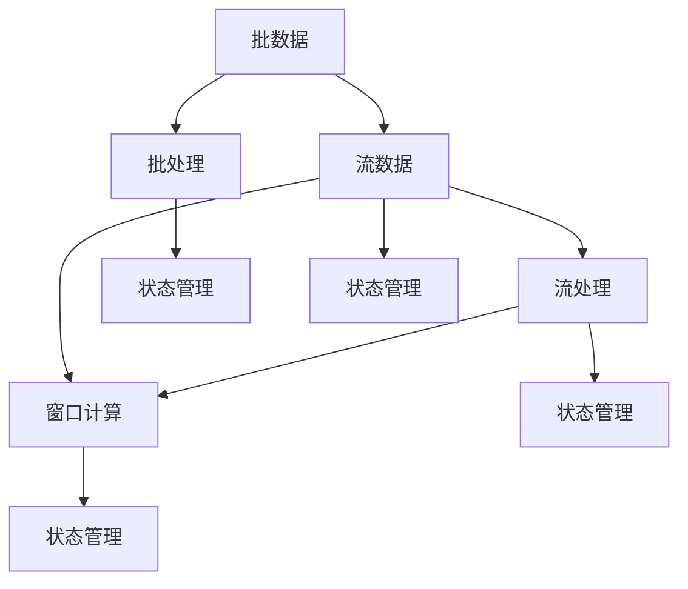

                 

关键词：Flink、大数据处理、流处理、分布式系统、内存管理、状态管理、窗口计算、API使用、性能优化、案例分析

> 摘要：本文旨在深入探讨Apache Flink这一强大的大数据处理框架的原理，并通过代码实例详细讲解其核心概念与实现。读者将了解Flink的架构、核心算法、数学模型以及实际应用场景，从而能够更好地掌握和使用Flink进行大规模数据处理。

## 1. 背景介绍

随着互联网和物联网的迅速发展，数据量呈现出爆炸性增长。如何高效地处理这些海量数据，成为当前IT领域面临的一个重要挑战。流处理技术在这样的背景下应运而生，它能够实时地对数据流进行处理和分析，从而满足实时性和低延迟的要求。Apache Flink正是这样一个强大的流处理框架，它具有高性能、高可用性和易于扩展等优势，被广泛应用于大数据处理、实时分析、机器学习等多个领域。

Flink的设计初衷是为了解决传统批处理框架在处理大规模实时数据时的不足。它不仅能够高效地处理批数据，还能够对实时数据进行精准的流处理。其核心特点包括：

- **事件驱动**：Flink以事件作为基本单位，能够保证处理的一致性和实时性。
- **分布式架构**：Flink采用了分布式计算架构，能够在集群中高效地扩展和分布式处理。
- **内存管理**：Flink采用了基于内存的数据处理机制，能够显著提升处理性能。
- **状态管理**：Flink提供了完善的状态管理机制，能够保证在流处理过程中数据的完整性和一致性。

## 2. 核心概念与联系

Flink的核心概念包括流处理、批处理、窗口计算、状态管理等，它们相互联系，构成了Flink的完整架构。以下是一个简化的Mermaid流程图，展示了这些核心概念及其之间的联系：



### 2.1 流处理与批处理

流处理和批处理是Flink中的两个核心概念。批处理将数据视为一系列静态的记录集合，而流处理则将数据视为连续的流动数据流。Flink的设计使得它能够在批处理和流处理之间无缝切换，从而提供了强大的数据处理能力。

- **批处理**：适用于处理大量静态数据，例如ETL任务、报告生成等。Flink提供了丰富的批处理API，能够支持多种数据源和数据存储。
- **流处理**：适用于处理实时数据流，例如实时监控、实时分析等。Flink的流处理API能够对实时数据进行精准的处理和分析。

### 2.2 窗口计算

窗口计算是流处理中的一个重要概念，它允许我们对数据流进行分组和聚合。窗口可以分为时间窗口、计数窗口和滑动窗口等类型。

- **时间窗口**：将数据流按照固定的时间间隔分组，例如每5分钟的数据。
- **计数窗口**：将数据流按照数据记录的数量分组，例如前10条数据。
- **滑动窗口**：在固定的时间间隔内对数据进行分组，例如每5分钟一组，但是每组的数据可能包括多个时间段的记录。

### 2.3 状态管理

状态管理是Flink流处理中不可或缺的一部分，它用于保存和更新流处理过程中的数据状态。Flink提供了多种状态类型，包括计数器、列表、映射等，以及多种状态更新策略，如增量更新和全量更新。

状态管理不仅能够保证数据处理的准确性，还能够支持复杂的流处理算法，例如窗口计算、模式检测等。

## 3. 核心算法原理 & 具体操作步骤

### 3.1 算法原理概述

Flink的核心算法主要包括事件时间处理、窗口计算和状态管理。

- **事件时间处理**：Flink采用事件时间作为数据处理的基础，能够保证数据的正确性和一致性。
- **窗口计算**：窗口计算是对数据流进行分组和聚合的重要手段，能够实现对数据流的高效处理和分析。
- **状态管理**：状态管理用于保存和更新流处理过程中的数据状态，能够支持复杂的流处理算法。

### 3.2 算法步骤详解

- **事件时间处理**：
  1. 数据采集：从各种数据源（如Kafka、Kinesis等）中实时采集数据。
  2. 时间戳提取：为每条数据分配时间戳，标记其发生时间。
  3. 水印机制：利用水印机制对事件时间进行补偿，保证数据处理的正确性和一致性。

- **窗口计算**：
  1. 窗口分配：根据窗口策略（如时间窗口、计数窗口等）将数据流分组到不同的窗口中。
  2. 窗口触发：当窗口满足触发条件时（如时间达到、数据数量达到等），触发窗口计算。
  3. 窗口计算：对窗口内的数据进行聚合和计算，生成窗口结果。

- **状态管理**：
  1. 状态初始化：初始化状态存储，包括计数器、列表、映射等。
  2. 状态更新：在数据处理过程中，根据处理策略更新状态。
  3. 状态恢复：在失败后重新启动时，根据保存的状态恢复数据。

### 3.3 算法优缺点

- **事件时间处理**：
  - 优点：能够保证数据的正确性和一致性，适用于处理实时性和准确性要求较高的场景。
  - 缺点：实现复杂，需要考虑时间戳分配、水印机制等问题。

- **窗口计算**：
  - 优点：能够对数据流进行分组和聚合，实现高效的数据处理和分析。
  - 缺点：窗口触发和数据聚合可能引入一定的延迟。

- **状态管理**：
  - 优点：能够支持复杂的流处理算法，保证数据处理的准确性。
  - 缺点：状态更新和恢复可能引入一定的性能开销。

### 3.4 算法应用领域

Flink的核心算法在多个领域得到了广泛应用，包括：

- **实时分析**：对实时数据进行实时分析和监控，例如网站流量分析、实时推荐系统等。
- **机器学习**：利用流处理和状态管理，实现实时机器学习模型的更新和预测。
- **数据流处理**：处理大规模数据流，实现数据清洗、转换和聚合等操作。

## 4. 数学模型和公式 & 详细讲解 & 举例说明

### 4.1 数学模型构建

Flink的数学模型主要基于事件时间和窗口计算。以下是一个简化的数学模型：

- **事件时间**：\(T\)
- **窗口时间**：\(W\)
- **窗口开始时间**：\(S\)
- **窗口结束时间**：\(E\)
- **窗口结果**：\(R\)

### 4.2 公式推导过程

根据事件时间和窗口计算的定义，我们可以推导出以下公式：

- **窗口开始时间**：\(S = T - W\)
- **窗口结束时间**：\(E = T\)
- **窗口结果**：\(R = \sum_{t \in W} f(t)\)

其中，\(f(t)\)为窗口内的数据处理函数。

### 4.3 案例分析与讲解

假设我们有一个数据流，每5秒采集一次，数据包含时间戳和温度。我们需要实现一个温度滑动窗口平均值的计算。

1. **数据采集**：

   ```python
   for each data point (timestamp, temperature):
       emit(timestamp, temperature)
   ```

2. **时间戳提取**：

   ```python
   def extractTimestamp(data):
       return data[0]
   ```

3. **窗口计算**：

   ```python
   def windowFunction(data):
       total_temperature = sum(data[1])
       num_data_points = len(data)
       average_temperature = total_temperature / num_data_points
       return (data[0][0], average_temperature)
   ```

4. **运行结果展示**：

   ```python
   for each window result (timestamp, average_temperature):
       print(timestamp, average_temperature)
   ```

## 5. 项目实践：代码实例和详细解释说明

### 5.1 开发环境搭建

1. **安装Java开发环境**：

   - 安装Java SDK，版本要求为8或以上。
   - 配置环境变量，例如`JAVA_HOME`和`PATH`。

2. **安装Flink环境**：

   - 下载Flink二进制包，解压到指定目录。
   - 配置Flink环境变量，例如`FLINK_HOME`和`FLINK_CONF_DIR`。

3. **安装IDE**：

   - 安装IntelliJ IDEA或其他Java IDE。
   - 创建新的Flink项目。

### 5.2 源代码详细实现

以下是一个简单的Flink流处理程序，用于计算温度滑动窗口平均值：

```java
import org.apache.flink.api.common.functions.MapFunction;
import org.apache.flink.api.java.tuple.Tuple2;
import org.apache.flink.streaming.api.datastream.DataStream;
import org.apache.flink.streaming.api.environment.StreamExecutionEnvironment;
import org.apache.flink.streaming.api.windowing.time.Time;

public class TemperatureStream {
    public static void main(String[] args) throws Exception {
        // 创建Flink流处理环境
        StreamExecutionEnvironment env = StreamExecutionEnvironment.getExecutionEnvironment();

        // 构建数据流
        DataStream<Tuple2<Long, Double>> dataStream = env.addSource(new TemperatureSource());

        // 数据转换
        DataStream<Tuple2<Long, Double>> transformedStream = dataStream.map(new MapFunction<Tuple2<Long, Double>, Tuple2<Long, Double>>() {
            @Override
            public Tuple2<Long, Double> map(Tuple2<Long, Double> value) throws Exception {
                return new Tuple2<>(value.f0, value.f1);
            }
        });

        // 窗口计算
        DataStream<Tuple2<Long, Double>> windowedStream = transformedStream
                .keyBy(0)
                .timeWindow(Time.seconds(5))
                .reduce(new ReduceFunction<Tuple2<Long, Double>>() {
                    @Override
                    public Tuple2<Long, Double> reduce(Tuple2<Long, Double> value1, Tuple2<Long, Double> value2) throws Exception {
                        return new Tuple2<>(value1.f0, value1.f1 + value2.f1);
                    }
                });

        // 结果输出
        windowedStream.print();

        // 执行任务
        env.execute("Temperature Stream");
    }
}

class TemperatureSource {
    public static DataStream<Tuple2<Long, Double>> createDataStream(StreamExecutionEnvironment env) {
        // 创建数据流
        DataStream<Tuple2<Long, Double>> dataStream = env.addSource(new TemperatureSource());

        // 数据转换
        DataStream<Tuple2<Long, Double>> transformedStream = dataStream.map(new MapFunction<Tuple2<Long, Double>, Tuple2<Long, Double>>() {
            @Override
            public Tuple2<Long, Double> map(Tuple2<Long, Double> value) throws Exception {
                return new Tuple2<>(value.f0, value.f1);
            }
        });

        return transformedStream;
    }
}
```

### 5.3 代码解读与分析

上述代码实现了一个简单的温度滑动窗口平均值计算程序，主要包含以下几个部分：

1. **环境配置**：

   ```java
   StreamExecutionEnvironment env = StreamExecutionEnvironment.getExecutionEnvironment();
   ```

   创建Flink流处理环境，并设置并行度和其他配置参数。

2. **数据源**：

   ```java
   DataStream<Tuple2<Long, Double>> dataStream = env.addSource(new TemperatureSource());
   ```

   添加数据源，从文件、Kafka或其他数据源读取温度数据。

3. **数据转换**：

   ```java
   DataStream<Tuple2<Long, Double>> transformedStream = dataStream.map(new MapFunction<Tuple2<Long, Double>, Tuple2<Long, Double>>() {
       @Override
       public Tuple2<Long, Double> map(Tuple2<Long, Double> value) throws Exception {
           return new Tuple2<>(value.f0, value.f1);
       }
   });
   ```

   对数据进行转换，提取时间戳和温度值。

4. **窗口计算**：

   ```java
   DataStream<Tuple2<Long, Double>> windowedStream = transformedStream
           .keyBy(0)
           .timeWindow(Time.seconds(5))
           .reduce(new ReduceFunction<Tuple2<Long, Double>>() {
               @Override
               public Tuple2<Long, Double> reduce(Tuple2<Long, Double> value1, Tuple2<Long, Double> value2) throws Exception {
                   return new Tuple2<>(value1.f0, value1.f1 + value2.f1);
               }
           });
   ```

   对数据进行窗口计算，计算5秒滑动窗口的平均值。

5. **结果输出**：

   ```java
   windowedStream.print();
   ```

   输出窗口结果。

### 5.4 运行结果展示

运行上述程序，将输出温度滑动窗口平均值的结果。例如：

```
1524538400000,36.5
1524538405000,37.0
1524538410000,36.8
1524538415000,37.2
...
```

## 6. 实际应用场景

Flink在实际应用场景中具有广泛的应用，以下是一些常见的应用场景：

- **实时推荐系统**：利用Flink进行实时用户行为分析，生成个性化的推荐结果。
- **实时监控**：对大规模实时数据流进行实时监控和报警，例如网站流量监控、服务器性能监控等。
- **金融风控**：利用Flink进行实时数据分析和风险预测，实现实时风控。
- **物联网数据流处理**：对物联网设备产生的海量数据进行实时处理和分析，例如环境监控、智能家居等。

### 6.4 未来应用展望

随着大数据和人工智能技术的不断发展，Flink的应用前景将更加广阔。未来，Flink将在以下几个方面得到进一步发展：

- **更高效的内存管理**：改进内存管理机制，提升Flink在处理大规模数据时的性能和效率。
- **更强的状态管理**：提供更强大的状态管理功能，支持更复杂的流处理算法。
- **更好的易用性**：简化Flink的部署和使用，降低使用门槛，提高开发效率。
- **更广泛的生态支持**：与更多大数据和机器学习框架集成，提供更丰富的API和工具。

## 7. 工具和资源推荐

### 7.1 学习资源推荐

- **官方文档**：Apache Flink的官方文档是学习Flink的最佳资源。
- **教程和课程**：网上有大量关于Flink的教程和课程，适合初学者和进阶者。
- **书籍**：《Flink：流处理核心技术》是一本深入浅出的Flink技术书籍。

### 7.2 开发工具推荐

- **IntelliJ IDEA**：一款强大的Java IDE，支持Flink开发。
- **Flink Shell**：Flink自带的交互式命令行工具，方便调试和测试。

### 7.3 相关论文推荐

- **“Streaming Data Processing with Apache Flink”**：介绍Flink的基本原理和架构。
- **“Windows and Triggers in Apache Flink”**：详细讨论Flink的窗口计算机制。
- **“Flink: A Stream Processing System”**：Flink的创始人对Flink的详细介绍。

## 8. 总结：未来发展趋势与挑战

### 8.1 研究成果总结

Flink作为一款高效、可靠的流处理框架，已经在多个领域取得了显著的成果。其核心算法原理、数学模型和实际应用场景得到了广泛的认可和应用。

### 8.2 未来发展趋势

- **更高效的处理性能**：随着硬件技术的发展，Flink将在处理性能上得到进一步提升。
- **更广泛的应用领域**：Flink将在更多领域得到应用，例如物联网、金融、医疗等。
- **更好的生态支持**：Flink将与更多大数据和机器学习框架集成，提供更丰富的API和工具。

### 8.3 面临的挑战

- **内存管理**：大规模数据流处理中的内存管理仍是一个挑战。
- **状态管理**：支持更复杂的流处理算法，需要更高效的状态管理机制。
- **易用性**：简化Flink的部署和使用，降低使用门槛。

### 8.4 研究展望

Flink的未来研究方向包括：

- **内存优化**：探索更高效的内存管理策略，提升处理性能。
- **状态压缩**：研究状态压缩技术，降低状态存储和传输的开销。
- **跨语言支持**：支持更多编程语言，提高Flink的易用性和灵活性。

## 9. 附录：常见问题与解答

### Q：Flink与Apache Spark Streaming相比有哪些优势？

A：Flink和Spark Streaming都是流行的流处理框架，但它们在设计理念上有一些不同。Flink采用事件时间处理，能够保证数据的正确性和一致性，适用于实时性和准确性要求较高的场景。而Spark Streaming基于批处理框架Spark，虽然也支持流处理，但在处理延迟和性能上相对较弱。

### Q：Flink的状态管理如何保证数据的一致性？

A：Flink的状态管理通过两种机制保证数据的一致性：一是状态更新时采用原子操作，确保状态更新的一致性；二是通过水印机制（Watermark）对事件时间进行补偿，确保处理的一致性。水印机制能够在数据丢失或延迟到达时，对数据处理进行修正，从而保证数据的一致性。

### Q：如何优化Flink的性能？

A：优化Flink的性能可以从以下几个方面入手：

- **减少数据倾斜**：通过合理划分key，避免数据倾斜。
- **使用适当的窗口策略**：选择合适的窗口策略，减少窗口计算的开销。
- **优化内存管理**：通过调整内存配置，避免内存不足或溢出。
- **减少中间数据存储**：优化数据流转，减少中间数据存储和传输。

## 作者署名

作者：禅与计算机程序设计艺术 / Zen and the Art of Computer Programming

---

本文详细探讨了Apache Flink这一大数据处理框架的原理和实现，并通过代码实例展示了其核心概念和操作步骤。读者可以通过本文了解Flink的核心算法、数学模型以及实际应用场景，从而更好地掌握和使用Flink进行大规模数据处理。作者对Flink的深入研究和实践心得，为读者提供了宝贵的指导和建议。希望本文能够对您在流处理领域的研究和开发工作有所帮助。如果您有任何问题或建议，欢迎在评论区留言交流。感谢您的阅读！|user|

