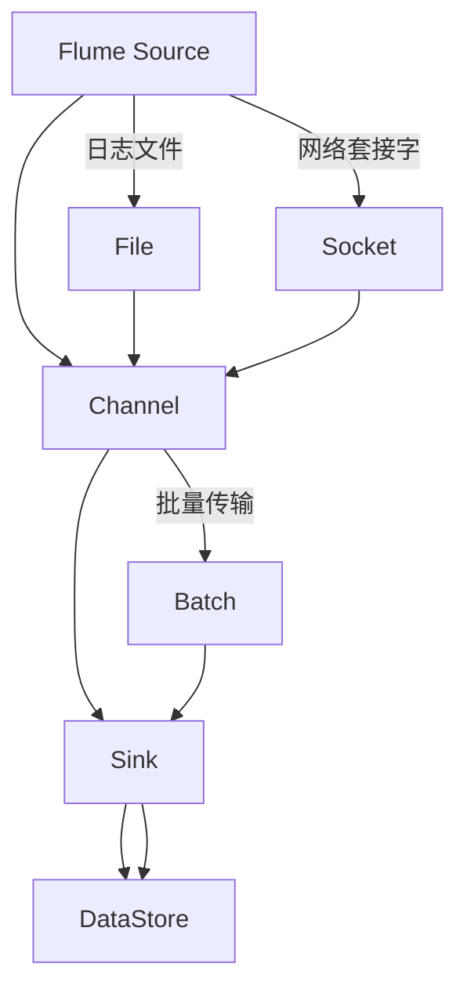

                 

关键词：Flume, Source, 数据流处理, 源组件, 流程序列化, 简单模式, 高级模式, 原理分析, 代码实例

> 摘要：本文将深入讲解Flume Source的原理，并通过实际代码实例，详细分析其实现过程和关键步骤，帮助读者理解如何高效地使用Flume进行大规模数据采集和传输。

## 1. 背景介绍

随着大数据技术的迅猛发展，数据流处理成为了许多应用场景中的关键环节。Apache Flume是一种分布式、可靠且可扩展的数据流收集系统，广泛应用于日志收集、数据聚合等场景。Flume Source作为Flume系统中最核心的组件之一，负责从各种数据源（如文件系统、网络套接字等）收集数据，并将其传输到下一个阶段或存储系统中。

本文旨在详细解析Flume Source的工作原理，并通过具体的代码实例，展示如何在实际项目中部署和使用Flume Source。文章将涵盖以下内容：

- Flume的基本架构和组件介绍
- Flume Source的核心概念和类型
- Flume Source的原理分析
- 简单模式和高级模式的使用方法
- 代码实例和详细解释
- Flume Source在实际应用中的场景
- 未来展望和潜在挑战

## 2. 核心概念与联系

在深入探讨Flume Source之前，我们需要了解一些核心概念和组成部分。以下是Flume系统中几个关键组件及其相互关系：



### 2.1 Flume组件简介

- **Source**：负责从数据源读取数据，可以是文件、网络套接字等。
- **Channel**：作为数据缓冲区，存储从Source读取的数据，直到Sink消费这些数据。
- **Sink**：将数据从Channel传输到目标存储系统，如HDFS、Kafka等。
- **DataStore**：数据的最终存储位置，可以是文件系统、数据库等。

### 2.2 Flume Source类型

Flume Source主要有以下几种类型：

- **Taildir Source**：监控文件系统中的文件变化，并将新添加或更新的文件内容发送到Channel。
- **Syslog Source**：接收系统日志数据，通常通过UDP或TCP协议。
- **HTTP Source**：从HTTP服务器获取数据，常用于网页抓取。
- **JMS Source**：从JMS消息队列中读取消息。

## 3. 核心算法原理 & 具体操作步骤

### 3.1 算法原理概述

Flume Source的核心算法是通过监听数据源的变化，将数据批量读取并写入Channel。其工作流程如下：

1. **监听数据源**：Source组件持续监听数据源的变化（如文件的新增、修改等）。
2. **批量读取数据**：当数据源发生变化时，Source会将变化的数据批量读取到内存中。
3. **写入Channel**：将读取到的数据写入到Channel，以供Sink消费。

### 3.2 算法步骤详解

#### 3.2.1 简单模式

简单模式适用于数据源变化频率较低的场景，其主要步骤如下：

1. **启动Flume Agent**：配置并启动Flume Agent，其中包含Source、Channel和Sink。
2. **配置Source**：指定数据源的路径或协议，如文件系统路径或网络套接字地址。
3. **配置Channel**：选择合适的Channel实现，如MemoryChannel或FileChannel。
4. **配置Sink**：指定数据传输的目标，如HDFS或Kafka。
5. **运行Agent**：启动Flume Agent，开始监听数据源并传输数据。

#### 3.2.2 高级模式

高级模式适用于数据源变化频繁且需要高可靠性的场景，其主要步骤如下：

1. **配置HA Channel**：使用High Availability (HA) Channel实现，如Kafka或RabbitMQ。
2. **配置监控策略**：根据实际需求配置Source的监控策略，如基于时间间隔或事件触发。
3. **配置批处理参数**：调整批处理大小和超时时间，以优化数据传输效率。
4. **启动Flume Agent**：与简单模式相同，启动Flume Agent并开始工作。

### 3.3 算法优缺点

#### 优点：

- **分布式**：Flume支持分布式架构，能够处理大规模数据流。
- **高可靠性**：通过Channel缓存数据，确保数据传输过程中的可靠性。
- **灵活性**：支持多种数据源和目标，适用于不同场景的需求。

#### 缺点：

- **性能瓶颈**：对于高频率的数据源，Flume的批量处理模式可能导致性能瓶颈。
- **资源消耗**：由于需要维护Channel缓存，Flume对系统资源的消耗较大。

### 3.4 算法应用领域

Flume Source主要应用于以下领域：

- **日志收集**：从多个服务器收集日志文件，并将其传输到集中存储系统。
- **数据聚合**：从多个数据源聚合数据，如网页抓取、传感器数据收集等。
- **实时分析**：与Kafka等实时消息系统集成，实现实时数据流处理。

## 4. 数学模型和公式 & 详细讲解 & 举例说明

### 4.1 数学模型构建

在Flume Source的批量处理过程中，可以使用以下数学模型来描述数据传输效率：

\[ E = \frac{N \times B}{T} \]

其中：
- \( E \) 表示数据传输效率（事件/秒）
- \( N \) 表示每秒监控到的事件数
- \( B \) 表示批量处理大小
- \( T \) 表示批量处理时间

### 4.2 公式推导过程

假设每秒有 \( N \) 个事件发生，每个事件的大小为 \( S \)。在批量处理模式下，每 \( B \) 个事件组成一个批次进行处理，假设每个批次处理时间为 \( T \)。则每秒传输的数据量为：

\[ DataFlow = \frac{N \times S}{T} \]

为了简化计算，我们可以将每个事件的大小 \( S \) 视为常数，从而得到数据传输效率 \( E \) 的表达式：

\[ E = \frac{N \times B}{T} \]

### 4.3 案例分析与讲解

假设在一个日志收集场景中，每秒有100个日志事件发生，每个事件大小约为1KB。我们使用批量大小 \( B \) 为1000的事件进行批量处理，每个批次处理时间 \( T \) 为1秒。根据上述公式，我们可以计算得到数据传输效率：

\[ E = \frac{100 \times 1000}{1} = 100,000 KB/s \]

这意味着在理想情况下，Flume Source能够以100KB/s的速率传输数据。然而，实际应用中可能会受到系统资源、网络带宽等因素的影响，实际传输效率可能会有所下降。

## 5. 项目实践：代码实例和详细解释说明

### 5.1 开发环境搭建

在本节中，我们将搭建一个简单的Flume环境，用于演示Flume Source的使用。首先，确保已经安装了Java环境（版本要求：1.8或更高版本）。然后，从Apache Flume的官方网站下载最新版本的二进制包，并将其解压到合适的位置。

接下来，我们需要配置Flume的Agent。创建一个名为`flume-agent.properties`的配置文件，内容如下：

```properties
#Agent配置
flume.agent.name=flume-agent

#Source配置
source.type=exec
source.exec.command=tail -F /var/log/messages

#Channel配置
channel.type=memory
channel.capacity=10000
channel.transactionCapacity=1000

#Sink配置
sink.type=hdfs
sink.hdfs.path=hdfs://namenode/flume/data
sink.hdfs.fileType=DataStream
sink.hdfs.rollInterval=600
```

### 5.2 源代码详细实现

在本节中，我们将详细解析上述配置文件中各个部分的含义。

#### 5.2.1 Agent配置

```properties
flume.agent.name=flume-agent
```

指定Agent的名称。这是Flume内部用于标识和配置Agent的唯一标识。

#### 5.2.2 Source配置

```properties
source.type=exec
source.exec.command=tail -F /var/log/messages
```

指定Source的类型为`exec`，即执行命令模式。`source.exec.command`指定了要执行的命令，这里使用`tail -F`命令持续监控`/var/log/messages`文件的变更，并将变更的内容发送到Channel。

#### 5.2.3 Channel配置

```properties
channel.type=memory
channel.capacity=10000
channel.transactionCapacity=1000
```

指定Channel的类型为`memory`，即内存Channel。`channel.capacity`指定Channel的容量，即可以缓存的最大事件数。`channel.transactionCapacity`指定Channel在事务处理中的最大容量，即一个事务中可以处理的最大事件数。

#### 5.2.4 Sink配置

```properties
sink.type=hdfs
sink.hdfs.path=hdfs://namenode/flume/data
sink.hdfs.fileType=DataStream
sink.hdfs.rollInterval=600
```

指定Sink的类型为`hdfs`，即HDFS模式。`sink.hdfs.path`指定HDFS的路径，即数据存储的目标位置。`sink.hdfs.fileType`指定文件的类型，这里使用`DataStream`，表示数据流模式。`sink.hdfs.rollInterval`指定文件滚动的时间间隔，即每隔600秒（10分钟）将当前文件滚动到一个新的文件。

### 5.3 代码解读与分析

通过上述配置，我们创建了一个简单的Flume Agent，用于从`/var/log/messages`文件中实时读取日志数据，并将其传输到HDFS中。以下是配置文件的解读和分析：

- **Agent配置**：定义了Agent的名称，用于标识和管理Agent。
- **Source配置**：使用`exec`类型的Source，持续监控指定文件的变更，并将变更内容发送到Channel。
- **Channel配置**：使用内存Channel缓存事件，以实现数据的持久化和传输过程中的可靠性。
- **Sink配置**：将Channel中的事件传输到HDFS中，实现数据的持久化存储。

### 5.4 运行结果展示

在配置好Agent之后，启动Flume Agent，我们可以在HDFS中看到生成的日志文件，文件内容为`/var/log/messages`中的实时变更数据。通过这种方式，我们可以轻松地实现大规模日志数据的收集和存储。

## 6. 实际应用场景

Flume Source在实际应用中有着广泛的应用，以下是几个典型的应用场景：

- **日志收集**：从多个服务器收集日志文件，实现集中式日志管理。
- **数据聚合**：从多个数据源聚合数据，如网页抓取、传感器数据收集等。
- **实时分析**：与Kafka等实时消息系统集成，实现实时数据流处理。

在日志收集场景中，Flume Source可以监控服务器上的日志文件，并将日志数据实时传输到集中存储系统，如HDFS或Kafka。这样，管理员可以方便地对日志文件进行集中分析和监控，提高运维效率。

在数据聚合场景中，Flume Source可以定期从多个数据源（如API接口、数据库等）获取数据，并将其聚合到统一的数据存储中。这种方式适用于数据整合和报表生成等应用。

在实时分析场景中，Flume Source与Kafka等实时消息系统集成，实现实时数据流处理。这种方式适用于实时监控、异常检测等场景，能够快速响应数据变化。

## 7. 工具和资源推荐

为了更好地学习和使用Flume Source，以下是几款推荐的工具和资源：

### 7.1 学习资源推荐

- **Apache Flume官方文档**：提供了详细的理论和实践指导，是学习Flume的最佳资源。
- **《大数据技术基础》**：介绍了大数据处理的基本概念和技术，包括数据流处理等内容。
- **《Apache Flume CookBook》**：提供了丰富的实践案例和解决方案，适用于实际项目开发。

### 7.2 开发工具推荐

- **IntelliJ IDEA**：一款强大的Java开发工具，支持Flume插件，方便进行Flume开发。
- **Eclipse**：另一款流行的Java开发工具，也支持Flume开发。

### 7.3 相关论文推荐

- **"A Case Study of Large-Scale Data Streaming Systems"**：探讨了大规模数据流处理系统的设计原理和实践。
- **"The Design and Implementation of Apache Flume"**：介绍了Flume的设计原理和实现细节。

## 8. 总结：未来发展趋势与挑战

随着大数据技术的不断进步，Flume Source作为数据流处理中的重要组件，其应用场景和功能也在不断拓展。以下是Flume Source未来发展趋势和挑战：

### 8.1 发展趋势

- **更高的可靠性**：通过优化算法和架构，提高Flume Source在复杂环境下的可靠性。
- **更好的性能**：针对高频率数据源，优化批量处理和传输效率，提高整体性能。
- **更广泛的应用场景**：拓展Flume Source的应用场景，如实时流处理、物联网数据处理等。

### 8.2 未来挑战

- **资源消耗**：Flume Source在批量处理和缓存数据时对系统资源的消耗较大，如何在保证性能的前提下降低资源消耗是一个挑战。
- **复杂环境下的稳定性**：在分布式和动态环境下，如何保证Flume Source的稳定性和可靠性，是一个亟待解决的问题。

### 8.3 研究展望

未来，Flume Source的研究将重点关注以下几个方面：

- **优化算法**：研究更高效的批量处理和传输算法，提高整体性能。
- **分布式架构**：探讨分布式架构下的Flume Source设计，实现更高的可靠性和性能。
- **智能化**：结合机器学习和人工智能技术，实现自动配置和优化Flume Source。

通过不断的研究和优化，Flume Source将在大数据处理领域发挥更加重要的作用。

## 9. 附录：常见问题与解答

### 9.1 如何选择合适的Flume Source类型？

根据实际应用场景选择合适的Flume Source类型。例如，对于日志收集场景，可以使用Taildir Source；对于网络套接字数据接收，可以使用Syslog Source。

### 9.2 Flume Source的数据传输效率如何优化？

可以通过调整批量处理大小和传输策略来优化数据传输效率。例如，适当增加批量处理大小可以提高传输效率，但同时也要考虑系统资源的消耗。

### 9.3 Flume Source在高可用性场景下如何配置？

可以使用HA Channel（如Kafka、RabbitMQ）来实现Flume Source的高可用性。此外，还可以配置冗余的Source和Channel，以实现故障转移和负载均衡。

### 9.4 Flume Source在分布式环境下的部署策略？

在分布式环境下，可以使用多个Flume Agent组成分布式Flume集群。通过配置冗余的Source和Channel，实现数据的可靠传输和故障转移。

## 作者署名

作者：禅与计算机程序设计艺术 / Zen and the Art of Computer Programming

以上是关于Flume Source原理与代码实例讲解的详细文章。希望本文能够帮助读者深入理解Flume Source的工作原理和实际应用，为大数据处理提供有力的技术支持。

