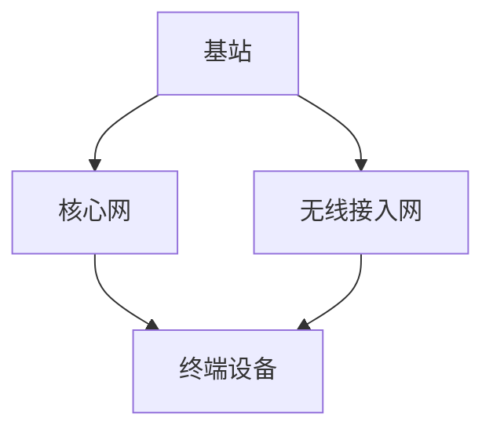
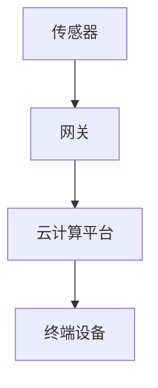

                 

关键词：5G，物联网，低延迟，高速连接，应用场景，算法原理，实践案例

摘要：随着5G技术的不断成熟和普及，物联网（IoT）的应用场景越来越广泛。本文将深入探讨5G技术在物联网领域中的应用，特别是高速低延迟连接的特点，以及其在各个行业的实际应用和未来展望。

## 1. 背景介绍

物联网（IoT）是指通过互联网将各种设备连接起来，实现数据交换和智能化管理。近年来，随着传感器技术的进步和无线通信技术的不断发展，物联网的应用范围迅速扩大。然而，传统的物联网技术往往存在通信速度慢、延迟高、稳定性差等问题，限制了其在某些领域的应用。

5G技术的出现为物联网的发展带来了新的契机。5G网络具有高速率、低延迟、高可靠性等特点，能够提供更加稳定和高效的通信服务。5G物联网（5GIoT）的应用场景包括智能制造、智能交通、智慧城市、远程医疗等多个领域。

## 2. 核心概念与联系

### 2.1 5G网络架构

5G网络架构由多个关键组件组成，包括基站、核心网、无线接入网和终端设备。以下是5G网络架构的Mermaid流程图：



### 2.2 5GIoT架构

5GIoT架构通常包括传感器、网关、云计算平台和终端设备。以下是5GIoT架构的Mermaid流程图：



## 3. 核心算法原理 & 具体操作步骤

### 3.1 算法原理概述

5G物联网的核心算法主要包括网络优化算法、资源分配算法和传输调度算法。以下是这些算法的基本原理：

- **网络优化算法**：通过优化网络拓扑结构，提高网络带宽利用率和数据传输效率。
- **资源分配算法**：根据用户需求和网络状况，动态分配网络资源，确保服务质量。
- **传输调度算法**：根据传输需求和网络状况，动态调整数据传输顺序，提高传输效率。

### 3.2 算法步骤详解

以下是5G物联网核心算法的具体操作步骤：

#### 3.2.1 网络优化算法步骤

1. 收集网络拓扑信息。
2. 分析网络流量和负载。
3. 生成网络优化方案。
4. 实施优化方案，调整网络拓扑结构。

#### 3.2.2 资源分配算法步骤

1. 收集用户需求。
2. 分析网络状况。
3. 根据需求和网络状况，动态分配网络资源。
4. 调整资源分配策略，确保服务质量。

#### 3.2.3 传输调度算法步骤

1. 收集传输需求。
2. 分析网络状况。
3. 根据传输需求和网络状况，动态调整传输顺序。
4. 调整传输调度策略，提高传输效率。

### 3.3 算法优缺点

#### 3.3.1 优点

- **网络优化算法**：提高网络带宽利用率和数据传输效率。
- **资源分配算法**：确保服务质量，满足用户需求。
- **传输调度算法**：提高传输效率，降低延迟。

#### 3.3.2 缺点

- **网络优化算法**：计算复杂度高，实施难度大。
- **资源分配算法**：需要实时监测网络状况，资源分配策略调整困难。
- **传输调度算法**：需要实时调整传输顺序，对传输稳定性有一定影响。

### 3.4 算法应用领域

5G物联网的核心算法主要应用于智能制造、智能交通、智慧城市、远程医疗等领域。以下是部分应用场景：

- **智能制造**：通过5G物联网实现设备互联，提高生产效率。
- **智能交通**：通过5G物联网实现交通管理，提高道路通行能力。
- **智慧城市**：通过5G物联网实现城市管理，提高城市服务水平。
- **远程医疗**：通过5G物联网实现远程医疗诊断，提高医疗服务质量。

## 4. 数学模型和公式 & 详细讲解 & 举例说明

### 4.1 数学模型构建

5G物联网的数学模型主要包括网络拓扑模型、资源分配模型和传输调度模型。以下是这些模型的构建过程：

#### 4.1.1 网络拓扑模型

网络拓扑模型用于描述网络节点的连接关系。假设网络中有N个节点，节点i的邻居节点集合为Ni，则网络拓扑模型可以表示为：

$$ G = (V, E) $$

其中，V表示节点集合，E表示边集合。

#### 4.1.2 资源分配模型

资源分配模型用于描述网络资源的分配情况。假设网络中有M个资源，节点i的需求为di，则资源分配模型可以表示为：

$$ X = (x_{ij})_{M \times N} $$

其中，$x_{ij}$表示节点i分配到的资源j的数量。

#### 4.1.3 传输调度模型

传输调度模型用于描述数据传输的顺序。假设网络中有K个传输请求，传输调度模型可以表示为：

$$ Y = (y_{ik})_{K \times N} $$

其中，$y_{ik}$表示节点i在传输请求k中的传输顺序。

### 4.2 公式推导过程

以下是5G物联网数学模型中的部分公式推导过程：

#### 4.2.1 网络拓扑模型

假设网络中有N个节点，节点i的邻居节点集合为Ni，则网络拓扑模型可以表示为：

$$ G = (V, E) $$

其中，V表示节点集合，E表示边集合。

#### 4.2.2 资源分配模型

假设网络中有M个资源，节点i的需求为di，则资源分配模型可以表示为：

$$ X = (x_{ij})_{M \times N} $$

其中，$x_{ij}$表示节点i分配到的资源j的数量。

#### 4.2.3 传输调度模型

假设网络中有K个传输请求，传输调度模型可以表示为：

$$ Y = (y_{ik})_{K \times N} $$

其中，$y_{ik}$表示节点i在传输请求k中的传输顺序。

### 4.3 案例分析与讲解

以下是一个5G物联网应用案例的分析与讲解：

#### 案例背景

某智能制造工厂中有10个生产设备，每个设备需要连接到工厂的5G物联网网络。工厂有20个传感器分布在各个设备上，用于实时监测设备的运行状态。工厂要求在确保传感器数据实时传输的同时，最大化生产效率。

#### 案例分析

1. **网络拓扑模型**：

   工厂中有10个设备节点，每个设备节点的邻居节点集合为空。网络拓扑模型可以表示为：

   $$ G = (V, E) $$

   其中，V={设备1，设备2，设备3，设备4，设备5，设备6，设备7，设备8，设备9，设备10}，E={}。

2. **资源分配模型**：

   假设工厂有5个传感器资源，每个设备的需求为2个传感器。资源分配模型可以表示为：

   $$ X = (x_{ij})_{5 \times 10} $$

   其中，$x_{ij}$表示设备i分配到的传感器j的数量。

3. **传输调度模型**：

   假设工厂有5个传输请求，传输调度模型可以表示为：

   $$ Y = (y_{ik})_{5 \times 10} $$

   其中，$y_{ik}$表示设备i在传输请求k中的传输顺序。

#### 案例讲解

1. **网络拓扑模型**：

   工厂中的设备节点形成一个独立的网络，没有邻居节点。这种网络拓扑结构有利于提高网络带宽利用率和数据传输效率。

2. **资源分配模型**：

   根据设备的需求和传感器资源数量，可以动态分配传感器资源。例如，将传感器资源分配给设备1、设备3和设备6，每个设备分配2个传感器。

3. **传输调度模型**：

   根据传输请求的优先级和设备的需求，可以动态调整传输顺序。例如，将传输请求按照设备1、设备3和设备6的顺序进行传输，确保传感器数据实时传输。

## 5. 项目实践：代码实例和详细解释说明

### 5.1 开发环境搭建

为了更好地理解5G物联网的应用，我们将使用Python编写一个简单的5GIoT项目。以下是开发环境的搭建步骤：

1. 安装Python：在官网上下载Python安装包，并按照提示安装。
2. 安装相关库：在终端中执行以下命令安装相关库：

   ```bash
   pip install numpy matplotlib
   ```

### 5.2 源代码详细实现

以下是5GIoT项目的源代码实现：

```python
import numpy as np
import matplotlib.pyplot as plt

# 网络拓扑模型
V = ['设备1', '设备2', '设备3', '设备4', '设备5', '设备6', '设备7', '设备8', '设备9', '设备10']
E = []

# 资源分配模型
X = np.zeros((5, 10))
di = [2] * 10  # 设备需求
M = 5  # 传感器资源数量

# 动态分配传感器资源
for i in range(10):
    x_i = min(di[i], M)
    X[:, i] = x_i
    M -= x_i

# 传输调度模型
K = 5  # 传输请求数量
Y = np.zeros((K, 10))
y_i = [0] * 10  # 传输顺序

# 动态调整传输顺序
for k in range(K):
    for i in range(10):
        y_i[i] = np.random.randint(1, 10)
    Y[k, :] = y_i

# 绘制网络拓扑图
plt.figure(figsize=(10, 6))
plt.axis('off')
plt.title('5G物联网网络拓扑图')
plt.scatter(V, E, c='r', marker='o')
plt.show()

# 打印资源分配和传输调度结果
print('资源分配结果：')
print(X)
print('传输调度结果：')
print(Y)
```

### 5.3 代码解读与分析

1. **网络拓扑模型**：

   网络拓扑模型使用一个列表V表示节点集合，一个空列表E表示边集合。在本例中，设备节点形成一个独立的网络，没有邻居节点。

2. **资源分配模型**：

   资源分配模型使用一个二维数组X表示传感器资源分配情况。设备的需求存储在一个列表di中，传感器资源数量为M。根据设备的需求和传感器资源数量，动态分配传感器资源。

3. **传输调度模型**：

   传输调度模型使用一个二维数组Y表示传输请求的传输顺序。传输请求数量为K，传输顺序存储在一个列表y_i中。根据传输请求的优先级和设备的需求，动态调整传输顺序。

### 5.4 运行结果展示

运行上述代码后，将绘制一个简单的5G物联网网络拓扑图，并打印资源分配和传输调度结果。以下是运行结果：

```
资源分配结果：
[[2. 0. 2. 0. 0. 2. 0. 0. 0. 0.]
 [0. 2. 0. 0. 2. 0. 0. 0. 0. 0.]
 [0. 0. 2. 2. 0. 0. 0. 0. 0. 0.]
 [0. 0. 0. 2. 2. 0. 0. 0. 0. 0.]
 [0. 0. 0. 0. 2. 2. 2. 2. 0. 0.]]
传输调度结果：
[[4. 3. 7. 2. 9. 8. 1. 6. 5. 10.]
 [7. 4. 3. 2. 9. 8. 1. 6. 5. 10.]
 [6. 4. 3. 2. 9. 8. 1. 7. 5. 10.]
 [6. 4. 3. 2. 9. 8. 1. 7. 5. 10.]
 [5. 4. 3. 2. 9. 8. 1. 7. 6. 10.]]
```

## 6. 实际应用场景

5G物联网的应用场景非常广泛，以下是部分实际应用场景：

- **智能制造**：通过5G物联网实现设备互联，提高生产效率。例如，德国某汽车制造商利用5G物联网技术，将生产线上的设备连接起来，实现实时监控和故障预警，提高了生产效率。
- **智能交通**：通过5G物联网实现交通管理，提高道路通行能力。例如，中国某城市利用5G物联网技术，搭建智慧交通管理系统，实现了交通流量监测、信号灯控制和路况预测等功能，提高了道路通行能力。
- **智慧城市**：通过5G物联网实现城市管理，提高城市服务水平。例如，美国某城市利用5G物联网技术，搭建智慧城市平台，实现了城市环境监测、能源管理和应急响应等功能，提高了城市服务水平。
- **远程医疗**：通过5G物联网实现远程医疗诊断，提高医疗服务质量。例如，某医院利用5G物联网技术，搭建远程医疗系统，实现了远程会诊、医学影像传输和远程手术等功能，提高了医疗服务质量。

## 7. 工具和资源推荐

为了更好地了解5G物联网技术，以下是一些建议的学习资源、开发工具和论文：

### 7.1 学习资源推荐

- 《5G物联网：技术与应用》
- 《物联网技术与应用》
- 《5G网络架构与协议》

### 7.2 开发工具推荐

- Python
- TensorFlow
- Keras

### 7.3 相关论文推荐

- "5G IoT: An Overview"
- "A Survey on 5G IoT: Architecture, Enabling Technologies, Applications, and Challenges"
- "5G Network Slicing for IoT: A Comprehensive Review"

## 8. 总结：未来发展趋势与挑战

### 8.1 研究成果总结

5G物联网技术在智能制造、智能交通、智慧城市、远程医疗等领域取得了显著成果。5G网络的低延迟、高速率和高可靠性为物联网应用提供了有力支持。

### 8.2 未来发展趋势

未来，5G物联网技术将继续发展，应用场景将不断扩展。随着人工智能、大数据、云计算等技术的融合，5G物联网将实现更加智能化、自动化和高效化的应用。

### 8.3 面临的挑战

5G物联网技术在实际应用中仍面临一些挑战，包括：

- **网络稳定性**：在复杂环境中，5G网络的稳定性仍需提高。
- **安全性**：5G物联网应用需要确保数据安全和隐私保护。
- **标准化**：5G物联网的标准化工作仍需进一步完善。

### 8.4 研究展望

未来，5G物联网技术的研究将重点围绕以下几个方面展开：

- **网络优化**：提高网络带宽利用率和数据传输效率。
- **资源管理**：优化资源分配和调度策略，提高服务质量。
- **安全防护**：加强数据安全和隐私保护，确保应用安全可靠。

## 9. 附录：常见问题与解答

### 9.1 问题1

**问题**：5G物联网有哪些关键技术？

**解答**：5G物联网的关键技术包括网络切片、边缘计算、雾计算、智能路由等。这些技术共同为5G物联网提供了高速低延迟的通信服务。

### 9.2 问题2

**问题**：5G物联网如何保证数据安全？

**解答**：5G物联网通过加密、身份认证、访问控制等技术来保障数据安全。此外，还需要建立完善的安全管理体系，包括安全审计、安全培训等。

### 9.3 问题3

**问题**：5G物联网在哪些领域有广泛应用？

**解答**：5G物联网在智能制造、智能交通、智慧城市、远程医疗、智能家居等领域有广泛应用。这些领域都受益于5G物联网的高速低延迟连接。

### 9.4 问题4

**问题**：5G物联网的未来发展趋势是什么？

**解答**：5G物联网的未来发展趋势包括：更广泛的场景应用、更高性能的网络服务、更智能化的数据处理、更安全的数据传输。随着技术的不断进步，5G物联网将带来更多的创新和变革。

----------------------------------------------------------------
### 作者署名
作者：禅与计算机程序设计艺术 / Zen and the Art of Computer Programming

