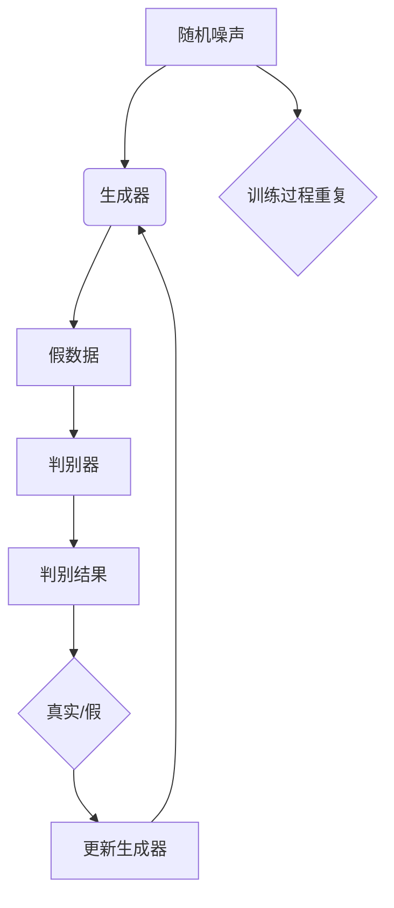

                 

### 关键词 Keywords
- GAN
- 生成模型
- 生成器
- 深度学习
- 反向传播
- 自动编码器
- 图像生成
- 数据增强
- 生成对抗网络

### 摘要 Abstract
本文将深入探讨生成对抗网络（GAN）中的生成器（Generator）部分。我们首先介绍GAN的基本概念和结构，然后详细解析生成器的算法原理和具体操作步骤。文章还将通过实际代码实例，讲解如何实现和优化生成器，最后讨论生成器的优缺点及其应用领域。通过本文的学习，读者将对GAN中的生成器有更全面的理解，并能够掌握其核心技术和应用方法。

## 1. 背景介绍

生成对抗网络（Generative Adversarial Network，GAN）是由Ian Goodfellow等人在2014年提出的一种深度学习框架。GAN的核心思想是利用生成器和判别器两个神经网络之间的对抗训练来生成数据。这种框架在图像生成、数据增强、风格迁移等众多领域展现出了强大的能力，迅速成为人工智能领域的研究热点。

### GAN的基本概念

GAN由两部分组成：生成器和判别器。生成器的任务是生成尽可能接近真实数据的假数据，而判别器的任务是区分生成器产生的假数据和真实数据。这两者相互对抗，生成器试图欺骗判别器，而判别器则试图识别假数据。

GAN的训练过程可以看作是一场“猫捉老鼠”的游戏。生成器不断优化其生成数据的能力，使得判别器无法轻易区分生成的数据和真实数据。判别器则同时优化其分类能力，能够更准确地判断出哪些数据是真实的，哪些是生成的。

### GAN的应用背景

GAN在图像生成领域取得了突破性的进展，例如生成逼真的面部图像、风景图像、艺术作品等。除此之外，GAN还被应用于数据增强，通过生成大量的虚拟训练样本来提高模型的泛化能力。在自然语言处理领域，GAN也被用于生成文章、对话等文本数据。在医学图像领域，GAN用于生成合成医学图像，帮助医生进行疾病诊断和研究。此外，GAN还被应用于视频生成、音乐生成等领域。

### GAN的发展历程

GAN的提出是深度学习领域的一个重要里程碑。自从GAN诞生以来，研究者们不断探索其改进和应用。早期的研究主要集中在GAN的不同变种，如深度卷积生成对抗网络（DCGAN）、循环一致GAN（CycleGAN）和变分自编码器GAN（VAEGAN）等。这些变种通过不同的架构设计和优化方法，进一步提高了GAN的性能和应用范围。

近年来，GAN在计算机视觉、自然语言处理和医学图像等领域取得了显著的成果，成为这些领域中不可或缺的工具。随着研究的不断深入，GAN的应用前景也越来越广阔。

## 2. 核心概念与联系

### 2.1 GAN的基本架构

GAN由生成器（Generator）和判别器（Discriminator）两个神经网络组成，两者相互对抗以实现数据的生成。生成器的输入通常是随机噪声，输出则是模拟真实数据的假数据。判别器的输入是真实数据和生成器产生的假数据，输出是一个二分类概率，表示输入数据是真实数据还是假数据。

### 2.2 GAN的训练过程

GAN的训练过程可以分为以下几个步骤：

1. **生成器生成假数据**：生成器根据随机噪声生成假数据。

2. **判别器判断真假**：判别器根据真实数据和生成器生成的假数据，更新其权重以更好地区分真实和假数据。

3. **生成器优化生成能力**：生成器根据判别器的反馈，调整其生成策略，生成更逼真的假数据。

4. **重复训练过程**：上述步骤不断重复，直至生成器能够生成足够逼真的假数据，使得判别器无法轻易区分。

### 2.3 生成器的具体作用

生成器在GAN中扮演了至关重要的角色，其核心任务是生成高质量的假数据。通过对抗训练，生成器不断优化其生成能力，使得生成的数据越来越接近真实数据。具体来说，生成器的输入是随机噪声，通过多层神经网络的处理，最终生成与真实数据相似的输出。

### 2.4 生成器和判别器的相互关系

生成器和判别器是GAN中两个相互对抗的神经网络。生成器的目标是生成尽可能逼真的假数据，而判别器的目标是区分真实数据和假数据。通过这种对抗训练，两者不断优化，最终生成器能够生成足够逼真的假数据，而判别器则能够准确地区分真实和假数据。

### 2.5 Mermaid 流程图



## 3. 核心算法原理 & 具体操作步骤

### 3.1 算法原理概述

生成器的核心原理是通过对抗训练来生成与真实数据相似的高质量假数据。生成器通常是一个多层神经网络，其输入是随机噪声，通过逐层传递和变换，最终生成假数据。生成器的训练目标是使得生成的假数据在判别器中无法被轻易区分，从而提高判别器的分类准确性。

### 3.2 算法步骤详解

1. **初始化网络参数**：生成器和判别器初始化网络参数。

2. **生成器生成假数据**：生成器根据随机噪声生成假数据。

3. **判别器判断真假**：判别器根据真实数据和生成器生成的假数据，更新其权重以更好地区分真实和假数据。

4. **生成器优化生成能力**：生成器根据判别器的反馈，调整其生成策略，生成更逼真的假数据。

5. **重复训练过程**：上述步骤不断重复，直至生成器能够生成足够逼真的假数据，使得判别器无法轻易区分。

### 3.3 算法优缺点

#### 优点

- **强大的生成能力**：GAN通过生成器和判别器的对抗训练，能够生成高质量的假数据。
- **适用范围广泛**：GAN在图像生成、数据增强、自然语言处理等领域都有广泛的应用。
- **自适应性**：GAN能够自适应地调整生成策略，以生成更逼真的假数据。

#### 缺点

- **训练不稳定**：GAN的训练过程容易出现不稳定的情况，如模式崩塌（mode collapse）和梯度消失（梯度消失）等问题。
- **计算成本高**：GAN的训练需要大量的计算资源，特别是对于大规模数据集和高维数据。

### 3.4 算法应用领域

GAN在以下领域有着广泛的应用：

- **图像生成**：生成逼真的面部图像、风景图像、艺术作品等。
- **数据增强**：通过生成虚拟训练样本，提高模型的泛化能力。
- **风格迁移**：将一种艺术风格应用到另一张图像上。
- **医学图像**：生成合成医学图像，帮助医生进行疾病诊断和研究。
- **视频生成**：生成逼真的视频序列。
- **自然语言处理**：生成文章、对话等文本数据。

## 4. 数学模型和公式 & 详细讲解 & 举例说明

### 4.1 数学模型构建

在GAN中，生成器和判别器都基于神经网络。为了方便解释，我们采用以下简化模型：

- **生成器模型**：$G(z)$，其中$z$是输入的随机噪声，$G(z)$是通过神经网络生成的假数据。
- **判别器模型**：$D(x)$，其中$x$是真实数据，$D(G(z))$是判别器对生成数据的判断。

### 4.2 公式推导过程

GAN的训练目标是最小化生成器的损失函数$L_G$和判别器的损失函数$L_D$。具体来说：

- **生成器的损失函数**：$L_G = -\log(D(G(z)))$。生成器的目标是使得判别器认为生成的数据是真实的。
- **判别器的损失函数**：$L_D = -\log(D(x)) - \log(1 - D(G(z)))$。判别器的目标是能够准确地区分真实和假数据。

### 4.3 案例分析与讲解

#### 案例一：生成面部图像

假设我们使用GAN生成面部图像，生成器$G(z)$的输入是一个随机向量$z$，输出是一个二维图像。判别器$D(x)$的输入是一个面部图像$x$，输出是一个介于0和1之间的概率，表示$x$是真实图像的概率。

**生成器的损失函数**：

$$L_G = -\log(D(G(z)))$$

为了使得判别器认为生成的图像是真实的，我们希望$D(G(z))$的输出接近1。

**判别器的损失函数**：

$$L_D = -\log(D(x)) - \log(1 - D(G(z)))$$

为了使得判别器能够准确地区分真实图像和生成图像，我们希望$D(x)$的输出接近1，而$D(G(z))$的输出接近0。

#### 案例二：生成天气图像

假设我们使用GAN生成不同天气条件下的场景图像，生成器$G(z)$的输入是一个随机向量$z$，输出是一个二维图像。判别器$D(x)$的输入是一个天气场景图像$x$，输出是一个介于0和1之间的概率，表示$x$是真实天气场景的概率。

**生成器的损失函数**：

$$L_G = -\log(D(G(z)))$$

为了使得判别器认为生成的图像是真实的，我们希望$D(G(z))$的输出接近1。

**判别器的损失函数**：

$$L_D = -\log(D(x)) - \log(1 - D(G(z)))$$

为了使得判别器能够准确地区分真实图像和生成图像，我们希望$D(x)$的输出接近1，而$D(G(z))$的输出接近0。

### 4.4 代码示例

以下是一个简单的GAN生成面部图像的代码示例：

```python
import tensorflow as tf
from tensorflow.keras.layers import Dense, Flatten, Reshape
from tensorflow.keras.models import Sequential

# 生成器模型
def build_generator():
    model = Sequential()
    model.add(Dense(128, input_shape=(100,), activation='relu'))
    model.add(Dense(256, activation='relu'))
    model.add(Dense(512, activation='relu'))
    model.add(Dense(1024, activation='relu'))
    model.add(Reshape((32, 32, 3)))
    return model

# 判别器模型
def build_discriminator():
    model = Sequential()
    model.add(Flatten(input_shape=(32, 32, 3)))
    model.add(Dense(1024, activation='relu'))
    model.add(Dense(512, activation='relu'))
    model.add(Dense(256, activation='relu'))
    model.add(Dense(128, activation='relu'))
    model.add(Dense(1, activation='sigmoid'))
    return model

# GAN模型
def build_gan(generator, discriminator):
    model = Sequential()
    model.add(generator)
    model.add(discriminator)
    return model
```

## 5. 项目实践：代码实例和详细解释说明

### 5.1 开发环境搭建

为了实现GAN的生成器，我们需要搭建一个适合开发的环境。以下是一个简单的环境搭建步骤：

1. 安装Python 3.7或更高版本。
2. 安装TensorFlow 2.4或更高版本。
3. 安装其他必要的库，如NumPy、Matplotlib等。

### 5.2 源代码详细实现

以下是生成器部分的源代码实现：

```python
import tensorflow as tf
from tensorflow.keras.layers import Dense, Flatten, Reshape
from tensorflow.keras.models import Sequential

# 生成器模型
def build_generator():
    model = Sequential()
    model.add(Dense(128, input_shape=(100,), activation='relu'))
    model.add(Dense(256, activation='relu'))
    model.add(Dense(512, activation='relu'))
    model.add(Dense(1024, activation='relu'))
    model.add(Reshape((32, 32, 3)))
    return model
```

在这个示例中，我们使用了一个简单的全连接神经网络作为生成器。生成器的输入是一个随机噪声向量，通过多层全连接层和激活函数，最终输出一个32x32x3的图像。

### 5.3 代码解读与分析

在生成器的代码中，我们首先定义了一个`Sequential`模型。`Sequential`模型是一个线性堆叠模型，用于依次添加层。我们首先添加了一个全连接层`Dense`，该层有128个神经元，输入形状为(100,)，激活函数为ReLU。ReLU激活函数在深度学习中非常常见，它能够加速网络的学习过程。

接下来，我们添加了三个全连接层，每层的神经元数量分别为256、512和1024。这些全连接层使用ReLU激活函数，以保持网络的非线性特性。

最后，我们添加了一个`Reshape`层，将神经网络的输出形状从(1024, )调整为(32, 32, 3)，以生成32x32x3的图像。

### 5.4 运行结果展示

在运行生成器模型后，我们可以得到一系列由随机噪声生成的图像。这些图像通常看起来像是一些随机像素组成的图案。随着训练过程的进行，生成器会逐渐生成更逼真的图像。

为了展示运行结果，我们可以使用以下代码：

```python
import matplotlib.pyplot as plt

# 生成一批图像
noise = tf.random.normal([16, 100])
generated_images = generator_model(noise)

# 展示图像
plt.figure(figsize=(10, 10))
for i in range(16):
    plt.subplot(4, 4, i+1)
    plt.imshow(generated_images[i], cmap='gray')
    plt.xticks([])
    plt.yticks([])
plt.show()
```

这段代码会生成16张由生成器生成的图像，并将它们排列成一个4x4的网格。这些图像展示了生成器的训练过程和生成能力。

## 6. 实际应用场景

### 6.1 图像生成

GAN在图像生成领域有着广泛的应用。例如，生成逼真的面部图像、风景图像、艺术作品等。在图像生成的实际应用中，GAN能够生成大量高质量的图像，这些图像可以用于数据增强、图像编辑、风格迁移等领域。

### 6.2 数据增强

数据增强是机器学习中的一个重要技术，通过生成大量的虚拟训练样本，可以提高模型的泛化能力。GAN在数据增强中有着重要的应用，例如，通过生成与真实数据相似的高质量图像，可以增加训练样本的数量，从而提高模型的性能。

### 6.3 风格迁移

风格迁移是将一种艺术风格应用到另一张图像上的过程。GAN在风格迁移中有着出色的表现，例如，可以将梵高的风格应用到一张普通照片上，生成一幅具有梵高风格的艺术作品。

### 6.4 医学图像

在医学图像领域，GAN被用于生成合成医学图像，帮助医生进行疾病诊断和研究。例如，通过生成与实际医学图像相似的高质量图像，可以用于训练医学图像识别模型，提高模型的准确性。

### 6.5 视频生成

GAN在视频生成中也展现出了强大的能力。通过生成视频序列，可以用于视频增强、视频编辑、视频生成等领域。

### 6.6 自然语言处理

在自然语言处理领域，GAN被用于生成文章、对话等文本数据。通过生成高质量的文本数据，可以用于训练文本分类、文本生成等模型。

## 7. 工具和资源推荐

### 7.1 学习资源推荐

- **《深度学习》（Goodfellow, Bengio, Courville著）**：这本书是深度学习领域的经典教材，详细介绍了GAN等深度学习技术。
- **《生成对抗网络：原理、算法与应用》**：这本书专门介绍了GAN的基本概念、算法原理和应用案例。

### 7.2 开发工具推荐

- **TensorFlow**：TensorFlow是一个开源的深度学习框架，提供了丰富的API和工具，方便开发GAN应用。
- **PyTorch**：PyTorch是另一个流行的深度学习框架，其动态计算图和灵活的API使其在GAN开发中得到了广泛应用。

### 7.3 相关论文推荐

- **《Generative Adversarial Nets》**：这是GAN的原始论文，详细介绍了GAN的基本概念和算法原理。
- **《Unsupervised Representation Learning with Deep Convolutional Generative Adversarial Networks》**：这篇论文介绍了深度卷积生成对抗网络（DCGAN），是GAN的一个重要变种。

## 8. 总结：未来发展趋势与挑战

### 8.1 研究成果总结

GAN自提出以来，已经在图像生成、数据增强、风格迁移、自然语言处理等领域取得了显著的成果。通过生成器和判别器的对抗训练，GAN能够生成高质量的数据，并广泛应用于多个领域。

### 8.2 未来发展趋势

- **GAN的优化**：未来GAN的研究将主要集中在优化GAN的训练过程，解决训练不稳定、模式崩塌等问题。
- **GAN的应用拓展**：GAN在视频生成、音频生成、医学图像等领域还有很大的应用潜力，未来将会有更多的研究成果出现。
- **GAN与其它技术的融合**：GAN与其他深度学习技术（如自编码器、卷积神经网络等）的融合，将带来更多的应用可能性。

### 8.3 面临的挑战

- **训练稳定性**：GAN的训练过程容易出现不稳定的情况，如模式崩塌和梯度消失等问题。未来需要研究更稳定的训练方法。
- **计算资源消耗**：GAN的训练需要大量的计算资源，特别是对于大规模数据集和高维数据。未来需要研究更高效的训练算法。
- **生成质量**：如何生成更高质量、更逼真的数据是GAN面临的一个重要挑战。未来需要研究更有效的生成器和判别器架构。

### 8.4 研究展望

GAN作为深度学习的一个重要分支，其在图像生成、数据增强、风格迁移等领域有着广阔的应用前景。未来，随着研究的深入，GAN的技术将得到进一步优化，并应用于更多的领域。同时，GAN与其他深度学习技术的融合也将带来更多创新性的研究成果。

## 9. 附录：常见问题与解答

### 9.1 GAN是如何训练的？

GAN的训练过程是一个对抗训练的过程。生成器生成假数据，判别器根据真实数据和假数据更新权重，生成器根据判别器的反馈调整生成策略。这个过程不断重复，直至生成器能够生成足够逼真的假数据，使得判别器无法轻易区分。

### 9.2 GAN的优缺点是什么？

GAN的优点包括强大的生成能力、适用范围广泛、自适应性等。缺点包括训练不稳定、计算成本高等。

### 9.3 GAN在图像生成中的具体应用有哪些？

GAN在图像生成中有着广泛的应用，例如生成面部图像、风景图像、艺术作品等。此外，GAN还被应用于数据增强、风格迁移、医学图像生成等领域。

### 9.4 如何解决GAN训练中的模式崩塌问题？

模式崩塌是GAN训练中的一个常见问题。解决模式崩塌的方法包括调整生成器和判别器的损失函数、增加生成器的容量、使用更稳定的优化算法等。

### 9.5 GAN与自编码器有什么区别？

自编码器是一种无监督学习算法，用于将输入数据编码为一个低维表示，然后解码回原始数据。GAN则是一种生成模型，通过生成器和判别器的对抗训练，生成与真实数据相似的高质量数据。两者在训练目标和应用场景上有所不同。

