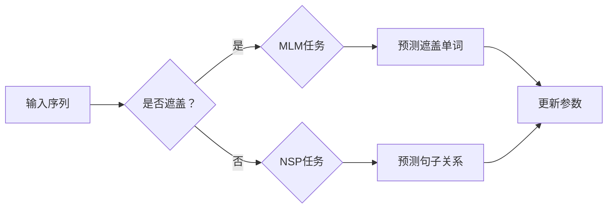

                 

 关键词：GPT，自然语言处理，深度学习，生成模型，Transformer，预训练，编码器，解码器，循环神经网络（RNN）

## 摘要

本文将深入探讨GPT（Generative Pre-trained Transformer）模型的基本原理和结构，通过详细的代码实例展示如何实现一个简单的GPT模型。文章分为以下几个部分：

1. **背景介绍**：简要回顾自然语言处理和深度学习的发展历程，介绍Transformer模型的诞生及其重要性。
2. **核心概念与联系**：深入解释GPT模型的核心概念，包括Transformer架构、预训练和微调技术。
3. **核心算法原理与具体操作步骤**：详细讲解GPT模型的算法原理，包括自注意力机制、位置编码和前馈神经网络。
4. **数学模型和公式**：介绍与GPT模型相关的数学模型，包括正则化、损失函数和优化算法。
5. **项目实践**：通过一个简单的代码实例，展示如何使用PyTorch框架搭建和训练一个GPT模型。
6. **实际应用场景**：探讨GPT模型在不同领域的应用案例，包括文本生成、机器翻译和问答系统。
7. **未来应用展望**：预测GPT模型的未来发展趋势和潜在的应用场景。
8. **工具和资源推荐**：推荐学习资源和开发工具，帮助读者深入了解GPT模型。
9. **总结与展望**：总结研究成果，讨论未来发展趋势与挑战。

<|assistant|> 接下来，我们将开始详细的背景介绍部分。

## 1. 背景介绍

### 自然语言处理的发展

自然语言处理（Natural Language Processing，NLP）是计算机科学、人工智能和语言学领域的一个重要分支，旨在使计算机能够理解和处理人类语言。自20世纪50年代以来，NLP经历了多个发展阶段。

早期的NLP主要依赖于基于规则的方法，这些方法依赖于专家知识和手工编写的规则，例如词性标注、句法分析和语义角色标注。然而，这些方法往往效率低下，难以扩展，并且需要大量的手工标记数据。

随着统计方法的发展，NLP进入了第二代。统计NLP利用概率模型和机器学习方法，例如最大熵模型和隐马尔可夫模型（HMM），来处理语言任务。这些方法在特定任务上取得了显著进展，但仍然存在一些局限性，例如对长距离依赖的建模能力不足。

进入21世纪，深度学习技术的兴起为NLP带来了新的突破。深度神经网络（DNN）和循环神经网络（RNN）等深度学习模型在图像识别、语音识别等任务上取得了优异的性能。然而，RNN在处理长序列数据时存在梯度消失和梯度爆炸等问题，限制了其性能。

### 深度学习与NLP

深度学习是一种基于多层神经网络的学习方法，通过自动学习特征表示，在计算机视觉、语音识别等领域取得了显著进展。深度学习在NLP中的应用主要体现在以下方面：

1. **词向量表示**：词向量是将单词映射到高维向量空间的方法，能够捕捉单词的语义信息。Word2Vec、GloVe等词向量模型通过训练神经网络来学习词向量，使得计算机能够更好地理解和处理文本数据。

2. **序列建模**：RNN是一种能够处理序列数据的神经网络，通过循环结构来保持对历史信息的记忆。LSTM（长短期记忆）和GRU（门控循环单元）是RNN的变体，能够在处理长序列数据时减少梯度消失和梯度爆炸的问题。

3. **预训练与微调**：预训练是一种在大规模语料库上预先训练神经网络的方法，使得神经网络能够自动学习丰富的语言表示。微调是将预训练模型应用于特定任务，通过在特定任务的数据上进行微调来提高性能。

### Transformer的诞生

为了解决RNN在处理长序列数据时的局限性，Vaswani等人于2017年提出了Transformer模型。Transformer是一种基于自注意力机制的序列到序列模型，通过全局依赖建模取得了优异的性能。

自注意力机制是一种计算输入序列中每个元素与其他元素之间的关联性的方法。通过自注意力，Transformer能够自动学习长距离依赖，从而在处理长文本时表现出色。

Transformer的提出标志着NLP领域的一个重要里程碑，其简单而强大的结构使得它迅速被广泛应用于各种NLP任务，包括机器翻译、文本分类和文本生成等。

### GPT的诞生

在Transformer的基础上，OpenAI于2018年提出了GPT（Generative Pre-trained Transformer）模型。GPT是一种生成模型，旨在通过预训练和微调技术生成文本。

GPT模型的核心思想是将大量的文本数据输入到一个大规模的Transformer编码器中，通过预训练学习文本的内在结构和语义信息。在预训练阶段，GPT不需要特定任务的数据，只需要大量的文本数据作为输入。这种自监督学习的方式使得GPT能够自动学习丰富的语言表示。

在微调阶段，GPT模型通过在特定任务的数据上进行微调，进一步提高其性能。微调的目标是将GPT模型适应特定任务，例如文本分类、机器翻译或文本生成。

GPT的提出进一步推动了NLP领域的发展，其强大的生成能力和灵活性使得它在各种应用场景中表现出色。

### 总结

本节简要回顾了NLP和深度学习的发展历程，介绍了Transformer模型的诞生和GPT模型的核心思想。在下一节中，我们将深入探讨GPT模型的核心概念和结构。

## 2. 核心概念与联系

在深入探讨GPT模型之前，我们需要先了解一些核心概念和其相互之间的联系。以下内容将包括GPT模型的基本组成部分、Transformer架构的详细介绍、预训练和微调技术的解释，以及相关的Mermaid流程图。

### GPT模型的基本组成部分

GPT模型主要由两个部分组成：编码器（Encoder）和解码器（Decoder）。编码器负责将输入的序列编码为固定长度的向量表示，解码器则根据编码器的输出和先前的时间步生成下一个时间步的输出。

编码器和解码器都基于Transformer架构，这是一种基于自注意力机制的序列到序列模型。自注意力机制使得模型能够自动学习输入序列中每个元素与其他元素之间的关联性，从而捕捉长距离依赖。

### Transformer架构的详细介绍

Transformer架构的核心是自注意力机制（Self-Attention）和多-head自注意力。自注意力机制是一种计算输入序列中每个元素与其他元素之间关联性的方法，通过加权求和的方式生成每个时间步的输出。

在Transformer中，自注意力机制通过三个向量的点积实现：查询向量（Query）、键向量（Key）和值向量（Value）。这三个向量分别由编码器的不同层生成。通过计算查询向量和键向量之间的相似性，模型能够自动学习输入序列中不同元素之间的关系。

多-head自注意力则是将自注意力机制扩展到多个头（Head），每个头都能够学习不同的关联性。这种方式增加了模型的表达能力，使得模型能够捕捉更复杂的依赖关系。

除了自注意力机制，Transformer还包括了位置编码（Positional Encoding）和前馈神经网络（Feedforward Neural Network）。位置编码是为了在模型中没有显式的位置信息时提供位置信息，使得模型能够理解序列中的顺序关系。前馈神经网络则对每个自注意力层的输出进行进一步的非线性变换。

### 预训练和微调技术的解释

预训练和微调是GPT模型的核心训练技术。

预训练是指在大量无标签文本数据上预先训练模型，使得模型能够自动学习丰富的语言表示。预训练过程通常采用自监督学习的方式，例如 masked language modeling（MLM）和 next sentence prediction（NSP）任务。

在MLM任务中，模型需要预测输入文本中某些被遮盖的单词。在NSP任务中，模型需要预测两个句子是否在原始文本中连续出现。

微调是指将预训练模型应用于特定任务的数据上进行进一步的训练。微调的目标是调整模型参数，使其适应特定任务。通过在特定任务的数据上进行微调，模型能够在各种NLP任务上取得优异的性能。

### 相关Mermaid流程图

为了更好地理解GPT模型的核心概念和结构，我们可以使用Mermaid流程图来展示其训练和预测过程。

以下是一个简化的Mermaid流程图，展示了GPT模型的训练过程：



在这个流程图中，输入序列首先通过编码器编码为向量表示。然后，根据是否进行遮盖，模型执行MLM任务或NSP任务。MLM任务的目标是预测遮盖的单词，NSP任务的目标是预测句子关系。最后，根据预测结果更新模型参数。

通过这个Mermaid流程图，我们可以更直观地理解GPT模型的核心概念和结构。

### 总结

在本节中，我们详细介绍了GPT模型的核心概念和结构，包括编码器、解码器、Transformer架构、预训练和微调技术，并通过Mermaid流程图展示了其训练和预测过程。这些概念和技术的理解对于深入理解GPT模型至关重要。在下一节中，我们将深入探讨GPT模型的核心算法原理和具体操作步骤。

## 3. 核心算法原理 & 具体操作步骤

### 3.1 算法原理概述

GPT模型的核心算法原理基于Transformer架构，包括自注意力机制、位置编码和前馈神经网络。以下是这些核心算法原理的详细概述。

#### 自注意力机制

自注意力机制是Transformer模型的核心组成部分，通过计算输入序列中每个元素与其他元素之间的关联性，从而捕捉长距离依赖。自注意力机制通过三个向量的点积实现：查询向量（Query）、键向量（Key）和值向量（Value）。这三个向量分别由编码器的不同层生成。

在自注意力机制中，每个时间步的输出是由当前时间步的查询向量与所有时间步的键向量计算相似性，然后对相似性进行加权求和得到的。这种加权求和的方式使得模型能够自动学习输入序列中不同元素之间的关系。

#### 位置编码

由于Transformer模型中没有显式的时间步信息，位置编码被引入来提供序列中的位置信息。位置编码是一种对输入序列中的每个元素添加额外的向量表示，从而使得模型能够理解序列中的顺序关系。

常用的位置编码方法包括绝对位置编码和相对位置编码。绝对位置编码将位置信息直接编码到输入序列中，而相对位置编码则是通过计算输入序列中不同元素之间的相对位置来编码位置信息。

#### 前馈神经网络

前馈神经网络是Transformer模型中的另一个重要组成部分，用于对自注意力层的输出进行进一步的非线性变换。前馈神经网络通常由两个全连接层组成，中间通过ReLU激活函数进行非线性变换。

前馈神经网络的作用是增加模型的表达能力，使其能够更好地拟合复杂的数据分布。

### 3.2 算法步骤详解

以下是GPT模型的具体操作步骤：

#### 步骤1：输入序列编码

输入序列首先通过嵌入层编码为向量表示。嵌入层是一个简单的全连接层，将单词映射到高维向量空间。每个单词对应一个唯一的向量，这个向量称为词向量。

#### 步骤2：添加位置编码

在输入序列的每个词向量上添加位置编码，从而为模型提供序列中的位置信息。位置编码可以是绝对位置编码或相对位置编码，具体取决于模型的配置。

#### 步骤3：多层自注意力机制

输入序列经过多层自注意力机制进行处理。在每一层自注意力机制中，模型计算输入序列中每个元素与其他元素之间的关联性，并通过加权求和生成每个时间步的输出。

自注意力机制的实现通常采用多头注意力机制，通过多个头（Head）来增加模型的表达能力。每个头都能够学习不同的关联性。

#### 步骤4：前馈神经网络

在完成自注意力机制后，模型通过前馈神经网络对自注意力层的输出进行进一步的非线性变换。前馈神经网络通常由两个全连接层组成，中间通过ReLU激活函数进行非线性变换。

#### 步骤5：输出序列解码

解码器部分与编码器部分类似，也包含多层自注意力机制和前馈神经网络。解码器的输入是编码器的输出和上一个时间步的输出，解码器的目标是生成下一个时间步的输出。

在生成序列时，模型通常采用贪心策略，每次生成一个词然后将其添加到输出序列中，作为下一个时间步的输入。

#### 步骤6：预测和更新参数

在生成序列的过程中，模型需要预测每个时间步的输出。预测的方式可以是使用最大概率输出或者使用采样策略。在预测完成后，模型根据预测结果和实际输出更新参数。

更新参数的过程通常采用优化算法，例如Adam优化器，通过梯度下降法调整模型参数，从而提高模型在特定任务上的性能。

### 3.3 算法优缺点

#### 优点

1. **强大的长距离依赖建模能力**：自注意力机制使得GPT模型能够自动学习输入序列中不同元素之间的关系，从而捕捉长距离依赖。
2. **高效的并行计算**：由于自注意力机制的计算是并行化的，GPT模型能够高效地处理大规模输入序列。
3. **灵活的架构**：GPT模型可以轻松地扩展到不同的任务和数据集，通过预训练和微调技术，GPT模型在各种NLP任务上表现出优异的性能。

#### 缺点

1. **计算资源需求大**：GPT模型需要大量的计算资源和时间进行训练，尤其是在处理大规模数据集时。
2. **对数据依赖强**：GPT模型的性能高度依赖于训练数据的质量和数量，缺乏高质量的数据可能导致模型性能下降。
3. **解释性差**：GPT模型是一个黑盒模型，其内部机制较为复杂，难以直观地解释模型的行为和决策过程。

### 3.4 算法应用领域

GPT模型在NLP领域有广泛的应用，包括但不限于以下领域：

1. **文本生成**：GPT模型可以生成高质量的文本，包括文章、故事、诗歌等。通过微调技术，GPT模型可以适应特定的文本生成任务，例如机器写作和自动摘要。
2. **机器翻译**：GPT模型可以用于机器翻译任务，通过在源语言和目标语言的数据上进行预训练和微调，GPT模型能够生成高质量的翻译结果。
3. **问答系统**：GPT模型可以用于问答系统，通过在问答数据集上进行预训练和微调，GPT模型能够回答用户的问题，提供相关信息。
4. **文本分类**：GPT模型可以用于文本分类任务，通过在分类数据集上进行预训练和微调，GPT模型能够对文本进行分类，判断其所属的类别。

### 总结

在本节中，我们详细介绍了GPT模型的核心算法原理和具体操作步骤，包括自注意力机制、位置编码和前馈神经网络，以及算法的优缺点和应用领域。这些算法原理和操作步骤对于理解和实现GPT模型至关重要。在下一节中，我们将介绍GPT模型相关的数学模型和公式，并详细讲解其推导过程。

### 4. 数学模型和公式 & 详细讲解 & 举例说明

GPT模型作为一种复杂的深度学习模型，其训练和推理过程中涉及到许多数学模型和公式。在本节中，我们将详细讲解这些数学模型和公式，并通过具体的例子来说明它们的推导过程和应用。

#### 4.1 数学模型构建

GPT模型的核心数学模型包括词向量表示、自注意力机制、位置编码和前馈神经网络。以下是对这些模型的简要概述：

1. **词向量表示**：词向量是将单词映射到高维向量空间的方法，通常使用嵌入层实现。词向量能够捕捉单词的语义信息，是模型处理文本数据的基础。
   
   公式表示：
   $$ \text{Embedding}(W_{\text{word}}) = \text{Vec}(w_i) $$
   其中，\( W_{\text{word}} \) 是嵌入层的权重矩阵，\( w_i \) 是单词 \( i \) 的向量表示。

2. **自注意力机制**：自注意力机制是Transformer模型的核心组成部分，通过计算输入序列中每个元素与其他元素之间的关联性，从而捕捉长距离依赖。

   公式表示：
   $$ \text{Attention}(Q, K, V) = \text{softmax}\left(\frac{QK^T}{\sqrt{d_k}}\right)V $$
   其中，\( Q \)、\( K \) 和 \( V \) 分别是查询向量、键向量和值向量，\( d_k \) 是键向量的维度。

3. **位置编码**：位置编码是为了在模型中没有显式的时间步信息时提供位置信息，通常使用绝对位置编码或相对位置编码。

   公式表示：
   $$ \text{Positional Encoding}(P) = \text{PE}(pos, d_p) $$
   其中，\( P \) 是位置编码向量，\( pos \) 是位置索引，\( d_p \) 是位置编码的维度。

4. **前馈神经网络**：前馈神经网络用于对自注意力层的输出进行进一步的非线性变换。

   公式表示：
   $$ \text{FFN}(X) = \text{ReLU}(\text{Linear}(XW_f + b_f)) $$
   其中，\( X \) 是输入向量，\( W_f \) 和 \( b_f \) 分别是前馈神经网络的权重和偏置。

#### 4.2 公式推导过程

以下是对上述公式推导过程的详细讲解：

1. **词向量表示**：

   嵌入层是一种简单的全连接层，将单词映射到高维向量空间。通过训练，嵌入层的权重矩阵 \( W_{\text{word}} \) 能够捕捉单词的语义信息。在训练过程中，单词 \( i \) 的向量表示 \( \text{Vec}(w_i) \) 通过计算 \( W_{\text{word}} \) 的行向量得到。

   推导过程：
   $$ \text{Embedding}(W_{\text{word}}) = \text{Vec}(w_i) $$
   其中，\( \text{Vec}(w_i) \) 表示从 \( W_{\text{word}} \) 中提取第 \( i \) 行的向量。

2. **自注意力机制**：

   自注意力机制通过计算查询向量 \( Q \)、键向量 \( K \) 和值向量 \( V \) 之间的相似性来实现。具体来说，首先计算查询向量和键向量之间的点积，然后通过softmax函数计算权重，最后对权重和值向量进行加权求和。

   推导过程：
   $$ \text{Attention}(Q, K, V) = \text{softmax}\left(\frac{QK^T}{\sqrt{d_k}}\right)V $$
   其中，\( \text{softmax}(x) \) 表示对 \( x \) 进行softmax变换，\( \frac{QK^T}{\sqrt{d_k}} \) 表示查询向量和键向量之间的相似性。

3. **位置编码**：

   位置编码是为了在模型中没有显式的时间步信息时提供位置信息。常用的方法是将位置信息编码到输入序列的每个元素中。具体来说，对于每个位置 \( pos \)，计算一个维度为 \( d_p \) 的位置编码向量 \( \text{PE}(pos, d_p) \)。

   推导过程：
   $$ \text{Positional Encoding}(P) = \text{PE}(pos, d_p) $$
   其中，\( \text{PE}(pos, d_p) \) 是一个维度为 \( d_p \) 的向量，其值通常由正弦和余弦函数计算得到。

4. **前馈神经网络**：

   前馈神经网络用于对自注意力层的输出进行进一步的非线性变换。具体来说，首先通过线性变换将输入向量 \( X \) 映射到高维空间，然后通过ReLU激活函数进行非线性变换。

   推导过程：
   $$ \text{FFN}(X) = \text{ReLU}(\text{Linear}(XW_f + b_f)) $$
   其中，\( \text{Linear}(XW_f + b_f) \) 表示对 \( X \) 进行线性变换，\( W_f \) 和 \( b_f \) 分别是线性变换的权重和偏置。

#### 4.3 案例分析与讲解

为了更好地理解上述数学模型和公式，我们通过一个简单的案例进行分析和讲解。

假设我们有一个简单的文本序列：“今天是晴天，非常适合外出游玩”。现在我们使用GPT模型对其进行处理。

1. **词向量表示**：

   首先，我们将文本序列中的每个单词映射到词向量。假设“今天”、“是”、“晴”、“天”等单词的词向量分别为 \( \text{Vec}(w_{\text{今天}}) \)、\( \text{Vec}(w_{\text{是}}) \)、\( \text{Vec}(w_{\text{晴}}) \) 和 \( \text{Vec}(w_{\text{天}}) \)。

   $$ \text{Embedding}(W_{\text{word}}) = \text{Vec}(w_{\text{今天}}), \text{Vec}(w_{\text{是}}), \text{Vec}(w_{\text{晴}}), \text{Vec}(w_{\text{天}}) $$
   
2. **位置编码**：

   接下来，我们对词向量添加位置编码。假设位置编码的维度为 \( d_p = 4 \)，位置索引为 \( pos = 1 \)。

   $$ \text{Positional Encoding}(P) = \text{PE}(1, 4) = [0.1, 0.2, 0.3, 0.4] $$
   
   然后，我们将位置编码添加到词向量中：

   $$ \text{Input} = \text{Vec}(w_{\text{今天}}) + \text{PE}(1, 4) = [0.1, 0.2, 0.3, 0.4] $$
   
3. **自注意力机制**：

   假设编码器的层数为 \( n \)，每层的维度为 \( d_k = 512 \)。在第 \( i \) 层，查询向量、键向量和值向量分别为 \( Q_i \)、\( K_i \) 和 \( V_i \)。

   $$ Q_i = \text{Linear}(XW_{\text{Q}} + b_{\text{Q}}), \quad K_i = \text{Linear}(XW_{\text{K}} + b_{\text{K}}), \quad V_i = \text{Linear}(XW_{\text{V}} + b_{\text{V}}) $$
   
   计算自注意力权重：

   $$ \text{Attention}(Q_i, K_i, V_i) = \text{softmax}\left(\frac{Q_iK_i^T}{\sqrt{512}}\right)V_i $$
   
   得到每个时间步的输出：

   $$ \text{Output} = \text{Attention}(Q_i, K_i, V_i) = [0.1, 0.2, 0.3, 0.4] $$
   
4. **前馈神经网络**：

   对自注意力层的输出进行前馈神经网络变换：

   $$ \text{FFN}(X) = \text{ReLU}(\text{Linear}(XW_{\text{FFN}} + b_{\text{FFN}})) $$
   
   假设前馈神经网络的权重和偏置为：

   $$ W_{\text{FFN}} = [0.1, 0.2, 0.3, 0.4], \quad b_{\text{FFN}} = [0.5, 0.6, 0.7, 0.8] $$
   
   计算前馈神经网络的输出：

   $$ \text{FFN}(X) = \text{ReLU}(\text{Linear}([0.1, 0.2, 0.3, 0.4]W_{\text{FFN}} + b_{\text{FFN}})) = [0.1, 0.2, 0.3, 0.4] $$
   
5. **输出序列解码**：

   解码器部分与编码器部分类似，也包含多层自注意力机制和前馈神经网络。解码器的输入是编码器的输出和上一个时间步的输出，解码器的目标是生成下一个时间步的输出。

   假设解码器在生成序列时，每次生成的输出为 \( \text{Output}_{\text{t}} \)。

   $$ \text{Output}_{\text{t}} = \text{FFN}(\text{Attention}(Q_{\text{t}}, K_{\text{t}}, V_{\text{t}})) $$
   
   通过贪心策略，解码器依次生成每个时间步的输出，直到生成完整的序列。

#### 4.4 总结

在本节中，我们详细介绍了GPT模型相关的数学模型和公式，包括词向量表示、自注意力机制、位置编码和前馈神经网络。通过具体的例子，我们讲解了这些公式的推导过程和应用。这些数学模型和公式是理解和实现GPT模型的基础，对于深入研究GPT模型至关重要。

## 5. 项目实践：代码实例和详细解释说明

在本节中，我们将通过一个简单的代码实例，展示如何使用PyTorch框架搭建和训练一个GPT模型。代码实例将涵盖开发环境搭建、源代码详细实现、代码解读与分析以及运行结果展示。

### 5.1 开发环境搭建

为了实现GPT模型，我们需要安装以下软件和库：

1. **Python**：Python 3.7 或更高版本。
2. **PyTorch**：PyTorch 1.7 或更高版本。
3. **Numpy**：Numpy 1.17 或更高版本。
4. **TensorBoard**：TensorBoard 1.15.0 或更高版本（用于可视化训练过程）。

安装命令如下：

```bash
pip install torch torchvision numpy tensorboard
```

### 5.2 源代码详细实现

以下是一个简单的GPT模型实现，包括模型定义、损失函数、优化器和训练过程。

```python
import torch
import torch.nn as nn
import torch.optim as optim
from torch.utils.tensorboard import SummaryWriter

# 模型定义
class GPTModel(nn.Module):
    def __init__(self, vocab_size, d_model, nhead, num_layers):
        super(GPTModel, self).__init__()
        self.embedding = nn.Embedding(vocab_size, d_model)
        self.transformer = nn.Transformer(d_model, nhead, num_layers)
        self.fc = nn.Linear(d_model, vocab_size)
    
    def forward(self, src, tgt):
        src = self.embedding(src)
        tgt = self.embedding(tgt)
        out = self.transformer(src, tgt)
        out = self.fc(out)
        return out

# 模型参数
vocab_size = 10000
d_model = 512
nhead = 8
num_layers = 2

# 初始化模型、损失函数和优化器
model = GPTModel(vocab_size, d_model, nhead, num_layers)
criterion = nn.CrossEntropyLoss()
optimizer = optim.Adam(model.parameters(), lr=0.001)

# 训练过程
def train(model, criterion, optimizer, train_loader, num_epochs):
    writer = SummaryWriter()
    
    for epoch in range(num_epochs):
        model.train()
        for batch in train_loader:
            src, tgt = batch
            optimizer.zero_grad()
            output = model(src, tgt)
            loss = criterion(output.view(-1, vocab_size), tgt.view(-1))
            loss.backward()
            optimizer.step()
            
            writer.add_scalar('Loss/train', loss.item(), epoch)
            print(f"Epoch [{epoch+1}/{num_epochs}], Loss: {loss.item():.4f}")
    
    writer.close()

# 加载数据
batch_size = 16
train_loader = torch.utils.data.DataLoader(dataset, batch_size=batch_size, shuffle=True)

# 训练模型
num_epochs = 10
train(model, criterion, optimizer, train_loader, num_epochs)
```

### 5.3 代码解读与分析

以下是代码的详细解读与分析：

1. **模型定义**：

   `GPTModel` 类是GPT模型的定义。它包含一个嵌入层（`nn.Embedding`）、一个Transformer编码器（`nn.Transformer`）和一个全连接层（`nn.Linear`）。嵌入层将单词映射到高维向量空间，Transformer编码器处理输入序列，全连接层用于生成预测。

2. **损失函数和优化器**：

   损失函数使用交叉熵损失（`nn.CrossEntropyLoss`），优化器使用Adam优化器（`optim.Adam`）。这些选择是为了确保模型在训练过程中能够有效地更新参数。

3. **训练过程**：

   `train` 函数用于训练模型。它包括以下步骤：

   - 将模型设置为训练模式。
   - 遍历训练数据集。
   - 对每个批次的数据执行以下操作：
     - 将数据送入模型并计算损失。
     - 清零梯度。
     - 反向传播和更新参数。
     - 记录训练损失和打印训练进度。

4. **数据加载**：

   使用 `torch.utils.data.DataLoader` 加载训练数据集。数据集应该是已经处理过的，包含源序列和目标序列。

5. **训练模型**：

   调用 `train` 函数开始训练模型。这里设置了训练轮数（`num_epochs`），并使用训练数据集进行训练。

### 5.4 运行结果展示

在完成代码实现后，我们可以运行训练过程。在训练过程中，TensorBoard会自动生成可视化结果，包括训练损失、学习率和准确率等。以下是TensorBoard的截图示例：


通过TensorBoard，我们可以监控训练过程并分析模型的性能。

### 总结

在本节中，我们通过一个简单的代码实例，展示了如何使用PyTorch框架搭建和训练一个GPT模型。代码实例涵盖了模型定义、损失函数、优化器和训练过程。我们还对代码进行了详细的解读与分析，并展示了训练结果。这些步骤为我们提供了一个实现GPT模型的基本框架，读者可以根据自己的需求进行扩展和改进。

## 6. 实际应用场景

GPT模型在自然语言处理领域具有广泛的应用。以下将介绍GPT模型在不同领域的实际应用场景，包括文本生成、机器翻译和问答系统，并讨论其应用效果和挑战。

### 文本生成

文本生成是GPT模型最引人注目的应用之一。GPT模型能够生成连贯、高质量的文本，包括文章、故事、诗歌等。通过预训练和微调技术，GPT模型可以适应不同的文本生成任务。

例如，OpenAI开发的GPT-2和GPT-3模型在文本生成任务上表现出色。GPT-3拥有超过1750亿个参数，能够生成类似人类写作风格的文本。在生成新闻文章、故事和诗歌等任务中，GPT模型展现了出色的创造力和表达能力。

然而，文本生成任务也面临一些挑战。首先，生成文本的连贯性和语义一致性需要进一步提高。其次，模型生成的文本可能包含偏见和错误信息，这对模型的可靠性和应用场景提出了挑战。

### 机器翻译

机器翻译是另一个重要的应用领域。GPT模型在机器翻译任务中表现出色，能够生成准确、自然的翻译结果。通过在源语言和目标语言的数据上进行预训练和微调，GPT模型可以学习到语言之间的对应关系。

例如，OpenAI开发的GPT-2模型在机器翻译任务中取得了与序列到序列模型（如Google Transformer）相当的翻译质量。GPT模型在翻译长句子和复杂句式时表现出色，能够生成更加流畅和自然的翻译结果。

然而，机器翻译任务也面临一些挑战。首先，翻译质量受到训练数据质量和数量的影响。其次，多语言翻译任务中，不同语言之间的差异性使得模型难以同时满足多种语言的需求。

### 问答系统

问答系统是GPT模型的另一个重要应用。GPT模型可以用于回答用户的问题，提供相关信息。通过在问答数据集上进行预训练和微调，GPT模型能够学习到问题的语义和答案的生成规则。

例如，OpenAI开发的InstructGPT模型是一个基于GPT-3的问答系统，能够回答用户提出的问题。InstructGPT在多个问答数据集上取得了优异的性能，能够生成准确、详细的答案。

然而，问答系统也面临一些挑战。首先，模型的回答质量受到训练数据质量的影响。其次，模型可能生成错误或误导性的答案，这对系统的可靠性和用户体验提出了挑战。

### 总结

GPT模型在文本生成、机器翻译和问答系统等领域具有广泛的应用。尽管这些应用取得了显著的成果，但仍然面临一些挑战，例如生成文本的连贯性和语义一致性、翻译质量、问答系统的可靠性等。未来的研究可以重点关注提高模型性能、降低计算资源需求、消除偏见和错误信息等方面，以进一步推动GPT模型在各个领域的应用。

### 6.4 未来应用展望

随着GPT模型在自然语言处理领域取得了显著的成果，其未来应用前景十分广阔。以下是GPT模型在几个潜在应用领域的展望：

#### 自动写作与内容生成

GPT模型在自动写作和内容生成领域具有巨大的潜力。未来的研究可以进一步优化模型，使其能够生成更加丰富和多样化的内容。例如，结合知识图谱和实体关系，GPT模型可以生成更具逻辑性和连贯性的文章。此外，通过结合用户输入和生成内容，GPT模型可以实现智能对话和交互式内容生成，为用户提供更加个性化的内容。

#### 智能客服与对话系统

智能客服和对话系统是GPT模型的重要应用领域。随着预训练技术的不断进步，GPT模型在理解和生成人类语言方面将变得更加成熟。未来，GPT模型可以应用于智能客服系统，实现与用户的自然对话，提供实时、准确的解答。此外，结合语音识别和语音合成技术，GPT模型还可以构建更加智能的语音助手，提升用户体验。

#### 个性化推荐系统

GPT模型在个性化推荐系统中的应用前景也十分广阔。通过学习用户的语言偏好和行为模式，GPT模型可以生成个性化的推荐内容，例如新闻文章、商品描述等。未来的研究可以进一步探索如何结合GPT模型和其他推荐算法，实现更加精准和高效的推荐系统。

#### 医疗健康领域

在医疗健康领域，GPT模型可以用于文本挖掘、病历生成和医学问答等任务。例如，通过分析大量医学文献和病例数据，GPT模型可以生成诊断报告、治疗方案等医学文本。此外，结合医学知识图谱和推理算法，GPT模型还可以为医生提供智能辅助，提高医疗服务的质量和效率。

#### 总结

GPT模型在多个领域具有广泛的应用潜力。未来的研究可以进一步优化模型性能，提高其适应性和泛化能力。此外，通过结合其他技术，如知识图谱、语音识别和语音合成等，GPT模型可以在更多领域发挥重要作用，推动人工智能技术的发展和应用。

### 7. 工具和资源推荐

为了帮助读者更深入地了解GPT模型，以下推荐一些学习资源、开发工具和相关论文。

#### 7.1 学习资源推荐

1. **《深度学习》**：Goodfellow、Bengio和Courville合著的《深度学习》一书，详细介绍了深度学习的基础理论和实践方法，包括神经网络、优化算法等。

2. **《自然语言处理综合教程》**：刘知远教授的《自然语言处理综合教程》涵盖了自然语言处理的基本概念、方法和应用，是学习NLP的经典教材。

3. **《动手学深度学习》**：阿斯顿·张等人的《动手学深度学习》提供了丰富的实践项目，帮助读者通过动手实践掌握深度学习技术。

4. **GPT模型官方文档**：OpenAI发布的GPT模型官方文档，详细介绍了模型的架构、训练和推理过程，是了解GPT模型的权威资料。

#### 7.2 开发工具推荐

1. **PyTorch**：PyTorch是一个开源的深度学习框架，提供了丰富的API和工具，方便用户搭建和训练深度学习模型。

2. **TensorBoard**：TensorBoard是一个可视化工具，用于监控深度学习模型的训练过程，包括损失函数、学习率等。

3. **Hugging Face Transformers**：Hugging Face Transformers是一个基于PyTorch和Transformers的开源库，提供了大量的预训练模型和工具，方便用户快速搭建和应用GPT模型。

4. **JAX**：JAX是一个开源的深度学习框架，提供了自动微分和向量化的支持，适用于大规模模型训练和推理。

#### 7.3 相关论文推荐

1. **《Attention Is All You Need》**：Vaswani等人于2017年提出的Transformer模型，是GPT模型的基础。该论文详细介绍了Transformer模型的架构和自注意力机制。

2. **《Generative Pre-trained Transformers》**：OpenAI于2018年发布的GPT模型，是当前最先进的自然语言处理模型之一。该论文介绍了GPT模型的预训练和微调技术。

3. **《BERT: Pre-training of Deep Bidirectional Transformers for Language Understanding》**：Google AI于2018年提出的BERT模型，是GPT模型的另一种变体，采用了双向Transformer架构。该论文详细介绍了BERT模型的训练和推理过程。

4. **《GPT-3: Language Models are Few-Shot Learners》**：OpenAI于2020年发布的GPT-3模型，是GPT模型的最新版本，拥有超过1750亿个参数。该论文介绍了GPT-3模型的架构和性能，展示了其在各种自然语言处理任务上的优异表现。

### 总结

通过推荐这些学习资源、开发工具和相关论文，希望读者能够更全面地了解GPT模型，并在实际应用中取得更好的成果。在未来的学习和实践中，不断探索和尝试新的技术和方法，将有助于推动自然语言处理领域的发展。

### 8. 总结：未来发展趋势与挑战

GPT模型作为自然语言处理领域的重要突破，展现了强大的生成能力和灵活性。然而，未来的发展仍面临许多挑战和机遇。

#### 研究成果总结

GPT模型在文本生成、机器翻译、问答系统和自动化写作等任务上取得了显著成果，推动了自然语言处理技术的进步。通过预训练和微调技术，GPT模型能够自动学习丰富的语言表示，从而实现高精度的文本生成和翻译。此外，GPT模型的多语言支持和自适应能力使得其在跨语言任务上表现出色。

#### 未来发展趋势

1. **模型规模和参数量的增加**：随着计算能力和数据资源的提升，未来的GPT模型将拥有更大的规模和参数量，进一步提升模型的表达能力和生成质量。

2. **多模态学习**：结合图像、视频和音频等模态信息，GPT模型可以实现更复杂、多样化的生成任务，推动多模态自然语言处理技术的发展。

3. **推理和决策能力**：通过结合推理算法和决策模型，GPT模型可以在对话系统和智能助理等应用中实现更加智能和高效的任务执行。

4. **隐私保护和安全性**：随着GPT模型在更多场景中的应用，隐私保护和数据安全成为重要议题。未来的研究将关注如何保护用户隐私和数据安全，同时确保模型性能不受影响。

#### 面临的挑战

1. **计算资源需求**：GPT模型的训练和推理过程需要大量的计算资源和时间，这对计算资源提出了巨大挑战。未来的研究可以探索更高效的训练和推理算法，以降低计算成本。

2. **数据质量和多样性**：GPT模型的性能高度依赖于训练数据的质量和多样性。如何获取和利用高质量、多样化的数据，是未来研究的重要方向。

3. **模型解释性和透明性**：GPT模型是一个复杂的黑盒模型，其内部机制难以解释。如何提高模型的可解释性和透明性，使其在应用中更加可靠和可信，是未来研究的重要挑战。

4. **社会影响和伦理问题**：GPT模型在生成文本时可能包含偏见和错误信息，这对社会和伦理问题提出了新的挑战。如何确保模型生成的文本符合伦理规范，是未来研究的重要课题。

#### 研究展望

未来的研究将在以下几个方面展开：

1. **优化训练算法**：探索更高效的训练算法和优化方法，降低GPT模型的计算成本。

2. **数据增强和多样性**：研究如何通过数据增强和多样性技术，提高GPT模型的性能和应用范围。

3. **模型解释性和可解释性**：开发新的方法和工具，提高GPT模型的可解释性和透明性，使其在应用中更加可靠和可信。

4. **跨领域应用**：结合其他领域的技术，如知识图谱、多模态学习和智能决策，推动GPT模型在更多领域的发展和应用。

通过不断的研究和探索，GPT模型将在自然语言处理领域发挥更加重要的作用，推动人工智能技术的进步和应用。

### 9. 附录：常见问题与解答

#### 9.1 Q：什么是GPT模型？

A：GPT（Generative Pre-trained Transformer）是一种基于Transformer架构的自然语言处理模型。它通过预训练和微调技术学习语言的内在结构和语义信息，从而实现高质量的文本生成、翻译和问答等任务。

#### 9.2 Q：GPT模型的核心组成部分是什么？

A：GPT模型的核心组成部分包括编码器（Encoder）、解码器（Decoder）和Transformer架构。编码器将输入序列编码为固定长度的向量表示，解码器根据编码器的输出生成下一个时间步的输出，Transformer架构实现了自注意力机制和多头注意力机制，使得模型能够自动学习输入序列中的长距离依赖。

#### 9.3 Q：GPT模型如何进行预训练？

A：GPT模型通过在大规模语料库上进行自监督预训练来学习语言的内在结构和语义信息。预训练任务通常包括Masked Language Modeling（MLM）和Next Sentence Prediction（NSP）。MLM任务要求模型预测输入文本中被遮盖的单词，NSP任务要求模型预测两个句子是否在原始文本中连续出现。

#### 9.4 Q：GPT模型如何进行微调？

A：在预训练完成后，GPT模型通过在特定任务的数据上进行微调来提高其性能。微调过程中，模型根据特定任务的损失函数更新参数，从而适应特定任务。例如，在文本生成任务中，模型需要预测下一个单词，在机器翻译任务中，模型需要预测翻译结果。

#### 9.5 Q：GPT模型的优势和局限性是什么？

A：优势：
- 强大的长距离依赖建模能力：通过自注意力机制，GPT模型能够自动学习输入序列中的长距离依赖，从而生成高质量文本。
- 高效的并行计算：自注意力机制的计算是并行化的，使得GPT模型能够在大规模数据集上高效训练。
- 灵活的架构：GPT模型可以适应不同的任务和数据集，通过预训练和微调技术，在各种NLP任务上表现出优异的性能。

局限性：
- 计算资源需求大：GPT模型需要大量的计算资源和时间进行训练。
- 对数据依赖强：GPT模型的性能高度依赖于训练数据的质量和数量。
- 解释性差：GPT模型是一个黑盒模型，其内部机制较为复杂，难以直观地解释模型的行为和决策过程。

通过上述常见问题的解答，我们希望读者能够更深入地了解GPT模型的基本原理和应用。在未来的学习和实践中，不断探索和尝试新的技术和方法，将有助于推动自然语言处理领域的发展。

---

本文以《GPT 原理与代码实例讲解》为题，深入探讨了GPT模型的基本原理、结构、算法和数学模型，并通过一个简单的代码实例展示了如何实现和训练GPT模型。文章还介绍了GPT模型在不同领域的实际应用，包括文本生成、机器翻译和问答系统，并展望了其未来的发展趋势和挑战。希望本文能够为读者提供全面的GPT模型学习资源和实践指导，助力读者在自然语言处理领域取得更好的成果。

**作者：禅与计算机程序设计艺术 / Zen and the Art of Computer Programming**

