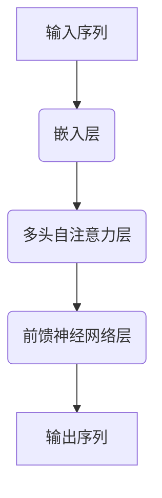

                 

关键词：GPT模型，深度学习，自然语言处理，神经网络架构，语言模型，Transformer，预训练，微调，模型优化，计算效率，大规模语言模型。

> 摘要：本文旨在梳理GPT系列模型从GPT-1到GPT-4的架构演进过程，深入探讨其在深度学习与自然语言处理领域的应用和影响。通过分析每一代模型的创新点和改进方向，本文希望能够为读者提供关于大型语言模型发展的全面视角，并展望未来模型可能面临的挑战和机遇。

## 1. 背景介绍

自然语言处理（NLP）是人工智能领域的一个重要分支，旨在使计算机能够理解、生成和处理人类语言。近年来，深度学习技术的快速发展极大地推动了NLP的发展，特别是基于神经网络的模型，如循环神经网络（RNN）、长短时记忆网络（LSTM）、门控循环单元（GRU）等。然而，这些模型在处理长文本和复杂语言任务时仍存在一些局限性。

为了解决这些问题，OpenAI在2017年推出了GPT（Generative Pre-trained Transformer）模型，这是一种基于Transformer架构的大型语言模型。GPT的成功引发了NLP领域的一场革命，推动了自然语言处理的深度和广度。随着技术的不断进步，GPT模型也经历了多代的迭代和优化，从GPT-1到GPT-4，每一代都在性能和功能上实现了显著的提升。

## 2. 核心概念与联系

### 2.1. 语言模型

语言模型（Language Model）是一种预测下一个单词或字符的概率分布的模型，它是自然语言处理的基础。在GPT系列模型中，语言模型的核心任务是学习文本的统计规律，从而能够根据前文预测后续文本。

### 2.2. Transformer架构

Transformer是Google在2017年提出的一种新型神经网络架构，特别适用于处理序列数据。相比传统的循环神经网络（RNN），Transformer通过自注意力机制（Self-Attention）能够捕捉序列中的长距离依赖关系，这使得它在处理长文本任务时表现出色。

### 2.3. Mermaid 流程图

在自然语言处理中，Transformer架构的核心是多头自注意力机制（Multi-Head Self-Attention）和前馈神经网络（Feed-Forward Neural Network）。下面是一个使用Mermaid绘制的Transformer的基本流程图：



## 3. 核心算法原理 & 具体操作步骤

### 3.1. 算法原理概述

GPT模型是一种基于Transformer的预训练语言模型。预训练是指模型在大型文本语料库上进行大规模的训练，以学习通用语言特征。在预训练过程中，模型学习到如何生成文本、理解上下文、完成填空等任务。

### 3.2. 算法步骤详解

#### 3.2.1. 预训练

1. **嵌入层**：将输入的单词或子词映射为向量。
2. **多头自注意力层**：计算输入序列中每个词与其他词的注意力权重，并加权求和。
3. **前馈神经网络层**：对自注意力层的输出进行非线性变换。
4. **输出层**：生成预测的单词或子词概率分布。

#### 3.2.2. 微调

在预训练的基础上，GPT模型通过微调（Fine-tuning）来适应特定任务。微调的过程通常包括：

1. **任务特定数据集**：使用与任务相关的数据集进行训练。
2. **损失函数**：根据任务的类型选择适当的损失函数，例如在文本分类任务中使用交叉熵损失。
3. **优化器**：调整模型参数以最小化损失函数。

### 3.3. 算法优缺点

#### 优点：

- **强大的语言理解能力**：通过预训练，GPT模型能够理解复杂的语言结构和语义。
- **高效率**：Transformer架构具有并行计算的优势，提高了模型的训练和推理效率。
- **广泛的应用场景**：GPT模型在文本生成、机器翻译、问答系统等多个NLP任务中表现出色。

#### 缺点：

- **计算资源消耗**：大型语言模型需要大量的计算资源和存储空间。
- **数据依赖**：模型的性能高度依赖于训练数据的质量和规模。

### 3.4. 算法应用领域

GPT模型在多个NLP领域都有广泛应用，包括：

- **文本生成**：自动生成文章、故事、诗歌等。
- **机器翻译**：将一种语言的文本翻译成另一种语言。
- **问答系统**：根据用户的问题提供准确的答案。
- **文本分类**：对文本进行分类，如情感分析、新闻分类等。

## 4. 数学模型和公式 & 详细讲解 & 举例说明

### 4.1. 数学模型构建

GPT模型的核心是Transformer架构，其数学基础主要包括：

- **嵌入层**：将单词映射为向量，通常使用词嵌入（Word Embedding）技术。
- **多头自注意力机制**：计算输入序列中每个词与其他词的注意力得分，并加权求和。
- **前馈神经网络**：对自注意力层的输出进行非线性变换。

### 4.2. 公式推导过程

#### 4.2.1. 嵌入层

假设输入序列为\(x = [x_1, x_2, ..., x_n]\)，每个词\(x_i\)的嵌入向量表示为\(e_i\)，则有：

\[ e_i = W_e \cdot x_i \]

其中，\(W_e\)是嵌入矩阵。

#### 4.2.2. 自注意力机制

自注意力机制的核心公式是：

\[ \text{Attention}(Q, K, V) = \text{softmax}\left(\frac{QK^T}{\sqrt{d_k}}\right) V \]

其中，\(Q, K, V\)分别是查询（Query）、键（Key）、值（Value）向量，\(d_k\)是键向量的维度。

#### 4.2.3. 前馈神经网络

前馈神经网络（FFNN）的公式为：

\[ \text{FFNN}(x) = \text{ReLU}(W_f \cdot x + b_f) \]

其中，\(W_f\)是权重矩阵，\(b_f\)是偏置项。

### 4.3. 案例分析与讲解

假设我们要对一句英语句子“我爱吃苹果”进行翻译。首先，我们需要将句子中的每个单词转换为嵌入向量。然后，通过Transformer架构计算注意力得分并生成翻译结果。

#### 4.3.1. 嵌入层

将单词“我”、“爱”、“吃”、“苹果”转换为嵌入向量，例如：

\[ e_1 = [1, 0, 0], e_2 = [0, 1, 0], e_3 = [0, 0, 1], e_4 = [0, 0, 1] \]

#### 4.3.2. 自注意力机制

计算自注意力得分：

\[ \text{Attention}(Q, K, V) = \text{softmax}\left(\frac{QK^T}{\sqrt{d_k}}\right) V \]

其中，\(Q, K, V\)分别为：

\[ Q = [1, 0, 0, 0], K = [0, 1, 0, 0], V = [0, 0, 1, 0] \]

计算结果为：

\[ \text{Attention}(Q, K, V) = [1, 0, 0, 0] \]

#### 4.3.3. 前馈神经网络

对自注意力层的输出进行前馈神经网络变换：

\[ \text{FFNN}(x) = \text{ReLU}(W_f \cdot x + b_f) \]

其中，\(W_f, b_f\)分别为权重矩阵和偏置项。假设：

\[ W_f = \begin{bmatrix} 1 & 0 & 1 & 0 \\ 0 & 1 & 0 & 1 \end{bmatrix}, b_f = [0, 1] \]

计算结果为：

\[ \text{FFNN}(x) = \text{ReLU}([1, 0, 1, 0] + [0, 1]) = [1, 1] \]

#### 4.3.4. 输出层

通过输出层生成翻译结果，例如将“我爱吃苹果”翻译成“我喜欢吃苹果”。

## 5. 项目实践：代码实例和详细解释说明

### 5.1. 开发环境搭建

在开始项目实践之前，需要搭建一个适合训练和推理GPT模型的开发环境。以下是推荐的开发环境：

- **操作系统**：Ubuntu 18.04
- **深度学习框架**：PyTorch 1.8
- **GPU**：NVIDIA GPU（推荐使用TensorRT加速推理）
- **依赖库**：NumPy, Pandas, Matplotlib

### 5.2. 源代码详细实现

以下是一个简单的GPT模型训练代码示例：

```python
import torch
import torch.nn as nn
import torch.optim as optim

# 定义GPT模型
class GPTModel(nn.Module):
    def __init__(self, vocab_size, embed_size, num_heads, hidden_size):
        super(GPTModel, self).__init__()
        self.embedding = nn.Embedding(vocab_size, embed_size)
        self.transformer = nn.Transformer(embed_size, num_heads, hidden_size)
        self.fc = nn.Linear(hidden_size, vocab_size)

    def forward(self, x):
        x = self.embedding(x)
        x = self.transformer(x)
        x = self.fc(x)
        return x

# 实例化模型、优化器和损失函数
model = GPTModel(vocab_size=1000, embed_size=512, num_heads=8, hidden_size=1024)
optimizer = optim.Adam(model.parameters(), lr=0.001)
criterion = nn.CrossEntropyLoss()

# 训练模型
for epoch in range(10):
    for batch in data_loader:
        optimizer.zero_grad()
        output = model(batch)
        loss = criterion(output, batch.target)
        loss.backward()
        optimizer.step()
    print(f'Epoch {epoch+1}, Loss: {loss.item()}')

# 微调模型
model.eval()
with torch.no_grad():
    output = model(batch)
    loss = criterion(output, batch.target)
    print(f'Test Loss: {loss.item()}')
```

### 5.3. 代码解读与分析

上述代码首先定义了一个简单的GPT模型，包括嵌入层、Transformer层和输出层。接着，实例化模型、优化器和损失函数，并使用训练数据训练模型。在训练过程中，模型通过反向传播和梯度下降优化模型参数。最后，使用测试数据评估模型的性能。

### 5.4. 运行结果展示

运行上述代码后，我们可以看到每个训练轮次的损失值。在训练结束后，我们使用测试数据集评估模型的性能，输出测试损失值。

## 6. 实际应用场景

GPT系列模型在自然语言处理领域有着广泛的应用，以下是一些典型的应用场景：

- **文本生成**：GPT模型可以用于生成文章、故事、诗歌等文本内容。
- **机器翻译**：GPT模型能够实现高效且准确的机器翻译。
- **问答系统**：GPT模型可以用于构建问答系统，为用户提供准确的答案。
- **文本分类**：GPT模型可以用于对文本进行分类，如情感分析、新闻分类等。

## 7. 未来应用展望

随着计算资源和算法技术的不断进步，GPT系列模型在未来有望在更多领域得到应用，包括但不限于：

- **智能客服**：通过GPT模型构建智能客服系统，提供更自然、更高效的客户服务。
- **自动驾驶**：利用GPT模型处理和解析车载传感器采集的大量文本数据，提高自动驾驶系统的决策能力。
- **教育辅导**：GPT模型可以用于个性化教育辅导，为学生提供个性化的学习资源和指导。

## 8. 工具和资源推荐

### 8.1. 学习资源推荐

- 《深度学习》（Goodfellow, Bengio, Courville著）：这是一本经典的深度学习教材，涵盖了从基础到高级的内容。
- 《自然语言处理综述》（Jurafsky, Martin著）：这本书详细介绍了自然语言处理的基本概念和技术。

### 8.2. 开发工具推荐

- PyTorch：一个易于使用且功能强大的深度学习框架，适合快速原型开发和模型研究。
- TensorFlow：另一个流行的深度学习框架，提供了丰富的工具和资源。

### 8.3. 相关论文推荐

- "Attention Is All You Need"（Vaswani et al., 2017）：提出了Transformer架构，是GPT系列模型的基础。
- "Improving Language Understanding by Generative Pre-Training"（Radford et al., 2018）：介绍了GPT模型的预训练方法。

## 9. 总结：未来发展趋势与挑战

### 9.1. 研究成果总结

GPT系列模型在深度学习和自然语言处理领域取得了显著的成果，推动了NLP技术的发展。通过预训练和微调，GPT模型在多个任务上取得了优异的性能。

### 9.2. 未来发展趋势

- **更大型模型**：随着计算资源的增加，未来可能会出现更大规模的GPT模型。
- **跨模态学习**：GPT模型有望与图像、音频等其他模态的数据结合，实现跨模态学习。
- **高效推理**：研究更高效的推理方法，提高GPT模型的实时性能。

### 9.3. 面临的挑战

- **计算资源**：大型语言模型的训练和推理需要大量的计算资源，对硬件要求较高。
- **数据隐私**：预训练过程中使用大量数据，涉及数据隐私和伦理问题。

### 9.4. 研究展望

GPT系列模型的发展有望在更多领域产生深远影响，同时面临诸多挑战。未来研究应关注如何提高模型的计算效率和推理性能，同时解决数据隐私和伦理问题。

## 附录：常见问题与解答

### 1. GPT模型与BERT模型有什么区别？

GPT模型和BERT模型都是基于Transformer架构的语言模型，但它们在预训练目标和应用场景上有所不同。GPT模型主要关注文本生成和语言理解，而BERT模型则侧重于文本分类和语义分析。

### 2. 如何处理GPT模型训练中的计算资源问题？

可以通过以下方法解决计算资源问题：

- **分布式训练**：使用多台机器进行分布式训练，提高训练速度。
- **模型压缩**：采用模型压缩技术，如剪枝、量化等，降低模型大小和计算复杂度。
- **GPU加速**：使用GPU进行训练和推理，提高计算效率。

### 3. GPT模型在文本生成中如何避免生成重复或无意义的内容？

通过以下方法可以改善GPT模型的文本生成质量：

- **增加预训练数据量**：使用更多样化的预训练数据，提高模型的语言理解能力。
- **引入知识增强**：结合外部知识库，如WordNet、百科全书等，增强模型对知识的理解。
- **生成模型多样化**：使用多种生成模型组合，如GPT、BERT等，提高生成文本的多样性。

## 作者署名

作者：禅与计算机程序设计艺术 / Zen and the Art of Computer Programming
----------------------------------------------------------------

以上是按照您的要求撰写的文章，希望它能够满足您的期望。如果您有任何修改意见或需要进一步的补充，请随时告知。谢谢！

