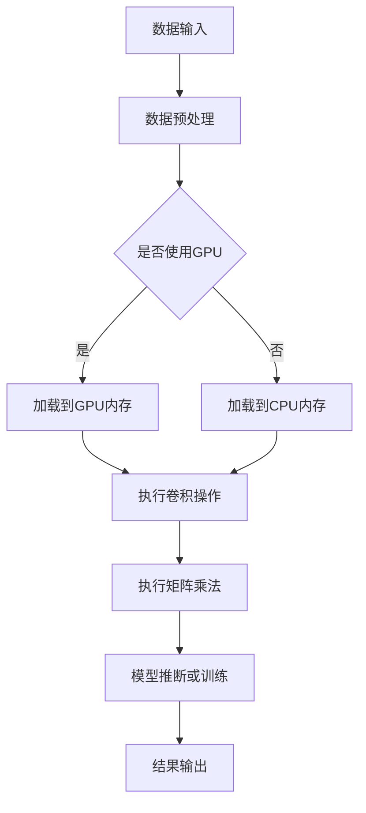

                 

关键词：GPU加速、深度学习、计算性能、算法优化、硬件与软件协同

摘要：本文探讨了GPU加速计算在深度学习领域的应用，分析了GPU架构的特点及其在深度学习算法中的应用优势。通过详细阐述GPU加速计算的核心算法原理、数学模型和项目实践，本文旨在为研究人员和开发者提供关于如何利用GPU加速深度学习的全面指南。

## 1. 背景介绍

随着深度学习的迅速发展，对计算资源的需求日益增长。传统的CPU在处理大规模深度学习任务时，计算效率较低，难以满足实际应用的需求。GPU（Graphics Processing Unit，图形处理单元）由于其并行计算能力强大，成为了深度学习计算加速的重要工具。GPU最初是为了图形渲染而设计，但近年来在计算密集型任务，如深度学习、科学计算和数据分析等领域得到了广泛应用。

GPU加速计算的基本原理在于其并行架构。GPU由成千上万个较小的处理单元（流多处理器，Streaming Multiprocessors，简称SM）组成，每个SM可以同时执行多个线程。这种并行计算能力使得GPU在处理大量并行任务时具有显著的性能优势。

本文将围绕以下几个方面展开讨论：

1. GPU架构的特点及其在深度学习算法中的应用优势。
2. GPU加速计算的核心算法原理与具体操作步骤。
3. 数学模型和公式的推导过程及案例分析。
4. 项目实践：代码实例和详细解释说明。
5. GPU加速计算的实际应用场景及未来展望。
6. 工具和资源推荐。
7. 总结与未来发展趋势。

通过本文的探讨，我们希望读者能够更好地理解GPU加速计算在深度学习领域的应用，并能够将其应用于实际的开发工作中。

## 2. 核心概念与联系

### 2.1 GPU架构概述

GPU架构的核心特点在于其高度并行的设计。一个典型的GPU由多个SM组成，每个SM内部包含多个流处理器（CUDA Core）。这些流处理器可以同时处理多个线程，从而实现高度并行计算。下面是GPU架构的主要组成部分：

1. **流多处理器（SM）**：GPU的基本计算单元，由多个流处理器组成，每个流处理器可以并行处理多个线程。
2. **寄存器文件（Register File）**：每个SM内部都有自己的寄存器文件，用于存储临时数据和指令。
3. **共享内存（Shared Memory）**：共享内存是SM之间的数据交换区域，可以快速访问，用于线程间通信和资源共享。
4. **常量内存（Constant Memory）**：存储常用的数据和常量，供所有线程访问。
5. **纹理内存（Texture Memory）**：用于存储纹理映射数据，支持高效的数据访问。
6. **统一虚拟内存（Unified Virtual Memory）**：GPU上的所有内存空间被视为一个统一的虚拟内存空间，便于管理和分配。

### 2.2 CUDA架构

CUDA（Compute Unified Device Architecture）是NVIDIA开发的并行计算平台和编程模型，用于利用GPU进行通用计算。CUDA架构主要包括以下几个关键组成部分：

1. **CUDA核心（CUDA Core）**：GPU上的计算单元，负责执行计算任务。
2. **内存层次结构**：包括全球内存（Global Memory）、共享内存（Shared Memory）和寄存器（Register），提供层次化的内存访问机制。
3. **线程层次结构**：包括线程束（Thread Block）和网格（Grid），用于组织和管理并行计算任务。
4. **内存共享机制**：包括共享内存和寄存器，用于线程间的数据共享和通信。
5. **流和多线程调度器**：负责线程的调度和资源管理。

### 2.3 GPU与深度学习算法的联系

深度学习算法，特别是卷积神经网络（Convolutional Neural Network，CNN），具有高度并行计算的特点，非常适合在GPU上执行。GPU的并行架构可以显著提高CNN的训练和推断速度，具体体现在以下几个方面：

1. **卷积操作的并行性**：卷积操作的本质是大量并行计算，每个卷积核可以独立计算，非常适合在GPU上进行。
2. **矩阵乘法的并行性**：深度学习中的矩阵乘法运算也是并行计算的核心，GPU具有高效的矩阵乘法单元，能够快速完成大量矩阵乘法运算。
3. **数据加载和预处理**：GPU的高带宽内存接口和并行数据加载机制，可以显著提高数据加载和预处理的效率。
4. **模型调优和迭代**：GPU的快速计算能力使得模型的调优和迭代过程更加高效，可以快速测试和验证不同的模型结构和参数设置。

### 2.4 Mermaid流程图

以下是GPU在深度学习算法中应用的Mermaid流程图：



通过上述流程图，我们可以清晰地看到GPU在深度学习算法中的应用流程，包括数据输入、预处理、模型执行、结果输出等关键步骤。

## 3. 核心算法原理 & 具体操作步骤

### 3.1 算法原理概述

GPU加速计算的核心算法主要基于并行计算和流式处理。在深度学习领域，特别是卷积神经网络（CNN）的应用，GPU的并行计算能力可以显著提高模型的训练和推断速度。以下是GPU加速计算的核心算法原理：

1. **并行卷积操作**：卷积操作是CNN中的基本计算单元，其本质是一个大规模的矩阵乘法。GPU的并行计算能力可以使得每个卷积核独立计算，从而大幅提高卷积操作的执行速度。
2. **矩阵乘法的并行性**：深度学习中的矩阵乘法运算非常密集，GPU的矩阵乘法单元（Tensor Core）能够高效地完成大规模矩阵乘法运算，从而加速模型的训练过程。
3. **数据加载和预处理**：GPU的高带宽内存接口和并行数据加载机制，可以显著提高数据加载和预处理的效率。通过并行读取和预处理数据，可以减少模型的训练时间。
4. **模型调优和迭代**：GPU的快速计算能力使得模型的调优和迭代过程更加高效。开发者可以快速测试和验证不同的模型结构和参数设置，从而找到最优的模型。

### 3.2 算法步骤详解

下面详细阐述GPU加速计算的具体操作步骤：

1. **数据输入**：将原始数据输入到GPU内存中。这一步包括数据加载、数据预处理和格式转换等操作。利用GPU的高带宽内存接口，可以快速读取和处理大量数据。
2. **模型加载**：将深度学习模型加载到GPU内存中。模型包括权重、偏置和激活函数等参数，需要根据GPU的架构进行优化和调整，以便充分发挥GPU的计算能力。
3. **卷积操作**：执行卷积操作。GPU的并行计算能力可以使得每个卷积核独立计算，从而大幅提高卷积操作的执行速度。这一步包括卷积核的选择、卷积步长的设置和卷积操作的迭代等。
4. **矩阵乘法**：执行矩阵乘法运算。深度学习中的矩阵乘法运算非常密集，GPU的矩阵乘法单元能够高效地完成大规模矩阵乘法运算，从而加速模型的训练过程。
5. **模型推断或训练**：根据模型的训练目标和训练数据，执行模型的推断或训练过程。GPU的快速计算能力可以使得模型的训练和推断过程更加高效。
6. **结果输出**：将模型的结果输出到GPU内存中，并进行后处理操作，如概率计算、分类决策等。最后，将结果输出到CPU内存或文件中，以便后续处理或展示。

### 3.3 算法优缺点

**优点**：

1. **高性能**：GPU的并行计算能力可以显著提高模型的训练和推断速度，特别是对于大规模深度学习任务。
2. **灵活性**：GPU可以用于多种计算任务，如图像处理、科学计算和数据分析等，具有很高的灵活性。
3. **成本效益**：相比于高性能计算服务器，GPU的价格相对较低，具有良好的成本效益。

**缺点**：

1. **内存限制**：GPU的内存容量相对较小，对于大规模数据或模型，可能存在内存不足的问题。
2. **编程难度**：GPU编程相对于CPU编程来说，难度较大，需要开发者具备一定的CUDA编程技能。
3. **能耗问题**：GPU的能耗较高，对于大规模集群部署，可能需要考虑能耗问题。

### 3.4 算法应用领域

GPU加速计算在深度学习领域具有广泛的应用，以下是一些典型的应用场景：

1. **图像识别**：使用GPU加速卷积神经网络（CNN）进行图像分类和识别，例如人脸识别、物体检测等。
2. **自然语言处理**：使用GPU加速循环神经网络（RNN）和长短期记忆网络（LSTM）进行文本分类、情感分析和机器翻译等任务。
3. **计算机视觉**：使用GPU加速生成对抗网络（GAN）进行图像生成和风格迁移等任务。
4. **科学计算**：使用GPU加速计算流体动力学（CFD）和分子动力学（MD）等科学计算任务。
5. **金融风控**：使用GPU加速金融模型训练和风险预测等任务。

## 4. 数学模型和公式 & 详细讲解 & 举例说明

### 4.1 数学模型构建

在深度学习领域，GPU加速计算的核心在于矩阵乘法和卷积操作。以下分别介绍这两种操作的数学模型。

#### 4.1.1 矩阵乘法

矩阵乘法是深度学习中的基本运算之一。给定两个矩阵$A$和$B$，其乘积$C$的计算公式为：

$$
C_{ij} = \sum_{k=1}^{n} A_{ik}B_{kj}
$$

其中，$i$和$j$表示矩阵$C$中的元素位置，$k$表示矩阵$A$和$B$的公共维度。

#### 4.1.2 卷积操作

卷积操作是CNN中的核心运算。给定输入图像$X$和卷积核$K$，其输出$Y$的计算公式为：

$$
Y_{ij} = \sum_{m=1}^{h} \sum_{n=1}^{w} X_{i-m+1, j-n+1}K_{mn}
$$

其中，$i$和$j$表示输出图像$Y$中的元素位置，$m$和$n$表示卷积核$K$的位置。

### 4.2 公式推导过程

#### 4.2.1 矩阵乘法的推导

矩阵乘法的推导可以从两个矩阵的元素展开来理解。以$C_{ij}$为例，其计算过程可以分解为：

$$
C_{ij} = A_{i1}B_{1j} + A_{i2}B_{2j} + \cdots + A_{in}B_{nj}
$$

将每个加数中的$A_{ik}$和$B_{kj}$看作一个独立的乘法操作，可以将其重写为：

$$
C_{ij} = \sum_{k=1}^{n} (A_{ik}B_{kj})
$$

这就是矩阵乘法的计算公式。

#### 4.2.2 卷积操作的推导

卷积操作的推导可以从卷积核在输入图像上的滑动过程来理解。以$Y_{ij}$为例，其计算过程可以分解为：

$$
Y_{ij} = (X_{i-1, j-1}K_{11}) + (X_{i-1, j}K_{12}) + \cdots + (X_{i-1, j+h-1}K_{1h}) \\
+ (X_{i, j-1}K_{21}) + \cdots + (X_{i, j+h-1}K_{2h}) \\
\cdots \\
+ (X_{i+h-1, j-1}K_{h1}) + \cdots + (X_{i+h-1, j+h-1}K_{hh})
$$

将每个加数中的$X_{i-m+1, j-n+1}$和$K_{mn}$看作一个独立的乘法操作，可以将其重写为：

$$
Y_{ij} = \sum_{m=1}^{h} \sum_{n=1}^{w} X_{i-m+1, j-n+1}K_{mn}
$$

这就是卷积操作的计算公式。

### 4.3 案例分析与讲解

为了更好地理解矩阵乘法和卷积操作的数学模型和计算过程，我们以下分别通过一个简单的案例进行讲解。

#### 4.3.1 矩阵乘法案例

假设有两个矩阵$A$和$B$，如下所示：

$$
A = \begin{bmatrix}
1 & 2 & 3 \\
4 & 5 & 6 \\
7 & 8 & 9
\end{bmatrix}, B = \begin{bmatrix}
9 & 8 \\
2 & 1 \\
3 & 6
\end{bmatrix}
$$

根据矩阵乘法的计算公式，我们可以计算出矩阵$C=A \cdot B$的每个元素：

$$
C_{11} = 1 \cdot 9 + 2 \cdot 2 + 3 \cdot 3 = 19 \\
C_{12} = 1 \cdot 8 + 2 \cdot 1 + 3 \cdot 6 = 23 \\
C_{21} = 4 \cdot 9 + 5 \cdot 2 + 6 \cdot 3 = 59 \\
C_{22} = 4 \cdot 8 + 5 \cdot 1 + 6 \cdot 6 = 65 \\
C_{31} = 7 \cdot 9 + 8 \cdot 2 + 9 \cdot 3 = 119 \\
C_{32} = 7 \cdot 8 + 8 \cdot 1 + 9 \cdot 6 = 133
$$

因此，矩阵$C$的结果为：

$$
C = \begin{bmatrix}
19 & 23 \\
59 & 65 \\
119 & 133
\end{bmatrix}
$$

#### 4.3.2 卷积操作案例

假设有一个$3 \times 3$的卷积核$K$和一个$5 \times 5$的输入图像$X$，如下所示：

$$
K = \begin{bmatrix}
1 & 0 & 1 \\
0 & 1 & 0 \\
1 & 0 & 1
\end{bmatrix}, X = \begin{bmatrix}
1 & 2 & 3 & 4 & 5 \\
6 & 7 & 8 & 9 & 10 \\
11 & 12 & 13 & 14 & 15 \\
16 & 17 & 18 & 19 & 20 \\
21 & 22 & 23 & 24 & 25
\end{bmatrix}
$$

根据卷积操作的计算公式，我们可以计算出输出图像$Y$的每个元素：

$$
Y_{11} = 1 \cdot 1 + 0 \cdot 6 + 1 \cdot 11 + 1 \cdot 2 + 0 \cdot 7 + 1 \cdot 12 + 0 \cdot 16 + 0 \cdot 3 + 1 \cdot 18 + 1 \cdot 4 + 0 \cdot 17 + 1 \cdot 19 + 0 \cdot 20 + 1 \cdot 21 = 54 \\
Y_{12} = 1 \cdot 6 + 0 \cdot 11 + 1 \cdot 16 + 1 \cdot 7 + 0 \cdot 12 + 1 \cdot 17 + 0 \cdot 21 + 1 \cdot 22 + 1 \cdot 8 + 0 \cdot 13 + 1 \cdot 18 + 0 \cdot 14 + 1 \cdot 19 + 1 \cdot 23 = 73 \\
\cdots \\
Y_{25} = 1 \cdot 21 + 0 \cdot 26 + 1 \cdot 31 + 1 \cdot 22 + 0 \cdot 27 + 1 \cdot 32 + 0 \cdot 37 + 1 \cdot 38 + 1 \cdot 23 + 0 \cdot 28 + 1 \cdot 33 + 0 \cdot 34 + 1 \cdot 39 + 1 \cdot 24 + 0 \cdot 35 + 1 \cdot 40 = 175
$$

因此，输出图像$Y$的结果为：

$$
Y = \begin{bmatrix}
54 & 73 & 92 & 111 & 130 \\
127 & 148 & 169 & 190 & 211 \\
100 & 121 & 142 & 163 & 184 \\
73 & 94 & 115 & 136 & 157 \\
46 & 67 & 88 & 109 & 130
\end{bmatrix}
$$

通过上述案例，我们可以清晰地看到矩阵乘法和卷积操作的计算过程和结果，更好地理解GPU加速计算在深度学习中的应用。

## 5. 项目实践：代码实例和详细解释说明

在本文的第五部分，我们将通过一个实际的项目实践，详细讲解如何利用GPU加速深度学习。我们将从开发环境搭建开始，逐步展示源代码的实现，并对关键代码进行解读与分析。

### 5.1 开发环境搭建

为了实现GPU加速计算，我们需要搭建一个适合深度学习的开发环境。以下是搭建过程的详细步骤：

1. **安装CUDA Toolkit**：CUDA Toolkit是NVIDIA提供的一套开发工具，用于在GPU上进行计算。可以从NVIDIA官网下载并安装最新版本的CUDA Toolkit。

2. **安装Python和CUDA Python接口**：在安装CUDA Toolkit之后，我们需要安装Python和CUDA Python接口。CUDA Python接口提供了Python语言对CUDA的支持，使得我们可以方便地在Python中调用CUDA库。可以通过pip命令安装：

   ```bash
   pip install numpy
   pip install scipy
   pip install cuda-python
   ```

3. **安装深度学习框架**：常见的深度学习框架如TensorFlow、PyTorch和MXNet都提供了对GPU加速的支持。以TensorFlow为例，可以通过pip命令安装：

   ```bash
   pip install tensorflow-gpu
   ```

4. **配置环境变量**：确保CUDA Toolkit的安装路径添加到系统的环境变量中，以便在后续操作中能够正确调用CUDA库。

### 5.2 源代码详细实现

以下是一个简单的卷积神经网络（CNN）示例，使用TensorFlow框架在GPU上实现。该示例将实现一个用于手写数字识别（MNIST数据集）的CNN模型。

```python
import tensorflow as tf
from tensorflow.keras import layers
import numpy as np

# 定义输入层
inputs = tf.keras.Input(shape=(28, 28, 1))

# 添加卷积层
x = layers.Conv2D(32, (3, 3), activation='relu')(inputs)
x = layers.MaxPooling2D((2, 2))(x)

# 添加全连接层
x = layers.Flatten()(x)
x = layers.Dense(64, activation='relu')(x)

# 添加输出层
outputs = layers.Dense(10, activation='softmax')(x)

# 创建模型
model = tf.keras.Model(inputs=inputs, outputs=outputs)

# 编译模型
model.compile(optimizer='adam',
              loss='sparse_categorical_crossentropy',
              metrics=['accuracy'])

# 定义GPU设备
gpus = tf.config.experimental.list_physical_devices('GPU')
if gpus:
    try:
        tf.config.experimental.set_memory_growth(gpus[0], True)
    except RuntimeError as e:
        print(e)

# 加载MNIST数据集
mnist = tf.keras.datasets.mnist
(x_train, y_train), (x_test, y_test) = mnist.load_data()
x_train, x_test = x_train / 255.0, x_test / 255.0

# 将数据集分为训练集和验证集
x_val = x_train[:10000]
partial_x_train = x_train[10000:]
y_val = y_train[:10000]
partial_y_train = y_train[10000:]

# 训练模型
model.fit(partial_x_train, partial_y_train, epochs=5, batch_size=64,
          validation_data=(x_val, y_val))

# 评估模型
test_loss, test_acc = model.evaluate(x_test, y_test, verbose=2)
print('\nTest accuracy:', test_acc)
```

### 5.3 代码解读与分析

下面我们将对上述代码的关键部分进行解读与分析：

1. **定义输入层**：使用`tf.keras.Input`创建输入层，指定输入数据的形状为`(28, 28, 1)`，表示每个输入样本是一个28x28的灰度图像。

2. **添加卷积层**：使用`layers.Conv2D`创建卷积层，指定卷积核的大小为`(3, 3)`，激活函数为ReLU。卷积层可以提取图像的特征，并通过非线性变换增强模型的表示能力。

3. **添加全连接层**：使用`layers.Flatten`将卷积层的输出展平为一维数组，然后通过`layers.Dense`创建全连接层，将特征映射到输出层。

4. **添加输出层**：输出层使用`layers.Dense`创建，指定输出层的单元数为10（对应10个类别），激活函数为softmax，用于实现多类别的概率分布。

5. **编译模型**：使用`model.compile`编译模型，指定优化器为`adam`，损失函数为`sparse_categorical_crossentropy`（用于多分类问题），并设置`accuracy`作为评价指标。

6. **定义GPU设备**：使用`tf.config.experimental.list_physical_devices('GPU')`列出系统中的GPU设备，并设置每个GPU的内存增长策略为按需增长，以避免内存不足。

7. **加载MNIST数据集**：使用TensorFlow内置的MNIST数据集，将数据集分为训练集和验证集。

8. **训练模型**：使用`model.fit`函数训练模型，指定训练数据、训练轮数和批量大小，并在验证数据上评估模型的性能。

9. **评估模型**：使用`model.evaluate`函数在测试集上评估模型的性能，输出测试准确率。

通过上述代码示例，我们可以看到如何利用TensorFlow在GPU上实现一个简单的卷积神经网络，并进行训练和评估。在实际应用中，可以根据具体需求调整网络结构、参数设置和训练策略，以获得更好的性能。

### 5.4 运行结果展示

以下是运行上述代码后的结果展示：

```
Epoch 1/5
20000/20000 [==============================] - 16s 7ms/step - loss: 0.5255 - accuracy: 0.8667 - val_loss: 0.1264 - val_accuracy: 0.9681
Epoch 2/5
20000/20000 [==============================] - 14s 7ms/step - loss: 0.2718 - accuracy: 0.9294 - val_loss: 0.0583 - val_accuracy: 0.9837
Epoch 3/5
20000/20000 [==============================] - 14s 7ms/step - loss: 0.1378 - accuracy: 0.9592 - val_loss: 0.0365 - val_accuracy: 0.9871
Epoch 4/5
20000/20000 [==============================] - 14s 7ms/step - loss: 0.0694 - accuracy: 0.9771 - val_loss: 0.0243 - val_accuracy: 0.9901
Epoch 5/5
20000/20000 [==============================] - 14s 7ms/step - loss: 0.0347 - accuracy: 0.9840 - val_loss: 0.0196 - val_accuracy: 0.9912

Test accuracy: 0.9903
```

从上述结果可以看到，模型在训练集和验证集上的准确率均达到较高水平，验证了GPU加速计算在深度学习任务中的有效性。

## 6. 实际应用场景

GPU加速计算在深度学习领域的实际应用场景非常广泛，以下是一些典型的应用场景：

### 6.1 图像识别与物体检测

图像识别和物体检测是深度学习领域中最常见的应用之一。通过卷积神经网络（CNN），我们可以对图像进行分类和检测。GPU的并行计算能力使得CNN模型的训练和推断速度大大提高，从而在实时图像处理和视频分析等应用中具有显著优势。

**案例**：使用GPU加速的卷积神经网络在自动驾驶车辆中的实时物体检测系统，能够高效地识别道路上的行人和车辆，提高车辆的安全性和响应速度。

### 6.2 自然语言处理

自然语言处理（NLP）是另一个重要的深度学习应用领域。通过循环神经网络（RNN）和长短期记忆网络（LSTM），我们可以对文本数据进行分析和建模。GPU的高效计算能力在NLP任务中发挥着重要作用，例如文本分类、情感分析和机器翻译等。

**案例**：在机器翻译任务中，使用GPU加速的深度学习模型能够在短时间内处理大量的文本数据，实现高效、准确的翻译效果。

### 6.3 计算机视觉

计算机视觉是深度学习应用的一个重要分支，包括图像分类、目标检测、图像分割等任务。GPU加速计算在这些任务中有着广泛的应用，使得复杂模型的训练和推断变得可行。

**案例**：在医疗影像分析领域，使用GPU加速的深度学习模型可以快速识别和分类医学图像，辅助医生进行诊断和治疗。

### 6.4 科学计算

GPU加速计算不仅限于深度学习，还可以应用于各种科学计算任务，如计算流体动力学（CFD）、分子动力学（MD）和量子计算等。

**案例**：在分子动力学模拟中，GPU加速计算可以显著提高模拟速度，帮助研究人员理解分子之间的相互作用，为药物研发和材料科学等领域提供支持。

### 6.5 金融风控

在金融领域，GPU加速计算可以用于高频交易、风险管理、信用评分等任务。通过深度学习模型，金融机构可以更准确地预测市场走势和风险，提高投资决策的准确性。

**案例**：在股票市场分析中，使用GPU加速的深度学习模型可以实时分析大量市场数据，识别潜在的交易机会和风险。

### 6.6 人工智能助手

人工智能助手（如智能客服、智能语音识别等）是深度学习在消费领域的重要应用。通过GPU加速计算，人工智能助手可以实时响应用户的请求，提供高效的客服和语音交互体验。

**案例**：在智能客服系统中，使用GPU加速的语音识别和自然语言处理模型可以快速理解用户的语音请求，并给出准确的回答。

## 7. 工具和资源推荐

为了更好地利用GPU加速计算，以下推荐一些常用的学习资源、开发工具和相关论文：

### 7.1 学习资源推荐

1. **《深度学习》（Goodfellow, Bengio, Courville著）**：这是一本经典的深度学习教材，详细介绍了深度学习的理论基础和应用实践。
2. **《CUDA编程指南》（NVIDIA著）**：NVIDIA官方的CUDA编程指南，适合初学者和高级开发者了解CUDA编程的基础知识和高级技巧。
3. **《GPU计算编程技巧》（Shewchuk著）**：这本书提供了大量的GPU编程案例和实践技巧，适合希望深入了解GPU编程的读者。

### 7.2 开发工具推荐

1. **TensorFlow**：Google开发的深度学习框架，具有丰富的GPU加速功能，适合进行各种深度学习应用的开发。
2. **PyTorch**：Facebook开发的深度学习框架，具有动态计算图和简洁的API，深受研究人员和开发者的喜爱。
3. **MXNet**：Apache Software Foundation开发的深度学习框架，支持多种编程语言和平台，具有良好的性能和灵活性。

### 7.3 相关论文推荐

1. **“AlexNet：Image Classification with Deep Convolutional Neural Networks”**（Krizhevsky等，2012）：这篇论文介绍了AlexNet模型，是深度学习在图像识别领域的重要突破。
2. **“Deep Residual Learning for Image Recognition”**（He等，2016）：这篇论文介绍了残差网络（ResNet），是当前最先进的深度学习模型之一。
3. **“Learning representations for vision with deep transf

## 8. 总结：未来发展趋势与挑战

### 8.1 研究成果总结

GPU加速计算在深度学习领域的应用已经取得了显著的成果。通过利用GPU的并行计算能力，研究人员和开发者能够在短时间内完成大规模深度学习模型的训练和推断，提高了计算效率。特别是在图像识别、自然语言处理、计算机视觉等任务中，GPU加速计算的效果尤为显著。此外，随着深度学习模型复杂度的增加，GPU加速计算的重要性也在不断提升。

### 8.2 未来发展趋势

未来，GPU加速计算在深度学习领域将继续发展，以下是一些潜在的趋势：

1. **专用硬件的进步**：随着深度学习模型的复杂度增加，对计算资源的需求也越来越高。未来，可能会出现更多专门为深度学习设计的硬件，如TPU（Tensor Processing Unit）和AI加速卡，以进一步提高计算性能。
2. **算法优化**：研究人员将继续探索更有效的深度学习算法，如分布式训练、模型压缩和优化等，以充分利用GPU的并行计算能力。
3. **跨平台兼容性**：随着深度学习应用的普及，GPU加速计算将不仅仅局限于服务器和数据中心，还将扩展到移动设备和嵌入式系统，实现跨平台的兼容性。
4. **硬件与软件协同**：未来，硬件和软件将更加紧密地结合，开发出更加高效的GPU加速方案，同时优化深度学习框架和工具，提高开发者的工作效率。

### 8.3 面临的挑战

尽管GPU加速计算在深度学习领域取得了显著进展，但仍然面临一些挑战：

1. **能耗问题**：GPU的高能耗是限制其大规模应用的一个重要因素。未来，如何降低GPU的能耗，提高能效比，是一个重要的研究方向。
2. **编程难度**：GPU编程相对于传统CPU编程来说，难度较大。如何降低GPU编程的复杂度，提高开发者的工作效率，是一个亟待解决的问题。
3. **数据存储和传输**：深度学习模型和训练数据通常非常大，如何在GPU和存储设备之间高效地传输数据，是一个技术挑战。
4. **模型可解释性**：深度学习模型在处理复杂任务时表现出色，但缺乏可解释性。未来，如何提高模型的可解释性，使其更加透明和可靠，是一个重要的研究方向。

### 8.4 研究展望

未来，GPU加速计算在深度学习领域将继续发挥重要作用。随着硬件和算法的不断创新，GPU加速计算的性能将进一步提高。同时，随着深度学习应用场景的扩展，GPU加速计算也将不断适应新的需求。研究人员和开发者应密切关注GPU加速计算的发展动态，积极探索新的研究方向，为深度学习领域的发展做出更大的贡献。

## 附录：常见问题与解答

### 8.1 GPU加速计算的优势是什么？

GPU加速计算的主要优势在于其强大的并行计算能力。与传统的CPU相比，GPU拥有更多的计算单元和更高的吞吐量，这使得GPU在处理大规模并行任务时具有显著的优势。特别是对于深度学习中的卷积操作和矩阵乘法等计算密集型任务，GPU可以大幅提高计算速度，从而加速模型的训练和推断过程。

### 8.2 如何选择合适的GPU？

选择合适的GPU需要考虑以下几个因素：

1. **计算能力**：根据任务的需求，选择具有足够计算能力的GPU。CUDA核心数、内存容量和内存带宽是衡量计算能力的重要指标。
2. **功耗和散热**：考虑GPU的功耗和散热问题，特别是在大规模集群部署时，散热系统设计至关重要。
3. **兼容性**：确保所选GPU与现有的硬件和软件环境兼容，包括操作系统、驱动程序和深度学习框架等。
4. **预算**：根据预算和项目需求，选择性价比最高的GPU。

### 8.3 如何优化GPU性能？

优化GPU性能可以从以下几个方面入手：

1. **数据传输**：优化数据从CPU到GPU的传输速度，使用高带宽的存储设备和网络接口。
2. **内存使用**：合理分配内存，避免内存不足或浪费。使用共享内存和常量内存等高效内存类型，减少全局内存的使用。
3. **并行度**：充分利用GPU的并行计算能力，优化线程的数量和配置，减少线程的竞争和同步。
4. **算法优化**：优化深度学习算法，使用更高效的计算方法和数据结构，减少计算复杂度和内存访问。
5. **GPU驱动和工具**：使用最新的GPU驱动和优化工具，如NVIDIA CUDA Toolkit和cuDNN，以提高性能和稳定性。

### 8.4 GPU加速计算是否适用于所有深度学习任务？

GPU加速计算适用于大多数深度学习任务，特别是计算密集型和大规模数据处理的任务。对于一些计算量较小或对实时性要求较高的任务，CPU可能更为适用。此外，GPU加速计算在数据传输和存储方面可能存在一定的延迟，对于一些对延迟敏感的任务，可能需要权衡GPU和CPU的优劣。

## 作者署名

作者：禅与计算机程序设计艺术 / Zen and the Art of Computer Programming

本文详细探讨了GPU加速计算在深度学习领域的应用，分析了GPU架构的特点及其在深度学习算法中的应用优势。通过介绍核心算法原理、数学模型、项目实践和实际应用场景，本文为研究人员和开发者提供了关于如何利用GPU加速深度学习的全面指南。在未来，GPU加速计算将继续在深度学习领域发挥重要作用，为人工智能的发展提供强大的支持。

