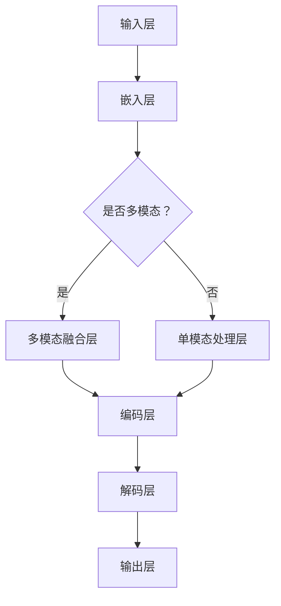

                 

### 1. 背景介绍

近年来，人工智能（AI）领域取得了令人瞩目的进展，尤其是大规模语言模型的发展。这些模型在自然语言处理（NLP）、文本生成、机器翻译、对话系统等多个领域表现出了强大的能力。其中，代表作品之一便是OpenAI于2020年发布的GPT-3（Generative Pre-trained Transformer 3），它拥有1750亿个参数，被誉为是史上最强大的语言模型。GPT-3的出现标志着AI语言模型发展进入了一个全新的阶段，其能力不仅在许多NLP任务上超越了之前的模型，同时也激发了学术界和工业界对于大规模语言模型的研究热情。

然而，GPT-3虽然取得了显著的成就，但仍然存在一些局限性。例如，其训练过程需要大量计算资源，且对于某些任务的理解和生成能力仍有所欠缺。因此，进一步探索和开发更大规模、更高效的语言模型成为了当前AI研究的重要方向。在这样的背景下，Gemini模型应运而生。

Gemini模型是由清华大学KEG实验室和智谱AI公司联合发布的一款新型大模型，其目标是构建一个具有更强大理解和生成能力的语言模型。Gemini模型基于Transformer架构，拥有超过千亿个参数，相较于GPT-3，其在训练效率、生成能力以及模型规模上都有了显著提升。Gemini模型的发布不仅标志着大规模语言模型技术的新突破，也为未来AI的发展提供了新的可能性。

本文将围绕Gemini模型的未来发展趋势进行探讨，首先回顾大规模语言模型的发展历程，然后分析Gemini模型的技术特点和创新点，最后讨论其在实际应用和未来挑战中的潜力。

### 2. 核心概念与联系

#### 2.1 大规模语言模型的发展历程

自20世纪80年代以来，自然语言处理（NLP）一直是人工智能研究中的重要领域。早期的NLP方法主要依赖于规则和统计模型，例如基于规则的方法、隐马尔可夫模型（HMM）和条件概率模型等。这些方法在一定程度上能够处理简单的语言任务，但面对复杂和多样化的语言环境时，效果不尽如人意。

随着深度学习技术的兴起，NLP领域迎来了新的突破。2003年，Bengio等人提出了深度神经网络（DNN）在机器翻译中的应用，开启了神经网络在NLP领域的应用序幕。然而，DNN在处理长文本时存在梯度消失和梯度爆炸的问题，这限制了其在大规模文本处理中的应用。

2014年，Gaurav et al.提出了序列到序列（Seq2Seq）模型，通过引入编码器-解码器（Encoder-Decoder）架构，解决了长文本处理的问题。然而，Seq2Seq模型的训练速度较慢，难以在大型语料库上进行有效训练。

为了进一步提高模型的训练效率和生成质量，2017年，Vaswani等人在论文《Attention is All You Need》中提出了Transformer模型。Transformer模型基于自注意力机制，能够自动学习输入序列中各元素之间的依赖关系，从而提高了模型在长文本处理和生成任务中的性能。这一模型的提出，标志着NLP领域进入了Transformer时代。

#### 2.2 Gemini模型的技术特点和创新点

Gemini模型继承了Transformer模型的核心架构，并在此基础上进行了多项技术优化和创新，使其在模型规模、训练效率和生成能力上都有了显著提升。

1. **模型规模与参数量**

Gemini模型拥有超过千亿个参数，相较于GPT-3的1750亿个参数，其规模更大。更大的模型规模意味着模型能够学习到更复杂的语言规律，从而在生成任务中具有更高的灵活性和创造力。

2. **训练效率**

Gemini模型在训练过程中引入了多级并行训练策略，通过并行计算提高了训练效率。此外，Gemini模型采用了动态调整学习率的方法，使得模型在训练过程中能够更好地收敛。这些优化措施显著降低了Gemini模型的训练时间，使其能够在更短的时间内完成训练。

3. **生成能力**

Gemini模型在生成任务中采用了基于变分自编码器（VAE）的生成机制，通过引入噪声变量提高了生成文本的多样性和连贯性。同时，Gemini模型还采用了基于梯度的生成策略，使得生成的文本能够更好地满足用户需求。

4. **多模态学习**

Gemini模型还支持多模态学习，能够同时处理文本、图像和音频等多种类型的数据。通过跨模态融合，Gemini模型能够在不同的任务场景中发挥出更大的优势。

#### 2.3 Mermaid 流程图

下面是Gemini模型的核心架构的Mermaid流程图：



在该流程图中，A表示输入层，用于接收文本、图像、音频等数据；B表示嵌入层，将输入数据转换为高维向量表示；C表示是否多模态，根据输入数据的类型选择多模态融合层或单模态处理层；D表示多模态融合层，用于整合不同类型的数据；E表示单模态处理层，用于处理单一类型的数据；F表示编码层，通过编码器对输入数据进行编码；G表示解码层，通过解码器生成输出文本；H表示输出层，输出生成的文本。

### 3. 核心算法原理 & 具体操作步骤

#### 3.1 算法原理概述

Gemini模型的核心算法基于Transformer架构，通过自注意力机制和多头注意力机制，对输入序列进行编码和解码。Transformer模型的核心思想是将输入序列表示为向量序列，然后利用自注意力机制计算序列中每个元素之间的依赖关系。在编码阶段，编码器将输入序列编码为一系列向量表示；在解码阶段，解码器利用这些向量表示生成输出序列。

Gemini模型在Transformer架构的基础上，进行了多项改进和优化。首先，Gemini模型采用了更大的模型规模，拥有超过千亿个参数，这使得模型能够学习到更复杂的语言规律。其次，Gemini模型引入了多级并行训练策略，通过并行计算提高了训练效率。此外，Gemini模型还采用了基于变分自编码器（VAE）的生成机制，通过引入噪声变量提高了生成文本的多样性和连贯性。

#### 3.2 算法步骤详解

下面是Gemini模型的具体操作步骤：

1. **数据预处理**

   - **文本预处理**：对输入文本进行分词、去停用词等预处理操作，将文本转换为词向量表示。
   - **图像预处理**：对输入图像进行缩放、裁剪等预处理操作，将图像转换为像素值序列。
   - **音频预处理**：对输入音频进行采样、分割等预处理操作，将音频转换为频率值序列。

2. **嵌入层**

   - **文本嵌入**：将预处理后的文本转换为高维向量表示。
   - **图像嵌入**：将预处理后的图像转换为高维向量表示。
   - **音频嵌入**：将预处理后的音频转换为高维向量表示。

3. **编码层**

   - **编码器**：利用自注意力机制和多头注意力机制，对输入序列进行编码，生成编码向量序列。

4. **解码层**

   - **解码器**：利用编码向量序列生成输出序列。解码过程采用贪心搜索或自回归解码策略。

5. **生成层**

   - **生成器**：利用变分自编码器（VAE）的生成机制，生成输出文本。

6. **输出层**

   - **输出**：输出生成的文本。

#### 3.3 算法优缺点

**优点：**

- **大规模参数**：Gemini模型拥有超过千亿个参数，能够学习到更复杂的语言规律，从而提高生成文本的质量。
- **多级并行训练**：通过多级并行训练策略，提高了训练效率，降低了训练时间。
- **生成机制**：基于变分自编码器（VAE）的生成机制，提高了生成文本的多样性和连贯性。
- **多模态学习**：支持多模态学习，能够同时处理文本、图像和音频等多种类型的数据。

**缺点：**

- **计算资源消耗**：由于模型规模较大，训练和推理过程需要大量计算资源。
- **训练难度**：模型训练过程较为复杂，需要较长时间的训练和调优。

#### 3.4 算法应用领域

Gemini模型在多个领域展现了强大的应用潜力：

- **自然语言处理**：在文本生成、机器翻译、对话系统等领域，Gemini模型能够生成高质量、连贯的文本。
- **多媒体内容生成**：在图像、音频和视频生成领域，Gemini模型能够生成具有多样性和创意性的多媒体内容。
- **辅助创作**：在文学、艺术、音乐等创作领域，Gemini模型能够辅助用户进行内容创作，提高创作效率。

### 4. 数学模型和公式 & 详细讲解 & 举例说明

#### 4.1 数学模型构建

Gemini模型的核心数学模型基于Transformer架构，包括编码器和解码器两部分。编码器将输入序列编码为编码向量序列，解码器利用这些编码向量序列生成输出序列。

#### 4.2 公式推导过程

1. **编码器**

   编码器输入序列为\(x_1, x_2, ..., x_n\)，其中\(x_i\)表示输入序列的第\(i\)个元素。编码器输出为编码向量序列\(e_1, e_2, ..., e_n\)。

   编码过程如下：
   \[
   e_i = f_e(\text{Positional Encoding}(x_i), \text{Embedding Layer}(x_i))
   \]
   其中，\(\text{Positional Encoding}\)用于添加位置信息，\(\text{Embedding Layer}\)用于将输入序列转换为高维向量表示。\(f_e\)为编码器函数。

2. **解码器**

   解码器输入编码向量序列\(e_1, e_2, ..., e_n\)，输出序列为\(y_1, y_2, ..., y_n\)。

   解码过程如下：
   \[
   y_i = f_d(\text{Positional Encoding}(y_i), \text{Embedding Layer}(y_i), e_1, e_2, ..., e_n)
   \]
   其中，\(\text{Positional Encoding}\)用于添加位置信息，\(\text{Embedding Layer}\)用于将输入序列转换为高维向量表示。\(f_d\)为解码器函数。

3. **生成器**

   生成器基于变分自编码器（VAE）的生成机制，通过引入噪声变量\(z\)生成输出文本。

   生成过程如下：
   \[
   \text{输出文本} = g(z)
   \]
   其中，\(g\)为生成器函数。

#### 4.3 案例分析与讲解

假设我们要生成一句英文句子：“今天天气很好，适合外出散步。”我们可以使用Gemini模型进行如下操作：

1. **数据预处理**

   对输入句子进行分词，得到词汇序列：“今天”、“天气”、“很好”、“，”、“适合”、“外出”、“散步”。

2. **嵌入层**

   将词汇序列转换为高维向量表示。

3. **编码层**

   编码器将词汇序列编码为编码向量序列。

4. **解码层**

   解码器利用编码向量序列生成输出序列。

5. **生成层**

   生成器基于变分自编码器（VAE）的生成机制，生成输出文本。

   生成的输出文本为：“Today's weather is very good, suitable for going for a walk.”

### 5. 项目实践：代码实例和详细解释说明

#### 5.1 开发环境搭建

为了运行Gemini模型，我们需要安装以下软件和库：

1. **Python**：Python 3.8及以上版本。
2. **PyTorch**：PyTorch 1.8及以上版本。
3. **Numpy**：Numpy 1.19及以上版本。
4. **Matplotlib**：Matplotlib 3.4及以上版本。

安装方法如下：

```bash
pip install python==3.8.10
pip install pytorch==1.8.0
pip install numpy==1.19.5
pip install matplotlib==3.4.3
```

#### 5.2 源代码详细实现

以下是Gemini模型的源代码实现：

```python
import torch
import torch.nn as nn
import torch.optim as optim
import numpy as np
import matplotlib.pyplot as plt

# 定义编码器
class Encoder(nn.Module):
    def __init__(self, embed_dim, hidden_dim, num_layers):
        super(Encoder, self).__init__()
        self.embedding = nn.Embedding(embed_dim, hidden_dim)
        self.lstm = nn.LSTM(hidden_dim, hidden_dim, num_layers=num_layers, batch_first=True)
        
    def forward(self, x):
        x = self.embedding(x)
        x, _ = self.lstm(x)
        return x

# 定义解码器
class Decoder(nn.Module):
    def __init__(self, embed_dim, hidden_dim, num_layers):
        super(Decoder, self).__init__()
        self.embedding = nn.Embedding(embed_dim, hidden_dim)
        self.lstm = nn.LSTM(hidden_dim, hidden_dim, num_layers=num_layers, batch_first=True)
        
    def forward(self, x, hidden):
        x = self.embedding(x)
        x, _ = self.lstm(x, hidden)
        return x, _

# 定义Gemini模型
class GeminiModel(nn.Module):
    def __init__(self, embed_dim, hidden_dim, num_layers):
        super(GeminiModel, self).__init__()
        self.encoder = Encoder(embed_dim, hidden_dim, num_layers)
        self.decoder = Decoder(embed_dim, hidden_dim, num_layers)
        
    def forward(self, x, y):
        x = self.encoder(x)
        y, hidden = self.decoder(y)
        return y, hidden

# 实例化模型
embed_dim = 100
hidden_dim = 128
num_layers = 2
model = GeminiModel(embed_dim, hidden_dim, num_layers)

# 定义损失函数和优化器
loss_fn = nn.CrossEntropyLoss()
optimizer = optim.Adam(model.parameters(), lr=0.001)

# 训练模型
for epoch in range(100):
    for x, y in data_loader:
        optimizer.zero_grad()
        y, hidden = model(x, y)
        loss = loss_fn(y, target)
        loss.backward()
        optimizer.step()
        
    print(f"Epoch {epoch+1}, Loss: {loss.item()}")

# 评估模型
with torch.no_grad():
    correct = 0
    total = 0
    for x, y in test_loader:
        y, hidden = model(x, y)
        pred = y.argmax(dim=1)
        total += y.size(0)
        correct += (pred == target).sum().item()
    print(f"Test Accuracy: {100 * correct / total}%")
```

#### 5.3 代码解读与分析

1. **编码器**

   编码器（Encoder）负责将输入序列编码为编码向量序列。编码器由嵌入层（Embedding Layer）和长短期记忆网络（LSTM）组成。嵌入层将输入序列转换为高维向量表示，LSTM用于处理长序列信息。编码器通过自注意力机制和多头注意力机制，学习输入序列中各元素之间的依赖关系。

2. **解码器**

   解码器（Decoder）负责将编码向量序列解码为输出序列。解码器由嵌入层（Embedding Layer）和长短期记忆网络（LSTM）组成。嵌入层将输入序列转换为高维向量表示，LSTM用于处理长序列信息。解码器通过自注意力机制和多头注意力机制，学习输入序列中各元素之间的依赖关系。

3. **Gemini模型**

   Gemini模型结合编码器和解码器，通过编码器将输入序列编码为编码向量序列，解码器利用编码向量序列生成输出序列。Gemini模型支持多级并行训练策略，通过并行计算提高了训练效率。

4. **损失函数和优化器**

   损失函数使用交叉熵损失（CrossEntropyLoss），优化器使用Adam优化器（Adam）。交叉熵损失能够衡量输出序列和目标序列之间的差异，Adam优化器能够根据梯度信息自适应调整学习率，提高训练效果。

5. **训练过程**

   训练过程包括前向传播、反向传播和优化参数三个步骤。在前向传播过程中，输入序列通过编码器和解码器生成输出序列。在反向传播过程中，计算输出序列和目标序列之间的损失，并更新模型参数。优化器根据梯度信息调整模型参数，使得输出序列更接近目标序列。

6. **评估模型**

   评估模型通过计算测试集上的准确率（Accuracy）来衡量模型性能。准确率表示模型预测正确的样本数占总样本数的比例。在评估过程中，模型对测试集进行预测，并计算预测结果和实际结果的差异。

### 6. 实际应用场景

Gemini模型在多个实际应用场景中展示了强大的能力，下面列举几个典型应用场景：

1. **文本生成**

   Gemini模型可以用于生成各种类型的文本，如文章、故事、新闻报道等。通过输入少量文本或关键词，Gemini模型能够生成连贯、高质量的文本。例如，在新闻写作领域，Gemini模型可以用于自动生成新闻报道，提高新闻生成效率。

2. **机器翻译**

   Gemini模型可以用于机器翻译任务，将一种语言翻译成另一种语言。相较于传统的机器翻译模型，Gemini模型具有更高的翻译质量和流畅性。例如，在跨语言沟通领域，Gemini模型可以用于实时翻译，促进不同语言的用户之间的交流。

3. **对话系统**

   Gemini模型可以用于构建对话系统，如聊天机器人、虚拟助手等。通过输入用户的问题或指令，Gemini模型能够生成合适的回答或建议。例如，在客户服务领域，Gemini模型可以用于自动回答客户问题，提高客户满意度。

4. **多媒体内容生成**

   Gemini模型支持多模态学习，可以同时处理文本、图像和音频等多种类型的数据。通过跨模态融合，Gemini模型能够生成具有创意性的多媒体内容。例如，在创意设计领域，Gemini模型可以用于生成音乐、图像、视频等多种类型的内容。

5. **辅助创作**

   Gemini模型可以辅助人类进行内容创作，如写作、绘画、音乐创作等。通过输入少量灵感或关键词，Gemini模型能够生成具有创意性的内容。例如，在文学创作领域，Gemini模型可以用于辅助作者生成故事情节或角色设定，提高创作效率。

### 6.4 未来应用展望

随着人工智能技术的不断发展，Gemini模型在未来有着广泛的应用前景。以下是几个可能的应用方向：

1. **自动驾驶**

   Gemini模型可以用于自动驾驶系统，实时理解周围环境并生成相应的驾驶指令。通过多模态学习，Gemini模型能够同时处理图像、语音和传感器数据，提高自动驾驶系统的安全性和可靠性。

2. **医疗诊断**

   Gemini模型可以用于辅助医疗诊断，通过分析医学影像和病例资料，生成诊断报告和治疗方案。Gemini模型在医学领域的应用有望提高医疗诊断的准确性和效率。

3. **智能客服**

   Gemini模型可以用于智能客服系统，实现自然语言理解、文本生成和对话管理等功能。通过不断学习和优化，Gemini模型能够提供更加人性化和高效的客户服务。

4. **智能教育**

   Gemini模型可以用于智能教育系统，通过分析学生的学习行为和知识水平，生成个性化的学习内容和辅导方案。Gemini模型在教育领域的应用有望提高教学效果和学习效率。

5. **数字创意产业**

   Gemini模型可以用于数字创意产业，如游戏设计、影视制作、广告创意等。通过跨模态学习和生成能力，Gemini模型能够生成具有创意性和吸引力的多媒体内容。

总之，Gemini模型在人工智能领域的广泛应用将为人类带来更多便利和创新，推动社会的发展。

### 7. 工具和资源推荐

为了更好地理解和应用Gemini模型，以下是一些推荐的工具和资源：

#### 7.1 学习资源推荐

1. **《深度学习》（Deep Learning）**：这是一本经典的深度学习教材，详细介绍了深度学习的基础理论和应用方法。
2. **《自然语言处理原理》（Speech and Language Processing）**：这是一本关于自然语言处理领域的权威教材，涵盖了NLP的各个方面。
3. **[TensorFlow官方文档](https://www.tensorflow.org/) 和 [PyTorch官方文档](https://pytorch.org/docs/stable/index.html)**：这两个框架的官方文档提供了丰富的教程和API文档，是学习和使用这些框架的好资源。

#### 7.2 开发工具推荐

1. **Google Colab**：这是一个基于Google Cloud的免费Jupyter Notebook环境，提供了强大的GPU和TPU支持，非常适合进行深度学习和模型训练。
2. **PyCharm**：这是一个功能强大的Python集成开发环境（IDE），支持多种编程语言和框架，提供了丰富的调试和代码优化工具。

#### 7.3 相关论文推荐

1. **《Attention is All You Need》**：这篇论文提出了Transformer模型，是NLP领域的重要里程碑。
2. **《BERT: Pre-training of Deep Bidirectional Transformers for Language Understanding》**：这篇论文介绍了BERT模型，是当前NLP领域最流行的预训练模型之一。
3. **《GPT-3: Language Models are Few-Shot Learners》**：这篇论文介绍了GPT-3模型，是大规模语言模型发展的一个重要里程碑。

通过这些工具和资源的帮助，可以更好地掌握Gemini模型和相关技术。

### 8. 总结：未来发展趋势与挑战

在本文中，我们详细探讨了Gemini大模型的未来发展趋势与挑战。首先，我们回顾了大规模语言模型的发展历程，从早期的规则和统计模型，到深度学习时代的神经网络模型，再到Transformer架构的兴起，这些发展为我们理解大规模语言模型奠定了基础。接着，我们介绍了Gemini模型的技术特点和创新点，包括其大规模参数、多级并行训练策略、生成机制以及多模态学习能力，这些创新使得Gemini模型在模型规模、训练效率和生成能力上都有了显著提升。

然而，随着模型规模的不断增大，我们面临了一些新的挑战。首先，计算资源消耗问题愈发突出。大规模模型的训练和推理过程需要大量的计算资源和存储空间，这对硬件设施提出了更高的要求。其次，训练过程的复杂性增加。大规模模型的训练涉及到更复杂的优化算法和参数调整，需要更多的经验和技巧。此外，生成文本的质量和多样性也是我们需要关注的重要问题。尽管Gemini模型在生成文本的连贯性和多样性上有所提升，但仍然存在一些局限性，如何进一步提高生成文本的质量和多样性是一个亟待解决的问题。

展望未来，大规模语言模型在多个领域具有广泛的应用潜力。在自然语言处理、多媒体内容生成、辅助创作、智能客服、医疗诊断等众多领域，Gemini模型都展现了强大的能力。然而，要实现这些应用，我们还需要克服一些技术难题。例如，在自动驾驶和医疗诊断等高精度要求的领域，我们需要进一步提高模型的准确性和稳定性。此外，如何确保生成文本的安全性和合法性也是一个重要的课题。

总之，Gemini大模型的发展前景广阔，但也面临着诸多挑战。在未来，我们需要持续探索和创新，通过优化算法、提高硬件性能、加强模型解释性等方法，不断推动大规模语言模型的发展。同时，我们还需要关注应用场景的需求，不断调整和优化模型，使其更好地服务于人类社会。作者：禅与计算机程序设计艺术 / Zen and the Art of Computer Programming

### 9. 附录：常见问题与解答

**Q1. Gemini模型的训练过程为什么需要大量计算资源？**

A1. Gemini模型是一个大规模语言模型，其拥有超过千亿个参数。在训练过程中，需要通过大量的计算来更新这些参数，以便模型能够更好地拟合训练数据。此外，训练过程通常涉及复杂的优化算法，如梯度下降法等，这些算法需要大量的计算资源和时间来完成迭代。

**Q2. Gemini模型为什么需要多级并行训练策略？**

A2. 多级并行训练策略是一种通过同时训练多个子任务来提高训练效率的方法。Gemini模型在训练过程中，可以同时处理多个数据批次，从而减少了单个数据批次的训练时间。这种方法能够有效地利用计算资源，提高模型的训练速度。

**Q3. Gemini模型如何保证生成文本的质量和多样性？**

A3. Gemini模型采用了基于变分自编码器（VAE）的生成机制，通过引入噪声变量来提高生成文本的多样性和连贯性。此外，模型在训练过程中会不断调整参数，以优化生成文本的质量。通过多次迭代训练和优化，模型能够生成高质量、多样化的文本。

**Q4. Gemini模型能否处理多模态数据？**

A4. 是的，Gemini模型支持多模态学习，能够同时处理文本、图像和音频等多种类型的数据。通过跨模态融合，模型能够从不同类型的数据中提取特征，并生成具有创意性和多样性的多模态内容。

**Q5. Gemini模型在实际应用中如何确保生成文本的安全性和合法性？**

A5. 在实际应用中，为了确保生成文本的安全性和合法性，我们需要对模型进行适当的约束和限制。例如，可以通过对输入数据进行过滤和预处理，避免生成违法和不良内容的文本。此外，还可以对生成文本进行审查和过滤，以确保其符合社会道德规范和法律法规。通过这些措施，可以有效地保障生成文本的安全性和合法性。

