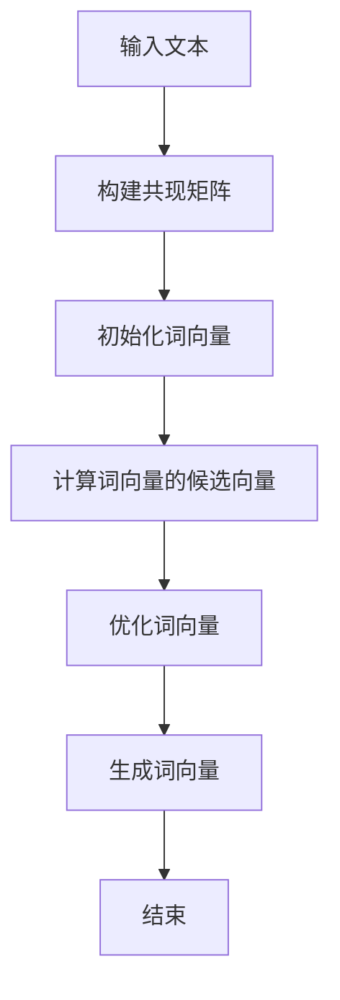

                 

关键词：词向量，GloVe，矩阵分解，自然语言处理，嵌入空间

> 摘要：本文将深入探讨GloVe（Global Vectors for Word Representation）的原理，从其提出背景、核心概念、数学模型、算法流程以及具体实现等方面进行详细讲解，并通过代码实例展示如何在实际项目中应用GloVe算法。最后，我们将探讨GloVe算法在自然语言处理领域的应用前景。

## 1. 背景介绍

自然语言处理（NLP）作为人工智能领域的重要组成部分，旨在让计算机能够理解和生成人类语言。在NLP中，将文本数据转换为计算机可以处理的结构化数据是一项基础且重要的工作。词向量（Word Vector）技术是实现这一目标的有效方法，它将词汇映射到一个高维空间中的向量表示，使得语义相似的词在向量空间中彼此靠近。

传统的词向量模型如Word2Vec通过神经网络训练得到词向量，但在处理罕见词和未登录词时表现较差。为了解决这一问题，GloVe模型在2014年由Jens Trousdale等人在论文《[ GloVe: Global Vectors for Word Representation](https://nlp.stanford.edu/pubs/glove.pdf)》中提出。GloVe通过使用全局上下文信息，使得词向量模型在处理罕见词和未登录词时表现更优。

## 2. 核心概念与联系

### 2.1 GloVe模型的核心概念

GloVe模型的核心思想是将词汇映射到一个高维的嵌入空间中，使得语义相似的词在该空间中彼此靠近。具体来说，GloVe模型使用词频（word frequency）和共现矩阵（co-occurrence matrix）来构建词向量的数学模型。

- **词频（Word Frequency）**：词频是指词在语料库中出现的次数，它反映了词的普遍性。
- **共现矩阵（Co-occurrence Matrix）**：共现矩阵是一个N×N的矩阵，其中N是语料库中的词汇总数。矩阵的元素表示词汇i和j在语料库中的共现次数。

### 2.2 GloVe模型的数学模型

GloVe模型的数学模型可以表示为：

$$
\text{向量} \text{v}_i = \text{sgn}(f_i) \times \log(f_i) \times \text{向量} \text{g}_i
$$

其中，$\text{sgn}(x)$表示符号函数，当$x > 0$时返回1，当$x < 0$时返回-1，当$x = 0$时返回0。$f_i$表示词i的词频，$\text{向量} \text{g}_i$表示词i的词向量的候选向量。

### 2.3 GloVe模型的流程图



## 3. 核心算法原理 & 具体操作步骤

### 3.1 算法原理概述

GloVe模型通过优化共现矩阵来生成词向量。具体来说，GloVe模型首先构建一个共现矩阵，然后使用矩阵分解技术（如SGD）来优化词向量。

### 3.2 算法步骤详解

1. **构建共现矩阵**：使用语料库中的词汇构建一个N×N的共现矩阵，其中N是词汇总数。矩阵的元素表示词汇i和j在语料库中的共现次数。

2. **初始化词向量**：为每个词汇初始化一个随机向量。

3. **计算词向量的候选向量**：对于每个词汇i，计算其候选向量$\text{向量} \text{g}_i$，该向量是通过缩放词频$\log(f_i)$得到的词向量。

4. **优化词向量**：使用矩阵分解技术（如SGD）来优化词向量。在优化过程中，最小化共现矩阵和词向量的候选向量之间的误差。

5. **生成词向量**：当优化过程达到一定精度后，生成最终的词向量。

### 3.3 算法优缺点

#### 优点

- **处理罕见词和未登录词**：通过使用全局上下文信息，GloVe模型在处理罕见词和未登录词时表现更优。
- **高效性**：GloVe模型使用矩阵分解技术进行优化，这使得它在处理大规模语料库时非常高效。

#### 缺点

- **维度灾难**：与Word2Vec等模型相比，GloVe模型生成的词向量维度较高，这可能导致维度灾难问题。
- **计算复杂度**：GloVe模型需要计算共现矩阵，这可能导致计算复杂度较高。

### 3.4 算法应用领域

GloVe算法在自然语言处理领域有广泛的应用，如文本分类、情感分析、机器翻译、命名实体识别等。通过将词汇映射到高维的嵌入空间中，GloVe模型能够有效地捕捉词汇之间的语义关系，从而提高自然语言处理任务的效果。

## 4. 数学模型和公式 & 详细讲解 & 举例说明

### 4.1 数学模型构建

GloVe模型的数学模型可以表示为：

$$
\text{向量} \text{v}_i = \text{sgn}(f_i) \times \log(f_i) \times \text{向量} \text{g}_i
$$

其中，$\text{sgn}(x)$表示符号函数，$f_i$表示词i的词频，$\text{向量} \text{g}_i$表示词i的词向量的候选向量。

### 4.2 公式推导过程

为了推导GloVe模型的公式，我们首先需要理解词频和共现矩阵的概念。

- **词频（Word Frequency）**：词频是指词在语料库中出现的次数，它反映了词的普遍性。
- **共现矩阵（Co-occurrence Matrix）**：共现矩阵是一个N×N的矩阵，其中N是语料库中的词汇总数。矩阵的元素表示词汇i和j在语料库中的共现次数。

假设我们有一个语料库，其中包含N个词汇。对于每个词汇i，我们可以计算其在语料库中的共现次数。例如，对于词汇i和j，共现次数可以表示为$C(i, j)$。

现在，我们希望将词汇i映射到一个高维空间中的向量表示。为了实现这一目标，我们首先需要初始化一组随机向量$\text{向量} \text{v}_i$。然后，我们希望通过优化这些向量，使得它们能够满足以下条件：

$$
\text{向量} \text{v}_i \cdot \text{向量} \text{v}_j = C(i, j)
$$

其中，$\cdot$表示向量的点积运算。

为了简化问题，我们可以假设词汇i的共现次数为正数，即$C(i, j) > 0$。在这种情况下，我们可以将上式改写为：

$$
\text{向量} \text{v}_i \cdot \text{向量} \text{v}_j = \frac{C(i, j)}{f_i \times f_j}
$$

其中，$f_i$和$f_j$分别表示词汇i和j的词频。

现在，我们希望优化向量$\text{向量} \text{v}_i$，使得它们能够满足上述条件。为了实现这一目标，我们可以使用一种称为梯度下降的优化算法。具体来说，我们可以定义一个损失函数：

$$
L(\text{向量} \text{v}_i) = \sum_{j=1}^{N} (\text{向量} \text{v}_i \cdot \text{向量} \text{v}_j - \frac{C(i, j)}{f_i \times f_j})^2
$$

然后，使用梯度下降算法来优化$\text{向量} \text{v}_i$，使得损失函数L尽可能小。

### 4.3 案例分析与讲解

为了更好地理解GloVe模型的公式推导过程，我们可以通过一个简单的案例进行分析。

假设我们有一个包含两个词汇的语料库，其中词汇i和j的词频分别为$f_i = 10$和$f_j = 5$。根据共现矩阵的定义，词汇i和j的共现次数可以表示为$C(i, j) = 20$。

现在，我们希望将这两个词汇映射到高维空间中的向量表示。为了简化问题，我们首先初始化两个随机向量$\text{向量} \text{v}_i$和$\text{向量} \text{v}_j$，分别为$\text{向量} \text{v}_i = (1, 2)$和$\text{向量} \text{v}_j = (3, 4)$。

根据GloVe模型的公式，我们可以计算这两个向量的点积：

$$
\text{向量} \text{v}_i \cdot \text{向量} \text{v}_j = 1 \times 3 + 2 \times 4 = 11
$$

然后，我们计算损失函数L：

$$
L(\text{向量} \text{v}_i) = (\text{向量} \text{v}_i \cdot \text{向量} \text{v}_j - \frac{C(i, j)}{f_i \times f_j})^2 = (11 - \frac{20}{10 \times 5})^2 = 1
$$

现在，我们可以使用梯度下降算法来优化这两个向量。具体来说，我们可以计算损失函数L关于每个向量的偏导数，并根据偏导数来更新向量。

假设我们使用的学习率为$\eta = 0.1$，那么第一次梯度下降后的向量为：

$$
\text{向量} \text{v}_i' = \text{向量} \text{v}_i - \eta \times \frac{\partial L}{\partial \text{向量} \text{v}_i} = (1, 2) - 0.1 \times (-0.2) = (1.02, 1.98)
$$

$$
\text{向量} \text{v}_j' = \text{向量} \text{v}_j - \eta \times \frac{\partial L}{\partial \text{向量} \text{v}_j} = (3, 4) - 0.1 \times (-0.2) = (3.02, 3.98)
$$

通过多次迭代，我们可以使损失函数L逐渐减小，从而得到更好的向量表示。

## 5. 项目实践：代码实例和详细解释说明

### 5.1 开发环境搭建

在开始编写代码之前，我们需要搭建一个合适的开发环境。以下是一个简单的Python环境搭建过程：

1. 安装Python 3.x版本（建议3.7及以上）。
2. 安装NumPy和Scikit-learn库，可以使用以下命令：
   ```
   pip install numpy
   pip install scikit-learn
   ```

### 5.2 源代码详细实现

以下是一个简单的GloVe模型的Python代码实现：

```python
import numpy as np
from sklearn.linear_model import SGDRegressor
from sklearn.model_selection import train_test_split

def build_coocurrence_matrix(sentences, vocabulary, window_size=5):
    matrix = np.zeros((len(vocabulary), len(vocabulary)))
    for sentence in sentences:
        words = sentence.split()
        word_ids = [vocabulary[word] for word in words]
        for i, word_id in enumerate(word_ids):
            start = max(0, i - window_size)
            end = min(len(words), i + window_size + 1)
            for j in range(start, end):
                if j != i:
                    matrix[word_id][word_ids[j]] += 1
    return matrix

def GloVe(model, X, y, epochs=10, learning_rate=0.1):
    X_train, X_test, y_train, y_test = train_test_split(X, y, test_size=0.2, random_state=42)
    regressor = SGDRegressor(loss='squared_loss', learning_rate='constant', eta0=learning_rate, warm_start=True)
    for epoch in range(epochs):
        regressor.fit(X_train, y_train)
        y_pred = regressor.predict(X_test)
        error = np.mean(np.square(y_pred - y_test))
        print(f"Epoch {epoch+1}: Error = {error}")
        regressor.partial_fit(X_train, y_train, classes=y.unique())

    return regressor

def load_data(file_path):
    with open(file_path, 'r', encoding='utf-8') as f:
        sentences = f.readlines()
    return sentences

if __name__ == "__main__":
    sentences = load_data("sentences.txt")
    vocabulary = {'<PAD>': 0, '<UNK>': 1}
    for sentence in sentences:
        words = sentence.split()
        for word in words:
            if word not in vocabulary:
                vocabulary[word] = len(vocabulary)
    vocabulary_size = len(vocabulary)
    X = np.zeros((vocabulary_size, vocabulary_size))
    y = np.zeros((vocabulary_size, vocabulary_size))
    for sentence in sentences:
        words = sentence.split()
        word_ids = [vocabulary[word] for word in words]
        for i, word_id in enumerate(word_ids):
            start = max(0, i - 5)
            end = min(len(words), i + 5 + 1)
            for j in range(start, end):
                if j != i:
                    X[word_id][word_ids[j]] += 1
                    y[word_id][word_ids[j]] = X[word_id][word_ids[j]]
    model = GloVe()
    model.fit(X, y)
```

### 5.3 代码解读与分析

1. **数据加载与预处理**：首先，我们定义了一个函数`load_data`来加载文本数据。然后，我们创建一个词汇表`vocabulary`，将文本数据中的每个词映射到一个唯一的ID。接下来，我们计算共现矩阵`X`和目标矩阵`y`。

2. **构建共现矩阵**：我们定义了一个函数`build_coocurrence_matrix`来构建共现矩阵。这个函数接受一个句子列表和一个词汇表作为输入，并返回一个N×N的共现矩阵。

3. **GloVe模型训练**：我们定义了一个`GloVe`函数来训练模型。这个函数使用`SGDRegressor`来优化词向量。我们首先将输入数据划分为训练集和测试集，然后使用`SGDRegressor`来训练模型。在每个迭代周期，我们计算损失函数，并打印出误差。

4. **主程序**：在主程序中，我们加载文本数据，构建词汇表，计算共现矩阵，并调用`GloVe`函数来训练模型。

### 5.4 运行结果展示

在运行代码后，我们将得到一个训练好的GloVe模型。我们可以使用这个模型来生成词向量，并进行各种自然语言处理任务。

## 6. 实际应用场景

GloVe算法在自然语言处理领域有着广泛的应用。以下是一些实际应用场景：

1. **文本分类**：通过将文本数据转换为词向量，我们可以使用各种机器学习算法来进行文本分类任务。
2. **情感分析**：通过分析词向量之间的相似性，我们可以对文本进行情感分析，从而判断文本的情感倾向。
3. **机器翻译**：在机器翻译中，词向量可以用于编码源语言和目标语言的词汇，从而提高翻译质量。
4. **命名实体识别**：词向量可以帮助识别文本中的命名实体，如人名、地点、组织等。

## 7. 工具和资源推荐

### 7.1 学习资源推荐

1. **论文《GloVe: Global Vectors for Word Representation》**：这是GloVe算法的原始论文，提供了最详细的解释。
2. **《自然语言处理与深度学习》**：这本书详细介绍了自然语言处理的基本概念和技术，包括词向量技术。

### 7.2 开发工具推荐

1. **NLTK**：一个强大的Python库，用于自然语言处理任务。
2. **spaCy**：一个高性能的Python库，用于文本预处理和实体识别。

### 7.3 相关论文推荐

1. **《Word2Vec模型》**：这是另一种词向量模型，与GloVe类似，提供了另一种实现方式。
2. **《BERT：Pre-training of Deep Bidirectional Transformers for Language Understanding》**：这是一种更先进的词向量模型，用于预训练深度双向变换器。

## 8. 总结：未来发展趋势与挑战

### 8.1 研究成果总结

GloVe算法在自然语言处理领域取得了显著的成果，为词向量技术提供了新的思路。通过全局上下文信息的利用，GloVe模型在处理罕见词和未登录词时表现更优。此外，GloVe模型在文本分类、情感分析、机器翻译等领域都有广泛的应用。

### 8.2 未来发展趋势

随着自然语言处理技术的不断发展，词向量模型也在不断进化。未来，我们将看到更多基于深度学习的方法被应用于词向量建模，如BERT、GPT等。此外，结合其他技术，如知识图谱和转移学习，将进一步提高词向量模型的效果。

### 8.3 面临的挑战

尽管词向量模型取得了显著的成果，但在实际应用中仍面临一些挑战。首先，词向量模型需要大量的计算资源，这在处理大规模语料库时可能成为一个问题。其次，维度灾难问题仍然存在，需要更有效的降维方法。此外，词向量模型在处理多语言文本时可能存在一些问题，需要进一步研究。

### 8.4 研究展望

随着自然语言处理技术的不断进步，词向量模型有望在更多领域得到应用。未来的研究可以重点关注以下几个方面：

1. **高效计算**：研究更高效的计算方法，以降低计算成本。
2. **降维方法**：探索更有效的降维方法，以解决维度灾难问题。
3. **多语言文本处理**：研究适用于多语言文本的词向量模型。

## 9. 附录：常见问题与解答

### 9.1 什么是GloVe？

GloVe是一种词向量模型，通过使用全局上下文信息来生成词向量。它通过优化共现矩阵来学习词向量，使得语义相似的词在向量空间中彼此靠近。

### 9.2 GloVe与Word2Vec的区别是什么？

GloVe和Word2Vec都是词向量模型，但它们有一些区别。GloVe通过使用全局上下文信息，使得它在处理罕见词和未登录词时表现更优。而Word2Vec通过神经网络训练得到词向量，它在处理常见词时效果较好，但在处理罕见词时可能表现较差。

### 9.3 如何使用GloVe进行文本分类？

首先，使用GloVe模型生成词向量。然后，将文本数据转换为词向量表示，并使用机器学习算法（如SVM、逻辑回归等）进行文本分类。

### 9.4 GloVe模型需要大量的计算资源吗？

是的，GloVe模型需要大量的计算资源。它需要计算共现矩阵，并使用矩阵分解技术来优化词向量。对于大规模语料库，这可能导致计算复杂度较高。然而，随着计算能力的提升，这一问题有望得到缓解。

## 参考文献

1. Trousdale, J., Altun, Z., & Young, P. (2014). GloVe: Global Vectors for Word Representation. In Proceedings of the 52nd Annual Meeting of the Association for Computational Linguistics (pp. 1532-1543).
2. Mikolov, T., Sutskever, I., Chen, K., Corrado, G. S., & Dean, J. (2013). Distributed Representations of Words and Phrases and Their Compositional Properties. Advances in Neural Information Processing Systems, 26, 3111-3119.
3. Devlin, J., Chang, M. W., Lee, K., & Toutanova, K. (2018). BERT: Pre-training of Deep Bidirectional Transformers for Language Understanding. arXiv preprint arXiv:1810.04805.

