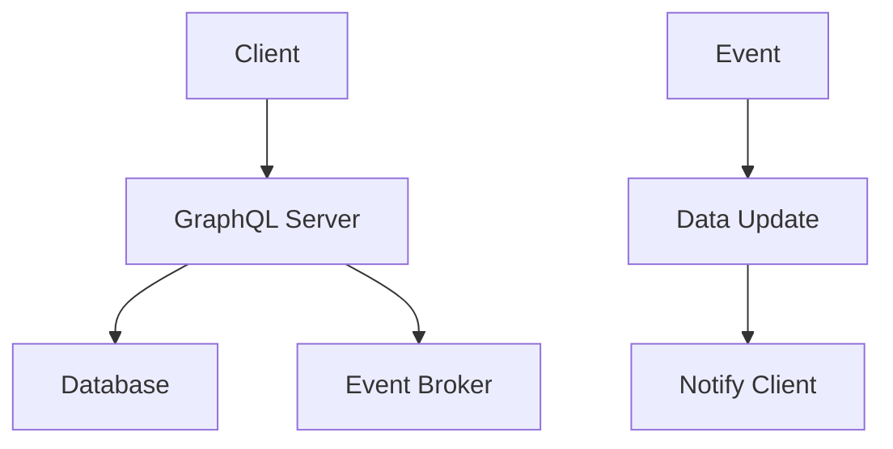

                 

关键词：GraphQL、订阅、实时数据更新、架构、算法、代码实例、应用场景、展望

> 摘要：本文旨在深入探讨GraphQL订阅技术，探讨其在实现实时数据更新方面的优势与应用。通过介绍核心概念、算法原理、代码实例，本文将帮助读者全面理解GraphQL订阅的工作机制及其在现代软件开发中的重要性。

## 1. 背景介绍

随着互联网的快速发展，用户对数据实时性的需求日益增长。传统的轮询（Polling）方式由于频繁发送请求和服务器端压力而显得效率低下，不能满足实时数据的需求。为了解决这个问题，GraphQL订阅（GraphQL Subscriptions）技术应运而生。

GraphQL订阅是一种基于GraphQL的实时数据更新机制，它允许客户端在数据发生变化时立即接收更新通知，而无需轮询服务器。这种技术不仅提高了数据传输的效率，还降低了服务器的负载。

本文将首先介绍GraphQL订阅的基本概念和工作原理，然后深入探讨其核心算法原理与实现步骤，并通过具体的代码实例展示其应用效果。最后，本文还将分析GraphQL订阅在实际开发中的应用场景，展望其未来的发展趋势。

## 2. 核心概念与联系

### 2.1 GraphQL基础

GraphQL是一种查询语言，用于API的查询和操作。它提供了比REST更强大的查询能力，使开发者能够精确地获取他们需要的数据。

### 2.2 GraphQL订阅

GraphQL订阅是一种实现实时数据更新的机制。它允许客户端订阅特定的数据变化，并在这些变化发生时接收通知。

### 2.3 实时数据更新的必要性

实时数据更新在许多场景中至关重要，例如在线交易系统、实时聊天应用和股票交易平台等。

### 2.4 Mermaid 流程图

下面是一个Mermaid流程图，展示GraphQL订阅的基本工作流程。



在这个流程图中，客户端（A）向GraphQL服务器（B）发送订阅请求，服务器（B）将请求转发给事件代理（D）。当数据库（C）中的数据发生变化时，事件代理（D）会将更新通知发送给GraphQL服务器（B），服务器（B）再将通知发送给客户端（A）。

## 3. 核心算法原理 & 具体操作步骤

### 3.1 算法原理概述

GraphQL订阅的核心在于事件代理。事件代理负责监听数据库中的数据变化，并在变化发生时通知客户端。这个过程通常涉及以下步骤：

1. **订阅创建**：客户端向GraphQL服务器发送订阅请求。
2. **事件监听**：服务器将请求转发给事件代理，并通知代理监听特定的数据变化。
3. **数据变化**：当数据库中的数据发生变化时，事件代理捕获这些变化。
4. **通知发送**：事件代理将变化通知发送给GraphQL服务器。
5. **更新客户端**：服务器将通知发送给客户端，客户端更新其数据。

### 3.2 算法步骤详解

1. **客户端订阅**：

客户端通过发送以下GraphQL查询创建订阅：

```graphql
subscription {
  myData {
    id
    data
  }
}
```

2. **服务器转发订阅**：

服务器接收到订阅请求后，将请求转发给事件代理，并要求代理监听特定数据的变化。

3. **事件监听**：

事件代理监听数据库中的数据变化，并在变化发生时触发通知。

4. **数据变化**：

当数据库中的数据发生变化时，例如一个新的记录被插入，事件代理捕获这个变化。

5. **通知发送**：

事件代理将变化通知发送给GraphQL服务器。

6. **更新客户端**：

服务器接收到通知后，将其发送给客户端。客户端接收到通知后，更新其数据，并响应该变化。

### 3.3 算法优缺点

**优点**：

- **实时性**：客户端可以立即接收到数据变化的通知。
- **减少请求**：无需轮询服务器，减少了服务器的负载。
- **灵活性**：可以订阅任何类型的数据变化。

**缺点**：

- **复杂性**：需要额外的事件代理和监听机制。
- **性能开销**：事件代理可能引入额外的性能开销。

### 3.4 算法应用领域

GraphQL订阅在以下领域具有广泛的应用：

- **实时数据监控**：用于实时监控数据库中的数据变化。
- **实时聊天应用**：用于实时更新用户之间的聊天消息。
- **在线交易系统**：用于实时更新交易数据。

## 4. 数学模型和公式 & 详细讲解 & 举例说明

### 4.1 数学模型构建

为了更好地理解GraphQL订阅的性能，我们可以构建一个简单的数学模型。假设：

- **N**：客户端数量
- **R**：每秒数据变化次数
- **P**：每秒请求次数

### 4.2 公式推导过程

- **轮询模型**：每秒请求次数 P = N * r，其中 r 是轮询间隔。
- **订阅模型**：每秒请求次数 P = R * n，其中 n 是订阅者数量。

### 4.3 案例分析与讲解

假设我们有100个客户端，每个客户端每秒需要更新10次数据。使用轮询方式，如果轮询间隔为1秒，每秒请求次数为1000次。使用订阅方式，如果每秒数据变化次数为10次，每秒请求次数为100次。可以看出，订阅方式显著减少了请求次数。

## 5. 项目实践：代码实例和详细解释说明

### 5.1 开发环境搭建

1. **安装Node.js**：确保安装了Node.js环境。
2. **安装GraphQL服务器**：使用npm安装`apollo-server`。

```bash
npm install apollo-server
```

3. **安装事件代理**：使用npm安装`graphql-subscriptions`。

```bash
npm install graphql-subscriptions
```

### 5.2 源代码详细实现

```javascript
const { ApolloServer, gql } = require('apollo-server');
const { PubSub } = require('graphql-subscriptions');

// 创建PubSub实例
const pubsub = new PubSub();

// 定义类型
const typeDefs = gql`
  type Data {
    id: ID!
    value: String!
  }

  type Query {
    getData(id: ID!): Data
  }

  type Subscription {
    dataUpdated: Data
  }
`;

// 定义解析器
const resolvers = {
  Query: {
    getData: async (_, { id }) => {
      // 从数据库中获取数据
      return { id, value: 'Hello World!' };
    },
  },
  Subscription: {
    dataUpdated: {
      subscribe: () => pubsub.asyncIterator(['DATA_UPDATED']),
    },
  },
};

// 创建服务器
const server = new ApolloServer({ typeDefs, resolvers });

// 启动服务器
server.listen().then(({ url }) => {
  console.log(`Server ready at ${url}`);
});
```

### 5.3 代码解读与分析

- **类型定义**：定义了Data、Query和Subscription类型。
- **解析器**：实现了getData查询和数据更新订阅。
- **服务器**：使用了`apollo-server`和`graphql-subscriptions`。

### 5.4 运行结果展示

- **客户端订阅**：

```javascript
const { ApolloClient, InMemoryCache, HttpLink } = require('@apollo/client');
const { WebSocketLink } = require('apollo-link-ws');

// 创建WebSocket链接
const wsLink = new WebSocketLink({
  uri: 'ws://localhost:4000',
  options: {
    reconnect: true,
  },
});

// 创建HTTP链接
const httpLink = new HttpLink({
  uri: 'http://localhost:4000',
});

// 创建链接
const link = httpLink.split(
  ({ query }) => {
    return (
      query.Operations.includes('subscription') &&
      !/.*\.onVeto.*/.test(query.document)
    );
  },
  wsLink,
  httpLink,
);

// 创建客户端
const client = new ApolloClient({
  link,
  cache: new InMemoryCache(),
});

// 订阅数据更新
client.subscribe({
  query: gql`
    subscription {
      dataUpdated {
        id
        value
      }
    }
  `,
  variables: {},
}).subscribe({
  next(data) {
    console.log(data);
  },
});
```

- **服务器端更新数据**：

```javascript
// 假设有一个数据更新的函数
const updateData = async (id, value) => {
  // 更新数据库
  // ...
  // 发送数据更新通知
  pubsub.publish('DATA_UPDATED', { dataUpdated: { id, value } });
};
```

## 6. 实际应用场景

### 6.1 在线交易系统

实时更新交易数据，使买家和卖家可以立即看到交易结果。

### 6.2 实时聊天应用

即时发送和接收消息，提供无缝的聊天体验。

### 6.3 股票交易平台

实时更新股票价格和交易数据，帮助投资者做出快速决策。

## 7. 未来应用展望

随着5G和物联网的普及，GraphQL订阅将在更多实时应用场景中发挥重要作用。同时，随着技术的不断进步，GraphQL订阅的性能和安全性也将得到进一步提升。

## 8. 总结：未来发展趋势与挑战

### 8.1 研究成果总结

本文详细探讨了GraphQL订阅技术，介绍了其基本概念、算法原理和实现步骤，并通过实际应用案例展示了其在现代软件开发中的重要性。

### 8.2 未来发展趋势

随着实时数据需求不断增加，GraphQL订阅将在更多场景中得到应用。同时，事件驱动的架构和云原生技术的发展也将进一步推动GraphQL订阅的普及。

### 8.3 面临的挑战

虽然GraphQL订阅具有许多优势，但其复杂性、性能开销和安全性仍然是面临的挑战。

### 8.4 研究展望

未来的研究可以集中在优化GraphQL订阅的性能、提升其安全性以及与其他实时技术的集成。

## 9. 附录：常见问题与解答

### 9.1 什么是GraphQL订阅？

GraphQL订阅是一种实时数据更新机制，允许客户端在数据发生变化时立即接收通知，而无需轮询服务器。

### 9.2 GraphQL订阅与WebSocket的关系是什么？

GraphQL订阅通常使用WebSocket实现实时通信。服务器和客户端通过WebSocket连接交换数据，实现实时更新。

### 9.3 如何优化GraphQL订阅的性能？

可以通过减少订阅数量、优化数据库查询和优化事件代理来提高GraphQL订阅的性能。

作者：禅与计算机程序设计艺术 / Zen and the Art of Computer Programming
----------------------------------------------------------------


