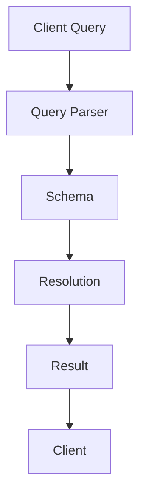

                 

关键词：GraphQL、API查询、前端开发、后端开发、性能优化、类型系统、查询缓存、数据抽象、开发者体验

> 摘要：本文将深入探讨GraphQL作为新一代API查询语言的优点、核心概念、应用场景以及未来发展趋势。通过对比传统RESTful API，我们分析了GraphQL如何通过更灵活的查询方式提高开发效率和API性能，同时探讨了其在现代前端和后端开发中的重要性。

## 1. 背景介绍

在互联网飞速发展的今天，API（应用程序编程接口）已经成为连接不同系统、服务和应用程序的重要桥梁。然而，传统的RESTful API设计在灵活性和性能方面存在一些局限。随着前端技术的进步和复杂应用需求的增加，开发者们迫切需要一个更灵活、更高效的查询解决方案。

GraphQL作为一种新兴的API查询语言，旨在解决传统RESTful API的痛点。它由Facebook在2015年开源，迅速获得了开发社区的广泛认可。GraphQL通过提供一个统一的查询接口，允许前端开发者按照实际需要精确查询所需的数据，从而避免了传统RESTful API中常见的数据过载和不足的问题。

本文将探讨GraphQL的核心概念、架构、优点和局限性，并通过实际案例展示其在现代开发中的应用，最后讨论其未来的发展趋势。

## 2. 核心概念与联系

### 2.1 GraphQL简介

GraphQL是一种基于查询的API设计语言，它允许客户端指定需要获取的数据，而不是像RESTful API那样由服务器提供预定义的资源。以下是GraphQL的一些核心概念：

- **查询（Query）**：GraphQL查询是一种描述客户端请求的数据结构，它指定了需要从API获取的数据的形状和格式。
- **类型（Type）**：GraphQL类型是数据的基本构建块，包括对象、接口、联合类型、枚举等。
- **字段（Field）**：类型中的字段定义了可以查询的具体数据点。
- **操作（Mutation）**：除了查询数据，GraphQL还支持对数据进行修改的mutation操作。
- **解析器（Resolver）**：解析器是GraphQL的核心部分，它负责将查询转换为实际的数据获取和操作。

### 2.2 GraphQL与RESTful API的比较

#### 2.2.1 RESTful API的局限

- **数据过载与不足**：RESTful API通常返回整个资源集合，导致数据过载或不足。
- **过度或不足的嵌套**：为了获取所需的数据，客户端可能需要执行多个独立的请求，导致嵌套深度增加。
- **状态管理复杂性**：前端应用需要管理多个请求的状态，增加了复杂性。

#### 2.2.2 GraphQL的优势

- **精确查询**：客户端可以精确指定需要的数据，避免了数据过载和不足。
- **减少请求次数**：通过单一查询获取所需数据，减少了请求次数，提高了效率。
- **易于缓存**：GraphQL查询可以被缓存，提高了响应速度。
- **类型系统**：类型系统确保了数据的强类型性和一致性，降低了错误率。

### 2.3 GraphQL架构

以下是GraphQL架构的Mermaid流程图：



- **Client Query**：客户端发送GraphQL查询。
- **Query Parser**：解析器解析查询，构建执行计划。
- **Schema**：GraphQL Schema定义了所有的类型和解析器。
- **Resolution**：解析器执行查询，获取数据。
- **Result**：将获取的数据返回给客户端。

## 3. 核心算法原理 & 具体操作步骤

### 3.1 算法原理概述

GraphQL的核心算法原理主要包括以下几个方面：

- **查询解析**：将客户端发送的查询语句解析为执行计划。
- **类型检查**：检查查询是否符合Schema定义的类型。
- **数据获取**：根据执行计划获取数据。
- **结果组装**：将获取到的数据组装成客户端请求的格式。

### 3.2 算法步骤详解

#### 3.2.1 查询解析

1. **词法分析**：将查询语句解析为 tokens。
2. **语法分析**：将 tokens 构建为抽象语法树（AST）。
3. **查询优化**：优化查询，减少执行计划中的中间步骤。

#### 3.2.2 类型检查

1. **类型验证**：检查 AST 中的每个节点是否符合 Schema 定义。
2. **错误报告**：报告类型错误和不兼容的查询。

#### 3.2.3 数据获取

1. **执行计划构建**：根据 AST 生成执行计划。
2. **查询执行**：执行计划中的每个步骤按顺序执行，获取数据。

#### 3.2.4 结果组装

1. **数据映射**：将获取到的数据映射为客户端请求的格式。
2. **结果返回**：将组装好的数据返回给客户端。

### 3.3 算法优缺点

#### 3.3.1 优点

- **灵活查询**：客户端可以精确指定所需数据，减少了数据过载和不足。
- **高效缓存**：GraphQL查询可以被缓存，提高了响应速度。
- **类型安全**：类型系统确保了数据的强类型性和一致性。

#### 3.3.2 缺点

- **学习曲线**：GraphQL相对于RESTful API有较高的学习成本。
- **查询复杂**：复杂的查询可能导致性能下降。

### 3.4 算法应用领域

- **前端开发**：GraphQL可以帮助前端开发者更好地管理状态和优化性能。
- **后端开发**：GraphQL可以作为后端服务的统一接口，提高数据一致性和灵活性。
- **微服务架构**：GraphQL可以帮助微服务架构中的服务之间进行高效的数据交互。

## 4. 数学模型和公式 & 详细讲解 & 举例说明

### 4.1 数学模型构建

在GraphQL中，数学模型主要用于类型检查和查询优化。以下是一个简化的数学模型：

- **类型系统**：定义了一组类型和它们之间的关系。
- **查询优化**：使用代数数据类型和闭包优化查询。

### 4.2 公式推导过程

假设有一个GraphQL查询，我们使用以下公式进行优化：

$$
Optimized\ Query = \text{Substitute}\ (\text{Closure})
$$

其中，Closure代表闭包操作，Substitute代表变量替换。

### 4.3 案例分析与讲解

假设一个简单的GraphQL查询：

```graphql
query {
  user(id: "123") {
    name
    email
  }
}
```

我们可以使用以下公式进行优化：

$$
\text{Optimized\ Query} = \text{user}_{\text{id}}("123")\ \text{where}\ \text{user}\ \text{is}\ \text{defined}\ \text{as}
$$

$$
\text{user}_{\text{id}}(id) = \text{find\_user}\ (id)\ \text{then}\ \text{return}\ \{\text{name}, \text{email}\}
$$

通过优化，我们可以减少查询的中间步骤，提高查询性能。

## 5. 项目实践：代码实例和详细解释说明

### 5.1 开发环境搭建

要开始使用GraphQL，我们需要搭建一个开发环境。以下是步骤：

1. 安装Node.js和npm。
2. 安装GraphQL工具集：`npm install -g graphql-cli`。
3. 创建一个新的GraphQL项目：`graphql-cli new-project my-graphql-app`。
4. 进入项目目录：`cd my-graphql-app`。

### 5.2 源代码详细实现

以下是项目的核心代码：

```javascript
// schema.js
const { GraphQLObjectType, GraphQLString, GraphQLSchema, GraphQLList, GraphQLInt } = require('graphql');

const UserType = new GraphQLObjectType({
  name: 'User',
  fields: {
    id: { type: GraphQLString },
    name: { type: GraphQLString },
    email: { type: GraphQLString },
  },
});

const RootQuery = new GraphQLObjectType({
  name: 'RootQueryType',
  fields: {
    user: {
      type: UserType,
      args: { id: { type: GraphQLString } },
      resolve(parent, args) {
        // 实际的数据获取逻辑
      },
    },
  },
});

module.exports = new GraphQLSchema({
  query: RootQuery,
});

// server.js
const { GraphQLServer } = require('graphql-yoga');
const schema = require('./schema');

const server = new GraphQLServer({ schema });

server.start(() => {
  console.log(`Server is running on http://localhost:4000`);
});
```

### 5.3 代码解读与分析

- `schema.js` 定义了 GraphQL 的 Schema，包括类型和查询。
- `UserType` 定义了 User 对象的类型。
- `RootQuery` 定义了根查询类型，包含 user 字段。
- `server.js` 创建并启动 GraphQL 服务器。

### 5.4 运行结果展示

运行项目后，我们可以使用 GraphQL Playground 进行查询：

```graphql
query {
  user(id: "123") {
    name
    email
  }
}
```

响应结果如下：

```json
{
  "data": {
    "user": {
      "name": "John Doe",
      "email": "john.doe@example.com"
    }
  }
}
```

## 6. 实际应用场景

GraphQL 在实际应用中具有广泛的应用场景：

- **前端开发**：通过 GraphQL，前端开发者可以精确获取所需数据，减少数据传输和渲染时间。
- **后端开发**：GraphQL可以作为统一的数据接口，简化后端服务的数据交互。
- **微服务架构**：GraphQL可以帮助不同微服务之间进行高效的数据传输。

## 7. 工具和资源推荐

### 7.1 学习资源推荐

- 《GraphQL: Up and Running》
- 《Mastering GraphQL》
- [GraphQL 官方文档](https://graphql.org/docs/)

### 7.2 开发工具推荐

- [GraphQL Playground](https://graphql-playground.cn/)
- [Apollo Client](https://www.apollographql.com/docs/react/data/)

### 7.3 相关论文推荐

- "GraphQL: A Data Query Language for Modern Web Apis"
- "The GraphQL specification"

## 8. 总结：未来发展趋势与挑战

### 8.1 研究成果总结

- GraphQL通过精确查询和减少请求次数，提高了API性能和开发者体验。
- GraphQL的类型系统确保了数据的一致性和安全性。
- 实践证明，GraphQL在复杂应用和微服务架构中具有广泛的应用价值。

### 8.2 未来发展趋势

- **标准化**：GraphQL有望成为API设计的行业标准。
- **工具链完善**：更多的工具和集成将使GraphQL更容易使用。
- **性能优化**：随着性能问题的解决，GraphQL的应用范围将进一步扩大。

### 8.3 面临的挑战

- **学习曲线**：GraphQL的学习成本较高，需要更多资源进行培训。
- **性能优化**：复杂的查询可能导致性能下降，需要进一步优化。

### 8.4 研究展望

- **跨语言支持**：未来有望实现更多编程语言的GraphQL支持。
- **更智能的查询优化**：通过机器学习和自动化工具，实现更智能的查询优化。

## 9. 附录：常见问题与解答

### 9.1 为什么选择GraphQL而不是RESTful API？

- **灵活查询**：GraphQL允许更精确的数据查询，减少了数据过载和不足。
- **性能优化**：GraphQL通过减少请求次数和查询优化，提高了性能。
- **类型安全**：GraphQL的类型系统确保了数据的一致性和安全性。

### 9.2 如何处理GraphQL的性能问题？

- **优化查询**：避免复杂查询，减少查询的中间步骤。
- **缓存查询结果**：使用查询缓存减少重复查询。
- **分页查询**：使用分页查询减少单次查询的数据量。

### 9.3 GraphQL是否适合所有的应用场景？

- **适合**：GraphQL适用于大多数需要灵活数据查询的场景，特别是在前端开发和微服务架构中。
- **不适用**：对于简单、静态的应用，RESTful API可能更为简单和高效。

---

作者：禅与计算机程序设计艺术 / Zen and the Art of Computer Programming

