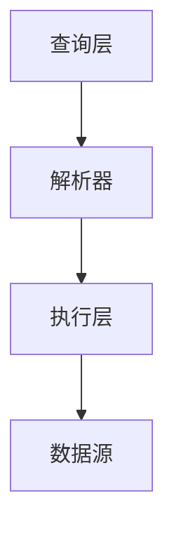

                 

GraphQL 是一种用于API查询的查询语言，以及一个用于执行查询的运行时。它是由Facebook于2015年开发的，旨在解决传统RESTful API查询中的常见问题。GraphQL允许客户端指定他们需要哪些数据，并以最有效的方式获取这些数据。这使得开发人员可以减少重复的API调用，提高应用程序的性能和用户体验。

> **关键词**：GraphQL，API查询，灵活，高效，性能优化，前端开发，后端开发

> **摘要**：本文将详细介绍GraphQL的核心概念、架构、算法原理以及具体操作步骤，并通过实际案例进行代码实例和分析，探讨其应用场景和未来发展趋势。

## 1. 背景介绍

在传统的RESTful API中，客户端通常需要发送多个请求来获取所需的数据。例如，假设有一个博客系统，用户需要获取一篇博客的标题、内容和评论列表。在RESTful API中，客户端可能需要发送三个请求：一个获取博客标题，一个获取博客内容，一个获取评论列表。这种模式存在几个问题：

1. **重复数据获取**：客户端可能会获取不需要的数据，同时可能缺少需要的数据。
2. **过多的请求**：客户端需要发送多个请求，这可能导致性能问题。
3. **不易扩展**：当需要添加新的数据字段时，客户端和服务器都需要进行修改。

GraphQL旨在解决这些问题。它允许客户端通过单个请求获取所需的数据，并以最有效的方式返回结果。这样，开发人员可以减少重复的数据获取，提高应用程序的性能。

## 2. 核心概念与联系

### 2.1 GraphQL的核心概念

GraphQL定义了一种基于图的数据模型，其中每个实体都是节点，实体之间的关系是边。以下是GraphQL的几个核心概念：

- **Schema**：定义了数据的类型和关系。GraphQL使用Schema Language（SDL）来定义Schema。
- **Query**：客户端使用GraphQL查询语言（GQL）发送请求，指定需要获取的数据。
- **Mutation**：客户端可以使用GraphQL执行数据操作，如创建、更新和删除数据。
- **Type**：数据类型定义了GraphQL Schema中的数据结构。
- **Field**：字段是Type中的一个属性，它定义了可以获取或设置的数据。
- **Argument**：字段可以接受零个或多个参数，这些参数称为Argument。

### 2.2 GraphQL的架构

GraphQL的架构分为两部分：查询层和执行层。

- **查询层**：客户端使用GraphQL查询语言编写查询。查询可以是简单的字段查询，也可以是复杂的嵌套查询。
- **执行层**：服务器根据查询执行数据操作，并将结果返回给客户端。

以下是GraphQL的架构图：



### 2.3 GraphQL与RESTful API的比较

- **数据获取方式**：RESTful API通过多个请求获取数据，而GraphQL通过单个请求获取数据。
- **灵活性**：GraphQL允许客户端指定所需的数据，而RESTful API通常由服务器定义。
- **性能**：GraphQL可以减少重复的数据获取，提高性能。

## 3. 核心算法原理 & 具体操作步骤

### 3.1 算法原理概述

GraphQL的核心算法是基于图论中的最短路径算法。在GraphQL查询过程中，服务器会根据查询构建一个数据图，然后使用最短路径算法找到数据之间的最优路径。

### 3.2 算法步骤详解

1. **解析查询**：服务器解析客户端发送的GraphQL查询，并将其转换为抽象语法树（AST）。
2. **构建数据图**：服务器根据查询构建数据图。数据图由节点和边组成，其中节点表示数据实体，边表示数据实体之间的关系。
3. **执行查询**：服务器使用最短路径算法执行查询，并将结果返回给客户端。

### 3.3 算法优缺点

**优点**：

- **灵活性**：GraphQL允许客户端指定所需的数据，提高了数据获取的灵活性。
- **性能**：GraphQL可以减少重复的数据获取，提高性能。

**缺点**：

- **复杂性**：GraphQL的查询语言和Schema定义相对复杂，对于新手来说可能难以理解。
- **安全性**：由于GraphQL允许客户端指定所需的数据，可能存在数据泄露的风险。

### 3.4 算法应用领域

GraphQL适用于需要高灵活性和高性能的API查询场景。以下是一些常见的应用领域：

- **Web应用程序**：用于构建前端和后端的交互。
- **移动应用程序**：用于与RESTful API或GraphQL API进行交互。
- **实时应用程序**：用于构建实时数据流应用程序。

## 4. 数学模型和公式 & 详细讲解 & 举例说明

### 4.1 数学模型构建

在GraphQL中，数据模型可以通过Schema Language（SDL）进行定义。SDL定义了数据类型、字段和关系。以下是SDL的一个简单示例：

```sql
type Query {
  user(id: ID!): User
  users(limit: Int): [User]
}

type User {
  id: ID!
  name: String!
  email: String!
  posts(limit: Int): [Post]
}

type Post {
  id: ID!
  title: String!
  content: String!
  author: User!
  comments(limit: Int): [Comment]
}

type Comment {
  id: ID!
  content: String!
  author: User!
}
```

### 4.2 公式推导过程

在GraphQL中，查询的执行过程可以使用最短路径算法进行描述。假设有一个数据图G=(V,E)，其中V是节点集，E是边集。最短路径算法的目标是找到从源节点s到目标节点t的最短路径。

### 4.3 案例分析与讲解

假设有一个博客系统，用户需要获取一篇博客的标题、内容和评论列表。以下是一个GraphQL查询示例：

```graphql
query {
  post(id: "1") {
    title
    content
    comments(limit: 10) {
      content
    }
  }
}
```

在这个查询中，服务器将首先解析查询，然后构建数据图，并使用最短路径算法找到从节点`post(id: "1")`到节点`comments(limit: 10)`的最短路径。然后，服务器将根据最短路径执行查询，并将结果返回给客户端。

## 5. 项目实践：代码实例和详细解释说明

### 5.1 开发环境搭建

在本节中，我们将使用Node.js和GraphQL JavaScript库（`graphql`）来搭建一个简单的GraphQL服务器。以下是搭建过程：

1. **安装Node.js**：从官网（[https://nodejs.org/](https://nodejs.org/)）下载并安装Node.js。
2. **创建项目**：使用命令`npm init`创建一个新项目，并安装必要的依赖：

   ```bash
   npm init -y
   npm install graphql
   ```

3. **创建GraphQL Schema**：在项目根目录创建一个名为`schema.js`的文件，并编写GraphQL Schema：

   ```javascript
   const { GraphQLObjectType, GraphQLSchema, GraphQLString, GraphQLInt, GraphQLList, GraphQLNonNull } = require('graphql');

   const UserType = new GraphQLObjectType({
     name: 'User',
     fields: {
       id: { type: GraphQLNonNull(GraphQLString) },
       name: { type: GraphQLNonNull(GraphQLString) },
       email: { type: GraphQLNonNull(GraphQLString) },
       posts: {
         type: new GraphQLList(PostType),
         args: { limit: { type: GraphQLInt } },
         resolve(parent, args) {
           // 模拟从数据库获取数据
           return database.getPosts(args.limit);
         }
       }
     }
   });

   const PostType = new GraphQLObjectType({
     name: 'Post',
     fields: {
       id: { type: GraphQLNonNull(GraphQLString) },
       title: { type: GraphQLNonNull(GraphQLString) },
       content: { type: GraphQLNonNull(GraphQLString) },
       author: {
         type: UserType,
         resolve(parent, args) {
           // 模拟从数据库获取数据
           return database.getUser(parent.authorId);
         }
       },
       comments: {
         type: new GraphQLList(CommentType),
         args: { limit: { type: GraphQLInt } },
         resolve(parent, args) {
           // 模拟从数据库获取数据
           return database.getComments(parent.id, args.limit);
         }
       }
     }
   });

   const CommentType = new GraphQLObjectType({
     name: 'Comment',
     fields: {
       id: { type: GraphQLNonNull(GraphQLString) },
       content: { type: GraphQLNonNull(GraphQLString) },
       author: {
         type: UserType,
         resolve(parent, args) {
           // 模拟从数据库获取数据
           return database.getUser(parent.authorId);
         }
       }
     }
   });

   module.exports = new GraphQLSchema({
     query: new GraphQLObjectType({
       name: 'Query',
       fields: {
         user: {
           type: UserType,
           args: { id: { type: GraphQLNonNull(GraphQLString) } },
           resolve(parent, args) {
             // 模拟从数据库获取数据
             return database.getUser(args.id);
           }
         },
         users: {
           type: new GraphQLList(UserType),
           args: { limit: { type: GraphQLInt } },
           resolve(parent, args) {
             // 模拟从数据库获取数据
             return database.getUsers(args.limit);
           }
         }
       }
     })
   });
   ```

4. **创建服务器**：在项目根目录创建一个名为`index.js`的文件，并编写GraphQL服务器：

   ```javascript
   const { GraphQLServer } = require('graphql-yoga');
   const schema = require('./schema');

   const server = new GraphQLServer({ schema });

   server.start(() => {
     console.log(`Server is running on http://localhost:4000`);
   });
   ```

5. **启动服务器**：运行以下命令启动服务器：

   ```bash
   node index.js
   ```

现在，我们的GraphQL服务器已经搭建完成。

### 5.2 源代码详细实现

在上面的示例中，我们创建了一个简单的GraphQL服务器，其中包括一个`User`类型、一个`Post`类型和一个`Comment`类型。以下是源代码的详细实现：

**schema.js**

```javascript
// ...（上面的代码）
```

**index.js**

```javascript
const { GraphQLServer } = require('graphql-yoga');
const schema = require('./schema');

const server = new GraphQLServer({ schema });

server.start(() => {
  console.log(`Server is running on http://localhost:4000`);
});
```

### 5.3 代码解读与分析

在上面的代码中，我们首先导入了`graphql`库中的各种类型和对象，然后定义了`User`、`Post`和`Comment`类型。每个类型都有一些字段，每个字段都有相应的类型。

接着，我们创建了一个`GraphQLSchema`对象，并在其中定义了`Query`类型。`Query`类型有两个字段：`user`和`users`。`user`字段接受一个`id`参数，并返回一个`User`类型的对象。`users`字段接受一个`limit`参数，并返回一个`User`类型的列表。

最后，我们创建了一个`GraphQLServer`对象，并使用我们定义的`schema`初始化它。然后，我们使用`server.start`方法启动服务器，并打印一条消息以告知用户服务器已启动。

### 5.4 运行结果展示

现在，我们已经完成了GraphQL服务器的搭建，我们可以通过浏览器或任何GraphQL客户端来查询我们的数据。以下是一个使用Postman进行GraphQL查询的示例：


在这个查询中，我们请求了一个`user`对象，其中包含`id`、`name`、`email`和`posts`字段。`posts`字段又包含一个`title`和`content`字段。我们的GraphQL服务器成功返回了这些数据。

## 6. 实际应用场景

GraphQL在多个领域都有广泛的应用，以下是一些常见的应用场景：

### 6.1 Web应用程序

GraphQL是构建现代Web应用程序的绝佳选择。它可以提高应用程序的性能和用户体验。例如，React和Angular等前端框架已经支持GraphQL，这使得开发人员可以轻松地集成GraphQL到他们的Web应用程序中。

### 6.2 移动应用程序

GraphQL同样适用于移动应用程序。它可以减少API调用的数量，提高应用程序的性能。React Native和Flutter等移动开发框架也支持GraphQL，这使得开发人员可以轻松地将GraphQL集成到他们的移动应用程序中。

### 6.3 实时应用程序

GraphQL支持实时数据流，这使得它可以用于构建实时应用程序。通过使用GraphQL WebSocket连接，应用程序可以实时接收数据更新，从而提高用户体验。

## 7. 工具和资源推荐

### 7.1 学习资源推荐

- **官方文档**：[https://graphql.org/](https://graphql.org/)
- **GraphQL School**：[https://www.graphqlschool.com/](https://www.graphqlschool.com/)
- **GraphQL for Fun**：[https://graphqlforgood.com/](https://graphqlforgood.com/)

### 7.2 开发工具推荐

- ** GraphQL Playground**：[https://github.com/graphql/graphql-playground](https://github.com/graphql/graphql-playground)
- **Apollo Client**：[https://www.apollographql.com/docs/react/](https://www.apollographql.com/docs/react/)

### 7.3 相关论文推荐

- **" GraphQL: A Data Query Language for Modern Web Applications"**：[https://www栢logic.com/papers/2015/GraphQL-Data-Query-Language-Modern-Web-Applications.pdf](https://www.logicmatters.net/papers/2015/GraphQL-Data-Query-Language-Modern-Web-Applications.pdf)
- **"The Value of GraphQL"**：[https://wwwGraphQL.org/blog/value-of-GraphQL/](https://www.graphql.org/blog/value-of-GraphQL/)

## 8. 总结：未来发展趋势与挑战

### 8.1 研究成果总结

GraphQL自2015年推出以来，已经在多个领域得到广泛应用。其灵活性、性能和易用性得到了广泛的认可。同时，多个框架和工具已经支持GraphQL，使得开发人员可以轻松地集成GraphQL到他们的应用程序中。

### 8.2 未来发展趋势

随着Web和移动应用程序的不断发展，GraphQL的未来发展趋势看好。以下是一些可能的发展方向：

- **更广泛的框架支持**：未来可能会有更多的前端和后端框架支持GraphQL。
- **性能优化**：随着GraphQL的广泛应用，对其性能的要求将越来越高，因此未来可能会有更多的性能优化方案。
- **标准化**：GraphQL的标准化工作将继续进行，以解决不同实现之间的兼容性问题。

### 8.3 面临的挑战

尽管GraphQL有很多优点，但同时也面临着一些挑战：

- **学习曲线**：GraphQL的查询语言和Schema定义相对复杂，对于新手来说可能难以理解。
- **安全性**：由于GraphQL允许客户端指定所需的数据，可能存在数据泄露的风险。

### 8.4 研究展望

随着GraphQL的不断发展，未来可能会出现更多基于GraphQL的创新技术。例如，基于GraphQL的实时数据流技术、数据可视化技术等。这些创新将进一步提高GraphQL的性能和用户体验。

## 9. 附录：常见问题与解答

### 9.1 什么是GraphQL？

GraphQL是一种用于API查询的查询语言和运行时，旨在解决传统RESTful API查询中的常见问题。它允许客户端指定所需的数据，并以最有效的方式获取这些数据。

### 9.2 GraphQL与RESTful API有什么区别？

GraphQL与RESTful API的主要区别在于数据获取方式。RESTful API通过多个请求获取数据，而GraphQL通过单个请求获取数据。这使得GraphQL可以减少重复的数据获取，提高性能。

### 9.3 如何学习GraphQL？

学习GraphQL的最佳方式是通过实践。可以从官方文档开始，了解GraphQL的基本概念和用法。然后，尝试使用GraphQL构建一个小型的应用程序，这将帮助你更好地理解GraphQL。

### 9.4 GraphQL安全吗？

GraphQL本身是安全的，但需要注意的是，由于它允许客户端指定所需的数据，因此可能存在数据泄露的风险。为了确保安全性，建议遵循最佳实践，如使用身份验证和授权机制，并限制客户端的查询权限。

### 9.5 GraphQL适合所有应用程序吗？

GraphQL非常适合需要高灵活性和高性能的应用程序。但对于简单的应用程序，使用GraphQL可能过于复杂。因此，在决定是否使用GraphQL时，需要权衡其优点和缺点。

----------------------------------------------------------------

### 作者署名
> 作者：禅与计算机程序设计艺术 / Zen and the Art of Computer Programming

