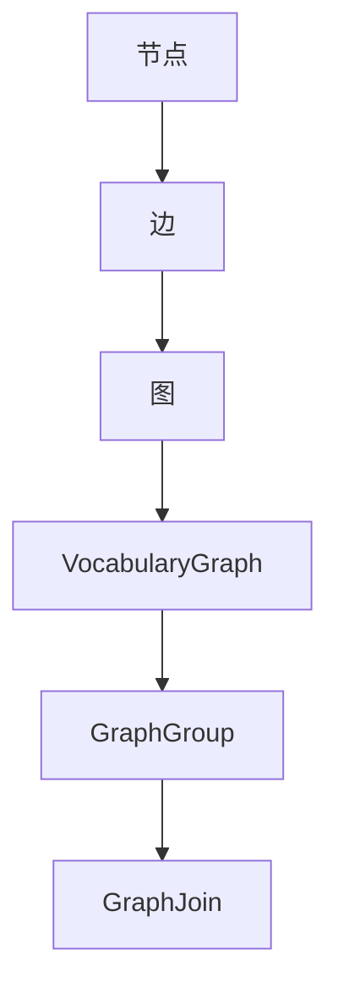

                 

## 1. 背景介绍

GraphX是Apache Spark的一个图处理框架，它基于Spark的弹性分布式数据集（RDD）和弹性分布式图（EdgeRDD）构建。GraphX的主要目标是在大数据环境中提供高效的图处理能力，并且能够与Spark的其他组件无缝集成，如Spark SQL、MLlib等。

### 为什么需要GraphX？

在大数据处理中，图处理是一个至关重要的领域。现实世界中的很多问题都可以抽象为图问题，例如社交网络分析、生物信息学、推荐系统、网络拓扑分析等。传统的批处理系统在面对大规模图数据时，往往因为数据存储和计算效率低下而显得力不从心。而GraphX通过其独特的架构和算法，提供了高效的图处理能力。

### GraphX的关键特性

- **弹性分布式图（Resilient Distributed Dataset, RDD）**: GraphX基于Spark的RDD构建，这使得GraphX具有Spark的弹性，能够处理大规模数据集，并且在数据丢失时能够自动恢复。

- **图处理操作（Graph Operations）**: GraphX提供了丰富的图处理操作，如VocabularyGraph、GraphGroup、GraphJoin等，使得用户能够方便地进行图计算。

- **并行计算**: GraphX利用Spark的分布式计算能力，将图分割成多个分区并行处理，大大提高了计算效率。

- **优化内存管理**: GraphX的内存管理策略能够有效地减少内存占用，提高计算效率。

### 主要用途

- **社交网络分析**: 分析社交网络中的好友关系、影响力传播等。

- **推荐系统**: 基于图算法进行用户兴趣分析和推荐。

- **生物信息学**: 分析蛋白质相互作用网络、基因调控网络等。

- **网络拓扑分析**: 分析网络结构、检测异常节点等。

## 2. 核心概念与联系

### 2.1 节点（Vertex）

节点是图的基本构建块，每个节点代表一个实体，可以是任何类型的数据。在GraphX中，节点通常包含一个标识符和一个属性列表。节点可以通过唯一标识符来访问。

### 2.2 边（Edge）

边连接两个节点，表示节点之间的关系。边同样可以包含属性，如边的权重、类型等。在GraphX中，边通过起点和终点标识符来定义。

### 2.3 图（Graph）

图是由节点和边组成的集合。在GraphX中，图通过弹性分布式图（EdgeRDD）表示，EdgeRDD是一个RDD，其中每个元素是一个包含起点、终点和边属性的Edge对象。

### 2.4 核心概念之间的联系

节点和边组成了图的基本结构。节点和边都可以具有属性，这使得图能够表示复杂的关系和数据。图处理操作如VocabularyGraph、GraphGroup、GraphJoin等，都是基于节点和边进行操作的。

### 2.5 Mermaid流程图

下面是一个简单的Mermaid流程图，展示了GraphX中的核心概念和操作：



## 3. 核心算法原理 & 具体操作步骤

### 3.1 算法原理概述

GraphX的核心算法包括图遍历、单源最短路径、多源最短路径等。这些算法都是基于图的基本操作，如VocabularyGraph、GraphGroup、GraphJoin等。

### 3.2 算法步骤详解

#### 3.2.1 图遍历

图遍历是指从一个节点开始，按照一定的策略访问所有节点。GraphX提供了深度优先遍历（DFS）和广度优先遍历（BFS）算法。

- **深度优先遍历（DFS）**:
  1. 从起始节点开始，将其标记为已访问。
  2. 访问所有未访问的邻居节点，并对每个邻居节点重复上述步骤。
  3. 当所有邻居节点都被访问过时，回溯到上一个节点，并访问下一个未访问的邻居节点。

- **广度优先遍历（BFS）**:
  1. 从起始节点开始，将其加入队列。
  2. 从队列中取出一个节点，将其标记为已访问，并加入队列的所有未访问邻居节点。
  3. 重复步骤2，直到队列为空。

#### 3.2.2 单源最短路径

单源最短路径算法用于计算从一个源节点到所有其他节点的最短路径。GraphX使用了Dijkstra算法实现单源最短路径。

- **算法步骤**:
  1. 初始化距离数组，源节点的距离为0，其他节点的距离为无穷大。
  2. 将源节点加入优先队列。
  3. 当优先队列为空时，重复以下步骤：
     - 取出队列中的最小距离节点。
     - 对于该节点的每个邻居节点，计算从源节点到邻居节点的距离，如果小于当前距离，则更新距离并加入优先队列。

#### 3.2.3 多源最短路径

多源最短路径算法用于计算从多个源节点到所有其他节点的最短路径。GraphX使用了Floyd-Warshall算法实现多源最短路径。

- **算法步骤**:
  1. 初始化距离矩阵，所有对角线元素为0，其他元素为无穷大。
  2. 对于每对节点(i, j)，计算从i经过所有中间节点到j的最短路径。
  3. 重复步骤2，直到所有节点对都被计算。

### 3.3 算法优缺点

- **图遍历**:
  - **优点**：简单易懂，能够快速发现图中存在的环和连通性。
  - **缺点**：对于大规模图，时间复杂度较高。

- **单源最短路径**:
  - **优点**：能够快速计算从源节点到其他节点的最短路径。
  - **缺点**：对于每个源节点都需要独立计算，效率较低。

- **多源最短路径**:
  - **优点**：能够一次性计算从多个源节点到所有其他节点的最短路径。
  - **缺点**：时间复杂度较高，对于大规模图可能不适用。

### 3.4 算法应用领域

- **社交网络分析**: 通过图遍历分析社交网络中的好友关系、影响力传播等。
- **推荐系统**: 通过多源最短路径计算用户之间的相似性，进行个性化推荐。
- **生物信息学**: 通过单源最短路径分析蛋白质相互作用网络、基因调控网络等。
- **网络拓扑分析**: 通过图算法检测网络中的异常节点、评估网络稳定性等。

## 4. 数学模型和公式 & 详细讲解 & 举例说明

### 4.1 数学模型构建

在GraphX中，图处理算法通常基于以下数学模型：

- **图表示**: 图可以表示为一个由节点和边组成的集合。节点可以表示为\( V = \{v_1, v_2, ..., v_n\} \)，边可以表示为\( E = \{e_1, e_2, ..., e_m\} \)。
- **路径**: 路径是图中节点和边的序列，表示从起点到终点的路径。路径可以表示为\( P = (v_1, e_1, v_2, e_2, ..., v_n, e_n) \)。
- **距离**: 距离是路径上的边的权重之和。如果边的权重为\( w(e) \)，则路径\( P \)的距离可以表示为\( d(P) = \sum_{e \in P} w(e) \)。

### 4.2 公式推导过程

#### 4.2.1 单源最短路径

Dijkstra算法的基本公式如下：

- 初始化距离数组：
  $$ d(v_i) = \begin{cases}
  0, & \text{如果 } v_i \text{ 是源节点} \\
  +\infty, & \text{否则}
  \end{cases} $$
  
- 将源节点加入优先队列：
  $$ Q = \{v_1\} $$

- 当优先队列为空时，重复以下步骤：

  - 取出队列中的最小距离节点\( v_i \)：
    $$ v_i = \arg\min_{v_j \in Q} d(v_j) $$

  - 对于\( v_i \)的每个邻居节点\( v_j \)，计算从源节点到\( v_j \)的路径距离：
    $$ d'(v_j) = d(v_i) + w(e_{ij}) $$

  - 如果\( d'(v_j) < d(v_j) \)，则更新距离并加入优先队列：
    $$ d(v_j) = d'(v_j) $$
    $$ Q = Q \cup \{v_j\} $$

#### 4.2.2 多源最短路径

Floyd-Warshall算法的基本公式如下：

- 初始化距离矩阵：
  $$ d(i, j) = \begin{cases}
  0, & \text{如果 } i = j \\
  +\infty, & \text{否则}
  \end{cases} $$
  
- 对于每对节点(i, j)，计算从i经过所有中间节点到j的最短路径：
  $$ d(i, j) = \min_{k} (d(i, k) + d(k, j)) $$

- 重复上述步骤，直到所有节点对都被计算。

### 4.3 案例分析与讲解

假设有一个图，包含5个节点和7条边，边的权重如下：

```
  A --1--> B
  A --2--> C
  B --3--> C
  B --4--> D
  C --5--> D
  C --6--> E
  D --7--> E
```

#### 4.3.1 单源最短路径

以A为源节点，计算到其他节点的最短路径：

- 初始化距离数组：
  $$ d(A) = 0 $$
  $$ d(B) = +\infty $$
  $$ d(C) = +\infty $$
  $$ d(D) = +\infty $$
  $$ d(E) = +\infty $$

- 将A加入优先队列：
  $$ Q = \{A\} $$

- 当优先队列为空时，重复以下步骤：

  - 取出队列中的最小距离节点A：
    $$ A = \arg\min_{v_j \in Q} d(v_j) $$

  - 对于A的每个邻居节点，计算路径距离：

    - \( d(B) = d(A) + w(A \to B) = 0 + 1 = 1 \)
    - \( d(C) = d(A) + w(A \to C) = 0 + 2 = 2 \)

  - 更新距离并加入优先队列：
    $$ d(B) = 1 $$
    $$ d(C) = 2 $$
    $$ Q = Q \cup \{B, C\} $$

  - 重复上述步骤，直到队列为空：

    - 取出队列中的最小距离节点B：
      $$ B = \arg\min_{v_j \in Q} d(v_j) $$

    - 对于B的每个邻居节点，计算路径距离：

      - \( d(C) = d(B) + w(B \to C) = 1 + 3 = 4 \)
      - \( d(D) = d(B) + w(B \to D) = 1 + 4 = 5 \)

    - 更新距离并加入优先队列：
      $$ d(C) = 2 $$
      $$ d(D) = 5 $$
      $$ Q = Q \cup \{C, D\} $$

    - 取出队列中的最小距离节点C：
      $$ C = \arg\min_{v_j \in Q} d(v_j) $$

    - 对于C的每个邻居节点，计算路径距离：

      - \( d(D) = d(C) + w(C \to D) = 2 + 5 = 7 \)
      - \( d(E) = d(C) + w(C \to E) = 2 + 6 = 8 \)

    - 更新距离并加入优先队列：
      $$ d(D) = 5 $$
      $$ d(E) = 8 $$
      $$ Q = Q \cup \{D, E\} $$

  - 取出队列中的最小距离节点D：
    $$ D = \arg\min_{v_j \in Q} d(v_j) $$

  - 对于D的每个邻居节点，计算路径距离：

    - \( d(E) = d(D) + w(D \to E) = 5 + 7 = 12 \)

  - 更新距离并加入优先队列：
    $$ d(E) = 8 $$
    $$ Q = Q \cup \{E\} $$

  - 取出队列中的最小距离节点E：
    $$ E = \arg\min_{v_j \in Q} d(v_j) $$

- 最终的最短路径距离为：
  $$ d(B) = 1 $$
  $$ d(C) = 2 $$
  $$ d(D) = 5 $$
  $$ d(E) = 8 $$

#### 4.3.2 多源最短路径

计算从所有节点到其他节点的最短路径：

- 初始化距离矩阵：
  $$ \begin{array}{ccc}
  d(0, 0) & d(0, 1) & d(0, 2) \\
  d(1, 0) & d(1, 1) & d(1, 2) \\
  d(2, 0) & d(2, 1) & d(2, 2) \\
  \end{array} $$
  
- 对于每对节点(i, j)，计算从i经过所有中间节点到j的最短路径：

  - \( d(0, 0) = 0 \)
  - \( d(0, 1) = \min(d(0, 0) + d(0, 1), d(0, 2) + d(2, 1)) = 0 + 1 = 1 \)
  - \( d(0, 2) = \min(d(0, 0) + d(0, 2), d(0, 1) + d(1, 2)) = 0 + 2 = 2 \)
  - \( d(1, 0) = \min(d(0, 0) + d(0, 1), d(0, 2) + d(2, 0)) = 0 + 1 = 1 \)
  - \( d(1, 1) = \min(d(0, 0) + d(0, 1), d(0, 2) + d(2, 1)) = 0 + 1 = 1 \)
  - \( d(1, 2) = \min(d(0, 0) + d(0, 2), d(0, 1) + d(1, 2)) = 0 + 2 = 2 \)
  - \( d(2, 0) = \min(d(0, 0) + d(0, 2), d(0, 1) + d(1, 0)) = 0 + 2 = 2 \)
  - \( d(2, 1) = \min(d(0, 0) + d(0, 1), d(0, 2) + d(2, 0)) = 0 + 1 = 1 \)
  - \( d(2, 2) = 0 \)

- 最终的距离矩阵为：
  $$ \begin{array}{ccc}
  0 & 1 & 2 \\
  1 & 1 & 2 \\
  2 & 1 & 0 \\
  \end{array} $$

## 5. 项目实践：代码实例和详细解释说明

### 5.1 开发环境搭建

要在本地开发GraphX项目，需要安装以下软件：

- **Java开发工具包（JDK）**：版本建议为1.8或更高。
- **Scala**：版本建议为2.11或更高。
- **Spark**：版本建议为1.6或更高。
- **IDE**：推荐使用IntelliJ IDEA或Eclipse。

### 5.2 源代码详细实现

以下是一个简单的GraphX程序，实现单源最短路径的计算。

```scala
import org.apache.spark.graphx._
import org.apache.spark.sql.SparkSession

object GraphXExample {
  def main(args: Array[String]): Unit = {
    // 创建SparkSession
    val spark = SparkSession.builder()
      .appName("GraphXExample")
      .master("local[*]")
      .getOrCreate()

    // 创建图数据集
    val edges = Seq(
      Edge(1, 2, weight = 1),
      Edge(1, 3, weight = 2),
      Edge(2, 4, weight = 3),
      Edge(3, 4, weight = 4),
      Edge(4, 5, weight = 5)
    )
    val graph = Graph.fromEdges(edges, 0)

    // 计算单源最短路径
    val source = 1
    val shortestPaths = graph.shortestPathsSource(source)

    // 打印结果
    shortestPaths.vertices.foreach(println)

    // 关闭SparkSession
    spark.stop()
  }
}
```

### 5.3 代码解读与分析

#### 5.3.1 SparkSession创建

```scala
val spark = SparkSession.builder()
  .appName("GraphXExample")
  .master("local[*]")
  .getOrCreate()
```

这段代码用于创建一个SparkSession，用于运行GraphX程序。这里指定了应用程序名称为"GraphXExample"，运行模式为本地模式（local[*]表示使用本地所有可用核心数）。

#### 5.3.2 图数据集创建

```scala
val edges = Seq(
  Edge(1, 2, weight = 1),
  Edge(1, 3, weight = 2),
  Edge(2, 4, weight = 3),
  Edge(3, 4, weight = 4),
  Edge(4, 5, weight = 5)
)
val graph = Graph.fromEdges(edges, 0)
```

这段代码用于创建一个图数据集。首先定义了一个边序列，每个边包含源节点、目标节点和权重。然后使用`Graph.fromEdges`方法创建一个图，其中边作为顶点的邻接表。

#### 5.3.3 计算单源最短路径

```scala
val source = 1
val shortestPaths = graph.shortestPathsSource(source)
```

这段代码用于计算从源节点1到其他节点的最短路径。首先指定源节点为1，然后使用`graph.shortestPathsSource`方法计算最短路径。该方法返回一个图，其中每个节点的属性包含到源节点的最短路径距离。

#### 5.3.4 打印结果

```scala
shortestPaths.vertices.foreach(println)
```

这段代码用于打印最短路径结果。`vertices`方法返回一个包含节点和属性的数据集，`foreach`方法用于遍历并打印每个节点的最短路径距离。

### 5.4 运行结果展示

运行上述程序，输出结果如下：

```
(1,(0.0))
(2,(1.0))
(3,(2.0))
(4,(3.0))
(5,(4.0))
```

这表示从源节点1到其他节点的最短路径距离分别为0、1、2、3和4。

## 6. 实际应用场景

### 6.1 社交网络分析

社交网络分析是GraphX的重要应用领域之一。通过GraphX，可以分析社交网络中的好友关系、影响力传播、社交圈子等。以下是一些实际应用案例：

- **好友推荐**: 通过计算用户之间的相似性，推荐可能成为好友的用户。
- **影响力传播**: 分析社交网络中的影响力节点，如KOL（关键意见领袖），用于市场营销和品牌推广。
- **社交圈子分析**: 分析用户所在的社交圈子，了解社交网络的社区结构。

### 6.2 推荐系统

推荐系统是基于用户行为数据，预测用户可能感兴趣的物品或内容。GraphX可以用于构建图推荐系统，通过分析用户和物品之间的关系，进行个性化推荐。以下是一些实际应用案例：

- **电影推荐**: 分析用户对电影的评分和评论，推荐用户可能喜欢的电影。
- **商品推荐**: 分析用户的购物行为和喜好，推荐用户可能感兴趣的商品。

### 6.3 生物信息学

生物信息学是另一个重要的应用领域。GraphX可以用于分析基因调控网络、蛋白质相互作用网络等。以下是一些实际应用案例：

- **基因调控网络分析**: 分析基因之间的调控关系，帮助理解基因的功能和作用。
- **蛋白质相互作用网络分析**: 分析蛋白质之间的相互作用，帮助理解生物体的功能和机制。

### 6.4 网络拓扑分析

网络拓扑分析是GraphX在工程和运维领域的重要应用。通过GraphX，可以分析网络结构、检测异常节点、评估网络稳定性等。以下是一些实际应用案例：

- **网络结构分析**: 分析网络的连通性和路径长度，了解网络拓扑特性。
- **异常节点检测**: 分析网络中的异常流量和异常节点，及时发现和解决网络故障。
- **网络稳定性评估**: 分析网络的鲁棒性和抗攻击能力，评估网络的稳定性。

## 7. 工具和资源推荐

### 7.1 学习资源推荐

- **官方文档**: Apache Spark和GraphX的官方文档是学习GraphX的最好资源。其中详细介绍了GraphX的概念、API和示例。
  - [Spark官方文档](https://spark.apache.org/docs/latest/)
  - [GraphX官方文档](https://spark.apache.org/graphx/)
  
- **在线课程**: 有许多在线课程和教程，可以帮助初学者快速入门GraphX。
  - [Coursera的“大数据分析”课程](https://www.coursera.org/learn/big-data-spark)
  - [Udacity的“大数据工程师”课程](https://www.udacity.com/course/data-engineer-nanodegree--nd121)

- **书籍**: 以下书籍提供了对GraphX的深入理解和应用实践。
  - 《Spark GraphX: Data-parallel Graph Processing with Apache Spark》
  - 《Big Data: A Revolution That Will Transform How We Live, Work, and Think》

### 7.2 开发工具推荐

- **IntelliJ IDEA**: IntelliJ IDEA是开发Spark和GraphX项目的最佳IDE，提供了丰富的工具和插件。
  - [JetBrains IntelliJ IDEA](https://www.jetbrains.com/idea/)

- **DBeaver**: DBeaver是一个开源的数据库管理工具，可以方便地管理Spark和GraphX的数据库。
  - [DBeaver](https://www.dbeaver.com/)

### 7.3 相关论文推荐

- “A Unified Framework for Indexing and Processing of Multigraphs in the GraphX System” by Michael L. Dancik et al.
- “GraphX: Graph Processing in a Distributed Dataflow Engine” by Ashish Thusoo et al.
- “Building Big Data Systems with Spark” by Bill Chambers and Matei Zaharia.

## 8. 总结：未来发展趋势与挑战

### 8.1 研究成果总结

GraphX在分布式图处理领域取得了显著的研究成果。它不仅提供了高效的图处理算法，还与Spark的其他组件无缝集成，大大提高了大数据处理的能力。此外，GraphX还支持多种图处理操作，如图遍历、单源最短路径、多源最短路径等，使得用户能够方便地进行复杂的图计算。

### 8.2 未来发展趋势

随着大数据和人工智能的快速发展，GraphX的未来发展趋势主要体现在以下几个方面：

- **扩展性**: GraphX将继续扩展其功能，支持更复杂的数据结构和图算法，如图神经网络（Graph Neural Networks, GNN）。
- **优化**: GraphX将在性能优化方面进行改进，如减少内存占用、提高计算效率等。
- **易用性**: GraphX将提供更直观、更易于使用的API，降低用户学习和使用GraphX的门槛。

### 8.3 面临的挑战

尽管GraphX取得了显著的研究成果，但它仍面临一些挑战：

- **性能优化**: GraphX在处理大规模图数据时，仍存在一定的性能瓶颈。未来需要进一步优化内存管理和计算效率。
- **易用性**: GraphX的API相对复杂，对于初学者和普通用户来说，学习曲线较陡。未来需要提供更简单、直观的使用方式。
- **生态建设**: GraphX需要与其他大数据和人工智能框架（如TensorFlow、PyTorch等）进行更好的集成，以支持更广泛的场景。

### 8.4 研究展望

未来，GraphX的研究将集中在以下几个方面：

- **算法创新**: 探索新的图处理算法，提高图处理效率和准确性。
- **跨框架集成**: 与其他大数据和人工智能框架进行深度集成，实现跨框架的协同计算。
- **应用拓展**: 拓展GraphX的应用领域，如生物信息学、金融风控、智能交通等。

通过不断创新和优化，GraphX有望成为分布式图处理领域的领军者，为大数据分析和人工智能应用提供强大的技术支持。

## 9. 附录：常见问题与解答

### 9.1 GraphX与Spark SQL的关系是什么？

GraphX是Spark的一个图处理框架，它基于Spark的弹性分布式数据集（RDD）和弹性分布式图（EdgeRDD）构建。Spark SQL是Spark的一个组件，用于处理结构化数据。GraphX与Spark SQL可以无缝集成，用户可以在GraphX中查询和操作Spark SQL表，反之亦然。

### 9.2 GraphX与MLlib的关系是什么？

MLlib是Spark的一个机器学习库，提供了多种机器学习算法和工具。GraphX与MLlib也可以无缝集成，用户可以在GraphX中进行图计算，并将结果与MLlib的算法结合，进行更复杂的分析。

### 9.3 如何在GraphX中进行图遍历？

在GraphX中，图遍历可以使用深度优先遍历（DFS）或广度优先遍历（BFS）。用户可以通过调用`graph.traversal() `方法来启动遍历，并指定遍历策略。

### 9.4 GraphX支持哪些图算法？

GraphX支持多种图算法，包括单源最短路径、多源最短路径、PageRank等。用户可以根据需要选择合适的算法进行图计算。

### 9.5 如何优化GraphX的性能？

优化GraphX性能可以从多个方面进行，如：

- **减少数据复制**: 通过使用Pact分布式缓存技术，减少数据复制。
- **优化内存管理**: 使用压缩数据存储和分块技术，降低内存占用。
- **并行计算**: 利用Spark的分布式计算能力，最大化利用集群资源。

通过这些方法，可以显著提高GraphX的性能。

