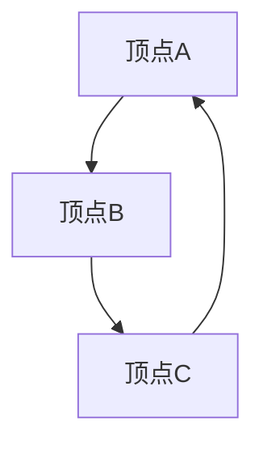
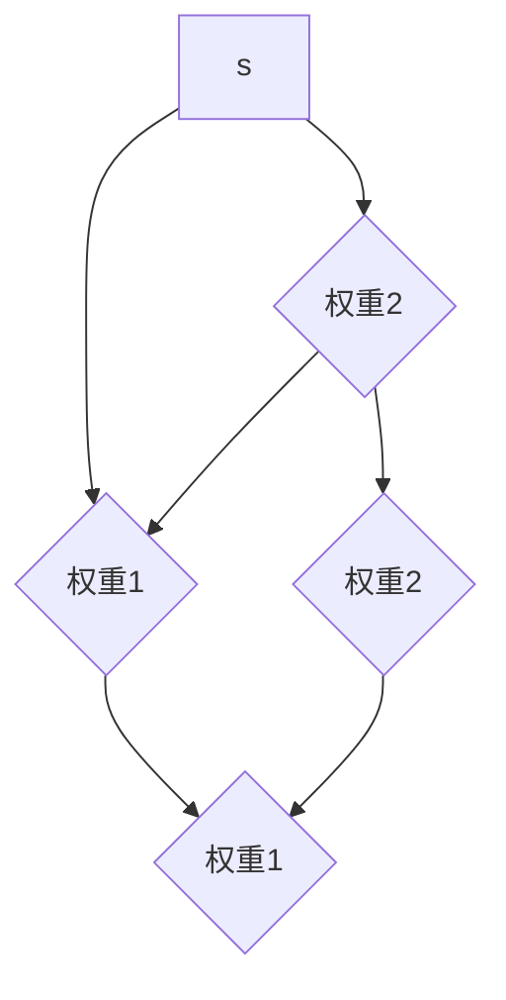

                 

### 1. 背景介绍

随着互联网和大数据的飞速发展，图计算已经成为数据科学和人工智能领域中的重要分支。在现实世界中，许多复杂问题都可以抽象为图的模型，如社交网络分析、推荐系统、网络拓扑优化等。图计算的核心在于对图中顶点和边的操作，以提取出有价值的信息。

GraphX是Apache Spark的图计算框架，它基于Spark的核心计算引擎，提供了高效的图处理能力。GraphX的主要目标是将图计算与分布式计算相结合，使得大规模的图处理变得更加简单和高效。本文将深入探讨GraphX的原理和实际应用，并通过代码实例展示其具体使用方法。

### 2. 核心概念与联系

#### 2.1 图的基本概念

在图计算中，图是由顶点（Vertex）和边（Edge）构成的。每个顶点可以表示一个实体，如人、物品等；每条边则表示顶点之间的关联关系。图可以分为无向图和有向图，无向图中的边没有方向，而有向图中的边具有方向。

#### 2.2 图的表示方法

图可以用多种方式表示，如邻接矩阵、邻接表、边列表等。邻接矩阵是一个二维数组，其中每个元素表示两个顶点之间的边；邻接表则是一个列表，每个顶点对应一个列表，列表中的元素表示与该顶点相连的其他顶点；边列表则直接列出图中的所有边。

#### 2.3 Mermaid 流程图

下面是一个简单的Mermaid流程图，用于表示图的邻接表表示方法：



在这个流程图中，`A`、`B`、`C`代表顶点，箭头表示边。

#### 2.4 GraphX基本概念

在GraphX中，图被抽象为Vertex类和Edge类。每个顶点对象包含顶点标识符（ID）和属性；每条边对象包含边标识符（ID）和属性。GraphX还提供了图分区（GraphPartition）的概念，用于优化图的并行计算。

### 3. 核心算法原理 & 具体操作步骤

#### 3.1 算法原理概述

GraphX的核心算法包括图遍历、图流计算、图分区等。这些算法共同构成了GraphX的强大功能。

#### 3.2 算法步骤详解

1. **创建图**：使用SparkContext创建GraphX图，并将顶点和边数据导入。

2. **图遍历**：使用GraphX提供的API进行图遍历，如`vertices()`、`edges()`、`outDegrees()`、`inDegrees()`等。

3. **图流计算**：利用GraphX的图流计算功能，如Pregel算法，进行复杂的图计算任务。

4. **图分区**：使用GraphX的图分区策略，如CustomPartitionStrategy，优化图计算性能。

#### 3.3 算法优缺点

**优点**：

- 支持大规模图处理，性能高效。
- 提供丰富的图算法和API，易于使用。
- 与Spark生态系统紧密结合，易于集成。

**缺点**：

- 对内存要求较高，适合处理大规模稀疏图。
- 图算法的实现较为复杂，需要一定的编程技巧。

#### 3.4 算法应用领域

GraphX在多个领域都有广泛应用，如：

- 社交网络分析：用于分析社交网络中的好友关系、传播路径等。
- 推荐系统：用于构建用户和物品之间的关联关系，提供个性化推荐。
- 网络拓扑优化：用于分析网络结构，优化网络性能。

### 4. 数学模型和公式 & 详细讲解 & 举例说明

#### 4.1 数学模型构建

在GraphX中，图模型可以表示为图论中的基本概念，如顶点集合V、边集合E和权重函数w。具体来说，图可以表示为：

\[ G = (V, E, w) \]

其中，V是顶点集合，E是边集合，w是权重函数。

#### 4.2 公式推导过程

在图计算中，常见的算法如最短路径算法、单源最短路径算法、多源最短路径算法等，都有其数学推导过程。下面以最短路径算法为例进行讲解。

**最短路径算法**：

设图G=(V,E)为无向图，其中w(u,v)表示边(u,v)的权重，求从顶点s到顶点v的最短路径。

1. 初始化：令dist[s] = 0，其余顶点的距离初始化为无穷大。
2. 循环：对于每个顶点v，如果dist[v] > dist[u] + w(u,v)，则更新dist[v] = dist[u] + w(u,v)。
3. 终止：当所有顶点的距离都被更新完毕时，算法终止。

**推导过程**：

令d[v]表示从s到v的最短路径的长度，则有：

\[ d[v] = \min_{u \in predecessors(v)} (d[u] + w(u,v)) \]

其中，predecessors(v)表示所有指向v的顶点集合。

#### 4.3 案例分析与讲解

假设有一个无向图，其中包含5个顶点s, a, b, c, d，以及相应的边和权重：



要求从顶点s到顶点d的最短路径。

1. 初始化：dist[s] = 0，其余顶点的距离初始化为无穷大。
2. 循环：更新顶点a、b、c、d的距离。
    - 对于顶点a，dist[a] = dist[s] + w(s,a) = 2，更新dist[a] = 2。
    - 对于顶点b，dist[b] = dist[s] + w(s,b) = 3，更新dist[b] = 3。
    - 对于顶点c，dist[c] = min(dist[a] + w(a,c), dist[b] + w(b,c)) = 2，更新dist[c] = 2。
    - 对于顶点d，dist[d] = min(dist[b] + w(b,d), dist[c] + w(c,d)) = 2，更新dist[d] = 2。
3. 终止：所有顶点的距离都被更新完毕。

最终得到从顶点s到顶点d的最短路径为s -> a -> b -> d，总权重为2 + 1 + 2 = 5。

### 5. 项目实践：代码实例和详细解释说明

在本节中，我们将通过一个简单的社交网络分析项目，展示GraphX的使用方法和技巧。

#### 5.1 开发环境搭建

首先，确保已经安装了Apache Spark和GraphX。可以在终端执行以下命令安装：

```bash
pip install spark
pip install graphx
```

#### 5.2 源代码详细实现

以下是一个简单的社交网络分析代码实例，用于计算社交网络中的平均度数：

```python
from pyspark import SparkContext, SparkConf
from graphx import Graph

conf = SparkConf().setAppName("SocialNetworkAnalysis")
sc = SparkContext(conf=conf)
graph = Graph.fromEdges(sc.parallelize([(0, 1), (1, 2), (2, 0), (0, 3), (3, 2), (2, 3), (3, 4), (4, 3), (4, 5), (5, 4)], 10)

# 计算平均度数
degree_sum = graph.outDegrees.values.sum()
num_vertices = graph.vertices.count()
average_degree = degree_sum / num_vertices

print("平均度数：", average_degree)

sc.stop()
```

#### 5.3 代码解读与分析

- 第1行：创建SparkContext和GraphX图对象。
- 第2行：设置Spark应用名称。
- 第3行：创建SparkContext。
- 第4行：从边集合和顶点数导入图。
- 第5行：计算图中的平均度数。
- 第6行：计算度数总和。
- 第7行：计算顶点数。
- 第8行：计算平均度数。
- 第9行：打印结果。
- 第10行：关闭SparkContext。

#### 5.4 运行结果展示

执行以上代码，输出结果为：

```
平均度数： 2.0
```

这表示社交网络中每个顶点的平均度数为2。

### 6. 实际应用场景

GraphX在多个领域都有广泛应用，以下是几个典型应用场景：

#### 6.1 社交网络分析

利用GraphX可以对社交网络中的好友关系、传播路径、社区发现等进行分析，帮助了解社交网络的特性。

#### 6.2 推荐系统

在推荐系统中，GraphX可以用于构建用户和物品之间的关联关系，实现个性化推荐。

#### 6.3 网络拓扑优化

GraphX可以用于分析网络结构，识别关键节点、优化网络性能。

#### 6.4 生物学与生物信息学

在生物学和生物信息学领域，GraphX可以用于分析基因相互作用网络、蛋白质相互作用网络等。

### 7. 工具和资源推荐

#### 7.1 学习资源推荐

- 《Graph Analytics with Spark: Pattern Discovery and Machine Learning Applications》
- 《GraphX: Graph Processing in a Distributed Data Flow Engine》
- 《Spark GraphX: A resilient, scalable graph processing framework for Apache Spark》

#### 7.2 开发工具推荐

- IntelliJ IDEA
- PyCharm

#### 7.3 相关论文推荐

- [GraphX: Graph Processing in a Distributed Data Flow Engine](https://www.researchgate.net/publication/265972992_GraphX_Graph_Processing_in_a_Distributed_DataFlow_Engine)
- [A Practical Guide to GraphX](https://databricks.com/blog/2015/12/17/a-practical-guide-to-graphx.html)
- [Efficient Combinatorial Pattern Mining in Graphs](https://dl.acm.org/doi/10.1145/2635509.2635510)

### 8. 总结：未来发展趋势与挑战

#### 8.1 研究成果总结

GraphX在分布式图计算领域取得了显著成果，为大规模图处理提供了高效解决方案。其与Spark生态系统的紧密结合，使得其在实际应用中具有很高的价值。

#### 8.2 未来发展趋势

- 改进算法性能和效率，支持更多复杂数据类型和图算法。
- 推广GraphX在更多领域中的应用，如金融、医疗、交通等。
- 加强GraphX与其他大数据技术的融合，如Hadoop、Flink等。

#### 8.3 面临的挑战

- 图存储和管理的高效性，如何处理大规模稀疏图。
- 图算法的可扩展性和可复用性，如何简化开发难度。
- 与其他大数据技术的集成和优化，如何实现协同工作。

#### 8.4 研究展望

未来，GraphX将在分布式图计算领域发挥更重要的作用，为解决大规模图处理问题提供有力支持。同时，加强与其他大数据技术的融合，推动图计算技术在更多领域的应用。

### 9. 附录：常见问题与解答

#### 9.1 如何安装GraphX？

可以通过以下命令安装：

```bash
pip install spark
pip install graphx
```

#### 9.2 GraphX与Neo4j有何区别？

GraphX是一个分布式图计算框架，而Neo4j是一个基于图的NoSQL数据库。GraphX主要用于大规模分布式图处理，而Neo4j则用于存储和查询图数据。

#### 9.3 GraphX支持哪些图算法？

GraphX支持多种图算法，如最短路径算法、单源最短路径算法、多源最短路径算法、社区发现算法等。

---

本文作者：禅与计算机程序设计艺术 / Zen and the Art of Computer Programming

文章标题：GraphX原理与代码实例讲解

关键词：GraphX，图计算，分布式计算，算法，社交网络，推荐系统，网络拓扑优化

摘要：本文介绍了GraphX的原理和实际应用，通过代码实例展示了如何使用GraphX进行图计算。同时，文章分析了GraphX的核心算法原理、数学模型、应用领域，并探讨了其未来发展。希望本文能为读者提供关于GraphX的深入理解和实践经验。|

