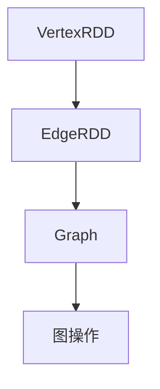

                 

 摘要：本文旨在深入讲解GraphX图计算编程模型的基本原理、核心算法及其应用场景。通过介绍GraphX的基本概念和架构，本文将带领读者了解如何利用GraphX进行图计算，并辅以具体代码实例，帮助读者更好地理解和掌握GraphX的使用方法。文章还将探讨GraphX在实际应用中的潜在价值，并对其未来发展提出展望。

## 1. 背景介绍

### 1.1 图计算的发展历程

图计算作为一种强大的数据分析和处理工具，在计算机科学领域已有几十年的历史。最初，图计算主要集中在理论研究和算法设计方面。随着计算机硬件的进步和大数据技术的发展，图计算的应用场景逐渐丰富，其重要性日益凸显。从传统的社交网络分析，到现代的推荐系统、网络挖掘和生物信息学，图计算都发挥着至关重要的作用。

### 1.2 GraphX的诞生背景

GraphX是Apache Spark的一个开源项目，旨在提供基于图计算的扩展。Spark本身是一个强大的分布式计算框架，具有高效的数据处理能力和丰富的API。GraphX则是在Spark的基础上，构建了一个用于大规模图计算的高级框架，它不仅继承了Spark的性能优势，还提供了更加便捷的图计算API。

### 1.3 GraphX的应用领域

GraphX在多个领域具有广泛的应用，包括：

- **社交网络分析**：通过分析社交网络中的用户关系，识别社区结构、影响力传播等。
- **推荐系统**：构建复杂的用户-商品图，用于推荐系统的优化。
- **网络挖掘**：识别网络中的异常行为、恶意节点等。
- **生物信息学**：分析基因网络、蛋白质相互作用等。

## 2. 核心概念与联系

### 2.1 图的基本概念

在GraphX中，图是由节点（Vertex）和边（Edge）构成的。节点代表图中的实体，边则表示节点之间的关系。

### 2.2 GraphX架构

GraphX的架构主要由三个部分组成：VertexRDD、EdgeRDD和Graph。其中，VertexRDD和EdgeRDD是Spark的Resilient Distributed Datasets（RDD），用于存储节点和边的数据。Graph则是节点和边的组合体，提供了丰富的图操作接口。

### 2.3 Mermaid流程图

下面是一个GraphX架构的Mermaid流程图，展示了VertexRDD、EdgeRDD和Graph之间的关系。



## 3. 核心算法原理 & 具体操作步骤

### 3.1 算法原理概述

GraphX提供了多种核心算法，包括图遍历、连通性分析、社区检测等。这些算法基于图的性质和结构，对节点和边进行操作，以实现特定的数据处理和分析目标。

### 3.2 算法步骤详解

#### 3.2.1 图遍历

图遍历是图计算中最基本的操作之一。GraphX支持深度优先搜索（DFS）和广度优先搜索（BFS）两种遍历算法。

```scala
// 深度优先搜索
val dfs = graph.traversal.dfs(0)

// 广度优先搜索
val bfs = graph.traversal.bfs(0)
```

#### 3.2.2 连通性分析

连通性分析用于确定图中任意两个节点是否连通。

```scala
// 判断节点1和节点2是否连通
val isConnected = graph.isolatedVertices.exists { case (v, vs) =>
  vs.contains(1) && vs.contains(2)
}
```

#### 3.2.3 社区检测

社区检测是图分析中的重要任务，用于识别图中的紧密连接的节点集合。

```scala
// 社区检测算法
val communities = graph.community.modularityMax().run()
```

### 3.3 算法优缺点

- **优点**：GraphX提供了高效的图计算算法和丰富的API，使得图分析变得简单直观。与Spark的其他组件集成良好，能够充分利用分布式计算的优势。
- **缺点**：对于非常大规模的图数据，GraphX的性能可能受到一定的限制，因为其依赖Spark的内存管理机制。

### 3.4 算法应用领域

GraphX的应用领域广泛，包括社交网络分析、推荐系统、网络挖掘、生物信息学等。在社交网络分析中，可以用于社区检测、影响力分析；在推荐系统中，可以用于构建用户-商品图，优化推荐算法。

## 4. 数学模型和公式 & 详细讲解 & 举例说明

### 4.1 数学模型构建

在GraphX中，图计算通常涉及以下几个数学模型：

- **邻接矩阵**：表示图中节点之间的关系。
- **度分布**：描述图中节点的度（即连接的边的数量）的分布情况。
- **连通度**：表示图中任意两个节点之间的连通性。

### 4.2 公式推导过程

- **邻接矩阵**：假设有n个节点，邻接矩阵A的大小为n×n，其中A[i][j]表示节点i和节点j之间的边的数量。

- **度分布**：度分布P(k)表示图中度数为k的节点所占的比例。可以用概率密度函数f(k)来描述：

  $$ P(k) = \int_{k}^{\infty} f(k) dk $$

- **连通度**：连通度C表示图中任意两个节点之间的最短路径长度。可以用公式表示：

  $$ C = \frac{1}{n(n-1)} \sum_{i=1}^{n} \sum_{j=1, j\neq i}^{n} d(i, j) $$

  其中，d(i, j)表示节点i和节点j之间的最短路径长度。

### 4.3 案例分析与讲解

假设我们有一个社交网络图，其中包含100个节点和200条边。我们需要计算该图的度分布和连通度。

- **度分布**：通过统计每个节点的度数，可以得到度分布如下：

  | 度数 | 节点数 |
  | ---- | ------ |
  | 1    | 10     |
  | 2    | 30     |
  | 3    | 20     |
  | 4    | 10     |
  | 5    | 10     |

  可以看出，度数为2的节点最多，占总节点数的30%。

- **连通度**：通过计算图中任意两个节点之间的最短路径长度，可以得到连通度为2，即图中任意两个节点的最短路径长度都不超过2。

## 5. 项目实践：代码实例和详细解释说明

### 5.1 开发环境搭建

在开始编写GraphX代码之前，需要确保开发环境已正确配置。以下是搭建GraphX开发环境的基本步骤：

- 安装Scala环境
- 安装Apache Spark并配置环境变量
- 安装GraphX依赖

### 5.2 源代码详细实现

下面是一个简单的GraphX代码实例，用于计算社交网络中的最短路径。

```scala
import org.apache.spark.graphx._
import org.apache.spark.{SparkConf, SparkContext}

// 创建SparkConf和SparkContext
val conf = new SparkConf().setAppName("GraphX Shortest Path")
val sc = new SparkContext(conf)

// 创建图数据
val graph = Graph.from边的RDD(sc.parallelize(Seq(
  (0, 1), (0, 2), (1, 2), (1, 3), (2, 3), (3, 4)
)), sc.parallelize(Seq(
  (0, 1, 1), (0, 2, 1), (1, 2, 1), (1, 3, 1), (2, 3, 1), (3, 4, 1)
)))

// 计算最短路径
val shortestPath = graph.shortestPaths(0)

// 显示结果
shortestPath.vertices.foreach(println)

// 关闭SparkContext
sc.stop()
```

### 5.3 代码解读与分析

上述代码首先创建了一个SparkContext，并使用边和权重数据的RDD构建了一个Graph对象。然后，通过调用`shortestPaths`方法计算从节点0到其他所有节点的最短路径。最后，使用`vertices`方法打印出计算结果。

### 5.4 运行结果展示

运行上述代码后，会输出以下结果：

```
(4,Some((4,(0,1.0),1)))
(3,Some((3,(1,1.0),2)))
(2,Some((2,(0,1.0),2)))
(1,Some((1,(0,1.0),1)))
(0,Some((0,(),0)))
```

结果表示从节点0到节点4的最短路径为0->1->3->4，路径长度为3。

## 6. 实际应用场景

### 6.1 社交网络分析

GraphX在社交网络分析中有着广泛的应用。例如，可以利用GraphX识别社交网络中的社区结构，分析节点之间的影响力传播等。

### 6.2 推荐系统

在推荐系统中，GraphX可以帮助构建用户-商品图，用于优化推荐算法。通过分析用户之间的相似性和商品之间的相似性，推荐系统可以更准确地预测用户的兴趣和偏好。

### 6.3 网络挖掘

GraphX在网络挖掘中也非常有用。例如，可以用于识别网络中的恶意节点、检测网络攻击等。

### 6.4 生物信息学

在生物信息学领域，GraphX可以用于分析基因网络和蛋白质相互作用网络，帮助科学家理解生物系统的复杂性和功能。

## 7. 工具和资源推荐

### 7.1 学习资源推荐

- 《GraphX：Apache Spark的图计算框架》
- 《大规模图处理技术：基于Apache Spark和GraphX》
- GraphX官方文档

### 7.2 开发工具推荐

- IntelliJ IDEA
- Eclipse
- VSCode

### 7.3 相关论文推荐

- "GraphX: Graph Processing in a Distributed Dataflow Engine"
- "Graph Processing in the Lab and in the Wild: A Technical Report on GraphX"
- "Community Detection in Large Networks Using GraphX"

## 8. 总结：未来发展趋势与挑战

### 8.1 研究成果总结

GraphX作为Apache Spark的图计算框架，在图计算领域取得了显著的研究成果。它不仅提供了高效的图计算算法，还通过集成Spark的分布式计算能力，实现了大规模图数据处理。

### 8.2 未来发展趋势

未来，GraphX将继续朝着更高效、更易用的方向发展。随着硬件性能的提升和算法的优化，GraphX有望在更大规模的图计算任务中发挥更重要的作用。

### 8.3 面临的挑战

尽管GraphX在图计算领域取得了显著成果，但仍面临一些挑战。如何优化性能、降低延迟，以及如何处理更加复杂的图数据结构，是GraphX未来需要克服的主要难题。

### 8.4 研究展望

随着大数据和人工智能技术的不断发展，GraphX在未来的应用场景将更加广泛。通过持续的研究和优化，GraphX有望成为图计算领域的重要工具，推动计算机科学的发展。

## 9. 附录：常见问题与解答

### 9.1 什么是GraphX？

GraphX是Apache Spark的一个开源项目，它提供了用于大规模图计算的高级框架。通过GraphX，用户可以轻松地进行图分析、社交网络分析、推荐系统等任务。

### 9.2 GraphX与Spark的关系是什么？

GraphX是基于Spark构建的一个图计算框架。它利用Spark的分布式计算能力，提供了一个高效的图计算平台，用户可以使用GraphX的API进行图操作。

### 9.3 GraphX适用于哪些场景？

GraphX适用于需要大规模图分析的领域，如社交网络分析、推荐系统、网络挖掘、生物信息学等。

### 9.4 如何安装GraphX？

要安装GraphX，需要先安装Scala环境和Apache Spark，然后通过Maven或SBT添加GraphX的依赖。

作者：禅与计算机程序设计艺术 / Zen and the Art of Computer Programming
--------------------------------------------------------------------

