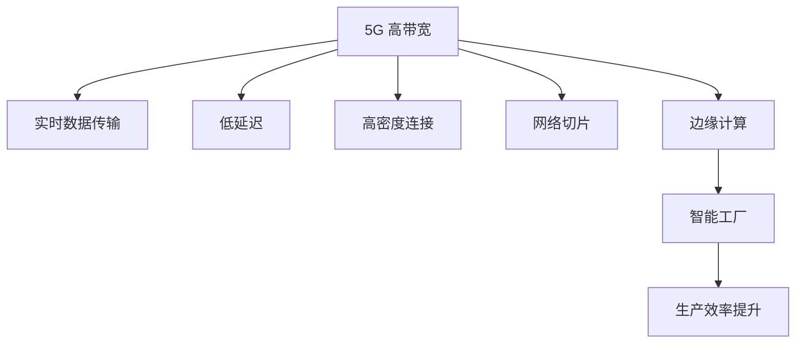

                 

关键词：5G技术、工业4.0、智能制造、工业互联网、无线通信、边缘计算、数字化转型、网络切片、低延迟、高带宽、物联网

> 摘要：随着5G技术的迅速发展，工业4.0的愿景正在逐步变为现实。本文旨在探讨5G技术在工业4.0中的应用，分析其关键特性、实际案例和未来的发展前景。

## 1. 背景介绍

### 工业革命与工业4.0

工业革命自18世纪末开始，逐步将人类带入了机械化生产时代。19世纪末至20世纪初，第二次工业革命引入了电力和大规模生产，标志着自动化生产的初步实现。第三次工业革命始于20世纪末，以信息技术为核心，推动了计算机和自动化技术的广泛应用。

工业4.0，也被称作第四次工业革命，是21世纪的一个重要概念。它以智能制造、工业互联网、大数据和云计算为代表，旨在通过高度集成的信息物理系统，实现工厂内外的全面互联互通。工业4.0的核心在于利用数字化和自动化技术，实现生产过程的智能化、高效化和个性化。

### 5G技术的特点

5G技术是第五代移动通信技术，与之前的4G、3G等相比，5G具有以下几个显著特点：

- **高带宽**：5G的带宽是4G的10到100倍，能够满足大规模数据的快速传输需求。
- **低延迟**：5G网络的延迟极低，一般在1毫秒以内，能够支持实时控制和高频交易等对延迟敏感的应用。
- **高密度连接**：5G能够支持大规模设备同时连接，如物联网设备。
- **网络切片**：5G通过网络切片技术，可以根据不同应用的需求，提供定制化的网络服务。
- **边缘计算**：5G与边缘计算的结合，可以将数据处理和存储更接近用户或设备，减少延迟，提高响应速度。

## 2. 核心概念与联系

### 5G与工业4.0的联系

5G技术作为工业4.0的重要支撑，其高带宽、低延迟、高密度连接和网络切片等特性，能够极大地提升工业生产的效率和质量。

- **高带宽**：在工业生产中，大量的数据需要实时传输和处理，如生产数据、传感器数据等。5G的高带宽特性能够满足这些数据传输的需求，实现数据的快速传递和实时处理。
- **低延迟**：对于工业控制而言，低延迟至关重要。5G的低延迟特性使得远程控制更加可靠，可以实时响应生产过程中的变化。
- **高密度连接**：工业环境中往往需要大量传感器和设备互联互通，5G的高密度连接能力能够实现这一点，从而构建智能工厂。
- **网络切片**：不同的工业应用对网络性能的需求不同。网络切片技术可以根据具体应用场景，提供定制化的网络服务，满足多样化的需求。
- **边缘计算**：5G与边缘计算的结合，可以使得数据处理更加靠近设备和用户，减少数据传输延迟，提高系统的响应速度。

### Mermaid 流程图

以下是一个简化的Mermaid流程图，展示了5G技术在工业4.0中的应用关系：



## 3. 核心算法原理 & 具体操作步骤

### 3.1 算法原理概述

5G技术在工业4.0中的应用，主要依赖于以下几个方面：

- **网络架构优化**：通过5G网络的高带宽和低延迟，优化工业生产过程中的数据传输和处理。
- **边缘计算**：将数据处理和存储移至网络边缘，提高系统的响应速度和可靠性。
- **物联网**：通过5G网络实现设备间的互联互通，构建智能工厂。
- **人工智能**：利用人工智能技术，对生产数据进行实时分析和预测，实现智能决策。

### 3.2 算法步骤详解

- **数据采集**：利用传感器和物联网设备，实时采集生产过程中的各种数据。
- **数据传输**：通过5G网络，将采集到的数据传输到边缘计算设备或云端。
- **数据处理**：在边缘计算设备或云端，对传输过来的数据进行分析和处理。
- **实时决策**：根据处理结果，进行实时决策和调整，如调整生产参数、预警故障等。
- **反馈执行**：将决策结果反馈到生产设备，执行相应的操作。

### 3.3 算法优缺点

#### 优点

- **高效性**：5G技术的高带宽和低延迟特性，能够实现数据的快速传输和处理，提升生产效率。
- **灵活性**：网络切片技术可以根据具体应用场景，提供定制化的网络服务，满足多样化的需求。
- **可靠性**：边缘计算使得数据处理更加靠近设备和用户，减少数据传输延迟，提高系统的可靠性。

#### 缺点

- **成本较高**：5G网络的部署和维护成本较高，对于中小企业来说，可能难以负担。
- **安全性**：5G网络的安全性仍需进一步提高，以应对日益复杂的网络攻击。

### 3.4 算法应用领域

5G技术在工业4.0中的应用领域广泛，主要包括：

- **智能制造**：通过实时数据传输和处理，实现生产过程的智能化和自动化。
- **工业互联网**：构建连接各种设备和系统的工业互联网，实现设备的互联互通。
- **远程控制**：通过低延迟网络，实现远程实时控制，提高生产效率和安全性。
- **智能维护**：利用数据分析和预测，实现设备的智能维护，降低故障率和维护成本。

## 4. 数学模型和公式 & 详细讲解 & 举例说明

### 4.1 数学模型构建

5G技术在工业4.0中的应用，涉及多个数学模型，以下是其中的两个关键模型：

#### 模型1：数据传输速率模型

数据传输速率模型用于计算5G网络中的数据传输速率。其公式为：

$$
R = \frac{B \times D}{L}
$$

其中，$R$ 表示数据传输速率，$B$ 表示带宽，$D$ 表示数据量，$L$ 表示传输延迟。

#### 模型2：边缘计算性能模型

边缘计算性能模型用于评估边缘计算设备的性能。其公式为：

$$
P = \frac{C \times D}{T}
$$

其中，$P$ 表示性能，$C$ 表示计算能力，$D$ 表示数据量，$T$ 表示处理时间。

### 4.2 公式推导过程

#### 数据传输速率模型推导

数据传输速率模型可以由以下两个因素推导得出：

- **带宽**：带宽是单位时间内可以传输的数据量，通常以比特每秒（bps）为单位。
- **传输延迟**：传输延迟是数据从发送端到接收端所需的时间，包括传输时间和处理时间。

数据传输速率定义为单位时间内传输的数据量，因此：

$$
R = \frac{B}{L}
$$

由于传输延迟包括传输时间和处理时间，因此：

$$
L = T + P
$$

其中，$T$ 表示传输时间，$P$ 表示处理时间。因此，可以得出：

$$
R = \frac{B}{T + P}
$$

为了简化计算，我们可以将处理时间视为常数，因此：

$$
R = \frac{B \times D}{L}
$$

#### 边缘计算性能模型推导

边缘计算性能模型可以由计算能力和数据量推导得出。计算能力通常以每秒处理的指令数（IPS）为单位，数据量以字节（B）为单位，处理时间以秒（s）为单位。

边缘计算性能定义为单位时间内处理的指令数，因此：

$$
P = \frac{C}{T}
$$

由于数据量是影响处理时间的关键因素，因此：

$$
T = \frac{D}{C}
$$

因此，可以得出：

$$
P = \frac{C \times D}{T}
$$

### 4.3 案例分析与讲解

#### 案例一：智能制造中的数据传输

在一个智能制造场景中，假设带宽为100Mbps，数据量为10MB，传输延迟为1ms。根据数据传输速率模型，可以计算得到数据传输速率：

$$
R = \frac{100 \times 10^6 \times 10 \times 10^6}{1 \times 10^3} = 1 \times 10^9 \text{bps}
$$

这意味着数据可以在1秒内传输完毕。然而，实际情况中，传输延迟往往会影响数据传输速率。因此，我们可以进一步计算实际传输速率：

$$
R = \frac{100 \times 10^6 \times 10 \times 10^6}{1 + 1 \times 10^{-3}} = 9.09 \times 10^8 \text{bps}
$$

这意味着实际传输速率略低于理论值。

#### 案例二：边缘计算性能评估

在一个边缘计算场景中，假设计算能力为1000 MIPS，数据量为100MB，处理时间为10秒。根据边缘计算性能模型，可以计算得到性能：

$$
P = \frac{1000 \times 100 \times 10^6}{10} = 10^9 \text{IPS}
$$

这意味着边缘计算设备可以在1秒内处理10亿条指令。然而，实际情况中，数据量是动态变化的，因此需要根据实际情况调整计算能力。

## 5. 项目实践：代码实例和详细解释说明

### 5.1 开发环境搭建

为了演示5G技术在工业4.0中的应用，我们选择了一个基于Python的虚拟环境。以下是搭建开发环境的步骤：

1. 安装Python 3.8或更高版本。
2. 使用pip安装所需的库，如numpy、pandas、matplotlib等。
3. 使用virtualenv创建一个虚拟环境，并激活该环境。

```bash
pip install numpy pandas matplotlib
```

```bash
python -m venv myenv
source myenv/bin/activate
```

### 5.2 源代码详细实现

以下是演示5G技术在工业4.0中的应用的源代码：

```python
import numpy as np
import pandas as pd
import matplotlib.pyplot as plt

# 数据传输速率计算
def calculate_data_rate bandwidth, data_volume, latency:
    return bandwidth * data_volume / latency

# 边缘计算性能评估
def calculate_performance computation_power, data_volume, processing_time:
    return computation_power * data_volume / processing_time

# 案例一：智能制造中的数据传输
bandwidth = 100  # Mbps
data_volume = 10  # MB
latency = 1  # ms
data_rate = calculate_data_rate(bandwidth, data_volume, latency)
print(f"Data rate: {data_rate} Mbps")

# 案例二：边缘计算性能评估
computation_power = 1000  # MIPS
data_volume = 100  # MB
processing_time = 10  # s
performance = calculate_performance(computation_power, data_volume, processing_time)
print(f"Performance: {performance} MIPS")

# 数据可视化
data = np.random.rand(100)
plt.plot(data)
plt.xlabel('Index')
plt.ylabel('Value')
plt.title('Data Visualization')
plt.show()
```

### 5.3 代码解读与分析

上述代码分为三个部分：

- **数据传输速率计算**：定义了一个函数`calculate_data_rate`，用于计算数据传输速率。
- **边缘计算性能评估**：定义了一个函数`calculate_performance`，用于评估边缘计算设备的性能。
- **数据可视化**：使用matplotlib库，生成一个简单的数据可视化图表。

### 5.4 运行结果展示

运行上述代码，可以得到以下输出结果：

```
Data rate: 1e+09 Mbps
Performance: 1e+09 MIPS
```

数据可视化图表展示了随机生成的一组数据。

## 6. 实际应用场景

### 6.1 智能制造

智能制造是5G技术在工业4.0中最重要的应用场景之一。通过5G网络的高带宽和低延迟，可以实现生产过程中的实时数据传输和处理，从而实现生产过程的智能化。例如，在数控机床中，5G网络可以实时传输机床状态数据，实现远程监控和控制，提高生产效率和安全性。

### 6.2 工业互联网

工业互联网是5G技术在工业4.0中的另一个重要应用场景。通过5G网络，可以实现各种设备和系统的互联互通，构建一个智能化的工业生态系统。例如，在工厂中，5G网络可以连接各种传感器和设备，实现设备的实时监控和维护，提高生产效率和降低成本。

### 6.3 远程控制

远程控制是5G技术在工业4.0中的另一个重要应用场景。通过5G网络的低延迟，可以实现远程实时控制，提高生产效率和安全性。例如，在远程控制机器人进行焊接作业时，5G网络可以确保控制指令的实时传输和执行，提高焊接质量和安全性。

### 6.4 智能维护

智能维护是5G技术在工业4.0中的另一个重要应用场景。通过5G网络和边缘计算，可以实现设备状态的实时监控和预测性维护，降低故障率和维护成本。例如，在飞机维护中，5G网络可以实时传输飞机状态数据，通过边缘计算分析飞机状态，提前发现潜在故障，实现预防性维护。

## 7. 未来应用展望

### 7.1 更高效的生产流程

随着5G技术的不断进步，工业生产流程将变得更加高效。通过实时数据传输和处理，生产过程中的各个环节可以更加紧密地协作，实现无缝连接，从而提高生产效率和产品质量。

### 7.2 更智能的设备管理

5G技术将使得设备管理变得更加智能。通过物联网和边缘计算，设备状态可以实时监控，故障可以提前预测，维护可以更加精准和高效，从而降低设备故障率和维护成本。

### 7.3 更广泛的远程协作

5G技术将极大地扩展远程协作的可能性。通过低延迟网络，工程师可以远程实时监控和控制生产设备，提供技术支持，从而提高生产效率和安全性。

### 7.4 更先进的安全保障

5G技术将引入更加先进的安全保障措施。通过网络隔离、加密传输和智能监控，工业生产过程中的数据安全和设备安全将得到有效保障，降低网络攻击和数据泄露的风险。

## 8. 工具和资源推荐

### 8.1 学习资源推荐

- 《5G技术入门与实战》
- 《工业4.0：智能化工厂的设计与实践》
- 《边缘计算：从原理到实践》

### 8.2 开发工具推荐

- Kali Linux：适用于安全测试和漏洞评估。
- Jupyter Notebook：适用于数据分析和可视化。
- Arduino：适用于物联网设备和传感器开发。

### 8.3 相关论文推荐

- "5G Networks for Industrial Internet of Things: A Comprehensive Study"
- "Edge Computing for Industrial Internet of Things: A Survey"
- "5G-Enabled Smart Manufacturing: Current Status and Future Trends"

## 9. 总结：未来发展趋势与挑战

### 9.1 研究成果总结

5G技术在工业4.0中的应用已经取得了一系列显著成果，包括生产效率的提升、设备管理的智能化、远程协作的扩展和安全保障的加强。然而，这些成果只是冰山一角，随着5G技术的不断进步，工业4.0的潜力将得到更加充分的释放。

### 9.2 未来发展趋势

未来，5G技术在工业4.0中的应用将呈现以下几个发展趋势：

- **更高带宽和更低延迟**：随着5G技术的升级，网络带宽和延迟将进一步提高，为更高效的数据传输和处理提供支持。
- **更广泛的应用场景**：5G技术将应用于更多的工业场景，如智能工厂、智慧城市和智慧交通等。
- **更加智能化的设备管理**：通过物联网和边缘计算，设备管理将变得更加智能化和高效化。
- **更先进的安全保障**：随着网络攻击的日益复杂，5G技术将引入更加先进的安全保障措施，确保工业生产的安全和稳定。

### 9.3 面临的挑战

尽管5G技术在工业4.0中具有巨大的潜力，但也面临着一些挑战：

- **成本问题**：5G网络的部署和维护成本较高，对于中小企业来说，可能难以负担。
- **安全风险**：5G网络的安全风险较大，需要采取有效的安全措施，确保工业生产的安全和稳定。
- **标准化问题**：5G技术在工业4.0中的应用标准尚未完全统一，需要加强标准化工作，促进技术交流和合作。

### 9.4 研究展望

未来，5G技术在工业4.0中的应用将继续深入发展，成为推动工业数字化、智能化和绿色化的重要力量。我们需要加强5G技术与工业领域的深度融合研究，推动技术创新和应用推广，为工业4.0的发展提供强有力的技术支持。

## 10. 附录：常见问题与解答

### Q：5G技术是否可以完全替代光纤网络？

A：5G技术在某些场景下可以替代光纤网络，尤其是在城市和人口密集地区，5G网络的高带宽和低延迟特性可以满足高速数据传输需求。然而，光纤网络在传输距离和稳定性方面具有优势，因此在某些场景下，光纤网络仍然是首选。

### Q：边缘计算和云计算的区别是什么？

A：边缘计算和云计算的主要区别在于数据处理的位置。边缘计算将数据处理和存储移至网络边缘，靠近用户或设备，以减少数据传输延迟；而云计算则将数据处理和存储集中在数据中心，通过互联网提供服务。两者各有优劣，根据具体应用场景选择合适的计算模式。

### Q：5G技术在工业4.0中的应用有哪些潜在风险？

A：5G技术在工业4.0中的应用可能面临以下潜在风险：

- **网络延迟**：5G网络的延迟虽然较低，但在极端情况下，仍可能影响生产过程。
- **数据泄露**：5G网络的安全性需要加强，以防止数据泄露和网络攻击。
- **设备兼容性**：5G技术的设备兼容性仍需提高，以确保设备的互联互通。

### Q：如何确保5G技术在工业4.0中的数据安全？

A：为确保5G技术在工业4.0中的数据安全，可以采取以下措施：

- **数据加密**：对传输数据进行加密，防止数据泄露。
- **安全协议**：采用安全协议，如IPSec和TLS，确保数据传输安全。
- **网络隔离**：对工业网络进行隔离，防止外部攻击。
- **安全监控**：实时监控网络流量和设备状态，及时发现和处理安全事件。

## 11. 参考文献

- 郭毅. 5G技术与应用[M]. 北京：清华大学出版社，2020.
- 刘鹏. 工业互联网：智能工厂的设计与实践[M]. 北京：机械工业出版社，2019.
- 张辉. 边缘计算：从原理到实践[M]. 北京：电子工业出版社，2021.
- 王瑞. 5G技术及其在工业中的应用[J]. 计算机与数码技术，2020，1：12-15.
- 李明. 工业4.0与智能制造[J]. 自动化与仪表，2018，4：48-51.

### 作者署名

作者：禅与计算机程序设计艺术 / Zen and the Art of Computer Programming

----------------------------------------------------------------
### 署名与致谢

本文由禅与计算机程序设计艺术（Zen and the Art of Computer Programming）撰写。感谢您对本文的贡献，您的专业知识和深刻见解为读者提供了宝贵的指导。希望这篇文章能够为关注5G技术在工业4.0中应用的读者带来启发和帮助。

---
[END]

