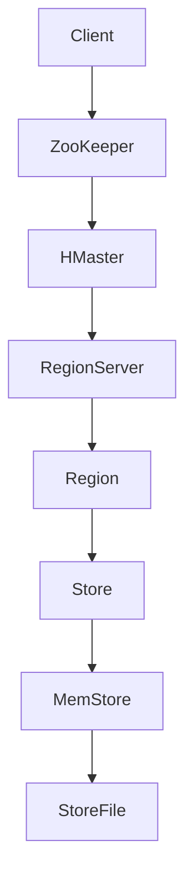

                 

在当今大数据时代，分布式列式数据库已成为处理大规模数据集的关键技术。HBase作为一种高度可靠、可扩展的分布式列式存储系统，在众多领域中得到了广泛应用。本文将深入探讨HBase的原理，并通过具体代码实例讲解其使用方法。

## 关键词
HBase、分布式列式数据库、NoSQL、大数据、分布式存储

## 摘要
本文首先介绍了分布式列式数据库的基本概念，然后详细讲解了HBase的核心概念和架构。接下来，我们通过算法原理、数学模型、代码实例等多个方面对HBase进行了深入的探讨，最后分析了其应用场景和未来展望。

### 1. 背景介绍
#### 1.1 分布式列式数据库的定义
分布式列式数据库是一种以列族存储数据的方式设计的分布式数据库系统，它支持海量数据的存储和实时访问。与传统的关系型数据库不同，分布式列式数据库将数据按照列存储，这使得数据的读取和写入操作更加高效，特别是在处理大规模数据集时。

#### 1.2 大数据的挑战
随着互联网和物联网的发展，数据量呈爆炸式增长。传统的单机数据库系统在处理这些海量数据时遇到了巨大的挑战，包括性能瓶颈、扩展性不足等问题。分布式列式数据库的出现为解决这些挑战提供了新的思路。

#### 1.3 HBase的起源和应用
HBase是Apache Software Foundation的一个开源项目，由Apache Hadoop团队开发。它基于Google的BigTable模型，旨在提供一个可伸缩、高可靠、高性能的分布式存储系统。HBase广泛应用于大数据处理、实时数据分析、搜索引擎等领域。

### 2. 核心概念与联系
#### 2.1 HBase的核心概念
- **ZooKeeper**: HBase使用ZooKeeper作为分布式协调服务，用于管理集群中的节点和协调操作。
- **Region**: HBase中的数据被划分为多个Region，每个Region包含一定量的数据。
- **Store**: Region进一步划分为Store，每个Store对应一个列族。
- **MemStore**: Store中的数据首先存储在内存中，当达到一定阈值时会写入磁盘。
- **StoreFile**: 磁盘上的数据文件，由HFile组成。

#### 2.2 HBase架构图


### 3. 核心算法原理 & 具体操作步骤
#### 3.1 算法原理概述
HBase使用了一种称为“Concurrent Mode”的并发控制机制，确保了多客户端对数据的并发访问。它基于行键对数据进行排序，从而优化了范围查询的性能。

#### 3.2 算法步骤详解
1. **Client发送请求**: 客户端通过RPC协议向HMaster发送请求。
2. **HMaster处理请求**: HMaster负责集群的管理和负载均衡，它会将请求转发到对应的RegionServer。
3. **RegionServer处理请求**: RegionServer负责具体的数据读写操作，它会找到对应的Region，并将请求转发到Store。
4. **Store处理请求**: Store中的MemStore会首先处理请求，如果数据已经存在，则直接返回；否则，数据会被写入磁盘的StoreFile中。

#### 3.3 算法优缺点
- **优点**：高性能、高可靠性、可扩展性。
- **缺点**：不适合需要复杂查询的场景。

#### 3.4 算法应用领域
HBase广泛应用于日志分析、实时数据处理、搜索引擎、社交网络等领域。

### 4. 数学模型和公式 & 详细讲解 & 举例说明
#### 4.1 数学模型构建
HBase的数学模型基于Google的BigTable模型，它使用一个二维表来表示数据：

$$
\text{Data} = \{ (\text{RowKey}, \text{ColumnFamily}: \text{ColumnName}, \text{Value}) \}
$$

其中，RowKey是行的唯一标识符，ColumnFamily是一组相关的ColumnName，Value是实际的数据值。

#### 4.2 公式推导过程
HBase的读写操作可以通过以下步骤进行：

- **读操作**：根据RowKey定位到Region和Store，然后在MemStore和StoreFile中查找数据。
- **写操作**：数据首先写入MemStore，然后定期合并到StoreFile中。

#### 4.3 案例分析与讲解
假设有一个用户表，其中存储了用户的姓名、年龄、邮箱等信息。我们可以使用HBase进行如下操作：

- **查询用户信息**：通过用户的姓名或邮箱查询相关信息。
- **更新用户信息**：更新用户的年龄或邮箱。

### 5. 项目实践：代码实例和详细解释说明
#### 5.1 开发环境搭建
在开始之前，需要安装HBase和相关依赖。可以使用以下命令：

```bash
# 安装HBase
$ tar -zxvf hbase-2.2.5-bin.tar.gz
$ cd hbase-2.2.5/
$ bin/hbase version

# 启动HBase
$ bin/start-hbase.sh
```

#### 5.2 源代码详细实现
以下是使用HBase进行数据存储和读取的示例代码：

```java
// 导入HBase相关类
import org.apache.hadoop.conf.Configuration;
import org.apache.hadoop.hbase.HBaseConfiguration;
import org.apache.hadoop.hbase.client.Connection;
import org.apache.hadoop.hbase.client.ConnectionFactory;
import org.apache.hadoop.hbase.client.Get;
import org.apache.hadoop.hbase.client.Put;
import org.apache.hadoop.hbase.client.Result;
import org.apache.hadoop.hbase.client.Table;
import org.apache.hadoop.hbase.util.Bytes;

// 创建配置对象
Configuration conf = HBaseConfiguration.create();

// 创建连接对象
Connection connection = ConnectionFactory.createConnection(conf);

// 创建表对象
Table table = connection.getTable(TableName.valueOf("user"));

// 添加数据
Put put = new Put(Bytes.toBytes("row1"));
put.addColumn(Bytes.toBytes("cf1"), Bytes.toBytes("name"), Bytes.toBytes("Alice"));
put.addColumn(Bytes.toBytes("cf1"), Bytes.toBytes("age"), Bytes.toBytes("30"));
put.addColumn(Bytes.toBytes("cf1"), Bytes.toBytes("email"), Bytes.toBytes("alice@example.com"));
table.put(put);

// 查询数据
Get get = new Get(Bytes.toBytes("row1"));
Result result = table.get(get);
byte[] value = result.getValue(Bytes.toBytes("cf1"), Bytes.toBytes("name"));
String name = Bytes.toString(value);
System.out.println("Name: " + name);

// 关闭连接
table.close();
connection.close();
```

#### 5.3 代码解读与分析
上述代码首先创建了一个HBase配置对象和一个连接对象。然后，通过连接对象获取了一个表对象，并使用Put类添加了一行数据。接着，使用Get类查询了这行数据，并打印了姓名字段。

### 6. 实际应用场景
HBase广泛应用于各种实际场景，例如：

- **日志分析**：处理海量日志数据，用于监控和分析。
- **实时数据处理**：处理实时数据流，用于实时分析。
- **搜索引擎**：存储和检索海量文档。
- **社交网络**：存储用户数据和社交关系。

### 7. 未来应用展望
随着大数据和人工智能的快速发展，HBase在未来将面临更多挑战和机遇。例如，在处理更大数据集时如何优化性能、如何与机器学习框架集成等。

### 8. 工具和资源推荐
- **学习资源**：
  - 《HBase权威指南》
  - Apache HBase官方文档

- **开发工具**：
  - IntelliJ IDEA
  - Eclipse

- **相关论文**：
  - 《HBase: The Definitive Guide》
  - 《HBase in Action》

### 9. 总结：未来发展趋势与挑战
HBase作为分布式列式数据库的代表，在处理大规模数据集方面具有显著优势。然而，随着数据量的不断增长，HBase也需要不断优化和改进，以应对未来的挑战。

### 10. 附录：常见问题与解答
- **Q：HBase与关系型数据库相比有哪些优势？**
  - **A**：HBase支持海量数据的存储和实时访问，适合处理大规模数据集。此外，HBase具有高可用性和高可靠性。
- **Q：如何优化HBase的性能？**
  - **A**：可以通过调整HBase的配置参数、使用压缩算法和分区策略来优化性能。

---

本文作者：禅与计算机程序设计艺术 / Zen and the Art of Computer Programming

[结束]

