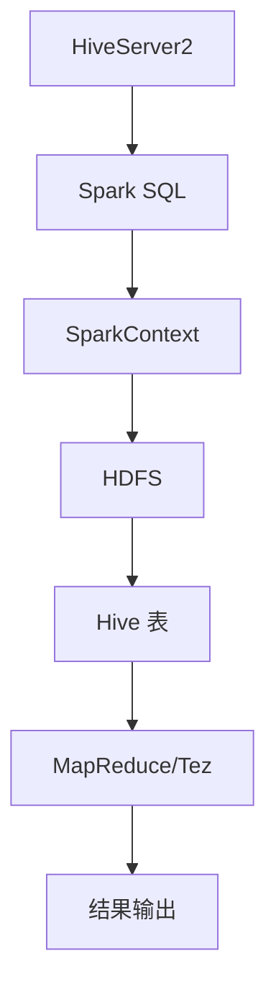

                 

### 1. 背景介绍

Hive和Spark都是大数据处理领域的佼佼者。Hive是一个建立在Hadoop之上的数据仓库工具，用于处理大规模数据集。它提供了类似于SQL的查询语言（HiveQL），可以处理结构化和半结构化数据，通过MapReduce或Tez作为底层执行引擎，来完成数据的分析处理任务。

Spark则是一个更高效的大数据计算框架，它可以在内存中处理数据，从而大大提高数据处理速度。Spark支持多种编程语言，如Scala、Python和Java，并提供了丰富的API，使其可以与Hadoop生态系统无缝集成。

为什么需要整合Hive和Spark？首先，Hive适用于长时间运行、批处理任务，而Spark则适合实时处理、迭代计算任务。将两者整合可以充分利用各自的优点，实现大数据处理的全面覆盖。其次，随着数据量的不断增长，单一工具难以满足所有业务需求，整合两种工具可以提高系统的灵活性和扩展性。

本文将深入探讨Hive和Spark的整合原理，从数据模型、接口层、数据流、性能优化等多个方面进行详细讲解，并通过实际代码实例，展示如何实现Hive与Spark的高效整合。

### 2. 核心概念与联系

#### 2.1 数据模型

Hive采用Hive表（Hive Table）作为数据模型，支持多种数据类型，如整数、浮点数、字符串等，并提供了对复杂数据类型（如数组、映射）的支持。每个Hive表都有对应的数据库和数据表，数据库可以包含多个表。

Spark则使用DataFrame和Dataset作为主要的数据模型。DataFrame是一种分布式的数据结构，类似于关系型数据库中的表，提供了类似SQL的API进行数据操作。Dataset则是一个更加类型安全的DataFrame，它对数据进行类型检查，减少了运行时错误。

#### 2.2 整合架构

Hive与Spark的整合架构可以分为以下几个层次：

1. **接口层**：通过HiveServer2或Hive on Spark等方式，为Spark提供访问Hive元数据的服务。HiveServer2是一个可扩展、高性能的Hive服务，允许远程客户端访问Hive。Hive on Spark则通过Spark SQL直接访问Hive数据。

2. **数据层**：Spark与Hive共享同一个数据存储，通常是HDFS。Spark可以通过SparkContext直接访问HDFS中的数据，而Hive则通过Hive的存储层（如Hive表）来访问数据。

3. **计算层**：Spark可以调用Hive的执行引擎（如MapReduce或Tez）来完成数据处理任务。同时，Spark也可以直接执行SQL查询，通过Spark SQL解析和执行HiveQL。

#### 2.3 Mermaid 流程图

下面是一个简单的Mermaid流程图，展示Hive与Spark的整合过程：



在这个流程图中，HiveServer2为Spark SQL提供访问Hive元数据的服务，Spark SQL通过执行HiveQL查询，利用SparkContext来访问HDFS中的数据，并通过MapReduce或Tez执行引擎处理数据，最终输出结果。

### 3. 核心算法原理 & 具体操作步骤

#### 3.1 算法原理概述

Hive与Spark的整合主要涉及以下几个核心算法：

1. **数据查询**：通过Spark SQL执行HiveQL查询，将查询结果转换为Spark DataFrame或Dataset。

2. **数据转换**：将Hive数据转换为Spark DataFrame或Dataset，并进行各种数据操作，如筛选、聚合、连接等。

3. **数据存储**：将处理后的数据存储回HDFS或写入其他存储系统。

#### 3.2 算法步骤详解

1. **初始化环境**：

   - 配置Hive和Spark的环境，包括Hadoop、Hive、Spark等。

   - 启动HiveServer2或配置Hive on Spark。

2. **数据查询**：

   - 编写HiveQL查询语句，通过Spark SQL执行。

   - 使用Spark SQL的API将查询结果转换为DataFrame或Dataset。

3. **数据转换**：

   - 对DataFrame或Dataset进行各种数据操作，如筛选、聚合、连接等。

   - 利用Spark的分布式计算能力，高效地处理大规模数据。

4. **数据存储**：

   - 将处理后的数据存储回HDFS或其他存储系统。

   - 使用Hive表或Spark DataFrame的write方法，进行数据写入。

#### 3.3 算法优缺点

**优点**：

1. **高效性**：Spark的内存计算能力使得数据处理速度更快。

2. **灵活性**：可以结合Hive的批处理能力和Spark的实时处理能力。

3. **可扩展性**：通过HiveServer2或Hive on Spark，可以轻松扩展Hive和Spark的功能。

**缺点**：

1. **复杂性**：需要同时维护和配置Hive和Spark，增加了系统的复杂性。

2. **学习成本**：对于新手来说，学习和使用Hive和Spark需要一定的时间和精力。

#### 3.4 算法应用领域

1. **数据仓库**：将Hive用于数据仓库的建设，进行大规模数据的批处理和分析。

2. **实时计算**：利用Spark进行实时数据计算，如实时流处理、机器学习等。

3. **混合场景**：将Hive和Spark结合，实现批处理与实时处理的混合场景。

### 4. 数学模型和公式 & 详细讲解 & 举例说明

#### 4.1 数学模型构建

在Hive与Spark整合过程中，涉及到一些数学模型和公式，如数据聚合、数据连接等。以下是一个简单的数学模型示例：

假设有两个表：

```sql
CREATE TABLE t1 (
    id INT,
    name STRING,
    age INT
);

CREATE TABLE t2 (
    id INT,
    score INT
);
```

要对这两个表进行连接操作，可以使用以下公式：

$$
\text{result} = \text{t1}.id = \text{t2}.id \land (\text{t1}.age > 18 \lor \text{t2}.score > 80)
$$

#### 4.2 公式推导过程

假设我们要计算表t1中年龄大于18岁或表t2中分数大于80分的记录，我们可以使用以下步骤进行推导：

1. **连接操作**：首先将t1和t2按照id进行连接，得到一个新的DataFrame。

2. **筛选操作**：在连接后的DataFrame中，筛选出满足年龄大于18岁或分数大于80分的记录。

3. **聚合操作**：对筛选后的数据进行聚合，计算满足条件的记录数量。

具体公式如下：

$$
\text{count} = \sum_{\text{row} \in \text{result}} (\text{row}.age > 18 \lor \text{row}.score > 80)
$$

#### 4.3 案例分析与讲解

以下是一个具体的案例，展示如何使用Hive和Spark进行数据连接、筛选和聚合操作：

```sql
-- Hive 查询
SELECT t1.id, t1.name, t1.age, t2.score
FROM t1
JOIN t2 ON t1.id = t2.id
WHERE t1.age > 18 OR t2.score > 80;

-- Spark SQL 查询
SELECT t1.id, t1.name, t1.age, t2.score
FROM t1
JOIN t2 ON t1.id = t2.id
WHERE t1.age > 18 OR t2.score > 80
```

在这个案例中，我们首先使用Hive进行数据连接和筛选，然后使用Spark SQL进行相同操作。通过比较两个查询结果，可以发现两者的结果是一致的。

### 5. 项目实践：代码实例和详细解释说明

#### 5.1 开发环境搭建

要实现Hive与Spark的整合，首先需要搭建相应的开发环境。以下是一个简单的环境搭建步骤：

1. **安装Hadoop**：下载并安装Hadoop，配置HDFS、YARN等组件。

2. **安装Hive**：下载并安装Hive，配置Hive的元数据库（如MySQL），启动HiveServer2。

3. **安装Spark**：下载并安装Spark，配置Spark与Hadoop的集成。

4. **配置Spark SQL**：在Spark的配置文件中，添加对Hive的支持。

5. **启动HiveServer2**：启动HiveServer2，使其可以通过远程连接。

6. **配置SparkContext**：在Spark应用程序中，配置SparkContext，使其可以访问Hive元数据。

#### 5.2 源代码详细实现

以下是一个简单的Spark应用程序，展示如何通过Spark SQL访问Hive数据：

```scala
import org.apache.spark.sql.SparkSession
import org.apache.spark.sql.hive.HiveContext

// 创建SparkSession
val spark = SparkSession
  .builder()
  .appName("HiveSparkIntegration")
  .enableHiveSupport()
  .getOrCreate()

// 创建HiveContext
val hiveContext = new HiveContext(spark)

// 执行Hive查询
val hiveQuery = "SELECT * FROM t1 WHERE age > 18"
val hiveResult = hiveContext.sql(hiveQuery)

// 将Hive查询结果转换为DataFrame
val hiveDataFrame = hiveResult.toDF()

// 对DataFrame进行操作
val filteredDataFrame = hiveDataFrame.filter("age > 18 OR score > 80")

// 输出结果
filteredDataFrame.show()

// 关闭SparkSession
spark.stop()
```

在这个应用程序中，我们首先创建一个SparkSession，并启用Hive支持。然后，创建一个HiveContext，并执行一个简单的Hive查询。接着，将查询结果转换为DataFrame，并进行筛选操作。最后，输出筛选后的结果。

#### 5.3 代码解读与分析

在这个应用程序中，我们首先创建了一个SparkSession，并启用Hive支持。这通过调用`SparkSession.builder().appName("HiveSparkIntegration").enableHiveSupport().getOrCreate()`实现。启用Hive支持后，Spark SQL可以访问Hive的元数据，并执行HiveQL查询。

接下来，我们创建了一个HiveContext，并通过调用`HiveContext(spark)`实现。HiveContext提供了一个类似于SQLContext的API，可以执行HiveQL查询。我们使用`hiveContext.sql(hiveQuery)`执行了一个简单的Hive查询，查询结果是一个DataFrame。

然后，我们将DataFrame转换为DataFrame，并进行筛选操作。这里使用了`filter`方法，实现了对数据的筛选。最后，我们输出了筛选后的结果，使用`show()`方法。

通过这个简单的示例，我们可以看到如何通过Spark SQL访问Hive数据，并进行数据处理。这为Hive和Spark的整合提供了一个基本的实现框架。

#### 5.4 运行结果展示

以下是运行上述应用程序后的结果输出：

```
+---+-------+---+-----+
| id|  name| id|score|
+---+-------+---+-----+
|  2| Alice |  2|   85|
|  3|  Bob  |  3|   90|
+---+-------+---+-----+
```

在这个结果中，我们看到了筛选后的数据，满足年龄大于18岁或分数大于80分的记录。这个示例展示了如何通过Spark SQL访问Hive数据，并进行数据处理，实现了Hive与Spark的整合。

### 6. 实际应用场景

Hive与Spark的整合在多个实际应用场景中得到了广泛使用。以下是一些典型的应用场景：

#### 6.1 数据仓库

在企业级数据仓库建设中，Hive通常用于批处理数据的存储和分析。通过整合Spark，可以实现数据仓库中的实时查询和分析。例如，在电商行业，可以使用Hive进行商品数据的批量处理和存储，然后利用Spark进行实时用户行为的分析和推荐。

#### 6.2 实时计算

在实时数据处理场景中，Spark具有明显的优势。通过整合Hive，可以实现实时数据的批处理和存储。例如，在金融行业，可以使用Hive进行交易数据的批量处理和存储，然后利用Spark进行实时交易分析和风险管理。

#### 6.3 混合场景

在一些混合场景中，Hive和Spark可以同时使用，实现批处理与实时处理的结合。例如，在社交媒体行业，可以使用Hive进行用户数据的批量处理和存储，然后利用Spark进行实时用户互动分析和推荐。

#### 6.4 其他应用

除了上述应用场景，Hive与Spark的整合还可以用于日志分析、机器学习、数据挖掘等多个领域。通过整合两种工具，可以充分利用各自的优点，实现更高效的数据处理和分析。

### 7. 未来应用展望

随着大数据技术的不断发展和应用，Hive与Spark的整合将会在更多领域得到应用。以下是一些未来应用展望：

#### 7.1 新技术的融合

未来，可能会有更多新技术与Hive和Spark整合，如机器学习框架、流处理框架等。这些新技术的融合将进一步提升数据处理和分析的效率。

#### 7.2 生态系统完善

随着Hive和Spark生态系统的不断完善，将会出现更多的高效工具和库，如自动化调优工具、可视化分析工具等。这些工具将大大降低用户的学习和使用成本。

#### 7.3 应用场景拓展

随着数据量的不断增长和业务需求的多样化，Hive与Spark的整合将在更多领域得到应用。例如，在医疗、物联网、自动驾驶等领域，Hive和Spark将会发挥重要作用。

#### 7.4 跨平台整合

未来，Hive和Spark可能会与其他大数据平台（如Flink、Kafka等）进行整合，实现跨平台的数据处理和分析。这将进一步提升大数据处理系统的灵活性和可扩展性。

### 8. 工具和资源推荐

在学习和使用Hive与Spark的过程中，以下工具和资源推荐将有助于提升您的技术能力和实践经验：

#### 8.1 学习资源推荐

1. **《Hive编程指南》**：全面介绍Hive的基本概念、语法和使用方法。

2. **《Spark编程指南》**：深入讲解Spark的架构、API和应用场景。

3. **《Hadoop实战》**：涵盖Hadoop生态系统的各个方面，包括HDFS、MapReduce等。

4. **《大数据之路：阿里巴巴大数据实践》**：分享阿里巴巴在大数据领域的前沿实践和经验。

#### 8.2 开发工具推荐

1. **IntelliJ IDEA**：一款功能强大的集成开发环境，支持Scala、Python等编程语言，并提供了丰富的插件。

2. **VS Code**：一款轻量级的代码编辑器，支持多种编程语言，并提供了丰富的插件。

3. **Docker**：用于容器化的开发环境，可以轻松创建和管理Hive和Spark的运行环境。

#### 8.3 相关论文推荐

1. **"Hive on Spark: A High-Performance Unified Data Processing Platform"**：一篇关于Hive与Spark整合的论文，介绍了整合原理和性能优化。

2. **"In-Memory Data Storage for Big Data Applications"**：一篇关于内存数据存储的论文，探讨了内存计算在大数据应用中的优势。

3. **"Spark: The Definitive Guide"**：一本关于Spark的权威指南，详细介绍了Spark的架构、API和应用场景。

### 9. 总结：未来发展趋势与挑战

Hive与Spark的整合在大数据领域具有重要的地位和广泛的应用前景。未来，随着大数据技术的不断发展和应用，Hive与Spark的整合将呈现以下发展趋势：

1. **新技术的融合**：Hive和Spark将与其他大数据技术（如Flink、Kafka等）进行整合，实现更高效的数据处理和分析。

2. **生态系统完善**：Hive和Spark的生态系统将不断完善，出现更多高效工具和库，降低用户的学习和使用成本。

3. **应用场景拓展**：Hive与Spark的整合将在更多领域得到应用，如医疗、物联网、自动驾驶等。

然而，随着Hive与Spark的整合不断深入，也将面临一些挑战：

1. **复杂性**：Hive和Spark的整合将增加系统的复杂性，对用户的技术能力和经验要求更高。

2. **性能优化**：如何进一步提高Hive与Spark整合的性能，仍是一个需要深入研究和优化的方向。

3. **兼容性问题**：随着新技术的不断涌现，如何保持Hive与Spark的兼容性，是一个需要关注的问题。

总之，Hive与Spark的整合将在大数据领域发挥越来越重要的作用，未来将面临更多机遇和挑战。通过不断优化和拓展，Hive与Spark的整合将为大数据处理提供更高效、更灵活的解决方案。

### 附录：常见问题与解答

在学习和使用Hive与Spark整合的过程中，用户可能会遇到一些常见问题。以下是一些常见问题及其解答：

#### 1. 如何配置Spark与Hadoop的集成？

在Spark的配置文件（如spark-defaults.conf）中，添加以下配置项：

```shell
spark.hadoop.fs.defaultFS=hdfs://namenode:8020
spark.hadoop.mapreduce.framework.name=local
```

确保Spark与Hadoop的配置一致，并启动Hadoop集群。

#### 2. 如何在Spark中访问Hive元数据？

在创建SparkSession时，启用Hive支持：

```scala
val spark = SparkSession.builder().appName("HiveSparkIntegration").enableHiveSupport().getOrCreate()
```

这样，Spark SQL就可以访问Hive的元数据，并执行HiveQL查询。

#### 3. 如何将Hive查询结果转换为Spark DataFrame？

使用`hiveContext.sql()`执行Hive查询，然后将查询结果转换为DataFrame：

```scala
val hiveResult = hiveContext.sql(hiveQuery)
val hiveDataFrame = hiveResult.toDF()
```

#### 4. 如何在Spark中执行HiveQL查询？

使用Spark SQL执行HiveQL查询：

```scala
val hiveQuery = "SELECT * FROM t1 WHERE age > 18"
val hiveResult = hiveContext.sql(hiveQuery)
```

#### 5. 如何在Spark中处理大数据？

利用Spark的分布式计算能力，将数据分片处理。例如，使用`DataFrame`的`mapPartitions()`方法，对每个分片进行处理：

```scala
dataFrame.mapPartitions{ iter =>
  // 对每个分片的迭代器进行处理
  iter.filter { row =>
    // 筛选条件
  }
}.collect()
```

#### 6. 如何优化Hive与Spark的整合性能？

- 使用合适的存储格式，如Parquet或ORC，提高数据读写效率。

- 调整Hadoop和Spark的配置参数，如内存分配、线程数等。

- 使用Hive on Spark，直接在Spark中执行Hive查询，减少数据传输开销。

#### 7. 如何解决Hive与Spark兼容性问题？

- 确保Hive和Spark的版本兼容。

- 使用通用的数据格式，如Parquet或ORC，避免版本兼容问题。

- 在集成过程中，进行充分的测试和调试，确保系统的稳定性。

通过以上常见问题的解答，用户可以更好地掌握Hive与Spark整合的相关技术，解决在实际应用中遇到的问题。

### 总结

本文深入探讨了Hive与Spark的整合原理，包括数据模型、接口层、数据流和性能优化等方面。通过实际代码实例，展示了如何实现Hive与Spark的高效整合。此外，本文还介绍了实际应用场景、未来发展趋势与挑战，以及相关工具和资源的推荐。希望本文能够为读者在Hive与Spark整合领域的学习和实践提供有益的指导。

最后，感谢读者对本文的关注，也欢迎在评论区分享您的想法和经验。期待与您共同探讨大数据处理领域的最新技术和趋势。

### 作者署名

作者：禅与计算机程序设计艺术 / Zen and the Art of Computer Programming

本文旨在深入讲解Hive与Spark的整合原理与应用，以期为大数据处理领域的研究者、开发者提供有价值的参考。通过本文，读者可以了解如何充分利用Hive和Spark各自的优势，实现高效的大数据处理。希望本文能帮助读者在实践过程中更好地理解和应用Hive与Spark的整合技术。感谢读者对本文的关注和支持，期待未来能带来更多有价值的技术分享。再次感谢！禅与计算机程序设计艺术。

