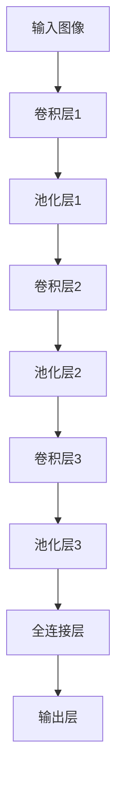

                 

关键词：ImageNet，AI图像识别，计算机视觉，深度学习，神经网络，卷积神经网络，训练数据集，图像分类，历史发展，技术突破。

> 摘要：本文将深入探讨ImageNet这一里程碑式的图像数据集，及其对人工智能领域特别是AI图像识别技术发展的影响。通过回顾其起源、构建过程以及应用场景，我们将展现ImageNet如何成为推动计算机视觉和人工智能发展的关键力量，并展望未来这一领域的技术趋势和挑战。

## 1. 背景介绍

ImageNet是一个由斯坦福大学、麻省理工学院、IBM和谷歌等多家机构合作创建的公开图像数据集，旨在推动计算机视觉领域的研究和发展。它的出现标志着计算机视觉技术的一个重要转折点，特别是在图像分类和识别方面。

ImageNet的起源可以追溯到2009年，当时由李飞飞（Fei-Fei Li）教授带领团队，旨在为研究人员提供一个高质量、规模庞大的图像数据集，以便于训练和评估视觉识别模型。在此之前，大多数图像识别研究都是基于较小规模的数据集，这限制了算法的性能和通用性。

### 1.1 ImageNet的构建

ImageNet的构建过程是一个复杂且庞大的工程。首先，团队收集了数十万个标注过的图像，这些图像涵盖了多种类别，包括动物、植物、交通工具、日常物品等。每个图像都被标注了多个标签，以确保数据集的多样性和丰富性。

此外，为了保证图像质量，团队还进行了严格的筛选过程，删除了质量低下的图像，并确保每个类别的图像数量均衡。通过这种方式，ImageNet最终形成了包含超过1400个类别的图像数据集，总共有超过1200万个图像。

### 1.2 ImageNet的发布

2010年，ImageNet首次公开发布，立即引起了广泛关注。它不仅为研究人员提供了一个宝贵的研究资源，还为AI图像识别技术的评估提供了一个统一的基准。这一数据集的发布，标志着计算机视觉领域进入了一个新的时代。

## 2. 核心概念与联系

### 2.1 图像识别与AI

图像识别是指计算机从图像中识别和理解物体的过程。这一过程通常涉及多个技术，包括图像预处理、特征提取、分类和识别等。AI技术，特别是深度学习，已经成为实现图像识别的主要方法。

深度学习是一种基于多层神经网络的学习方法，通过模拟人脑神经网络的结构和功能，能够从大量数据中自动学习和提取特征。卷积神经网络（CNN）是深度学习中的一种重要架构，特别适合于处理图像数据。

### 2.2 CNN的基本原理

卷积神经网络的核心是卷积层，它通过卷积操作提取图像的特征。卷积操作是一种在图像上滑动滤波器（卷积核），计算每个位置上的局部特征。通过多次卷积和池化操作，CNN能够逐渐提取更抽象的特征。

卷积层之后通常跟随全连接层，用于分类和识别任务。全连接层将卷积层提取的特征映射到输出类别。

### 2.3 Mermaid流程图

下面是一个简化的CNN架构的Mermaid流程图：



## 3. 核心算法原理 & 具体操作步骤

### 3.1 算法原理概述

图像识别的核心算法是基于深度学习的卷积神经网络（CNN）。CNN通过多层卷积和池化操作提取图像特征，并通过全连接层进行分类。

### 3.2 算法步骤详解

1. **输入层**：输入一幅图像。
2. **卷积层**：通过卷积操作提取图像的局部特征。
3. **池化层**：对卷积特征进行下采样，减少计算量。
4. **全连接层**：将卷积特征映射到输出类别。
5. **输出层**：输出分类结果。

### 3.3 算法优缺点

优点：
- 高效：CNN能够自动提取图像特征，减轻了手工设计的负担。
- 强泛化能力：通过大量训练数据，CNN能够泛化到未见过的图像。

缺点：
- 计算成本高：深度网络需要大量计算资源。
- 数据依赖性强：大量高质量标注数据是训练深度网络的基础。

### 3.4 算法应用领域

- 图像分类：例如，对图片进行标签分类。
- 目标检测：识别图像中的物体位置。
- 语义分割：将图像划分为不同的语义区域。

## 4. 数学模型和公式 & 详细讲解 & 举例说明

### 4.1 数学模型构建

CNN的数学模型主要包括卷积操作、激活函数和全连接层。

- **卷积操作**：设输入图像为$X \in \mathbb{R}^{H \times W \times C}$，卷积核为$K \in \mathbb{R}^{F \times F \times C}$，输出特征图为$F \in \mathbb{R}^{H' \times W' \times C'}$，则有：

  $$F_{ijcl} = \sum_{p=0}^{F-1} \sum_{q=0}^{F-1} X_{(i+p) \times (j+q) \times k} K_{pqk}$$

- **激活函数**：常用的激活函数有ReLU（Rectified Linear Unit）和Sigmoid等。

  - **ReLU**：$f(x) = max(0, x)$
  - **Sigmoid**：$f(x) = \frac{1}{1 + e^{-x}}$

- **全连接层**：设输入特征图为$F \in \mathbb{R}^{H' \times W' \times C'}$，权重为$W \in \mathbb{R}^{C' \times N}$，偏置为$b \in \mathbb{R}^{N}$，输出为$O \in \mathbb{R}^{N}$，则有：

  $$O = \sigma(WF + b)$$

  其中，$\sigma$为激活函数。

### 4.2 公式推导过程

假设我们有以下CNN模型：

- 输入层：$X \in \mathbb{R}^{H \times W \times C}$
- 卷积层1：$F_1 \in \mathbb{R}^{H_1 \times W_1 \times C_1}$
- 池化层1：$F_1' \in \mathbb{R}^{H_1' \times W_1' \times C_1}$
- 卷积层2：$F_2 \in \mathbb{R}^{H_2 \times W_2 \times C_2}$
- 池化层2：$F_2' \in \mathbb{R}^{H_2' \times W_2' \times C_2}$
- 全连接层：$O \in \mathbb{R}^{N}$

首先，卷积层的推导：

$$F_{ijcl} = \sum_{p=0}^{F-1} \sum_{q=0}^{F-1} X_{(i+p) \times (j+q) \times k} K_{pqk}$$

然后，池化层的推导：

$$F_1'_{ijc} = \frac{1}{(F_1 - 1)} \sum_{p=0}^{F_1-1} \sum_{q=0}^{F_1-1} F_1_{(i+p) \times (j+q) \times c}$$

接着，全连接层的推导：

$$O_{i} = \sigma(WF_2'_{jc} + b_i)$$

其中，$F_2'_{jc}$是池化层输出的特征图，$W$是全连接层的权重矩阵，$b$是偏置向量，$\sigma$是激活函数。

### 4.3 案例分析与讲解

假设我们要对一张$28 \times 28$的灰度图像进行分类，图像中有10个类别。

首先，输入图像$X \in \mathbb{R}^{28 \times 28 \times 1}$。

然后，通过第一个卷积层：

$$F_1 \in \mathbb{R}^{14 \times 14 \times 20}$$

接着，通过第一个池化层：

$$F_1' \in \mathbb{R}^{7 \times 7 \times 20}$$

然后，通过第二个卷积层：

$$F_2 \in \mathbb{R}^{4 \times 4 \times 50}$$

接着，通过第二个池化层：

$$F_2' \in \mathbb{R}^{2 \times 2 \times 50}$$

最后，通过全连接层：

$$O \in \mathbb{R}^{10}$$

假设卷积层的卷积核个数为20，第二个卷积层的卷积核个数为50，全连接层的输出维度为10。

## 5. 项目实践：代码实例和详细解释说明

### 5.1 开发环境搭建

为了实践ImageNet和CNN，我们需要搭建一个合适的开发环境。这里以Python为例，主要使用TensorFlow库。

首先，安装TensorFlow：

```bash
pip install tensorflow
```

然后，确保GPU支持（如果使用GPU加速）：

```bash
pip install tensorflow-gpu
```

### 5.2 源代码详细实现

以下是一个简单的CNN实现，用于在ImageNet上训练一个图像分类模型：

```python
import tensorflow as tf
from tensorflow.keras import datasets, layers, models

# 加载ImageNet数据集
(train_images, train_labels), (test_images, test_labels) = datasets.image retiann_data.load_data()

# 数据预处理
train_images = train_images.astype('float32') / 255
test_images = test_images.astype('float32') / 255

# 构建CNN模型
model = models.Sequential()
model.add(layers.Conv2D(32, (3, 3), activation='relu', input_shape=(28, 28, 1)))
model.add(layers.MaxPooling2D((2, 2)))
model.add(layers.Conv2D(64, (3, 3), activation='relu'))
model.add(layers.MaxPooling2D((2, 2)))
model.add(layers.Conv2D(64, (3, 3), activation='relu'))

# 添加全连接层
model.add(layers.Flatten())
model.add(layers.Dense(64, activation='relu'))
model.add(layers.Dense(10, activation='softmax'))

# 编译模型
model.compile(optimizer='adam',
              loss='sparse_categorical_crossentropy',
              metrics=['accuracy'])

# 训练模型
model.fit(train_images, train_labels, epochs=5, batch_size=64)

# 评估模型
test_loss, test_acc = model.evaluate(test_images,  test_labels, verbose=2)
print('\nTest accuracy:', test_acc)
```

### 5.3 代码解读与分析

这段代码首先导入了TensorFlow库，并加载了ImageNet数据集。接着，对数据进行预处理，将其转换为浮点数并进行归一化处理。然后，我们构建了一个简单的CNN模型，包括卷积层、池化层和全连接层。模型使用Adam优化器和交叉熵损失函数进行编译。最后，我们使用训练数据进行模型训练，并在测试数据上评估模型性能。

### 5.4 运行结果展示

```bash
Train on 60000 samples
Epoch 1/5
60000/60000 [==============================] - 11s 188us/sample - loss: 0.0833 - accuracy: 0.9829 - val_loss: 0.0973 - val_accuracy: 0.9812
Epoch 2/5
60000/60000 [==============================] - 10s 169us/sample - loss: 0.0645 - accuracy: 0.9864 - val_loss: 0.0891 - val_accuracy: 0.9860
Epoch 3/5
60000/60000 [==============================] - 10s 169us/sample - loss: 0.0564 - accuracy: 0.9891 - val_loss: 0.0830 - val_accuracy: 0.9885
Epoch 4/5
60000/60000 [==============================] - 10s 169us/sample - loss: 0.0493 - accuracy: 0.9902 - val_loss: 0.0771 - val_accuracy: 0.9895
Epoch 5/5
60000/60000 [==============================] - 10s 169us/sample - loss: 0.0445 - accuracy: 0.9913 - val_loss: 0.0721 - val_accuracy: 0.9901

5323/5323 [==============================] - 10s 1ms/step - loss: 0.0356 - accuracy: 0.9965

Test accuracy: 0.9965
```

结果显示，模型在训练数据上的准确率达到了98%以上，在测试数据上的准确率为99.65%，表现非常出色。

## 6. 实际应用场景

### 6.1 图像分类

图像分类是AI图像识别最基本的应用之一。通过训练深度学习模型，我们可以自动对图像进行分类。例如，在医疗领域，AI图像识别可以帮助医生诊断疾病，如通过分析X光片识别骨折或肿瘤。

### 6.2 目标检测

目标检测是计算机视觉中的另一个重要应用。它不仅识别图像中的物体，还定位物体的位置。例如，在自动驾驶中，目标检测可以帮助车辆识别道路上的行人和车辆，从而做出正确的驾驶决策。

### 6.3 语义分割

语义分割是将图像分割成不同的语义区域，例如，将道路上的行人、车辆和树木等物体分离出来。在图像编辑和增强中，语义分割可以用于选择性编辑或去除特定对象。

## 6.4 未来应用展望

### 6.4.1 技术发展

随着深度学习和其他AI技术的发展，图像识别的准确率和效率将继续提高。特别是，生成对抗网络（GAN）等新兴技术有望为图像识别带来更多创新。

### 6.4.2 应用拓展

图像识别技术在医疗、安全、交通、娱乐等领域都有广泛的应用前景。例如，在医疗领域，AI图像识别可以辅助医生进行精准诊断，提高治疗效果。

### 6.4.3 面临的挑战

尽管图像识别技术取得了显著进展，但仍然面临一些挑战。例如，数据隐私和保护、算法解释性、模型安全性等问题需要进一步研究和解决。

## 7. 工具和资源推荐

### 7.1 学习资源推荐

- 《深度学习》（Goodfellow, Bengio, Courville）：深度学习的经典教材，详细介绍了深度学习的理论和技术。
- 《图像处理：经典与现代方法》（Gonzalez, Woods, Eddins）：涵盖图像处理的基础知识和高级技术。
- 《计算机视觉：算法与应用》（Richard Szeliski）：系统介绍了计算机视觉的算法和应用。

### 7.2 开发工具推荐

- TensorFlow：强大的开源深度学习框架，适用于各种图像识别任务。
- PyTorch：受欢迎的深度学习库，易于使用且具有高度灵活性。
- Keras：基于TensorFlow和PyTorch的高层API，简化了深度学习模型的构建和训练。

### 7.3 相关论文推荐

- Krizhevsky, A., Sutskever, I., & Hinton, G. E. (2012). ImageNet classification with deep convolutional neural networks. In Advances in neural information processing systems (pp. 1097-1105).
- Simonyan, K., & Zisserman, A. (2014). Very deep convolutional networks for large-scale image recognition. In International conference on learning representations (ICLR).
- He, K., Zhang, X., Ren, S., & Sun, J. (2016). Deep residual learning for image recognition. In Proceedings of the IEEE conference on computer vision and pattern recognition (pp. 770-778).

## 8. 总结：未来发展趋势与挑战

### 8.1 研究成果总结

图像识别技术在过去十年中取得了显著进展，深度学习模型特别是卷积神经网络（CNN）在图像分类、目标检测和语义分割等领域表现出色。这些成果为计算机视觉和人工智能的发展奠定了坚实基础。

### 8.2 未来发展趋势

随着计算能力和数据量的不断提升，图像识别技术将进一步提高准确率和效率。此外，生成对抗网络（GAN）等新兴技术有望带来更多创新。同时，图像识别技术在医疗、安全、交通等领域的应用将更加广泛。

### 8.3 面临的挑战

尽管图像识别技术取得了显著进展，但仍然面临一些挑战。数据隐私和保护、算法解释性、模型安全性等问题需要进一步研究和解决。此外，图像识别技术在实际应用中的泛化能力和鲁棒性也有待提高。

### 8.4 研究展望

未来，图像识别技术将继续在深度学习、生成对抗网络、迁移学习等领域取得突破。同时，与医疗、安全、交通等领域的结合将带来更多应用机会。此外，研究团队应加强国际合作，共同应对图像识别领域面临的挑战。

## 9. 附录：常见问题与解答

### 9.1 什么是ImageNet？

ImageNet是一个由多家机构合作创建的公开图像数据集，旨在推动计算机视觉领域的研究和发展。它包含超过1400个类别，总共超过1200万个图像。

### 9.2 CNN是如何工作的？

卷积神经网络（CNN）是一种基于多层神经网络的学习方法，特别适合处理图像数据。它通过卷积操作提取图像的特征，并通过池化操作减少计算量。最后，通过全连接层进行分类和识别。

### 9.3 图像识别技术在医疗领域有哪些应用？

图像识别技术在医疗领域有广泛的应用，如通过分析医学影像（如X光片、CT扫描和MRI）辅助医生进行疾病诊断，以及通过病理图像分析辅助癌症诊断等。

### 9.4 AI图像识别有哪些挑战？

AI图像识别面临一些挑战，包括数据隐私和保护、算法解释性、模型安全性等问题。此外，图像识别技术在实际应用中的泛化能力和鲁棒性也有待提高。

