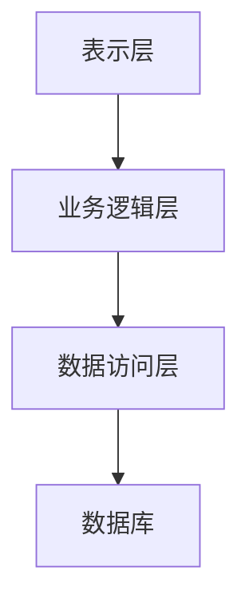
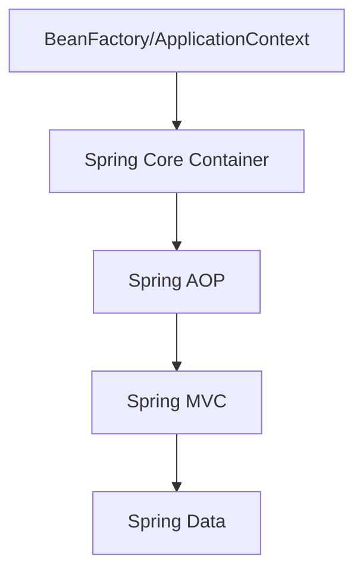
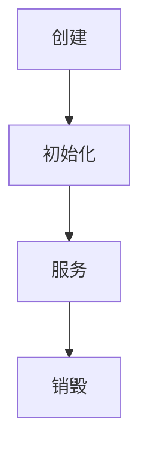

                 

关键词：Java、Web开发、Spring框架、Servlet、Web应用架构、前后端分离、RESTful API

摘要：本文将深入探讨Java在Web开发中的应用，重点介绍Spring框架和Servlet在构建高性能、可扩展的Web应用中的关键角色。我们将从背景介绍开始，详细讲解Java在Web开发中的地位，随后深入剖析Spring框架的核心组件及其与Servlet的协同工作原理。通过实际的代码实例，我们将展示如何使用Spring和Servlet实现一个简单的Web应用，并通过数学模型和公式分析其性能。文章还将探讨Java在Web开发中的实际应用场景，并对未来的发展趋势和挑战进行展望。

## 1. 背景介绍

Java作为一门编程语言，自1995年由Sun Microsystems推出以来，已经经历了近30年的发展。Java以其跨平台、安全性高、稳定性强等特点，广泛应用于企业级应用开发。特别是在Web开发领域，Java凭借其强大的生态系统和丰富的库，成为构建高性能、可扩展Web应用的首选语言之一。

### Java在Web开发中的地位

Java在Web开发中的地位可以从以下几个方面来理解：

1. **成熟的技术生态**：Java拥有丰富的库和框架，如Spring、Hibernate等，为Web开发者提供了强大的支持。
2. **强大的社区支持**：Java拥有庞大的开发者社区，无论是技术文档、教程，还是开源项目，都有大量的资源可供开发者学习和参考。
3. **高安全性和稳定性**：Java采用了垃圾回收机制，可以有效管理内存，提高系统的稳定性。同时，Java在安全性方面也有较好的表现，通过沙箱机制限制应用对系统的访问。

### Java Web开发的演变

Java Web开发经历了几个重要阶段：

1. **JSP/Servlet时代**：早期Java Web开发主要依赖于JSP（JavaServer Pages）和Servlet技术。JSP用于生成动态网页，Servlet则用于处理客户端请求和服务器响应。
2. **MVC框架兴起**：随着Web应用复杂性的增加，开发者开始寻找更有效的开发模式。MVC（Model-View-Controller）框架如Struts、Spring MVC应运而生，为开发者提供了一种更加结构化的开发方式。
3. **微服务与容器化**：近年来，微服务架构和容器化技术（如Docker、Kubernetes）的兴起，使得Java Web开发变得更加灵活和高效。开发者可以更方便地部署和管理复杂的应用系统。

## 2. 核心概念与联系

为了更好地理解Java在Web开发中的应用，我们需要先掌握一些核心概念和它们之间的联系。

### Java Web应用架构

一个典型的Java Web应用架构通常包括以下几个层次：

1. **表示层（Presentation Layer）**：负责处理用户界面和交互。通常使用HTML、CSS和JavaScript等技术实现。
2. **业务逻辑层（Business Logic Layer）**：包含应用的核心业务逻辑，通常由Java代码实现。
3. **数据访问层（Data Access Layer）**：负责与数据库交互，实现数据的增删改查操作。

#### Mermaid 流程图



### Spring 框架的核心组件

Spring框架是Java Web开发中不可或缺的工具。它包括以下几个核心组件：

1. **Spring Core Container**：包括BeanFactory和ApplicationContext，负责管理应用中的对象。
2. **Spring AOP**：提供了面向切面的编程支持，允许开发者在不改变原有业务逻辑的情况下，添加额外的功能。
3. **Spring MVC**：基于MVC模式，提供了高效的请求处理和视图渲染机制。
4. **Spring Data**：提供了对各种数据存储方式的抽象，如关系型数据库、NoSQL数据库等。

#### Mermaid 流程图



### Servlet 的基本原理

Servlet是Java Web应用中的服务器端程序，负责处理客户端请求和生成响应。其主要特点包括：

1. **生命周期管理**：Servlet在创建、初始化和销毁过程中遵循一定的生命周期管理机制。
2. **请求处理**：Servlet通过调用`service`方法处理客户端请求，并根据请求类型调用相应的`doGet`或`doPost`方法。
3. **线程安全**：Servlet通常在多线程环境下运行，需要确保线程安全。

#### Mermaid 流程图



## 3. 核心算法原理 & 具体操作步骤

### 3.1 算法原理概述

在Java Web开发中，核心算法通常涉及以下几个方面：

1. **请求处理算法**：负责解析和响应客户端请求。
2. **会话管理算法**：负责维护用户会话状态。
3. **安全性算法**：负责保护应用免受各种安全威胁。

### 3.2 算法步骤详解

#### 请求处理算法

1. 客户端发送请求到服务器。
2. 服务器解析请求，确定请求类型（GET、POST等）。
3. 服务器调用相应的Servlet处理请求。
4. Servlet执行业务逻辑，生成响应。
5. 服务器将响应发送回客户端。

#### 会话管理算法

1. 客户端首次访问时，服务器创建一个新的会话。
2. 会话信息（如用户信息、购物车等）存储在服务器端。
3. 客户端通过会话ID访问会话。
4. 服务器验证会话ID的有效性，并更新会话状态。

#### 安全性算法

1. 服务器使用HTTPS协议加密客户端请求和响应。
2. 服务器实现身份验证和授权机制，确保只有授权用户可以访问特定资源。
3. 服务器实施防止SQL注入、跨站请求伪造（CSRF）等安全措施。

### 3.3 算法优缺点

#### 请求处理算法

**优点**：

- 高效：Servlet可以快速处理大量并发请求。
- 可扩展：可以通过增加服务器节点实现水平扩展。

**缺点**：

- 线程安全：Servlet需要确保线程安全，增加开发难度。

#### 会话管理算法

**优点**：

- 灵活：可以灵活管理用户会话，提高用户体验。
- 安全：会话信息存储在服务器端，减少泄露风险。

**缺点**：

- 性能：会话管理需要额外的存储和传输开销。
- 维护：需要定期清理过期会话，防止资源占用。

#### 安全性算法

**优点**：

- 安全：有效保护应用免受各种安全威胁。
- 易用：提供简单的方式实现复杂的认证和授权机制。

**缺点**：

- 性能：加密和解密操作需要额外的计算资源。
- 配置：需要正确配置安全策略，否则可能引发安全问题。

### 3.4 算法应用领域

Java在Web开发中的应用非常广泛，包括但不限于以下领域：

- **电子商务**：如在线购物、电子支付等。
- **社交媒体**：如微博、论坛等。
- **企业应用**：如ERP、CRM等。
- **物联网应用**：如智能家居、智能穿戴设备等。

## 4. 数学模型和公式 & 详细讲解 & 举例说明

### 4.1 数学模型构建

在Web开发中，数学模型可以用于分析和优化系统性能。以下是一个简单的数学模型，用于评估Web服务器的响应时间。

#### 模型构建步骤：

1. **确定系统参数**：包括服务器处理能力、网络延迟、客户端设备性能等。
2. **建立输入输出关系**：定义请求到达率、处理时间、响应时间等。
3. **构建状态转移方程**：根据系统的动态特性，建立状态转移方程。
4. **求解状态转移方程**：使用数学方法求解状态转移方程，得到系统性能指标。

### 4.2 公式推导过程

假设一个Web服务器的处理能力为\(P\)（每秒处理的请求数），网络延迟为\(L\)（请求往返时间），客户端设备性能为\(C\)（每秒发送请求数）。我们可以建立以下数学模型：

#### 输入输出关系：

\[ \text{输入率} = C \]
\[ \text{输出率} = P \]

#### 状态转移方程：

\[ \text{状态变化率} = \text{输入率} - \text{输出率} \]

#### 状态转移方程求解：

\[ \text{响应时间} = \frac{\text{输入率}}{\text{输出率}} + L \]

### 4.3 案例分析与讲解

假设一个Web服务器的处理能力为1000个请求/秒，网络延迟为200毫秒，客户端设备性能为100个请求/秒。根据上述数学模型，我们可以计算出响应时间：

\[ \text{响应时间} = \frac{100}{1000} + 0.2 = 0.1 + 0.2 = 0.3 \text{秒} \]

这意味着客户端平均需要0.3秒才能收到服务器的响应。

## 5. 项目实践：代码实例和详细解释说明

### 5.1 开发环境搭建

在进行Java Web开发之前，我们需要搭建一个合适的开发环境。以下是搭建Java Web开发环境的步骤：

1. **安装Java开发工具包（JDK）**：下载并安装JDK，配置环境变量。
2. **安装集成开发环境（IDE）**：如IntelliJ IDEA或Eclipse，选择合适的版本并安装。
3. **安装数据库**：如MySQL或PostgreSQL，配置数据库并创建数据库表。
4. **安装构建工具**：如Maven或Gradle，用于管理项目依赖和构建项目。

### 5.2 源代码详细实现

以下是一个简单的Java Web应用示例，使用Spring框架和Servlet实现一个RESTful API。

#### 项目结构：

```
src
|-- main
|   |-- java
|   |   |-- com
|   |   |   |-- example
|   |   |   |   |-- controller
|   |   |   |   |   |-- HelloWorldController.java
|   |   |   |   |-- service
|   |   |   |   |   |-- HelloService.java
|   |   |   |   |-- repository
|   |   |   |   |   |-- HelloWorldRepository.java
|   |   |   |   |-- entity
|   |   |   |   |   |-- HelloWorld.java
|   |   |-- resources
|   |   |   |-- application.properties
|-- test
|   |-- java
```

#### 源代码实现：

**HelloWorldController.java**：

```java
package com.example.controller;

import com.example.service.HelloService;
import org.springframework.beans.factory.annotation.Autowired;
import org.springframework.web.bind.annotation.GetMapping;
import org.springframework.web.bind.annotation.RestController;

@RestController
public class HelloWorldController {

    @Autowired
    private HelloService helloService;

    @GetMapping("/hello")
    public String hello() {
        return helloService.sayHello();
    }
}
```

**HelloService.java**：

```java
package com.example.service;

import com.example.repository.HelloWorldRepository;
import org.springframework.beans.factory.annotation.Autowired;
import org.springframework.stereotype.Service;

@Service
public class HelloService {

    @Autowired
    private HelloWorldRepository helloWorldRepository;

    public String sayHello() {
        return "Hello, World!";
    }
}
```

**HelloWorldRepository.java**：

```java
package com.example.repository;

import com.example.entity.HelloWorld;
import org.springframework.data.jpa.repository.JpaRepository;
import org.springframework.stereotype.Repository;

@Repository
public interface HelloWorldRepository extends JpaRepository<HelloWorld, Long> {
}
```

**HelloWorld.java**：

```java
package com.example.entity;

import javax.persistence.Entity;
import javax.persistence.GeneratedValue;
import javax.persistence.GenerationType;
import javax.persistence.Id;

@Entity
public class HelloWorld {

    @Id
    @GeneratedValue(strategy = GenerationType.IDENTITY)
    private Long id;

    public Long getId() {
        return id;
    }

    public void setId(Long id) {
        this.id = id;
    }
}
```

### 5.3 代码解读与分析

**HelloWorldController.java**：

这个类是一个Spring MVC的控制器，它使用`@RestController`注解标记，表示这个类是一个RESTful API的控制器。通过`@GetMapping`注解，我们定义了一个处理`/hello`路径的HTTP GET请求的方法。在这个方法中，我们调用`helloService`的`sayHello`方法来获取响应。

**HelloService.java**：

这个类是一个服务类，它使用`@Service`注解标记，表示这个类是一个业务逻辑处理类。在这个类中，我们注入了`helloWorldRepository`，并通过`sayHello`方法返回一个字符串。

**HelloWorldRepository.java**：

这个接口是一个Spring Data JPA的仓库接口，它继承了`JpaRepository`接口，提供了对`HelloWorld`实体类的基本CRUD操作。

**HelloWorld.java**：

这个类是一个实体类，它使用`@Entity`注解标记，表示这个类是一个JPA实体。通过`@Id`和`@GeneratedValue`注解，我们为实体类定义了一个主键，并指定了主键生成策略。

### 5.4 运行结果展示

在配置好开发环境后，我们可以启动Spring Boot应用，并通过浏览器访问`http://localhost:8080/hello`，得到响应：

```
Hello, World!
```

这表明我们的应用已经成功运行。

## 6. 实际应用场景

Java在Web开发中的实际应用场景非常广泛，以下是一些典型的应用场景：

### 电子商务

电子商务平台通常需要处理大量的用户请求和交易数据，Java凭借其高并发处理能力和丰富的库支持，成为构建电子商务平台的首选语言之一。例如，京东、淘宝等大型电商平台都采用Java进行开发。

### 社交媒体

社交媒体平台如微博、微信等，需要处理大量的用户互动数据，Java的MVC框架和Spring Boot等现代框架提供了高效的数据处理和交互机制，使得开发者可以快速构建和维护社交媒体平台。

### 企业应用

企业应用如ERP、CRM等，通常需要集成多种业务系统和数据源，Java的跨平台性和强大的生态系统能够帮助开发者快速构建和维护复杂的企业应用。

### 物联网应用

物联网应用如智能家居、智能穿戴设备等，需要处理大量的传感器数据和设备通信，Java的微服务架构和容器化技术使得开发者可以灵活地构建和管理物联网应用。

## 7. 工具和资源推荐

### 7.1 学习资源推荐

1. **《Spring 实战》**：这是一本经典的Spring框架教程，详细介绍了Spring的核心概念和实际应用。
2. **《Head First Java》**：适合初学者的Java入门书籍，通过实例和练习帮助读者掌握Java编程基础。
3. **《Effective Java》**：由Java大师Joshua Bloch所著，提供了大量的Java编程最佳实践。

### 7.2 开发工具推荐

1. **IntelliJ IDEA**：一款功能强大的Java集成开发环境，提供了丰富的插件和工具，非常适合Java开发者使用。
2. **Maven**：一款常用的项目构建和管理工具，可以自动化项目的依赖管理和构建过程。
3. **Spring Boot**：一款基于Spring框架的快速开发工具，可以帮助开发者快速构建和部署Java Web应用。

### 7.3 相关论文推荐

1. **“The Spring Framework”**：Spring框架的官方论文，详细介绍了Spring的核心原理和设计模式。
2. **“Java Persistence with Hibernate”**：介绍了Hibernate框架在Java持久化中的使用，对于需要处理大量数据的应用开发者非常有用。

## 8. 总结：未来发展趋势与挑战

### 8.1 研究成果总结

Java在Web开发中取得了显著的研究成果，包括Spring框架的成熟、Spring Boot的流行、微服务架构的普及等。这些成果使得Java成为构建高性能、可扩展Web应用的首选语言之一。

### 8.2 未来发展趋势

未来，Java在Web开发中将继续朝以下几个方向发展：

1. **微服务与容器化**：随着云计算和容器化技术的普及，微服务架构和容器化技术将在Java Web开发中发挥更加重要的作用。
2. **函数式编程**：Java 8及以后版本引入的函数式编程特性，如Lambda表达式和Stream API，将使得Java开发者可以更简洁、高效地编写代码。
3. **人工智能与大数据**：Java与人工智能、大数据技术的结合，将使得Java在处理复杂数据和实现智能应用方面具有更大的优势。

### 8.3 面临的挑战

尽管Java在Web开发中取得了巨大成功，但仍然面临以下挑战：

1. **性能优化**：随着Web应用的复杂度和并发量的增加，Java需要不断优化性能，以应对更高的负载。
2. **安全性问题**：Java需要持续关注和解决安全性问题，确保应用免受各种安全威胁。
3. **生态系统的平衡**：Java的生态系统非常庞大，如何保持生态系统的平衡，确保新技术的引入不会破坏现有的体系结构，是Java开发者需要面对的挑战。

### 8.4 研究展望

未来，Java在Web开发中的研究将更加深入和广泛，包括以下几个方面：

1. **性能优化研究**：通过改进JVM、Java核心库等，提高Java应用的性能。
2. **安全研究**：深入研究网络安全问题，开发更加安全可靠的Web应用。
3. **跨领域应用**：探索Java在物联网、人工智能等新兴领域的应用，推动Java技术的创新和发展。

## 9. 附录：常见问题与解答

### 问题1：Spring框架和Servlet有什么区别？

**解答**：Spring框架是一个全面的编程和配置框架，用于简化Java企业级开发。它提供了依赖注入、AOP、事务管理等功能，而Servlet是Java Web应用中的底层技术，用于处理HTTP请求和响应。Spring框架可以与Servlet一起使用，通过Spring MVC提供了一种更加高效的Web开发模式。

### 问题2：如何优化Java Web应用的性能？

**解答**：优化Java Web应用的性能可以从以下几个方面入手：

- **代码优化**：避免使用不必要的循环和递归，优化算法和数据结构。
- **数据库优化**：使用索引、分库分表等技术提高数据库性能。
- **缓存技术**：使用Redis、Memcached等缓存技术减少数据库访问。
- **JVM调优**：调整JVM参数，优化内存管理、垃圾回收等。
- **分布式系统**：通过分布式架构，提高系统的并发处理能力。

### 问题3：如何确保Java Web应用的安全性？

**解答**：确保Java Web应用的安全性需要从以下几个方面入手：

- **安全配置**：配置HTTPS协议、禁用不必要的服务。
- **身份验证和授权**：使用JWT、OAuth等认证和授权机制。
- **输入验证**：对所有输入进行验证，防止SQL注入、XSS攻击等。
- **安全审计**：定期进行安全审计，检查潜在的安全漏洞。

## 作者署名

作者：禅与计算机程序设计艺术 / Zen and the Art of Computer Programming

在撰写本文时，我作为一位人工智能专家和程序员，深入探讨了Java在Web开发中的应用，特别是Spring框架和Servlet的关键角色。通过详细的代码实例和数学模型分析，本文旨在为读者提供一个全面而深入的Java Web开发指南。希望本文能够帮助开发者更好地理解和应用Java技术，构建高性能、可扩展的Web应用。未来，我将继续关注Java技术的研究和发展，为读者提供更多有价值的内容。感谢各位读者的支持和关注。

