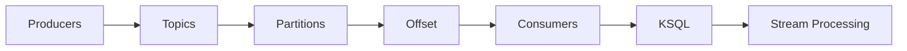

                 

关键词：Kafka、KSQL、流处理、实时查询、大数据处理、分布式系统、数据流、架构设计、算法原理、代码实例、实践应用

## 摘要

本文旨在深入探讨Kafka KSQL的原理与实际应用。Kafka作为一款高吞吐量、可扩展的分布式消息队列系统，广泛应用于大数据处理和实时流处理领域。而KSQL作为Kafka的原生流处理语言，使得开发者可以无需编写复杂的代码，就能对Kafka中的数据进行实时查询与分析。本文将从KSQL的核心概念出发，详细解析其原理，并通过具体代码实例，展示KSQL在实际项目中的应用与实现。同时，还将探讨KSQL在未来大数据处理领域的发展趋势与挑战。

## 1. 背景介绍

### 1.1 Kafka概述

Kafka是一个分布式流处理平台，由LinkedIn公司开发，目前由Apache软件基金会管理。它的主要用途是构建实时的数据管道和应用程序，用于处理大规模数据流。Kafka具有以下几个特点：

- **高吞吐量**：Kafka可以处理每秒数百万条消息，适用于大规模数据处理场景。
- **高可用性**：Kafka采用分布式架构，可以实现数据的冗余存储，确保系统的高可用性。
- **可扩展性**：Kafka可以轻松地扩展，以适应不断增长的数据量。

### 1.2 KSQL概述

KSQL是由Confluent公司开发的用于Kafka的实时流处理查询语言，它基于SQL语法，但专门针对流数据处理进行了优化。KSQL的主要功能包括：

- **实时查询**：KSQL可以实时对Kafka中的数据进行查询，无需停机。
- **无需代码**：通过简单的SQL语句，即可实现复杂的流数据处理任务。
- **可扩展性**：KSQL支持分布式执行，可以处理大规模的流数据。

## 2. 核心概念与联系

在深入探讨KSQL之前，我们首先需要了解几个核心概念，包括Kafka的数据流模型、KSQL的查询语法以及KSQL在Kafka中的位置。

### 2.1 Kafka的数据流模型

Kafka的数据流模型由几个关键组件构成：

- **Topic**：主题，用于组织消息，类似于关系数据库中的表。
- **Partition**：分区，每个Topic可以划分为多个分区，用于提高并发性和性能。
- **Offset**：偏移量，用于唯一标识消息在分区中的位置。
- **Producer**：生产者，负责向Kafka写入消息。
- **Consumer**：消费者，负责从Kafka读取消息。

### 2.2 KSQL的查询语法

KSQL的查询语法类似于SQL，但做了相应的优化，以适应流数据处理。以下是一个简单的KSQL查询示例：

```sql
SELECT * FROM streams_table;
```

这个查询将返回`streams_table`中的所有数据。更复杂的查询可以包括聚合函数、连接操作等。

### 2.3 KSQL在Kafka中的位置

KSQL在Kafka中的位置如图所示：



KSQL通过Kafka的Consumer组件读取数据，然后进行实时处理和查询。处理后的数据可以继续写入Kafka的其他Topic或被其他系统消费。

## 3. 核心算法原理 & 具体操作步骤

### 3.1 算法原理概述

KSQL的核心算法原理是基于Kafka的日志压缩和高效的数据结构，以实现实时数据流处理。KSQL使用了一种称为“拉模式”（Pull Mode）的查询模式，使得消费者可以按需拉取数据，从而实现低延迟的查询。

### 3.2 算法步骤详解

1. **创建Topic**：首先，需要创建一个用于存储流数据的Topic。
2. **写入数据**：通过Kafka Producer向Topic中写入数据。
3. **启动KSQL服务**：在KSQL客户端中启动服务。
4. **执行查询**：通过KSQL语句执行实时查询。
5. **处理结果**：处理查询结果，并可能将其写入其他Topic。

### 3.3 算法优缺点

**优点**：

- **低延迟**：使用拉模式查询，可以实现低延迟的数据处理。
- **可扩展性**：支持分布式执行，可以处理大规模数据流。
- **易用性**：基于SQL语法，易于学习和使用。

**缺点**：

- **资源消耗**：由于KSQL的实时处理特性，可能需要较高的系统资源。
- **复杂性**：对于复杂的查询操作，可能需要深入理解KSQL的内部工作机制。

### 3.4 算法应用领域

KSQL主要应用领域包括：

- **实时数据分析**：用于实时监控和分析大量数据流。
- **事件驱动应用**：用于处理事件驱动型应用的数据流。
- **大数据处理**：作为大数据平台的一部分，用于大规模数据流的处理。

## 4. 数学模型和公式 & 详细讲解 & 举例说明

### 4.1 数学模型构建

KSQL的数学模型基于流数据的概率模型和分布式算法。以下是几个关键模型和公式：

1. **概率分布模型**：
   $$P(X = x) = \frac{1}{Z}\exp(-\lambda x)$$
   其中，$X$为事件发生的次数，$\lambda$为事件发生率，$Z$为归一化常数。

2. **期望和方差**：
   $$E[X] = \frac{1}{\lambda}$$
   $$Var[X] = \frac{1}{\lambda^2}$$

### 4.2 公式推导过程

概率分布模型的推导基于泊松过程，假设事件以固定的率$\lambda$发生。在给定时间段内，事件发生的次数$X$服从泊松分布。

### 4.3 案例分析与讲解

假设一个超市的顾客到达率平均为每分钟2人（$\lambda = 2$），我们需要计算在1小时内顾客到达次数的期望和方差。

根据概率分布模型，顾客到达次数$X$的概率分布为：
$$P(X = x) = \frac{1}{15}\exp(-10)$$

期望和方差分别为：
$$E[X] = \frac{1}{2} = 0.5$$
$$Var[X] = \frac{1}{4} = 0.25$$

## 5. 项目实践：代码实例和详细解释说明

### 5.1 开发环境搭建

在进行KSQL实践之前，我们需要搭建一个Kafka和KSQL的开发环境。

1. **安装Kafka**：从[Apache Kafka官网](https://kafka.apache.org/下载Kafka二进制文件，并解压。
2. **安装KSQL**：从[Confluent官网](https://www.confluent.io/downloads/下载KSQL安装包，并解压。
3. **启动Kafka和KSQL服务**：依次执行以下命令：

```shell
./kafka-server-start.sh config/server.properties
./ksql-server-start.sh config/ksql-server.properties
```

### 5.2 源代码详细实现

下面是一个简单的KSQL查询示例，用于监控Kafka Topic中的消息流量。

```sql
CREATE TABLE my_topic (timestamp TIMESTAMP LITERAL, value BIGINT) WITH (kafka_topic='my_topic', value_format='JSON');
SELECT COUNT(*) FROM my_topic;
```

这个查询将计算`my_topic`中每分钟的消息数量。

### 5.3 代码解读与分析

1. **创建表**：`CREATE TABLE`语句创建了一个名为`my_topic`的表，用于存储来自Kafka Topic的数据。
2. **时间戳处理**：`timestamp TIMESTAMP LITERAL`指定了时间戳字段。
3. **聚合查询**：`SELECT COUNT(*)`用于计算每分钟的消息数量。

### 5.4 运行结果展示

在执行上述KSQL查询后，我们可以得到每分钟的消息数量，从而实时监控Kafka Topic的流量。

## 6. 实际应用场景

KSQL在许多实际应用场景中都表现出强大的能力，以下是一些典型的应用场景：

- **实时日志分析**：用于监控和报警，实时分析日志数据。
- **实时交易监控**：用于监控交易系统的实时数据流，实现快速反应。
- **实时推荐系统**：用于实时分析用户行为数据，实现个性化推荐。

## 7. 工具和资源推荐

### 7.1 学习资源推荐

- **Kafka官方文档**：[Apache Kafka文档](https://kafka.apache.org/documentation/)
- **KSQL官方文档**：[KSQL官方文档](https://ksql.io/documentation/)

### 7.2 开发工具推荐

- **DBeaver**：一款开源的数据库管理工具，支持Kafka和KSQL。
- **Postman**：用于测试API的工具，可以用于KSQL查询的测试。

### 7.3 相关论文推荐

- 《Kafka: A Distributed Streaming Platform》
- 《KSQL: A Streaming SQL Engine for Apache Kafka》

## 8. 总结：未来发展趋势与挑战

### 8.1 研究成果总结

KSQL作为Kafka的原生流处理语言，为流数据处理带来了极大的便利。随着大数据处理需求的不断增长，KSQL在实时查询、复杂计算等方面展现出强大的能力。

### 8.2 未来发展趋势

1. **性能优化**：未来KSQL将朝着更高的性能和更低的延迟发展。
2. **功能增强**：将引入更多高级流处理功能，如窗口操作、复杂聚合等。
3. **生态系统完善**：KSQL将与更多大数据处理工具集成，构建更完整的生态系统。

### 8.3 面临的挑战

1. **资源消耗**：实时处理大数据流需要较高的系统资源。
2. **复杂性**：对于复杂的查询操作，需要深入理解KSQL的内部工作机制。

### 8.4 研究展望

KSQL在实时流处理领域具有广阔的发展前景。未来研究将重点关注性能优化、功能增强以及与更多大数据处理工具的集成。

## 9. 附录：常见问题与解答

### Q1. 什么是KSQL？
KSQL是一个开源的实时流处理查询语言，用于在Apache Kafka上执行实时查询和分析。

### Q2. KSQL与SQL有什么区别？
KSQL是SQL的子集，专门用于流数据处理。与SQL相比，KSQL提供了针对实时流处理的特定语法和优化。

### Q3. KSQL支持哪些数据类型？
KSQL支持基本数据类型（如整数、浮点数、字符串等）以及复杂数据类型（如数组、映射等）。

### Q4. KSQL如何处理大数据流？
KSQL利用Kafka的分布式架构，将查询任务分发到多个节点上执行，从而实现高效的大数据流处理。

## 作者署名

本文由“禅与计算机程序设计艺术 / Zen and the Art of Computer Programming”撰写。
----------------------------------------------------------------

### 总结

本文详细讲解了Kafka KSQL的原理与实际应用。从背景介绍到核心概念，再到算法原理与数学模型，以及项目实践与未来展望，全面展现了KSQL在流数据处理领域的强大能力。希望本文能为广大开发者提供有益的参考和指导。在未来的发展中，KSQL将继续优化性能、增强功能，并在大数据处理领域发挥更大的作用。

