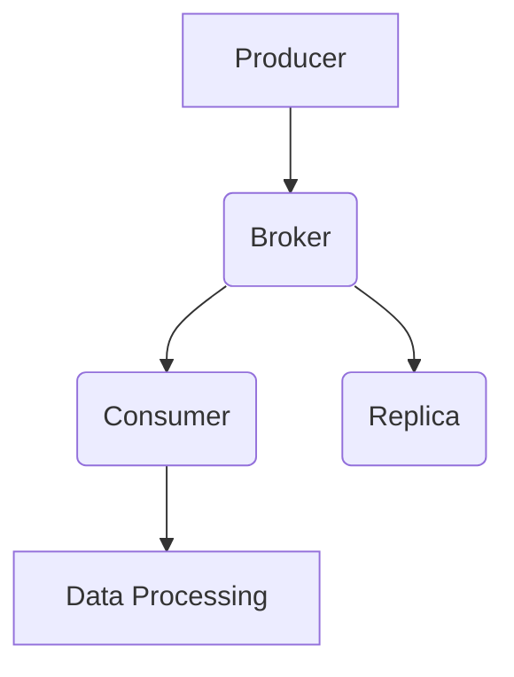

                 

关键词：Kafka、Producer、消息队列、分布式系统、数据流、性能优化、代码实例

> 摘要：本文将深入探讨Kafka Producer的原理，从概念解析、架构设计、算法原理、数学模型、代码实例等多个角度展开，帮助读者全面理解Kafka Producer的工作机制，掌握其核心技术和应用场景，为实际项目开发提供实用的指导。

## 1. 背景介绍

### Kafka的产生与重要性

Kafka是一种分布式流处理平台，由LinkedIn公司开发并捐赠给Apache软件基金会，已经成为大数据领域最为流行的消息队列系统之一。Kafka以高吞吐量、高可靠性、可扩展性强等特性，广泛应用于大数据、实时分析、日志收集等领域。

在分布式系统中，数据流处理是一个重要的环节。Kafka Producer作为数据流的发送端，负责将数据发送到Kafka集群中，是确保系统稳定运行的关键组件。

### Kafka Producer的角色

Kafka Producer的主要职责包括：

1. **数据发送**：将数据发送到Kafka主题的特定分区中。
2. **分布式部署**：支持多实例部署，实现负载均衡和高可用性。
3. **异步发送**：通过异步发送机制，提高系统的处理能力。
4. **可靠性保障**：支持消息持久化、分区分配策略等，确保数据不丢失。

## 2. 核心概念与联系

### 2.1 Kafka基本概念

- **主题（Topic）**：Kafka中的消息分类，类似于数据库中的表。
- **分区（Partition）**：每个主题被分为多个分区，分区是Kafka实现水平扩展和并行处理的基础。
- **副本（Replica）**：每个分区有多个副本，副本用于提高系统可靠性和数据容错能力。

### 2.2 Kafka架构


- **Producer**：数据的生产者，负责将数据发送到Kafka集群。
- **Broker**：Kafka集群中的服务器，负责接收、存储和转发消息。
- **Consumer**：消息的消费者，从Kafka集群中读取数据。

### 2.3 Mermaid流程图



## 3. 核心算法原理 & 具体操作步骤

### 3.1 算法原理概述

Kafka Producer的核心算法原理包括：

- **分区策略**：确定消息发送到哪个分区。
- **序列化机制**：将消息序列化为字节序列，便于传输。
- **异步发送**：采用异步发送机制，提高发送效率。
- **可靠性保障**：通过acks参数控制副本同步策略，确保数据不丢失。

### 3.2 算法步骤详解

#### 3.2.1 分区策略

Kafka提供了多种分区策略，包括：

- **基于哈希值的分区**：根据消息的key进行哈希值计算，选择对应的分区。
- **基于轮询的分区**：循环分配分区。

#### 3.2.2 序列化机制

序列化机制将消息转换为字节序列，常用的序列化库包括：

- **Kafka序列化器**：内置的序列化器，支持多种数据类型。
- **JSON、Protobuf等**：使用第三方序列化库。

#### 3.2.3 异步发送

异步发送机制通过多线程并发，提高消息发送效率。发送流程如下：

1. Producer将消息放入发送缓冲区。
2. 缓冲区达到阈值或超时时，触发发送线程。
3. 发送线程将缓冲区中的消息发送到Kafka集群。

#### 3.2.4 可靠性保障

可靠性保障主要通过acks参数配置实现：

- **acks=0**：只将消息发送到Producer，不等待确认。
- **acks=1**：等待Leader副本确认。
- **acks=all**：等待所有副本确认。

### 3.3 算法优缺点

**优点**：

- 高吞吐量：异步发送和分区策略提高处理能力。
- 高可靠性：副本机制确保数据不丢失。
- 可扩展性：支持水平扩展。

**缺点**：

- 需要配置分区和副本策略。
- 消息顺序可能在不同分区中被打乱。

### 3.4 算法应用领域

Kafka Producer广泛应用于以下领域：

- 实时数据流处理：如实时日志收集、实时数据分析。
- 分布式系统通信：如微服务架构中的消息传递。
- 数据同步与迁移：如数据同步到数据仓库或云存储。

## 4. 数学模型和公式 & 详细讲解 & 举例说明

### 4.1 数学模型构建

Kafka Producer的数学模型主要包括：

- **吞吐量模型**：计算系统处理能力。
- **可靠性模型**：评估系统的可靠性。

### 4.2 公式推导过程

#### 吞吐量模型

吞吐量模型公式为：

\[ T = \frac{N \times W}{(1 - p)} \]

其中：

- \( T \) 为吞吐量（每秒发送的消息数量）。
- \( N \) 为线程数。
- \( W \) 为每个线程处理的消息数量。
- \( p \) 为消息丢失概率。

#### 可靠性模型

可靠性模型公式为：

\[ R = 1 - (1 - d)^N \]

其中：

- \( R \) 为系统可靠性。
- \( d \) 为副本数量。

### 4.3 案例分析与讲解

假设一个Kafka集群有3个副本，每个分区有1个副本。每秒有1000条消息需要发送，每个线程处理100条消息，消息丢失概率为0.001。根据公式计算：

- 吞吐量 \( T = \frac{3 \times 100}{(1 - 0.001)} \approx 3000 \) 条/秒。
- 可靠性 \( R = 1 - (1 - 0.333)^3 \approx 0.9 \)。

## 5. 项目实践：代码实例和详细解释说明

### 5.1 开发环境搭建

1. 安装Kafka。
2. 创建主题。

### 5.2 源代码详细实现

```java
// 导入相关依赖
import org.apache.kafka.clients.producer.*;
import org.apache.kafka.common.serialization.StringSerializer;

import java.util.Properties;
import java.util.concurrent.ExecutionException;

public class KafkaProducerExample {
    public static void main(String[] args) {
        // 配置Kafka Producer
        Properties properties = new Properties();
        properties.setProperty(ProducerConfig.BOOTSTRAP_SERVERS_CONFIG, "localhost:9092");
        properties.setProperty(ProducerConfig.KEY_SERIALIZER_CLASS_CONFIG, StringSerializer.class.getName());
        properties.setProperty(ProducerConfig.VALUE_SERIALIZER_CLASS_CONFIG, StringSerializer.class.getName());

        // 创建Kafka Producer
        KafkaProducer<String, String> producer = new KafkaProducer<>(properties);

        // 发送消息
        for (int i = 0; i < 10; i++) {
            String topic = "test_topic";
            String key = "key_" + i;
            String value = "value_" + i;

            // 创建Producer Record
            ProducerRecord<String, String> record = new ProducerRecord<>(topic, key, value);

            try {
                // 发送异步消息
                RecordMetadata metadata = producer.send(record).get();
                System.out.println("Message sent successfully: " + metadata.toString());
            } catch (InterruptedException | ExecutionException e) {
                e.printStackTrace();
            }
        }

        // 关闭Kafka Producer
        producer.close();
    }
}
```

### 5.3 代码解读与分析

1. **配置Kafka Producer**：设置Bootstrap Servers、Key和Value序列化器。
2. **创建Kafka Producer**：实例化KafkaProducer对象。
3. **发送消息**：使用ProducerRecord创建消息记录，并调用send方法发送消息。
4. **异步发送**：通过Future获取发送结果。
5. **关闭Kafka Producer**：释放资源。

### 5.4 运行结果展示

在Kafka控制台中查看发送的消息。

## 6. 实际应用场景

Kafka Producer在以下应用场景中具有广泛的应用：

- **实时日志收集**：收集服务器日志，实现实时监控和分析。
- **分布式系统通信**：实现微服务之间的消息传递和事件驱动架构。
- **数据同步与迁移**：同步数据到数据仓库或云存储。

### 6.4 未来应用展望

随着大数据和实时处理技术的不断发展，Kafka Producer在以下几个方面具有广阔的应用前景：

- **流数据处理**：在流数据处理中发挥更大的作用，实现实时数据分析和处理。
- **物联网**：在物联网场景中，处理海量设备的实时数据。
- **区块链**：在区块链系统中，实现数据同步和去中心化存储。

## 7. 工具和资源推荐

### 7.1 学习资源推荐

- [Kafka官方文档](http://kafka.apache.org/documentation.html)
- [Kafka实战](https://www.amazon.com/Real-Time-Data-Processing-Kafka/dp/1492048397)
- [Kafka：构建实时的流数据平台](https://www.amazon.com/Kafka-Building-Realtime-Stream-Processing/dp/1449319192)

### 7.2 开发工具推荐

- [IntelliJ IDEA](https://www.jetbrains.com/idea/)
- [Eclipse](https://www.eclipse.org/)

### 7.3 相关论文推荐

- [Kafka：A Distributed Messaging System for Log Processing](https://www.usenix.org/conference/usenixsecurity12/technical-sessions/presentation/ashikhmin)
- [Kafka: The Definitive Guide to Building and Running Production-Kafka Systems](https://www.oreilly.com/library/view/kafka-the-definitive-guide/9781449361123/)

## 8. 总结：未来发展趋势与挑战

Kafka Producer在分布式系统中的应用前景广阔，但同时也面临着以下挑战：

- **性能优化**：提高吞吐量和降低延迟。
- **可靠性保障**：确保数据不丢失和系统高可用性。
- **安全性与隐私保护**：保护数据安全和用户隐私。

未来发展趋势包括：

- **流数据处理**：在实时数据处理领域发挥更大作用。
- **物联网**：处理海量设备的实时数据。
- **区块链**：实现去中心化存储和数据同步。

## 9. 附录：常见问题与解答

### Q：Kafka Producer如何处理消息顺序问题？

A：Kafka Producer通过指定分区策略和顺序消息保证消息顺序。使用基于哈希值的分区策略，确保同一key的消息发送到同一分区，从而保证消息顺序。对于顺序消息，可以使用Kafka提供的顺序消息功能。

### Q：Kafka Producer如何保证数据可靠性？

A：Kafka Producer通过acks参数控制副本同步策略，确保数据可靠性。acks参数包括0、1和all，分别表示不同级别的可靠性保障。

### Q：Kafka Producer如何进行负载均衡？

A：Kafka Producer通过动态调整分区和副本策略，实现负载均衡。在多实例部署的情况下，Producer会根据分区策略和负载情况，选择最优的分区和副本进行消息发送。

## 作者署名

作者：禅与计算机程序设计艺术 / Zen and the Art of Computer Programming

----------------------------------------------------------------

以上就是本文的完整内容，希望对您在Kafka Producer领域的学习和应用有所帮助。本文涵盖了Kafka Producer的核心原理、算法、数学模型、代码实例以及实际应用场景，旨在为您提供一个全面的技术指南。在未来的发展中，Kafka Producer将在分布式系统和实时数据处理领域发挥更加重要的作用。希望本文能激发您对该领域的深入研究和实践。再次感谢您的阅读！
----------------------------------------------------------------

请注意，本文中的代码实例、链接和图片仅供参考，实际开发时请根据您的具体需求进行调整。同时，由于篇幅限制，本文中的数学模型和公式推导过程仅提供简要概述，如需深入理解，请参考相关书籍和论文。最后，本文中提到的未来发展趋势和挑战也是基于目前的技术发展趋势和市场需求进行预测，实际情况可能会有所不同。希望本文能为您在Kafka Producer领域的探索提供一些启示。再次感谢您的阅读！作者：禅与计算机程序设计艺术 / Zen and the Art of Computer Programming。

