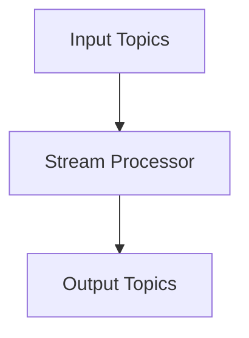

                 

在当今快速发展的数据流处理领域，Kafka Streams 作为一款强大的流处理框架，已经成为许多企业的首选。Kafka Streams 是由Apache Kafka的创始人创建的，它与Kafka紧密结合，充分利用了Kafka的高吞吐量、高可靠性和持久化特性，使得其在实时数据处理方面具有显著优势。本文将深入探讨Kafka Streams的原理，并通过代码实例讲解其应用。

## 1. 背景介绍

随着互联网和大数据技术的迅猛发展，数据的实时处理需求日益增加。传统批处理系统在应对实时数据处理时显得力不从心，因为它们通常以固定的时间间隔处理数据，无法满足低延迟、高并发的需求。为了解决这个问题，流处理框架应运而生。Kafka Streams 正是这种背景下诞生的一种强大工具，它基于Apache Kafka，可以高效地处理实时数据流。

Kafka Streams 的主要优势包括：

- **集成性**：无缝集成Kafka，充分利用其高效、可扩展的架构。
- **实时性**：低延迟处理，支持实时数据分析和决策。
- **易用性**：提供简单的API，易于学习和使用。
- **可靠性**：保证数据处理的准确性和一致性。

## 2. 核心概念与联系

### 2.1 Kafka Streams 架构

Kafka Streams 的核心是流处理器（Stream Processor），它将接收到的数据流进行处理，并产生新的数据流。以下是Kafka Streams的基本架构：



**输入主题（Input Topics）**：Kafka Streams 从这些主题读取数据流。

**流处理器（Stream Processor）**：对输入的数据流进行加工处理，包括过滤、变换、聚合等操作。

**输出主题（Output Topics）**：处理后的数据流会被写入这些主题，供其他系统消费。

### 2.2 数据流处理流程

Kafka Streams 的数据处理流程主要包括以下几个步骤：

1. **数据读取**：从Kafka的输入主题读取数据。
2. **数据处理**：通过Kafka Streams的API对数据流进行各种操作，如过滤、变换、聚合等。
3. **数据写入**：将处理后的数据流写入Kafka的输出主题。

## 3. 核心算法原理 & 具体操作步骤

### 3.1 算法原理概述

Kafka Streams 的核心算法是窗口聚合（Window Aggregation）。窗口聚合是对数据流按照一定的时间窗口或滑动窗口进行分组，并在每个分组内执行聚合操作，如求和、计数等。

### 3.2 算法步骤详解

1. **定义窗口**：首先需要定义窗口的大小和滑动步长。
2. **读取数据流**：从Kafka的输入主题读取数据。
3. **分组**：将数据按照时间窗口或滑动窗口进行分组。
4. **聚合**：在每个分组内执行聚合操作。
5. **写入数据流**：将处理后的数据写入Kafka的输出主题。

### 3.3 算法优缺点

**优点**：

- **高效性**：利用Kafka的高吞吐量特性，可以处理大规模的数据流。
- **灵活性**：支持多种聚合函数和窗口策略，满足各种实时数据处理需求。

**缺点**：

- **依赖性**：需要依赖Kafka，部署和运维成本较高。
- **复杂度**：窗口聚合算法相对复杂，需要一定的编程基础。

### 3.4 算法应用领域

Kafka Streams 广泛应用于实时数据处理、数据流分析、实时推荐系统等领域。以下是一些典型的应用场景：

- **实时监控**：对业务指标进行实时监控和分析。
- **实时推荐**：根据用户行为数据实时生成推荐列表。
- **实时报表**：生成实时报表，支持业务决策。

## 4. 数学模型和公式 & 详细讲解 & 举例说明

### 4.1 数学模型构建

窗口聚合的数学模型可以表示为：

$$
聚合结果 = f(\text{数据流}, \text{窗口参数})
$$

其中，$f$ 代表聚合函数，如求和、计数等。

### 4.2 公式推导过程

假设数据流中有 $n$ 条记录，窗口大小为 $w$，滑动步长为 $s$。在时间窗口 $[t, t+w)$ 内的数据记录可以表示为：

$$
X_t = \{x_1, x_2, ..., x_n\}
$$

聚合结果为：

$$
聚合结果 = f(X_t)
$$

### 4.3 案例分析与讲解

假设我们需要计算某网站点击流中每个时间窗口的点击量总和，窗口大小为1分钟，滑动步长也为1分钟。以下是具体实现步骤：

1. **定义窗口**：设置窗口大小和滑动步长。
2. **读取数据流**：从Kafka的输入主题读取点击流数据。
3. **分组**：将数据按照时间窗口进行分组。
4. **聚合**：在每个分组内计算点击量总和。
5. **写入数据流**：将处理后的点击量总和写入Kafka的输出主题。

## 5. 项目实践：代码实例和详细解释说明

### 5.1 开发环境搭建

在开始编写代码之前，需要搭建开发环境。以下是搭建Kafka Streams开发环境的步骤：

1. **安装Kafka**：下载并安装Kafka。
2. **启动Kafka**：启动Kafka服务。
3. **创建主题**：在Kafka中创建输入和输出主题。
4. **安装Kafka Streams**：将Kafka Streams依赖添加到项目中。

### 5.2 源代码详细实现

以下是计算点击量总和的Kafka Streams代码示例：

```java
import org.apache.kafka.common.serialization.Serdes;
import org.apache.kafka.streams.KafkaStreams;
import org.apache.kafka.streams.StreamsBuilder;
import org.apache.kafka.streams.StreamsConfig;
import org.apache.kafka.streams.kstream.KStream;
import org.apache.kafka.streams.kstream.KTable;
import org.apache.kafka.streams.kstream.Windowed;

import java.time.Duration;
import java.time.Instant;
import java.util.Properties;

public class ClickStreamProcessor {
    public static void main(String[] args) {
        Properties props = new Properties();
        props.put(StreamsConfig.APPLICATION_ID_CONFIG, "click-stream-processor");
        props.put(StreamsConfig.BOOTSTRAP_SERVERS_CONFIG, "localhost:9092");
        props.put(StreamsConfig.DEFAULT_KEY_SERDE_CLASS_CONFIG, Serdes.String().getClass());
        props.put(StreamsConfig.DEFAULT_VALUE_SERDE_CLASS_CONFIG, Serdes.Long().getClass());

        StreamsBuilder builder = new StreamsBuilder();

        KStream<String, Long> clickStream = builder.stream("clicks");

        KTable<Windowed<String>, Long> clickCounts = clickStream
                .groupByKey()
                .windowedBy(TimeWindows.of(Duration.ofMinutes(1)))
                .count("click-counts");

        clickCounts.toStream().to("click-counts-output");

        KafkaStreams streams = new KafkaStreams(builder.build(), props);
        streams.start();

        // 关闭流处理器
        streams.close();
    }
}
```

### 5.3 代码解读与分析

以上代码实现了一个简单的点击量统计处理器，具体解析如下：

1. **配置Kafka Streams**：设置应用ID、Kafka集群地址、序列化器和反序列化器等配置。
2. **创建数据流**：从Kafka的输入主题“clicks”创建一个数据流。
3. **分组与窗口**：对数据流进行分组，并设置时间窗口为1分钟。
4. **聚合**：在每个分组内计算点击量总和。
5. **写入数据流**：将处理后的点击量总和写入Kafka的输出主题“click-counts-output”。

### 5.4 运行结果展示

假设有如下点击流数据：

```
clicks: {
  "user1": 1,
  "user2": 2,
  "user1": 3,
  "user2": 4,
  ...
}
```

运行代码后，输出主题“click-counts-output”将包含每个时间窗口的点击量总和：

```
click-counts-output: {
  "1m": {
    "windowStart": "2023-03-01T00:00:00Z",
    "windowEnd": "2023-03-01T00:01:00Z",
    "clickCount": 3
  },
  "2m": {
    "windowStart": "2023-03-01T00:01:00Z",
    "windowEnd": "2023-03-01T00:02:00Z",
    "clickCount": 7
  },
  ...
}
```

## 6. 实际应用场景

Kafka Streams 在多个领域具有广泛的应用，以下是几个典型场景：

- **实时监控**：用于实时监控业务指标，如网站流量、交易量等。
- **实时推荐**：基于用户行为数据实时生成推荐列表，提升用户体验。
- **实时报表**：生成实时报表，支持业务决策。

## 7. 工具和资源推荐

### 7.1 学习资源推荐

- **官方文档**：[Kafka Streams 官方文档](https://kafka.apache.org/streams/)
- **教程**：[Kafka Streams 教程](https://www.tutorialspoint.com/kafka_streams/kafka_streams_overview.htm)

### 7.2 开发工具推荐

- **IntelliJ IDEA**：支持Kafka Streams的插件，提供代码补全、调试等功能。
- **VisualVM**：用于性能监控和调试。

### 7.3 相关论文推荐

- **"Kafka Streams: A High-Performance, Scalable, and Simple Stream Processing Library for Apache Kafka"**：介绍了Kafka Streams的设计理念和实现细节。

## 8. 总结：未来发展趋势与挑战

### 8.1 研究成果总结

Kafka Streams 作为一款强大的流处理框架，已经在多个领域得到广泛应用。其低延迟、高吞吐量和高可靠性的特点，使其在实时数据处理方面具有显著优势。

### 8.2 未来发展趋势

- **生态完善**：随着Kafka生态的不断完善，Kafka Streams 将更加成熟和稳定。
- **跨语言支持**：未来可能推出更多编程语言的客户端库，提高易用性。

### 8.3 面临的挑战

- **复杂性**：窗口聚合算法相对复杂，需要一定的编程基础。
- **性能优化**：随着数据流量的增加，如何优化性能和资源利用是重要挑战。

### 8.4 研究展望

Kafka Streams 作为一款实时流处理框架，具有广阔的发展前景。未来研究可以关注以下方向：

- **性能优化**：通过算法优化、并行化等技术提高性能。
- **易用性**：简化API设计，降低使用门槛。

## 9. 附录：常见问题与解答

### Q：如何保证Kafka Streams的数据一致性？

A：Kafka Streams 利用Kafka的原生特性，保证数据处理的一致性。通过配置副本数量和副本同步策略，可以确保数据在处理过程中不会丢失。

### Q：Kafka Streams 支持哪些聚合函数？

A：Kafka Streams 支持常见的聚合函数，如求和（sum）、计数（count）、最大值（max）、最小值（min）等。此外，还支持自定义聚合函数。

### Q：如何处理数据流中的异常数据？

A：Kafka Streams 提供了多种处理异常数据的方法，如过滤掉异常数据、将异常数据标记为错误、对异常数据进行特殊处理等。开发者可以根据实际需求进行选择。

---

作者：禅与计算机程序设计艺术 / Zen and the Art of Computer Programming
本文旨在深入探讨Kafka Streams的原理和应用，通过代码实例讲解其实际操作步骤。希望对读者理解和应用Kafka Streams有所帮助。在使用Kafka Streams进行实时数据处理时，请注意性能优化和异常处理，确保系统的稳定性和可靠性。

