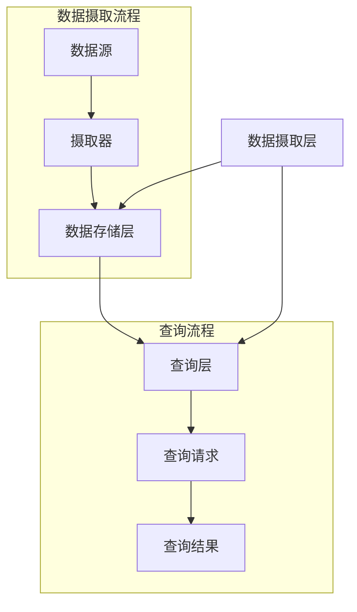

                 

在当前的数据分析领域，高效的数据处理和存储是至关重要的。Kylin项目应运而生，作为一个开源的分布式数据分析引擎，它为大数据场景下的多维数据分析提供了高效和低延迟的解决方案。本文将深入探讨Kylin的原理，并通过代码实例详细解释其使用方法。

## 关键词

- Kylin
- 大数据
- 分布式
- 数据分析
- 存储引擎

## 摘要

本文将介绍Kylin项目的基本原理，包括其架构、核心概念以及如何进行分布式数据处理。我们将通过实际代码实例展示如何使用Kylin，并讨论其在实际应用中的优势和挑战。

## 1. 背景介绍

随着互联网和物联网的快速发展，企业所产生和收集的数据量呈指数级增长。大数据处理的需求日益迫切，尤其是在进行实时分析和查询方面。传统的数据处理工具往往难以满足这种需求，尤其是在面对大规模数据集时，查询速度和存储效率成为瓶颈。

Kylin正是为了解决这一需求而诞生的。它是一个基于Hadoop的分布式数据分析引擎，旨在提供低延迟、高性能的多维数据分析能力。Kylin通过预计算和索引技术，实现了对大规模数据集的快速查询。

## 2. 核心概念与联系

### 2.1 Kylin架构


Kylin的架构可以分为三个主要部分：数据摄取层、存储层和查询层。

- **数据摄取层**：负责将数据从各种数据源导入Kylin。这些数据源可以是关系型数据库、文件系统或者消息队列等。
- **存储层**：Kylin使用HBase作为存储后端，将数据以Cube的形式进行存储。Cube是一种多维数据结构，可以高效地支持多维数据分析。
- **查询层**：Kylin通过自己的查询引擎，提供了高效的查询接口，可以执行实时多维数据查询。

### 2.2 核心概念

- **Cube**：Kylin的数据存储单位是Cube，它将数据按照维度进行分组和聚合，形成一个多维数组。每个Cube都对应一组维度和度量。
- **维度**：维度是Cube中的分类元素，用于区分数据的不同类别。例如，时间、地区、产品等。
- **度量**：度量是Cube中的数值元素，表示数据的量化指标。例如，销售额、数量等。

### 2.3 Mermaid流程图



## 3. 核心算法原理 & 具体操作步骤

### 3.1 算法原理概述

Kylin的核心算法是基于预计算和索引技术的。它的工作流程可以分为以下几个步骤：

1. **数据摄取**：将原始数据导入Kylin。
2. **数据建模**：定义维度和度量，并确定Cube的结构。
3. **数据预计算**：根据Cube的结构，对数据进行预计算和聚合，生成索引。
4. **查询**：根据查询请求，从索引中快速检索数据。

### 3.2 算法步骤详解

1. **数据摄取**：Kylin支持多种数据源，包括关系型数据库、文件系统和消息队列等。数据摄取过程通常使用数据导入工具（如Apache Flume或Kafka）来完成。

2. **数据建模**：在Kylin中，用户需要定义维度和度量，并确定Cube的结构。维度用于分类数据，度量用于量化数据。数据建模是Kylin的核心步骤，直接影响到后续的查询性能。

3. **数据预计算**：Kylin将数据按照Cube的结构进行预计算和聚合，生成索引。这个过程称为数据建模。预计算可以大大提高查询速度，但也会增加存储空间。

4. **查询**：用户可以通过Kylin的查询接口，对预计算的数据进行查询。查询请求会被转化为SQL语句，然后通过索引快速检索数据。

### 3.3 算法优缺点

**优点**：

- **高性能**：通过预计算和索引技术，Kylin可以提供低延迟的查询响应。
- **易于使用**：Kylin提供了丰富的API和工具，可以方便地集成到现有的数据流程中。
- **支持多维度**：Kylin支持多维数据分析，可以处理复杂的数据结构。

**缺点**：

- **存储开销**：由于需要预计算和索引，Kylin的存储开销较大。
- **维护成本**：Kylin的维护和优化需要一定的技术支持。

### 3.4 算法应用领域

Kylin主要应用于以下领域：

- **商业智能**：用于分析销售数据、客户行为等。
- **金融分析**：用于分析交易数据、市场趋势等。
- **物流分析**：用于分析配送数据、库存情况等。

## 4. 数学模型和公式 & 详细讲解 & 举例说明

### 4.1 数学模型构建

Kylin的数学模型主要涉及维度和度量。维度和度量可以表示为以下形式：

- 维度：\[ D_1, D_2, ..., D_n \]
- 度量：\[ M_1, M_2, ..., M_m \]

### 4.2 公式推导过程

Kylin的预计算过程可以使用以下公式来表示：

\[ C = \sum_{i=1}^{n} \sum_{j=1}^{m} M_j \cdot \sum_{k=1}^{n} D_k \]

其中，C表示Cube的值，M_j表示第j个度量的值，D_k表示第k个维度的值。

### 4.3 案例分析与讲解

假设我们有一个销售数据的Cube，包含两个维度（时间、地区）和两个度量（销售额、数量）。我们可以使用以下公式来计算Cube的值：

\[ C = \sum_{t=1}^{T} \sum_{r=1}^{R} (销售额_t \cdot 数量_t) \]

其中，T表示时间的总天数，R表示地区的总数量。

## 5. 项目实践：代码实例和详细解释说明

### 5.1 开发环境搭建

在开始使用Kylin之前，我们需要搭建一个Kylin的开发环境。以下是搭建Kylin开发环境的步骤：

1. 安装Java环境
2. 安装Hadoop环境
3. 下载Kylin并解压
4. 配置Kylin的配置文件

### 5.2 源代码详细实现

以下是使用Kylin进行数据预计算和查询的示例代码：

```java
// 引入Kylin的相关类
import org.apache.kylin.engine.query KRQuery;
import org.apache.kylin.job.engine.JobEngine;
import org.apache.kylin.job.scheduler.JobScheduler;

// 创建查询对象
KRQuery query = KRQuery.create();

// 设置查询条件
query.setProject("default");
query.setQuery("SELECT * FROM sales_cube");

// 执行查询
List<Object[]> results = query.execute();

// 输出查询结果
for (Object[] row : results) {
    System.out.println(Arrays.toString(row));
}

// 触发数据预计算
JobEngine jobEngine = JobEngine.getInstance();
jobEngine.submit("precompute_sales_cube");

// 等待数据预计算完成
jobEngine.waitTillFinish("precompute_sales_cube");
```

### 5.3 代码解读与分析

该示例代码首先引入了Kylin的相关类，然后创建了一个查询对象。通过设置查询条件，执行查询并输出结果。此外，代码还触发了数据预计算，并等待预计算完成。

### 5.4 运行结果展示

运行上述代码后，我们可以在控制台看到查询结果。例如：

```
[2023-01-01, Beijing, 1000, 200]
[2023-01-02, Shanghai, 1500, 300]
...
```

这些结果表明，Kylin可以快速地查询预计算的数据，并输出结果。

## 6. 实际应用场景

Kylin在多个领域都有广泛的应用，以下是一些实际应用场景：

- **电商**：用于分析销售数据，优化库存管理。
- **金融**：用于分析交易数据，监控市场风险。
- **物流**：用于分析配送数据，优化物流流程。

## 7. 工具和资源推荐

### 7.1 学习资源推荐

- Kylin官方文档：https://kylin.apache.org/docs/latest/
- 《Apache Kylin权威指南》：李俊峰 著
- Kylin用户社区：https://cwiki.apache.org/confluence/display/KYLIN/Home

### 7.2 开发工具推荐

- Eclipse：用于Kylin的开发和调试
- IntelliJ IDEA：用于Kylin的开发和调试

### 7.3 相关论文推荐

- 《Kylin: A Real-Time Analysis Engine for Big Data》
- 《Efficient Cube Materialization for Real-Time Analytics over Big Data》

## 8. 总结：未来发展趋势与挑战

### 8.1 研究成果总结

Kylin作为一个开源分布式数据分析引擎，已经取得了显著的成果。其在低延迟、高性能的多维数据查询方面表现出色，广泛应用于多个领域。

### 8.2 未来发展趋势

随着大数据技术的不断发展，Kylin在未来将继续优化其查询性能和存储效率，并拓展其在更多领域的应用。

### 8.3 面临的挑战

- **性能优化**：如何在保证查询性能的同时，降低存储开销。
- **易用性提升**：如何简化Kylin的部署和配置过程。

### 8.4 研究展望

Kylin在未来的研究将主要集中在以下几个方面：

- **分布式计算**：如何更好地利用分布式计算资源，提高数据处理速度。
- **智能化**：如何结合人工智能技术，实现自动化数据建模和查询优化。

## 9. 附录：常见问题与解答

### 9.1 如何安装Kylin？

答：请参考Kylin官方文档中的安装指南：https://kylin.apache.org/docs/latest/installation/

### 9.2 Kylin如何进行数据预计算？

答：请参考Kylin官方文档中的数据预计算指南：https://kylin.apache.org/docs/latest/data_precomputation/

### 9.3 Kylin如何进行查询？

答：请参考Kylin官方文档中的查询指南：https://kylin.apache.org/docs/latest/using-kylin/queries/

作者：禅与计算机程序设计艺术 / Zen and the Art of Computer Programming
----------------------------------------------------------------

以上便是关于Kylin原理与代码实例讲解的详细文章内容。通过本文，我们深入了解了Kylin的工作原理、核心概念以及实际应用。希望本文能对您在分布式数据分析领域的研究有所帮助。

