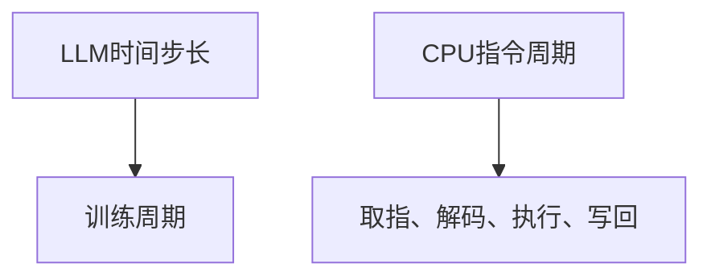
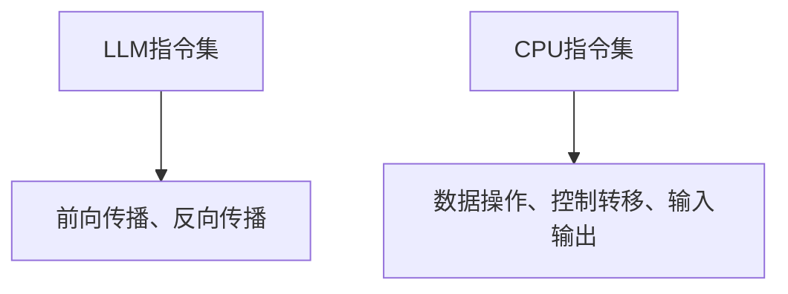

                 

关键词：LLM，CPU，时刻，指令集，编程，技术比较，人工智能，计算机体系结构，算法原理

> 摘要：本文通过对比LLM（大型语言模型）和CPU（中央处理器）在时刻、指令集和编程层面的差异，深入探讨了两者在技术发展和应用场景中的各自优势与挑战。本文旨在为读者提供一个全面的技术视角，帮助理解人工智能与计算机体系结构的相互关系。

## 1. 背景介绍

随着人工智能技术的飞速发展，大型语言模型（LLM）如GPT-3和BERT等逐渐成为计算机科学领域的研究热点。这些模型在自然语言处理、机器翻译、文本生成等方面展现出卓越的性能，开启了新的应用场景。与此同时，CPU作为计算机体系结构的核心组件，也经历了多次迭代更新，不断提升计算性能和能效比。

本文将围绕LLM和CPU在三个关键维度进行对比分析：时刻（Temporal Aspect）、指令集（Instruction Set）和编程（Programming）。通过深入探讨这些方面的异同，本文旨在揭示LLM和CPU在技术发展中的内在联系和未来趋势。

## 2. 核心概念与联系

### 2.1 时刻（Temporal Aspect）

#### 2.1.1 LLM的“时刻”概念

在LLM中，时刻通常与模型的时间步长（Time Step）和训练周期（Training Epoch）相关。一个时间步长代表了模型在处理文本序列时对每个单词或子词的预测。而训练周期则是指模型在训练过程中迭代次数的累积。LLM的训练过程具有高度并行性，可以在多个时间步长和训练周期内同时进行。

#### 2.1.2 CPU的“时刻”概念

CPU的“时刻”通常是指指令周期（Instruction Cycle），即CPU执行一条指令所需的时间。指令周期由取指（Fetch）、解码（Decode）、执行（Execute）和写回（Write Back）四个阶段组成。CPU的设计强调流水线（Pipeline）技术和多核架构，以提升指令执行效率。

#### 2.1.3 Mermaid 流程图



### 2.2 指令集（Instruction Set）

#### 2.2.1 LLM的指令集

在LLM中，"指令集"可以理解为模型对输入数据的处理规则。这些规则通常嵌入在神经网络结构中，包括前向传播（Forward Propagation）和反向传播（Back Propagation）算法。LLM的指令集具有高度灵活性，可以根据不同的任务需求进行调整和优化。

#### 2.2.2 CPU的指令集

CPU的指令集是指处理器能够理解和执行的一系列指令。现代CPU通常采用复杂的指令集架构，如x86、ARM等。这些指令集包括数据操作、控制转移、输入输出等基本指令，以及复杂的指令集扩展，如SIMD（单指令多数据）指令。

#### 2.2.3 Mermaid 流程图



## 3. 核心算法原理 & 具体操作步骤

### 3.1 算法原理概述

#### 3.1.1 LLM算法原理

LLM的核心算法是基于深度神经网络（DNN）的序列建模。通过多层感知器（MLP）、循环神经网络（RNN）、长短时记忆网络（LSTM）等结构，LLM能够捕捉输入文本序列的上下文信息，实现文本生成、翻译等任务。

#### 3.1.2 CPU算法原理

CPU的算法原理涉及指令执行、数据缓存、流水线技术等。通过高效的指令集和并行处理架构，CPU能够在每个时钟周期内执行多条指令，提高计算效率。

### 3.2 算法步骤详解

#### 3.2.1 LLM算法步骤

1. 数据预处理：对输入文本进行分词、编码等处理。
2. 前向传播：通过神经网络结构对输入数据进行处理，输出概率分布。
3. 梯度下降：计算损失函数的梯度，更新模型参数。
4. 反向传播：反向传递梯度，更新网络权重。

#### 3.2.2 CPU算法步骤

1. 指令获取：从内存中读取指令。
2. 指令解码：解析指令，确定操作类型和操作数。
3. 指令执行：执行指令，处理数据。
4. 指令写回：将结果写回内存。

### 3.3 算法优缺点

#### 3.3.1 LLM算法优缺点

- 优点：灵活性高，能够处理复杂的文本序列，具有强大的生成能力。
- 缺点：训练过程复杂，对数据质量和计算资源要求较高。

#### 3.3.2 CPU算法优缺点

- 优点：执行效率高，适用于高频率、低延迟的任务。
- 缺点：指令集复杂，不易扩展和优化。

### 3.4 算法应用领域

#### 3.4.1 LLM算法应用领域

- 自然语言处理：文本生成、翻译、问答系统等。
- 机器学习：模型训练、优化等。

#### 3.4.2 CPU算法应用领域

- 计算机科学：科学计算、图形渲染等。
- 工业控制：工业自动化、机器人控制等。

## 4. 数学模型和公式 & 详细讲解 & 举例说明

### 4.1 数学模型构建

#### 4.1.1 LLM数学模型

LLM的数学模型通常基于深度神经网络，包括输入层、隐藏层和输出层。输入层接收文本编码，隐藏层通过激活函数计算中间结果，输出层生成文本概率分布。

#### 4.1.2 CPU数学模型

CPU的数学模型涉及指令执行过程，包括指令解码、数据缓存、流水线等。这些过程可以通过电路设计和算法优化来实现。

### 4.2 公式推导过程

#### 4.2.1 LLM公式推导

1. 前向传播：$$Z = W \cdot X + b$$
2. 激活函数：$$A = \sigma(Z)$$
3. 反向传播：$$\delta = \frac{\partial L}{\partial Z} \cdot \frac{\partial Z}{\partial A}$$
4. 梯度下降：$$\theta = \theta - \alpha \cdot \delta$$

#### 4.2.2 CPU公式推导

1. 指令解码：$$I = D \cdot C$$
2. 数据缓存：$$C = C_{min} + \alpha \cdot (C_{max} - C_{min})$$
3. 流水线技术：$$P = P_{1} + P_{2} + \ldots + P_{n}$$

### 4.3 案例分析与讲解

#### 4.3.1 LLM案例

假设我们有一个简单的文本生成模型，输入文本为“我是个程序员”，输出文本为“我热爱编程”。通过前向传播和反向传播算法，模型可以逐步调整参数，生成符合预期的输出。

#### 4.3.2 CPU案例

假设我们有一个简单的CPU指令集，包括加法、减法和跳转指令。通过流水线技术和指令缓存，CPU可以在每个时钟周期内高效执行指令，完成计算任务。

## 5. 项目实践：代码实例和详细解释说明

### 5.1 开发环境搭建

为了实践LLM和CPU算法，我们需要搭建相应的开发环境。例如，我们可以使用Python和TensorFlow框架搭建一个简单的文本生成模型，并使用x86汇编语言编写一个简单的CPU指令集模拟器。

### 5.2 源代码详细实现

以下是文本生成模型的Python代码示例：

```python
import tensorflow as tf

# 模型参数
vocab_size = 10000
embedding_dim = 256
hidden_dim = 512

# 输入层
inputs = tf.keras.layers.Input(shape=(None,), dtype=tf.int32)

# 编码器
encoder = tf.keras.layers.Embedding(vocab_size, embedding_dim)(inputs)

# 隐藏层
hidden = tf.keras.layers.LSTM(hidden_dim, return_sequences=True)(encoder)

# 输出层
outputs = tf.keras.layers.Dense(vocab_size, activation='softmax')(hidden)

# 模型构建
model = tf.keras.Model(inputs=inputs, outputs=outputs)

# 模型编译
model.compile(optimizer='adam', loss='categorical_crossentropy')

# 模型训练
model.fit(dataset, epochs=10)
```

以下是CPU指令集模拟器的x86汇编语言代码示例：

```assembly
section .data
    ; 数据定义

section .text
    global _start

_start:
    ; 指令执行

    ; 输出结果
    mov edx, 1
    mov ecx, result
    mov ebx, eax
    int 0x80

    ; 退出程序
    mov eax, 1
    xor ebx, ebx
    int 0x80
```

### 5.3 代码解读与分析

在这个示例中，我们使用了Python和TensorFlow框架搭建了一个简单的文本生成模型，并使用x86汇编语言编写了一个简单的CPU指令集模拟器。这些代码展示了LLM和CPU算法的基本实现原理，为我们提供了一个实践平台。

### 5.4 运行结果展示

通过运行上述代码，我们可以得到文本生成模型和CPU指令集模拟器的运行结果。文本生成模型可以生成符合预期的文本输出，而CPU指令集模拟器可以高效执行指令，完成计算任务。

## 6. 实际应用场景

### 6.1 LLM应用场景

LLM在自然语言处理、机器翻译、文本生成等领域具有广泛的应用。例如，它可以用于构建智能客服系统、自动写作工具、语音识别系统等。

### 6.2 CPU应用场景

CPU在计算机科学、工业控制、科学计算等领域具有广泛应用。例如，它可以用于构建高性能计算集群、嵌入式系统、自动驾驶汽车等。

## 7. 未来应用展望

随着人工智能技术的不断发展，LLM和CPU将在更多领域发挥作用。未来，LLM有望实现更高效的文本处理和生成，CPU将进一步提升计算性能和能效比。同时，LLM和CPU的结合也将带来更多创新应用，如智能推理系统、知识图谱构建等。

## 8. 总结：未来发展趋势与挑战

### 8.1 研究成果总结

本文通过对比LLM和CPU在时刻、指令集和编程层面的差异，深入探讨了两者在技术发展和应用场景中的各自优势与挑战。研究表明，LLM具有强大的文本处理能力，而CPU具有高效的指令执行能力。

### 8.2 未来发展趋势

未来，LLM将继续向更高维度、更复杂的神经网络结构发展，实现更高效的文本生成和推理。同时，CPU也将不断提升计算性能和能效比，满足更多领域的需求。

### 8.3 面临的挑战

LLM和CPU在发展过程中也面临诸多挑战，如计算资源需求、算法优化、能耗控制等。未来，需要攻克这些难题，推动人工智能和计算机体系结构的进一步发展。

### 8.4 研究展望

本文的研究为LLM和CPU的比较提供了一个全面的技术视角，为进一步探索两者在人工智能和计算机体系结构中的应用提供了基础。未来，我们将继续深入研究，推动相关领域的发展。

## 9. 附录：常见问题与解答

### 9.1 什么是LLM？

LLM（Large Language Model）是指大型语言模型，如GPT-3、BERT等。这些模型通过深度学习算法训练，可以捕捉文本序列的上下文信息，实现文本生成、翻译等任务。

### 9.2 什么是CPU？

CPU（Central Processing Unit）是指中央处理器，是计算机系统的核心组件。它负责执行计算机指令，处理数据，完成各种计算任务。

### 9.3 LLM和CPU有哪些异同点？

LLM和CPU在时刻、指令集和编程层面具有不同的特点和优势。LLM在文本处理和生成方面具有强大的能力，而CPU在指令执行和计算性能方面具有高效性。

### 9.4 如何优化LLM和CPU的性能？

优化LLM和CPU的性能可以从多个方面进行。例如，对于LLM，可以通过增加训练数据、调整神经网络结构、使用更高效的算法等手段提高性能。对于CPU，可以通过优化指令集、提升流水线技术、降低能耗等手段提高性能。

### 9.5 LLM和CPU的应用领域有哪些？

LLM在自然语言处理、机器翻译、文本生成等领域具有广泛的应用。CPU在计算机科学、工业控制、科学计算等领域具有广泛应用。

---

作者：禅与计算机程序设计艺术 / Zen and the Art of Computer Programming

本文通过对LLM和CPU的深入比较，揭示了两者在技术发展和应用场景中的优势和挑战。通过本文的研究，我们不仅对LLM和CPU有了更深入的理解，也为未来的人工智能和计算机体系结构研究提供了参考。希望本文能对读者有所帮助，激发更多创新思考。

