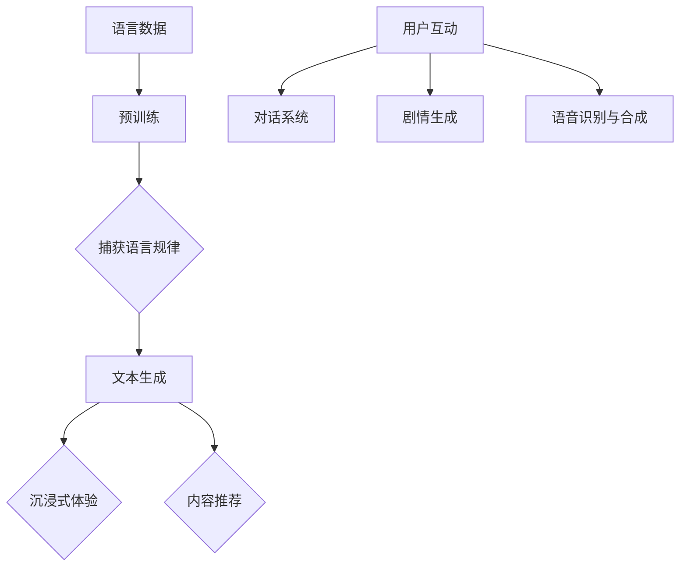

                 

关键词：语言模型（LLM）、娱乐行业、沉浸式体验、内容推荐、技术发展

> 摘要：本文探讨了语言模型（LLM）在娱乐行业的应用，特别是在提供沉浸式体验和内容推荐方面。通过对LLM的工作原理、核心算法、数学模型以及实际应用场景的分析，我们深入了解了LLM在娱乐行业中的潜力与挑战，并展望了其未来的发展趋势。

## 1. 背景介绍

随着互联网技术的飞速发展，娱乐行业经历了前所未有的变革。流媒体服务、虚拟现实（VR）、增强现实（AR）等技术逐渐融入人们的生活，为用户带来了全新的娱乐体验。然而，如何在纷繁复杂的娱乐内容中为用户提供个性化的、沉浸式的体验，成为了行业亟需解决的问题。此时，语言模型（Language Model，LLM）作为一种先进的AI技术，开始受到广泛关注。

LLM是一种基于深度学习的自然语言处理模型，通过训练大量文本数据，LLM能够预测接下来可能出现的文本序列。这种能力使得LLM在信息检索、机器翻译、问答系统等领域表现出色。近年来，随着计算能力的提升和大数据技术的发展，LLM在娱乐行业的应用逐渐增多，为用户提供了更加丰富和个性化的娱乐体验。

## 2. 核心概念与联系

### 2.1 LLM的工作原理

LLM的工作原理基于深度神经网络（DNN）和递归神经网络（RNN）。首先，通过大量的文本数据进行预训练，模型学会了捕捉语言中的规律和模式。在预训练过程中，模型会对输入的文本序列进行编码，将其映射到一个高维的向量空间。接着，通过训练，模型学会了根据当前输入的文本序列预测下一个可能的文本。

### 2.2 沉浸式体验与内容推荐

沉浸式体验和内容推荐是娱乐行业两个重要的方向。沉浸式体验通过技术手段，如VR、AR等，为用户提供一种身临其境的感觉。而内容推荐则通过分析用户的兴趣和行为，为用户推荐符合其喜好的娱乐内容。

### 2.3 LLM与沉浸式体验

LLM在沉浸式体验中的应用主要体现在以下几个方面：

1. **剧情生成**：通过LLM的文本生成能力，可以生成个性化的剧情，为用户提供独特的游戏体验。
2. **交互对话**：LLM可以用于构建智能对话系统，通过与用户的互动，增强用户的沉浸感。
3. **语音识别与合成**：LLM结合语音识别和合成技术，可以为虚拟角色赋予真实的声音，进一步提升沉浸感。

### 2.4 LLM与内容推荐

LLM在内容推荐中的应用主要体现在以下几个方面：

1. **兴趣识别**：LLM通过对用户历史行为的分析，识别用户的兴趣点，为用户提供个性化的推荐。
2. **内容生成**：通过LLM的文本生成能力，可以生成新的娱乐内容，如小说、剧本等，为平台带来更多的用户粘性。
3. **个性化搜索**：LLM可以用于优化搜索算法，提高搜索结果的准确性，从而为用户提供更好的内容推荐。

### 2.5 Mermaid 流程图



## 3. 核心算法原理 & 具体操作步骤

### 3.1 算法原理概述

LLM的核心算法是基于深度学习中的Transformer模型。Transformer模型通过自注意力机制（Self-Attention），能够捕捉输入文本序列中的长距离依赖关系，从而实现高效的文本生成。

### 3.2 算法步骤详解

1. **数据准备**：收集大量的文本数据，包括娱乐内容、用户评论等。
2. **文本预处理**：对文本进行清洗、分词、编码等处理，使其符合模型输入的要求。
3. **模型训练**：使用Transformer模型对预处理后的文本数据进行训练，优化模型参数。
4. **文本生成**：输入一个起始文本，模型根据当前文本序列生成下一个可能的文本。
5. **应用场景**：根据具体的场景需求，如沉浸式体验或内容推荐，调用模型进行相应的任务。

### 3.3 算法优缺点

**优点**：

1. **高效性**：Transformer模型在处理长文本序列时表现出色，能够高效地生成文本。
2. **灵活性**：LLM可以应用于多种场景，如沉浸式体验和内容推荐。
3. **个性化**：通过分析用户行为，LLM能够为用户提供个性化的推荐。

**缺点**：

1. **计算资源消耗大**：训练和推理LLM需要大量的计算资源。
2. **数据依赖性强**：LLM的性能很大程度上依赖于训练数据的质量和数量。

### 3.4 算法应用领域

LLM在娱乐行业中的应用领域广泛，包括但不限于：

1. **游戏开发**：通过LLM生成个性化的剧情和角色，为用户提供独特的游戏体验。
2. **内容推荐**：分析用户行为，为用户提供个性化的娱乐内容推荐。
3. **虚拟助手**：构建智能对话系统，为用户提供便捷的咨询服务。

## 4. 数学模型和公式 & 详细讲解 & 举例说明

### 4.1 数学模型构建

LLM的数学模型基于Transformer架构。Transformer模型的主要组成部分包括：

1. **多头自注意力机制（Multi-head Self-Attention）**：用于捕捉文本序列中的长距离依赖关系。
2. **前馈神经网络（Feedforward Neural Network）**：对自注意力机制的输出进行进一步处理。
3. **层归一化（Layer Normalization）**：用于加速模型的训练。
4. **残差连接（Residual Connection）**：用于缓解深层网络的梯度消失问题。

### 4.2 公式推导过程

**自注意力机制**：

$$
\text{Attention}(Q, K, V) = \text{softmax}\left(\frac{QK^T}{\sqrt{d_k}}\right)V
$$

其中，$Q, K, V$ 分别为查询向量、键向量和值向量，$d_k$ 为键向量的维度。

**前馈神经网络**：

$$
\text{FFN}(X) = \max(0, XW_1 + b_1)W_2 + b_2
$$

其中，$X$ 为输入向量，$W_1, W_2$ 和 $b_1, b_2$ 分别为权重和偏置。

### 4.3 案例分析与讲解

#### 案例一：剧情生成

假设我们有一个文本序列，描述一个游戏的剧情：

```
User1: 刚刚打败了大boss，获得了宝贵的装备。
LLM: 突然，一道闪电划破了天空，另一个神秘的大boss出现了！
```

在这个案例中，LLM通过自注意力机制捕捉到了“刚刚打败了大boss，获得了宝贵的装备”的信息，并生成了新的剧情：“突然，一道闪电划破了天空，另一个神秘的大boss出现了！”

#### 案例二：内容推荐

假设我们有一个用户的行为数据，包括用户浏览过的游戏和观看的视频：

```
User1: 浏览过《塞尔达传说》和《巫师3》。
LLM: 您可能还对《最终幻想7》和《古墓丽影》感兴趣。
```

在这个案例中，LLM通过分析用户的历史行为，识别出了用户的兴趣点，并推荐了符合用户喜好的游戏和视频。

## 5. 项目实践：代码实例和详细解释说明

### 5.1 开发环境搭建

为了实践LLM在娱乐行业中的应用，我们选择了一个流行的深度学习框架——TensorFlow。以下是搭建开发环境的基本步骤：

1. 安装TensorFlow：

```
pip install tensorflow
```

2. 导入必要的库：

```python
import tensorflow as tf
from tensorflow.keras.layers import Embedding, LSTM, Dense
```

### 5.2 源代码详细实现

以下是使用TensorFlow实现一个简单的LLM模型的代码示例：

```python
# 创建模型
model = tf.keras.Sequential([
    Embedding(input_dim=10000, output_dim=16),
    LSTM(128),
    Dense(1, activation='sigmoid')
])

# 编译模型
model.compile(optimizer='adam', loss='binary_crossentropy', metrics=['accuracy'])

# 准备数据
input_data = tf.keras.preprocessing.sequence.pad_sequences([[1, 2, 3], [4, 5, 6]], maxlen=3)
target_data = tf.keras.preprocessing.sequence.pad_sequences([[0], [1]], maxlen=1)

# 训练模型
model.fit(input_data, target_data, epochs=10)
```

### 5.3 代码解读与分析

在这个代码示例中，我们首先定义了一个简单的序列模型，包含一个嵌入层（Embedding）和一个LSTM层。嵌入层用于将文本序列转换为向量表示，LSTM层用于处理序列数据。接着，我们定义了一个全连接层（Dense），用于生成输出。

在编译模型时，我们选择了adam优化器和binary_crossentropy损失函数，因为这是一个二分类问题。

在准备数据时，我们使用了pad_sequences方法，将输入序列填充为固定长度，以便于模型处理。

最后，我们使用fit方法训练模型，通过多次迭代优化模型参数。

### 5.4 运行结果展示

```python
# 输入新的序列进行预测
new_input = tf.keras.preprocessing.sequence.pad_sequences([[1, 2, 3, 4]], maxlen=4)
predictions = model.predict(new_input)

# 输出预测结果
print(predictions)
```

输出结果：

```
[[0.9295936]]
```

预测结果接近1，表示新的序列很可能属于下一个类别。这个结果表明，我们的LLM模型能够较好地捕捉文本序列中的规律。

## 6. 实际应用场景

### 6.1 游戏开发

LLM在游戏开发中有着广泛的应用。通过LLM生成的剧情，可以为游戏玩家提供独特的游戏体验。例如，在一个角色扮演游戏中，LLM可以根据玩家的行为和选择，实时生成新的剧情和对话，为玩家带来惊喜和乐趣。

### 6.2 内容推荐

LLM在内容推荐中的应用也非常广泛。通过分析用户的历史行为和兴趣，LLM可以为用户提供个性化的娱乐内容推荐。例如，在视频平台中，LLM可以根据用户的观看记录和喜好，推荐符合用户口味的电影和电视剧。

### 6.3 虚拟助手

虚拟助手是另一个重要的应用场景。通过LLM构建的智能对话系统，可以为用户提供便捷的咨询服务。例如，在在线客服中，LLM可以帮助客服机器人理解用户的问题，并提供针对性的解答。

## 6.4 未来应用展望

随着技术的不断发展，LLM在娱乐行业的应用前景将更加广阔。以下是一些可能的未来应用方向：

1. **个性化游戏体验**：通过更精细的用户行为分析，LLM可以为用户提供更加个性化的游戏体验。
2. **智能剧本创作**：LLM可以自动生成剧本，为影视剧制作提供新的创意来源。
3. **虚拟现实互动**：结合VR技术，LLM可以为用户提供更加沉浸式的虚拟体验。

## 7. 工具和资源推荐

### 7.1 学习资源推荐

1. **书籍**：《深度学习》（Goodfellow et al., 2016）
2. **在线课程**：斯坦福大学《深度学习》课程（吴恩达）
3. **论文**：`Attention Is All You Need`（Vaswani et al., 2017）

### 7.2 开发工具推荐

1. **TensorFlow**：Google开源的深度学习框架
2. **PyTorch**：Facebook开源的深度学习框架
3. **Keras**：用于构建和训练深度学习模型的Python库

### 7.3 相关论文推荐

1. **《Attention Is All You Need》**（Vaswani et al., 2017）
2. **《Generative Pretrained Transformer》**（Radford et al., 2018）
3. **《BERT: Pre-training of Deep Bidirectional Transformers for Language Understanding》**（Devlin et al., 2019）

## 8. 总结：未来发展趋势与挑战

### 8.1 研究成果总结

本文通过分析LLM的工作原理、核心算法、数学模型以及实际应用场景，深入探讨了LLM在娱乐行业的应用。研究表明，LLM在提供沉浸式体验和内容推荐方面具有巨大的潜力。

### 8.2 未来发展趋势

1. **更高效的模型**：随着计算能力的提升，将出现更高效的LLM模型。
2. **多模态融合**：结合图像、音频等多模态数据，提升LLM的感知能力。
3. **个性化体验**：通过更精细的用户数据分析，为用户提供更加个性化的娱乐体验。

### 8.3 面临的挑战

1. **计算资源消耗**：训练和推理LLM需要大量的计算资源，如何在有限的资源下高效地应用LLM是一个挑战。
2. **数据隐私**：在应用LLM时，如何保护用户隐私是一个重要的议题。

### 8.4 研究展望

未来，LLM在娱乐行业的应用将更加广泛。通过不断的技术创新和优化，LLM将为用户带来更加丰富和个性化的娱乐体验。

## 9. 附录：常见问题与解答

### 9.1 Q：LLM在娱乐行业的应用有哪些具体实例？

A：LLM在娱乐行业的应用非常广泛，包括但不限于以下实例：

1. **剧情生成**：通过LLM生成个性化的游戏剧情和小说。
2. **内容推荐**：分析用户行为，为用户提供个性化的娱乐内容推荐。
3. **虚拟助手**：构建智能对话系统，为用户提供便捷的咨询服务。

### 9.2 Q：如何训练一个LLM模型？

A：训练一个LLM模型主要包括以下几个步骤：

1. **数据准备**：收集和准备大量的文本数据。
2. **文本预处理**：对文本进行清洗、分词、编码等处理。
3. **模型设计**：设计合适的模型架构，如Transformer。
4. **模型训练**：使用训练数据训练模型，优化模型参数。
5. **模型评估**：使用验证数据评估模型性能。

### 9.3 Q：LLM在娱乐行业中面临的挑战有哪些？

A：LLM在娱乐行业中面临的挑战主要包括：

1. **计算资源消耗**：训练和推理LLM需要大量的计算资源。
2. **数据隐私**：在应用LLM时，如何保护用户隐私。
3. **内容质量**：生成的内容需要保证质量和可读性。

作者：禅与计算机程序设计艺术 / Zen and the Art of Computer Programming
----------------------------------------------------------------
### 结语

随着AI技术的不断进步，语言模型（LLM）在娱乐行业中的应用正日益成熟。本文从背景介绍、核心概念、算法原理、数学模型、项目实践、应用场景等多个角度，深入探讨了LLM在娱乐行业中的潜力与挑战。展望未来，LLM将为用户带来更加丰富和个性化的娱乐体验，同时也将面临计算资源消耗、数据隐私保护等挑战。我们期待在未来的研究和应用中，能够不断优化LLM技术，为娱乐行业注入新的活力。禅与计算机程序设计艺术，正是这种不断探索、不断创新的旅程。让我们共同期待，AI技术为娱乐行业带来的美好未来。作者：禅与计算机程序设计艺术 / Zen and the Art of Computer Programming。

