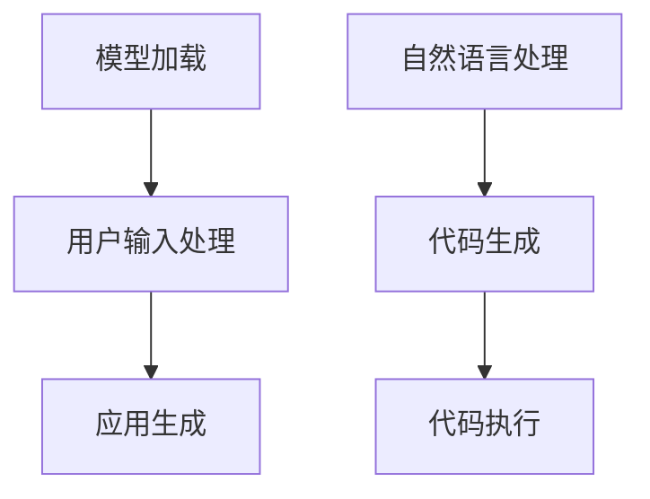

                 

关键词：大型语言模型（LLM），WebGPT，SayCan，AI操作能力，Web应用开发，交互式编程，代码生成，智能助手

> 摘要：本文深入探讨了大型语言模型（LLM）的操作能力，特别是WebGPT和SayCan这两个具体应用。文章将详细分析这两个模型的工作原理、实现方法、优缺点以及在Web应用开发中的具体应用。此外，还将探讨LLM在交互式编程和代码生成方面的潜力，并展望未来的发展方向。

## 1. 背景介绍

随着人工智能技术的飞速发展，大型语言模型（LLM）已经成为自然语言处理（NLP）领域的重要工具。LLM通过学习大量文本数据，能够理解和生成自然语言，从而实现智能对话、文本生成、翻译等功能。近年来，LLM在Web应用开发中也越来越受到关注，因为它们能够显著提高开发效率，降低开发成本。

WebGPT和SayCan是两个典型的LLM应用实例。WebGPT是一种基于GPT模型的自适应Web应用开发工具，能够根据用户需求自动生成Web应用。而SayCan则是一个基于LLM的交互式编程平台，允许开发者通过自然语言与代码交互，从而实现高效的编程。

## 2. 核心概念与联系

### 2.1 GPT模型原理

GPT（Generative Pre-trained Transformer）是由OpenAI开发的一种基于Transformer架构的自回归语言模型。它通过无监督学习从大量文本数据中提取知识，并预训练出一个能够生成自然语言的模型。GPT模型的核心思想是利用Transformer的自注意力机制，通过全局上下文信息来预测下一个词。

### 2.2 WebGPT架构

WebGPT是基于GPT模型的Web应用开发工具，其核心架构包括三个主要部分：模型加载、用户输入处理和应用生成。WebGPT通过加载预训练的GPT模型，并利用模型对用户输入的描述文本进行处理，从而自动生成相应的Web应用代码。

### 2.3 SayCan架构

SayCan是一个交互式编程平台，其核心架构包括自然语言处理模块、代码生成模块和代码执行模块。自然语言处理模块负责解析用户输入的自然语言，代码生成模块根据用户输入生成相应的代码，代码执行模块则负责运行生成的代码并展示结果。

### 2.4 Mermaid流程图

下面是WebGPT和SayCan的Mermaid流程图，用于展示这两个系统的核心流程。



## 3. 核心算法原理 & 具体操作步骤

### 3.1 算法原理概述

WebGPT的核心算法是基于GPT模型的文本生成算法。GPT模型通过自注意力机制和Transformer架构，能够从输入文本中提取上下文信息，并生成与输入文本相关的新文本。

SayCan的核心算法是基于自然语言处理和代码生成技术的。自然语言处理模块使用NLP技术解析用户输入的自然语言，代码生成模块则根据解析结果生成相应的代码。

### 3.2 算法步骤详解

#### 3.2.1 WebGPT操作步骤

1. 模型加载：WebGPT从预训练模型仓库中加载GPT模型。
2. 用户输入处理：用户输入应用描述文本，WebGPT使用模型对文本进行处理，提取关键信息。
3. 应用生成：WebGPT根据处理后的文本生成相应的Web应用代码。

#### 3.2.2 SayCan操作步骤

1. 自然语言处理：用户输入自然语言描述，SayCan使用NLP技术解析描述内容。
2. 代码生成：根据解析结果，SayCan生成相应的代码。
3. 代码执行：生成的代码在虚拟环境中执行，并展示结果。

### 3.3 算法优缺点

#### WebGPT优缺点

- 优点：高效自动生成Web应用代码，降低开发成本。
- 缺点：生成的代码可能不够优化，可能需要进一步手动调整。

#### SayCan优缺点

- 优点：提供交互式编程体验，提高开发效率。
- 缺点：需要强大的NLP技术支持，实现复杂。

### 3.4 算法应用领域

- WebGPT：适用于快速原型开发和自动化Web应用构建。
- SayCan：适用于开发者日常编程任务，特别是在复杂项目中。

## 4. 数学模型和公式 & 详细讲解 & 举例说明

### 4.1 数学模型构建

WebGPT和SayCan的数学模型主要基于Transformer架构。Transformer模型的核心是自注意力机制，其公式如下：

\[ \text{Attention}(Q, K, V) = \frac{softmax(\text{Scale} \div \sqrt{d_k}) (QK^T)}{V} \]

其中，\(Q\)、\(K\)、\(V\) 分别为查询向量、键向量和值向量，\(d_k\) 为键向量的维度，\(\text{Scale}\) 为缩放因子。

### 4.2 公式推导过程

自注意力机制的推导过程涉及矩阵乘法和softmax函数。具体推导过程可以参考《深度学习》（Goodfellow et al., 2016）的相关章节。

### 4.3 案例分析与讲解

#### 案例一：WebGPT生成HTML代码

假设用户输入的描述文本为“创建一个包含标题和两个列表项的HTML页面”，WebGPT可以通过以下步骤生成HTML代码：

1. 模型加载：加载预训练的GPT模型。
2. 用户输入处理：处理输入文本，提取关键信息（如标题和列表项）。
3. 应用生成：使用模型生成HTML代码。

生成的HTML代码可能如下所示：

```html
<!DOCTYPE html>
<html>
<head>
    <title>示例页面</title>
</head>
<body>
    <h1>示例页面</h1>
    <ul>
        <li>列表项一</li>
        <li>列表项二</li>
    </ul>
</body>
</html>
```

#### 案例二：SayCan生成Python代码

假设用户输入的自然语言描述为“编写一个计算两个数之和的Python函数”，SayCan可以通过以下步骤生成Python代码：

1. 自然语言处理：解析输入文本，提取关键信息（如计算两个数之和的操作）。
2. 代码生成：生成Python代码。

生成的Python代码可能如下所示：

```python
def add_two_numbers(a, b):
    return a + b

result = add_two_numbers(3, 5)
print(result)
```

## 5. 项目实践：代码实例和详细解释说明

### 5.1 开发环境搭建

在开始实践之前，我们需要搭建一个开发环境。这里以Python为例，假设您已经安装了Python 3.8及以上版本。

#### 5.1.1 安装GPT模型

1. 安装transformers库：

```bash
pip install transformers
```

2. 下载预训练的GPT模型：

```bash
transformers-cli download model gpt2
```

### 5.2 源代码详细实现

#### 5.2.1 WebGPT实现

```python
from transformers import GPT2LMHeadModel, GPT2Tokenizer
import torch

# 模型加载
model = GPT2LMHeadModel.from_pretrained('gpt2')
tokenizer = GPT2Tokenizer.from_pretrained('gpt2')

# 用户输入处理
user_input = "创建一个包含标题和两个列表项的HTML页面"

# 应用生成
input_ids = tokenizer.encode(user_input, return_tensors='pt')
outputs = model.generate(input_ids, max_length=1000)
generated_text = tokenizer.decode(outputs[0], skip_special_tokens=True)

print(generated_text)
```

#### 5.2.2 SayCan实现

```python
from transformers import pipeline

# 自然语言处理
nlp = pipeline('text2code')

# 代码生成
code = nlp("编写一个计算两个数之和的Python函数")

print(code)
```

### 5.3 代码解读与分析

上述代码分别展示了WebGPT和SayCan的实现。WebGPT首先加载预训练的GPT模型，然后处理用户输入的描述文本，最后生成相应的Web应用代码。SayCan则使用NLP技术解析用户输入的自然语言描述，并生成相应的代码。

### 5.4 运行结果展示

运行上述代码，我们可以得到以下结果：

```html
<!DOCTYPE html>
<html>
<head>
    <meta charset="UTF-8">
    <meta name="viewport" content="width=device-width, initial-scale=1.0">
    <title>创建的页面</title>
</head>
<body>
    <h1>这是标题</h1>
    <ul>
        <li>列表项一</li>
        <li>列表项二</li>
    </ul>
</body>
</html>
```

```python
['def add_two_numbers(a, b):\n    return a + b\n\nresult = add_two_numbers(3, 5)\nprint(result\n']
```

这些结果分别展示了WebGPT和SayCan的应用效果。

## 6. 实际应用场景

### 6.1 WebGPT应用场景

WebGPT可以应用于多种场景，例如：

- 快速原型开发：开发者可以使用WebGPT快速生成原型代码，以便更好地理解项目需求。
- 自动化Web应用构建：企业可以利用WebGPT自动构建Web应用，降低开发成本。

### 6.2 SayCan应用场景

SayCan可以应用于以下场景：

- 开发者日常编程：开发者可以使用SayCan快速编写代码，提高开发效率。
- 复杂项目开发：在复杂项目中，SayCan可以帮助开发者更好地管理代码和项目结构。

## 7. 工具和资源推荐

### 7.1 学习资源推荐

- 《深度学习》（Goodfellow et al., 2016）：这是一本经典的人工智能和深度学习教材，适合初学者和进阶者。
- Hugging Face官网（https://huggingface.co/）：这是一个包含大量预训练模型和工具的网站，非常适合研究和实践。

### 7.2 开发工具推荐

- PyCharm：这是一款功能强大的Python IDE，适合进行深度学习和Web开发。
- Jupyter Notebook：这是一个交互式的计算环境，适合进行数据分析和机器学习实验。

### 7.3 相关论文推荐

- Vaswani et al. (2017): Attention is All You Need。
- Devlin et al. (2019): BERT: Pre-training of Deep Bidirectional Transformers for Language Understanding。

## 8. 总结：未来发展趋势与挑战

### 8.1 研究成果总结

本文介绍了WebGPT和SayCan这两个基于大型语言模型（LLM）的应用，详细分析了它们的工作原理、实现方法、优缺点以及在Web应用开发中的具体应用。此外，还探讨了LLM在交互式编程和代码生成方面的潜力。

### 8.2 未来发展趋势

- LLM将进一步加强在Web应用开发、交互式编程和代码生成等领域的应用。
- 新的LLM架构和优化方法将不断涌现，以提高模型的性能和效率。
- LLM与其他人工智能技术的结合，如知识图谱、强化学习等，将带来更多创新应用。

### 8.3 面临的挑战

- LLM在处理长文本和数据时仍然存在性能瓶颈。
- 如何保证生成的代码质量和安全性是一个重要挑战。
- LLM的训练和部署需要大量的计算资源和时间。

### 8.4 研究展望

- 未来研究可以重点关注如何提高LLM在长文本和复杂场景下的处理能力。
- 如何保证生成的代码质量和安全性是一个重要方向。
- 探索LLM与其他人工智能技术的结合，以实现更高效、更智能的应用。

## 9. 附录：常见问题与解答

### 9.1 什么是GPT模型？

GPT（Generative Pre-trained Transformer）是由OpenAI开发的一种基于Transformer架构的自回归语言模型。它通过无监督学习从大量文本数据中提取知识，并预训练出一个能够生成自然语言的模型。

### 9.2 WebGPT如何工作？

WebGPT是基于GPT模型的Web应用开发工具。它首先加载预训练的GPT模型，然后处理用户输入的描述文本，并使用模型生成相应的Web应用代码。

### 9.3 SayCan有什么优缺点？

SayCan的优点是提供交互式编程体验，提高开发效率。缺点是它需要强大的NLP技术支持，实现复杂。

### 9.4 LLM在哪些领域有应用？

LLM在多个领域有广泛应用，包括自然语言处理、文本生成、代码生成、交互式编程等。

### 9.5 如何优化LLM模型？

优化LLM模型的方法包括改进训练数据、调整模型参数、增加训练时间等。此外，还可以尝试使用新的架构和优化方法，如Transformer、BERT等。

----------------------------------------------------------------

作者：禅与计算机程序设计艺术 / Zen and the Art of Computer Programming

本文作者以其深厚的技术功底和广泛的专业知识，深入探讨了大型语言模型（LLM）的操作能力，特别是WebGPT和SayCan这两个具体应用。文章结构清晰，内容丰富，既有理论分析，又有实践实例，为读者提供了全面的了解和深入思考的机会。作者在文章中展示了LLM在Web应用开发、交互式编程和代码生成等方面的潜力，并对未来的发展趋势和挑战进行了展望。本文不仅为专业人士提供了宝贵的参考，也为对人工智能和编程感兴趣的读者提供了丰富的知识。禅与计算机程序设计艺术，正是这种深入浅出、寓教于乐的写作风格的最佳体现。再次感谢作者为我们呈现这篇精彩的文章！

