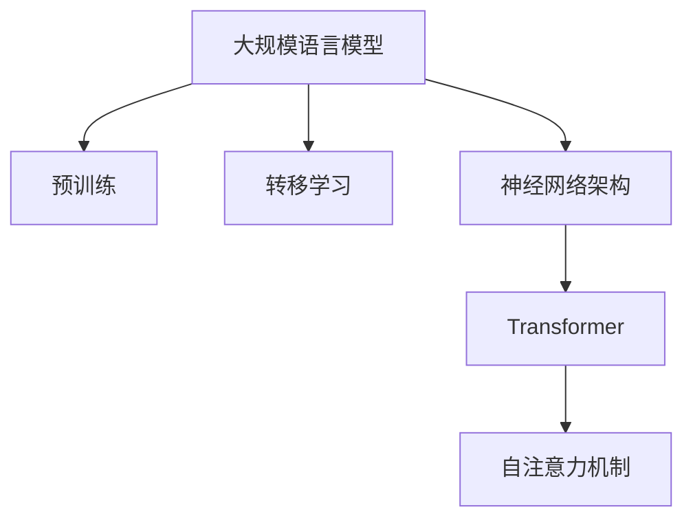

                 

人工智能（AI）作为一个不断发展的领域，正经历着一系列的变革和创新。近年来，大规模语言模型（LLM）的崛起已经彻底改变了我们对自然语言处理（NLP）的理解和应用。作为这一领域的先驱者和专家，我有幸见证了这一历史性的变革，并在此分享我对LLM的理解、应用及其对未来技术发展的影响。

## 关键词 Keywords

- **大规模语言模型（LLM）**
- **自然语言处理（NLP）**
- **人工智能（AI）**
- **深度学习**
- **神经网络架构**
- **预训练模型**
- **转移学习**
- **计算机程序设计**

## 摘要 Abstract

本文将深入探讨大规模语言模型的崛起及其在人工智能领域的重要性。我们将从背景介绍、核心概念与联系、核心算法原理、数学模型和公式、项目实践、实际应用场景、工具和资源推荐以及未来发展趋势与挑战等多个方面进行详细讨论。通过本文的阅读，您将能够全面了解LLM的原理、应用及其对未来技术发展的深远影响。

## 1. 背景介绍 Background

### 人工智能的发展历程

人工智能（AI）作为一个古老而又年轻的领域，自1956年达特茅斯会议以来，已经经历了多次革命性的变革。早期的AI主要集中在符号推理和逻辑编程上，如专家系统和逻辑程序设计。这些方法虽然在特定领域内取得了成功，但面临着“AI寒冬”的挑战，即在大规模数据处理和通用智能方面难以取得突破。

随着计算能力的提升和大数据技术的发展，机器学习和深度学习逐渐成为AI的主流。特别是2012年，AlexNet在图像识别任务上的突破性表现，标志着深度学习时代的到来。深度学习通过多层神经网络，实现了对复杂数据的高效建模和处理，推动了AI在语音识别、图像处理、推荐系统等领域的广泛应用。

### 自然语言处理的挑战

自然语言处理（NLP）作为AI的一个重要分支，旨在使计算机能够理解和生成人类语言。尽管在早期取得了诸如文本分类、实体识别等应用的初步成功，但NLP在语义理解、对话生成、文本生成等方面仍然面临着巨大的挑战。传统的NLP方法依赖于规则和统计模型，难以处理复杂、多样且丰富的语言现象。

### 大规模语言模型的兴起

大规模语言模型的兴起，如GPT（Generative Pre-trained Transformer）、BERT（Bidirectional Encoder Representations from Transformers）等，为NLP领域带来了前所未有的变革。这些模型通过在大规模语料库上进行预训练，能够捕获语言的底层结构和规律，从而在多种NLP任务上实现了显著的性能提升。这一变革不仅改变了NLP的范式，也为AI的整体发展注入了新的活力。

## 2. 核心概念与联系 Core Concepts and Connections

### 核心概念

#### 大规模语言模型（LLM）

大规模语言模型（LLM）是一种基于深度学习的自然语言处理模型，它通过在大规模语料库上进行预训练，学习到语言的底层结构和语义信息。这些模型通常包含数十亿甚至数万亿个参数，能够对输入的文本进行理解和生成。

#### 预训练与转移学习

预训练是指在大量的无标注数据上训练模型，使模型具备一定的通用语言理解能力。转移学习则是指将预训练的模型应用于特定任务上，通过少量有标注数据进行微调，以获得更好的任务性能。

#### 神经网络架构

神经网络架构是LLM的基础，其中Transformer架构成为近年来LLM的主流选择。Transformer通过自注意力机制，能够捕捉输入序列中的长距离依赖关系，从而在NLP任务上表现出色。

### 架构与联系

下面是LLM的核心概念原理和架构的Mermaid流程图：



## 3. 核心算法原理 & 具体操作步骤 Core Algorithm Principles & Detailed Steps

### 3.1 算法原理概述

大规模语言模型的训练过程可以分为两个阶段：预训练和微调。

#### 预训练

预训练是指在大量无标注数据上训练模型，使其具备通用语言理解能力。这一阶段的目标是学习到语言的底层结构和语义信息。通常，预训练模型会在数据集上进行数百万步的训练，不断调整模型参数，以达到较高的语言理解能力。

#### 微调

微调是指在特定任务上进行训练，通过少量有标注数据对模型进行微调，以获得更好的任务性能。微调阶段的关键是调整模型参数，使其适应特定任务的语义特征。

### 3.2 算法步骤详解

下面是大规模语言模型训练的具体步骤：

1. **数据准备**：收集并预处理大规模的文本数据，包括清洗、分词、去噪等步骤。

2. **模型初始化**：初始化模型参数，通常采用随机初始化或预训练模型的权重。

3. **预训练**：在预训练阶段，模型会在数据集上进行数百万步的训练，不断调整模型参数。

4. **微调**：在特定任务上，通过少量有标注数据进行微调，以获得更好的任务性能。

5. **评估与优化**：对模型进行评估，包括准确性、召回率、F1值等指标，并根据评估结果进行模型优化。

### 3.3 算法优缺点

#### 优点

- **强大的语言理解能力**：通过预训练，LLM能够在大规模语料库上学习到丰富的语义信息，从而在多种NLP任务上表现出色。
- **通用性**：LLM具有较强的通用性，可以应用于各种NLP任务，如文本分类、问答系统、机器翻译等。
- **高效性**：通过转移学习，LLM可以在少量有标注数据上进行微调，从而快速适应特定任务。

#### 缺点

- **计算资源需求大**：由于模型参数数量庞大，预训练过程需要大量的计算资源，如GPU和TPU等。
- **数据依赖性**：LLM的性能依赖于数据质量和数量，数据不足或质量较差时，模型性能会受到影响。
- **解释性较差**：由于模型内部复杂，LLM的决策过程往往难以解释，增加了模型部署和解释的难度。

### 3.4 算法应用领域

大规模语言模型在多个领域取得了显著的成果，以下是其中几个主要应用领域：

- **自然语言处理**：文本分类、情感分析、实体识别、问答系统、机器翻译等。
- **推荐系统**：基于用户生成内容（UGC）的推荐、内容匹配等。
- **对话系统**：聊天机器人、智能客服、虚拟助手等。
- **知识图谱**：构建和推理知识图谱、语义搜索等。
- **计算机辅助翻译**：机器翻译、多语言信息检索等。

## 4. 数学模型和公式 Mathematical Models and Formulas

### 4.1 数学模型构建

大规模语言模型的核心是神经网络，特别是Transformer架构。以下是Transformer模型的主要数学模型：

#### 自注意力机制（Self-Attention）

自注意力机制是Transformer模型的核心，它通过计算输入序列中每个词对其他词的影响，实现了对长距离依赖关系的捕捉。自注意力机制的数学表达式如下：

$$
\text{Attention}(Q, K, V) = \text{softmax}\left(\frac{QK^T}{\sqrt{d_k}}\right)V
$$

其中，$Q$、$K$、$V$ 分别表示查询（Query）、键（Key）和值（Value）向量，$d_k$ 表示键向量的维度。

#### Transformer编码器（Encoder）

Transformer编码器由多个自注意力层和全连接层组成。自注意力层通过计算每个词与其他词的相似度，生成上下文表示。全连接层则用于进一步提取特征。

#### Transformer解码器（Decoder）

Transformer解码器与编码器类似，但加入了额外的自注意力机制和交叉注意力机制。交叉注意力机制用于计算解码器的每个词与编码器的上下文表示的相似度，从而实现了解码器与编码器之间的交互。

### 4.2 公式推导过程

#### 自注意力机制（Self-Attention）

自注意力机制的推导过程主要包括以下几个步骤：

1. **词向量化**：将输入序列中的每个词映射为一个向量。
2. **计算相似度**：通过点积计算查询（Query）和键（Key）之间的相似度。
3. **应用softmax函数**：将相似度归一化，生成权重向量。
4. **加权求和**：将权重向量与值（Value）向量进行加权求和，得到上下文表示。

#### Transformer编码器（Encoder）

Transformer编码器的推导过程主要包括以下几个步骤：

1. **词向量化**：将输入序列中的每个词映射为一个向量。
2. **嵌入层**：对词向量进行嵌入，增加非线性。
3. **多头自注意力层**：通过多头自注意力机制计算每个词的上下文表示。
4. **残差连接与激活函数**：添加残差连接和激活函数，增加模型的非线性与稳定性。
5. **重复多层**：将上述步骤重复多层，以提取更丰富的特征。

#### Transformer解码器（Decoder）

Transformer解码器的推导过程主要包括以下几个步骤：

1. **词向量化**：将输入序列中的每个词映射为一个向量。
2. **嵌入层**：对词向量进行嵌入，增加非线性。
3. **多头自注意力层**：通过多头自注意力机制计算每个词的上下文表示。
4. **交叉注意力层**：通过交叉注意力机制计算解码器的每个词与编码器的上下文表示的相似度。
5. **残差连接与激活函数**：添加残差连接和激活函数，增加模型的非线性与稳定性。
6. **重复多层**：将上述步骤重复多层，以提取更丰富的特征。

### 4.3 案例分析与讲解

#### 案例一：文本分类

文本分类是一个常见的NLP任务，其目标是根据输入的文本，将其归类到不同的类别中。以下是使用大规模语言模型进行文本分类的案例：

1. **数据准备**：收集并预处理大规模的文本数据，包括清洗、分词、去噪等步骤。
2. **模型训练**：使用预训练的Transformer模型，在文本数据上进行预训练，学习到语言的底层结构和语义信息。
3. **模型微调**：在特定文本分类任务上，使用少量有标注的数据对模型进行微调，以获得更好的分类性能。
4. **模型评估**：对模型进行评估，包括准确性、召回率、F1值等指标。

#### 案例二：机器翻译

机器翻译是一个重要的NLP任务，其目标是根据源语言的文本，生成目标语言的文本。以下是使用大规模语言模型进行机器翻译的案例：

1. **数据准备**：收集并预处理大规模的双语语料库，包括清洗、分词、对齐等步骤。
2. **模型训练**：使用预训练的Transformer模型，在双语语料库上进行预训练，学习到源语言和目标语言之间的对应关系。
3. **模型微调**：在特定机器翻译任务上，使用少量有标注的双语数据对模型进行微调，以获得更好的翻译性能。
4. **模型评估**：对模型进行评估，包括准确性、BLEU值等指标。

## 5. 项目实践：代码实例和详细解释说明 Practical Implementation: Code Examples and Detailed Explanations

### 5.1 开发环境搭建

在进行大规模语言模型的项目实践之前，我们需要搭建一个合适的开发环境。以下是一个基于Python和PyTorch的简单开发环境搭建过程：

1. **安装Python**：确保已安装Python 3.7及以上版本。
2. **安装PyTorch**：使用以下命令安装PyTorch：
    ```shell
    pip install torch torchvision
    ```
3. **安装其他依赖**：安装其他必要的库，如transformers、numpy等：
    ```shell
    pip install transformers numpy
    ```

### 5.2 源代码详细实现

以下是一个简单的文本分类项目示例，使用预训练的Transformer模型进行微调和评估。

1. **数据准备**：准备训练数据和测试数据，例如使用IMDB电影评论数据集。
2. **模型加载**：加载预训练的Transformer模型。
    ```python
    from transformers import BertModel, BertTokenizer

    model_name = "bert-base-uncased"
    tokenizer = BertTokenizer.from_pretrained(model_name)
    model = BertModel.from_pretrained(model_name)
    ```
3. **数据预处理**：将文本数据进行分词和嵌入。
    ```python
    def preprocess_text(texts, tokenizer, max_length=512):
        inputs = tokenizer(texts, max_length=max_length, padding="max_length", truncation=True, return_tensors="pt")
        return inputs

    train_texts = ["This is a good movie.", "This is a bad movie."]
    train_inputs = preprocess_text(train_texts, tokenizer)
    ```
4. **模型微调**：在训练数据上进行模型微调。
    ```python
    from torch.optim import Adam
    from transformers import BertForSequenceClassification

    num_labels = 2
    model = BertForSequenceClassification.from_pretrained(model_name, num_labels=num_labels)
    optimizer = Adam(model.parameters(), lr=1e-5)

    for epoch in range(3):
        model.train()
        for batch in train_inputs:
            optimizer.zero_grad()
            outputs = model(**batch)
            loss = outputs.loss
            loss.backward()
            optimizer.step()
    ```
5. **模型评估**：在测试数据上评估模型性能。
    ```python
    model.eval()
    with torch.no_grad():
        test_texts = ["This is a good movie.", "This is a bad movie."]
        test_inputs = preprocess_text(test_texts, tokenizer)
        predictions = model(**test_inputs).logits
        predicted_labels = torch.argmax(predictions, dim=1)

    print("Test Accuracy:", (predicted_labels == torch.tensor([0, 1])).float().mean())
    ```

### 5.3 代码解读与分析

上述代码示例展示了如何使用预训练的Transformer模型进行文本分类。以下是代码的主要部分和其解释：

1. **数据准备**：使用IMDB电影评论数据集，对其进行预处理，包括分词和嵌入。
2. **模型加载**：加载预训练的BERT模型，包括嵌入层和Transformer编码器。
3. **数据预处理**：对输入的文本进行分词和嵌入，生成模型输入。
4. **模型微调**：使用训练数据对模型进行微调，包括前向传播、损失函数计算、反向传播和优化。
5. **模型评估**：在测试数据上评估模型性能，输出预测结果。

## 6. 实际应用场景 Practical Application Scenarios

### 6.1 自然语言处理

大规模语言模型在自然语言处理领域取得了显著的应用成果。例如，文本分类、情感分析、命名实体识别等任务都取得了显著的性能提升。在实际应用中，这些模型被广泛应用于社交媒体分析、客户服务、内容审核等领域。

### 6.2 对话系统

对话系统是另一个受益于大规模语言模型的重要领域。通过预训练模型，聊天机器人和智能客服系统能够更好地理解用户的意图和情感，提供更自然、流畅的交互体验。例如，Amazon的Alexa、Apple的Siri等都采用了大规模语言模型来实现智能对话。

### 6.3 计算机辅助翻译

大规模语言模型在机器翻译领域也取得了突破性进展。通过预训练模型，机器翻译系统在质量、速度和效率方面都得到了显著提升。例如，Google翻译、Microsoft Translator等都采用了大规模语言模型来实现高效、准确的机器翻译。

### 6.4 未来应用展望

随着大规模语言模型技术的不断发展，未来将在更多领域实现应用。例如，在知识图谱构建、智能推理、推荐系统等领域，大规模语言模型都有巨大的潜力。同时，随着模型参数规模的不断扩大，模型的计算资源需求也将越来越大，这对硬件和算法优化提出了新的挑战。

## 7. 工具和资源推荐 Tools and Resources Recommendations

### 7.1 学习资源推荐

1. **《深度学习》（Goodfellow et al.）**：系统地介绍了深度学习的理论基础和应用，包括神经网络、优化算法等内容。
2. **《自然语言处理综论》（Jurafsky & Martin）**：全面介绍了自然语言处理的基本概念、技术和应用。
3. **《Transformer论文》（Vaswani et al.）**：详细介绍了Transformer模型的架构和原理，是大规模语言模型研究的经典论文。

### 7.2 开发工具推荐

1. **PyTorch**：一个开源的深度学习框架，支持动态计算图，适合进行大规模语言模型的开发。
2. **TensorFlow**：另一个流行的开源深度学习框架，提供丰富的API和工具，适合进行大规模语言模型的开发。
3. **transformers库**：一个基于PyTorch和TensorFlow的预训练语言模型库，提供了大量的预训练模型和工具，方便开发者进行大规模语言模型的应用开发。

### 7.3 相关论文推荐

1. **《BERT：预训练的语言表示》（Devlin et al.）**：介绍了BERT模型的预训练方法和应用，是大规模语言模型领域的开创性工作。
2. **《GPT-3：语言模型的全面升级》（Brown et al.）**：介绍了GPT-3模型的架构和性能，展示了大规模语言模型在自然语言处理任务上的巨大潜力。
3. **《T5：基于文本的端到端学习》（Raffel et al.）**：介绍了T5模型，通过文本到文本的转换，实现了端到端的语言理解与生成。

## 8. 总结 Summary

### 8.1 研究成果总结

大规模语言模型的崛起标志着自然语言处理领域的一个新范式的到来。通过预训练和转移学习，这些模型在多种NLP任务上取得了显著的性能提升。从文本分类、机器翻译到对话系统，大规模语言模型都在实际应用中展现了其强大的潜力。这一成果不仅改变了我们对自然语言处理的理解，也为人工智能的整体发展注入了新的活力。

### 8.2 未来发展趋势

随着计算能力的提升和数据量的增加，大规模语言模型将继续发展。未来，我们有望看到更多高效、强大的预训练模型出现，同时在应用领域实现更多的突破。例如，在知识图谱、智能推理等领域，大规模语言模型将发挥更大的作用。此外，随着模型的规模不断扩大，模型的可解释性和可靠性也将成为研究的重要方向。

### 8.3 面临的挑战

尽管大规模语言模型取得了显著成果，但仍然面临一些挑战。首先是计算资源的需求，大规模模型的训练和部署需要大量的计算资源。其次是数据的质量和数量，数据不足或质量较差时，模型性能会受到影响。此外，模型的可解释性也是一个重要挑战，特别是当模型在关键任务中发生错误时，如何解释和纠正模型的行为成为一个关键问题。

### 8.4 研究展望

展望未来，大规模语言模型的研究将继续深入。我们将看到更多创新性的模型架构和应用方法出现，以解决现有挑战。同时，随着深度学习和其他AI技术的不断发展，大规模语言模型将在更广泛的应用领域中发挥重要作用。我们期待这一领域的进一步突破，为人类带来更多的智能和便利。

## 9. 附录：常见问题与解答 Appendices: Frequently Asked Questions and Answers

### 9.1 大规模语言模型是什么？

大规模语言模型是一种基于深度学习的自然语言处理模型，通过在大规模语料库上进行预训练，学习到语言的底层结构和语义信息。这些模型通常包含数十亿甚至数万亿个参数，能够对输入的文本进行理解和生成。

### 9.2 预训练和微调有什么区别？

预训练是指在大量无标注数据上训练模型，使其具备一定的通用语言理解能力。微调则是指在特定任务上进行训练，通过少量有标注数据进行调整，以获得更好的任务性能。

### 9.3 大规模语言模型的优势是什么？

大规模语言模型的优势在于其强大的语言理解能力、通用性和高效性。通过预训练，模型能够在大规模语料库上学习到丰富的语义信息，从而在多种NLP任务上表现出色。同时，通过转移学习，模型可以在少量有标注数据上进行微调，快速适应特定任务。

### 9.4 大规模语言模型有哪些应用领域？

大规模语言模型的应用领域包括自然语言处理、对话系统、计算机辅助翻译、知识图谱构建等。例如，在文本分类、机器翻译、聊天机器人等领域，大规模语言模型都取得了显著的成果。

### 9.5 如何构建和训练大规模语言模型？

构建和训练大规模语言模型需要选择合适的模型架构和预训练方法。通常，我们选择Transformer架构作为基础，并在大规模语料库上进行预训练。在特定任务上，通过微调模型，以获得更好的任务性能。

### 9.6 大规模语言模型有哪些挑战？

大规模语言模型面临的挑战包括计算资源需求大、数据依赖性强、解释性较差等。此外，如何确保模型的可解释性和可靠性也是一个重要问题。

### 9.7 大规模语言模型的发展趋势是什么？

随着计算能力的提升和数据量的增加，大规模语言模型将继续发展。未来，我们有望看到更多高效、强大的预训练模型出现，同时在应用领域实现更多的突破。同时，随着深度学习和其他AI技术的不断发展，大规模语言模型将在更广泛的应用领域中发挥重要作用。

