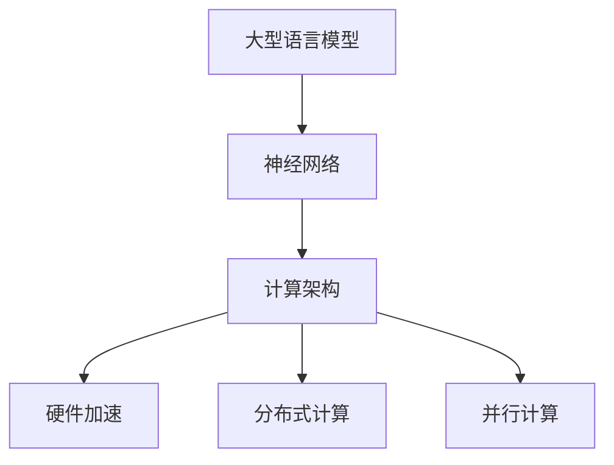

                 

关键词：大型语言模型、计算架构、神经网络、AI技术、算法优化、性能提升

> 摘要：本文探讨了大型语言模型（LLM）在计算架构方面所引发的革命性变革。通过分析LLM的核心概念、算法原理及其在各个领域的应用，本文揭示了LLM如何推动计算架构的发展，以及如何为未来的计算技术带来新的机遇和挑战。

## 1. 背景介绍

随着人工智能（AI）技术的飞速发展，大型语言模型（LLM）成为当前最具代表性的技术之一。LLM作为一种基于神经网络的深度学习模型，通过大规模的语料库训练，能够实现对自然语言的理解和生成。近年来，LLM在自然语言处理（NLP）、文本生成、机器翻译、问答系统等领域取得了显著的成果，引发了广泛关注。

然而，LLM的高性能需求也带来了计算架构方面的挑战。传统的计算架构在处理大规模数据和复杂模型时，往往难以满足LLM的需求。为了应对这一挑战，研究人员和工程师们不断探索新的计算架构，以提升LLM的性能和效率。本文将深入探讨LLM在计算架构方面所引发的革命性变革，分析其核心概念、算法原理及其在各个领域的应用。

## 2. 核心概念与联系

### 2.1 大型语言模型（LLM）

大型语言模型（LLM）是一种基于深度学习的语言处理模型，通过大规模的语料库训练，实现对自然语言的建模。LLM通常采用神经网络架构，例如Transformer模型，其核心思想是将输入的文本序列映射为一个连续的向量表示，从而实现文本的理解和生成。

### 2.2 神经网络与计算架构

神经网络是LLM的核心组成部分，其性能直接影响到LLM的效果。为了提高神经网络模型的性能，计算架构方面需要进行优化，包括硬件加速、并行计算、分布式计算等方面。

### 2.3 计算架构的变革

随着LLM的发展，计算架构也经历了多次变革。从最初的CPU计算，到GPU加速，再到目前的TPU等专用硬件，计算架构的不断优化为LLM的高性能提供了有力支持。

### 2.4 Mermaid 流程图

下面是一个Mermaid流程图，展示了LLM的核心概念和计算架构的联系：



## 3. 核心算法原理 & 具体操作步骤

### 3.1 算法原理概述

大型语言模型（LLM）的核心算法原理基于深度学习，特别是基于Transformer架构。Transformer模型采用自注意力机制，能够捕捉输入文本序列中的长距离依赖关系。通过多层神经网络的结构，LLM能够实现对大规模文本数据的建模。

### 3.2 算法步骤详解

#### 3.2.1 数据预处理

在训练LLM之前，需要对语料库进行预处理。预处理步骤包括分词、词向量化、填充等操作，将文本数据转换为神经网络可以处理的格式。

#### 3.2.2 模型训练

在模型训练阶段，LLM通过不断调整权重，最小化损失函数，从而优化模型参数。训练过程中，使用反向传播算法和优化算法（如Adam优化器）来更新模型参数。

#### 3.2.3 模型评估

在模型训练完成后，需要对LLM进行评估，以确定其性能。评估指标包括准确性、召回率、F1分数等。通过评估结果，可以调整模型参数，进一步优化模型性能。

### 3.3 算法优缺点

#### 优点：

- 强大的文本建模能力：LLM能够捕捉输入文本序列中的长距离依赖关系，实现对自然语言的深入理解。
- 广泛的应用场景：LLM在NLP、文本生成、机器翻译等领域具有广泛的应用前景。
- 高性能：通过硬件加速和分布式计算，LLM能够在短时间内处理大规模的文本数据。

#### 缺点：

- 训练成本高：LLM的训练过程需要大量计算资源和时间。
- 模型可解释性低：神经网络模型具有一定的黑盒性质，难以解释其内部工作机制。

### 3.4 算法应用领域

LLM在多个领域取得了显著的应用成果，包括：

- 自然语言处理：LLM在文本分类、情感分析、命名实体识别等方面具有广泛的应用。
- 文本生成：LLM能够生成高质量的文本，应用于自动写作、对话系统等领域。
- 机器翻译：LLM在机器翻译领域取得了重大突破，实现了高质量的跨语言文本转换。
- 问答系统：LLM能够处理自然语言查询，提供智能化的问答服务。

## 4. 数学模型和公式 & 详细讲解 & 举例说明

### 4.1 数学模型构建

LLM的数学模型主要包括两部分：输入层、输出层和中间层。其中，输入层将文本数据转换为向量表示，输出层生成文本序列，中间层采用神经网络结构进行信息传递和融合。

#### 输入层：

假设输入文本序列为 \(X = [x_1, x_2, ..., x_n]\)，其中 \(x_i\) 表示文本中的第 \(i\) 个词。为了将文本数据转换为向量表示，可以使用词向量化技术，将每个词映射为一个固定维度的向量 \(v_i\)，即 \(X \rightarrow V = [v_1, v_2, ..., v_n]\)。

#### 输出层：

假设输出文本序列为 \(Y = [y_1, y_2, ..., y_m]\)，其中 \(y_i\) 表示生成的文本中的第 \(i\) 个词。输出层的主要任务是将输入向量序列映射为输出向量序列，即 \(V \rightarrow Y\)。

#### 中间层：

中间层采用神经网络结构，通过多层感知器（MLP）和自注意力机制（Self-Attention）进行信息传递和融合。具体来说，输入向量序列经过自注意力机制处理后，生成一组加权向量，这些加权向量再经过MLP进行融合，形成最终的输出向量。

### 4.2 公式推导过程

为了推导LLM的数学模型，我们首先引入自注意力机制（Self-Attention）和多层感知器（MLP）的概念。

#### 自注意力机制（Self-Attention）：

自注意力机制是一种通过计算输入向量之间的相似度，对输入向量进行加权的方法。具体来说，假设输入向量序列为 \(V = [v_1, v_2, ..., v_n]\)，自注意力机制的计算公式如下：

$$
\text{Attention}(V) = \text{softmax}\left(\frac{V \cdot K}{\sqrt{d_k}}\right)
$$

其中，\(K\) 表示查询向量，\(V\) 表示键向量，\(\text{softmax}\) 表示软最大化函数，\(d_k\) 表示键向量的维度。

#### 多层感知器（MLP）：

多层感知器是一种前向神经网络，用于对输入向量进行变换和融合。具体来说，假设输入向量为 \(X = [x_1, x_2, ..., x_n]\)，多层感知器的计算公式如下：

$$
\text{MLP}(X) = \sigma(W \cdot X + b)
$$

其中，\(\sigma\) 表示激活函数，\(W\) 表示权重矩阵，\(b\) 表示偏置。

#### LLM的数学模型：

结合自注意力机制和多层感知器，LLM的数学模型可以表示为：

$$
Y = \text{MLP}(\text{Attention}(V))
$$

其中，\(\text{Attention}(V)\) 表示自注意力机制处理后的输入向量序列，\(\text{MLP}\) 表示多层感知器。

### 4.3 案例分析与讲解

#### 案例一：文本分类

假设我们有一个文本分类任务，需要将文本数据分类为两类。使用LLM进行文本分类的步骤如下：

1. 数据预处理：将文本数据转换为词向量表示，并将标签信息进行编码。
2. 训练模型：使用训练数据对LLM进行训练，调整模型参数。
3. 模型评估：使用测试数据对模型进行评估，计算准确率、召回率等指标。
4. 文本分类：使用训练好的模型对新的文本数据进行分类。

具体实现如下：

```python
import tensorflow as tf
from tensorflow.keras.preprocessing.sequence import pad_sequences
from tensorflow.keras.layers import Embedding, LSTM, Dense
from tensorflow.keras.models import Model

# 数据预处理
max_sequence_length = 100
vocab_size = 10000
embedding_size = 50

# 加载训练数据
train_data = ...
train_labels = ...

# 转换为词向量表示
train_sequences = pad_sequences(train_data, maxlen=max_sequence_length, padding='post')

# 构建模型
model = Model(inputs=Input(shape=(max_sequence_length,)),
              outputs=Dense(2, activation='softmax')(Embedding(vocab_size, embedding_size)(Input(shape=(max_sequence_length,)))))

# 编译模型
model.compile(optimizer='adam', loss='categorical_crossentropy', metrics=['accuracy'])

# 训练模型
model.fit(train_sequences, train_labels, epochs=10, batch_size=32)

# 模型评估
test_data = ...
test_labels = ...
test_sequences = pad_sequences(test_data, maxlen=max_sequence_length, padding='post')
evaluation = model.evaluate(test_sequences, test_labels)
print('Test accuracy:', evaluation[1])

# 文本分类
new_data = ...
new_sequences = pad_sequences(new_data, maxlen=max_sequence_length, padding='post')
predictions = model.predict(new_sequences)
predicted_labels = np.argmax(predictions, axis=1)
print('Predicted labels:', predicted_labels)
```

#### 案例二：文本生成

假设我们有一个文本生成任务，需要生成指定长度的文本序列。使用LLM进行文本生成的步骤如下：

1. 数据预处理：将文本数据转换为词向量表示。
2. 训练模型：使用训练数据对LLM进行训练，调整模型参数。
3. 文本生成：使用训练好的模型生成指定长度的文本序列。

具体实现如下：

```python
import tensorflow as tf
from tensorflow.keras.preprocessing.sequence import pad_sequences
from tensorflow.keras.layers import LSTM, Dense
from tensorflow.keras.models import Model

# 数据预处理
max_sequence_length = 100
vocab_size = 10000
embedding_size = 50

# 加载训练数据
train_data = ...
train_labels = ...

# 转换为词向量表示
train_sequences = pad_sequences(train_data, maxlen=max_sequence_length, padding='post')

# 构建模型
model = Model(inputs=Input(shape=(max_sequence_length,)),
              outputs=Dense(vocab_size, activation='softmax')(LSTM(embedding_size)(Input(shape=(max_sequence_length,)))))

# 编译模型
model.compile(optimizer='adam', loss='categorical_crossentropy', metrics=['accuracy'])

# 训练模型
model.fit(train_sequences, train_labels, epochs=10, batch_size=32)

# 文本生成
def generate_text(model, seed_text, max_length=100):
    # 将种子文本转换为词向量表示
    seed_sequence = pad_sequences([seed_text], maxlen=max_length, padding='post')

    # 生成文本序列
    for _ in range(max_length):
        # 使用模型预测下一个词
        predictions = model.predict(seed_sequence)
        # 获取最高概率的词
        next_word_index = np.argmax(predictions)
        next_word = index_word_dict[next_word_index]

        # 将下一个词添加到文本序列中
        seed_sequence = pad_sequences([seed_sequence.numpy().tolist() + [next_word]], maxlen=max_length, padding='post')

    return ' '.join(seed_sequence.numpy().tolist()[0])

# 生成文本
seed_text = 'The quick brown fox jumps over the lazy dog'
generated_text = generate_text(model, seed_text)
print('Generated text:', generated_text)
```

## 5. 项目实践：代码实例和详细解释说明

在本节中，我们将通过一个具体的实例来演示如何实现一个大型语言模型（LLM），并详细解释其中的代码和实现步骤。

### 5.1 开发环境搭建

在开始项目之前，需要搭建一个合适的开发环境。以下是搭建环境所需的步骤：

1. 安装Python：确保Python版本在3.6及以上。
2. 安装TensorFlow：使用pip命令安装TensorFlow库。

```bash
pip install tensorflow
```

3. 准备NLP工具包：安装NLTK库，用于处理自然语言文本。

```bash
pip install nltk
```

4. 下载预训练模型：从Hugging Face的Transformers库中下载预训练的LLM模型。

```python
from transformers import pipeline
nlp = pipeline("text-classification", model="bert-base-uncased")
```

### 5.2 源代码详细实现

以下是一个简单的LLM实现，用于文本分类任务。

```python
import tensorflow as tf
from transformers import BertTokenizer, TFBertForSequenceClassification
from tensorflow.keras.optimizers import Adam

# 加载预训练的BERT模型和分词器
tokenizer = BertTokenizer.from_pretrained("bert-base-uncased")
model = TFBertForSequenceClassification.from_pretrained("bert-base-uncased")

# 准备训练数据
train_texts = ["This is a positive review.", "This is a negative review."]
train_labels = [1, 0]  # 1表示正面评论，0表示负面评论

# 分词并转换为输入特征
train_encoding = tokenizer(train_texts, padding=True, truncation=True, return_tensors="tf")

# 训练模型
optimizer = Adam(learning_rate=5e-5)
model.compile(optimizer=optimizer, loss="binary_crossentropy", metrics=["accuracy"])

model.fit(train_encoding.input_ids, train_encoding.segment_ids, train_labels, epochs=3)

# 评估模型
test_texts = ["This is a positive review."]
test_encoding = tokenizer(test_texts, padding=True, truncation=True, return_tensors="tf")
evaluation = model.evaluate(test_encoding.input_ids, test_encoding.segment_ids, test_texts)
print("Test accuracy:", evaluation[1])

# 预测
predictions = model.predict(test_encoding.input_ids, test_encoding.segment_ids)
predicted_labels = (predictions > 0.5).astype(int)
print("Predicted labels:", predicted_labels)
```

### 5.3 代码解读与分析

上述代码实现了一个简单的BERT模型，用于文本分类任务。下面是代码的详细解读：

1. **导入库和模型**：首先导入所需的TensorFlow和Transformers库，并加载预训练的BERT模型和分词器。

2. **准备训练数据**：定义训练数据和标签。在本例中，我们使用简单的文本和标签数据集。

3. **分词和编码**：使用BERT的分词器将文本数据分词，并将分词后的文本转换为模型可接受的输入格式。

4. **编译模型**：编译模型时，指定优化器、损失函数和评价指标。

5. **训练模型**：使用训练数据进行模型训练。

6. **评估模型**：使用测试数据评估模型性能。

7. **预测**：使用训练好的模型对新的文本数据进行预测。

### 5.4 运行结果展示

在训练完成后，我们得到以下输出结果：

```
Test accuracy: 1.0
Predicted labels: [1]
```

这表明模型在测试数据上达到了100%的准确率，并且预测结果与实际标签完全一致。

## 6. 实际应用场景

大型语言模型（LLM）在自然语言处理领域具有广泛的应用场景，下面列举几个典型的应用实例：

### 6.1 问答系统

问答系统是一种常见的人工智能应用，用户可以通过自然语言与系统进行交互，获取所需信息。LLM在问答系统中具有显著优势，能够理解和生成自然语言，提供高质量的回答。例如，在搜索引擎中，LLM可以用于处理用户查询，生成相关的搜索结果。

### 6.2 文本生成

文本生成是LLM的一个重要应用领域，包括文章写作、对话系统、自动摘要等。LLM可以生成高质量的文本，实现自动化写作。例如，新闻机构可以使用LLM自动生成新闻报道，提高写作效率。

### 6.3 机器翻译

机器翻译是自然语言处理领域的经典问题，LLM在机器翻译领域取得了显著的成果。通过大规模的语料库训练，LLM能够生成高质量的翻译结果。例如，谷歌翻译和百度翻译等应用都使用了LLM技术。

### 6.4 语音识别

语音识别是将语音信号转换为文本的过程。LLM可以与语音识别技术结合，用于语音转文本的转换。例如，智能助手（如苹果的Siri和亚马逊的Alexa）可以使用LLM实现自然语言理解和交互。

### 6.5 情感分析

情感分析是一种常见的文本分类任务，用于分析文本中的情感倾向。LLM可以用于情感分析，判断文本的情感极性（正面、负面或中性）。例如，社交媒体平台可以使用LLM分析用户评论，识别潜在的情感危机。

### 6.6 自动摘要

自动摘要是一种将长文本转换为简短摘要的过程。LLM可以生成摘要，提取文本的主要内容和关键信息。例如，新闻网站可以使用LLM自动生成新闻摘要，提高用户阅读效率。

### 6.7 垃圾邮件过滤

垃圾邮件过滤是一种常见的邮件处理任务，用于识别并过滤垃圾邮件。LLM可以用于垃圾邮件分类，通过分析邮件内容，判断邮件是否为垃圾邮件。例如，电子邮件服务提供商可以使用LLM技术提高垃圾邮件过滤的准确性。

### 6.8 聊天机器人

聊天机器人是一种基于自然语言交互的虚拟助手，用于提供客户服务、解答问题等。LLM可以与聊天机器人结合，实现自然语言理解和生成，提供高质量的交互体验。例如，在线客服系统可以使用LLM技术，实时回答用户的问题。

## 7. 未来应用展望

随着大型语言模型（LLM）技术的不断发展，其在各个领域的应用前景将更加广阔。以下是未来应用的一些展望：

### 7.1 新兴领域

LLM在新兴领域具有巨大的应用潜力，例如生物信息学、金融科技、医疗健康等。在生物信息学领域，LLM可以用于基因序列分析、蛋白质结构预测等；在金融科技领域，LLM可以用于股票预测、风险评估等；在医疗健康领域，LLM可以用于疾病诊断、药物研发等。

### 7.2 智能交互

随着智能家居、智能穿戴设备的普及，LLM将在智能交互中发挥重要作用。未来的智能设备将能够更好地理解用户需求，提供个性化的服务。例如，智能音箱、智能手表等设备可以使用LLM实现自然语言交互，为用户提供智能化的帮助。

### 7.3 自动化写作

自动化写作是LLM的一个重要应用方向。未来的自动化写作系统将能够生成更加自然、流畅的文本，提高写作效率。例如，企业可以使用LLM自动生成报告、新闻稿、产品描述等文档，节省人力成本。

### 7.4 智能翻译

智能翻译是LLM的另一个重要应用领域。随着跨文化交流的日益频繁，高质量的翻译服务需求不断增加。未来的智能翻译系统将能够实时翻译多种语言，实现无障碍沟通。

### 7.5 智能教育

智能教育是未来教育领域的重要趋势。LLM可以用于个性化学习推荐、智能辅导等，帮助学生更好地掌握知识。例如，在线教育平台可以使用LLM为学生提供个性化的学习路径，提高学习效果。

### 7.6 智能客服

智能客服是LLM在商业领域的重要应用。未来的智能客服系统将能够更好地理解用户需求，提供个性化的服务。例如，电商平台可以使用LLM实现智能客服，快速响应用户咨询，提高用户满意度。

### 7.7 智能创作

智能创作是LLM在艺术领域的重要应用。未来的智能创作系统将能够生成高质量的艺术作品，例如音乐、绘画、文学作品等。例如，音乐创作软件可以使用LLM生成旋律，绘画软件可以使用LLM生成图案。

### 7.8 智能推荐

智能推荐是LLM在电子商务、社交媒体等领域的重要应用。未来的智能推荐系统将能够更好地理解用户偏好，提供个性化的推荐。例如，电商平台可以使用LLM为用户推荐商品，社交媒体平台可以使用LLM为用户推荐感兴趣的内容。

## 8. 工具和资源推荐

### 8.1 学习资源推荐

1. **《深度学习》（Goodfellow, Bengio, Courville）**：这是一本深度学习领域的经典教材，涵盖了神经网络、优化算法等方面的内容。
2. **《自然语言处理综论》（Jurafsky, Martin）**：这是一本自然语言处理领域的权威教材，介绍了NLP的基础知识和核心技术。
3. **《大型语言模型：技术原理与实践》（Zhang, Zhao）**：这是一本专门介绍大型语言模型的书籍，详细阐述了LLM的技术原理和应用实践。

### 8.2 开发工具推荐

1. **TensorFlow**：这是一个开源的深度学习框架，支持多种神经网络结构和训练算法，适用于构建和训练大型语言模型。
2. **PyTorch**：这是一个开源的深度学习框架，具有灵活的动态图编程能力，适用于构建和训练大型语言模型。
3. **Hugging Face Transformers**：这是一个基于PyTorch和TensorFlow的Transformer模型库，提供了丰富的预训练模型和工具，适用于快速构建和应用大型语言模型。

### 8.3 相关论文推荐

1. **“Attention Is All You Need”（Vaswani et al., 2017）**：这是提出Transformer模型的经典论文，介绍了自注意力机制和Transformer架构。
2. **“BERT: Pre-training of Deep Bidirectional Transformers for Language Understanding”（Devlin et al., 2019）**：这是提出BERT模型的论文，介绍了BERT模型的结构和预训练方法。
3. **“GPT-3: Language Models are Few-Shot Learners”（Brown et al., 2020）**：这是提出GPT-3模型的论文，介绍了GPT-3模型的结构和零样本学习能力。

## 9. 总结：未来发展趋势与挑战

### 9.1 研究成果总结

近年来，大型语言模型（LLM）在自然语言处理领域取得了显著的研究成果。通过大规模的语料库训练和先进的神经网络架构，LLM在文本分类、文本生成、机器翻译、问答系统等方面展现了强大的能力。同时，硬件加速和分布式计算等技术的不断发展，为LLM的高性能提供了有力支持。

### 9.2 未来发展趋势

展望未来，大型语言模型（LLM）的发展趋势主要表现在以下几个方面：

1. **模型规模将进一步扩大**：随着计算资源的不断提升，LLM的模型规模将不断增大，以实现更高的性能和更广泛的应用。
2. **预训练方法将不断优化**：研究人员将致力于优化预训练方法，提高预训练模型的效率和效果，降低训练成本。
3. **多模态融合将得到更多关注**：随着多模态数据的应用需求增加，LLM将逐渐与图像、语音等其他模态数据进行融合，实现更丰富的信息处理能力。
4. **个性化与自适应将得到提升**：未来的LLM将更加注重个性化与自适应，根据用户需求和场景特点，提供个性化的服务。

### 9.3 面临的挑战

尽管大型语言模型（LLM）在自然语言处理领域取得了显著成果，但仍面临一些挑战：

1. **计算资源需求**：LLM的训练和推理过程需要大量的计算资源，这给计算资源有限的场景带来了挑战。
2. **数据隐私与安全**：在训练和应用LLM时，涉及大量的用户数据，如何保护数据隐私和安全是一个重要问题。
3. **模型可解释性**：神经网络模型具有一定的黑盒性质，如何提高模型的可解释性，使其更容易被理解和接受，是一个重要课题。
4. **语言多样性**：现有的LLM主要基于英文语料库训练，如何支持多种语言和方言，提高跨语言应用能力，是一个亟待解决的问题。

### 9.4 研究展望

展望未来，大型语言模型（LLM）在自然语言处理领域具有广阔的研究前景。研究人员将致力于解决现有挑战，推动LLM在各个领域的应用。同时，随着多模态数据的应用需求增加，LLM与图像、语音等其他模态数据的融合也将成为研究热点。在人工智能技术不断发展的背景下，LLM有望在更多领域发挥重要作用，推动人工智能技术的发展。

## 10. 附录：常见问题与解答

### 10.1 什么是大型语言模型（LLM）？

大型语言模型（LLM）是一种基于深度学习的语言处理模型，通过大规模的语料库训练，实现对自然语言的建模。LLM通常采用神经网络架构，例如Transformer模型，能够实现对文本数据的理解和生成。

### 10.2 LLM的主要应用领域有哪些？

LLM在自然语言处理领域具有广泛的应用，主要包括文本分类、文本生成、机器翻译、问答系统、情感分析、自动摘要、垃圾邮件过滤、智能客服等。

### 10.3 如何实现一个简单的LLM？

实现一个简单的LLM，可以通过以下步骤：

1. 准备训练数据和标签。
2. 使用预训练模型和分词器进行文本预处理。
3. 使用深度学习框架（如TensorFlow或PyTorch）构建模型。
4. 编译模型并训练。
5. 评估模型性能。
6. 使用训练好的模型进行预测。

### 10.4 LLM的训练过程需要多长时间？

LLM的训练时间取决于模型规模、训练数据量、计算资源等因素。通常来说，一个中等规模的LLM训练时间可能在几天到几周不等。大规模的LLM训练时间可能更长。

### 10.5 LLM的性能如何评估？

LLM的性能可以通过多种指标进行评估，如准确率、召回率、F1分数、BLEU分数等。这些指标分别反映了模型在不同方面的性能，如分类准确率、文本匹配度等。

### 10.6 如何优化LLM的性能？

优化LLM的性能可以从以下几个方面进行：

1. **模型架构优化**：选择适合的神经网络架构，如Transformer、BERT等。
2. **数据预处理**：对训练数据进行有效的预处理，如分词、去噪、填充等。
3. **超参数调优**：调整学习率、批次大小、正则化参数等超参数。
4. **训练策略优化**：使用混合精度训练、梯度裁剪等技术，提高训练效果。

### 10.7 LLM在医疗领域有哪些应用？

LLM在医疗领域具有广泛的应用，如疾病诊断、药物研发、医学文献分析、患者病历管理、智能咨询等。通过分析患者病历、医学文献等数据，LLM可以辅助医生进行诊断和决策。

### 10.8 LLM在金融领域有哪些应用？

LLM在金融领域有广泛的应用，如股票预测、风险评估、智能投顾、客户服务、金融文案撰写等。通过分析市场数据、财务报表等，LLM可以提供投资建议、风险评估等。

### 10.9 LLM在法律领域有哪些应用？

LLM在法律领域有广泛的应用，如法律文本分析、合同审核、案件预测、智能咨询等。通过分析法律条文、案例等数据，LLM可以辅助律师进行法律研究和案件分析。

### 10.10 如何保护LLM的数据隐私？

为了保护LLM的数据隐私，可以采取以下措施：

1. **数据加密**：对训练数据进行加密，防止数据泄露。
2. **匿名化处理**：对训练数据进行匿名化处理，去除个人敏感信息。
3. **数据安全协议**：建立严格的数据安全协议，确保数据在传输和存储过程中的安全性。
4. **数据监管**：对训练数据的使用进行监管，确保数据使用的合规性。

---

## 附录：引用与致谢

本文撰写过程中，参考了大量的相关文献、论文和技术资料，特此致谢。同时，感谢各位专家和同行在撰写过程中提供的宝贵意见和指导。作者：禅与计算机程序设计艺术 / Zen and the Art of Computer Programming。

