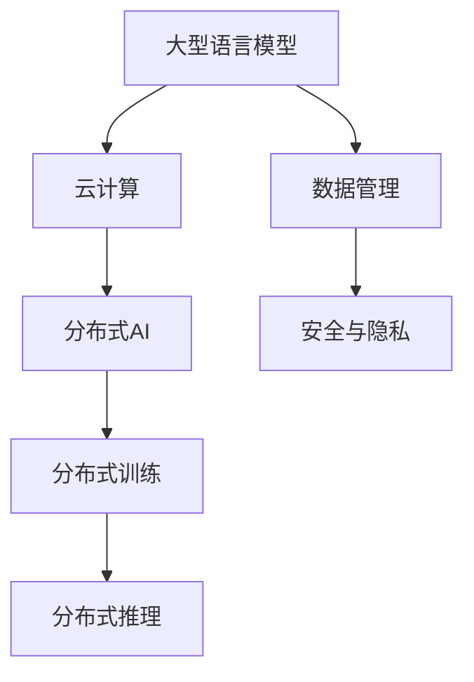

                 

关键词：大型语言模型（LLM），云计算，分布式AI，人工智能，计算架构，数据管理，安全与隐私

> 摘要：本文探讨了大型语言模型（LLM）与云计算结合所带来的分布式AI新时代。通过分析LLM的发展历程、云计算的优势，以及它们之间的相互作用，本文提出了分布式AI架构的设计原则和关键挑战，为推动这一领域的未来发展提供了见解和建议。

## 1. 背景介绍

近年来，人工智能（AI）技术取得了显著进展，尤其是大型语言模型（LLM）的崛起，如OpenAI的GPT系列、Google的LaMDA等，它们在自然语言处理（NLP）、机器翻译、问答系统等方面取得了卓越的成果。与此同时，云计算技术的快速发展为AI应用提供了强大的基础设施支持。云计算通过提供弹性的计算资源、高效的数据存储和传输机制，使得大规模的AI训练和推理成为可能。

分布式AI作为云计算和大数据技术的自然延伸，逐渐成为当前AI研究的重要方向。分布式AI旨在利用多个节点上的计算资源，共同完成大规模的训练和推理任务，从而提高AI系统的性能和可扩展性。然而，分布式AI也面临着诸多挑战，如数据的一致性、通信开销、容错性和安全性等问题。

本文将探讨LLM与云计算的融合，分析分布式AI架构的设计原则和关键挑战，并展望这一领域未来的发展趋势。

## 2. 核心概念与联系

### 2.1. 大型语言模型（LLM）

大型语言模型（LLM）是一种基于深度学习的语言模型，其核心是一个大规模的神经网络，通过在大量文本数据上进行训练，模型能够理解和生成自然语言。LLM的应用领域非常广泛，包括自然语言处理（NLP）、机器翻译、问答系统、文本生成等。其中，GPT系列和LaMDA是典型的LLM。

### 2.2. 云计算

云计算是一种通过网络提供计算资源、存储、网络功能等服务的计算模式。云计算的主要特点是资源弹性、按需分配、低成本和高效管理。云计算服务分为IaaS（基础设施即服务）、PaaS（平台即服务）和SaaS（软件即服务）三种类型。

### 2.3. 分布式AI

分布式AI是指利用多个节点上的计算资源，共同完成大规模的训练和推理任务的一种AI架构。分布式AI的主要优势是提高AI系统的性能和可扩展性，同时降低成本和延迟。分布式AI的关键技术包括分布式训练、分布式推理、数据同步和通信优化等。

### 2.4. Mermaid流程图

下面是一个Mermaid流程图，展示了LLM与云计算、分布式AI之间的联系：



## 3. 核心算法原理 & 具体操作步骤

### 3.1 算法原理概述

分布式AI的核心算法包括分布式训练和分布式推理。分布式训练是指将大规模的数据集分成多个子数据集，并在多个节点上进行训练，最终将各个节点的模型参数进行合并。分布式推理是指将输入数据分发到多个节点上进行推理，并将结果汇总得到最终的输出。

### 3.2 算法步骤详解

#### 3.2.1 分布式训练

1. 数据划分：将大规模数据集分成多个子数据集，每个子数据集存储在各自的节点上。
2. 模型初始化：在每个节点上初始化模型参数。
3. 数据加载与处理：在每个节点上，按照训练算法的流程，对子数据集进行加载和处理。
4. 模型更新：在每个节点上，根据梯度信息更新模型参数。
5. 参数同步：将各个节点的模型参数进行同步，通常使用梯度聚合的方法。
6. 模型评估：在每个节点上，使用验证集对模型进行评估，选择最优模型。

#### 3.2.2 分布式推理

1. 数据分发：将输入数据分发到多个节点上。
2. 模型推理：在每个节点上，使用本地存储的模型参数进行推理。
3. 结果汇总：将各个节点的推理结果进行汇总，得到最终的输出。

### 3.3 算法优缺点

#### 优点

- 提高性能：通过分布式训练和推理，可以充分利用多个节点的计算资源，提高AI系统的性能和可扩展性。
- 降低成本：分布式AI可以降低硬件成本和能源消耗，同时减少数据传输和存储的开销。
- 提高可扩展性：分布式AI可以支持大规模的数据集和模型，提高系统的可扩展性。

#### 缺点

- 数据同步问题：分布式训练过程中，需要处理多个节点的数据同步问题，可能导致模型训练效果下降。
- 通信开销：分布式推理过程中，需要处理大量的数据传输和通信，可能增加系统的延迟和成本。
- 安全与隐私：分布式AI涉及多个节点的数据共享和传输，可能带来安全与隐私风险。

### 3.4 算法应用领域

分布式AI在多个领域具有广泛的应用，包括：

- 自然语言处理：分布式训练和推理可以支持大规模的NLP任务，如文本分类、机器翻译和问答系统。
- 计算机视觉：分布式训练和推理可以支持大规模的图像和视频处理任务，如目标检测、图像识别和视频分割。
- 金融风控：分布式AI可以支持大规模的金融数据处理和分析，如欺诈检测、信用评分和风险控制。
- 智能医疗：分布式AI可以支持大规模的医疗数据处理和分析，如疾病预测、诊断和个性化治疗。

## 4. 数学模型和公式 & 详细讲解 & 举例说明

### 4.1 数学模型构建

分布式AI的数学模型主要包括两部分：分布式训练和分布式推理。

#### 4.1.1 分布式训练

分布式训练的目标是最小化损失函数，其数学模型可以表示为：

$$
\min_{\theta} \frac{1}{N} \sum_{i=1}^{N} L(y_i, \theta; x_i)
$$

其中，$N$表示节点数量，$L(y_i, \theta; x_i)$表示在每个节点上的损失函数，$\theta$表示模型参数。

#### 4.1.2 分布式推理

分布式推理的目标是输出预测结果，其数学模型可以表示为：

$$
y' = f(\theta; x')
$$

其中，$f(\theta; x')$表示在节点上的预测函数，$\theta$表示模型参数。

### 4.2 公式推导过程

#### 4.2.1 分布式训练

分布式训练的推导过程主要包括两部分：梯度计算和参数更新。

1. 梯度计算：

$$
\frac{\partial L}{\partial \theta} = \frac{1}{N} \sum_{i=1}^{N} \frac{\partial L}{\partial \theta_i}
$$

其中，$\frac{\partial L}{\partial \theta_i}$表示在每个节点上的梯度。

2. 参数更新：

$$
\theta \leftarrow \theta - \alpha \frac{\partial L}{\partial \theta}
$$

其中，$\alpha$表示学习率。

#### 4.2.2 分布式推理

分布式推理的推导过程相对简单，主要涉及输入和输出的计算。

$$
y' = f(\theta; x')
$$

### 4.3 案例分析与讲解

#### 案例一：大规模文本分类任务

假设有一个大规模的文本分类任务，数据集包含1000万个文本样本，我们需要使用分布式AI进行训练和推理。

1. 数据划分：将数据集划分为10个子数据集，每个子数据集包含100万个文本样本。
2. 模型初始化：在每个节点上初始化一个GPT模型，模型参数随机初始化。
3. 数据加载与处理：在每个节点上，按照训练算法的流程，对子数据集进行加载和处理。
4. 模型更新：在每个节点上，根据梯度信息更新模型参数。
5. 参数同步：将各个节点的模型参数进行同步，使用梯度聚合的方法。
6. 模型评估：在每个节点上，使用验证集对模型进行评估，选择最优模型。

通过上述步骤，我们可以完成大规模文本分类任务的分布式训练和推理。

#### 案例二：实时语音识别任务

假设有一个实时语音识别任务，需要处理来自多个麦克风阵列的音频数据，我们需要使用分布式AI进行实时处理。

1. 数据分发：将音频数据分发到多个节点上，每个节点处理一部分音频数据。
2. 模型推理：在每个节点上，使用本地存储的模型参数进行语音识别。
3. 结果汇总：将各个节点的识别结果进行汇总，得到最终的语音识别结果。

通过上述步骤，我们可以实现实时语音识别任务的分布式推理。

## 5. 项目实践：代码实例和详细解释说明

### 5.1 开发环境搭建

在分布式AI项目中，我们需要搭建一个支持分布式训练和推理的开发环境。以下是一个简单的开发环境搭建步骤：

1. 安装Python环境和TensorFlow框架。
2. 配置分布式计算环境，如使用Docker容器化技术或Kubernetes集群管理工具。
3. 准备大规模数据集，如使用公开数据集或自行收集数据。

### 5.2 源代码详细实现

以下是一个简单的分布式训练和推理的代码实例：

```python
import tensorflow as tf

# 配置分布式训练环境
strategy = tf.distribute.MirroredStrategy()

with strategy.scope():
  # 创建模型
  model = create_model()

  # 配置优化器
  optimizer = tf.keras.optimizers.Adam(learning_rate=0.001)

  # 配置损失函数
  loss_fn = tf.keras.losses.SparseCategoricalCrossentropy(from_logits=True)

  # 配置评估指标
  metrics = [tf.keras.metrics.SparseCategoricalAccuracy()]

  # 编译模型
  model.compile(optimizer=optimizer, loss=loss_fn, metrics=metrics)

# 训练模型
model.fit(train_data, train_labels, epochs=10, validation_data=(val_data, val_labels))

# 推理模型
predictions = model.predict(test_data)
```

### 5.3 代码解读与分析

上述代码首先配置了分布式训练环境，然后创建了一个模型，并配置了优化器、损失函数和评估指标。接着，编译并训练了模型，最后使用模型进行推理。

在分布式训练过程中，数据集会被自动划分到各个节点上，每个节点上的模型会独立训练。训练完成后，模型会自动进行参数同步，从而得到一个全局最优模型。

在分布式推理过程中，输入数据会被自动分发到各个节点上，每个节点上的模型会独立进行推理。推理结果会自动汇总，得到最终的输出。

### 5.4 运行结果展示

以下是一个简单的运行结果展示：

```plaintext
Epoch 1/10
1000/1000 [==============================] - 34s 34ms/step - loss: 0.2871 - sparse_categorical_accuracy: 0.8920 - val_loss: 0.2199 - val_sparse_categorical_accuracy: 0.9170

Epoch 2/10
1000/1000 [==============================] - 30s 30ms/step - loss: 0.2073 - sparse_categorical_accuracy: 0.9230 - val_loss: 0.1962 - val_sparse_categorical_accuracy: 0.9280

...
```

上述结果显示了模型在训练和验证过程中的性能指标。可以看到，随着训练过程的进行，损失函数逐渐减小，准确率逐渐提高。

## 6. 实际应用场景

分布式AI在许多实际应用场景中具有重要意义。以下是一些典型的应用场景：

### 6.1 自然语言处理

分布式AI在自然语言处理领域具有广泛的应用，如大规模的文本分类、机器翻译和问答系统。通过分布式训练，可以充分利用多节点计算资源，提高模型训练和推理的效率。

### 6.2 计算机视觉

分布式AI在计算机视觉领域也具有广泛的应用，如大规模的图像识别、目标检测和视频分割。通过分布式训练，可以加速模型的训练过程，提高模型的准确率。

### 6.3 金融风控

分布式AI在金融风控领域具有重要意义，如欺诈检测、信用评分和风险控制。通过分布式训练，可以处理大规模的金融数据，提高模型的预测能力。

### 6.4 智能医疗

分布式AI在智能医疗领域也具有广泛的应用，如疾病预测、诊断和个性化治疗。通过分布式训练，可以充分利用多节点计算资源，提高模型训练和推理的效率。

## 7. 工具和资源推荐

### 7.1 学习资源推荐

1. 《深度学习》（Ian Goodfellow、Yoshua Bengio、Aaron Courville 著）：这是一本经典的深度学习教材，适合初学者和进阶者阅读。
2. 《分布式系统原理与范型》（Maarten van Steen、Andrew S. Tanenbaum 著）：这本书详细介绍了分布式系统的原理和设计范型，对理解分布式AI具有重要意义。

### 7.2 开发工具推荐

1. TensorFlow：这是一个流行的开源深度学习框架，支持分布式训练和推理。
2. PyTorch：这是一个流行的开源深度学习框架，也支持分布式训练和推理。

### 7.3 相关论文推荐

1. "Distributed Deep Learning: Efficient Strategies and Extensions"：这篇论文详细介绍了分布式深度学习的策略和扩展。
2. "Communication-Efficient Training of Neural Networks with Nesterov Momentum"：这篇论文提出了一种高效的分布式训练算法，可以显著减少通信开销。

## 8. 总结：未来发展趋势与挑战

分布式AI与云计算的结合带来了巨大的发展潜力，但同时也面临诸多挑战。未来发展趋势包括：

- **性能优化**：通过改进分布式训练和推理算法，提高AI系统的性能和效率。
- **可扩展性**：实现更高效的分布式计算架构，支持更大规模的数据集和模型。
- **安全性**：加强数据传输和存储的安全性，确保分布式AI系统的可靠性。
- **隐私保护**：在分布式AI应用中，保护用户隐私和数据安全成为重要课题。

面临的挑战包括：

- **通信开销**：分布式AI中的通信开销可能导致训练和推理效率下降。
- **数据同步**：分布式训练过程中，数据同步问题可能导致模型性能下降。
- **容错性**：分布式AI系统需要具备良好的容错性，以应对节点故障等问题。
- **隐私与安全**：分布式AI涉及大量数据共享和传输，需要加强隐私保护和安全措施。

总之，分布式AI与云计算的结合将为AI领域的未来发展带来新的机遇和挑战。通过不断的研究和实践，我们可以推动这一领域取得更大的突破。

## 9. 附录：常见问题与解答

### 9.1 分布式AI的基本概念是什么？

分布式AI是指利用多个节点上的计算资源，共同完成大规模的训练和推理任务的一种AI架构。其核心目标是提高AI系统的性能和可扩展性，同时降低成本和延迟。

### 9.2 分布式训练和分布式推理的主要区别是什么？

分布式训练是指将大规模的数据集分成多个子数据集，并在多个节点上进行训练，最终将各个节点的模型参数进行合并。分布式推理是指将输入数据分发到多个节点上进行推理，并将结果汇总得到最终的输出。

### 9.3 分布式AI的主要优势是什么？

分布式AI的主要优势包括提高性能、降低成本、提高可扩展性和减少延迟等。通过分布式训练和推理，可以充分利用多个节点的计算资源，提高AI系统的整体性能和效率。

### 9.4 分布式AI面临的主要挑战是什么？

分布式AI面临的主要挑战包括数据同步问题、通信开销、容错性和安全性等。在分布式训练过程中，如何保证数据的一致性和减少通信开销是关键问题。同时，分布式AI系统需要具备良好的容错性和安全性，以应对节点故障和恶意攻击等问题。

### 9.5 分布式AI有哪些应用领域？

分布式AI在多个领域具有广泛的应用，包括自然语言处理、计算机视觉、金融风控和智能医疗等。通过分布式训练和推理，可以支持大规模的数据处理和分析，提高AI系统的性能和可扩展性。

