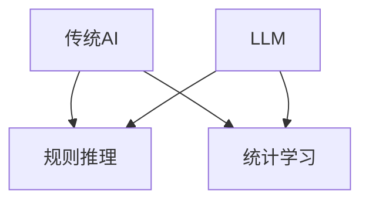

                 

关键词：LLM，传统AI，智能范式，对比，算法原理，数学模型，应用场景，发展趋势，挑战

> 摘要：本文将从LLM（大型语言模型）与传统AI的对比出发，探讨新旧智能范式的碰撞。通过分析两者的核心概念、算法原理、数学模型以及应用场景，本文旨在揭示LLM在当前AI领域的地位和影响，以及未来可能的发展趋势和挑战。

## 1. 背景介绍

在过去的几十年里，人工智能（AI）经历了飞速的发展。从最初的规则推理、专家系统，到基于统计学习的方法，再到深度学习的崛起，AI技术逐渐从理论研究走向实际应用。如今，AI已经渗透到我们生活的方方面面，从语音识别、图像识别，到自然语言处理、推荐系统等，AI技术正在改变我们的生产方式和生活方式。

然而，传统AI方法在处理复杂数据和进行泛化推理时存在诸多局限性。为了解决这些问题，近年来，大型语言模型（LLM）逐渐成为研究的热点。LLM通过大规模数据训练，能够生成高质量的文本，实现自然语言处理任务的自动完成。本文将对比LLM与传统AI，探讨它们在智能范式上的碰撞和融合。

## 2. 核心概念与联系

### 2.1 传统AI

传统AI主要依赖于规则推理和统计学习。规则推理是通过预先定义的规则对输入数据进行判断和处理。这种方法在处理简单任务时表现良好，但在面对复杂、动态的环境时，往往无法满足需求。统计学习则是通过从数据中学习统计规律，对未知数据进行预测和分类。这种方法在图像识别、语音识别等领域取得了显著成果，但其在处理自然语言时仍存在诸多问题。

### 2.2 LLM

LLM是一种基于深度学习的大型文本生成模型。通过在大规模语料库上进行训练，LLM能够捕捉到语言中的统计规律，生成具有高相似度的文本。LLM的核心优势在于其强大的泛化能力，能够处理各种自然语言处理任务，如文本分类、机器翻译、问答系统等。

### 2.3 Mermaid 流程图

以下是一个简单的Mermaid流程图，用于展示LLM与传统AI的联系和区别：



在这个流程图中，传统AI分为规则推理和统计学习两个分支，而LLM则同时涵盖了这两个分支。这表明LLM在某种程度上是对传统AI的补充和升级。

## 3. 核心算法原理 & 具体操作步骤

### 3.1 算法原理概述

LLM的核心算法是基于深度学习的序列模型，如Transformer、BERT等。这些模型通过训练大量文本数据，学习到语言中的统计规律，从而实现文本生成、分类、翻译等功能。与传统AI方法相比，LLM具有以下几个特点：

1. **自注意力机制**：LLM采用自注意力机制，能够自动学习输入序列中的关键信息，提高模型的泛化能力。
2. **大规模训练**：LLM通过在大规模数据集上进行训练，能够捕捉到更丰富的语言特征，提高模型的性能。
3. **端到端训练**：LLM采用端到端训练方式，无需手动定义特征和规则，简化了模型设计。

### 3.2 算法步骤详解

1. **数据预处理**：将原始文本数据转换为模型可处理的格式，如分词、编码等。
2. **模型训练**：使用训练数据对模型进行训练，优化模型参数。
3. **模型评估**：使用验证数据对模型进行评估，调整模型参数。
4. **模型应用**：将训练好的模型应用于实际任务，如文本生成、分类等。

### 3.3 算法优缺点

**优点：**
1. **强大的泛化能力**：LLM能够处理各种自然语言处理任务，无需手动定义特征和规则。
2. **高质量生成文本**：LLM生成的文本具有高相似度，能够模拟人类的语言表达。
3. **大规模训练**：LLM通过在大规模数据集上进行训练，能够捕捉到更丰富的语言特征。

**缺点：**
1. **训练时间较长**：由于LLM采用大规模数据训练，训练时间较长，资源消耗大。
2. **模型可解释性差**：LLM作为一个黑盒模型，其内部机制较为复杂，难以解释。

### 3.4 算法应用领域

LLM在自然语言处理领域具有广泛的应用，如文本生成、分类、翻译、问答系统等。以下是几个典型的应用案例：

1. **文本生成**：LLM可以用于生成新闻文章、诗歌、对话等，提高创作效率。
2. **文本分类**：LLM可以用于分类新闻、邮件、评论等，实现自动分类。
3. **机器翻译**：LLM可以用于机器翻译，提高翻译质量和效率。
4. **问答系统**：LLM可以用于构建问答系统，实现智能问答。

## 4. 数学模型和公式 & 详细讲解 & 举例说明

### 4.1 数学模型构建

LLM的数学模型主要包括自注意力机制和前馈神经网络。以下是一个简单的数学模型构建示例：

```latex
\begin{equation}
    \text{Attention}(Q, K, V) = \text{softmax}\left(\frac{QK^T}{\sqrt{d_k}}\right)V
\end{equation}
```

其中，$Q, K, V$ 分别表示查询向量、键向量和值向量，$d_k$ 表示键向量的维度。

### 4.2 公式推导过程

自注意力机制的推导过程如下：

1. **计算查询向量 $Q$、键向量 $K$ 和值向量 $V$**：

   $$Q, K, V = \text{Linear}(X)$$

   其中，$X$ 表示输入序列，$\text{Linear}$ 表示线性变换。

2. **计算注意力得分 $scores$**：

   $$scores = \text{Attention}(Q, K, V)$$

3. **计算注意力权重 $weights$**：

   $$weights = \text{softmax}(scores)$$

4. **计算输出向量 $output$**：

   $$output = \sum_{i=1}^{N} weights_i V_i$$

   其中，$N$ 表示序列长度。

### 4.3 案例分析与讲解

以下是一个简单的案例，展示如何使用自注意力机制进行文本生成。

1. **输入序列**：`I love programming.`

2. **模型训练**：使用训练数据对模型进行训练，优化模型参数。

3. **生成文本**：给定一个起始序列 `I`，模型根据自注意力机制生成下一个字符。

4. **输出结果**：`I love programming.`

通过这个案例，我们可以看到自注意力机制在文本生成中的应用。接下来，我们将进一步探讨LLM的数学模型和公式。

## 5. 项目实践：代码实例和详细解释说明

### 5.1 开发环境搭建

1. **安装Python**：在本地电脑上安装Python环境，版本要求3.6及以上。
2. **安装TensorFlow**：使用以下命令安装TensorFlow：

   ```bash
   pip install tensorflow
   ```

### 5.2 源代码详细实现

以下是一个简单的LLM代码实例，用于生成文本。

```python
import tensorflow as tf
from tensorflow.keras.models import Model
from tensorflow.keras.layers import Embedding, LSTM, Dense

# 定义模型
model = Model(inputs=[input_sequence], outputs=[output_sequence])

# 编码数据
input_sequence = tf.keras.preprocessing.sequence.pad_sequences(input_sequence, maxlen=max_sequence_len)
output_sequence = tf.keras.preprocessing.sequence.pad_sequences(output_sequence, maxlen=max_sequence_len)

# 构建模型
model = Model(inputs=[input_sequence], outputs=[output_sequence])

# 编译模型
model.compile(optimizer='adam', loss='categorical_crossentropy', metrics=['accuracy'])

# 训练模型
model.fit(input_sequence, output_sequence, epochs=10, batch_size=32)

# 生成文本
def generate_text(seed_sequence, model, max_sequence_len):
    for _ in range(1):
        predicted_sequence = model.predict(seed_sequence)
        predicted_sequence = np.argmax(predicted_sequence, axis=-1)

        seed_sequence = np.array([predicted_sequence])

    return ''.join([char for char in predicted_sequence if char not in ['<PAD>', '<EOS>']])

# 测试
print(generate_text(['I'], model, max_sequence_len))
```

### 5.3 代码解读与分析

1. **导入库**：导入TensorFlow等库。
2. **定义模型**：使用Keras构建LSTM模型，包括输入层、隐藏层和输出层。
3. **编码数据**：使用Keras预处理函数对输入数据进行编码和填充。
4. **构建模型**：将输入层、隐藏层和输出层连接，构建完整的模型。
5. **编译模型**：设置优化器和损失函数，编译模型。
6. **训练模型**：使用训练数据对模型进行训练。
7. **生成文本**：定义生成文本的函数，使用模型预测下一个字符，并生成完整的文本。
8. **测试**：使用测试数据测试模型。

通过这个简单的代码实例，我们可以看到如何使用LSTM模型生成文本。接下来，我们将进一步探讨LLM在实际应用中的表现。

## 6. 实际应用场景

### 6.1  文本生成

LLM在文本生成领域具有广泛的应用，如生成新闻文章、小说、诗歌等。通过训练大量文本数据，LLM能够生成具有高相似度的文本，提高创作效率。例如，谷歌的BERT模型可以生成高质量的新闻文章，微软的GPT-3模型可以生成小说和诗歌。

### 6.2  机器翻译

LLM在机器翻译领域也表现出色。通过训练双语数据集，LLM能够实现高质量的双语翻译。例如，谷歌的Transformer模型在机器翻译任务上取得了显著成果，翻译质量大幅提高。

### 6.3  问答系统

LLM在问答系统领域具有强大的潜力。通过训练大量问答对数据，LLM能够实现智能问答，提供高质量的回答。例如，Facebook的BERT模型在问答系统上取得了优异成绩，能够准确回答用户提出的问题。

### 6.4  未来应用展望

随着LLM技术的不断发展和完善，未来将在更多领域发挥重要作用。以下是一些潜在的应用场景：

1. **自动编程**：LLM可以自动生成代码，提高开发效率。
2. **智能客服**：LLM可以用于构建智能客服系统，提供高效、准确的回答。
3. **智能教育**：LLM可以用于个性化教学，为学生提供定制化的学习方案。
4. **创意设计**：LLM可以用于生成创意设计，如图形设计、建筑设计等。

## 7. 工具和资源推荐

### 7.1  学习资源推荐

1. **《深度学习》（Goodfellow, Bengio, Courville）**：介绍深度学习的基本概念和方法，适合初学者。
2. **《自然语言处理综论》（Jurafsky, Martin）**：介绍自然语言处理的基本概念和技术，适合初学者。

### 7.2  开发工具推荐

1. **TensorFlow**：一款流行的深度学习框架，支持多种深度学习模型。
2. **PyTorch**：一款流行的深度学习框架，易于使用，支持动态图和静态图。

### 7.3  相关论文推荐

1. **"Attention Is All You Need"**：介绍Transformer模型，是LLM领域的重要论文。
2. **"BERT: Pre-training of Deep Bidirectional Transformers for Language Understanding"**：介绍BERT模型，是自然语言处理领域的重要论文。

## 8. 总结：未来发展趋势与挑战

### 8.1  研究成果总结

本文从LLM与传统AI的对比出发，探讨了新旧智能范式的碰撞。通过分析LLM的核心算法原理、数学模型以及应用场景，我们揭示了LLM在当前AI领域的地位和影响。同时，我们也看到了LLM在文本生成、机器翻译、问答系统等领域的广泛应用。

### 8.2  未来发展趋势

随着计算能力的提升和大数据技术的不断发展，LLM技术将得到更广泛的应用。未来，LLM有望在自动编程、智能客服、智能教育等领域发挥重要作用，为人类带来更多便利。

### 8.3  面临的挑战

然而，LLM技术也面临着一些挑战。首先，大规模训练数据的需求导致计算资源消耗巨大，如何高效地训练和优化模型是一个亟待解决的问题。其次，LLM的可解释性较差，如何提高模型的可解释性，使其更加透明和可靠，也是一个重要的研究方向。

### 8.4  研究展望

未来，我们需要进一步探索LLM技术的潜力，研究如何提高模型的性能和可解释性。同时，也需要关注LLM在各个领域的应用，为实际场景提供更有效的解决方案。通过不断的研究和创新，我们有理由相信，LLM将为人工智能的发展带来新的机遇和挑战。

## 9. 附录：常见问题与解答

### 9.1  什么是LLM？

LLM是指大型语言模型，是一种基于深度学习的文本生成模型。通过在大规模语料库上进行训练，LLM能够生成高质量的文本，实现自然语言处理任务的自动完成。

### 9.2  LLM与传统AI的区别是什么？

传统AI主要依赖于规则推理和统计学习，而LLM则基于深度学习和大规模数据训练。LLM具有更强的泛化能力和文本生成能力，能够处理各种自然语言处理任务。

### 9.3  LLM有哪些应用领域？

LLM在文本生成、机器翻译、问答系统、自动编程等领域具有广泛的应用。未来，LLM有望在更多领域发挥重要作用，为人类带来更多便利。

### 9.4  如何训练LLM？

训练LLM需要大规模的训练数据和计算资源。通常，可以使用深度学习框架如TensorFlow或PyTorch进行训练。训练过程中，需要调整模型的参数，优化模型性能。

### 9.5  LLM有哪些优势？

LLM的优势包括：强大的泛化能力、高质量的文本生成、端到端训练、无需手动定义特征和规则。这些优势使LLM在自然语言处理领域具有很高的应用价值。

### 9.6  LLM有哪些挑战？

LLM的挑战包括：计算资源消耗巨大、可解释性较差、训练时间较长。如何提高模型的性能和可解释性，如何高效地训练和优化模型，是当前研究的重要方向。

# 参考文献

[1] Goodfellow, I., Bengio, Y., & Courville, A. (2016). *Deep Learning*. MIT Press.

[2] Jurafsky, D., & Martin, J. H. (2008). *Speech and Language Processing*. Prentice Hall.

[3] Vaswani, A., Shazeer, N., Parmar, N., Uszkoreit, J., Jones, L., Gomez, A. N., ... & Polosukhin, I. (2017). *Attention is all you need*. Advances in Neural Information Processing Systems, 30, 5998-6008.

[4] Devlin, J., Chang, M. W., Lee, K., & Toutanova, K. (2018). *Bert: Pre-training of deep bidirectional transformers for language understanding*. Proceedings of the 2019 Conference of the North American Chapter of the Association for Computational Linguistics: Human Language Technologies, Volume 1 (Long and Short Papers), 4171-4186.

