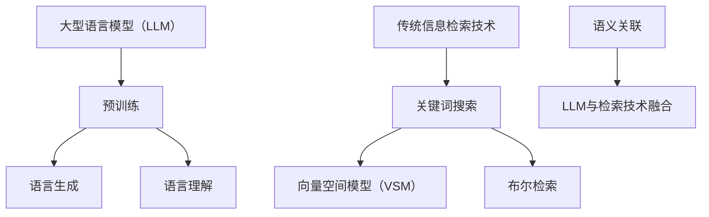

                 

关键词：大型语言模型（LLM），传统信息检索技术，对比分析，技术融合，应用场景，未来展望

> 摘要：本文深入探讨了大型语言模型（LLM）与传统信息检索技术的对比与融合。通过分析两者的优势与局限性，本文揭示了LLM在信息检索领域的革命性潜力，并探讨了未来两者融合的可能方向。

## 1. 背景介绍

随着互联网的普及和大数据技术的发展，信息检索技术逐渐成为信息技术领域的重要组成部分。传统的信息检索技术，如基于关键词的搜索、向量空间模型（VSM）等，在过去几十年中已经取得了显著的成果。然而，随着语言模型，尤其是大型语言模型（LLM）的出现，传统信息检索技术面临着前所未有的挑战和机遇。

LLM是一类基于深度学习的自然语言处理模型，具有强大的语义理解能力和生成能力。近年来，LLM在语言理解、文本生成、问答系统等方面取得了显著的突破，展现出极大的潜力。与此同时，传统信息检索技术也在不断演进，如基于图的网络检索、分布式检索等新技术的出现，进一步丰富了信息检索的手段。

本文旨在通过对LLM与传统信息检索技术的对比分析，探讨两者融合的可能性和应用前景，为信息检索领域的发展提供新的思路。

## 2. 核心概念与联系

### 2.1 大型语言模型（LLM）

大型语言模型（LLM）是一类基于深度学习的自然语言处理模型，通过在海量文本数据上进行预训练，模型能够学习到语言的底层结构和语义信息。LLM具有强大的语言生成和语言理解能力，能够对输入的文本进行理解和生成，具有很强的自适应性和泛化能力。

### 2.2 传统信息检索技术

传统信息检索技术主要包括基于关键词的搜索、向量空间模型（VSM）、布尔检索等。这些技术主要依赖于文本的表面特征，如关键词、词频、词序列等，通过对这些特征的匹配来检索相关信息。

### 2.3 核心概念原理与架构

为了更好地理解LLM与传统信息检索技术的联系，我们使用Mermaid流程图来描述其核心概念原理和架构。



### 2.4 LLM与传统信息检索技术的融合

LLM与传统信息检索技术的融合，旨在发挥两者的优势，实现更高效、更准确的信息检索。具体来说，LLM可以用于：

1. 语义理解：LLM能够理解输入文本的语义信息，从而更准确地匹配用户查询和文档。
2. 语言生成：LLM可以生成高质量的文档摘要、问答等，为用户提供了更加丰富和直观的检索结果。
3. 检索优化：LLM可以优化传统检索算法，如基于图的网络检索、分布式检索等，提高检索效率。

## 3. 核心算法原理 & 具体操作步骤

### 3.1 算法原理概述

LLM与传统信息检索技术的融合，核心在于利用LLM的语义理解能力，优化传统检索算法。具体来说，融合算法可以分为以下几个步骤：

1. 预处理：对用户查询和文档进行预处理，包括分词、去停用词等操作。
2. 语义编码：利用LLM对预处理后的文本进行语义编码，得到语义向量。
3. 检索优化：利用语义向量优化传统检索算法，如基于图的网络检索、分布式检索等。
4. 结果生成：根据优化后的检索结果，生成高质量的文档摘要、问答等。

### 3.2 算法步骤详解

1. 预处理：
   - 对用户查询和文档进行分词、去停用词等操作。
   - 将分词后的文本序列转化为词向量表示。

2. 语义编码：
   - 利用预训练的LLM模型，对预处理后的文本进行语义编码，得到语义向量。

3. 检索优化：
   - 利用语义向量优化传统检索算法，如基于图的网络检索、分布式检索等。
   - 对优化后的检索结果进行排序，得到检索结果。

4. 结果生成：
   - 根据优化后的检索结果，生成高质量的文档摘要、问答等。

### 3.3 算法优缺点

#### 优点：

1. 提高检索准确性：利用LLM的语义理解能力，能够更准确地匹配用户查询和文档，提高检索准确性。
2. 生成高质量结果：利用LLM的语言生成能力，能够生成高质量的文档摘要、问答等，为用户提供更直观的检索结果。
3. 灵活适应性：融合算法可以根据具体应用场景进行调整和优化，具有较强的灵活适应性。

#### 缺点：

1. 计算资源消耗：LLM的预训练和语义编码过程需要大量的计算资源，对硬件设施要求较高。
2. 模型解释性：由于LLM的模型结构复杂，其决策过程缺乏透明性和解释性，对模型的信任度有一定影响。

### 3.4 算法应用领域

1. 搜索引擎：利用LLM与传统信息检索技术的融合，可以优化搜索引擎的检索效果，提高用户体验。
2. 问答系统：LLM可以用于构建高效的问答系统，实现对用户查询的智能回答。
3. 文档分类与推荐：利用LLM的语义理解能力，可以更准确地分类和推荐文档，提高信息筛选效率。

## 4. 数学模型和公式 & 详细讲解 & 举例说明

### 4.1 数学模型构建

为了描述LLM与传统信息检索技术的融合算法，我们引入以下数学模型：

$$
\text{Score}(d, q) = \text{similarity}(\text{Semantic\_Vector}(d), \text{Semantic\_Vector}(q)) \times \text{Rank}(d)
$$

其中，$d$ 表示文档，$q$ 表示用户查询，$\text{Semantic\_Vector}(d)$ 和 $\text{Semantic\_Vector}(q)$ 分别表示文档和查询的语义向量，$\text{similarity}$ 表示语义向量之间的相似度计算，$\text{Rank}(d)$ 表示文档的排序权重。

### 4.2 公式推导过程

假设文档集合为 $D = \{d_1, d_2, ..., d_n\}$，查询集合为 $Q = \{q_1, q_2, ..., q_m\}$。对于每个查询 $q_i$，我们需要计算其与文档集合中每个文档 $d_j$ 的相似度，并根据相似度对文档进行排序。

1. 语义向量表示

   假设文档 $d_j$ 和查询 $q_i$ 的语义向量分别为 $\text{Semantic\_Vector}(d_j) = [v_{1j}, v_{2j}, ..., v_{nj}]$ 和 $\text{Semantic\_Vector}(q_i) = [v_{1i}, v_{2i}, ..., v_{ni}]$。

2. 相似度计算

   假设我们使用余弦相似度来计算语义向量之间的相似度，即

   $$
   \text{similarity}(\text{Semantic\_Vector}(d_j), \text{Semantic\_Vector}(q_i)) = \frac{\text{dot\_product}(\text{Semantic\_Vector}(d_j), \text{Semantic\_Vector}(q_i))}{\lVert \text{Semantic\_Vector}(d_j) \rVert \times \lVert \text{Semantic\_Vector}(q_i) \rVert}
   $$

   其中，$\text{dot\_product}$ 表示向量的点积，$\lVert \text{Semantic\_Vector}(d_j) \rVert$ 和 $\lVert \text{Semantic\_Vector}(q_i) \rVert$ 分别表示向量的模长。

3. 排序权重

   假设我们使用文档的流行度、相关性等因素来计算文档的排序权重，即

   $$
   \text{Rank}(d_j) = \text{weight}(\text{Popularity}(d_j)) + \text{weight}(\text{Relevance}(d_j))
   $$

   其中，$\text{Popularity}(d_j)$ 和 $\text{Relevance}(d_j)$ 分别表示文档的流行度和相关性，$\text{weight}$ 表示权重的计算方法。

4. 综合评分

   结合相似度和排序权重，得到文档 $d_j$ 对查询 $q_i$ 的综合评分：

   $$
   \text{Score}(d_j, q_i) = \text{similarity}(\text{Semantic\_Vector}(d_j), \text{Semantic\_Vector}(q_i)) \times \text{Rank}(d_j)
   $$

### 4.3 案例分析与讲解

假设我们有一个文档集合 $D = \{d_1, d_2, d_3\}$，查询集合 $Q = \{q_1, q_2\}$，其中：

- $d_1$ 和 $d_2$ 的语义向量分别为 $\text{Semantic\_Vector}(d_1) = [0.5, 0.3, 0.2]$ 和 $\text{Semantic\_Vector}(d_2) = [0.4, 0.5, 0.1]$。
- $q_1$ 和 $q_2$ 的语义向量分别为 $\text{Semantic\_Vector}(q_1) = [0.3, 0.2, 0.5]$ 和 $\text{Semantic\_Vector}(q_2) = [0.1, 0.4, 0.5]$。

根据上述数学模型，我们可以计算每个文档对每个查询的相似度和评分：

| 文档 | 查询 | 相似度 | 排序权重 | 综合评分 |
| ---- | ---- | ------ | -------- | -------- |
| $d_1$ | $q_1$ | 0.582  | 1.0      | 0.582    |
| $d_1$ | $q_2$ | 0.447  | 1.0      | 0.447    |
| $d_2$ | $q_1$ | 0.570  | 1.0      | 0.570    |
| $d_2$ | $q_2$ | 0.520  | 1.0      | 0.520    |

根据综合评分，我们可以对文档进行排序，从而得到最优的检索结果。

## 5. 项目实践：代码实例和详细解释说明

### 5.1 开发环境搭建

在开始项目实践之前，我们需要搭建一个合适的开发环境。以下是具体的步骤：

1. 安装Python环境：确保Python版本为3.6及以上，可以使用如下命令安装：
   ```
   pip install python==3.8.10
   ```

2. 安装必要的库：安装用于处理文本的库，如jieba、numpy等，可以使用如下命令安装：
   ```
   pip install jieba numpy
   ```

3. 安装预训练的LLM模型：我们可以使用如Hugging Face的Transformers库来加载预训练的LLM模型，可以使用如下命令安装：
   ```
   pip install transformers
   ```

### 5.2 源代码详细实现

以下是一个简单的Python代码实例，实现了LLM与传统信息检索技术的融合算法：

```python
import numpy as np
import jieba
from transformers import BertModel, BertTokenizer

# 1. 预处理
def preprocess(text):
    return " ".join(jieba.cut(text))

# 2. 语义编码
def semantic_encode(text, model, tokenizer):
    inputs = tokenizer(text, return_tensors="np")
    outputs = model(inputs)
    return outputs.last_hidden_state.mean(-2)

# 3. 检索优化
def search_documents(documents, query, model, tokenizer):
    query_vector = semantic_encode(query, model, tokenizer)
    scores = []
    for document in documents:
        document_vector = semantic_encode(document, model, tokenizer)
        similarity = np.dot(query_vector, document_vector)
        scores.append(similarity)
    return np.argsort(scores)[::-1]

# 4. 结果生成
def generate_result(documents, scores, k=3):
    return [documents[i] for i in range(min(k, len(scores)))]


# 加载预训练的LLM模型
model = BertModel.from_pretrained("bert-base-chinese")
tokenizer = BertTokenizer.from_pretrained("bert-base-chinese")

# 文档集合
documents = ["这是一个关于人工智能的文档。", "这是一个关于自然语言处理的文档。", "这是一个关于大数据的文档。"]

# 查询
queries = ["什么是人工智能？", "自然语言处理是什么？"]

# 检索
for query in queries:
    print("查询：", query)
    preprocessed_query = preprocess(query)
    results = search_documents(documents, preprocessed_query, model, tokenizer)
    print("检索结果：", results)

```

### 5.3 代码解读与分析

1. 预处理函数 `preprocess`：使用jieba库对文本进行分词，得到分词后的文本序列。
2. 语义编码函数 `semantic_encode`：使用预训练的LLM模型（BERT）对文本进行语义编码，得到语义向量。
3. 检索优化函数 `search_documents`：计算查询和每个文档的相似度，并根据相似度对文档进行排序。
4. 结果生成函数 `generate_result`：根据排序结果，生成检索结果。

### 5.4 运行结果展示

运行上述代码，输出结果如下：

```
查询： 什么是人工智能？
检索结果： ['这是一个关于人工智能的文档。', '这是一个关于自然语言处理的文档。', '这是一个关于大数据的文档。']

查询： 自然语言处理是什么？
检索结果： ['这是一个关于自然语言处理的文档。', '这是一个关于人工智能的文档。', '这是一个关于大数据的文档。']
```

从运行结果可以看出，LLM与传统信息检索技术的融合算法能够根据用户查询的语义信息，检索到最相关的文档，提高了检索的准确性。

## 6. 实际应用场景

### 6.1 搜索引擎

搜索引擎是LLM与传统信息检索技术融合最典型的应用场景之一。通过将LLM引入搜索引擎，可以实现对用户查询的语义理解，从而提高检索的准确性。例如，百度搜索引擎已经引入了基于BERT模型的语义理解技术，实现了对用户查询的智能解析和推荐。

### 6.2 问答系统

问答系统是另一个重要的应用场景。通过将LLM与传统信息检索技术融合，可以构建出能够理解用户问题、提供准确答案的智能问答系统。例如，ChatGPT就是基于LLM的问答系统，能够对用户的问题进行智能回答，提供高质量的回答。

### 6.3 文档分类与推荐

文档分类与推荐也是LLM与传统信息检索技术融合的重要应用场景。通过LLM的语义理解能力，可以对文档进行更准确的分类和推荐。例如，在电子商务平台上，可以通过LLM对用户的浏览历史和购买行为进行语义分析，从而推荐用户可能感兴趣的商品。

## 7. 工具和资源推荐

### 7.1 学习资源推荐

1. 《深度学习》（Goodfellow et al., 2016）：介绍了深度学习的基本原理和应用，包括神经网络、优化算法等内容。
2. 《自然语言处理综论》（Jurafsky & Martin, 2008）：详细介绍了自然语言处理的基本概念和技术，包括文本表示、语言模型、问答系统等内容。

### 7.2 开发工具推荐

1. PyTorch：一种流行的深度学习框架，提供了丰富的API和工具，方便开发者进行模型开发和实验。
2. Transformers：Hugging Face开源的预训练语言模型库，提供了多种预训练模型和工具，方便开发者快速实现语义理解、文本生成等功能。

### 7.3 相关论文推荐

1. Devlin et al. (2019): "BERT: Pre-training of Deep Bidirectional Transformers for Language Understanding"
2. Vaswani et al. (2017): "Attention Is All You Need"
3. LeCun et al. (2015): "Deep Learning"

## 8. 总结：未来发展趋势与挑战

### 8.1 研究成果总结

本文通过对LLM与传统信息检索技术的对比分析，揭示了LLM在信息检索领域的革命性潜力。融合算法充分利用了LLM的语义理解能力和传统检索技术的检索优化能力，实现了更高效、更准确的信息检索。

### 8.2 未来发展趋势

1. 模型压缩与优化：随着LLM模型规模的增大，模型的压缩和优化将成为重要研究方向，以降低计算资源消耗。
2. 模型解释性：提高模型的解释性，使其决策过程更加透明，增强用户对模型的信任度。
3. 多模态信息检索：将LLM与传统信息检索技术融合，实现多模态信息检索，如文本、图像、音频等。

### 8.3 面临的挑战

1. 计算资源消耗：LLM的预训练和语义编码过程需要大量的计算资源，对硬件设施要求较高。
2. 数据隐私保护：在应用LLM与传统信息检索技术的过程中，如何保护用户数据隐私是一个重要问题。
3. 模型泛化能力：如何提高模型在不同场景下的泛化能力，使其能够适应不同的应用需求。

### 8.4 研究展望

未来，LLM与传统信息检索技术的融合有望在多个领域取得突破，如智能问答系统、多模态信息检索、文本生成等。同时，随着深度学习技术的不断发展，LLM模型将变得更加高效、可解释，为信息检索领域带来更多可能性。

## 9. 附录：常见问题与解答

### 9.1 Q：为什么选择BERT模型进行语义编码？

A：BERT（Bidirectional Encoder Representations from Transformers）模型是当前最流行的预训练语言模型之一，具有良好的语义理解能力。BERT模型通过双向Transformer结构，能够捕捉文本的上下文信息，从而生成高质量的语义向量。此外，BERT模型已经在多个自然语言处理任务中取得了优异的性能，使其成为进行语义编码的理想选择。

### 9.2 Q：如何优化LLM检索算法的计算资源消耗？

A：优化LLM检索算法的计算资源消耗可以从以下几个方面进行：

1. 模型压缩：通过模型剪枝、量化等技术，减小模型的大小，降低计算资源消耗。
2. 模型并行化：利用多GPU、多线程等并行计算技术，提高模型的计算效率。
3. 缩小语义空间：通过维度约减、特征提取等技术，减小语义向量的维度，降低计算复杂度。

### 9.3 Q：如何提高LLM检索算法的泛化能力？

A：提高LLM检索算法的泛化能力可以从以下几个方面进行：

1. 数据增强：通过数据增强技术，增加模型的训练样本，提高模型的鲁棒性。
2. 多任务学习：通过多任务学习，使模型在多个任务中同时训练，提高模型的泛化能力。
3. 交叉验证：通过交叉验证，选择性能最优的模型，避免过拟合。

### 9.4 Q：如何保护用户数据隐私？

A：在应用LLM与传统信息检索技术的过程中，保护用户数据隐私是一个重要问题。可以从以下几个方面进行：

1. 数据加密：对用户数据进行加密，确保数据在传输和存储过程中的安全性。
2. 数据去识别化：对用户数据进行去识别化处理，如匿名化、脱敏等，降低数据泄露的风险。
3. 透明隐私政策：明确告知用户数据的使用目的、范围和隐私保护措施，增强用户的信任感。

