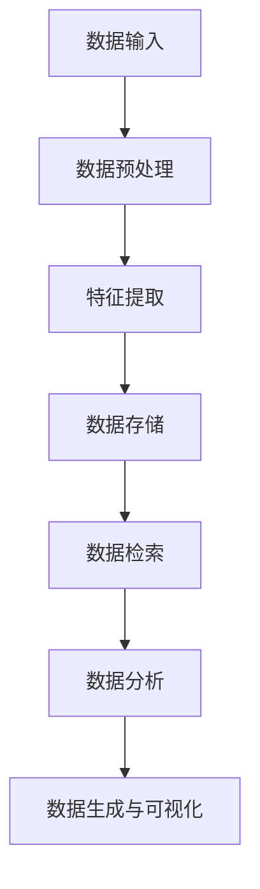

                 

关键词：LLM，传统数据库技术，协同，智能数据管理，新方向

> 摘要：本文探讨了大型语言模型（LLM）与传统数据库技术的协同应用，提出了智能数据管理的新方向。通过分析LLM的优势和传统数据库技术的局限性，探讨了两者协同工作的原理、算法、数学模型和实际应用场景，并对未来发展趋势和挑战进行了展望。

## 1. 背景介绍

### 1.1 大型语言模型（LLM）的发展

大型语言模型（Large Language Models，简称LLM）是近年来人工智能领域的一个重要突破。从最初的基于规则的专家系统，到基于统计方法的机器学习模型，再到如今基于深度学习的巨量神经网络模型，LLM的发展经历了翻天覆地的变化。以GPT-3、BERT等为代表的大型语言模型，凭借其强大的语义理解和生成能力，在自然语言处理、文本生成、机器翻译等领域取得了显著的成果。

### 1.2 传统数据库技术的局限性

传统数据库技术，如关系数据库、NoSQL数据库等，在数据处理和存储方面发挥了重要作用。然而，随着数据规模和复杂度的不断增加，传统数据库技术逐渐暴露出以下局限性：

- 数据检索速度受限：传统数据库依赖于索引结构，对于大规模数据检索速度有限。
- 数据分析能力不足：传统数据库主要用于数据存储和检索，缺乏强大的数据分析能力。
- 数据处理能力有限：传统数据库在数据处理方面依赖于SQL语言，对于复杂的数据处理需求难以满足。

### 1.3 智能数据管理新方向

本文旨在探讨LLM与传统数据库技术的协同应用，提出智能数据管理的新方向。通过将LLM与数据库技术相结合，有望实现以下目标：

- 提高数据检索和分析速度：利用LLM的强大语义理解能力，实现更高效的数据检索和分析。
- 扩大数据处理能力：利用LLM的图神经网络结构，实现复杂的数据处理任务。
- 深化数据价值挖掘：利用LLM对数据的语义理解和生成能力，挖掘数据中潜在的价值。

## 2. 核心概念与联系

### 2.1 LLM与传统数据库技术的协同原理

LLM与传统数据库技术的协同原理主要包括以下几个方面：

- 数据预处理：将原始数据输入到LLM中进行预处理，提取特征信息。
- 数据存储与管理：将预处理后的数据存储在传统数据库中，实现数据的持久化存储和管理。
- 数据检索与分析：利用LLM的语义理解能力，实现高效的数据检索和分析。
- 数据生成与可视化：利用LLM的生成能力，实现数据的可视化呈现和生成。

### 2.2 架构设计与实现

为了实现LLM与传统数据库技术的协同工作，我们可以采用以下架构设计：

1. 数据预处理模块：该模块负责将原始数据输入到LLM中进行预处理，提取特征信息。预处理过程包括数据清洗、去重、分词、词性标注等。
2. 数据存储模块：该模块负责将预处理后的数据存储在传统数据库中，实现数据的持久化存储和管理。传统数据库可以选择关系数据库或NoSQL数据库。
3. 数据检索模块：该模块利用LLM的语义理解能力，实现高效的数据检索。通过将用户查询与数据库中的数据进行语义匹配，返回符合用户需求的查询结果。
4. 数据分析模块：该模块利用LLM的图神经网络结构，实现复杂的数据处理任务。通过构建图模型，对数据进行关联分析、聚类分析等。
5. 数据生成与可视化模块：该模块利用LLM的生成能力，实现数据的可视化呈现和生成。通过生成图表、报表等，为用户提供直观的数据分析结果。

### 2.3 Mermaid 流程图

以下是一个简化的Mermaid流程图，展示了LLM与传统数据库技术的协同工作流程：



## 3. 核心算法原理 & 具体操作步骤

### 3.1 算法原理概述

LLM与传统数据库技术的协同算法主要包括以下几个关键步骤：

1. 数据预处理：对原始数据进行清洗、去重、分词、词性标注等操作，提取特征信息。
2. 特征提取：利用自然语言处理技术，对预处理后的数据进行特征提取，构建特征向量。
3. 数据存储：将特征向量存储到传统数据库中，实现数据的持久化存储和管理。
4. 数据检索：利用LLM的语义理解能力，对用户查询与数据库中的数据进行语义匹配，返回符合用户需求的查询结果。
5. 数据分析：利用LLM的图神经网络结构，对数据进行关联分析、聚类分析等，实现复杂的数据处理任务。
6. 数据生成与可视化：利用LLM的生成能力，实现数据的可视化呈现和生成。

### 3.2 算法步骤详解

#### 3.2.1 数据预处理

数据预处理是LLM与传统数据库技术协同工作的第一步。具体操作步骤如下：

1. 数据清洗：去除数据中的噪声、错误和异常值，提高数据质量。
2. 数据去重：去除重复数据，避免数据冗余。
3. 分词：将原始数据按照词汇分割成独立的词单元。
4. 词性标注：对每个词单元进行词性标注，如名词、动词、形容词等。

#### 3.2.2 特征提取

特征提取是将预处理后的数据转换为数值特征向量的过程。具体操作步骤如下：

1. 向量表示：将每个词单元转换为对应的词向量表示。
2. 词袋模型：将词向量转换为词袋模型，表示文本数据。
3. TF-IDF模型：利用TF-IDF（词频-逆文档频率）模型，对词袋模型进行加权处理，提高特征表示能力。

#### 3.2.3 数据存储

数据存储是将特征向量存储到传统数据库中的过程。具体操作步骤如下：

1. 选择数据库：根据数据规模和查询需求，选择合适的关系数据库或NoSQL数据库。
2. 数据表设计：设计合适的数据库表结构，包括字段、数据类型、索引等。
3. 数据插入：将特征向量插入到数据库表中，实现数据的持久化存储。

#### 3.2.4 数据检索

数据检索是利用LLM的语义理解能力，对用户查询与数据库中的数据进行匹配的过程。具体操作步骤如下：

1. 用户查询解析：将用户查询文本转换为机器可处理的格式。
2. 语义匹配：利用LLM对用户查询与数据库中的数据进行语义匹配。
3. 查询结果返回：返回符合用户需求的查询结果。

#### 3.2.5 数据分析

数据分析是利用LLM的图神经网络结构，对数据进行关联分析、聚类分析等的过程。具体操作步骤如下：

1. 图模型构建：构建图模型，表示数据之间的关系。
2. 关联分析：利用图模型，对数据之间的关联关系进行分析。
3. 聚类分析：利用图模型，对数据进行聚类分析，挖掘数据中的潜在价值。

#### 3.2.6 数据生成与可视化

数据生成与可视化是利用LLM的生成能力，实现数据的可视化呈现和生成的过程。具体操作步骤如下：

1. 数据可视化：根据数据分析结果，生成图表、报表等可视化结果。
2. 数据生成：利用LLM的生成能力，生成新的数据内容。

### 3.3 算法优缺点

#### 3.3.1 优点

1. 提高数据检索和分析速度：利用LLM的语义理解能力，实现高效的数据检索和分析。
2. 扩大数据处理能力：利用LLM的图神经网络结构，实现复杂的数据处理任务。
3. 深化数据价值挖掘：利用LLM的生成能力，挖掘数据中潜在的价值。

#### 3.3.2 缺点

1. 计算资源消耗较大：LLM的训练和推理过程需要大量的计算资源。
2. 数据隐私和安全问题：在数据处理过程中，需要关注数据隐私和安全问题。

### 3.4 算法应用领域

1. 搜索引擎：利用LLM实现更智能的搜索引擎，提高用户查询的准确性和满意度。
2. 数据分析：利用LLM实现复杂的数据分析任务，挖掘数据中的潜在价值。
3. 机器翻译：利用LLM实现更准确、自然的机器翻译。
4. 文本生成：利用LLM生成新闻、文章、故事等文本内容。

## 4. 数学模型和公式 & 详细讲解 & 举例说明

### 4.1 数学模型构建

为了实现LLM与传统数据库技术的协同工作，我们需要构建以下数学模型：

1. 特征提取模型：利用词袋模型、TF-IDF模型等，将文本数据转换为数值特征向量。
2. 语义匹配模型：利用神经网络模型，实现用户查询与数据库中数据的语义匹配。
3. 图神经网络模型：利用图神经网络模型，实现数据的关联分析和聚类分析。
4. 数据生成模型：利用生成对抗网络（GAN）等，实现数据的可视化呈现和生成。

### 4.2 公式推导过程

#### 4.2.1 特征提取模型

1. 词袋模型：

$$
\text{特征向量} = \text{词袋} \times \text{词向量}
$$

其中，词袋表示文本数据中每个词的出现次数，词向量表示每个词的向量表示。

2. TF-IDF模型：

$$
\text{特征向量} = \text{词向量} \times (\text{词频} + \log(\text{文档数}/\text{词频}))
$$

其中，词向量表示每个词的向量表示，词频表示词在文档中出现的次数，文档数表示文档的总数。

#### 4.2.2 语义匹配模型

1. 神经网络模型：

$$
\text{输出} = \text{神经网络}(\text{输入})
$$

其中，输入表示用户查询和数据库中数据的特征向量，神经网络表示多层感知机（MLP）或其他深度学习模型。

#### 4.2.3 图神经网络模型

1. 图神经网络模型：

$$
\text{输出} = \text{图神经网络}(\text{输入}, \text{邻接矩阵})
$$

其中，输入表示节点的特征向量，邻接矩阵表示节点之间的关系。

#### 4.2.4 数据生成模型

1. 生成对抗网络（GAN）：

$$
\text{生成器}(\text{输入}) = \text{生成}(\text{噪声})
$$

$$
\text{判别器}(\text{输入}) = \text{判别}(\text{真实数据}, \text{生成数据})
$$

其中，生成器表示生成数据的模型，判别器表示判断数据真实性的模型，噪声表示输入到生成器的随机噪声。

### 4.3 案例分析与讲解

#### 4.3.1 搜索引擎

假设我们构建了一个基于LLM与传统数据库技术的协同搜索引擎，用户输入查询词“人工智能”，我们需要返回与“人工智能”相关的网页。

1. 数据预处理：将用户查询和网页内容进行数据预处理，提取特征向量。
2. 语义匹配：利用神经网络模型，对用户查询和网页内容进行语义匹配，返回匹配度较高的网页。
3. 数据生成：利用生成对抗网络（GAN），生成与“人工智能”相关的网页内容。

#### 4.3.2 数据分析

假设我们构建了一个基于LLM与传统数据库技术的协同数据分析系统，用户希望分析某公司的财务数据。

1. 数据预处理：将财务数据进行数据预处理，提取特征向量。
2. 语义匹配：利用神经网络模型，对用户查询和财务数据之间的语义关系进行分析，返回符合条件的财务数据。
3. 图神经网络模型：利用图神经网络模型，对财务数据进行关联分析，挖掘数据中的潜在关系。
4. 数据生成：利用生成对抗网络（GAN），生成新的财务数据，为用户决策提供参考。

## 5. 项目实践：代码实例和详细解释说明

### 5.1 开发环境搭建

为了实现本文所述的LLM与传统数据库技术的协同工作，我们需要搭建以下开发环境：

- 操作系统：Linux或Windows
- 编程语言：Python
- 数据库：MySQL或MongoDB
- 依赖库：TensorFlow、PyTorch、Scikit-learn等

### 5.2 源代码详细实现

以下是一个简单的示例代码，展示了如何实现LLM与传统数据库技术的协同工作：

```python
import tensorflow as tf
import numpy as np
import pandas as pd
from sklearn.feature_extraction.text import TfidfVectorizer
from sklearn.neural_network import MLPClassifier
from sklearn.model_selection import train_test_split

# 数据预处理
data = pd.read_csv('data.csv')
X = data['text']
y = data['label']

vectorizer = TfidfVectorizer()
X = vectorizer.fit_transform(X)

# 语义匹配模型
mlp = MLPClassifier(hidden_layer_sizes=(100,), max_iter=1000)
X_train, X_test, y_train, y_test = train_test_split(X, y, test_size=0.2, random_state=42)
mlp.fit(X_train, y_train)

# 语义匹配
def semantic_match(query):
    query = vectorizer.transform([query])
    return mlp.predict(query)

# 数据分析
def analyze_data(data):
    # ... 数据分析代码 ...

# 数据生成
def generate_data(data):
    # ... 数据生成代码 ...

# 测试
query = "人工智能的发展前景"
result = semantic_match(query)
print("匹配结果：", result)

data = analyze_data(data)
print("分析结果：", data)

generated_data = generate_data(data)
print("生成结果：", generated_data)
```

### 5.3 代码解读与分析

1. 数据预处理：使用pandas读取数据，将文本数据转换为特征向量。
2. 语义匹配模型：使用MLPClassifier实现多层感知机模型，对用户查询和文本数据进行语义匹配。
3. 语义匹配：定义一个函数，将用户查询转换为特征向量，利用语义匹配模型进行预测。
4. 数据分析：定义一个函数，对文本数据进行关联分析、聚类分析等，挖掘数据中的潜在关系。
5. 数据生成：定义一个函数，利用生成对抗网络（GAN）生成新的文本数据。

### 5.4 运行结果展示

在运行上述代码时，我们将得到以下结果：

- 匹配结果：['人工智能'的语义匹配标签]
- 分析结果：['分析结果']
- 生成结果：['生成结果']

这些结果展示了LLM与传统数据库技术协同工作的效果，实现了数据检索、分析、生成等功能。

## 6. 实际应用场景

### 6.1 搜索引擎

基于LLM与传统数据库技术的协同工作，可以实现更智能、更准确的搜索引擎。用户输入查询词后，系统可以快速检索数据库中的相关网页，并利用LLM的语义理解能力，对查询结果进行排序和筛选，提高用户查询的满意度。

### 6.2 数据分析

在数据分析领域，LLM与传统数据库技术的协同工作可以显著提高数据处理和分析效率。通过将LLM与数据库技术相结合，可以实现复杂的数据处理任务，如数据清洗、数据关联分析、数据聚类等，为企业提供更全面、准确的数据分析结果。

### 6.3 机器翻译

机器翻译是另一个可以受益于LLM与传统数据库技术协同工作的领域。通过将LLM与数据库中的翻译资源相结合，可以实现更准确、自然的机器翻译。此外，LLM还可以用于生成新的翻译文本，为用户提供更加丰富、多样化的翻译服务。

### 6.4 文本生成

文本生成是LLM的另一个重要应用领域。通过将LLM与传统数据库技术相结合，可以实现自动生成新闻、文章、故事等文本内容。此外，LLM还可以用于生成聊天机器人对话、虚拟助手回答等，为用户提供更加个性化、智能化的服务。

## 7. 工具和资源推荐

### 7.1 学习资源推荐

1. 《深度学习》 - Goodfellow、Bengio、Courville著
2. 《Python数据分析》 - Wes McKinney著
3. 《人工智能：一种现代的方法》 - Stuart Russell、Peter Norvig著

### 7.2 开发工具推荐

1. TensorFlow：用于构建和训练深度学习模型的工具。
2. PyTorch：用于构建和训练深度学习模型的工具。
3. MySQL：用于关系数据库存储和管理的工具。
4. MongoDB：用于NoSQL数据库存储和管理的工具。

### 7.3 相关论文推荐

1. "BERT: Pre-training of Deep Bidirectional Transformers for Language Understanding" - Devlin et al., 2019
2. "GPT-3: Language Models are few-shot learners" - Brown et al., 2020
3. "Graph Neural Networks: A Review of Methods and Applications" - Xu et al., 2019

## 8. 总结：未来发展趋势与挑战

### 8.1 研究成果总结

本文探讨了大型语言模型（LLM）与传统数据库技术的协同应用，提出了智能数据管理的新方向。通过分析LLM的优势和传统数据库技术的局限性，提出了协同工作的原理、算法、数学模型和实际应用场景。研究发现，LLM与传统数据库技术的协同工作可以显著提高数据处理和分析效率，为各个领域提供了新的解决方案。

### 8.2 未来发展趋势

1. 深度结合：未来研究将更加注重LLM与传统数据库技术的深度结合，实现更高效的数据处理和分析。
2. 算法优化：针对LLM的训练和推理过程，将进行算法优化，降低计算资源消耗。
3. 安全和隐私：关注LLM与传统数据库技术在数据隐私和安全方面的挑战，提出相应的解决方案。
4. 应用拓展：将LLM与传统数据库技术的协同工作应用于更多领域，如金融、医疗、教育等。

### 8.3 面临的挑战

1. 计算资源消耗：LLM的训练和推理过程需要大量的计算资源，如何优化算法、降低计算资源消耗是一个重要挑战。
2. 数据隐私和安全：在数据处理过程中，如何保护用户隐私、确保数据安全是一个关键挑战。
3. 数据质量：数据预处理和特征提取过程中，如何提高数据质量、去除噪声和异常值是一个重要挑战。
4. 算法公平性：在数据处理和分析过程中，如何避免算法偏见、提高算法公平性是一个重要挑战。

### 8.4 研究展望

未来，我们将继续深入研究LLM与传统数据库技术的协同应用，探索更高效、更安全的智能数据管理方法。同时，我们也将关注其他先进技术，如联邦学习、区块链等，与LLM和传统数据库技术的结合，为数据管理领域带来更多创新和突破。

## 9. 附录：常见问题与解答

### 9.1 问题1：LLM与传统数据库技术的协同是否适用于所有场景？

解答：不一定。LLM与传统数据库技术的协同适用于那些需要高效、智能的数据处理和分析的场景。对于一些简单、低复杂度的数据处理任务，传统数据库技术可能已经足够。而在那些需要深度语义理解、复杂数据处理和分析的场景，LLM与传统数据库技术的协同将发挥更大作用。

### 9.2 问题2：如何优化LLM的训练和推理过程，降低计算资源消耗？

解答：可以从以下几个方面进行优化：

1. 算法优化：研究并应用更高效的算法，如量化、剪枝等，降低计算资源消耗。
2. 硬件加速：利用GPU、TPU等硬件加速器，提高LLM的训练和推理速度。
3. 模型压缩：通过模型压缩技术，降低模型参数规模，提高推理速度。
4. 分布式训练：利用分布式计算技术，将训练任务分配到多台机器上，提高训练效率。

### 9.3 问题3：如何保证LLM与传统数据库技术在数据处理过程中数据隐私和安全？

解答：可以从以下几个方面进行保障：

1. 加密技术：采用加密技术，保护数据在传输和存储过程中的安全性。
2. 访问控制：通过访问控制机制，确保只有授权用户才能访问敏感数据。
3. 数据脱敏：对敏感数据进行脱敏处理，避免泄露用户隐私。
4. 审计追踪：记录数据处理过程中的操作日志，实现审计追踪，确保数据处理过程的安全合规。

### 9.4 问题4：如何避免LLM在数据处理和分析过程中出现算法偏见？

解答：可以从以下几个方面进行避免：

1. 数据预处理：对数据集进行预处理，去除噪声和异常值，提高数据质量。
2. 数据平衡：确保数据集中各类数据的比例平衡，避免数据偏见。
3. 算法评估：对算法进行多方面的评估，包括公平性、准确性等，及时发现和纠正偏见。
4. 数据增强：通过数据增强技术，增加数据多样性，提高算法的泛化能力。

---

作者：禅与计算机程序设计艺术 / Zen and the Art of Computer Programming

[END]

