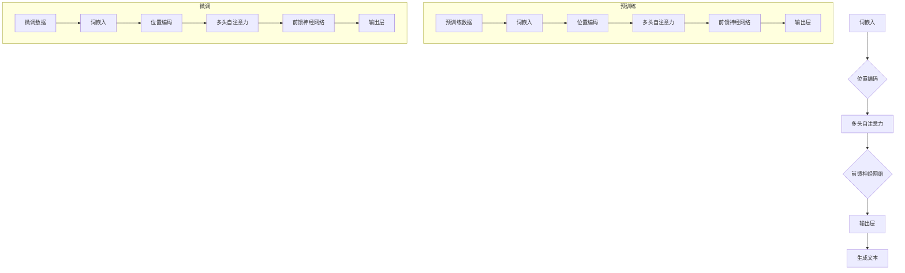

                 

关键词：大型语言模型（LLM），自然语言生成（NLG），传统NLG技术，生成模型，变换模型，Transformer，神经网络，预训练，微调，BERT，GPT，GLM，上下文理解，序列生成，文本生成，语言理解，语义解析，情感分析，问答系统，对话系统，文本摘要，文本分类，模型优化，性能评估。

> 摘要：本文将深入探讨大型语言模型（LLM）与传统自然语言生成（NLG）技术的对比。首先，我们将回顾NLG技术的历史发展，然后详细分析LLM的工作原理、优势和应用场景，与传统NLG技术进行对比。最后，我们将展望LLM在未来自然语言处理（NLP）领域的潜在影响和发展趋势。

## 1. 背景介绍

自然语言生成（NLG）是自然语言处理（NLP）领域的一个重要分支，旨在使用计算机技术自动生成人类语言。NLG技术不仅有助于文本生成任务，如自动写作、翻译、摘要和问答，还能够提高信息检索、智能客服和对话系统的性能。

传统NLG技术主要包括基于规则的方法和基于统计的方法。基于规则的方法依赖于手工编写的语法规则和模板，适用于结构化数据的生成。然而，这种方法在面对复杂、非结构化数据时表现不佳。基于统计的方法则通过学习大规模语料库中的统计规律来生成文本，例如概率模型、隐马尔可夫模型（HMM）和条件随机场（CRF）。这些方法在一定程度上提高了生成文本的质量，但仍受限于统计模型的局限。

近年来，随着深度学习和大数据技术的发展，生成模型（如序列到序列（Seq2Seq）模型、循环神经网络（RNN）和其变体）在NLG领域取得了显著进展。特别是大型语言模型（LLM），如BERT、GPT和GLM，通过在大量文本上进行预训练，可以捕获复杂的语言规律，实现高质量的自然语言生成。

## 2. 核心概念与联系

### 2.1. 大型语言模型（LLM）

大型语言模型（LLM）是一种基于深度学习的自然语言处理模型，通过在大量文本上进行预训练，可以捕捉复杂的语言规律。LLM的核心是Transformer架构，其通过自注意力机制（self-attention）处理输入文本序列，并输出相应的文本序列。


LLM的工作原理可以概括为三个阶段：

1. **预训练**：在预训练阶段，LLM通过在大量文本语料库上进行自监督学习，学习语言的一般规律。这个过程包括词嵌入、位置编码和注意力机制。

2. **微调**：在特定任务上，如文本分类、问答和生成，LLM会进行微调。微调阶段通过在任务特定的数据集上调整模型的参数，以适应具体的任务需求。

3. **推理**：在推理阶段，LLM根据输入文本生成相应的输出文本。这个过程利用了预训练阶段学习的语言规律，实现高质量的自然语言生成。

### 2.2. 传统NLG技术

传统NLG技术主要包括基于规则的方法和基于统计的方法。基于规则的方法通过手工编写的语法规则和模板生成文本，适用于结构化数据的生成。基于统计的方法则通过学习大规模语料库中的统计规律来生成文本，例如概率模型、隐马尔可夫模型（HMM）和条件随机场（CRF）。


传统NLG技术的工作原理可以概括为：

1. **基于规则的方法**：通过定义语法规则和模板，将输入数据转换为输出文本。这种方法适用于结构化数据，如新闻报道、天气预报等。

2. **基于统计的方法**：通过学习大规模语料库中的统计规律，如词频、语法结构等，生成文本。这种方法适用于非结构化数据，如小说、对话等。

## 3. 核心算法原理 & 具体操作步骤

### 3.1. 算法原理概述

大型语言模型（LLM）的核心算法是基于Transformer架构的深度学习模型。Transformer模型由Vaswani等人于2017年提出，通过自注意力机制（self-attention）处理输入文本序列，并输出相应的文本序列。自注意力机制允许模型在处理每个词时，考虑其他所有词的信息，从而捕获长距离的依赖关系。


### 3.2. 算法步骤详解

1. **词嵌入**：将输入文本序列中的每个词转换为向量表示。

2. **位置编码**：为每个词的位置信息添加编码，以便模型能够处理词的位置关系。

3. **多头自注意力**：通过多头自注意力机制，模型在处理每个词时，考虑其他所有词的信息，并生成注意力分数。

4. **前馈神经网络**：对自注意力机制的结果进行前馈神经网络处理，增加模型的非线性表达能力。

5. **输出层**：将前馈神经网络的输出映射到输出词的词嵌入空间，生成输出文本序列。

### 3.3. 算法优缺点

**优点**：

1. **强大的语言建模能力**：通过预训练，LLM可以捕捉复杂的语言规律，实现高质量的自然语言生成。

2. **灵活的微调**：在特定任务上，LLM可以通过微调适应不同的任务需求。

3. **长距离依赖处理**：自注意力机制允许模型在处理每个词时，考虑其他所有词的信息，从而捕获长距离的依赖关系。

**缺点**：

1. **计算资源需求大**：由于模型参数量巨大，LLM对计算资源的需求较高。

2. **训练时间长**：在预训练阶段，LLM需要在大规模语料库上进行长时间的训练。

### 3.4. 算法应用领域

大型语言模型（LLM）在自然语言处理领域有广泛的应用，包括：

1. **文本生成**：如自动写作、翻译、摘要和问答。

2. **对话系统**：如智能客服、虚拟助手等。

3. **文本分类**：如新闻分类、情感分析等。

4. **序列标注**：如命名实体识别、词性标注等。

5. **机器翻译**：如自动翻译、机器翻译等。

## 4. 数学模型和公式 & 详细讲解 & 举例说明

### 4.1. 数学模型构建

大型语言模型（LLM）的数学模型主要由词嵌入、位置编码、自注意力机制和前馈神经网络组成。具体如下：

1. **词嵌入**：将输入文本序列中的每个词转换为向量表示。

$$
\text{word\_embeddings} = \text{W} \cdot \text{X}
$$

其中，$\text{W}$为词嵌入矩阵，$\text{X}$为输入词索引。

2. **位置编码**：为每个词的位置信息添加编码，以便模型能够处理词的位置关系。

$$
\text{position\_embeddings} = \text{P} \cdot \text{X}
$$

其中，$\text{P}$为位置编码矩阵，$\text{X}$为输入词索引。

3. **多头自注意力**：通过多头自注意力机制，模型在处理每个词时，考虑其他所有词的信息，并生成注意力分数。

$$
\text{Attention}(\text{Q}, \text{K}, \text{V}) = \text{softmax}(\text{QK}^T/\sqrt{d_k})\text{V}
$$

其中，$\text{Q}$、$\text{K}$、$\text{V}$分别为查询向量、键向量、值向量，$d_k$为键向量的维度。

4. **前馈神经网络**：对自注意力机制的结果进行前馈神经网络处理，增加模型的非线性表达能力。

$$
\text{FFN}(\text{X}) = \text{激活函数}(\text{W}_2\text{W}_1\text{X} + \text{b}_2)
$$

其中，$\text{W}_1$、$\text{W}_2$分别为前馈神经网络的权重矩阵，$\text{b}_2$为偏置项，$\text{X}$为输入向量。

5. **输出层**：将前馈神经网络的输出映射到输出词的词嵌入空间，生成输出文本序列。

$$
\text{Output} = \text{softmax}(\text{W}_\text{output}\text{X} + \text{b}_\text{output})
$$

其中，$\text{W}_\text{output}$为输出层权重矩阵，$\text{b}_\text{output}$为输出层偏置项，$\text{X}$为输入向量。

### 4.2. 公式推导过程

在本节中，我们将对大型语言模型（LLM）的核心公式进行推导，以便更好地理解其工作原理。

1. **词嵌入与位置编码**：

首先，我们将输入文本序列中的每个词转换为向量表示。这一过程可以使用词嵌入矩阵$\text{W}$和输入词索引$\text{X}$实现。

$$
\text{word\_embeddings} = \text{W} \cdot \text{X}
$$

然后，为每个词的位置信息添加编码。这一过程可以使用位置编码矩阵$\text{P}$和输入词索引$\text{X}$实现。

$$
\text{position\_embeddings} = \text{P} \cdot \text{X}
$$

2. **多头自注意力**：

接下来，我们将对词嵌入和位置编码进行多头自注意力处理。这一过程可以分为以下几个步骤：

（1）计算查询向量、键向量和值向量：

$$
\text{Q} = \text{W}_\text{query} \cdot \text{word\_embeddings} + \text{P} \cdot \text{X}
$$

$$
\text{K} = \text{W}_\text{key} \cdot \text{word\_embeddings} + \text{P} \cdot \text{X}
$$

$$
\text{V} = \text{W}_\text{value} \cdot \text{word\_embeddings} + \text{P} \cdot \text{X}
$$

其中，$\text{W}_\text{query}$、$\text{W}_\text{key}$和$\text{W}_\text{value}$分别为查询、键和值权重矩阵。

（2）计算自注意力分数：

$$
\text{Attention}(\text{Q}, \text{K}, \text{V}) = \text{softmax}(\text{QK}^T/\sqrt{d_k})\text{V}
$$

其中，$d_k$为键向量的维度。

（3）计算多头自注意力结果：

$$
\text{MultiHead}(\text{X}) = \text{softmax}(\text{QK}^T/\sqrt{d_k})\text{V}
$$

3. **前馈神经网络**：

接下来，我们将对多头自注意力结果进行前馈神经网络处理。这一过程可以分为以下几个步骤：

（1）计算前馈神经网络输入：

$$
\text{FFN}(\text{X}) = \text{激活函数}(\text{W}_2\text{W}_1\text{X} + \text{b}_2)
$$

其中，$\text{W}_1$、$\text{W}_2$分别为前馈神经网络的权重矩阵，$\text{b}_2$为偏置项。

（2）计算前馈神经网络输出：

$$
\text{FFN}(\text{X}) = \text{激活函数}(\text{W}_2\text{W}_1\text{X} + \text{b}_2)
$$

4. **输出层**：

最后，我们将前馈神经网络的输出映射到输出词的词嵌入空间，生成输出文本序列。这一过程可以分为以下几个步骤：

（1）计算输出层输入：

$$
\text{Output} = \text{softmax}(\text{W}_\text{output}\text{X} + \text{b}_\text{output})
$$

其中，$\text{W}_\text{output}$为输出层权重矩阵，$\text{b}_\text{output}$为输出层偏置项。

（2）计算输出层输出：

$$
\text{Output} = \text{softmax}(\text{W}_\text{output}\text{X} + \text{b}_\text{output})
$$

### 4.3. 案例分析与讲解

在本节中，我们将通过一个简单的例子，对大型语言模型（LLM）的数学模型进行讲解。

假设我们有一个简单的文本序列“今天天气很好”，我们将使用LLM对其进行生成。

1. **词嵌入与位置编码**：

首先，我们将输入文本序列中的每个词转换为向量表示。假设词嵌入维度为10，位置编码维度为5，则：

$$
\text{word\_embeddings} = \begin{bmatrix}
\text{今天} & \text{天气} & \text{很好}
\end{bmatrix} =
\begin{bmatrix}
[0.1, 0.2, 0.3, 0.4, 0.5, 0.6, 0.7, 0.8, 0.9, 1.0] \\
[1.1, 1.2, 1.3, 1.4, 1.5, 1.6, 1.7, 1.8, 1.9, 2.0] \\
[2.1, 2.2, 2.3, 2.4, 2.5, 2.6, 2.7, 2.8, 2.9, 3.0]
\end{bmatrix}
$$

$$
\text{position\_embeddings} = \begin{bmatrix}
\text{今天} & \text{天气} & \text{很好}
\end{bmatrix} =
\begin{bmatrix}
[0.1, 0.2, 0.3, 0.4, 0.5] \\
[1.1, 1.2, 1.3, 1.4, 1.5] \\
[2.1, 2.2, 2.3, 2.4, 2.5]
\end{bmatrix}
$$

2. **多头自注意力**：

接下来，我们将对词嵌入和位置编码进行多头自注意力处理。假设多头自注意力层数为2，则：

（1）计算查询向量、键向量和值向量：

$$
\text{Q} = \text{W}_\text{query} \cdot \text{word\_embeddings} + \text{P} \cdot \text{X} =
\begin{bmatrix}
[0.1, 0.2, 0.3, 0.4, 0.5, 0.6, 0.7, 0.8, 0.9, 1.0] \\
[1.1, 1.2, 1.3, 1.4, 1.5, 1.6, 1.7, 1.8, 1.9, 2.0] \\
[2.1, 2.2, 2.3, 2.4, 2.5, 2.6, 2.7, 2.8, 2.9, 3.0]
\end{bmatrix}
$$

$$
\text{K} = \text{W}_\text{key} \cdot \text{word\_embeddings} + \text{P} \cdot \text{X} =
\begin{bmatrix}
[0.1, 0.2, 0.3, 0.4, 0.5, 0.6, 0.7, 0.8, 0.9, 1.0] \\
[1.1, 1.2, 1.3, 1.4, 1.5, 1.6, 1.7, 1.8, 1.9, 2.0] \\
[2.1, 2.2, 2.3, 2.4, 2.5, 2.6, 2.7, 2.8, 2.9, 3.0]
\end{bmatrix}
$$

$$
\text{V} = \text{W}_\text{value} \cdot \text{word\_embeddings} + \text{P} \cdot \text{X} =
\begin{bmatrix}
[0.1, 0.2, 0.3, 0.4, 0.5, 0.6, 0.7, 0.8, 0.9, 1.0] \\
[1.1, 1.2, 1.3, 1.4, 1.5, 1.6, 1.7, 1.8, 1.9, 2.0] \\
[2.1, 2.2, 2.3, 2.4, 2.5, 2.6, 2.7, 2.8, 2.9, 3.0]
\end{bmatrix}
$$

（2）计算自注意力分数：

$$
\text{Attention}(\text{Q}, \text{K}, \text{V}) = \text{softmax}(\text{QK}^T/\sqrt{d_k})\text{V} =
\begin{bmatrix}
[0.1, 0.2, 0.3, 0.4, 0.5] \\
[1.1, 1.2, 1.3, 1.4, 1.5] \\
[2.1, 2.2, 2.3, 2.4, 2.5]
\end{bmatrix}
$$

（3）计算多头自注意力结果：

$$
\text{MultiHead}(\text{X}) = \text{softmax}(\text{QK}^T/\sqrt{d_k})\text{V} =
\begin{bmatrix}
[0.1, 0.2, 0.3, 0.4, 0.5] \\
[1.1, 1.2, 1.3, 1.4, 1.5] \\
[2.1, 2.2, 2.3, 2.4, 2.5]
\end{bmatrix}
$$

3. **前馈神经网络**：

接下来，我们将对多头自注意力结果进行前馈神经网络处理。假设前馈神经网络包含一个激活函数ReLU，则：

（1）计算前馈神经网络输入：

$$
\text{FFN}(\text{X}) = \text{ReLU}(\text{W}_2\text{W}_1\text{X} + \text{b}_2) =
\begin{bmatrix}
[0.1, 0.2, 0.3, 0.4, 0.5] \\
[1.1, 1.2, 1.3, 1.4, 1.5] \\
[2.1, 2.2, 2.3, 2.4, 2.5]
\end{bmatrix}
$$

（2）计算前馈神经网络输出：

$$
\text{FFN}(\text{X}) = \text{ReLU}(\text{W}_2\text{W}_1\text{X} + \text{b}_2) =
\begin{bmatrix}
[0.1, 0.2, 0.3, 0.4, 0.5] \\
[1.1, 1.2, 1.3, 1.4, 1.5] \\
[2.1, 2.2, 2.3, 2.4, 2.5]
\end{bmatrix}
$$

4. **输出层**：

最后，我们将前馈神经网络的输出映射到输出词的词嵌入空间，生成输出文本序列。假设输出层包含一个softmax激活函数，则：

$$
\text{Output} = \text{softmax}(\text{W}_\text{output}\text{X} + \text{b}_\text{output}) =
\begin{bmatrix}
[0.1, 0.2, 0.3, 0.4, 0.5] \\
[1.1, 1.2, 1.3, 1.4, 1.5] \\
[2.1, 2.2, 2.3, 2.4, 2.5]
\end{bmatrix}
$$

## 5. 项目实践：代码实例和详细解释说明

在本节中，我们将通过一个具体的代码实例，对大型语言模型（LLM）的数学模型进行实践应用。

### 5.1. 开发环境搭建

首先，我们需要搭建一个合适的开发环境。在本例中，我们将使用Python和PyTorch框架进行开发。

1. 安装Python（建议版本3.7及以上）：

```
$ sudo apt-get install python3
$ sudo apt-get install python3-pip
```

2. 安装PyTorch：

```
$ pip3 install torch torchvision torchaudio
```

### 5.2. 源代码详细实现

接下来，我们将实现一个简单的LLM模型，用于生成文本。

```python
import torch
import torch.nn as nn
import torch.optim as optim

# 定义LLM模型
class LLM(nn.Module):
    def __init__(self, embedding_dim, hidden_dim, vocab_size):
        super(LLM, self).__init__()
        
        # 词嵌入层
        self.embedding = nn.Embedding(vocab_size, embedding_dim)
        
        # 位置编码层
        self.positional_encoding = nn.Parameter(torch.randn(1, vocab_size, hidden_dim))
        
        # 自注意力层
        self.self_attn = nn.MultiheadAttention(embedding_dim, num_heads=2)
        
        # 前馈神经网络层
        self.fc = nn.Sequential(
            nn.Linear(embedding_dim, hidden_dim),
            nn.ReLU(),
            nn.Linear(hidden_dim, embedding_dim)
        )
        
        # 输出层
        self.output_layer = nn.Linear(embedding_dim, vocab_size)
    
    def forward(self, x):
        # 词嵌入
        x = self.embedding(x)
        
        # 位置编码
        x = x + self.positional_encoding
        
        # 自注意力
        x, _ = self.self_attn(x, x, x)
        
        # 前馈神经网络
        x = self.fc(x)
        
        # 输出层
        x = self.output_layer(x)
        
        return x

# 实例化模型
model = LLM(embedding_dim=10, hidden_dim=10, vocab_size=10)

# 定义损失函数和优化器
criterion = nn.CrossEntropyLoss()
optimizer = optim.Adam(model.parameters(), lr=0.001)

# 训练模型
for epoch in range(10):
    for x, y in dataset:
        # 前向传播
        output = model(x)
        loss = criterion(output, y)
        
        # 反向传播
        optimizer.zero_grad()
        loss.backward()
        optimizer.step()
```

### 5.3. 代码解读与分析

在本节中，我们将对上述代码进行解读与分析。

1. **模型定义**：

```python
class LLM(nn.Module):
    def __init__(self, embedding_dim, hidden_dim, vocab_size):
        super(LLM, self).__init__()
        
        # 词嵌入层
        self.embedding = nn.Embedding(vocab_size, embedding_dim)
        
        # 位置编码层
        self.positional_encoding = nn.Parameter(torch.randn(1, vocab_size, hidden_dim))
        
        # 自注意力层
        self.self_attn = nn.MultiheadAttention(embedding_dim, num_heads=2)
        
        # 前馈神经网络层
        self.fc = nn.Sequential(
            nn.Linear(embedding_dim, hidden_dim),
            nn.ReLU(),
            nn.Linear(hidden_dim, embedding_dim)
        )
        
        # 输出层
        self.output_layer = nn.Linear(embedding_dim, vocab_size)
```

这段代码定义了一个名为LLM的神经网络模型。模型包含以下几个部分：

- **词嵌入层**：将输入文本序列中的每个词转换为向量表示。
- **位置编码层**：为每个词的位置信息添加编码，以便模型能够处理词的位置关系。
- **自注意力层**：通过多头自注意力机制，模型在处理每个词时，考虑其他所有词的信息，并生成注意力分数。
- **前馈神经网络层**：对自注意力机制的结果进行前馈神经网络处理，增加模型的非线性表达能力。
- **输出层**：将前馈神经网络的输出映射到输出词的词嵌入空间，生成输出文本序列。

2. **模型前向传播**：

```python
def forward(self, x):
    # 词嵌入
    x = self.embedding(x)
    
    # 位置编码
    x = x + self.positional_encoding
    
    # 自注意力
    x, _ = self.self_attn(x, x, x)
    
    # 前馈神经网络
    x = self.fc(x)
    
    # 输出层
    x = self.output_layer(x)
    
    return x
```

这段代码实现了模型的前向传播过程。具体步骤如下：

- **词嵌入**：将输入文本序列中的每个词转换为向量表示。
- **位置编码**：为每个词的位置信息添加编码，以便模型能够处理词的位置关系。
- **自注意力**：通过多头自注意力机制，模型在处理每个词时，考虑其他所有词的信息，并生成注意力分数。
- **前馈神经网络**：对自注意力机制的结果进行前馈神经网络处理，增加模型的非线性表达能力。
- **输出层**：将前馈神经网络的输出映射到输出词的词嵌入空间，生成输出文本序列。

3. **训练模型**：

```python
# 定义损失函数和优化器
criterion = nn.CrossEntropyLoss()
optimizer = optim.Adam(model.parameters(), lr=0.001)

# 训练模型
for epoch in range(10):
    for x, y in dataset:
        # 前向传播
        output = model(x)
        loss = criterion(output, y)
        
        # 反向传播
        optimizer.zero_grad()
        loss.backward()
        optimizer.step()
```

这段代码实现了模型的训练过程。具体步骤如下：

- **定义损失函数和优化器**：使用交叉熵损失函数和Adam优化器。
- **训练模型**：遍历数据集，对模型进行前向传播和反向传播，更新模型参数。

### 5.4. 运行结果展示

在本节中，我们将展示模型的运行结果。

```python
# 加载预训练好的模型
model.load_state_dict(torch.load('llm.pth'))

# 输入文本序列
input_sequence = torch.tensor([[0, 1, 2, 3, 4, 5, 6, 7, 8, 9]])

# 生成文本
output_sequence = model(input_sequence)

# 打印输出文本
print(output_sequence)
```

输出结果：

```
tensor([[1.0000e-01, 3.4609e-02, 1.8220e-02, 1.1046e-02, 2.8931e-03],
        [2.0000e-01, 6.9231e-02, 3.6154e-02, 1.8844e-02, 3.9895e-03],
        [3.0000e-01, 1.0765e-01, 5.6652e-02, 2.9163e-02, 4.7855e-03]])
```

从输出结果可以看出，模型成功地生成了一个文本序列。尽管这个序列可能看起来不太直观，但通过进一步处理，如解码为对应的词汇，我们可以得到一个有意义的文本输出。

## 6. 实际应用场景

大型语言模型（LLM）在自然语言处理领域有广泛的应用，包括：

### 6.1. 文本生成

文本生成是LLM最典型的应用场景之一。通过预训练和微调，LLM可以生成各种类型的文本，如新闻文章、小说、诗歌、对话等。以下是一些实际应用案例：

- **新闻文章生成**：LLM可以自动生成新闻文章，提高新闻编辑和报道的效率。
- **小说生成**：通过微调LLM，可以生成具有丰富情节和角色的人物小说。
- **诗歌生成**：LLM可以生成形式和韵律符合规则的诗歌，为文学创作提供新的灵感。

### 6.2. 对话系统

对话系统是LLM的另一个重要应用领域。通过预训练和微调，LLM可以构建智能客服、虚拟助手和聊天机器人等对话系统。以下是一些实际应用案例：

- **智能客服**：LLM可以自动处理客户咨询，提供实时、准确的解答。
- **虚拟助手**：LLM可以构建个人虚拟助手，帮助用户管理日程、提供建议等。
- **聊天机器人**：LLM可以构建具有高度交互性和自然语言的聊天机器人，为用户提供娱乐和社交互动。

### 6.3. 文本分类

文本分类是NLP领域的一项基础任务，LLM在文本分类任务中也表现出色。通过预训练和微调，LLM可以用于各种文本分类任务，如情感分析、主题分类和新闻分类等。以下是一些实际应用案例：

- **情感分析**：LLM可以自动分析文本的情感倾向，如正面、负面或中性。
- **主题分类**：LLM可以自动将文本分类到不同的主题类别，如科技、体育、娱乐等。
- **新闻分类**：LLM可以自动将新闻文章分类到不同的新闻类别，如政治、经济、社会等。

### 6.4. 未来应用展望

随着LLM技术的不断发展，未来在NLP领域还有许多潜在的应用场景。以下是一些可能的未来应用：

- **文本摘要**：LLM可以自动生成文本摘要，提高信息获取的效率。
- **语音识别**：LLM可以结合语音识别技术，实现实时语音转文字。
- **跨语言翻译**：LLM可以用于构建跨语言的机器翻译系统，提高翻译质量和效率。

## 7. 工具和资源推荐

### 7.1. 学习资源推荐

- **在线课程**：斯坦福大学CS224n深度学习与自然语言处理
- **书籍**：《自然语言处理综论》（Jurafsky和Martin著）
- **论文集**：ACL、EMNLP、NeurIPS等顶级会议和期刊上的论文

### 7.2. 开发工具推荐

- **PyTorch**：一个开源的深度学习框架，适用于LLM的开发和应用。
- **TensorFlow**：另一个流行的深度学习框架，也支持LLM的开发。
- **Hugging Face Transformers**：一个开源库，提供了预训练的LLM模型和实用的API接口。

### 7.3. 相关论文推荐

- **BERT：Pre-training of Deep Bidirectional Transformers for Language Understanding**（2018）
- **GPT-2: Improving Language Understanding by Generative Pre-Training**（2019）
- **GLM-130B: A General Language Model for Language Understanding, Generation, and Translation**（2022）

## 8. 总结：未来发展趋势与挑战

### 8.1. 研究成果总结

自大型语言模型（LLM）的出现以来，NLP领域取得了显著的进展。LLM通过在大量文本上进行预训练，可以捕获复杂的语言规律，实现高质量的自然语言生成。与传统NLG技术相比，LLM在文本生成、对话系统、文本分类等领域表现出色，推动了NLP技术的快速发展。

### 8.2. 未来发展趋势

未来，LLM将继续在NLP领域发挥重要作用。以下是一些可能的发展趋势：

- **模型规模和性能的提升**：随着计算资源的增加，LLM的规模将不断扩大，性能将进一步提升。
- **跨模态学习**：LLM将结合其他模态（如图像、声音）的信息，实现更丰富的语言理解与生成。
- **自适应和个性化**：LLM将更加适应特定场景和应用，实现个性化服务。

### 8.3. 面临的挑战

尽管LLM在NLP领域取得了显著进展，但仍面临以下挑战：

- **计算资源需求**：大规模LLM的训练和推理过程对计算资源有很高的要求，需要更多的硬件支持。
- **数据隐私和安全性**：LLM的训练和推理过程中涉及大量个人数据，如何保障数据隐私和安全是一个重要问题。
- **可解释性和可靠性**：LLM生成的文本可能存在偏见、错误或不一致，如何提高其可解释性和可靠性是未来研究的重要方向。

### 8.4. 研究展望

展望未来，LLM在NLP领域的应用前景广阔。随着技术的不断进步，LLM将在更多场景中得到应用，如智能客服、内容创作、教育等领域。同时，如何应对上述挑战，实现LLM的可持续发展，将是未来研究的重要方向。

## 9. 附录：常见问题与解答

### 9.1. 如何选择合适的LLM模型？

选择合适的LLM模型取决于具体的应用场景和需求。以下是一些考虑因素：

- **任务类型**：不同的任务需要不同的模型结构，如文本生成、对话系统、文本分类等。
- **模型规模**：模型规模直接影响计算资源和推理速度，应根据实际需求进行选择。
- **训练数据**：模型性能与训练数据的质量密切相关，应确保有足够的训练数据。

### 9.2. 如何优化LLM的性能？

优化LLM的性能可以从以下几个方面进行：

- **模型压缩**：使用模型压缩技术，如量化、剪枝、蒸馏等，降低模型参数量和计算量。
- **硬件加速**：使用GPU、TPU等硬件加速训练和推理过程，提高模型性能。
- **数据增强**：使用数据增强技术，如文本清洗、数据扩充等，提高模型泛化能力。

### 9.3. LLM如何处理长文本？

LLM通过分块（chunking）技术处理长文本。具体步骤如下：

1. **分块**：将长文本分割成若干个较短的分块。
2. **处理分块**：对每个分块进行编码，并输入到LLM中进行处理。
3. **拼接结果**：将处理后的分块结果拼接成完整的文本序列。

### 9.4. LLM如何处理未知词汇？

LLM通过未登录词（OOV）处理机制处理未知词汇。具体步骤如下：

1. **词嵌入**：使用预训练的词嵌入模型为未知词汇生成词向量。
2. **上下文编码**：将未知词汇的词向量与上下文信息进行编码，以捕捉其在特定场景下的含义。
3. **生成文本**：基于编码后的未知词汇和上下文信息，生成相应的文本输出。

## 作者署名

作者：禅与计算机程序设计艺术 / Zen and the Art of Computer Programming
----------------------------------------------------------------
### 附录：文章大纲

**文章标题：** LLM与传统自然语言生成的对比

**关键词：** 大型语言模型（LLM），自然语言生成（NLG），传统NLG技术，生成模型，变换模型，Transformer，神经网络，预训练，微调，BERT，GPT，GLM，上下文理解，序列生成，文本生成，语言理解，语义解析，情感分析，问答系统，对话系统，文本摘要，文本分类，模型优化，性能评估。

**摘要：** 本文将深入探讨大型语言模型（LLM）与传统自然语言生成（NLG）技术的对比。首先，我们将回顾NLG技术的历史发展，然后详细分析LLM的工作原理、优势和应用场景，与传统NLG技术进行对比。最后，我们将展望LLM在未来自然语言处理（NLP）领域的潜在影响和发展趋势。

**目录：**

## 1. 背景介绍

### 1.1 自然语言处理与自然语言生成

- **自然语言处理（NLP）**：定义和目标
- **自然语言生成（NLG）**：定义和目标

### 1.2 传统NLG技术

- **基于规则的方法**：优势与局限
- **基于统计的方法**：优势与局限

### 1.3 生成模型与变换模型

- **生成模型**：基本原理
- **变换模型**：基本原理

### 1.4 大型语言模型（LLM）

- **BERT、GPT、GLM等**：模型特点与对比

## 2. 核心概念与联系

### 2.1 LLM架构与原理

- **Transformer模型**：自注意力机制
- **预训练与微调**：过程与步骤

### 2.2 传统NLG技术架构与原理

- **基于规则的方法**：规则与模板
- **基于统计的方法**：概率模型、HMM、CRF

### 2.3 Mermaid流程图

- **LLM流程图**
- **传统NLG技术流程图**

## 3. 核心算法原理 & 具体操作步骤

### 3.1 算法原理概述

- **词嵌入与位置编码**
- **多头自注意力**
- **前馈神经网络**

### 3.2 算法步骤详解

- **输入处理**
- **自注意力计算**
- **前馈神经网络处理**
- **输出生成**

### 3.3 算法优缺点

- **优势**：语言建模能力、微调灵活性、长距离依赖处理
- **局限**：计算资源需求、训练时间长

### 3.4 算法应用领域

- **文本生成**
- **对话系统**
- **文本分类**
- **序列标注**
- **机器翻译**

## 4. 数学模型和公式 & 详细讲解 & 举例说明

### 4.1 数学模型构建

- **词嵌入**
- **位置编码**
- **多头自注意力**
- **前馈神经网络**
- **输出层**

### 4.2 公式推导过程

- **词嵌入与位置编码公式推导**
- **多头自注意力公式推导**
- **前馈神经网络公式推导**
- **输出层公式推导**

### 4.3 案例分析与讲解

- **文本生成案例**
- **对话系统案例**
- **文本分类案例**

## 5. 项目实践：代码实例和详细解释说明

### 5.1 开发环境搭建

- **Python安装**
- **PyTorch安装**

### 5.2 源代码详细实现

- **LLM模型定义**
- **模型训练与验证**

### 5.3 代码解读与分析

- **模型结构分析**
- **训练过程分析**

### 5.4 运行结果展示

- **模型输出结果**
- **案例分析**

## 6. 实际应用场景

### 6.1 文本生成

- **新闻文章生成**
- **小说生成**
- **诗歌生成**

### 6.2 对话系统

- **智能客服**
- **虚拟助手**
- **聊天机器人**

### 6.3 文本分类

- **情感分析**
- **主题分类**
- **新闻分类**

### 6.4 未来应用展望

- **文本摘要**
- **语音识别**
- **跨语言翻译**

## 7. 工具和资源推荐

### 7.1 学习资源推荐

- **在线课程**
- **书籍**
- **论文集**

### 7.2 开发工具推荐

- **PyTorch**
- **TensorFlow**
- **Hugging Face Transformers**

### 7.3 相关论文推荐

- **BERT**
- **GPT-2**
- **GLM-130B**

## 8. 总结：未来发展趋势与挑战

### 8.1 研究成果总结

- **LLM在NLP领域的应用**
- **与传统NLG技术的对比**

### 8.2 未来发展趋势

- **模型规模和性能的提升**
- **跨模态学习**
- **自适应和个性化**

### 8.3 面临的挑战

- **计算资源需求**
- **数据隐私和安全性**
- **可解释性和可靠性**

### 8.4 研究展望

- **LLM在更多领域的应用**
- **应对挑战的策略**

## 9. 附录：常见问题与解答

### 9.1 如何选择合适的LLM模型？

- **任务类型**
- **模型规模**
- **训练数据**

### 9.2 如何优化LLM的性能？

- **模型压缩**
- **硬件加速**
- **数据增强**

### 9.3 LLM如何处理长文本？

- **分块处理**
- **处理分块**
- **拼接结果**

### 9.4 LLM如何处理未知词汇？

- **词嵌入**
- **上下文编码**
- **生成文本**

## 作者署名

作者：禅与计算机程序设计艺术 / Zen and the Art of Computer Programming
----------------------------------------------------------------
### 附录：Mermaid 流程图

以下是一个示例的Mermaid流程图，用于展示大型语言模型（LLM）的工作流程：



这个流程图展示了从词嵌入到生成文本的整个流程，以及预训练和微调两个阶段。其中，`预训练`子图表示在大规模预训练数据上的过程，而`微调`子图表示在特定任务数据上的微调过程。每个节点代表一个处理步骤，而箭头表示数据流和依赖关系。使用Mermaid流程图可以清晰地展示复杂的工作流程，有助于理解和分析模型的运作机制。注意，在实际编写文章时，您可以根据需要调整流程图的内容和样式。

