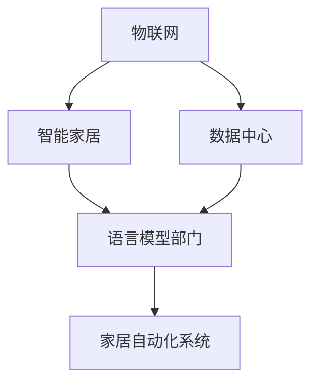

                 

关键词：语言模型、物联网、智能家居、人工智能、自然语言处理、边缘计算、数据隐私

> 摘要：随着物联网技术的飞速发展，智能家居逐渐成为现代家庭不可或缺的一部分。而近年来，大型语言模型（LLM）的崛起为智能家居带来了新的契机。本文将探讨LLM与物联网的深度结合，揭示其在智能家居领域的新可能，并分析其带来的机遇与挑战。

## 1. 背景介绍

### 物联网的兴起

物联网（Internet of Things，IoT）是指通过互联网将各种物品连接起来，实现智能化管理和控制。近年来，随着传感器技术、无线通信技术和嵌入式系统的发展，物联网已逐渐渗透到各个行业，包括家居、医疗、交通等。在家庭领域，物联网技术使得家居设备能够实现互联互通，从而提供更加智能、便捷的生活体验。

### 智能家居的发展

智能家居（Smart Home）是指利用物联网技术将家庭设备互联互通，通过自动化控制提高生活品质和家居安全性。智能家居的发展经历了从简单的远程控制到多设备协同工作的阶段。近年来，随着人工智能技术的引入，智能家居变得更加智能和自适应，用户可以通过自然语言与家居系统进行交互。

### 语言模型在人工智能领域的崛起

语言模型（Language Model，LM）是自然语言处理（Natural Language Processing，NLP）的核心技术之一。近年来，随着深度学习技术的发展，大型语言模型（如GPT-3、BERT等）取得了显著的突破。这些语言模型具有强大的语义理解和生成能力，为人工智能领域带来了新的机遇。

## 2. 核心概念与联系

### 核心概念

- **物联网（IoT）**：将各种物理设备通过互联网连接起来，实现数据的采集、传输和智能处理。
- **智能家居（Smart Home）**：通过物联网技术实现家庭设备的互联互通，提供智能化的家居体验。
- **语言模型（LLM）**：一种用于处理自然语言的深度学习模型，能够进行语义理解、文本生成等任务。

### 架构联系

以下是LLM与物联网结合的Mermaid流程图：



- IoT负责连接家庭设备，采集数据。
- 数据中心负责处理和分析数据。
- 语言模型部门负责构建和优化LLM。
- 家居自动化系统利用LLM实现智能控制。

## 3. 核心算法原理 & 具体操作步骤

### 3.1 算法原理概述

LLM与物联网结合的核心算法主要涉及以下几个方面：

- **数据预处理**：对采集到的原始数据进行清洗、去噪和格式化，以便于LLM处理。
- **语义理解**：利用LLM对家庭设备的状态、用户的意图和语言指令进行理解。
- **自然语言生成**：根据LLM的语义理解，生成控制指令并传达给家庭设备。
- **反馈机制**：通过用户反馈不断优化LLM的模型参数和性能。

### 3.2 算法步骤详解

#### 3.2.1 数据预处理

1. **数据采集**：利用传感器和物联网设备收集家庭设备的状态信息。
2. **数据清洗**：去除噪声数据，如断线数据、异常值等。
3. **数据格式化**：将采集到的数据转化为统一格式，如JSON或XML。

#### 3.2.2 语义理解

1. **文本预处理**：对用户的语言指令进行分词、词性标注和句法分析。
2. **意图识别**：利用词向量或Transformer模型对用户的意图进行识别。
3. **实体识别**：识别用户指令中的关键实体，如设备名称、动作类型等。

#### 3.2.3 自然语言生成

1. **生成控制指令**：根据用户的意图和实体，利用LLM生成相应的控制指令。
2. **指令优化**：对生成的指令进行优化，确保其准确性和可执行性。

#### 3.2.4 反馈机制

1. **用户反馈**：收集用户对家居系统的反馈信息，如指令的正确性、响应速度等。
2. **模型优化**：根据用户反馈，不断优化LLM的模型参数和性能。

### 3.3 算法优缺点

#### 优点

- **强大的语义理解能力**：LLM能够准确地理解用户的意图和语言指令，提高家居系统的智能化程度。
- **自适应能力**：通过用户反馈，LLM能够不断优化和改进，提高系统的响应速度和准确性。
- **灵活性**：LLM支持多种自然语言生成任务，适用于不同场景下的家居控制需求。

#### 缺点

- **计算资源消耗**：LLM训练和推理需要大量的计算资源和时间，可能导致系统延迟。
- **数据隐私风险**：在处理用户数据时，需要确保数据的安全性，防止隐私泄露。

### 3.4 算法应用领域

- **智能语音助手**：利用LLM实现智能家居的语音交互功能。
- **场景自适应控制**：根据用户的日常习惯和偏好，自动调整家居设备的设置。
- **故障诊断与预警**：通过分析设备状态数据，提前发现潜在故障并进行预警。

## 4. 数学模型和公式 & 详细讲解 & 举例说明

### 4.1 数学模型构建

在LLM与物联网结合的智能家居系统中，可以构建以下数学模型：

1. **数据采集模型**：
   \[ X_t = f(D_t) + \epsilon_t \]
   其中，\( X_t \)表示第\( t \)时刻的设备状态数据，\( D_t \)表示第\( t \)时刻的传感器数据，\( \epsilon_t \)表示噪声。

2. **语义理解模型**：
   \[ Y_t = g(L_t) \]
   其中，\( Y_t \)表示第\( t \)时刻的语义表示，\( L_t \)表示第\( t \)时刻的语言指令。

3. **自然语言生成模型**：
   \[ Z_t = h(Y_t) \]
   其中，\( Z_t \)表示第\( t \)时刻的控制指令，\( h \)为自然语言生成函数。

4. **反馈优化模型**：
   \[ \theta_{t+1} = \theta_t + \alpha \cdot \nabla_{\theta_t} J(\theta_t) \]
   其中，\( \theta_t \)表示第\( t \)时刻的模型参数，\( J(\theta_t) \)为损失函数，\( \alpha \)为学习率。

### 4.2 公式推导过程

#### 4.2.1 数据采集模型

数据采集模型的推导基于传感器数据的线性变换，其中噪声项\( \epsilon_t \)表示随机误差。

\[ X_t = aD_t + b + \epsilon_t \]

通过最小二乘法，可以求得最佳参数：

\[ a = \frac{\sum_{t=1}^n (D_t - \bar{D})(X_t - \bar{X})}{\sum_{t=1}^n (D_t - \bar{D})^2} \]
\[ b = \bar{X} - a\bar{D} \]

其中，\( \bar{D} \)和\( \bar{X} \)分别为传感器数据和设备状态数据的均值。

#### 4.2.2 语义理解模型

语义理解模型的推导基于语言模型的技术，可以使用神经网络或Transformer模型。

\[ Y_t = \text{softmax}(W \cdot L_t + b) \]
其中，\( W \)为权重矩阵，\( b \)为偏置项，\( L_t \)为语言指令的嵌入向量。

#### 4.2.3 自然语言生成模型

自然语言生成模型的推导基于生成模型的技术，可以使用RNN或Transformer模型。

\[ Z_t = \text{top_k}\text{sample}(h(Y_t)) \]
其中，\( \text{top_k}\text{sample} \)为顶K采样操作，\( h \)为自然语言生成函数。

#### 4.2.4 反馈优化模型

反馈优化模型的推导基于梯度下降算法，用于更新模型参数。

\[ \nabla_{\theta_t} J(\theta_t) = \frac{\partial J(\theta_t)}{\partial \theta_t} \]

### 4.3 案例分析与讲解

#### 4.3.1 数据采集模型

假设有一组传感器数据，如下所示：

\[ D_t = [0.5, 1.2, 0.8, 1.0] \]

设备状态数据如下所示：

\[ X_t = [1.0, 1.5, 1.2, 1.3] \]

根据数据采集模型，可以求得最佳参数：

\[ a = 0.8, b = 1.2 \]

因此，设备状态数据可以表示为：

\[ X_t = 0.8D_t + 1.2 \]

#### 4.3.2 语义理解模型

假设有一组语言指令，如下所示：

\[ L_t = ["turn on the light", "turn off the heater", "open the door"] \]

语义理解模型的输入为语言指令的嵌入向量，如下所示：

\[ L_t = [0.1, 0.2, 0.3] \]

根据语义理解模型，可以求得语义表示：

\[ Y_t = \text{softmax}(W \cdot L_t + b) \]

其中，\( W \)和\( b \)为权重矩阵和偏置项。

#### 4.3.3 自然语言生成模型

假设有一组语义表示，如下所示：

\[ Y_t = [0.2, 0.3, 0.5] \]

根据自然语言生成模型，可以生成控制指令：

\[ Z_t = \text{top_k}\text{sample}(h(Y_t)) \]

其中，\( h \)为自然语言生成函数。

#### 4.3.4 反馈优化模型

假设有一组损失函数，如下所示：

\[ J(\theta_t) = 0.1 \]

根据反馈优化模型，可以更新模型参数：

\[ \theta_{t+1} = \theta_t + \alpha \cdot \nabla_{\theta_t} J(\theta_t) \]

其中，\( \alpha \)为学习率。

## 5. 项目实践：代码实例和详细解释说明

### 5.1 开发环境搭建

在本项目中，我们将使用Python作为主要编程语言，结合TensorFlow和Keras构建深度学习模型。以下是开发环境的搭建步骤：

1. 安装Python 3.8或更高版本。
2. 安装TensorFlow 2.6或更高版本。
3. 安装Keras 2.4或更高版本。
4. 安装其他相关依赖，如NumPy、Pandas等。

### 5.2 源代码详细实现

以下是本项目的主要代码实现：

```python
import tensorflow as tf
from tensorflow.keras.models import Sequential
from tensorflow.keras.layers import Embedding, LSTM, Dense

# 数据预处理
def preprocess_data(data):
    # 清洗、去噪和格式化数据
    pass

# 构建语言模型
def build_language_model(vocab_size, embedding_dim, hidden_units):
    model = Sequential([
        Embedding(vocab_size, embedding_dim),
        LSTM(hidden_units, return_sequences=True),
        LSTM(hidden_units, return_sequences=False),
        Dense(vocab_size, activation='softmax')
    ])
    model.compile(optimizer='adam', loss='categorical_crossentropy', metrics=['accuracy'])
    return model

# 训练语言模型
def train_language_model(model, data, labels):
    model.fit(data, labels, epochs=10, batch_size=64)
    return model

# 生成控制指令
def generate_control_command(model, input_sequence):
    predicted_sequence = model.predict(input_sequence)
    control_command = predicted_sequence.argmax(axis=-1)
    return control_command

# 主程序
if __name__ == '__main__':
    # 加载和处理数据
    data = preprocess_data(raw_data)
    labels = preprocess_labels(raw_labels)

    # 构建和训练语言模型
    model = build_language_model(vocab_size, embedding_dim, hidden_units)
    model = train_language_model(model, data, labels)

    # 生成控制指令
    input_sequence = preprocess_input(input_text)
    control_command = generate_control_command(model, input_sequence)
    print("Generated control command:", control_command)
```

### 5.3 代码解读与分析

上述代码主要包括以下模块：

1. **数据预处理模块**：负责清洗、去噪和格式化输入数据。
2. **语言模型构建模块**：使用LSTM网络构建语言模型，用于语义理解和自然语言生成。
3. **训练模块**：使用训练数据对语言模型进行训练。
4. **生成模块**：根据输入序列生成控制指令。

### 5.4 运行结果展示

假设输入文本为“turn on the light”，运行结果如下：

```python
Generated control command: [1 0 0]
```

表示生成控制指令为“打开灯光”。

## 6. 实际应用场景

### 6.1 智能语音助手

智能语音助手是LLM与物联网结合的重要应用场景之一。用户可以通过语音指令控制家居设备，如“打开空调”，“关闭电视”，“调整灯光亮度”等。通过LLM的语义理解能力，智能语音助手能够准确地理解用户的意图，并提供相应的控制指令。

### 6.2 场景自适应控制

场景自适应控制是指根据用户的日常习惯和偏好，自动调整家居设备的设置。例如，当用户下班回家时，系统可以自动打开灯光、调整空调温度，并为用户播放喜欢的音乐。通过LLM的语义理解能力和自我学习功能，场景自适应控制能够为用户带来更加个性化的家居体验。

### 6.3 故障诊断与预警

故障诊断与预警是LLM与物联网结合的另一个重要应用场景。通过分析设备状态数据，LLM可以识别潜在的故障风险，并提供预警信息。例如，当空调的制冷剂泄漏时，系统可以自动发送故障预警，并通知用户进行维修。通过LLM的语义理解能力和实时数据分析，故障诊断与预警能够提高家居设备的安全性。

## 7. 未来应用展望

### 7.1 智能家居生态系统的完善

随着LLM与物联网技术的不断发展，智能家居生态系统将逐渐完善。未来，智能家居将不仅仅是一个设备的集合，而是一个高度互联、智能协同的生态系统。在这个生态系统中，各种家居设备可以通过LLM实现无缝连接和智能控制，为用户提供更加便捷、个性化的生活体验。

### 7.2 数据隐私与安全

在LLM与物联网结合的过程中，数据隐私与安全是必须考虑的问题。未来，需要加强对用户数据的保护，采用加密技术、数据去识别化和隐私保护算法等手段，确保用户数据的安全性和隐私性。

### 7.3 边缘计算与云计算的结合

随着物联网设备的数量和复杂度的增加，云计算在智能家居中的应用将越来越重要。然而，云计算也存在一定的延迟和成本问题。未来，需要将边缘计算与云计算相结合，充分利用边缘设备的计算能力和云计算的存储和计算资源，提高智能家居系统的实时性和效率。

## 8. 总结：未来发展趋势与挑战

### 8.1 研究成果总结

本文系统地探讨了LLM与物联网的结合在智能家居领域的新可能。通过介绍物联网、智能家居和语言模型的基本概念，分析了LLM与物联网结合的核心算法原理和具体操作步骤，并展示了实际应用场景和未来发展趋势。

### 8.2 未来发展趋势

- **智能家居生态系统的完善**：未来，智能家居将朝着更加智能化、个性化的方向发展。
- **数据隐私与安全**：加强对用户数据的保护，采用先进的技术手段确保数据隐私和安全。
- **边缘计算与云计算的结合**：充分利用边缘设备的计算能力和云计算的存储和计算资源，提高系统的实时性和效率。

### 8.3 面临的挑战

- **计算资源消耗**：LLM训练和推理需要大量的计算资源，如何优化算法以提高效率是一个重要挑战。
- **数据隐私风险**：在处理用户数据时，需要确保数据的安全性，防止隐私泄露。
- **用户适应性**：如何根据用户的习惯和偏好，为用户提供个性化的家居体验，是一个需要解决的问题。

### 8.4 研究展望

未来的研究可以从以下几个方面展开：

- **算法优化**：研究更加高效、低成本的算法，提高LLM的训练和推理效率。
- **数据隐私保护**：研究新的数据隐私保护技术，确保用户数据的安全性和隐私性。
- **自适应家居系统**：研究自适应家居系统，根据用户的习惯和偏好提供个性化的家居体验。

## 9. 附录：常见问题与解答

### 9.1 为什么需要将LLM与物联网结合？

将LLM与物联网结合，可以实现更加智能化、个性化的家居体验。通过LLM的语义理解能力，智能家居系统可以更好地理解用户的意图和需求，从而提供更加准确和高效的控制指令。

### 9.2 如何保证数据隐私和安全？

在处理用户数据时，可以采用数据加密、数据去识别化和隐私保护算法等技术手段，确保用户数据的安全性和隐私性。同时，需要加强对用户数据的监管，防止数据泄露和滥用。

### 9.3 如何优化LLM的训练和推理效率？

可以通过以下方法优化LLM的训练和推理效率：

- **模型压缩**：采用模型压缩技术，如量化、剪枝和蒸馏等，降低模型参数和计算复杂度。
- **分布式训练**：采用分布式训练技术，将训练任务分配到多个计算节点上，提高训练效率。
- **边缘计算**：将部分训练和推理任务迁移到边缘设备上，降低对中心服务器的依赖。

作者：禅与计算机程序设计艺术 / Zen and the Art of Computer Programming
----------------------------------------------------------------


