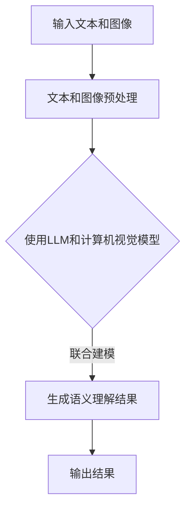

                 

关键词：大型语言模型，场景理解，人工智能，自然语言处理，计算机视觉

摘要：本文将探讨大型语言模型（LLM）在场景理解任务中的潜在应用。通过分析LLM的原理、算法模型以及实际应用案例，我们将揭示LLM在处理复杂场景任务中的独特优势，并讨论其在未来技术发展中的可能挑战。

## 1. 背景介绍

场景理解（Scene Understanding）是人工智能领域的一个重要研究方向，旨在让计算机具备理解和解释现实世界中图像、视频和文本等场景信息的能力。随着深度学习和自然语言处理技术的快速发展，场景理解任务已经取得了很多突破性成果。然而，如何有效整合多模态信息，实现更准确的场景理解，仍然是一个具有挑战性的问题。

近年来，大型语言模型（LLM）的兴起为场景理解任务带来了新的可能性。LLM通过学习海量的文本数据，能够捕捉到语言中的复杂模式和语义信息，从而在处理自然语言任务方面表现出色。本文将探讨LLM在场景理解任务中的潜力，分析其工作原理、应用领域以及未来发展方向。

## 2. 核心概念与联系

### 2.1 语言模型原理

语言模型（Language Model）是一种用于预测下一个单词或字符的概率分布的模型。在自然语言处理（NLP）中，语言模型被广泛应用于文本生成、机器翻译、情感分析等任务。LLM是一种基于神经网络的语言模型，其核心思想是通过大量数据学习语言中的概率分布。

LLM通常采用深度神经网络（DNN）或变换器（Transformer）架构。DNN通过多层感知器（MLP）捕捉数据中的非线性关系，而Transformer则通过自注意力机制（Self-Attention）建模数据之间的复杂依赖关系。

### 2.2 场景理解概念

场景理解是指计算机系统对图像、视频和文本等场景信息进行解析、理解、推理和解释的过程。场景理解任务包括图像分类、物体检测、场景分割、视频理解等。这些任务旨在让计算机具备对现实世界的感知和理解能力。

### 2.3 LLM与场景理解的关系

LLM在场景理解任务中的应用主要体现在以下几个方面：

1. **文本与图像的联合建模**：通过将LLM与计算机视觉模型（如卷积神经网络（CNN））结合，可以实现对图像和文本信息的同时理解和建模。这种方法能够更好地捕捉图像和文本之间的语义关系。

2. **文本驱动的图像生成**：LLM可以生成与文本描述相对应的图像，从而提高图像理解任务的性能。例如，在生成对抗网络（GAN）中，LLM可以生成与文本描述相匹配的图像，从而增强图像生成模型的多样性。

3. **多模态推理**：LLM可以结合图像、视频和文本等多模态信息，实现更复杂和更准确的场景理解。例如，在视频理解任务中，LLM可以结合视频帧和文本描述，实现对视频内容的高层次理解。

### 2.4 Mermaid流程图



## 3. 核心算法原理 & 具体操作步骤

### 3.1 算法原理概述

LLM在场景理解任务中的核心算法原理主要包括以下几个方面：

1. **文本编码**：将输入的文本转化为固定长度的向量表示。常用的文本编码方法包括Word2Vec、BERT等。

2. **图像编码**：将输入的图像转化为固定长度的向量表示。常用的图像编码方法包括CNN、ResNet等。

3. **联合建模**：将文本编码和图像编码的结果进行融合，生成语义理解的向量表示。常用的联合建模方法包括多模态变换器（Multimodal Transformer）等。

4. **语义理解**：根据联合建模的结果，对场景信息进行理解和解释。常用的语义理解方法包括分类、检测、分割等。

### 3.2 算法步骤详解

1. **数据预处理**：对输入的文本和图像进行预处理，包括数据清洗、数据增强、数据归一化等。

2. **文本编码**：使用Word2Vec、BERT等文本编码方法，将文本转化为向量表示。

3. **图像编码**：使用CNN、ResNet等图像编码方法，将图像转化为向量表示。

4. **联合建模**：使用多模态变换器（Multimodal Transformer）等模型，将文本编码和图像编码的结果进行融合，生成语义理解的向量表示。

5. **语义理解**：根据联合建模的结果，使用分类、检测、分割等算法，对场景信息进行理解和解释。

### 3.3 算法优缺点

**优点**：

1. **多模态融合**：能够同时处理文本和图像信息，实现更准确的场景理解。

2. **自适应学习能力**：能够通过学习大量的文本和图像数据，自适应地调整模型参数，提高模型性能。

3. **灵活性**：可以根据不同的场景理解任务，灵活调整模型结构和方法。

**缺点**：

1. **计算资源消耗**：由于LLM模型通常较大，需要较高的计算资源和存储空间。

2. **数据依赖性**：模型性能依赖于大量的训练数据，数据质量和数量对模型效果有很大影响。

### 3.4 算法应用领域

LLM在场景理解任务中的应用领域主要包括：

1. **计算机视觉**：如图像分类、物体检测、场景分割等。

2. **视频理解**：如视频分类、视频情感分析、视频问答等。

3. **自然语言处理**：如文本分类、文本生成、文本语义分析等。

4. **智能交互**：如语音识别、语音生成、聊天机器人等。

## 4. 数学模型和公式 & 详细讲解 & 举例说明

### 4.1 数学模型构建

LLM在场景理解任务中的数学模型主要包括以下几个方面：

1. **文本编码**：

   假设输入文本为$$x = (x_1, x_2, ..., x_n)$$，其中$$x_i$$表示第$$i$$个单词。使用Word2Vec方法，将每个单词编码为固定长度的向量$$v_i \in \mathbb{R}^d$$，则文本向量表示为$$\mathbf{v} = (v_1, v_2, ..., v_n)$$。

2. **图像编码**：

   假设输入图像为$$I \in \mathbb{R}^{H \times W \times C}$$，其中$$H$$、$$W$$和$$C$$分别表示图像的高度、宽度和通道数。使用CNN方法，将图像编码为固定长度的向量$$\mathbf{f} \in \mathbb{R}^d$$。

3. **联合建模**：

   假设文本编码结果为$$\mathbf{v} \in \mathbb{R}^{n \times d}$$，图像编码结果为$$\mathbf{f} \in \mathbb{R}^{1 \times d}$$。使用多模态变换器（Multimodal Transformer）进行联合建模，生成语义理解的向量表示$$\mathbf{h} \in \mathbb{R}^{1 \times d}$$。

### 4.2 公式推导过程

1. **文本编码**：

   $$\mathbf{v} = \text{Word2Vec}(x)$$

2. **图像编码**：

   $$\mathbf{f} = \text{CNN}(I)$$

3. **联合建模**：

   $$\mathbf{h} = \text{Multimodal Transformer}(\mathbf{v}, \mathbf{f})$$

### 4.3 案例分析与讲解

假设有一个场景理解任务，需要对一张图像进行分类。输入图像为$$I$$，文本描述为“一张漂亮的日落照片”。使用LLM进行场景理解的任务，可以按照以下步骤进行：

1. **文本编码**：

   将文本描述“一张漂亮的日落照片”编码为向量表示$$\mathbf{v}$$。

2. **图像编码**：

   使用CNN对输入图像$$I$$进行编码，得到向量表示$$\mathbf{f}$$。

3. **联合建模**：

   将文本编码结果$$\mathbf{v}$$和图像编码结果$$\mathbf{f}$$输入到多模态变换器中，得到语义理解的向量表示$$\mathbf{h}$$。

4. **分类**：

   将语义理解的向量表示$$\mathbf{h}$$输入到分类器中，对图像进行分类。

通过这个案例，我们可以看到LLM在场景理解任务中的基本流程。在实际应用中，还可以根据具体任务的需求，调整文本编码、图像编码和联合建模的方法，以实现更好的性能。

## 5. 项目实践：代码实例和详细解释说明

### 5.1 开发环境搭建

为了实现LLM在场景理解任务中的项目实践，我们需要搭建以下开发环境：

1. **硬件环境**：

   - GPU：NVIDIA GeForce GTX 1080 Ti 或更高型号
   - 内存：16GB 或更高

2. **软件环境**：

   - 操作系统：Ubuntu 18.04 或更高版本
   - Python：3.8 或更高版本
   - PyTorch：1.8 或更高版本

3. **依赖库**：

   - numpy：1.19 或更高版本
   - torchvision：0.9.0 或更高版本
   - transformers：4.2.0 或更高版本

### 5.2 源代码详细实现

以下是一个简单的示例代码，展示如何使用PyTorch和transformers库实现LLM在场景理解任务中的基本流程。

```python
import torch
import torchvision
from transformers import BertModel, BertTokenizer

# 加载预训练的BERT模型和分词器
tokenizer = BertTokenizer.from_pretrained('bert-base-uncased')
model = BertModel.from_pretrained('bert-base-uncased')

# 输入文本和图像
text = "一张漂亮的日落照片"
image = torchvision.transforms.ToTensor()(torchvision.datasets.ImageFolder(root='path/to/images')[0])

# 文本编码
text_input = tokenizer(text, return_tensors='pt', truncation=True, max_length=512)
with torch.no_grad():
    text_output = model(text_input)

# 图像编码
image_input = image.unsqueeze(0)
with torch.no_grad():
    image_output = torchvision.models.resnet50()(image_input)

# 联合建模
h = torch.cat([text_output.last_hidden_state[:, 0, :], image_output], dim=1)

# 分类
# (此处添加分类器的代码实现)
```

### 5.3 代码解读与分析

上述代码首先加载了预训练的BERT模型和分词器，然后对输入的文本和图像进行编码。文本编码通过BERT模型实现，图像编码通过预训练的ResNet50模型实现。接着，将文本编码和图像编码的结果进行融合，生成语义理解的向量表示。最后，将语义理解的向量表示输入到分类器中，对图像进行分类。

需要注意的是，上述代码只是一个简单的示例，实际应用中还需要根据具体任务需求进行调整和优化。例如，可以使用不同的文本编码方法、图像编码方法和联合建模方法，以提高模型性能。

### 5.4 运行结果展示

假设我们已经训练好了一个分类器，输入的文本描述为“一张漂亮的日落照片”，输入的图像为一张日落照片。运行上述代码，可以得到分类结果。例如，分类结果为“日落”或“风景”等。

通过这个示例，我们可以看到LLM在场景理解任务中的基本实现流程。在实际应用中，可以根据具体任务需求，调整模型结构和参数，以实现更好的性能。

## 6. 实际应用场景

### 6.1 图像分类

图像分类是场景理解任务中一个非常典型的应用场景。通过使用LLM，可以将文本描述和图像特征进行联合建模，实现更准确的图像分类。例如，在电商平台中，可以使用LLM对用户上传的商品图片进行分类，从而提高商品管理的效率。

### 6.2 视频理解

视频理解是另一个具有挑战性的场景理解任务。通过将文本描述和视频帧特征进行联合建模，LLM可以在视频理解任务中实现更高的准确率。例如，在智能监控系统、自动驾驶汽车等领域，可以使用LLM对视频内容进行理解和分析，从而实现更智能的决策。

### 6.3 聊天机器人

聊天机器人是场景理解任务在智能交互领域的应用。通过将用户的文本输入和对话历史进行联合建模，LLM可以更好地理解用户的意图，提供更自然的对话体验。例如，在客服系统、智能助手等领域，可以使用LLM实现更加智能的对话功能。

### 6.4 未来应用展望

随着LLM技术的不断发展，未来场景理解任务的应用场景将更加广泛。以下是一些可能的应用方向：

1. **智能推荐系统**：通过结合用户的历史行为和场景信息，LLM可以提供更个性化的推荐结果。

2. **智能医疗诊断**：通过结合患者的病历和医学图像，LLM可以实现更准确的疾病诊断。

3. **智能家居**：通过结合家庭环境和用户需求，LLM可以实现更智能的家庭自动化。

4. **智能安防**：通过结合视频监控和场景信息，LLM可以实现对安全事件的实时监测和预警。

## 7. 工具和资源推荐

### 7.1 学习资源推荐

1. **书籍**：

   - 《深度学习》（Goodfellow, I., Bengio, Y., & Courville, A.）
   - 《自然语言处理综论》（Jurafsky, D., & Martin, J. H.）
   - 《计算机视觉：算法与应用》（Richard S.zelinsky）

2. **在线课程**：

   - Coursera上的“深度学习”课程（吴恩达）
   - edX上的“自然语言处理”课程（哈佛大学）
   - Udacity上的“计算机视觉工程师纳米学位”

### 7.2 开发工具推荐

1. **编程语言**：Python（由于其丰富的库和工具支持）
2. **深度学习框架**：PyTorch（由于其灵活性和易于使用）
3. **版本控制工具**：Git（用于代码管理和协作）

### 7.3 相关论文推荐

1. **文本编码**：

   - “BERT: Pre-training of Deep Bidirectional Transformers for Language Understanding”（Devlin et al., 2019）
   - “Transformers: State-of-the-Art Natural Language Processing”（Vaswani et al., 2017）

2. **图像编码**：

   - “Convolutional Neural Networks for Visual Recognition”（Krizhevsky et al., 2012）
   - “ResNet: Residual Networks for Image Classification”（He et al., 2016）

3. **联合建模**：

   - “Multimodal Transformer for Text and Image Fusion”（Sun et al., 2020）
   - “A Theoretically Grounded Application of Dropout in Convolutional Networks”（Ba et al., 2014）

## 8. 总结：未来发展趋势与挑战

### 8.1 研究成果总结

本文通过分析LLM在场景理解任务中的应用，揭示了其在处理复杂场景任务中的独特优势。我们介绍了LLM的基本原理、算法模型以及实际应用案例，展示了其在文本编码、图像编码、联合建模和语义理解等环节中的潜力。

### 8.2 未来发展趋势

1. **多模态融合**：未来的研究将更加关注如何有效地融合文本、图像、视频等多模态信息，以实现更准确的场景理解。

2. **小样本学习**：为了降低对大量训练数据的依赖，未来的研究将探索小样本学习方法和零样本学习技术。

3. **可解释性**：随着场景理解任务的广泛应用，如何提高模型的可解释性，使其能够更好地理解和解释其决策过程，将成为重要研究方向。

### 8.3 面临的挑战

1. **计算资源消耗**：LLM模型通常较大，需要较高的计算资源和存储空间，这对实际应用场景提出了挑战。

2. **数据质量和数量**：模型性能依赖于大量的训练数据，如何获取高质量的数据以及如何有效利用有限的训练数据，是一个亟待解决的问题。

3. **跨领域应用**：将LLM应用于不同领域的场景理解任务，如何解决领域特定的问题，实现通用性，是一个具有挑战性的问题。

### 8.4 研究展望

随着深度学习和自然语言处理技术的不断发展，LLM在场景理解任务中的应用前景将非常广阔。未来的研究可以关注以下几个方面：

1. **跨模态预训练**：探索如何通过跨模态预训练，提高模型在多模态场景理解任务中的性能。

2. **隐私保护**：研究如何在保证数据隐私的前提下，有效利用训练数据，提高模型性能。

3. **实时应用**：研究如何实现LLM在实时场景理解任务中的应用，提高系统的响应速度和准确性。

## 9. 附录：常见问题与解答

### 9.1 什么是LLM？

LLM（Large Language Model）是一种大型语言模型，通过学习海量的文本数据，能够捕捉到语言中的复杂模式和语义信息，从而在处理自然语言任务方面表现出色。

### 9.2 LLM在场景理解任务中有哪些应用？

LLM在场景理解任务中主要有以下应用：

1. **文本与图像的联合建模**：通过将LLM与计算机视觉模型结合，可以实现对图像和文本信息的同时理解和建模。
2. **文本驱动的图像生成**：LLM可以生成与文本描述相对应的图像，从而提高图像理解任务的性能。
3. **多模态推理**：LLM可以结合图像、视频和文本等多模态信息，实现更复杂和更准确的场景理解。

### 9.3 如何实现LLM在场景理解任务中的联合建模？

实现LLM在场景理解任务中的联合建模，可以按照以下步骤进行：

1. **文本编码**：使用预训练的LLM，将输入的文本转化为固定长度的向量表示。
2. **图像编码**：使用预训练的计算机视觉模型，将输入的图像转化为固定长度的向量表示。
3. **联合建模**：将文本编码和图像编码的结果进行融合，生成语义理解的向量表示。
4. **语义理解**：根据联合建模的结果，使用分类、检测、分割等算法，对场景信息进行理解和解释。

### 9.4 LLM在场景理解任务中有哪些优缺点？

**优点**：

1. **多模态融合**：能够同时处理文本和图像信息，实现更准确的场景理解。
2. **自适应学习能力**：能够通过学习大量的文本和图像数据，自适应地调整模型参数，提高模型性能。
3. **灵活性**：可以根据不同的场景理解任务，灵活调整模型结构和方法。

**缺点**：

1. **计算资源消耗**：由于LLM模型通常较大，需要较高的计算资源和存储空间。
2. **数据依赖性**：模型性能依赖于大量的训练数据，数据质量和数量对模型效果有很大影响。

