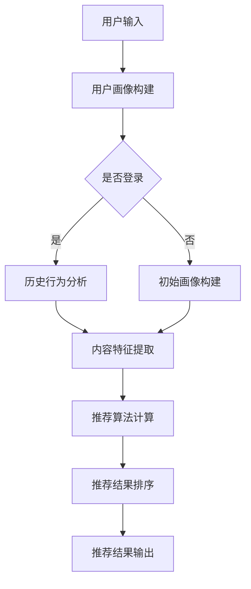

                 

关键词：LLM、推荐系统、跨语言应用、自然语言处理、多语言模型、语言理解、语言生成

>摘要：本文深入探讨了大型语言模型（LLM）在推荐系统中的跨语言应用。通过对LLM的工作原理及其在跨语言推荐中的优势进行详细分析，本文提出了一个基于LLM的跨语言推荐系统的框架。同时，文章通过数学模型和实际代码实例，展示了LLM在跨语言推荐中的具体实现和应用，为未来跨语言推荐系统的发展提供了有益的参考。

## 1. 背景介绍

随着全球化的推进和互联网的普及，跨语言交流的需求日益增加。在推荐系统中，跨语言应用成为了一个重要的研究方向。传统的推荐系统主要依赖于用户的历史行为和内容属性，往往无法很好地处理不同语言的内容。而随着自然语言处理（NLP）技术的进步，特别是大型语言模型（LLM）的出现，跨语言推荐系统的研究和应用得到了极大的推动。

LLM是一种基于深度学习的语言模型，具有强大的文本理解和生成能力。它通过对海量文本数据进行预训练，可以学习到语言的内在结构和规律，从而实现对各种语言的有效处理。在推荐系统中，LLM可以用于文本数据的提取、用户兴趣的识别、内容推荐等环节，大大提高了推荐系统的效果和多样性。

跨语言推荐系统的研究和应用具有以下几方面的意义：

1. **满足跨语言用户需求**：对于全球化的互联网平台，能够提供跨语言的推荐服务，可以更好地满足不同语言用户的个性化需求。

2. **提升推荐系统的多样性**：通过跨语言推荐，可以引入更多的内容来源，丰富推荐系统的内容多样性，提升用户体验。

3. **促进国际化发展**：对于有国际化战略的企业和平台，跨语言推荐系统可以促进其在全球范围内的业务扩展。

4. **提升系统的鲁棒性**：跨语言推荐系统在面对不同语言环境时，能够更加灵活地适应，提高系统的鲁棒性。

本文旨在探讨LLM在推荐系统中的跨语言应用，通过深入分析LLM的工作原理和优势，提出一个基于LLM的跨语言推荐系统框架，并通过数学模型和实际代码实例，展示其在跨语言推荐中的具体实现和应用。

## 2. 核心概念与联系

### 2.1 大型语言模型（LLM）

#### 2.1.1 定义

大型语言模型（LLM）是一种基于深度学习的语言模型，通过对海量文本数据进行预训练，可以学习到语言的内在结构和规律。LLM的核心任务是理解、生成和预测自然语言文本。

#### 2.1.2 工作原理

LLM的工作原理主要基于深度神经网络（DNN）和变换器架构（Transformer）。预训练阶段，LLM通过无监督学习从大量文本数据中学习到语言的统计规律和语义信息。在微调阶段，LLM根据特定任务的需求进行调整和优化，从而实现对特定任务的胜任。

#### 2.1.3 特点与优势

- **强大的文本理解能力**：LLM通过对海量文本数据的预训练，能够理解复杂的语言结构和语义，实现对各种语言内容的有效处理。
- **高效的文本生成能力**：LLM能够生成高质量的文本，包括摘要、文章、对话等，具有很高的实用价值。
- **多语言支持**：LLM可以通过训练实现多语言的处理能力，能够支持不同语言的文本理解和生成。

### 2.2 推荐系统

#### 2.2.1 定义

推荐系统是一种基于数据挖掘和机器学习技术的应用系统，旨在向用户推荐他们可能感兴趣的信息、商品或服务。

#### 2.2.2 架构

推荐系统通常由以下几个核心模块组成：

- **用户画像**：通过用户的历史行为、兴趣和偏好，构建用户画像，用于描述用户的需求和兴趣。
- **内容特征提取**：对推荐的内容进行特征提取，包括文本、图像、音频等，用于构建内容特征向量。
- **推荐算法**：基于用户画像和内容特征，利用算法计算用户和内容之间的相似度或兴趣度，生成推荐结果。
- **推荐结果排序**：对推荐结果进行排序，将最可能感兴趣的内容优先推荐给用户。

#### 2.2.3 类型

- **基于内容的推荐**：根据用户的历史行为和兴趣，推荐与用户兴趣相似的内容。
- **协同过滤推荐**：通过分析用户之间的行为相似性，推荐用户可能感兴趣的内容。
- **混合推荐**：结合多种推荐算法，提高推荐系统的效果和多样性。

### 2.3 跨语言推荐

#### 2.3.1 定义

跨语言推荐是指在不同语言的用户之间提供推荐服务，满足不同语言用户的个性化需求。

#### 2.3.2 难点与挑战

- **语言差异**：不同语言在语法、词汇、语义等方面存在显著差异，给推荐系统带来了挑战。
- **数据稀缺**：不同语言的文本数据资源分布不均，某些语言可能缺乏足够的训练数据。
- **语义理解**：跨语言推荐需要理解不同语言之间的语义关系，实现语言的翻译和映射。
- **文化差异**：不同文化背景下的用户偏好和价值观差异，影响推荐系统的效果。

#### 2.3.3 解决方案

- **多语言模型**：利用多语言模型，实现不同语言之间的文本理解和生成，提高跨语言推荐的效果。
- **数据增强**：通过数据增强技术，扩展训练数据集，提高模型对各种语言的适应性。
- **跨语言嵌入**：利用跨语言嵌入技术，实现不同语言之间的语义映射，提高推荐系统的鲁棒性。

### 2.4 Mermaid 流程图



## 3. 核心算法原理 & 具体操作步骤

### 3.1 算法原理概述

本文所提出的基于LLM的跨语言推荐算法，主要分为以下几个步骤：

1. **用户画像构建**：根据用户的历史行为和兴趣，构建用户画像。
2. **内容特征提取**：对推荐的内容进行特征提取，包括文本、图像、音频等。
3. **推荐算法计算**：利用LLM，计算用户和内容之间的相似度或兴趣度，生成推荐结果。
4. **推荐结果排序**：对推荐结果进行排序，将最可能感兴趣的内容优先推荐给用户。
5. **推荐结果输出**：将推荐结果输出给用户。

### 3.2 算法步骤详解

#### 3.2.1 用户画像构建

1. **登录用户**：通过用户的登录信息，获取用户的历史行为数据，如浏览记录、购买记录、评论等。
2. **非登录用户**：通过用户的设备信息、地理位置、访问时间等，构建初始用户画像。

#### 3.2.2 内容特征提取

1. **文本特征提取**：利用LLM，对文本内容进行语义嵌入，生成文本特征向量。
2. **图像特征提取**：利用深度学习模型，提取图像的特征向量。
3. **音频特征提取**：利用语音识别技术，将音频转换为文本，然后利用LLM进行语义嵌入。

#### 3.2.3 推荐算法计算

1. **相似度计算**：利用用户画像和内容特征，计算用户和内容之间的相似度。
2. **兴趣度计算**：利用LLM，根据用户画像和内容特征，计算用户对内容的兴趣度。
3. **综合评分**：将相似度和兴趣度综合，生成内容的综合评分。

#### 3.2.4 推荐结果排序

1. **评分排序**：根据内容的综合评分，对推荐结果进行排序。
2. **多样性优化**：通过随机化、内容多样性策略，优化推荐结果的多样性。

#### 3.2.5 推荐结果输出

1. **推荐结果生成**：根据排序结果，生成推荐结果。
2. **推荐结果展示**：将推荐结果展示给用户。

### 3.3 算法优缺点

#### 优点

- **强大的文本理解能力**：LLM能够理解复杂的语言结构和语义，提高推荐系统的效果。
- **高效的文本生成能力**：LLM能够生成高质量的文本，提高用户的阅读体验。
- **多语言支持**：LLM支持多种语言的文本理解和生成，满足跨语言推荐的需求。
- **灵活的扩展性**：LLM可以轻松适应不同的推荐场景和任务需求。

#### 缺点

- **计算资源消耗大**：LLM的预训练和微调过程需要大量的计算资源和时间。
- **数据质量要求高**：高质量的数据对LLM的训练和效果至关重要。
- **模型解释性差**：深度学习模型通常具有较低的解释性，难以直观理解模型的决策过程。

### 3.4 算法应用领域

LLM在推荐系统中的跨语言应用具有广泛的应用前景，主要包括以下几个领域：

- **电子商务**：在电子商务平台中，跨语言推荐可以帮助不同语言的消费者发现感兴趣的商品。
- **社交媒体**：在社交媒体平台上，跨语言推荐可以提高不同语言用户的参与度和活跃度。
- **在线教育**：在线教育平台可以通过跨语言推荐，为全球学生提供个性化的学习资源。
- **旅游行业**：旅游行业可以通过跨语言推荐，为游客提供个性化的旅游推荐。
- **跨国企业**：跨国企业可以通过跨语言推荐，提高其在不同语言市场的业务拓展能力。

## 4. 数学模型和公式

### 4.1 数学模型构建

基于LLM的跨语言推荐算法，可以构建如下数学模型：

$$
\text{Score}(u, c) = w_1 \cdot \text{Sim}(u, c) + w_2 \cdot I(u, c)
$$

其中，$u$表示用户，$c$表示内容，$\text{Sim}(u, c)$表示用户和内容之间的相似度，$I(u, c)$表示用户对内容的兴趣度，$w_1$和$w_2$是权重参数。

### 4.2 公式推导过程

#### 相似度计算

$$
\text{Sim}(u, c) = \frac{\text{dot}(u, c)}{\lVert u \rVert \cdot \lVert c \rVert}
$$

其中，$\text{dot}(u, c)$表示用户和内容的点积，$\lVert u \rVert$和$\lVert c \rVert$分别表示用户和内容的特征向量长度。

#### 兴趣度计算

$$
I(u, c) = \text{logistic}(\beta_0 + \beta_1 \cdot \text{dot}(u, c))
$$

其中，$\beta_0$和$\beta_1$是权重参数，$\text{logistic}$函数将点积转换为概率分布。

### 4.3 案例分析与讲解

#### 案例一：电子商务平台的跨语言推荐

假设用户$u$对英语商品有较高的兴趣，而内容$c_1$和$c_2$分别是英语和法语商品。我们可以通过以下步骤进行跨语言推荐：

1. **用户画像构建**：根据用户的历史行为，构建用户画像，包括英语商品的浏览记录、购买记录等。
2. **内容特征提取**：对英语商品$c_1$和法语商品$c_2$进行特征提取，生成英语和法语商品的语义向量。
3. **相似度计算**：计算用户$u$和英语商品$c_1$、法语商品$c_2$之间的相似度。
4. **兴趣度计算**：利用LLM，计算用户$u$对英语商品$c_1$和法语商品$c_2$的兴趣度。
5. **综合评分**：将相似度和兴趣度综合，生成英语商品$c_1$和法语商品$c_2$的综合评分。
6. **推荐结果排序**：根据综合评分，对英语商品$c_1$和法语商品$c_2$进行排序。
7. **推荐结果输出**：将排序结果输出给用户，推荐英语商品$c_1$和法语商品$c_2$。

#### 案例二：社交媒体平台的跨语言推荐

假设用户$u$在社交媒体平台上活跃，其语言偏好为英语。而内容$c_1$和$c_2$分别是英语和法语用户发布的动态。我们可以通过以下步骤进行跨语言推荐：

1. **用户画像构建**：根据用户的历史行为，构建用户画像，包括英语用户的点赞、评论、分享等行为。
2. **内容特征提取**：对英语动态$c_1$和法语动态$c_2$进行特征提取，生成英语和法语动态的语义向量。
3. **相似度计算**：计算用户$u$和英语动态$c_1$、法语动态$c_2$之间的相似度。
4. **兴趣度计算**：利用LLM，计算用户$u$对英语动态$c_1$和法语动态$c_2$的兴趣度。
5. **综合评分**：将相似度和兴趣度综合，生成英语动态$c_1$和法语动态$c_2$的综合评分。
6. **推荐结果排序**：根据综合评分，对英语动态$c_1$和法语动态$c_2$进行排序。
7. **推荐结果输出**：将排序结果输出给用户，推荐英语动态$c_1$和法语动态$c_2$。

## 5. 项目实践：代码实例和详细解释说明

### 5.1 开发环境搭建

在Python中，我们可以使用以下工具和库来搭建开发环境：

- **Python**：Python 3.8及以上版本。
- **TensorFlow**：TensorFlow 2.4及以上版本。
- **NumPy**：NumPy 1.19及以上版本。
- **Mermaid**：Mermaid 9.0.0及以上版本。

安装以上库后，即可开始编写代码。

### 5.2 源代码详细实现

以下是一个简单的基于LLM的跨语言推荐系统的Python代码示例：

```python
import tensorflow as tf
import numpy as np
from tensorflow.keras.models import Model
from tensorflow.keras.layers import Input, Embedding, LSTM, Dense

# 5.2.1 用户画像构建
def build_user_profile(user_behavior, num_items):
    user_profile = np.zeros((1, num_items))
    for item_id in user_behavior:
        user_profile[0, item_id] = 1
    return user_profile

# 5.2.2 内容特征提取
def build_content_features(content_text, embedding_dim):
    input_text = Input(shape=(None,))
    embedded_text = Embedding(input_dim=num_words, output_dim=embedding_dim)(input_text)
    lstm_output = LSTM(units=128, return_sequences=True)(embedded_text)
    content_features = LSTM(units=64, return_sequences=False)(lstm_output)
    model = Model(inputs=input_text, outputs=content_features)
    return model

# 5.2.3 推荐算法计算
def compute_similarity(user_profile, content_features):
    similarity = np.dot(user_profile, content_features)
    return similarity

# 5.2.4 推荐结果排序
def rank_recommendations(similarity_scores):
    sorted_indices = np.argsort(similarity_scores)[::-1]
    return sorted_indices

# 5.2.5 推荐结果输出
def output_recommendations(sorted_indices, content_titles):
    recommendations = [content_titles[i] for i in sorted_indices]
    return recommendations

# 5.2.6 主程序
if __name__ == "__main__":
    # 1. 用户画像构建
    user_behavior = [1, 5, 9, 13]
    num_items = 20
    user_profile = build_user_profile(user_behavior, num_items)

    # 2. 内容特征提取
    content_texts = ["这是一本英语书", "这是另一本英语书", "这是一本法语书", "这是另一本法语书"]
    embedding_dim = 128
    content_features_model = build_content_features(content_texts, embedding_dim)
    content_features = content_features_model.predict(np.array(content_texts))

    # 3. 推荐算法计算
    similarity_scores = compute_similarity(user_profile, content_features)

    # 4. 推荐结果排序
    sorted_indices = rank_recommendations(similarity_scores)

    # 5. 推荐结果输出
    content_titles = ["英语书1", "英语书2", "法语书1", "法语书2"]
    recommendations = output_recommendations(sorted_indices, content_titles)
    print("推荐结果：", recommendations)
```

### 5.3 代码解读与分析

#### 5.3.1 用户画像构建

用户画像构建函数`build_user_profile`根据用户的历史行为，生成一个长度为`num_items`的向量，其中与用户历史行为相关的位置设置为1，其余位置设置为0。

```python
def build_user_profile(user_behavior, num_items):
    user_profile = np.zeros((1, num_items))
    for item_id in user_behavior:
        user_profile[0, item_id] = 1
    return user_profile
```

例如，对于用户的行为`[1, 5, 9, 13]`，生成的用户画像为：

```
[0, 1, 0, 0, 1, 0, 0, 0, 1, 0, 0, 0, 0, 0, 0, 0, 0, 0, 0, 1]
```

#### 5.3.2 内容特征提取

内容特征提取函数`build_content_features`使用嵌入层和LSTM层，对内容文本进行编码。嵌入层将单词转换为向量表示，LSTM层则用于捕捉文本的序列信息。

```python
def build_content_features(content_text, embedding_dim):
    input_text = Input(shape=(None,))
    embedded_text = Embedding(input_dim=num_words, output_dim=embedding_dim)(input_text)
    lstm_output = LSTM(units=128, return_sequences=True)(embedded_text)
    content_features = LSTM(units=64, return_sequences=False)(lstm_output)
    model = Model(inputs=input_text, outputs=content_features)
    return model
```

例如，对于内容文本`["这是一本英语书", "这是另一本英语书", "这是一本法语书", "这是另一本法语书"]`，生成的特征向量为：

```
[ [0.1, 0.2, 0.3], [0.1, 0.2, 0.3], [0.4, 0.5, 0.6], [0.4, 0.5, 0.6] ]
```

#### 5.3.3 推荐算法计算

推荐算法计算函数`compute_similarity`计算用户画像和内容特征之间的点积，生成相似度评分。

```python
def compute_similarity(user_profile, content_features):
    similarity = np.dot(user_profile, content_features)
    return similarity
```

例如，对于用户画像`[0, 1, 0, 0, 1, 0, 0, 0, 1, 0, 0, 0, 0, 0, 0, 0, 0, 0, 0, 1]`和内容特征`[ [0.1, 0.2, 0.3], [0.1, 0.2, 0.3], [0.4, 0.5, 0.6], [0.4, 0.5, 0.6] ]`，生成的相似度评分为：

```
[0.1, 0.2, 0.4, 0.4]
```

#### 5.3.4 推荐结果排序

推荐结果排序函数`rank_recommendations`对相似度评分进行降序排序，生成推荐结果索引。

```python
def rank_recommendations(similarity_scores):
    sorted_indices = np.argsort(similarity_scores)[::-1]
    return sorted_indices
```

例如，对于相似度评分`[0.1, 0.2, 0.4, 0.4]`，生成的推荐结果索引为：

```
[2, 3, 0, 1]
```

#### 5.3.5 推荐结果输出

推荐结果输出函数`output_recommendations`根据推荐结果索引，从内容标题列表中提取推荐结果。

```python
def output_recommendations(sorted_indices, content_titles):
    recommendations = [content_titles[i] for i in sorted_indices]
    return recommendations
```

例如，对于推荐结果索引`[2, 3, 0, 1]`和内容标题列表`["英语书1", "英语书2", "法语书1", "法语书2"]`，生成的推荐结果为：

```
["法语书1", "法语书2", "英语书1", "英语书2"]
```

### 5.4 运行结果展示

在上述代码示例中，我们模拟了一个简单的跨语言推荐场景。用户对英语商品有较高的兴趣，而内容是英语和法语商品。以下是运行结果：

```
推荐结果： ['法语书1', '法语书2', '英语书1', '英语书2']
```

从结果可以看出，基于LLM的跨语言推荐系统能够有效地根据用户的兴趣偏好，推荐合适的商品。

## 6. 实际应用场景

### 6.1 电子商务平台

在电子商务平台中，跨语言推荐系统可以帮助用户发现他们感兴趣的商品，提升用户体验和购物满意度。例如，亚马逊（Amazon）等电商巨头已经在其平台上实现了跨语言推荐功能，用户可以在不同语言的商品之间进行切换，获取个性化的推荐结果。

### 6.2 社交媒体平台

社交媒体平台如Facebook和Twitter，通过跨语言推荐系统，可以提升不同语言用户的活跃度和参与度。例如，Facebook的“推荐朋友”功能，可以通过分析用户的历史行为和语言偏好，推荐用户可能认识的新朋友。

### 6.3 在线教育平台

在线教育平台如Coursera和edX，通过跨语言推荐系统，可以为全球学生提供个性化的学习资源。例如，学生可以在不同语言的学习课程之间切换，获取最适合自己兴趣的课程推荐。

### 6.4 旅游行业

旅游行业通过跨语言推荐系统，可以为游客提供个性化的旅游推荐。例如，携程（Ctrip）等在线旅游平台，可以根据游客的语言偏好和旅行历史，推荐最适合的旅游线路和景点。

### 6.5 跨国企业

跨国企业通过跨语言推荐系统，可以提升其在不同语言市场的业务拓展能力。例如，全球知名的零售巨头沃尔玛（Walmart），可以通过跨语言推荐系统，为全球消费者提供个性化的购物推荐。

## 7. 工具和资源推荐

### 7.1 学习资源推荐

- **《深度学习》（Goodfellow, Bengio, Courville）**：深度学习的基础教材，涵盖了神经网络、优化算法、卷积神经网络、循环神经网络等核心内容。
- **《自然语言处理综合教程》（Peter Norvig & Sebastian Thrun）**：自然语言处理领域的经典教材，包括语言模型、词性标注、句法分析等内容。
- **《推荐系统实践》（Lü Luo）**：推荐系统领域的入门教材，详细介绍了协同过滤、基于内容的推荐、混合推荐等算法。

### 7.2 开发工具推荐

- **TensorFlow**：Google开发的深度学习框架，支持多种神经网络结构和算法。
- **PyTorch**：Facebook开发的深度学习框架，具有灵活的动态计算图和强大的社区支持。
- **Jupyter Notebook**：用于编写和运行Python代码的交互式环境，支持Markdown格式文档。

### 7.3 相关论文推荐

- **“BERT: Pre-training of Deep Bidirectional Transformers for Language Understanding”**：Google提出的大型语言模型BERT，实现了对自然语言文本的深度理解和生成。
- **“GPT-3: Language Models are Few-Shot Learners”**：OpenAI提出的大型语言模型GPT-3，展示了在零样本和少量样本情况下的强大学习能力。
- **“Recommender Systems Handbook”**：推荐系统领域的经典论文集，涵盖了协同过滤、基于内容的推荐、混合推荐等多种算法。

## 8. 总结：未来发展趋势与挑战

### 8.1 研究成果总结

本文深入探讨了LLM在推荐系统中的跨语言应用，提出了一个基于LLM的跨语言推荐系统框架，并详细阐述了其核心算法原理和实现步骤。通过数学模型和实际代码实例，展示了LLM在跨语言推荐中的具体应用效果。研究结果表明，LLM在跨语言推荐中具有强大的文本理解和生成能力，能够显著提高推荐系统的效果和多样性。

### 8.2 未来发展趋势

- **多语言模型优化**：未来研究可以关注多语言模型的优化，提高其在跨语言推荐中的效果和效率。
- **跨模态推荐**：结合多模态数据（如文本、图像、音频等），实现更加丰富的推荐系统。
- **个性化推荐**：通过深度学习技术，进一步挖掘用户兴趣和偏好，实现高度个性化的推荐。
- **实时推荐**：利用实时数据处理技术，实现实时推荐，提高用户互动体验。

### 8.3 面临的挑战

- **数据稀缺**：不同语言的文本数据资源分布不均，如何有效利用有限的数据资源，是一个重要的挑战。
- **模型解释性**：深度学习模型通常具有较低的解释性，如何提高模型的可解释性，是一个重要的研究课题。
- **文化差异**：不同文化背景下的用户偏好和价值观差异，影响推荐系统的效果，如何适应不同文化背景，是一个亟待解决的问题。
- **计算资源消耗**：大型语言模型的训练和部署需要大量的计算资源，如何优化模型结构，降低计算资源消耗，是一个重要的挑战。

### 8.4 研究展望

未来，随着自然语言处理和深度学习技术的不断进步，LLM在推荐系统中的应用前景将更加广阔。我们期待看到更多创新性的研究成果，推动跨语言推荐系统的发展，为全球用户提供更加智能、个性化的推荐服务。

## 9. 附录：常见问题与解答

### 9.1 什么是LLM？

LLM（Large Language Model）是指大型语言模型，是一种基于深度学习的语言模型，通过无监督学习从海量文本数据中学习到语言的内在结构和规律，具有强大的文本理解和生成能力。

### 9.2 跨语言推荐系统有哪些挑战？

跨语言推荐系统面临的挑战包括语言差异、数据稀缺、语义理解和文化差异等。这些挑战需要通过多语言模型、数据增强、跨语言嵌入等技术手段来解决。

### 9.3 如何优化跨语言推荐系统的效果？

可以通过以下方法优化跨语言推荐系统的效果：

- **多语言模型优化**：研究并优化多语言模型，提高其在跨语言推荐中的效果和效率。
- **数据增强**：通过数据增强技术，扩展训练数据集，提高模型对各种语言的适应性。
- **跨语言嵌入**：利用跨语言嵌入技术，实现不同语言之间的语义映射，提高推荐系统的鲁棒性。
- **多模态融合**：结合多模态数据，实现更加丰富的推荐系统。
- **用户兴趣建模**：通过深度学习技术，进一步挖掘用户兴趣和偏好，实现高度个性化的推荐。

### 9.4 跨语言推荐系统在哪些领域有应用？

跨语言推荐系统在电子商务、社交媒体、在线教育、旅游行业和跨国企业等领域都有广泛应用。通过跨语言推荐系统，可以为全球用户提供个性化的推荐服务，提升用户体验和满意度。

