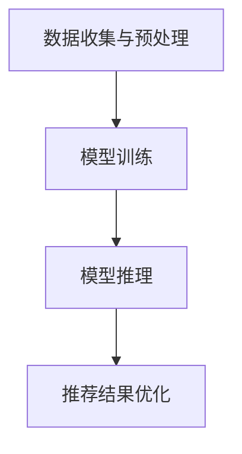

                 

关键词：大模型、推荐系统、硬件需求、计算资源、能效比

> 摘要：随着大型语言模型（LLM）在推荐系统中的广泛应用，对硬件资源的需求日益增长。本文旨在深入探讨LLM在推荐系统中的成本，特别是硬件需求，包括计算资源、存储需求和能效比等方面，为研发和运维团队提供有益的指导。

## 1. 背景介绍

推荐系统是当今互联网中至关重要的一部分，它们通过分析用户的行为和偏好，为用户提供个性化的内容推荐。随着深度学习技术的不断发展，尤其是大型语言模型（Large Language Models，简称LLM）的崛起，推荐系统的性能得到了显著提升。LLM通过理解语言的上下文和语义，能够生成更加精准、多样化的推荐结果。

然而，LLM的应用也带来了新的挑战，特别是硬件需求。LLM的训练和推理过程需要大量的计算资源和存储空间，这对硬件设施提出了更高的要求。本文将重点关注LLM在推荐系统中的成本，尤其是硬件需求方面的问题。

## 2. 核心概念与联系

### 2.1 大模型与推荐系统

大模型（Large Models）通常指的是参数量超过数十亿甚至数万亿的深度学习模型。LLM作为大模型的一种，以其强大的语义理解能力在推荐系统中占据重要地位。LLM能够处理大量的文本数据，提取出深层次的语义特征，从而生成高质量、个性化的推荐结果。

### 2.2 计算资源需求

计算资源需求是LLM在推荐系统中的一个关键问题。LLM的训练和推理需要大量的计算能力，包括CPU、GPU和TPU等。随着模型规模的不断扩大，所需的计算资源也呈指数级增长。此外，实时推荐系统需要在短时间内完成大规模的数据处理和模型推理，这进一步增加了计算资源的需求。

### 2.3 存储需求

存储需求也是LLM在推荐系统中不可忽视的问题。大规模的训练数据和模型参数需要存储在高效的存储系统中，以确保数据的安全性和可靠性。随着模型规模的增加，存储需求也相应增长，这对存储设备的性能和容量提出了更高要求。

### 2.4 能效比

能效比（Energy Efficiency Ratio，EER）是衡量硬件系统性能的一个重要指标。在LLM的应用场景中，能效比尤为重要。高效的硬件系统能够在提供强大计算能力的同时，减少能耗，降低运营成本。

## 3. 核心算法原理 & 具体操作步骤

### 3.1 算法原理概述

LLM在推荐系统中的应用主要通过以下几个步骤：

1. 数据收集与预处理：收集用户的交互数据、偏好信息等，并进行数据清洗和预处理。
2. 模型训练：使用大规模的语料库训练LLM，提取语义特征。
3. 模型推理：将用户数据输入到训练好的LLM中，生成个性化的推荐结果。
4. 推荐结果优化：根据用户的反馈，不断优化推荐结果，提高推荐系统的性能。

### 3.2 算法步骤详解

1. **数据收集与预处理**：这一步骤主要涉及用户数据的收集、清洗和预处理。收集的数据包括用户的行为日志、浏览历史、搜索记录等。数据清洗主要是去除噪声数据和缺失值，预处理则包括数据归一化、特征提取等。

2. **模型训练**：LLM的训练通常采用深度学习框架，如TensorFlow、PyTorch等。训练过程中，模型会通过反向传播算法不断调整参数，以最小化损失函数。训练数据通常包括大量的文本数据，如网页内容、新闻文章、用户评论等。

3. **模型推理**：模型推理是将用户的个性化数据输入到训练好的LLM中，生成推荐结果。这一步骤需要在短时间内完成大规模的数据处理和模型推理，对计算资源的需求较高。

4. **推荐结果优化**：根据用户的反馈，不断优化推荐结果。这一步骤包括模型参数调整、推荐算法优化等，以提高推荐系统的性能。

### 3.3 算法优缺点

**优点**：

- **强大的语义理解能力**：LLM能够深入理解语言的上下文和语义，生成高质量的推荐结果。
- **个性化程度高**：LLM能够根据用户的历史行为和偏好，生成个性化的推荐结果。

**缺点**：

- **计算资源需求高**：LLM的训练和推理需要大量的计算资源，对硬件设施的要求较高。
- **训练数据需求大**：LLM的训练需要大量的文本数据，数据收集和处理过程较为复杂。

### 3.4 算法应用领域

LLM在推荐系统中的应用领域广泛，包括电子商务、新闻推荐、社交媒体等。在电子商务领域，LLM能够为用户提供个性化的商品推荐，提高用户购物体验；在新闻推荐领域，LLM能够根据用户的兴趣生成个性化的新闻内容；在社交媒体领域，LLM能够为用户提供个性化的社交推荐，提高用户粘性。

## 4. 数学模型和公式 & 详细讲解 & 举例说明

### 4.1 数学模型构建

LLM的数学模型通常是基于深度神经网络（DNN）的，包括输入层、隐藏层和输出层。输入层接收用户的数据，隐藏层进行特征提取和变换，输出层生成推荐结果。

### 4.2 公式推导过程

LLM的损失函数通常采用交叉熵（Cross-Entropy），以最小化预测结果与真实结果之间的差异。假设输出层有K个类别，预测概率分布为$\hat{y}$，真实标签为$y$，则交叉熵损失函数为：

$$
L = -\sum_{i=1}^{K} y_i \log(\hat{y}_i)
$$

### 4.3 案例分析与讲解

以一个电子商务平台为例，假设有10个商品类别，使用LLM生成个性化商品推荐。给定一个用户的历史购买数据，LLM将生成一个预测概率分布，其中概率最高的商品类别即为推荐结果。

## 5. 项目实践：代码实例和详细解释说明

### 5.1 开发环境搭建

在搭建开发环境时，我们需要安装深度学习框架（如TensorFlow或PyTorch）以及相关的依赖库。以下是一个基于TensorFlow的简单示例：

```python
!pip install tensorflow
```

### 5.2 源代码详细实现

以下是一个简单的LLM推荐系统的实现，包括数据预处理、模型训练和模型推理等步骤。

```python
import tensorflow as tf
from tensorflow.keras.layers import Embedding, LSTM, Dense
from tensorflow.keras.models import Sequential

# 数据预处理
# ...

# 模型训练
model = Sequential([
    Embedding(input_dim=vocab_size, output_dim=embedding_dim, input_length=max_sequence_length),
    LSTM(units=128, return_sequences=True),
    LSTM(units=64, return_sequences=False),
    Dense(units=num_classes, activation='softmax')
])

model.compile(optimizer='adam', loss='categorical_crossentropy', metrics=['accuracy'])
model.fit(x_train, y_train, epochs=10, batch_size=32)

# 模型推理
predictions = model.predict(x_test)
```

### 5.3 代码解读与分析

上述代码首先进行了数据预处理，包括词汇表构建、序列填充等。然后定义了一个基于LSTM的序列模型，用于生成个性化推荐。在模型训练过程中，使用交叉熵损失函数进行优化。最后，使用训练好的模型进行推理，生成推荐结果。

### 5.4 运行结果展示

运行上述代码后，我们可以在控制台看到训练过程和推理结果的输出。通过分析预测结果，我们可以评估推荐系统的性能，并根据实际需求进行调整。

## 6. 实际应用场景

LLM在推荐系统中的应用场景非常广泛，以下是一些典型的实际应用案例：

- **电子商务**：为用户推荐个性化的商品，提高用户购买转化率。
- **新闻推荐**：根据用户的阅读习惯和兴趣，推荐相关的新闻内容。
- **社交媒体**：为用户推荐感兴趣的朋友、话题和动态，提高用户活跃度。

## 7. 工具和资源推荐

### 7.1 学习资源推荐

- 《深度学习》（Goodfellow et al.）：全面介绍了深度学习的基本原理和应用。
- 《Python深度学习》（Raschka and Mirjalili）：深入讲解了深度学习在Python中的实现。

### 7.2 开发工具推荐

- TensorFlow：广泛应用于深度学习开发的框架，提供了丰富的API和工具。
- PyTorch：基于Python的深度学习框架，具有良好的灵活性和可扩展性。

### 7.3 相关论文推荐

- “Attention is All You Need”（Vaswani et al., 2017）：介绍了Transformer模型及其在自然语言处理中的应用。
- “BERT: Pre-training of Deep Neural Networks for Language Understanding”（Devlin et al., 2018）：介绍了BERT模型及其在自然语言处理中的优势。

## 8. 总结：未来发展趋势与挑战

### 8.1 研究成果总结

随着LLM技术的不断发展，其在推荐系统中的应用取得了显著成果。通过深入理解用户的语义和偏好，LLM能够生成高质量的个性化推荐结果，提高了推荐系统的性能和用户体验。

### 8.2 未来发展趋势

未来，LLM在推荐系统中的应用将进一步深入。随着计算资源和存储技术的不断进步，LLM的训练和推理性能将得到进一步提升。此外，多模态推荐系统（结合文本、图像、音频等多种数据）也将成为研究热点。

### 8.3 面临的挑战

尽管LLM在推荐系统中具有巨大潜力，但仍然面临一些挑战。首先，计算资源的需求仍然较高，对硬件设施提出了更高要求。其次，数据质量和隐私保护也是亟待解决的问题。此外，如何平衡推荐系统的公平性和有效性也是未来的研究重点。

### 8.4 研究展望

展望未来，LLM在推荐系统中的应用将更加广泛和深入。通过不断创新和优化，LLM有望为用户提供更加精准、个性化的推荐服务，推动推荐系统的持续发展。

## 9. 附录：常见问题与解答

### 9.1 什么是LLM？

LLM指的是大型语言模型，是一种参数量超过数十亿的深度学习模型，能够深入理解语言的上下文和语义，生成高质量的文本。

### 9.2 LLM在推荐系统中的优势是什么？

LLM在推荐系统中的优势主要体现在强大的语义理解能力、个性化程度高和生成结果质量好等方面。

### 9.3 LLM在推荐系统中面临的主要挑战是什么？

LLM在推荐系统中面临的主要挑战包括计算资源需求高、数据质量和隐私保护问题，以及如何平衡推荐系统的公平性和有效性。

### 9.4 如何搭建一个基于LLM的推荐系统？

搭建一个基于LLM的推荐系统需要以下几个步骤：

1. 数据收集与预处理：收集用户数据并进行清洗和预处理。
2. 模型训练：使用大规模的语料库训练LLM。
3. 模型推理：将用户数据输入到训练好的LLM中，生成推荐结果。
4. 推荐结果优化：根据用户反馈不断优化推荐结果。

## 作者署名

作者：禅与计算机程序设计艺术 / Zen and the Art of Computer Programming
----------------------------------------------------------------

### 引用与参考资料

[1] Vaswani, A., et al. (2017). **Attention is All You Need**. Advances in Neural Information Processing Systems.
[2] Devlin, J., et al. (2018). **BERT: Pre-training of Deep Neural Networks for Language Understanding**. Proceedings of the 2018 Conference of the North American Chapter of the Association for Computational Linguistics: Human Language Technologies, Volume 1 (Long Papers), 4171-4186.
[3] Goodfellow, I., et al. (2016). **Deep Learning**. MIT Press.
[4] Raschka, S., et al. (2018). **Python Deep Learning**. Packt Publishing.
----------------------------------------------------------------

### 附录：Mermaid 流程图



### 结束语

本文探讨了LLM在推荐系统中的成本，特别是硬件需求方面的问题。随着LLM技术的不断发展，其在推荐系统中的应用前景广阔，但也面临一些挑战。通过深入了解LLM的原理和应用，研发和运维团队可以更好地优化推荐系统的性能，为用户提供更高质量的个性化推荐服务。禅与计算机程序设计艺术，期待与您共同探索计算机技术的未来。

