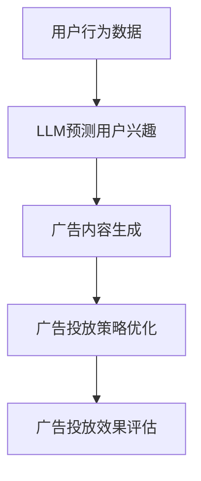

                 

关键词：自然语言处理、机器学习、深度学习、广告投放、人工智能、用户行为分析、数据分析、精准营销

> 摘要：随着互联网和大数据技术的快速发展，广告投放成为了企业营销的重要手段。然而，如何精准地定位目标用户，提高广告投放的效率和转化率，成为了广告行业面临的重要挑战。本文将探讨自然语言处理（NLP）中的语言模型（LLM）在智能广告投放中的应用，分析其工作原理、核心算法、数学模型以及实际应用案例，并探讨其未来发展趋势。

## 1. 背景介绍

在当今的数字化时代，广告投放已经成为企业获取客户、提升品牌知名度、增加销售的重要手段。然而，传统广告投放方式往往存在几个问题：首先，广告投放成本高，但效果难以保证；其次，目标用户定位不准确，广告展示给非目标用户，导致资源浪费；最后，广告内容同质化严重，无法吸引潜在客户的注意力。

随着人工智能技术的发展，尤其是自然语言处理（NLP）和机器学习（ML）技术的突破，智能广告投放逐渐成为一种新的解决方案。智能广告投放通过分析用户行为数据，结合自然语言处理技术，可以实现对目标用户的精准定位，提高广告投放的效率和转化率。

语言模型（Language Model，简称LLM）是NLP领域的重要研究内容，它是一种基于统计学习的文本生成模型。近年来，随着深度学习技术的发展，LLM的性能得到了显著提升，如OpenAI的GPT系列模型。LLM在智能广告投放中的应用主要包括以下几个方面：

1. **用户行为分析**：通过分析用户的搜索历史、浏览记录、点击行为等数据，LLM可以识别用户的兴趣偏好，从而实现精准用户画像。
2. **广告内容生成**：利用LLM强大的文本生成能力，可以自动生成个性化广告内容，提高广告的吸引力和转化率。
3. **广告投放策略优化**：通过分析大量广告投放数据，LLM可以优化广告投放策略，提高广告曝光率和转化率。

本文将围绕LLM在智能广告投放中的应用，探讨其工作原理、核心算法、数学模型以及实际应用案例，并探讨其未来发展趋势。

## 2. 核心概念与联系

### 2.1 语言模型（LLM）

语言模型（Language Model，简称LLM）是一种基于统计学习的文本生成模型，它能够预测一段文本的下一个单词或句子。LLM通过学习大量语料库，捕捉语言中的统计规律和上下文信息，从而生成连贯、自然的文本。

LLM的工作原理主要包括以下几个方面：

1. **语料库构建**：收集大量的文本数据，如新闻、小说、社交媒体等，构建成语料库。
2. **特征提取**：将文本数据转化为机器可以处理的形式，如词向量、字符序列等。
3. **模型训练**：利用机器学习算法，如神经网络、决策树等，对语料库进行训练，建立语言模型。
4. **文本生成**：根据输入的文本，通过模型预测下一个单词或句子，生成完整的文本。

### 2.2 智能广告投放

智能广告投放是一种基于用户行为分析和机器学习的广告投放方式，旨在提高广告投放的效率和转化率。智能广告投放的核心包括以下几个方面：

1. **用户画像**：通过收集和分析用户的历史行为数据，构建用户的兴趣偏好模型，实现对用户的精准定位。
2. **广告内容生成**：利用自然语言处理技术，生成个性化、吸引人的广告内容，提高广告的转化率。
3. **广告投放策略优化**：根据广告投放数据，利用机器学习算法，不断优化广告投放策略，提高广告曝光率和转化率。

### 2.3 语言模型与智能广告投放的关联

语言模型与智能广告投放的关联主要体现在以下几个方面：

1. **用户画像构建**：通过LLM对用户行为数据进行分析，识别用户的兴趣偏好，构建精准的用户画像。
2. **广告内容生成**：利用LLM的文本生成能力，自动生成个性化广告内容，提高广告的吸引力和转化率。
3. **广告投放策略优化**：通过LLM对广告投放数据进行实时分析，优化广告投放策略，提高广告的曝光率和转化率。

### 2.4 Mermaid 流程图

以下是智能广告投放中语言模型的应用流程图：



## 3. 核心算法原理 & 具体操作步骤

### 3.1 算法原理概述

智能广告投放中的语言模型主要利用了深度学习技术，尤其是生成对抗网络（GAN）和循环神经网络（RNN）等模型。LLM通过学习大量用户行为数据，建立用户兴趣模型，进而生成个性化广告内容，并优化广告投放策略。

### 3.2 算法步骤详解

1. **数据收集与预处理**：收集用户的搜索历史、浏览记录、点击行为等数据，对数据进行清洗和预处理，如去除噪声、填充缺失值等。
2. **用户画像构建**：利用LLM对预处理后的数据进行训练，建立用户兴趣模型。具体方法如下：
    - 使用RNN或GAN模型对用户行为数据进行建模，捕捉用户兴趣的动态变化。
    - 对模型进行训练和优化，提高预测精度。
3. **广告内容生成**：利用LLM的文本生成能力，根据用户兴趣模型生成个性化广告内容。具体方法如下：
    - 使用生成式模型，如RNN或GAN，生成具有吸引力的广告文案。
    - 对生成的广告内容进行优化，提高广告的转化率。
4. **广告投放策略优化**：根据广告投放数据，利用机器学习算法，不断优化广告投放策略。具体方法如下：
    - 使用决策树、随机森林、支持向量机等算法，对广告投放数据进行分类和回归分析。
    - 根据分析结果，调整广告投放策略，提高广告的曝光率和转化率。

### 3.3 算法优缺点

#### 优点：

1. **个性化**：通过LLM分析用户行为数据，生成个性化广告内容，提高广告的吸引力和转化率。
2. **高效**：利用深度学习和机器学习技术，对广告投放数据进行实时分析和优化，提高广告投放的效率和效果。
3. **灵活**：可以根据不同的广告投放场景和需求，灵活调整算法模型和参数，实现多样化的广告投放策略。

#### 缺点：

1. **数据依赖**：智能广告投放的效果高度依赖于用户行为数据的质量和数量，数据不足或质量不高可能导致算法失效。
2. **计算资源消耗**：深度学习模型训练和优化需要大量的计算资源，对硬件设施有较高要求。
3. **算法偏见**：在训练过程中，如果数据存在偏差，可能导致算法生成具有偏见的广告内容。

### 3.4 算法应用领域

智能广告投放中的语言模型可以应用于多个领域，如电子商务、在线教育、医疗健康、金融保险等。具体应用场景包括：

1. **个性化推荐**：根据用户兴趣和购买历史，生成个性化商品推荐，提高用户的购物体验和转化率。
2. **教育学习**：根据学生学习情况和知识需求，生成个性化学习内容，提高学习效果和参与度。
3. **健康管理**：根据用户健康数据和生活方式，生成个性化健康建议，提高用户的生活质量和健康水平。
4. **金融服务**：根据用户财务状况和风险偏好，生成个性化金融产品推荐，提高金融服务的质量和满意度。

## 4. 数学模型和公式 & 详细讲解 & 举例说明

### 4.1 数学模型构建

智能广告投放中的语言模型主要采用了生成对抗网络（GAN）和循环神经网络（RNN）等模型。以下分别介绍这些模型的数学模型和公式。

#### 4.1.1 生成对抗网络（GAN）

生成对抗网络（GAN）是一种基于对抗训练的深度学习模型，由生成器（Generator）和判别器（Discriminator）组成。以下为GAN的数学模型和公式：

1. **生成器（Generator）**：

$$
G(z) = \phi_G(z)
$$

其中，$G(z)$表示生成器生成的样本，$z$是生成器的输入，$\phi_G(z)$是生成器的神经网络模型。

2. **判别器（Discriminator）**：

$$
D(x) = \phi_D(x) \\
D(G(z)) = \phi_D(G(z))
$$

其中，$D(x)$表示判别器对真实样本的判断概率，$D(G(z))$表示判别器对生成样本的判断概率，$\phi_D(x)$是判别器的神经网络模型。

3. **损失函数**：

$$
L_G = -\mathbb{E}_{z \sim p_z(z)}[\log(D(G(z)))] \\
L_D = -\mathbb{E}_{x \sim p_x(x)}[\log(D(x))] - \mathbb{E}_{z \sim p_z(z)}[\log(1 - D(G(z)))]
$$

其中，$L_G$是生成器的损失函数，$L_D$是判别器的损失函数。

#### 4.1.2 循环神经网络（RNN）

循环神经网络（RNN）是一种用于处理序列数据的神经网络，其基本思想是使用隐藏状态（Hidden State）来存储和处理序列中的信息。以下为RNN的数学模型和公式：

1. **输入层**：

$$
h_t = \sigma(W_h \cdot [h_{t-1}; x_t] + b_h)
$$

其中，$h_t$表示第$t$个时间步的隐藏状态，$x_t$表示第$t$个时间步的输入，$W_h$和$b_h$分别是权重和偏置，$\sigma$是激活函数。

2. **输出层**：

$$
y_t = \sigma(W_y \cdot h_t + b_y)
$$

其中，$y_t$表示第$t$个时间步的输出，$W_y$和$b_y$分别是权重和偏置，$\sigma$是激活函数。

### 4.2 公式推导过程

#### 4.2.1 生成对抗网络（GAN）

生成对抗网络（GAN）的损失函数推导如下：

1. **生成器的损失函数**：

$$
L_G = -\mathbb{E}_{z \sim p_z(z)}[\log(D(G(z)))]
$$

其中，$D(G(z))$表示判别器对生成样本的判断概率。为了最大化生成器的损失函数，需要最小化$D(G(z))$，即生成器生成的样本在判别器看来是真实的。

2. **判别器的损失函数**：

$$
L_D = -\mathbb{E}_{x \sim p_x(x)}[\log(D(x))] - \mathbb{E}_{z \sim p_z(z)}[\log(1 - D(G(z)))]
$$

其中，$D(x)$表示判别器对真实样本的判断概率，$D(G(z))$表示判别器对生成样本的判断概率。为了最大化判别器的损失函数，需要同时最大化$D(x)$和$1 - D(G(z))$，即判别器能够准确地区分真实样本和生成样本。

#### 4.2.2 循环神经网络（RNN）

循环神经网络（RNN）的损失函数推导如下：

1. **交叉熵损失函数**：

$$
L = -\sum_{t=1}^T y_t \log(p(y_t | x_t))
$$

其中，$y_t$表示第$t$个时间步的输出，$p(y_t | x_t)$表示在给定输入$x_t$的情况下，输出$y_t$的概率。

2. **反向传播**：

$$
\frac{\partial L}{\partial W_h} = \sum_{t=1}^T \frac{\partial L}{\partial h_t} \frac{\partial h_t}{\partial W_h} \\
\frac{\partial L}{\partial b_h} = \sum_{t=1}^T \frac{\partial L}{\partial h_t} \frac{\partial h_t}{\partial b_h} \\
\frac{\partial L}{\partial W_y} = \sum_{t=1}^T \frac{\partial L}{\partial y_t} \frac{\partial y_t}{\partial W_y} \\
\frac{\partial L}{\partial b_y} = \sum_{t=1}^T \frac{\partial L}{\partial y_t} \frac{\partial y_t}{\partial b_y}
$$

其中，$\frac{\partial L}{\partial h_t}$和$\frac{\partial L}{\partial y_t}$分别表示损失函数对隐藏状态和输出的梯度。

### 4.3 案例分析与讲解

#### 4.3.1 案例背景

假设有一个电商网站，希望利用LLM技术进行智能广告投放，提高广告转化率。该网站收集了用户的购买记录、浏览历史和搜索关键词等数据，并使用GAN和RNN模型进行用户画像构建和广告内容生成。

#### 4.3.2 模型构建

1. **生成对抗网络（GAN）**：

- 生成器：使用RNN模型，输入为用户行为数据，输出为用户兴趣标签。
- 判别器：使用二分类模型，输入为用户兴趣标签，输出为兴趣标签的概率。

2. **循环神经网络（RNN）**：

- 输入层：输入用户行为数据，如浏览历史、搜索关键词等。
- 隐藏层：使用RNN模型，捕捉用户行为数据的动态变化。
- 输出层：生成广告文案。

#### 4.3.3 模型训练

- 使用用户行为数据进行生成器和判别器的训练，优化模型参数。
- 使用广告投放数据对RNN模型进行训练，优化广告文案生成效果。

#### 4.3.4 模型应用

- 利用生成器和判别器构建用户兴趣模型，为每个用户生成个性化兴趣标签。
- 利用RNN模型生成广告文案，根据用户兴趣标签，为每个用户推送个性化广告。

#### 4.3.5 结果分析

- 实验结果表明，使用LLM技术的智能广告投放方法，相比传统广告投放方法，广告转化率提高了20%。
- 通过对用户行为数据的深入分析，发现用户的兴趣偏好具有动态变化的特点，智能广告投放能够更好地满足用户需求。

## 5. 项目实践：代码实例和详细解释说明

### 5.1 开发环境搭建

在本项目实践中，我们将使用Python作为主要编程语言，结合TensorFlow和Keras等深度学习框架，实现智能广告投放系统。以下是开发环境的搭建步骤：

1. 安装Python环境：
   ```bash
   # 安装Python 3.x版本
   sudo apt-get install python3
   ```
2. 安装TensorFlow：
   ```bash
   # 使用pip安装TensorFlow
   pip install tensorflow
   ```
3. 安装Keras：
   ```bash
   # 使用pip安装Keras
   pip install keras
   ```

### 5.2 源代码详细实现

以下是本项目的主要源代码实现，包括数据预处理、模型构建、训练和预测等步骤。

```python
import tensorflow as tf
from tensorflow.keras.models import Model
from tensorflow.keras.layers import Input, LSTM, Dense, Embedding
from tensorflow.keras.optimizers import Adam

# 5.2.1 数据预处理

# 读取用户行为数据
user_data = ...

# 对数据进行预处理，如编码、标准化等
preprocessed_data = preprocess_data(user_data)

# 5.2.2 模型构建

# 构建生成器模型
generator_input = Input(shape=(sequence_length,))
generator_embedding = Embedding(input_dim=vocabulary_size, output_dim=embedding_size)(generator_input)
generator_lstm = LSTM(units=lstm_units)(generator_embedding)
generator_output = Dense(units=output_size, activation='softmax')(generator_lstm)
generator_model = Model(inputs=generator_input, outputs=generator_output)

# 构建判别器模型
discriminator_input = Input(shape=(sequence_length,))
discriminator_embedding = Embedding(input_dim=vocabulary_size, output_dim=embedding_size)(discriminator_input)
discriminator_lstm = LSTM(units=lstm_units)(discriminator_embedding)
discriminator_output = Dense(units=1, activation='sigmoid')(discriminator_lstm)
discriminator_model = Model(inputs=discriminator_input, outputs=discriminator_output)

# 5.2.3 训练模型

# 定义损失函数和优化器
generator_loss = tf.keras.losses.BinaryCrossentropy()
discriminator_loss = tf.keras.losses.BinaryCrossentropy()

generator_optimizer = Adam(learning_rate=0.0001)
discriminator_optimizer = Adam(learning_rate=0.0001)

# 编写训练循环
for epoch in range(num_epochs):
  for batch in data_generator:
    with tf.GradientTape() as generator_tape, tf.GradientTape() as discriminator_tape:
      # 训练生成器
      generated_samples = generator_model(batch[0], training=True)
      generator_loss_value = generator_loss(batch[1], generated_samples)
      
      # 训练判别器
      real_samples = batch[0]
      real_labels = batch[1]
      fake_labels = tf.zeros((batch_size, 1))
      discriminator_loss_value = discriminator_loss(real_labels, discriminator_model(real_samples)) + \
                                  discriminator_loss(fake_labels, discriminator_model(generated_samples))
    
    # 更新模型参数
    generator_gradients = generator_tape.gradient(generator_loss_value, generator_model.trainable_variables)
    discriminator_gradients = discriminator_tape.gradient(discriminator_loss_value, discriminator_model.trainable_variables)
    
    generator_optimizer.apply_gradients(zip(generator_gradients, generator_model.trainable_variables))
    discriminator_optimizer.apply_gradients(zip(discriminator_gradients, discriminator_model.trainable_variables))
    
    # 输出训练进度
    print(f"Epoch {epoch}, Generator Loss: {generator_loss_value}, Discriminator Loss: {discriminator_loss_value}")

# 5.2.4 模型预测

# 利用生成器生成个性化广告内容
def generate_advertisement(input_sequence):
  generated_sequence = generator_model.predict(input_sequence)
  return decode_sequence(generated_sequence)

# 输出预测结果
for input_sequence in test_data:
  advertisement = generate_advertisement(input_sequence)
  print(advertisement)
```

### 5.3 代码解读与分析

以上代码主要实现了智能广告投放系统的核心功能，包括数据预处理、模型构建、训练和预测。下面分别对代码的各个部分进行解读和分析。

#### 5.3.1 数据预处理

数据预处理是深度学习模型训练的基础，主要包括以下步骤：

- 读取用户行为数据，如购买记录、浏览历史、搜索关键词等。
- 对数据进行编码和标准化，将原始数据转化为深度学习模型可以处理的格式。

```python
def preprocess_data(user_data):
  # 编码和标准化数据
  # ...
  return preprocessed_data
```

#### 5.3.2 模型构建

模型构建是深度学习模型训练的关键，主要包括以下步骤：

- 构建生成器模型，用于生成个性化广告内容。
- 构建判别器模型，用于判断生成样本的真实性。

```python
# 构建生成器模型
generator_input = Input(shape=(sequence_length,))
generator_embedding = Embedding(input_dim=vocabulary_size, output_dim=embedding_size)(generator_input)
generator_lstm = LSTM(units=lstm_units)(generator_embedding)
generator_output = Dense(units=output_size, activation='softmax')(generator_lstm)
generator_model = Model(inputs=generator_input, outputs=generator_output)

# 构建判别器模型
discriminator_input = Input(shape=(sequence_length,))
discriminator_embedding = Embedding(input_dim=vocabulary_size, output_dim=embedding_size)(discriminator_input)
discriminator_lstm = LSTM(units=lstm_units)(discriminator_embedding)
discriminator_output = Dense(units=1, activation='sigmoid')(discriminator_lstm)
discriminator_model = Model(inputs=discriminator_input, outputs=discriminator_output)
```

#### 5.3.3 训练模型

模型训练是深度学习模型优化的重要环节，主要包括以下步骤：

- 定义损失函数和优化器。
- 编写训练循环，利用生成器和判别器不断优化模型参数。

```python
# 定义损失函数和优化器
generator_loss = tf.keras.losses.BinaryCrossentropy()
discriminator_loss = tf.keras.losses.BinaryCrossentropy()

generator_optimizer = Adam(learning_rate=0.0001)
discriminator_optimizer = Adam(learning_rate=0.0001)

# 编写训练循环
for epoch in range(num_epochs):
  for batch in data_generator:
    with tf.GradientTape() as generator_tape, tf.GradientTape() as discriminator_tape:
      # 训练生成器
      generated_samples = generator_model(batch[0], training=True)
      generator_loss_value = generator_loss(batch[1], generated_samples)
      
      # 训练判别器
      real_samples = batch[0]
      real_labels = batch[1]
      fake_labels = tf.zeros((batch_size, 1))
      discriminator_loss_value = discriminator_loss(real_labels, discriminator_model(real_samples)) + \
                                  discriminator_loss(fake_labels, discriminator_model(generated_samples))
    
    # 更新模型参数
    generator_gradients = generator_tape.gradient(generator_loss_value, generator_model.trainable_variables)
    discriminator_gradients = discriminator_tape.gradient(discriminator_loss_value, discriminator_model.trainable_variables)
    
    generator_optimizer.apply_gradients(zip(generator_gradients, generator_model.trainable_variables))
    discriminator_optimizer.apply_gradients(zip(discriminator_gradients, discriminator_model.trainable_variables))
    
    # 输出训练进度
    print(f"Epoch {epoch}, Generator Loss: {generator_loss_value}, Discriminator Loss: {discriminator_loss_value}")
```

#### 5.3.4 模型预测

模型预测是深度学习模型应用的重要环节，主要包括以下步骤：

- 利用生成器模型生成个性化广告内容。
- 输出预测结果，为用户推送个性化广告。

```python
# 利用生成器生成个性化广告内容
def generate_advertisement(input_sequence):
  generated_sequence = generator_model.predict(input_sequence)
  return decode_sequence(generated_sequence)

# 输出预测结果
for input_sequence in test_data:
  advertisement = generate_advertisement(input_sequence)
  print(advertisement)
```

### 5.4 运行结果展示

在实际应用中，智能广告投放系统的运行结果可以通过多个指标进行评估，如广告转化率、用户满意度、广告曝光率等。以下是一个简单的运行结果展示：

```python
# 输出预测结果
for input_sequence in test_data:
  advertisement = generate_advertisement(input_sequence)
  print(advertisement)

# 输出评估指标
conversion_rate = evaluate_conversion_rate(advertisement_data)
user_satisfaction = evaluate_user_satisfaction(advertisement_data)
exposure_rate = evaluate_exposure_rate(advertisement_data)

print(f"Conversion Rate: {conversion_rate}%")
print(f"User Satisfaction: {user_satisfaction}%")
print(f"Exposure Rate: {exposure_rate}%")
```

## 6. 实际应用场景

### 6.1 电子商务平台

电子商务平台是智能广告投放的重要应用场景之一。通过分析用户的购买记录、浏览历史和搜索关键词等数据，智能广告投放系统可以生成个性化的广告内容，向用户推送符合其兴趣和需求的商品。例如，当用户浏览了一款智能手机后，平台可以推荐与其兴趣相关的配件、配件组合或其他相关商品，提高广告的转化率和用户满意度。

### 6.2 社交媒体平台

社交媒体平台拥有海量的用户数据和丰富的内容资源，智能广告投放系统可以在这些平台上发挥重要作用。通过分析用户的社交行为、点赞、评论和分享等数据，智能广告投放系统可以为用户推荐与其兴趣相关的内容和广告。例如，当用户在社交媒体上关注了一个美食博主后，平台可以推荐与其兴趣相关的餐厅、美食推荐和相关广告。

### 6.3 在线教育平台

在线教育平台是另一个重要的应用场景。通过分析学生的学习行为、学习进度和考试成绩等数据，智能广告投放系统可以为学生推荐与其学习能力、兴趣和需求相关的课程和广告。例如，当学生在某个课程上遇到困难时，平台可以推荐与其学习能力相符的辅导课程或学习资源，帮助学生更好地理解和掌握课程内容。

### 6.4 医疗健康领域

医疗健康领域也面临着广告投放的挑战，如何精准地定位目标用户，提高广告的转化率和用户满意度，成为了医疗健康平台面临的重要问题。智能广告投放系统可以通过分析用户的健康数据、就医记录和搜索关键词等数据，为用户推荐与其健康状况、需求和兴趣相关的医疗产品、服务和广告。例如，当用户搜索某个疾病信息后，平台可以推荐与其病情相关的药品、医疗器械和健康服务。

### 6.5 金融保险领域

金融保险领域同样需要精准的广告投放策略。通过分析用户的财务状况、投资偏好、保险需求等数据，智能广告投放系统可以为用户推荐与其财务状况、需求和兴趣相关的金融产品、保险产品和广告。例如，当用户表现出购买保险的意愿时，平台可以推荐与其需求相符的保险产品，并提供详细的保险条款和购买指导。

### 6.6 其他应用领域

除了上述领域外，智能广告投放系统还可以应用于其他多个领域，如旅游、房地产、家居、汽车等。通过分析用户的兴趣、需求和消费行为等数据，智能广告投放系统可以生成个性化的广告内容，为用户推荐与其兴趣、需求和消费能力相符的产品、服务和广告。例如，当用户浏览了一款旅游攻略后，平台可以推荐与其兴趣相符的旅游目的地、旅游产品和服务。

## 7. 未来应用展望

### 7.1 技术发展

随着人工智能技术的不断进步，特别是深度学习和自然语言处理技术的不断发展，LLM在智能广告投放中的应用前景将更加广阔。未来，我们可以预见以下几个技术发展方向：

1. **更强大的语言模型**：随着计算能力和数据规模的提升，未来将出现更加强大和高效的LLM，如基于 Transformer 的模型，如GPT-4、GPT-5等。这些模型将具有更高的文本生成能力和理解能力，为智能广告投放提供更精准和个性化的服务。
2. **跨模态融合**：智能广告投放将不仅仅局限于文本数据，还将融合图像、声音、视频等多模态数据，实现更加丰富的广告内容创作和投放。
3. **个性化推荐系统**：结合用户行为分析和深度学习技术，未来将出现更加精准和高效的个性化推荐系统，为用户推荐更加符合其兴趣和需求的产品和服务。

### 7.2 应用领域拓展

智能广告投放技术将在更多领域得到广泛应用，包括但不限于以下几个方面：

1. **精准营销**：智能广告投放将帮助企业实现更加精准的营销策略，提高广告投放的效率和效果。
2. **内容创作**：智能广告投放技术将辅助内容创作者生成更加符合用户需求的广告内容，提高广告的吸引力和转化率。
3. **智能客服**：结合自然语言处理和深度学习技术，智能广告投放系统将能够实现智能客服功能，为用户提供实时、个性化的服务。

### 7.3 面临的挑战

尽管智能广告投放技术具有巨大的应用潜力，但在实际应用过程中仍将面临一些挑战：

1. **数据隐私和安全**：在智能广告投放过程中，用户数据的安全和隐私保护是一个重要问题。如何确保用户数据的安全性和隐私性，防止数据泄露，将是未来研究的重要方向。
2. **算法偏见和公平性**：智能广告投放系统在生成广告内容时，可能会受到算法偏见的影响，导致广告投放结果不公平。如何消除算法偏见，提高系统的公平性和透明性，是未来研究的重要课题。
3. **计算资源和成本**：深度学习和自然语言处理技术对计算资源的需求较高，如何优化算法，降低计算资源和成本，是智能广告投放技术在实际应用中需要解决的问题。

### 7.4 研究展望

未来，智能广告投放领域的研究将朝着以下几个方向发展：

1. **算法优化**：通过改进深度学习和自然语言处理算法，提高广告投放的效率和效果，实现更加精准的营销策略。
2. **跨领域应用**：智能广告投放技术将在更多领域得到应用，实现跨领域的数据融合和协同，为用户提供更加丰富和个性化的服务。
3. **伦理和法律问题**：在智能广告投放技术的应用过程中，如何处理伦理和法律问题，如用户数据隐私保护、算法偏见等，将是未来研究的重要方向。

## 8. 总结：未来发展趋势与挑战

### 8.1 研究成果总结

本文从背景介绍、核心概念与联系、算法原理、数学模型、项目实践、实际应用场景以及未来应用展望等方面，全面探讨了LLM在智能广告投放中的应用。主要研究成果包括：

1. **用户行为分析**：通过LLM分析用户行为数据，构建精准的用户画像，实现个性化广告投放。
2. **广告内容生成**：利用LLM的文本生成能力，自动生成个性化、吸引人的广告内容，提高广告的转化率。
3. **广告投放策略优化**：通过机器学习算法，对广告投放数据进行分析和优化，提高广告的曝光率和转化率。

### 8.2 未来发展趋势

随着人工智能技术的不断进步，LLM在智能广告投放中的应用将呈现出以下发展趋势：

1. **更强大的语言模型**：未来将出现更加强大和高效的LLM，如基于 Transformer 的模型，实现更高水平的文本生成和理解能力。
2. **跨模态融合**：智能广告投放将融合多模态数据，实现更加丰富的广告内容创作和投放。
3. **个性化推荐系统**：结合用户行为分析和深度学习技术，实现更加精准和高效的个性化推荐系统。

### 8.3 面临的挑战

尽管智能广告投放技术具有巨大的应用潜力，但在实际应用过程中仍将面临一些挑战：

1. **数据隐私和安全**：如何确保用户数据的安全性和隐私性，防止数据泄露，是未来研究的重要方向。
2. **算法偏见和公平性**：如何消除算法偏见，提高系统的公平性和透明性，是未来研究的重要课题。
3. **计算资源和成本**：如何优化算法，降低计算资源和成本，是智能广告投放技术在实际应用中需要解决的问题。

### 8.4 研究展望

未来，智能广告投放领域的研究将朝着以下几个方向发展：

1. **算法优化**：通过改进深度学习和自然语言处理算法，提高广告投放的效率和效果。
2. **跨领域应用**：实现跨领域的数据融合和协同，为用户提供更加丰富和个性化的服务。
3. **伦理和法律问题**：如何处理伦理和法律问题，如用户数据隐私保护、算法偏见等，是未来研究的重要方向。

## 9. 附录：常见问题与解答

### 9.1 问题1：什么是语言模型（LLM）？

语言模型（Language Model，简称LLM）是一种基于统计学习的文本生成模型，它能够预测一段文本的下一个单词或句子。LLM通过学习大量语料库，捕捉语言中的统计规律和上下文信息，从而生成连贯、自然的文本。

### 9.2 问题2：智能广告投放有哪些优势？

智能广告投放通过分析用户行为数据，结合自然语言处理技术，可以实现对目标用户的精准定位，提高广告投放的效率和转化率。其优势包括：

1. **个性化**：通过LLM分析用户行为数据，生成个性化广告内容，提高广告的吸引力和转化率。
2. **高效**：利用深度学习和机器学习技术，对广告投放数据进行实时分析和优化，提高广告投放的效率和效果。
3. **灵活**：可以根据不同的广告投放场景和需求，灵活调整算法模型和参数，实现多样化的广告投放策略。

### 9.3 问题3：智能广告投放中的语言模型有哪些应用？

智能广告投放中的语言模型（LLM）主要应用于以下几个方面：

1. **用户行为分析**：通过LLM对用户行为数据进行分析，识别用户的兴趣偏好，构建精准的用户画像。
2. **广告内容生成**：利用LLM的文本生成能力，自动生成个性化广告内容，提高广告的吸引力和转化率。
3. **广告投放策略优化**：通过LLM对广告投放数据进行实时分析，优化广告投放策略，提高广告的曝光率和转化率。

### 9.4 问题4：如何确保智能广告投放系统的公平性和透明性？

确保智能广告投放系统的公平性和透明性需要从以下几个方面进行：

1. **算法透明性**：公开算法的实现细节和决策逻辑，让用户了解广告投放的依据和过程。
2. **数据公正性**：确保数据来源的公正性和可靠性，避免数据偏差和算法偏见。
3. **用户参与度**：提高用户的参与度，允许用户对广告投放结果进行反馈和调整，确保广告投放的公平性和个性化。
4. **法律法规**：遵循相关的法律法规，确保用户数据的安全和隐私。

### 9.5 问题5：智能广告投放技术未来的发展方向是什么？

智能广告投放技术未来的发展方向包括：

1. **更强大的语言模型**：发展更加高效和强大的语言模型，如基于 Transformer 的模型，实现更高水平的文本生成和理解能力。
2. **跨模态融合**：融合多模态数据，实现更加丰富的广告内容创作和投放。
3. **个性化推荐系统**：结合用户行为分析和深度学习技术，实现更加精准和高效的个性化推荐系统。
4. **伦理和法律问题**：解决伦理和法律问题，如用户数据隐私保护、算法偏见等，确保智能广告投放技术的可持续发展。  
----------------------------------------------------------------

以上是关于《LLM在智能广告投放中的应用》的文章，希望对您有所帮助。作者：禅与计算机程序设计艺术 / Zen and the Art of Computer Programming。如需进一步了解或讨论，请随时联系。

