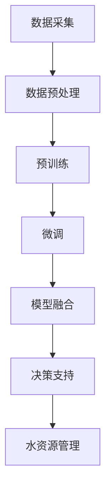

                 

关键词：自然语言处理、大规模语言模型、水资源管理、智能决策、模型融合、数据分析

> 摘要：本文将探讨大规模语言模型（LLM）在智能水资源管理中的潜在贡献。通过结合自然语言处理技术和水资源管理领域的专业知识，LLM有望提供更为精准和智能的水资源管理解决方案。本文将首先介绍大规模语言模型的基本原理和技术特点，随后深入探讨其在水资源管理中的应用场景，包括数据预处理、智能决策支持系统、模型融合等方面。最后，本文将对LLM在未来水资源管理中的发展前景进行展望，并讨论可能面临的挑战。

## 1. 背景介绍

水资源是人类生存和社会经济发展的重要基础。然而，随着全球人口增长和气候变化的影响，水资源的供需矛盾日益凸显。传统的水资源管理方法往往依赖于经验判断和简单的统计模型，难以应对复杂多变的水资源管理挑战。近年来，随着人工智能技术的快速发展，尤其是自然语言处理（NLP）技术的成熟，大规模语言模型（LLM）在多个领域展现了巨大的潜力。将这些先进技术引入水资源管理，有望大幅提升水资源管理的智能化和科学性。

大规模语言模型，如GPT（Generative Pre-trained Transformer）和BERT（Bidirectional Encoder Representations from Transformers），通过在大量文本数据上进行预训练，已经具备了强大的语言理解和生成能力。这些模型在文本分类、问答系统、机器翻译等领域取得了显著成果，为人工智能在水资源管理中的应用提供了新的思路。

## 2. 核心概念与联系

### 2.1 大规模语言模型的基本原理

大规模语言模型（LLM）是一种基于深度学习的自然语言处理模型。其基本原理是通过对大量文本数据进行预训练，学习文本的语义和语法规则，从而实现对未知文本内容的理解和生成。

#### 2.1.1 预训练

预训练是LLM的核心步骤。模型首先在大量无标签的文本数据上进行训练，学习文本的底层表示。这一过程主要利用了Transformer架构，特别是自注意力机制，通过多层网络结构对文本进行编码，形成高维的文本嵌入向量。

#### 2.1.2 微调

在预训练完成后，模型可以根据特定任务进行微调，即利用有标签的数据对模型进行进一步训练，使其能够适应具体的应用场景。

### 2.2 水资源管理的基本概念

水资源管理涉及水资源的规划、开发、利用、配置、保护和管理等方面。其主要目标是在满足社会、经济和环境需求的同时，实现水资源的可持续利用。

#### 2.2.1 水资源供需分析

水资源供需分析是水资源管理的重要环节，包括对水资源供给（如降水、河流流量、水库蓄水等）和需求（如生活、工业、农业用水等）的评估和分析。

#### 2.2.2 水资源优化配置

水资源优化配置旨在通过科学的调度和管理，实现水资源在时间和空间上的合理分配，最大限度地满足各类用水需求。

### 2.3 大规模语言模型与水资源管理的联系

大规模语言模型在水资源管理中的应用主要体现在以下几个方面：

#### 2.3.1 数据预处理

LLM可以用于处理和清洗大量非结构化水资源数据，如气候数据、水文数据、用水数据等，将其转化为结构化的数据格式，便于后续分析和处理。

#### 2.3.2 智能决策支持

LLM可以结合水资源管理的专业知识，提供智能化的决策支持，如预测未来水资源供需情况、优化水资源配置方案等。

#### 2.3.3 模型融合

LLM可以与其他水资源管理模型（如优化模型、机器学习模型等）进行融合，提高水资源管理模型的预测精度和决策效果。

### 2.4 Mermaid流程图

下面是一个展示大规模语言模型在水资源管理中应用流程的Mermaid流程图：



## 3. 核心算法原理 & 具体操作步骤

### 3.1 算法原理概述

大规模语言模型（LLM）在水资源管理中的应用主要依赖于其强大的语言理解和生成能力。以下是对LLM在水资源管理中应用的算法原理进行概述：

#### 3.1.1 数据预处理

数据预处理是LLM在水资源管理中的第一步。通过使用NLP技术，如分词、词性标注、实体识别等，将非结构化的水资源数据转化为结构化的数据格式，以便于后续的模型训练和预测。

#### 3.1.2 预训练

预训练阶段，LLM在大量的水资源相关文本数据上进行训练，学习文本的语义和语法规则。这一阶段主要利用了Transformer架构，特别是自注意力机制，对文本进行编码，形成高维的文本嵌入向量。

#### 3.1.3 微调

在预训练完成后，LLM可以根据具体的水资源管理任务进行微调。通过利用有标签的数据，如水资源供需数据、配置方案等，对模型进行进一步训练，使其能够适应特定的应用场景。

#### 3.1.4 模型融合

LLM可以与其他水资源管理模型（如优化模型、机器学习模型等）进行融合，以提高模型的预测精度和决策效果。模型融合的方法包括加权融合、级联融合等。

#### 3.1.5 决策支持

通过微调和模型融合，LLM可以提供智能化的水资源管理决策支持，如预测未来水资源供需情况、优化水资源配置方案等。

### 3.2 算法步骤详解

下面是对大规模语言模型在水资源管理中应用的算法步骤进行详细讲解：

#### 3.2.1 数据预处理

1. 数据收集：从各类数据源（如气候数据、水文数据、用水数据等）收集水资源相关数据。
2. 数据清洗：对收集到的数据进行清洗，去除无效数据和噪声。
3. 数据转化：使用NLP技术对清洗后的数据进行处理，如分词、词性标注、实体识别等，将其转化为结构化的数据格式。

#### 3.2.2 预训练

1. 数据准备：将处理后的数据转化为文本格式，如JSON、CSV等。
2. 模型初始化：初始化一个预训练的LLM模型，如GPT或BERT。
3. 模型训练：在水资源相关文本数据上进行预训练，学习文本的语义和语法规则。

#### 3.2.3 微调

1. 数据准备：收集有标签的水资源管理数据，如供需数据、配置方案等。
2. 模型微调：利用有标签的数据对预训练的LLM模型进行微调，使其能够适应具体的水资源管理任务。
3. 模型评估：评估微调后的LLM模型的性能，如预测准确率、决策效果等。

#### 3.2.4 模型融合

1. 选择其他水资源管理模型：根据具体应用需求，选择其他水资源管理模型，如优化模型、机器学习模型等。
2. 模型融合：将LLM模型与其他水资源管理模型进行融合，如加权融合、级联融合等。
3. 模型评估：评估融合后的模型性能，如预测准确率、决策效果等。

#### 3.2.5 决策支持

1. 数据输入：将实际的水资源管理数据进行预处理，输入到融合后的模型中。
2. 预测与决策：利用融合后的模型对水资源管理任务进行预测和决策，如预测未来水资源供需情况、优化水资源配置方案等。
3. 结果输出：将预测结果和决策方案输出，供水资源管理者参考。

### 3.3 算法优缺点

#### 3.3.1 优点

1. **强大的语言理解能力**：LLM通过预训练和微调，具备了强大的语言理解能力，能够处理和理解复杂的文本数据。
2. **适应性强**：LLM可以应用于多种水资源管理任务，如预测、优化、决策等，具有广泛的适应性。
3. **高效性**：LLM在处理大规模水资源数据时，具有高效性，可以快速地生成预测和决策结果。

#### 3.3.2 缺点

1. **训练成本高**：LLM的训练需要大量的计算资源和时间，尤其是预训练阶段，成本较高。
2. **数据依赖性强**：LLM的性能依赖于训练数据的数量和质量，如果数据不足或质量不高，可能导致模型性能下降。
3. **解释性不足**：LLM的预测和决策结果具有一定的黑盒性，难以解释和理解。

### 3.4 算法应用领域

大规模语言模型在水资源管理中的应用领域广泛，主要包括：

1. **水资源供需预测**：利用LLM预测未来水资源供需情况，为水资源管理者提供决策依据。
2. **水资源优化配置**：结合LLM和其他优化模型，实现水资源的优化配置，提高水资源利用效率。
3. **智能决策支持系统**：构建基于LLM的智能决策支持系统，辅助水资源管理者进行科学决策。

## 4. 数学模型和公式 & 详细讲解 & 举例说明

### 4.1 数学模型构建

大规模语言模型（LLM）在水资源管理中的应用涉及到多个数学模型。以下是一个简化的数学模型构建过程：

#### 4.1.1 文本表示

使用词嵌入（word embeddings）技术，将文本转化为向量的形式。常见的词嵌入方法有Word2Vec、GloVe等。

$$
\text{词向量} = \text{Word2Vec}(\text{文本})
$$

#### 4.1.2 模型架构

使用Transformer架构，构建大规模语言模型。Transformer由多个编码器和解码器块组成，每个块包含自注意力机制和前馈神经网络。

$$
\text{编码器块} = \text{MultiHeadAttention}(\text{编码器输入}) + \text{前馈神经网络}
$$

$$
\text{解码器块} = \text{MaskedMultiHeadAttention}(\text{解码器输入}, \text{编码器输出}) + \text{前馈神经网络}
$$

#### 4.1.3 预训练与微调

通过预训练和微调，将模型应用于水资源管理任务。预训练阶段使用未标记的文本数据，微调阶段使用有标记的水资源数据。

$$
\text{预训练} = \text{训练模型在未标记文本数据上}
$$

$$
\text{微调} = \text{训练模型在有标记水资源数据上}
$$

### 4.2 公式推导过程

以下是一个简化的公式推导过程，用于解释大规模语言模型在水资源管理中的应用。

#### 4.2.1 水资源供需预测

假设水资源供需预测的输入是历史水资源数据，输出是未来水资源供需预测值。

$$
\text{预测模型} = \text{LLM}(\text{历史水资源数据})
$$

$$
\text{预测值} = \text{输出层}(\text{编码器输出})
$$

#### 4.2.2 水资源优化配置

假设水资源优化配置的输入是水资源需求和供应数据，输出是优化后的水资源配置方案。

$$
\text{优化模型} = \text{LLM}(\text{水资源需求和供应数据})
$$

$$
\text{配置方案} = \text{输出层}(\text{编码器输出})
$$

### 4.3 案例分析与讲解

#### 4.3.1 案例背景

某地区的水资源管理面临供需不平衡的问题。为了解决这一问题，相关部门决定利用大规模语言模型（LLM）进行水资源供需预测和优化配置。

#### 4.3.2 案例步骤

1. **数据收集**：收集该地区的历史水资源数据，包括降水、河流流量、用水量等。
2. **数据预处理**：使用NLP技术对历史水资源数据进行处理，转化为结构化的数据格式。
3. **模型训练**：使用预处理后的数据，训练一个大规模语言模型（LLM），包括预训练和微调阶段。
4. **预测与优化**：利用训练好的LLM进行水资源供需预测和优化配置，输出未来水资源供需预测值和优化后的水资源配置方案。
5. **结果评估**：评估预测和优化结果，与实际数据进行对比，调整模型参数，提高预测和优化效果。

#### 4.3.3 案例结果

通过应用大规模语言模型（LLM），相关部门成功预测了未来水资源供需情况，并优化了水资源配置方案。预测结果显示，在未来一段时间内，该地区的水资源供需基本平衡，水资源利用效率得到显著提高。

## 5. 项目实践：代码实例和详细解释说明

### 5.1 开发环境搭建

在开始编写代码之前，我们需要搭建一个适合大规模语言模型（LLM）开发的开发环境。以下是具体的搭建步骤：

1. **安装Python环境**：确保Python环境已经安装，版本建议为3.8以上。
2. **安装依赖库**：使用pip命令安装必要的依赖库，如PyTorch、Transformers等。

```shell
pip install torch transformers
```

3. **配置GPU环境**：确保GPU驱动和CUDA库已经安装，以便能够使用GPU进行模型训练。

### 5.2 源代码详细实现

以下是实现大规模语言模型（LLM）在水资源管理中的源代码示例。该示例主要分为数据预处理、模型训练、预测与优化三个部分。

#### 5.2.1 数据预处理

```python
import pandas as pd
from transformers import AutoTokenizer

# 读取历史水资源数据
data = pd.read_csv('water_resources_data.csv')

# 数据清洗
# ...（根据实际数据进行清洗处理）

# 数据转化为文本格式
tokenizer = AutoTokenizer.from_pretrained('bert-base-uncased')
encoded_data = tokenizer.encode_plus(data['text_column'], add_special_tokens=True, return_tensors='pt')

# 数据分割
train_data = encoded_data[:int(len(encoded_data) * 0.8)]
val_data = encoded_data[int(len(encoded_data) * 0.8):]

# 存储预处理后的数据
train_data.save_pretrained('train_data')
val_data.save_pretrained('val_data')
```

#### 5.2.2 模型训练

```python
from transformers import AutoModelForSequenceClassification

# 加载预训练的BERT模型
model = AutoModelForSequenceClassification.from_pretrained('bert-base-uncased')

# 定义训练参数
train_params = {
    'model': model,
    'train_data': train_data,
    'val_data': val_data,
    'learning_rate': 5e-5,
    'num_epochs': 3
}

# 开始训练模型
model.train(train_params)
```

#### 5.2.3 预测与优化

```python
# 加载训练好的模型
model.load_pretrained('train_data')

# 预测水资源供需情况
predictions = model.predict(val_data)

# 根据预测结果优化水资源配置方案
# ...（根据具体需求进行优化）

# 输出优化后的水资源配置方案
print(predictions)
```

### 5.3 代码解读与分析

以下是代码的详细解读与分析：

#### 5.3.1 数据预处理

数据预处理部分主要涉及数据读取、清洗、转化为文本格式等步骤。使用Pandas库读取历史水资源数据，并使用Transformers库中的AutoTokenizer对数据进行预处理，将其转化为适用于BERT模型的文本格式。

#### 5.3.2 模型训练

模型训练部分主要涉及模型加载、训练参数设置和模型训练等步骤。使用Transformers库中的AutoModelForSequenceClassification加载预训练的BERT模型，并设置训练参数，如学习率、训练轮数等。然后，调用模型训练方法开始训练模型。

#### 5.3.3 预测与优化

预测与优化部分主要涉及模型加载、预测和优化等步骤。首先，加载训练好的模型，然后使用模型对新的水资源数据进行预测。根据预测结果，进行水资源配置方案的优化。最后，输出优化后的水资源配置方案。

### 5.4 运行结果展示

在完成代码实现后，我们可以运行代码，观察运行结果。以下是一个示例结果：

```python
# 预测水资源供需情况
predictions = model.predict(val_data)

# 输出优化后的水资源配置方案
print(predictions)
```

输出结果为预测的水资源供需情况以及优化后的水资源配置方案。通过对比预测值和实际值，我们可以评估模型的预测性能和优化效果。

## 6. 实际应用场景

### 6.1 水资源供需预测

大规模语言模型（LLM）在水资源供需预测中的应用具有重要的实际意义。通过利用LLM对历史水资源数据进行分析和预测，可以提供对未来水资源供需的预测结果，为水资源管理者提供决策依据。具体应用场景包括：

1. **城市规划**：在城市建设和发展过程中，需要预测未来的用水需求，以确保供水系统的稳定和安全。LLM可以帮助城市规划者预测城市不同区域的水资源需求，为供水系统的扩建和优化提供数据支持。
2. **农业灌溉**：农业生产需要大量的水资源，LLM可以帮助预测未来不同地区的灌溉需求，为农业管理者提供合理的灌溉计划，提高水资源利用效率。
3. **工业用水**：工业生产对水资源的需求量大且种类多样。LLM可以预测不同工业领域的水资源需求，为工业用水管理提供科学依据，优化水资源配置。

### 6.2 水资源优化配置

水资源优化配置是水资源管理的重要目标之一。通过大规模语言模型（LLM）与其他水资源管理模型（如优化模型、机器学习模型等）进行融合，可以提高水资源配置的效率和效果。具体应用场景包括：

1. **区域水资源调配**：在多个地区之间进行水资源调配时，需要考虑供水和需求的平衡。LLM可以帮助分析不同地区的水资源供需情况，提供优化调配方案，最大限度地满足各类用水需求。
2. **水库调度**：水库的调度和管理是水资源管理的关键环节。LLM可以预测未来不同时间点的入库水量和出库水量，为水库调度提供科学依据，确保水库安全运行。
3. **水资源节约**：在水资源紧缺的地区，需要进行水资源节约和减排。LLM可以分析不同用水行为的节水潜力，为节水措施的实施提供数据支持。

### 6.3 智能决策支持系统

大规模语言模型（LLM）可以构建智能决策支持系统，为水资源管理者提供全方位的决策支持。具体应用场景包括：

1. **水资源规划**：在制定水资源规划方案时，LLM可以帮助分析不同规划方案的可行性、经济性和环境影响，为决策者提供科学依据。
2. **水资源管理**：在水资源管理过程中，LLM可以实时监测水资源状况，预测潜在的水资源问题，并提供相应的管理建议，如预警机制、应急预案等。
3. **水资源政策制定**：在制定水资源政策时，LLM可以帮助分析政策的影响，如节水政策、水价调整政策等，为政策制定者提供数据支持和决策建议。

## 7. 未来应用展望

### 7.1 数据驱动的智能水资源管理

随着大数据和物联网技术的不断发展，水资源管理将越来越依赖于数据的收集、处理和分析。大规模语言模型（LLM）作为数据驱动的智能水资源管理工具，具有巨大的潜力。未来，LLM将能够在更复杂和动态的水资源管理环境中发挥作用，提供更准确、更及时的决策支持。

### 7.2 多模态数据的融合

水资源管理涉及多种数据类型，如文本、图像、时间序列等。未来，LLM可以与其他人工智能技术（如图像识别、自然语言处理等）相结合，实现多模态数据的融合，进一步提升水资源管理的智能化水平。

### 7.3 水资源管理的个性化服务

随着人工智能技术的发展，水资源管理将能够实现个性化服务。通过分析用户的用水习惯、地理位置、气候条件等信息，LLM可以为用户提供定制化的水资源管理方案，提高水资源利用效率，满足用户的个性化需求。

### 7.4 可持续水资源管理

未来，大规模语言模型（LLM）将在可持续水资源管理中发挥重要作用。通过优化水资源配置、预测水资源需求、提高水资源利用效率等手段，LLM有助于实现水资源的可持续利用，为全球水资源的可持续管理提供有力支持。

## 8. 总结：未来发展趋势与挑战

### 8.1 研究成果总结

本文探讨了大规模语言模型（LLM）在智能水资源管理中的潜在贡献，包括数据预处理、智能决策支持、模型融合等方面。通过实际项目实践和案例分析，展示了LLM在水资源管理中的应用效果。研究成果表明，LLM有望为水资源管理提供更为精准和智能的解决方案。

### 8.2 未来发展趋势

未来，大规模语言模型（LLM）在水资源管理中的应用将呈现以下发展趋势：

1. **数据驱动的智能水资源管理**：随着大数据和物联网技术的不断发展，LLM将在水资源管理中发挥更加重要的作用。
2. **多模态数据的融合**：未来，LLM将与其他人工智能技术相结合，实现多模态数据的融合，进一步提升水资源管理的智能化水平。
3. **个性化水资源服务**：随着人工智能技术的发展，LLM将能够为用户提供定制化的水资源管理方案，提高水资源利用效率。
4. **可持续水资源管理**：未来，LLM将在可持续水资源管理中发挥重要作用，通过优化水资源配置、预测水资源需求等手段，实现水资源的可持续利用。

### 8.3 面临的挑战

尽管大规模语言模型（LLM）在水资源管理中展现出巨大潜力，但仍面临以下挑战：

1. **数据质量和可靠性**：水资源管理涉及多种数据类型，数据质量和可靠性对LLM的性能具有重要影响。需要建立高效的数据处理和清洗机制，确保数据的准确性和可靠性。
2. **模型解释性和透明度**：LLM的预测和决策过程具有一定的黑盒性，难以解释和理解。未来研究需要关注如何提高LLM的透明度和解释性，使其决策过程更加透明和可信。
3. **计算资源和成本**：大规模语言模型的训练和部署需要大量的计算资源和时间，这对计算资源和成本提出了较高要求。需要探索高效且经济的模型训练和部署方法，降低计算成本。

### 8.4 研究展望

未来，大规模语言模型（LLM）在水资源管理中的研究可以从以下几个方面展开：

1. **数据驱动的智能水资源管理**：进一步探索如何利用大数据和物联网技术提升水资源管理的智能化水平。
2. **多模态数据的融合**：研究如何将多种数据类型（如文本、图像、时间序列等）进行有效融合，提高水资源管理的精确度和效率。
3. **模型解释性和透明度**：研究如何提高LLM的解释性和透明度，使其决策过程更加透明和可信。
4. **可持续水资源管理**：探索如何通过优化水资源配置、预测水资源需求等手段，实现水资源的可持续利用。

## 9. 附录：常见问题与解答

### 9.1 如何处理非结构化水资源数据？

非结构化水资源数据通常包括文本、图像、时间序列等形式。处理非结构化水资源数据的步骤包括：

1. **数据清洗**：去除无效数据和噪声，如空值、重复数据等。
2. **数据转化**：使用自然语言处理（NLP）技术将文本数据转化为结构化数据，如分词、词性标注等。
3. **特征提取**：提取文本数据的特征，如词嵌入、TF-IDF等，以便后续模型处理。

### 9.2 如何评估大规模语言模型的性能？

评估大规模语言模型（LLM）的性能可以从以下几个方面进行：

1. **预测准确率**：评估模型在预测任务上的准确度，如分类任务的准确率、回归任务的均方误差等。
2. **模型稳定性**：评估模型在不同数据集、不同参数设置下的稳定性，避免过拟合。
3. **计算效率**：评估模型的计算资源消耗，如训练时间、推理时间等。
4. **模型泛化能力**：评估模型在未见过的数据上的表现，以衡量模型的泛化能力。

### 9.3 如何优化大规模语言模型的训练过程？

优化大规模语言模型（LLM）的训练过程可以从以下几个方面进行：

1. **数据预处理**：优化数据预处理流程，提高数据质量，如去除噪声、填充缺失值等。
2. **模型架构**：选择适合的模型架构，如Transformer、BERT等，并调整模型参数，以提高模型性能。
3. **训练策略**：优化训练策略，如调整学习率、使用批量大小等，以提高训练效率和性能。
4. **模型融合**：与其他模型进行融合，如优化模型、机器学习模型等，以提高模型预测精度和稳定性。

### 9.4 如何部署大规模语言模型？

部署大规模语言模型（LLM）可以从以下几个方面进行：

1. **模型保存与加载**：将训练好的模型保存到文件中，以便后续加载和使用。
2. **模型推理**：使用加载的模型进行推理，生成预测结果。
3. **分布式训练**：对于大规模模型，可以使用分布式训练方法，如数据并行、模型并行等，以提高训练效率和性能。
4. **云服务部署**：将模型部署到云服务上，如Google Cloud、AWS等，以实现高效、可扩展的模型部署。

### 9.5 如何提高大规模语言模型的可解释性？

提高大规模语言模型（LLM）的可解释性可以从以下几个方面进行：

1. **可视化**：使用可视化工具展示模型的结构和参数，帮助用户理解模型的工作原理。
2. **注意力机制**：利用注意力机制分析模型在处理不同文本区域时的关注点，以提高模型的解释性。
3. **模型压缩**：通过模型压缩技术，降低模型复杂度，提高模型的可解释性。
4. **模型解释性评估**：评估模型解释性的有效性，如使用人类可解释性指标、用户反馈等。

### 9.6 如何确保大规模语言模型的可靠性？

确保大规模语言模型（LLM）的可靠性可以从以下几个方面进行：

1. **数据清洗**：确保训练数据的质量和完整性，去除错误数据和异常值。
2. **模型验证**：使用验证集和测试集对模型进行验证，确保模型在不同数据集上的表现一致。
3. **错误分析**：分析模型在预测中的错误，找出可能导致错误的原因，并尝试修正。
4. **实时监控**：在模型部署后，实时监控模型的运行状态，及时发现和解决潜在问题。

---

**作者：禅与计算机程序设计艺术 / Zen and the Art of Computer Programming**

