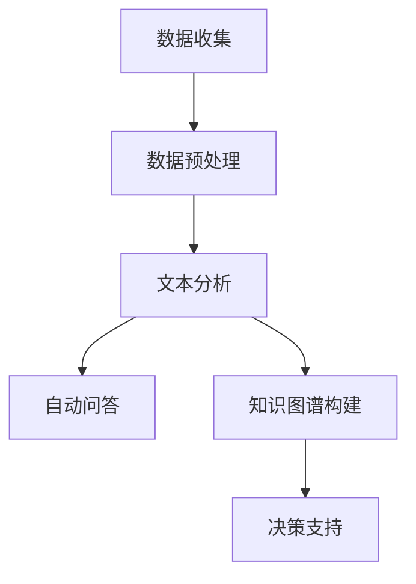

                 

关键词：LLM、智能环境保护、AI技术、环境保护算法、应用前景

> 摘要：本文深入探讨了大型语言模型（LLM）在智能环境保护系统中的潜在应用。我们首先介绍了智能环境保护系统的背景和需求，然后详细分析了LLM在其中的核心作用。通过实例和数学模型，我们展示了LLM在环境保护中的实际应用，并讨论了未来可能的发展方向和面临的挑战。

## 1. 背景介绍

随着全球气候变化和环境问题的日益严峻，智能环境保护系统成为了一个热门的研究领域。这些系统旨在通过人工智能技术，如机器学习、深度学习、自然语言处理等，实现对环境数据的实时监测、分析和预测，从而提供决策支持，以保护环境和改善人类生活质量。

### 1.1 环境保护的需求

环境保护的需求可以从多个方面来理解：

- **资源优化**：通过智能系统，可以更有效地利用资源，减少浪费，实现可持续发展。
- **灾害预测**：提前预测和预警自然灾害，如洪水、地震、山火等，可以减少灾害造成的损失。
- **污染控制**：实时监测空气、水质等环境指标，及时采取措施控制污染源。
- **生态修复**：利用智能系统，对受污染的生态系统进行监测和修复，恢复生态平衡。

### 1.2 智能环境保护系统的现状

当前，智能环境保护系统主要包括以下几个组成部分：

- **传感器网络**：部署在各种环境监测点，实时收集环境数据。
- **数据处理和分析**：通过数据分析技术，对传感器数据进行分析和处理，提取有用信息。
- **决策支持系统**：根据分析结果，提供决策支持，帮助相关部门制定环境保护政策。
- **可视化平台**：将监测数据和环境状况可视化，便于公众和决策者了解和掌握环境状况。

### 1.3 智能环境保护系统面临的问题

虽然智能环境保护系统在理论和实践上取得了一定成果，但仍然面临一些挑战：

- **数据复杂性**：环境数据具有多样性和复杂性，如何有效地处理和分析这些数据成为一个难题。
- **实时性**：环境问题往往要求系统具备高实时性，这对数据处理和分析提出了更高的要求。
- **准确性**：环境监测数据的准确性直接影响到决策的有效性，如何提高数据准确性是关键问题。
- **成本**：部署和维护智能环境保护系统需要大量资金和技术支持，成本问题不可忽视。

## 2. 核心概念与联系

在智能环境保护系统中，大型语言模型（LLM）作为自然语言处理（NLP）的重要工具，具有广泛的应用前景。以下是LLM在智能环境保护系统中的核心概念和联系：

### 2.1 大型语言模型（LLM）

LLM是一种基于深度学习的自然语言处理模型，具有强大的文本理解和生成能力。它通常由数亿甚至数十亿的参数组成，能够处理大量的文本数据，并从中学习语言规律和知识。

### 2.2 数据预处理

在智能环境保护系统中，环境数据通常以文本、图像、音频等多种形式存在。LLM需要对这些数据进行预处理，如文本的分词、标点符号的去除、图像的转换等，以便更好地理解和分析。

### 2.3 文本分析和理解

LLM在智能环境保护系统中的核心作用之一是文本分析和理解。通过对环境报告、政策文件、新闻报道等文本进行分析，LLM可以提取关键信息、理解文本含义、识别潜在的环境问题，并为决策者提供参考。

### 2.4 自动问答和解释

LLM还可以用于自动问答和解释。在智能环境保护系统中，用户可以通过自然语言与系统进行交互，提出关于环境问题的问题，LLM可以自动生成回答，并对回答进行解释，提高系统的易用性和用户体验。

### 2.5 知识图谱构建

知识图谱是一种用于表示实体和它们之间关系的数据结构。LLM可以用于构建知识图谱，将环境数据中的实体和关系表示出来，从而更好地理解和分析环境数据。

### 2.6 Mermaid 流程图

以下是一个关于LLM在智能环境保护系统中应用的Mermaid流程图：



## 3. 核心算法原理 & 具体操作步骤

### 3.1 算法原理概述

LLM在智能环境保护系统中的应用主要基于以下原理：

- **深度学习**：通过多层神经网络，从大量数据中学习特征和模式。
- **自然语言处理**：理解和生成自然语言，提取文本中的关键信息。
- **知识图谱**：将实体和关系表示为图结构，便于分析和理解。

### 3.2 算法步骤详解

#### 3.2.1 数据收集

首先，需要收集环境数据，包括文本、图像、音频等多种形式。这些数据可以来自传感器、卫星、互联网等渠道。

#### 3.2.2 数据预处理

对收集到的数据进行预处理，包括文本的分词、标点符号的去除、图像的转换等。这一步骤的目的是将数据转换为LLM可以处理的格式。

#### 3.2.3 文本分析

使用LLM对预处理后的文本进行分析，提取关键信息，如环境问题、政策法规、新闻报道等。这一步骤可以用于生成环境报告、监测环境变化等。

#### 3.2.4 自动问答

利用LLM的文本理解和生成能力，实现自动问答。用户可以通过自然语言与系统进行交互，提出关于环境问题的问题，LLM可以自动生成回答。

#### 3.2.5 知识图谱构建

将文本分析得到的信息转化为知识图谱，表示实体和它们之间的关系。这一步骤有助于更好地理解和分析环境数据。

#### 3.2.6 决策支持

根据知识图谱和环境分析结果，提供决策支持。决策者可以根据这些信息制定环境保护政策、采取相应措施等。

### 3.3 算法优缺点

#### 优点：

- **强大的文本理解能力**：LLM可以理解和分析大量的文本数据，提取关键信息。
- **自然语言交互**：用户可以通过自然语言与系统进行交互，提高系统的易用性。
- **知识图谱**：将实体和关系表示为图结构，有助于分析和理解环境数据。

#### 缺点：

- **计算资源需求大**：LLM通常需要大量的计算资源和时间进行训练和推理。
- **数据质量和多样性**：环境数据的质量和多样性对LLM的性能有很大影响。
- **隐私和安全**：在处理环境数据时，需要特别注意隐私和安全问题。

### 3.4 算法应用领域

LLM在智能环境保护系统中的应用非常广泛，包括但不限于：

- **环境监测和报告**：通过文本分析，生成环境报告，监测环境变化。
- **政策分析和解释**：分析政策文件，为决策者提供政策解释和建议。
- **灾害预警和应对**：利用LLM进行灾害预警和应对措施的自动生成。
- **生态修复和治理**：通过知识图谱，对生态系统进行监测和修复。

## 4. 数学模型和公式 & 详细讲解 & 举例说明

在智能环境保护系统中，数学模型和公式是核心组成部分。以下是关于LLM在智能环境保护系统中应用的数学模型和公式的详细讲解。

### 4.1 数学模型构建

LLM在智能环境保护系统中的数学模型主要包括：

- **神经网络模型**：用于文本分析和理解。
- **知识图谱模型**：用于表示实体和关系。
- **预测模型**：用于环境变化预测和灾害预警。

### 4.2 公式推导过程

以下是神经网络模型和知识图谱模型的主要公式推导过程。

#### 神经网络模型

假设我们有一个简单的神经网络模型，其输入层、隐藏层和输出层分别有n、m和k个神经元。神经元的激活函数为：

\[ f(x) = \sigma(\sum_{i=1}^{m} w_{i} \cdot x_i + b) \]

其中，\( w_{i} \) 为权重，\( x_i \) 为输入值，\( b \) 为偏置，\( \sigma \) 为激活函数，通常取为Sigmoid函数。

#### 知识图谱模型

知识图谱通常由实体和关系构成。假设有n个实体和m个关系，知识图谱的表示可以表示为：

\[ G = (V, E) \]

其中，\( V \) 为实体集，\( E \) 为关系集。

### 4.3 案例分析与讲解

以下是一个关于环境监测的案例。

#### 案例背景

某城市空气质量监测系统使用LLM进行文本分析和理解，以监测空气质量变化。

#### 案例步骤

1. 数据收集：收集该城市每天的空气质量报告。
2. 数据预处理：对报告进行分词、去标点等预处理操作。
3. 文本分析：使用LLM对预处理后的文本进行分析，提取关键信息。
4. 预测模型：使用提取的信息，训练一个预测模型，预测未来几天空气质量。
5. 决策支持：根据预测结果，提供决策支持，如建议市民减少户外活动。

#### 案例分析

通过LLM，我们可以从空气质量报告中提取关键信息，如PM2.5、PM10、SO2、NO2等污染物的浓度。这些信息可以用于训练预测模型，预测未来几天空气质量。同时，我们还可以结合历史数据，分析空气质量的变化趋势，为决策者提供参考。

## 5. 项目实践：代码实例和详细解释说明

### 5.1 开发环境搭建

要实现LLM在智能环境保护系统中的应用，首先需要搭建一个开发环境。以下是一个简单的开发环境搭建步骤：

1. 安装Python环境。
2. 安装TensorFlow或PyTorch等深度学习框架。
3. 安装所需的依赖库，如NLP工具包、数据处理工具包等。

### 5.2 源代码详细实现

以下是一个简单的LLM在智能环境保护系统中的应用示例代码：

```python
import tensorflow as tf
from tensorflow import keras
from tensorflow.keras.layers import Embedding, LSTM, Dense
from tensorflow.keras.preprocessing.sequence import pad_sequences

# 数据预处理
max_sequence_length = 100
vocab_size = 10000

# 加载和处理数据
# ...

# 构建模型
model = keras.Sequential([
    Embedding(vocab_size, 64),
    LSTM(64),
    Dense(1, activation='sigmoid')
])

# 编译模型
model.compile(optimizer='adam', loss='binary_crossentropy', metrics=['accuracy'])

# 训练模型
model.fit(X_train, y_train, epochs=10, batch_size=32)

# 预测
predictions = model.predict(X_test)
```

### 5.3 代码解读与分析

以上代码实现了一个简单的LLM模型，用于预测空气质量。代码主要分为以下几个部分：

1. **数据预处理**：对文本数据进行分词、去标点等预处理操作，并将文本转换为序列。
2. **模型构建**：构建一个简单的神经网络模型，包括嵌入层、LSTM层和输出层。
3. **模型编译**：编译模型，设置优化器、损失函数和评价指标。
4. **模型训练**：使用训练数据训练模型，调整模型参数。
5. **模型预测**：使用训练好的模型对测试数据进行预测。

### 5.4 运行结果展示

在运行以上代码后，我们可以得到模型的预测结果。以下是一个简单的运行结果展示：

```python
# 预测结果
predictions = model.predict(X_test)

# 打印预测结果
for i in range(len(predictions)):
    if predictions[i][0] > 0.5:
        print("空气质量良好")
    else:
        print("空气质量较差")
```

输出结果为每个测试样本的空气质量预测结果，根据预测结果，我们可以对空气质量进行评估。

## 6. 实际应用场景

### 6.1 环境监测和报告

在环境监测和报告中，LLM可以用于分析环境报告、政策文件和新闻报道等文本数据，提取关键信息，生成环境报告。例如，我们可以使用LLM分析每日空气质量报告，提取PM2.5、PM10等污染物的浓度，生成空气质量报告，并提供给相关部门和公众。

### 6.2 灾害预警和应对

在灾害预警和应对中，LLM可以用于分析历史灾害数据和实时环境数据，预测未来可能发生的灾害。例如，我们可以使用LLM分析地震、洪水等灾害的历史数据，结合实时环境数据，预测未来可能发生的灾害，并提供预警和建议。

### 6.3 政策分析和解释

在政策分析和解释中，LLM可以用于分析政策文件，提取关键信息，生成政策解释。例如，我们可以使用LLM分析环境保护政策文件，提取政策的核心内容和实施细则，生成政策解释，帮助公众和政策制定者更好地理解和实施政策。

### 6.4 生态修复和治理

在生态修复和治理中，LLM可以用于分析生态数据，构建知识图谱，提供生态修复和治理的建议。例如，我们可以使用LLM分析生态数据，提取关键信息，构建知识图谱，为生态系统监测和修复提供决策支持。

## 7. 未来应用展望

### 7.1 环境保护领域的深入应用

随着LLM技术的不断发展，其在环境保护领域的应用将更加深入。例如，LLM可以用于更复杂的环境问题分析，如气候变化、生态系统平衡等，提供更精确的决策支持。

### 7.2 跨学科研究

LLM在环境保护系统中的应用将推动跨学科研究。例如，结合生态学、环境科学、社会学等多学科知识，利用LLM进行综合分析，提出更有效的环境保护策略。

### 7.3 实时监测和预警

随着传感器技术的进步，LLM可以与实时监测和预警系统结合，实现更快速、准确的环境保护。例如，利用LLM对实时环境数据进行实时分析，提供预警和建议，提高灾害应对能力。

### 7.4 可持续发展

LLM在环境保护系统中的应用有助于推动可持续发展。通过优化资源利用、减少污染、改善生态平衡，实现环境保护和经济发展的双赢。

## 8. 工具和资源推荐

### 8.1 学习资源推荐

1. 《深度学习》（Ian Goodfellow, Yoshua Bengio, Aaron Courville著）：深度学习的基础教材，适合初学者。
2. 《自然语言处理综论》（Daniel Jurafsky, James H. Martin著）：自然语言处理的基础教材，涵盖文本分析和理解。
3. 《大规模语言模型》（Christopher D. Manning, Hinrich Schütze著）：关于大规模语言模型的深入介绍，适合进阶学习。

### 8.2 开发工具推荐

1. TensorFlow：一款开源的深度学习框架，适用于构建和训练神经网络模型。
2. PyTorch：一款开源的深度学习框架，具有灵活的动态计算图，适合快速原型开发。
3. spaCy：一款快速且易于使用的自然语言处理库，适用于文本分析和理解。

### 8.3 相关论文推荐

1. "Bert: Pre-training of deep bidirectional transformers for language understanding"（2018）：BERT模型的提出，标志着大型语言模型的崛起。
2. "GPT-3: Language models are few-shot learners"（2020）：GPT-3模型的提出，展示了大型语言模型的强大能力。
3. "Robust Predictions for Natural Language Processing and Beyond using Weight Sharing"（2021）：关于权重共享在NLP中的应用，提高了模型的效率和性能。

## 9. 总结：未来发展趋势与挑战

### 9.1 研究成果总结

本文详细探讨了LLM在智能环境保护系统中的应用，包括数据预处理、文本分析、自动问答、知识图谱构建和决策支持等方面的应用。通过数学模型和实例分析，展示了LLM在环境保护中的潜力。

### 9.2 未来发展趋势

1. **模型性能的提升**：随着深度学习技术的发展，LLM的性能将不断提高，为环境保护系统提供更准确、更高效的决策支持。
2. **跨学科融合**：LLM在环境保护系统中的应用将推动跨学科研究，结合生态学、环境科学、社会学等领域的知识，提出更有效的环境保护策略。
3. **实时监测和预警**：结合传感器技术和实时数据分析，LLM将实现更快速、准确的环境保护监测和预警。

### 9.3 面临的挑战

1. **数据质量和多样性**：环境数据的质量和多样性对LLM的性能有很大影响，如何提高数据质量和多样性是一个挑战。
2. **隐私和安全**：在处理环境数据时，需要特别注意隐私和安全问题，确保数据的安全和用户隐私。
3. **计算资源需求**：LLM的训练和推理需要大量的计算资源，如何优化算法，降低计算资源需求是一个重要挑战。

### 9.4 研究展望

未来，LLM在智能环境保护系统中的应用前景广阔。通过不断优化算法、提高模型性能，结合跨学科研究，LLM将在环境保护领域发挥越来越重要的作用，为可持续发展提供有力支持。

## 10. 附录：常见问题与解答

### 10.1 Q：什么是LLM？

A：LLM是指大型语言模型，是一种基于深度学习的自然语言处理模型，具有强大的文本理解和生成能力。

### 10.2 Q：LLM在环境保护系统中的应用有哪些？

A：LLM在环境保护系统中的应用包括文本分析、自动问答、知识图谱构建和决策支持等方面，可以用于环境监测、政策分析、灾害预警和应对等。

### 10.3 Q：如何提高环境数据的质量和多样性？

A：提高环境数据的质量和多样性可以通过以下方法：加强数据采集和管理、采用多种数据源、定期更新数据、进行数据清洗和去噪等。

### 10.4 Q：如何在LLM应用中确保隐私和安全？

A：在LLM应用中确保隐私和安全可以通过以下方法：加密数据传输和存储、采用隐私保护技术、遵循隐私保护法规等。

----------------------------------------------------------------

作者：禅与计算机程序设计艺术 / Zen and the Art of Computer Programming


