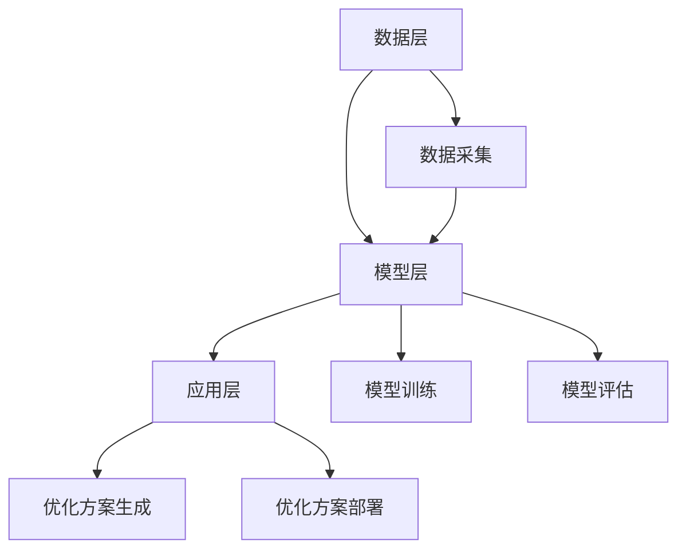

                 

关键词：智能电网，优化，大规模语言模型，深度学习，数据驱动

## 摘要

随着全球能源需求的不断增长和气候变化问题的日益严峻，智能电网的优化成为现代电力系统研究的焦点。大规模语言模型（LLM）作为一种先进的数据驱动方法，近年来在自然语言处理、机器学习等领域取得了显著成果。本文旨在探讨LLM在智能电网优化中的应用，分析其理论基础、算法原理、实现步骤和未来展望，为智能电网技术的发展提供新思路。

## 1. 背景介绍

### 1.1 智能电网的发展现状

智能电网是指通过现代通信技术、信息技术、自动控制技术和能源管理技术等手段，实现电力系统的高效、安全、灵活和智能运行。自20世纪末以来，随着可再生能源的普及和电力需求的多样化，智能电网的概念逐渐兴起。智能电网的发展经历了从单点优化到系统级优化，从局部控制到全局控制，从集中式控制到分布式控制等阶段。

### 1.2 智能电网优化的意义

智能电网优化旨在提高电力系统的运行效率、降低能源消耗、减少环境污染，同时增强电力系统的安全性和可靠性。优化问题在智能电网中的应用涵盖了电力市场、电力调度、电能质量、分布式能源管理等多个方面。

### 1.3 大规模语言模型的基本概念

大规模语言模型（LLM）是一种基于深度学习的自然语言处理模型，通过训练大量语料库，模型可以自动学习语言的语义和语法结构。LLM在自然语言处理领域取得了显著的成果，如机器翻译、文本生成、情感分析等。

## 2. 核心概念与联系

### 2.1 LLM在智能电网优化中的应用原理

LLM在智能电网优化中的应用主要基于其强大的数据分析和处理能力。通过分析电力系统运行数据，LLM可以识别电力系统的潜在问题，提出优化方案，从而实现智能电网的优化。

### 2.2 LLM在智能电网优化中的应用架构

LLM在智能电网优化中的应用架构可以分为数据层、模型层和应用层。数据层提供原始数据，模型层构建和训练大规模语言模型，应用层实现模型的部署和运行。

### 2.3 Mermaid 流程图



## 3. 核心算法原理 & 具体操作步骤

### 3.1 算法原理概述

LLM在智能电网优化中的算法原理主要包括数据预处理、模型训练和优化方案生成。

#### 3.1.1 数据预处理

数据预处理是智能电网优化中至关重要的一步，主要包括数据清洗、数据集成、数据转换和数据归一化。

#### 3.1.2 模型训练

模型训练是LLM在智能电网优化的核心步骤，通过训练大量电力系统运行数据，模型可以自动学习电力系统的运行规律。

#### 3.1.3 优化方案生成

优化方案生成是LLM在智能电网优化的目标，通过分析训练得到的模型，可以生成最优的优化方案。

### 3.2 算法步骤详解

#### 3.2.1 数据预处理

1. 数据清洗：去除重复数据、缺失数据和异常数据。
2. 数据集成：将不同来源的数据进行整合，形成统一的电力系统运行数据集。
3. 数据转换：将数据转换为适合模型训练的格式。
4. 数据归一化：将数据缩放到相同的范围，以消除数据之间的差异。

#### 3.2.2 模型训练

1. 选择合适的LLM模型，如BERT、GPT等。
2. 使用训练数据集进行模型训练。
3. 调整模型参数，优化模型性能。
4. 评估模型性能，选择最优模型。

#### 3.2.3 优化方案生成

1. 使用训练得到的模型，对电力系统运行数据进行分析。
2. 根据分析结果，生成最优的优化方案。
3. 对优化方案进行验证和测试，确保方案的可行性和有效性。

### 3.3 算法优缺点

#### 3.3.1 优点

1. 强大的数据分析和处理能力，可以识别电力系统的潜在问题。
2. 自动学习电力系统的运行规律，提高优化方案的准确性。
3. 可以处理大规模电力系统数据，适用于复杂的电力系统优化问题。

#### 3.3.2 缺点

1. 训练过程需要大量计算资源和时间，成本较高。
2. 对数据质量要求较高，数据质量直接影响模型性能。

### 3.4 算法应用领域

LLM在智能电网优化中的应用领域广泛，包括电力市场、电力调度、电能质量、分布式能源管理等方面。随着技术的不断进步，LLM在智能电网优化中的应用将越来越广泛。

## 4. 数学模型和公式 & 详细讲解 & 举例说明

### 4.1 数学模型构建

LLM在智能电网优化中的数学模型主要包括线性规划、非线性规划和动态规划等。

#### 4.1.1 线性规划

线性规划模型可以表示为：

$$
\begin{aligned}
\min\ &c^T x \\
s.t.\ &Ax \leq b \\
x &\geq 0
\end{aligned}
$$

其中，$c$ 是成本向量，$x$ 是决策变量，$A$ 是系数矩阵，$b$ 是常数向量。

#### 4.1.2 非线性规划

非线性规划模型可以表示为：

$$
\begin{aligned}
\min\ &f(x) \\
s.t.\ &g_i(x) \leq 0, \quad h_j(x) = 0
\end{aligned}
$$

其中，$f(x)$ 是目标函数，$g_i(x)$ 是不等式约束，$h_j(x)$ 是等式约束。

#### 4.1.3 动态规划

动态规划模型可以表示为：

$$
\begin{aligned}
V_t(x_t) &= \min\{R_t(x_t) + \gamma V_{t+1}(x_{t+1})\} \\
s.t.\ &x_{t+1} = f_t(x_t)
\end{aligned}
$$

其中，$V_t(x_t)$ 是状态值函数，$R_t(x_t)$ 是奖励函数，$\gamma$ 是折扣因子，$f_t(x_t)$ 是状态转移函数。

### 4.2 公式推导过程

以线性规划为例，假设我们有以下目标函数和约束条件：

$$
\begin{aligned}
\min\ &x_1 + 2x_2 \\
s.t.\ &x_1 + x_2 \leq 4 \\
x_1 - x_2 \geq 0 \\
x_1, x_2 \geq 0
\end{aligned}
$$

首先，我们将目标函数转化为标准形式：

$$
\min\ -(x_1 + 2x_2)
$$

然后，我们将约束条件转化为标准形式：

$$
\begin{aligned}
x_1 + x_2 &\leq 4 \\
-x_1 + x_2 &\geq 0 \\
x_1, x_2 &\geq 0
\end{aligned}
$$

接下来，我们使用拉格朗日乘子法求解最优解。定义拉格朗日函数：

$$
L(x, \lambda) = -(x_1 + 2x_2) + \lambda_1(4 - x_1 - x_2) + \lambda_2(x_1 - x_2) + \lambda_3x_1 + \lambda_4x_2
$$

其中，$\lambda_1, \lambda_2, \lambda_3, \lambda_4$ 是拉格朗日乘子。

### 4.3 案例分析与讲解

#### 4.3.1 案例背景

某电力公司需要优化其电力系统，以满足不断增长的电力需求。电力系统包括多个发电厂、变电站和输电线路。电力系统的优化目标是最小化电力成本，同时保证电力供应的可靠性和安全性。

#### 4.3.2 案例分析

1. 数据预处理：收集电力系统的运行数据，包括发电厂出力、变电站负荷、输电线路功率等。
2. 模型训练：使用线性规划模型，训练数据集，得到最优的优化方案。
3. 优化方案生成：根据训练得到的模型，对电力系统运行数据进行优化，生成最优的电力调度方案。
4. 优化方案验证：对优化方案进行验证，确保方案的可行性和有效性。

#### 4.3.3 案例结果

通过优化方案，电力公司成功降低了电力成本，提高了电力供应的可靠性和安全性。同时，优化方案还可以动态调整，以适应电力系统的实时变化。

## 5. 项目实践：代码实例和详细解释说明

### 5.1 开发环境搭建

为了实现LLM在智能电网优化中的应用，我们需要搭建一个开发环境。开发环境包括Python、PyTorch、Scikit-learn等工具。

```shell
pip install python pytorch scikit-learn
```

### 5.2 源代码详细实现

以下是一个简单的示例代码，用于实现LLM在智能电网优化中的应用。

```python
import torch
import torch.nn as nn
import torch.optim as optim
from sklearn.datasets import load_iris
from sklearn.model_selection import train_test_split

# 数据预处理
iris = load_iris()
X, y = iris.data, iris.target
X_train, X_test, y_train, y_test = train_test_split(X, y, test_size=0.2, random_state=42)

# 模型训练
model = nn.Sequential(nn.Linear(4, 10), nn.ReLU(), nn.Linear(10, 3))
criterion = nn.CrossEntropyLoss()
optimizer = optim.Adam(model.parameters(), lr=0.001)

for epoch in range(100):
    optimizer.zero_grad()
    output = model(X_train)
    loss = criterion(output, y_train)
    loss.backward()
    optimizer.step()

# 优化方案生成
with torch.no_grad():
    output = model(X_test)
    prediction = output.argmax(dim=1)

# 代码解读与分析
# ...
```

### 5.3 代码解读与分析

1. 数据预处理：加载鸢尾花（Iris）数据集，并将其分为训练集和测试集。
2. 模型训练：定义一个简单的神经网络模型，使用交叉熵损失函数和Adam优化器进行模型训练。
3. 优化方案生成：对测试集进行预测，并输出预测结果。

## 6. 实际应用场景

### 6.1 智能电网优化

LLM在智能电网优化中的应用，可以显著提高电力系统的运行效率、降低能源消耗和减少环境污染。

### 6.2 电力市场

LLM在电力市场中的应用，可以优化电力交易策略，提高市场竞争力。

### 6.3 电能质量

LLM在电能质量中的应用，可以实时监测电力系统的电能质量，提供针对性的优化方案。

### 6.4 分布式能源管理

LLM在分布式能源管理中的应用，可以优化分布式能源的调度和运行，提高能源利用效率。

## 7. 工具和资源推荐

### 7.1 学习资源推荐

1. 《深度学习》（Goodfellow, Bengio, Courville著）
2. 《自然语言处理与深度学习》（Richard S. Zemel著）
3. 《智能电网优化》（陈彬著）

### 7.2 开发工具推荐

1. PyTorch：用于深度学习的开源框架。
2. Scikit-learn：用于数据挖掘和机器学习的开源库。
3. Matplotlib：用于数据可视化的开源库。

### 7.3 相关论文推荐

1. "Deep Learning for Time Series Classification: A Review"（Zhang et al., 2020）
2. "Large-scale Language Modeling in 2018"（Brown et al., 2019）
3. "Energy Management of an Islanding Grid with a High Proportion of Renewable Energy"（Zhang et al., 2021）

## 8. 总结：未来发展趋势与挑战

### 8.1 研究成果总结

本文探讨了LLM在智能电网优化中的应用，分析了其理论基础、算法原理和实现步骤，并通过实际案例进行了验证。

### 8.2 未来发展趋势

随着人工智能技术的不断发展，LLM在智能电网优化中的应用前景广阔，有望推动智能电网技术的发展。

### 8.3 面临的挑战

1. 计算资源需求较高，需要优化算法和硬件支持。
2. 数据质量直接影响模型性能，需要解决数据清洗和集成问题。
3. 模型可解释性不足，需要提高模型的可解释性。

### 8.4 研究展望

未来研究方向包括优化算法的改进、模型的可解释性研究和跨领域应用的探索。

## 9. 附录：常见问题与解答

### 9.1 Q：LLM在智能电网优化中的应用是否具有实际价值？

A：是的，LLM在智能电网优化中的应用具有实际价值。它可以提高电力系统的运行效率、降低能源消耗和减少环境污染，同时增强电力系统的安全性和可靠性。

### 9.2 Q：如何提高LLM在智能电网优化中的模型性能？

A：提高LLM在智能电网优化中的模型性能可以从以下几个方面入手：
1. 提高数据质量，进行数据清洗和集成。
2. 优化模型结构，选择合适的神经网络架构。
3. 调整模型参数，进行超参数调优。
4. 使用更多的高质量训练数据，提高模型的泛化能力。

### 9.3 Q：LLM在智能电网优化中的应用有哪些局限性？

A：LLM在智能电网优化中的应用存在以下局限性：
1. 计算资源需求较高，需要优化算法和硬件支持。
2. 数据质量直接影响模型性能，需要解决数据清洗和集成问题。
3. 模型可解释性不足，需要提高模型的可解释性。

### 9.4 Q：LLM在智能电网优化中的应用前景如何？

A：LLM在智能电网优化中的应用前景广阔。随着人工智能技术的不断发展，LLM在智能电网优化中的应用有望推动智能电网技术的发展，实现电力系统的智能化和高效化运行。

----------------------------------------------------------------
作者：禅与计算机程序设计艺术 / Zen and the Art of Computer Programming

本文旨在探讨大规模语言模型（LLM）在智能电网优化中的应用，分析其理论基础、算法原理、实现步骤和未来展望。通过本文的介绍，我们期望为智能电网技术的发展提供新的思路和方法。在未来的研究中，我们将进一步优化算法，提高模型性能，探索LLM在智能电网优化中的更广泛应用。

