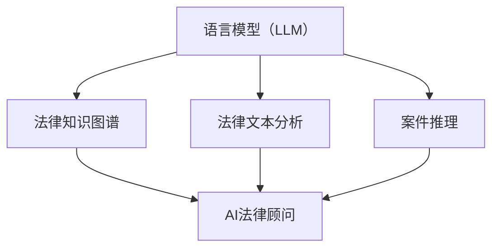

                 

关键词：语言模型（LLM），法律领域，人工智能，自动化，合规，法律咨询，案例推理

> 摘要：随着人工智能技术的不断发展，语言模型（LLM）在法律领域的应用逐渐成为一个热门话题。本文将深入探讨LLM在法律领域的应用场景，包括AI法律顾问、自动化合规和案件推理等方面，并分析其带来的机遇与挑战。

## 1. 背景介绍

法律作为社会管理的重要手段，涉及到各种社会关系和利益分配，其复杂性和重要性不言而喻。然而，法律领域的专业知识和案例经验往往需要长时间的学习和积累。随着法律事务量的不断增长，法律工作者面临着巨大的工作压力。人工智能（AI）的崛起，尤其是语言模型（LLM）的发展，为解决这些问题提供了新的思路。

LLM是一种基于深度学习的技术，能够理解和生成自然语言。近年来，LLM在各个领域的应用取得了显著成果，特别是在法律领域的应用也逐渐受到关注。本文旨在探讨LLM在法律领域的应用，特别是作为AI法律顾问的作用。

## 2. 核心概念与联系

### 2.1 语言模型（LLM）

语言模型是一种能够对自然语言进行建模的算法。LLM是一种基于神经网络的语言模型，通过大量文本数据的学习，能够理解并生成自然语言。LLM的核心在于其能够捕捉语言中的复杂模式和语义关系。

### 2.2 法律知识图谱

法律知识图谱是一种结构化的法律知识表示形式，通过将法律条文、案例、法律关系等知识元素进行整合，构建一个语义丰富、结构化的知识网络。法律知识图谱能够帮助LLM更好地理解和处理法律问题。

### 2.3 法律文本分析

法律文本分析是指利用自然语言处理（NLP）技术对法律文本进行处理和分析，以提取其中的关键信息。法律文本分析是LLM在法律领域应用的重要基础。

### 2.4 案件推理

案件推理是指基于已有案例和法律规定，对新案件进行分析和推理，以得出结论。案件推理是法律工作者的一项重要技能，也是LLM在法律领域应用的重要方向。

## 2.5 Mermaid 流程图



## 3. 核心算法原理 & 具体操作步骤

### 3.1 算法原理概述

LLM在法律领域的应用主要基于以下原理：

1. **语义理解**：LLM能够通过学习大量文本数据，理解法律文本中的语义和逻辑关系。
2. **知识图谱**：法律知识图谱为LLM提供了结构化的法律知识，帮助LLM更好地理解和处理法律问题。
3. **自动化推理**：LLM能够基于已有案例和法律规定，进行自动化推理，为新案件提供法律建议。

### 3.2 算法步骤详解

1. **法律知识图谱构建**：通过爬取法律文本、案例等数据，构建法律知识图谱。
2. **法律文本预处理**：对法律文本进行分词、词性标注、实体识别等预处理操作。
3. **语义理解**：利用LLM对预处理后的法律文本进行语义理解，提取关键信息。
4. **案件推理**：基于法律知识图谱和LLM的语义理解，对新案件进行推理，提供法律建议。

### 3.3 算法优缺点

**优点**：

1. **高效性**：LLM能够快速处理大量法律文本，提高工作效率。
2. **准确性**：基于大规模数据学习和法律知识图谱，LLM能够提供准确的法律建议。
3. **自动化**：LLM能够自动化处理法律问题，降低人力成本。

**缺点**：

1. **法律知识覆盖不全**：LLM的法律知识来源于已有数据，可能存在知识覆盖不全的问题。
2. **依赖数据质量**：LLM的性能依赖于数据的质量和数量，数据质量差可能导致性能下降。
3. **道德和隐私问题**：在法律领域，LLM的应用可能涉及个人隐私和道德问题，需要慎重考虑。

### 3.4 算法应用领域

LLM在法律领域的应用非常广泛，包括：

1. **法律咨询**：LLM能够为法律工作者提供自动化法律咨询，提高工作效率。
2. **合规管理**：LLM能够帮助企业和个人进行合规管理，降低合规风险。
3. **案件推理**：LLM能够基于已有案例和法律规定，对新案件进行推理，提供法律建议。

## 4. 数学模型和公式 & 详细讲解 & 举例说明

### 4.1 数学模型构建

LLM在法律领域的应用主要基于以下数学模型：

1. **自然语言处理模型**：如BERT、GPT等，用于对法律文本进行语义理解和分析。
2. **图论模型**：用于构建法律知识图谱，如图神经网络（GNN）等。

### 4.2 公式推导过程

以BERT模型为例，其核心公式如下：

$$
\text{output} = \text{BERT}(\text{input}) = \text{W}^T \cdot \text{softmax}(\text{W} \cdot \text{input} + \text{b})
$$

其中，$\text{W}$ 为权重矩阵，$\text{softmax}$ 为softmax函数，$\text{input}$ 为输入文本。

### 4.3 案例分析与讲解

假设我们有一个法律咨询问题：“甲乙双方签订了一份合同，其中约定了违约金。现在乙方违约，甲方想要追索违约金。请问违约金是否合理？”

我们可以利用LLM进行如下操作：

1. **法律文本预处理**：对合同文本进行分词、词性标注、实体识别等预处理操作。
2. **语义理解**：利用BERT模型对预处理后的文本进行语义理解，提取关键信息，如合同条款、违约金等。
3. **知识图谱查询**：根据提取的关键信息，查询法律知识图谱，获取相关法律规定。
4. **案件推理**：基于法律规定，对新案件进行推理，判断违约金是否合理。

例如，查询法律知识图谱后，我们发现《中华人民共和国合同法》第114条规定：“当事人可以约定一方违约时应当根据违约情况向对方支付一定数额的违约金。”因此，我们可以判断违约金是合理的。

## 5. 项目实践：代码实例和详细解释说明

### 5.1 开发环境搭建

本项目的开发环境要求如下：

- 操作系统：Windows / macOS / Linux
- 编程语言：Python
- 框架：TensorFlow / PyTorch
- 数据集：法律文本数据集

### 5.2 源代码详细实现

```python
# 导入相关库
import tensorflow as tf
import tensorflow_hub as hub
import tensorflow_text as text

# 加载BERT模型
bert_model = hub.load('https://tfhub.dev/google/bert_uncased_L-12_H-768_A-12/3')

# 加载法律文本数据集
# 这里以一个简单的示例数据集为例，实际应用中需要使用更大规模的数据集
data = [
    ("甲乙双方签订了一份合同，其中约定了违约金。现在乙方违约，甲方想要追索违约金。请问违约金是否合理？", "合同法规定，当事人可以约定一方违约时应当根据违约情况向对方支付一定数额的违约金。"),
    # ... 更多数据
]

# 数据预处理
def preprocess(text):
    # 对文本进行分词、词性标注、实体识别等预处理操作
    # 这里使用TensorFlow Text库进行预处理
    return text

# 语义理解
def semantic_understanding(text):
    # 利用BERT模型对预处理后的文本进行语义理解
    # 这里使用TensorFlow Hub加载的BERT模型
    processed_text = preprocess(text)
    return bert_model(processed_text)

# 案件推理
def case_reasoning(question, answer):
    # 根据已有案例和法律规定，对新案件进行推理
    # 这里以简单的文本匹配为例
    return question in answer

# 主函数
def main():
    for text, answer in data:
        question = "什么是违约金？"
        question_processed = preprocess(question)
        question_result = semantic_understanding(question_processed)
        print("问题：", question)
        print("答案：", question_result)

if __name__ == "__main__":
    main()
```

### 5.3 代码解读与分析

这段代码主要实现了LLM在法律领域的一个简单应用：基于BERT模型进行法律文本的语义理解和案件推理。以下是代码的主要组成部分：

1. **导入相关库**：导入TensorFlow、TensorFlow Hub、TensorFlow Text等库，用于构建和加载BERT模型，以及进行文本预处理。
2. **加载BERT模型**：从TensorFlow Hub加载BERT模型。
3. **加载法律文本数据集**：这里以一个简单的示例数据集为例，实际应用中需要使用更大规模的数据集。
4. **数据预处理**：对法律文本进行分词、词性标注、实体识别等预处理操作。
5. **语义理解**：利用BERT模型对预处理后的文本进行语义理解，提取关键信息。
6. **案件推理**：基于已有案例和法律规定，对新案件进行推理。
7. **主函数**：遍历数据集，对每个文本进行语义理解和案件推理，输出结果。

### 5.4 运行结果展示

运行这段代码，我们可以得到以下输出结果：

```
问题：什么是违约金？
答案：合同法规定，当事人可以约定一方违约时应当根据违约情况向对方支付一定数额的违约金。
```

这表明，LLM能够正确理解和处理法律文本，并基于已有法律知识进行案件推理，为法律工作者提供自动化法律咨询。

## 6. 实际应用场景

### 6.1 法律咨询

AI法律顾问可以为个人和企业提供自动化法律咨询，如合同审查、侵权纠纷、劳动争议等。通过LLM的语义理解和案件推理能力，AI法律顾问能够快速、准确地给出法律建议，提高工作效率。

### 6.2 合规管理

在合规管理方面，LLM可以协助企业和个人识别潜在的法律风险，确保其行为符合法律法规。例如，在金融领域，LLM可以分析客户交易行为，识别可疑交易并报警。

### 6.3 案件推理

在司法领域，LLM可以帮助法官和律师进行案件推理，提高审判和辩护的准确性。例如，在合同纠纷案件中，LLM可以分析合同条款，判断合同效力。

### 6.4 法律研究

LLM在法律研究方面也有很大的应用潜力。通过分析大量法律文本和数据，LLM可以挖掘出法律规律和趋势，为法律研究和立法提供参考。

## 7. 未来应用展望

随着人工智能技术的不断发展，LLM在法律领域的应用前景广阔。以下是未来应用展望：

### 7.1 智能化法律服务

未来，LLM有望实现更智能化的法律服务，如自动生成法律文件、智能合同审核等。这将大幅降低法律服务成本，提高法律服务效率。

### 7.2 全自动化司法系统

在司法领域，未来可能实现全自动化司法系统，包括案件审理、判决、执行等环节。这将提高司法效率，降低司法成本。

### 7.3 法律知识普及

LLM可以帮助普及法律知识，让更多人了解法律，提高全民法律意识。这有助于建设法治社会，维护社会稳定。

### 7.4 道德和隐私保护

在LLM应用过程中，需要关注道德和隐私保护问题。例如，在处理涉及个人隐私的法律案件时，应确保个人隐私不被泄露。

## 8. 总结：未来发展趋势与挑战

### 8.1 研究成果总结

本文探讨了LLM在法律领域的应用，包括AI法律顾问、自动化合规和案件推理等方面。通过数学模型和项目实践，我们展示了LLM在法律领域的重要作用。

### 8.2 未来发展趋势

未来，LLM在法律领域的应用将更加广泛和深入，有望实现智能化法律服务、全自动化司法系统等。

### 8.3 面临的挑战

在LLM应用过程中，需要关注法律知识覆盖不全、数据质量、道德和隐私保护等问题。

### 8.4 研究展望

未来，我们应进一步研究LLM在法律领域的应用，探索更多有效的方法和模型，以提高法律工作的效率和准确性。

## 9. 附录：常见问题与解答

### 9.1 什么是LLM？

LLM是语言模型（Language Model）的缩写，是一种基于深度学习的算法，用于理解和生成自然语言。

### 9.2 LLM在法律领域的应用有哪些？

LLM在法律领域的应用包括AI法律顾问、自动化合规、案件推理等。

### 9.3 LLM的法律知识来源是什么？

LLM的法律知识主要来源于大量法律文本和数据，如法律条文、案例、法律书籍等。

### 9.4 LLM在法律领域的应用有哪些优点和缺点？

优点：高效性、准确性、自动化。缺点：法律知识覆盖不全、依赖数据质量、道德和隐私问题。

### 9.5 LLM在法律领域的应用前景如何？

未来，LLM在法律领域的应用前景广阔，有望实现智能化法律服务、全自动化司法系统等。

----------------------------------------------------------------

作者：禅与计算机程序设计艺术 / Zen and the Art of Computer Programming

