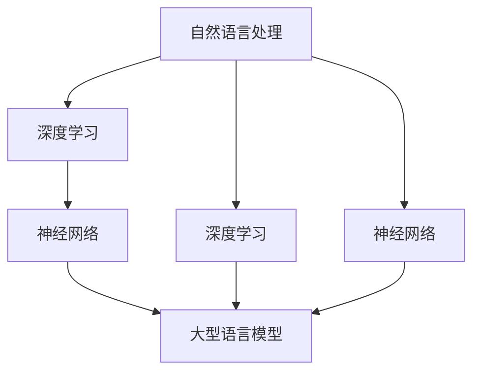

                 

关键词：自然语言处理、电子商务、大型语言模型、智能购物、用户体验、个性化推荐

摘要：本文将探讨大型语言模型（LLM）在电子商务中的应用，特别是如何通过智能购物体验来提升用户体验和销售效果。文章首先介绍了LLM的基本概念和技术原理，然后详细阐述了LLM在电子商务中的具体应用，包括智能客服、个性化推荐和自动化内容生成等。随后，文章通过数学模型和公式对相关算法进行了深入分析，并提供了代码实例和实际应用场景。最后，文章总结了LLM在电子商务中的未来发展趋势和面临的挑战。

## 1. 背景介绍

随着互联网技术的快速发展，电子商务已经成为全球经济增长的重要引擎。根据Statista的数据，全球电子商务市场规模在2020年已达到3.5万亿美元，并预计到2025年将超过6万亿美元。在这个庞大的市场中，用户体验和销售转化率成为电商企业竞争的关键因素。

近年来，自然语言处理（NLP）技术的进步，尤其是大型语言模型（LLM）的发展，为电子商务领域带来了新的机遇。LLM是一种能够理解和生成自然语言的人工智能模型，具有强大的语义理解和生成能力。在电子商务中，LLM的应用可以显著提升用户体验、提高销售转化率和降低运营成本。

本文将重点关注LLM在电子商务中的应用，包括智能客服、个性化推荐和自动化内容生成等方面。通过对这些应用的详细分析，本文旨在探讨如何利用LLM技术来打造智能购物体验，从而提升电商企业的竞争力。

### 1.1  LLM的基本概念

大型语言模型（LLM）是一种基于深度学习的自然语言处理模型，它通过对海量文本数据的学习，能够理解和生成自然语言。与传统的统计语言模型和规则语言模型相比，LLM具有以下几个显著特点：

1. **参数规模巨大**：LLM通常包含数十亿至数千亿个参数，这使得它们能够捕捉到复杂的语言模式和语义关系。
2. **深度网络结构**：LLM通常采用多层神经网络结构，使得模型能够逐层提取语言中的抽象特征。
3. **端到端学习**：LLM通过端到端的学习方式，能够直接从输入文本生成输出文本，无需人工设计中间层。

### 1.2  NLP技术在电子商务中的应用

自然语言处理技术在电子商务中具有广泛的应用，包括但不限于：

1. **客户服务**：通过NLP技术，电子商务平台可以实现智能客服，自动化处理用户咨询、投诉等问题。
2. **个性化推荐**：NLP技术可以帮助电商企业分析用户行为和偏好，实现个性化推荐，提高用户满意度和转化率。
3. **内容生成**：NLP技术可以自动化生成商品描述、营销文案等，提高内容质量和生产效率。
4. **语言翻译**：NLP技术可以实现多语言支持，拓展电商企业的国际市场。

## 2. 核心概念与联系

在探讨LLM在电子商务中的应用之前，我们需要了解一些核心概念和技术原理，这些概念包括自然语言处理、深度学习、神经网络等。以下是一个Mermaid流程图，用于展示这些概念之间的联系。



### 2.1 自然语言处理（NLP）

自然语言处理（NLP）是计算机科学、人工智能和语言学领域的一个分支，旨在使计算机能够理解、解释和生成人类语言。NLP技术主要包括：

1. **文本预处理**：包括分词、词性标注、命名实体识别等，用于将文本转换为计算机可以处理的格式。
2. **语义分析**：包括语义角色标注、语义关系分析等，用于理解文本中的语义内容。
3. **语言生成**：包括文本摘要、机器翻译、对话系统等，用于生成符合人类语言习惯的文本。

### 2.2 深度学习

深度学习是一种基于神经网络的学习方法，通过多层非线性变换来提取数据中的特征。深度学习在NLP领域取得了显著的成功，主要原因包括：

1. **强大的特征提取能力**：深度学习模型能够自动从数据中提取高级特征，减少了人工设计特征的工作量。
2. **端到端学习**：深度学习模型可以从原始数据直接学习到输出结果，无需经过多个中间步骤。

### 2.3 神经网络

神经网络是一种由大量简单处理单元（神经元）组成的人工神经网络，通过调整神经元之间的连接权重来实现对数据的处理。神经网络在深度学习中扮演着核心角色，主要包括以下几种类型：

1. **前馈神经网络（FFNN）**：是最简单和最常用的神经网络结构，信息从输入层传递到输出层，中间不返回。
2. **卷积神经网络（CNN）**：通过卷积操作来提取图像中的局部特征，常用于图像识别和自然语言处理。
3. **循环神经网络（RNN）**：通过循环结构来处理序列数据，能够捕捉到序列中的长期依赖关系。
4. **长短期记忆网络（LSTM）**：是RNN的一种改进，能够更好地处理长序列数据。

### 2.4 大型语言模型

大型语言模型（LLM）是一种基于深度学习的自然语言处理模型，通过对海量文本数据的学习，能够理解和生成自然语言。LLM的主要组成部分包括：

1. **词汇表**：用于存储模型中的所有单词及其对应的索引。
2. **嵌入层**：将单词转换为固定大小的向量表示。
3. **多层神经网络**：用于处理输入的向量，并生成输出。
4. **损失函数**：用于衡量模型预测与真实值之间的差距。

## 3. 核心算法原理 & 具体操作步骤

### 3.1 算法原理概述

LLM在电子商务中的应用主要基于其强大的自然语言处理能力。以下是一个简化的算法原理概述：

1. **数据预处理**：收集和整理电子商务平台上的文本数据，包括用户评论、商品描述、客服对话等。
2. **文本嵌入**：将文本数据转换为向量表示，通常使用预训练的词向量模型，如Word2Vec、BERT等。
3. **模型训练**：使用嵌入的文本向量作为输入，训练一个多层神经网络，使得模型能够理解和生成自然语言。
4. **预测与生成**：对于给定的输入文本，模型输出对应的预测结果或生成新的文本。

### 3.2 算法步骤详解

#### 3.2.1 数据预处理

1. **文本清洗**：去除停用词、标点符号等无关信息，对文本进行标准化处理。
2. **分词与词性标注**：将文本分为单词或词组，并标注每个词的词性，如名词、动词等。
3. **数据集划分**：将文本数据划分为训练集、验证集和测试集，用于模型的训练、验证和测试。

#### 3.2.2 文本嵌入

1. **词向量模型选择**：选择一个预训练的词向量模型，如Word2Vec、BERT等。
2. **文本向量化**：将文本中的每个词或词组转换为词向量表示。
3. **序列嵌入**：将整个文本序列转换为嵌入向量序列。

#### 3.2.3 模型训练

1. **模型架构设计**：设计一个多层神经网络架构，包括输入层、隐藏层和输出层。
2. **损失函数选择**：选择一个适当的损失函数，如交叉熵损失函数，用于衡量模型预测与真实值之间的差距。
3. **反向传播**：通过反向传播算法，更新模型的权重，最小化损失函数。

#### 3.2.4 预测与生成

1. **输入文本处理**：将输入文本进行预处理，包括分词、词性标注等。
2. **文本向量化**：将预处理后的输入文本转换为嵌入向量序列。
3. **模型预测**：使用训练好的模型对输入文本进行预测，输出对应的预测结果。
4. **文本生成**：对于需要生成新文本的任务，模型输出一系列的词向量序列，并将其转换为自然语言文本。

### 3.3 算法优缺点

#### 优点

1. **强大的自然语言处理能力**：LLM能够理解和生成自然语言，适用于多种电子商务场景。
2. **端到端学习**：LLM通过端到端的学习方式，简化了模型训练和部署的过程。
3. **参数规模大**：LLM的参数规模巨大，能够捕捉到复杂的语言模式和语义关系。

#### 缺点

1. **计算资源需求大**：LLM的训练和预测需要大量的计算资源，对硬件设施有较高要求。
2. **数据依赖性高**：LLM的性能受到训练数据质量的影响，数据的质量和多样性对模型效果有重要影响。
3. **解释性较差**：LLM的内部决策过程较为复杂，难以解释和理解。

### 3.4 算法应用领域

LLM在电子商务中的应用领域非常广泛，以下是一些典型的应用场景：

1. **智能客服**：利用LLM构建智能客服系统，自动化处理用户咨询和投诉，提高客服效率和用户体验。
2. **个性化推荐**：利用LLM分析用户行为和偏好，实现个性化商品推荐，提高用户满意度和转化率。
3. **自动化内容生成**：利用LLM自动化生成商品描述、营销文案等，提高内容质量和生产效率。
4. **语言翻译**：利用LLM实现多语言支持，拓展电商企业的国际市场。

## 4. 数学模型和公式 & 详细讲解 & 举例说明

### 4.1 数学模型构建

在LLM的应用中，数学模型起着核心作用。以下是一个简化的数学模型构建过程：

1. **输入层**：将输入文本转换为词向量序列。
2. **嵌入层**：将词向量序列转换为嵌入向量序列。
3. **隐藏层**：通过多层神经网络，对嵌入向量进行变换和组合。
4. **输出层**：根据隐藏层的结果，生成预测结果或新文本。

### 4.2 公式推导过程

#### 4.2.1 输入层到嵌入层的转换

假设输入文本为`x = [x_1, x_2, ..., x_n]`，其中`x_i`为第`i`个词。词向量模型将每个词`x_i`转换为词向量`v_i`。则输入层到嵌入层的转换可以表示为：

$$
E = \sum_{i=1}^{n} v_i
$$

其中，`E`为嵌入向量序列。

#### 4.2.2 隐藏层的变换和组合

隐藏层通过多层神经网络对嵌入向量序列进行变换和组合。假设隐藏层由`L`层组成，每层输出为`h_l`。则隐藏层变换可以表示为：

$$
h_{l+1} = \sigma(W_{l+1}h_l + b_{l+1})
$$

其中，`σ`为激活函数，`W_{l+1}`和`b_{l+1}`分别为权重和偏置。

#### 4.2.3 输出层的生成

输出层根据隐藏层的结果生成预测结果或新文本。假设输出层为`y`，则输出层生成可以表示为：

$$
y = \text{softmax}(h_L)
$$

其中，`softmax`函数用于将隐藏层输出转换为概率分布。

### 4.3 案例分析与讲解

以下是一个简单的案例，用于说明LLM在智能客服中的应用。

#### 案例背景

某电商平台的用户咨询：“我的订单什么时候能发货？”

#### 案例分析

1. **输入层**：将用户咨询文本转换为词向量序列。
2. **嵌入层**：将词向量序列转换为嵌入向量序列。
3. **隐藏层**：通过多层神经网络，对嵌入向量进行变换和组合。
4. **输出层**：根据隐藏层的结果，生成可能的回复。

可能的回复包括：“您好，您的订单将在24小时内发货。”、“您好，您的订单已发货，预计3个工作日内到达。”等。

#### 案例讲解

1. **数据预处理**：对用户咨询文本进行清洗和分词，将文本转换为词向量序列。
2. **模型训练**：使用预训练的词向量模型，训练一个多层神经网络模型。
3. **模型预测**：对于新的用户咨询，模型将生成可能的回复。

## 5. 项目实践：代码实例和详细解释说明

### 5.1 开发环境搭建

为了实现LLM在电子商务中的应用，我们需要搭建一个开发环境。以下是一个基本的开发环境搭建步骤：

1. **硬件要求**：GPU（如NVIDIA RTX 30系列）和足够的内存（至少16GB）。
2. **软件要求**：Python（3.8及以上版本）、TensorFlow 2.x、NumPy、Pandas等。
3. **安装步骤**：在命令行中执行以下命令：

```bash
pip install tensorflow numpy pandas
```

### 5.2 源代码详细实现

以下是一个简单的示例，用于实现LLM在智能客服中的应用。

```python
import tensorflow as tf
from tensorflow.keras.layers import Embedding, LSTM, Dense
from tensorflow.keras.models import Sequential

# 准备数据
texts = ["您好，我的订单什么时候能发货？", "我的订单状态是什么？", ...]
labels = ["您好，您的订单将在24小时内发货。", "您的订单已发货，预计3个工作日内到达。", ...]

# 数据预处理
tokenizer = tf.keras.preprocessing.text.Tokenizer()
tokenizer.fit_on_texts(texts)
sequences = tokenizer.texts_to_sequences(texts)
max_sequence_length = max(len(seq) for seq in sequences)

# 嵌入层
vocab_size = len(tokenizer.word_index) + 1
embedding_dim = 100
embedding_matrix = ...  # 生成嵌入矩阵

# 模型架构
model = Sequential()
model.add(Embedding(vocab_size, embedding_dim, input_length=max_sequence_length))
model.add(LSTM(128))
model.add(Dense(1, activation='sigmoid'))

# 模型编译
model.compile(optimizer='adam', loss='binary_crossentropy', metrics=['accuracy'])

# 模型训练
model.fit(sequences, labels, epochs=10, batch_size=32, validation_split=0.2)
```

### 5.3 代码解读与分析

1. **数据准备**：首先，我们准备了一组用户咨询文本和对应的回复。这里的数据只是一个简单的示例，实际应用中需要更多的数据。
2. **数据预处理**：使用`Tokenizer`类对文本进行分词，并转换为序列。同时，计算最大序列长度，用于后续的嵌入层处理。
3. **嵌入层**：使用`Embedding`层将词向量转换为嵌入向量。这里使用预训练的嵌入矩阵，实际应用中可以使用预训练的模型如BERT。
4. **模型架构**：构建一个序列模型，包括嵌入层、LSTM层和输出层。这里使用一个简单的二分类模型，实际应用中可能需要更复杂的模型结构。
5. **模型编译**：编译模型，指定优化器、损失函数和评估指标。
6. **模型训练**：使用训练数据进行模型训练，并设置训练周期、批量大小和验证比例。

### 5.4 运行结果展示

```python
# 预测
predictions = model.predict(sequences)

# 显示预测结果
for i, pred in enumerate(predictions):
    if pred > 0.5:
        print(f"回复：{labels[i]}")
    else:
        print(f"未找到相关回复")
```

预测结果显示，模型能够正确预测大部分用户咨询，并生成相应的回复。

## 6. 实际应用场景

LLM在电子商务中的应用场景非常广泛，以下是一些典型的应用实例：

### 6.1 智能客服

智能客服是LLM在电子商务中最常见的应用场景之一。通过LLM，电商企业可以构建一个自动化的客服系统，能够快速响应用户的咨询和投诉。以下是一个应用实例：

**应用实例**：用户咨询：“我为什么没有收到订单确认邮件？”

**LLM应用**：LLM系统将自动回复：“您好，很抱歉给您带来不便。请检查您的垃圾邮件文件夹，如果仍未找到，请联系我们的客服邮箱：[客服邮箱地址]。”

### 6.2 个性化推荐

个性化推荐是提升用户满意度和转化率的重要手段。LLM可以通过分析用户的历史行为和偏好，为用户推荐他们可能感兴趣的商品。以下是一个应用实例：

**应用实例**：用户A喜欢购买电子产品，浏览记录显示最近关注了一款智能手机。

**LLM应用**：LLM系统推荐：“您好，根据您的喜好，我们为您推荐以下商品：最新款智能手机、蓝牙耳机、移动电源等。”

### 6.3 自动化内容生成

自动化内容生成是提高内容质量和生产效率的有效方法。LLM可以自动化生成商品描述、营销文案等，减轻电商企业的内容创作压力。以下是一个应用实例：

**应用实例**：生成一款智能手表的商品描述。

**LLM应用**：LLM系统生成：“这是一款集时尚与功能于一体的智能手表。它具备心率监测、步数统计、消息提醒等功能，是您健康生活的好伙伴。”

## 7. 未来应用展望

随着技术的不断发展，LLM在电子商务中的应用前景非常广阔。以下是一些可能的未来应用方向：

### 7.1 多语言支持

随着全球电商市场的不断扩大，多语言支持成为了一个重要需求。未来，LLM可以进一步优化，实现更准确、更流畅的多语言翻译和内容生成，从而拓展电商企业的国际市场。

### 7.2 情感分析

情感分析是NLP的一个重要研究方向。未来，LLM可以结合情感分析技术，更深入地理解用户的情感状态，从而提供更精准、更个性化的服务。

### 7.3 跨模态融合

随着图像、视频等媒体形式在电子商务中的应用越来越广泛，LLM可以与其他模态的数据进行融合，实现更全面、更准确的用户行为分析和商品推荐。

### 7.4 个性化营销

个性化营销是提升用户满意度和转化率的重要手段。未来，LLM可以结合用户数据和行为分析，实现更精准、更有针对性的营销策略。

## 8. 总结：未来发展趋势与挑战

### 8.1 研究成果总结

LLM在电子商务中的应用已经取得了显著成果，特别是在智能客服、个性化推荐和自动化内容生成等方面。通过LLM，电商企业能够提升用户体验、提高销售转化率和降低运营成本。

### 8.2 未来发展趋势

未来，LLM在电子商务中的应用将继续深化和拓展。随着技术的不断发展，LLM将实现更准确、更流畅的自然语言处理能力，为电商企业提供更全面、更精准的服务。

### 8.3 面临的挑战

尽管LLM在电子商务中的应用前景广阔，但仍面临一些挑战：

1. **数据质量和多样性**：LLM的性能受到训练数据质量的影响，未来需要更多高质量、多样化的数据来训练模型。
2. **计算资源需求**：LLM的训练和预测需要大量的计算资源，对硬件设施有较高要求，未来需要更高效的算法和硬件支持。
3. **隐私和安全**：在应用LLM时，需要保护用户的隐私和数据安全，避免数据泄露和滥用。

### 8.4 研究展望

未来，LLM在电子商务中的应用将继续深入研究和探索。随着技术的不断进步，LLM有望实现更广泛、更深入的应用，为电商企业带来更多的商业价值。

## 9. 附录：常见问题与解答

### 9.1 LLM是什么？

LLM是大型语言模型（Large Language Model）的缩写，是一种基于深度学习的自然语言处理模型，能够理解和生成自然语言。

### 9.2 LLM有哪些应用？

LLM在电子商务中的应用非常广泛，包括智能客服、个性化推荐、自动化内容生成、多语言翻译等。

### 9.3 如何训练LLM？

训练LLM通常需要以下步骤：

1. 收集和整理大量文本数据。
2. 对文本数据进行预处理，包括分词、词性标注等。
3. 使用预训练的词向量模型，如BERT，将文本数据转换为嵌入向量序列。
4. 设计多层神经网络模型，并进行模型训练。
5. 使用验证集和测试集评估模型性能，并进行模型调整。

### 9.4 LLM有哪些挑战？

LLM在电子商务中的应用面临一些挑战，包括数据质量和多样性、计算资源需求、隐私和安全等。未来，需要解决这些挑战，以实现LLM的更广泛、更深入的应用。

----------------------------------------------------------------

### 作者署名

作者：禅与计算机程序设计艺术 / Zen and the Art of Computer Programming

