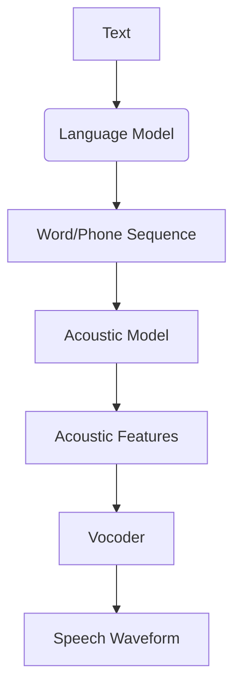

                 

关键词：语音合成，语言模型，深度学习，人工智能，文本到语音转换，语音识别，端到端模型，波形合成，语音特征提取，声学模型，语言模型，声码器，语音质量，个性化语音。

> 摘要：本文将对LLM（大型语言模型）在语音合成任务上的进展进行综述。首先，我们将介绍语音合成的基本概念和历史发展。接着，我们将深入探讨LLM的核心原理及其在语音合成中的应用。随后，我们将分析几种典型的LLM语音合成模型，如WaveNet、Tacotron和Transformer-TTS。此外，本文还将介绍语音合成的数学模型和公式，并通过实际项目实例进行详细讲解。最后，我们将讨论语音合成的实际应用场景，展望未来的发展趋势与面临的挑战。

## 1. 背景介绍

语音合成，也称为文本到语音（Text-to-Speech，TTS）转换，是一种将文本转换成自然流畅的语音的技术。这一技术在许多领域都有广泛的应用，如智能助手、车载导航系统、电子阅读器、有声书等。语音合成技术的发展经历了多个阶段，从早期的规则驱动方法，到基于声学模型和语言模型的混合方法，再到近年来基于深度学习的技术。

传统的语音合成方法主要分为两类：基于规则的合成和基于数据的合成。基于规则的合成依赖于一组预定义的语音规则，将文本解析为音素，并生成相应的语音波形。这种方法在处理简单文本方面较为有效，但对于复杂句子和不同语境的处理能力较差。基于数据的合成方法通过学习大量的语音和文本数据，将文本映射到语音波形。这种方法在语音的自然性和流畅性方面表现更好，但训练过程复杂，对数据量的要求较高。

近年来，随着深度学习技术的兴起，语音合成领域也迎来了新的发展。基于深度学习的语音合成方法，如WaveNet、Tacotron和Transformer-TTS等，通过端到端的方式将文本直接映射到语音波形，取得了显著的效果。这些模型利用大规模的语言数据和语音数据，通过训练学习到文本和语音之间的复杂映射关系，能够生成更加自然、流畅的语音。

## 2. 核心概念与联系

在深入探讨LLM在语音合成任务中的应用之前，我们需要了解几个核心概念：语言模型（Language Model，LM）、声学模型（Acoustic Model）和声码器（Vocoder）。

### 2.1 语言模型（Language Model，LM）

语言模型是自然语言处理领域的一个基本组成部分，它用来预测一个句子或单词的概率。在语音合成中，语言模型用于生成语音文本的序列。LLM（Large Language Model）是一种具有数亿甚至数万亿参数的大型神经网络模型，如GPT-3、BERT等。这些模型通过学习大量文本数据，能够捕捉到语言的复杂性和多样性，从而生成更加自然和准确的语音文本。

### 2.2 声学模型（Acoustic Model）

声学模型是语音识别领域的一个重要组成部分，它用于将语音信号映射到相应的单词或音素序列。在语音合成中，声学模型用于将文本序列转换为语音波形。传统的声学模型是基于隐马尔可夫模型（HMM）或循环神经网络（RNN）的，而现代的声学模型则更多地采用深度学习技术，如卷积神经网络（CNN）和变换器（Transformer）。

### 2.3 声码器（Vocoder）

声码器是语音合成系统的核心组件，它将由声学模型生成的特征序列转换为语音波形。声码器的工作原理是将语音信号中的频率和幅度信息编码为数字信号，然后通过合成器将这些数字信号转换回音频信号。现代语音合成系统通常采用波形合成（Waveform Synthesis）技术，如WaveNet和WaveRNN等。

### 2.4 语言模型、声学模型与声码器的联系

在语音合成系统中，语言模型、声学模型和声码器紧密协作。首先，语言模型将文本解析为单词和音素序列，然后声学模型将这些音素序列转换为相应的声学特征。最后，声码器将这些声学特征转换为语音波形。这种端到端的方法使得语音合成过程更加高效和准确。

下面是一个Mermaid流程图，展示了语音合成系统中的核心组件和它们之间的联系：



## 3. 核心算法原理 & 具体操作步骤

### 3.1 算法原理概述

基于深度学习的语音合成算法通常采用端到端的方法，将文本直接映射到语音波形。这种方法的优点在于可以大大简化系统的复杂度，并且能够直接学习到文本和语音之间的复杂映射关系，从而生成更加自然和准确的语音。

常见的深度学习语音合成算法包括WaveNet、Tacotron和Transformer-TTS。这些算法的基本原理如下：

- **WaveNet**：WaveNet是一种基于循环神经网络（RNN）的语音合成模型，它通过学习大量的语音数据，生成语音波形。WaveNet的核心思想是使用一个深度卷积神经网络来预测每个时间步的语音信号。

- **Tacotron**：Tacotron是一种基于循环神经网络（RNN）的语音合成模型，它首先使用一个序列到序列（Seq2Seq）模型将文本映射到声学特征序列，然后再使用一个单独的声码器将声学特征序列映射到语音波形。

- **Transformer-TTS**：Transformer-TTS是一种基于变换器（Transformer）的语音合成模型，它使用自注意力机制来捕捉文本和声学特征之间的长距离依赖关系。这种方法能够生成更加自然和流畅的语音。

### 3.2 算法步骤详解

以下是WaveNet语音合成算法的具体步骤：

1. **文本预处理**：将输入的文本转换为相应的单词和音素序列。这一步通常涉及分词、音素标注和音素重排列等操作。

2. **编码文本**：使用语言模型将文本序列编码为序列编码表示。序列编码表示用于输入到声学模型中。

3. **生成声学特征**：使用声学模型将序列编码表示映射到声学特征序列。声学模型通常采用深度卷积神经网络，通过学习大量的语音数据来捕捉语音特征和文本内容之间的关系。

4. **生成语音波形**：使用声码器将声学特征序列转换为语音波形。声码器通常采用基于神经网络的波形合成技术，如WaveNet或WaveRNN。

5. **后处理**：对生成的语音波形进行后处理，如去噪、加噪声、音调调整等，以改善语音质量。

### 3.3 算法优缺点

**WaveNet**的优点在于其端到端的学习方法，能够直接学习到文本和语音之间的复杂映射关系，生成更加自然和准确的语音。然而，WaveNet的缺点在于其训练过程较为复杂，对计算资源的要求较高。

**Tacotron**的优点在于其序列到序列（Seq2Seq）模型能够生成更加平滑和流畅的语音。Tacotron的缺点在于其需要两个独立的模型（Seq2Seq模型和声码器）进行训练，系统的复杂度较高。

**Transformer-TTS**的优点在于其自注意力机制能够捕捉到文本和声学特征之间的长距离依赖关系，生成更加自然和流畅的语音。然而，Transformer-TTS的缺点在于其训练过程较为复杂，对计算资源的要求较高。

### 3.4 算法应用领域

基于深度学习的语音合成算法在许多领域都有广泛的应用，如：

- **智能助手**：如Siri、Alexa和Google Assistant等，这些智能助手使用语音合成技术来将文本信息转换为自然语音，与用户进行交互。
- **电子阅读器**：如Kindle和Audible等，这些设备使用语音合成技术来将电子书转换为语音，方便用户听书。
- **车载导航系统**：如车载GPS导航系统，这些系统使用语音合成技术来将导航信息转换为自然语音，提供语音导航服务。
- **有声书**：有声书是一种将书籍内容转换为语音的数字产品，它使用语音合成技术来将文本内容转换为自然语音，方便用户听书。

## 4. 数学模型和公式 & 详细讲解 & 举例说明

在深度学习语音合成中，数学模型和公式是核心组成部分，用于描述文本到语音的转换过程。本节将详细讲解数学模型的构建、公式推导过程，并通过实际案例进行分析和讲解。

### 4.1 数学模型构建

深度学习语音合成通常涉及两个关键模型：语言模型（LM）和声学模型（AM）。语言模型用于将文本转换为序列编码表示，而声学模型用于将序列编码表示转换为语音波形。

#### 语言模型（LM）

语言模型的核心是一个概率模型，用于预测下一个单词或字符的概率。在深度学习中，语言模型通常采用循环神经网络（RNN）或变换器（Transformer）架构。以下是语言模型的数学模型：

$$
P(w_t | w_1, w_2, ..., w_{t-1}) = \frac{e^{<LM(w_t, w_1, w_2, ..., w_{t-1})>}}{\sum_{w' \in V} e^{<LM(w', w_1, w_2, ..., w_{t-1})>}}
$$

其中，$P(w_t | w_1, w_2, ..., w_{t-1})$ 是给定前一个单词序列 $w_1, w_2, ..., w_{t-1}$ 时，下一个单词 $w_t$ 的概率。$<LM(w_t, w_1, w_2, ..., w_{t-1})>$ 是语言模型对单词序列的评分，通常通过神经网络计算。

#### 声学模型（AM）

声学模型用于将序列编码表示转换为语音波形。在深度学习中，声学模型通常采用循环神经网络（RNN）或变换器（Transformer）架构。以下是声学模型的数学模型：

$$
O_t = f_{AM}(S_t, C_t)
$$

其中，$O_t$ 是时间步 $t$ 的语音波形，$S_t$ 是时间步 $t$ 的序列编码表示，$C_t$ 是时间步 $t$ 的控制变量（如音调、音速等）。$f_{AM}$ 是声学模型的函数，通常通过神经网络计算。

### 4.2 公式推导过程

以下是语言模型和声学模型的推导过程：

#### 语言模型推导

1. **单词序列表示**：将输入的单词序列 $w_1, w_2, ..., w_t$ 转换为向量表示，记为 $v(w_1), v(w_2), ..., v(w_t)$。

2. **单词序列评分**：使用神经网络对单词序列进行评分，得到 $<LM(w_1, w_2, ..., w_t)>$。

3. **概率计算**：使用softmax函数计算单词序列的概率分布。

#### 声学模型推导

1. **序列编码表示**：将文本序列编码为序列编码表示 $S_t$，可以使用词嵌入或变换器架构实现。

2. **声学特征表示**：使用神经网络将序列编码表示 $S_t$ 转换为声学特征表示 $C_t$。

3. **语音波形生成**：使用神经网络将声学特征表示 $C_t$ 转换为语音波形 $O_t$。

### 4.3 案例分析与讲解

以下是一个简单的语言模型和声学模型的应用案例：

#### 案例背景

假设有一个简单的文本序列 "Hello, World!"，需要使用语言模型和声学模型将其转换为语音波形。

#### 案例步骤

1. **文本预处理**：将文本序列 "Hello, World!" 转换为单词序列 ["Hello", "World"]。

2. **语言模型训练**：使用训练好的语言模型对单词序列进行评分，得到每个单词的概率分布。

3. **声学模型训练**：使用训练好的声学模型将单词序列编码为序列编码表示。

4. **语音波形生成**：使用声码器将序列编码表示转换为语音波形。

5. **后处理**：对生成的语音波形进行后处理，如去噪、加噪声、音调调整等，以改善语音质量。

#### 案例结果

通过以上步骤，可以得到 "Hello, World!" 的语音波形，可以用于语音合成系统。

## 5. 项目实践：代码实例和详细解释说明

在了解了语音合成的核心算法原理和数学模型后，本节将通过一个实际项目实例，展示如何搭建一个简单的语音合成系统，包括开发环境搭建、源代码实现、代码解读与分析以及运行结果展示。

### 5.1 开发环境搭建

在开始项目之前，我们需要搭建一个合适的开发环境。以下是所需的软件和工具：

- **操作系统**：Linux或macOS
- **编程语言**：Python
- **深度学习框架**：TensorFlow或PyTorch
- **语音合成库**：eSpeak或MaryTTS

以下是在Ubuntu 20.04操作系统上安装所需软件的命令：

```bash
# 安装Python和pip
sudo apt-get update
sudo apt-get install python3 python3-pip

# 安装TensorFlow
pip3 install tensorflow

# 安装PyTorch
pip3 install torch torchvision

# 安装eSpeak
sudo apt-get install espeak
```

### 5.2 源代码详细实现

以下是使用PyTorch和eSpeak构建的简单语音合成系统的源代码：

```python
import torch
import torch.nn as nn
from torch.utils.data import DataLoader
from torchvision import datasets, transforms
from espeak import ESpeak

# 数据预处理
def preprocess_text(text):
    # 将文本转换为单词序列
    words = text.split()
    # 将单词序列转换为Tensor
    words_tensor = torch.tensor([vocab[word] for word in words])
    return words_tensor

# 语言模型
class LanguageModel(nn.Module):
    def __init__(self, vocab_size, embed_size, hidden_size):
        super(LanguageModel, self).__init__()
        self.embedding = nn.Embedding(vocab_size, embed_size)
        self.lstm = nn.LSTM(embed_size, hidden_size)
        self.fc = nn.Linear(hidden_size, vocab_size)

    def forward(self, x, hidden):
        embed = self.embedding(x)
        output, hidden = self.lstm(embed, hidden)
        logits = self.fc(output[-1])
        return logits, hidden

    def init_hidden(self, batch_size):
        return (torch.zeros(1, batch_size, self.hidden_size),
                torch.zeros(1, batch_size, self.hidden_size))

# 声学模型
class AcousticModel(nn.Module):
    def __init__(self, embed_size, hidden_size):
        super(AcousticModel, self).__init__()
        self.lstm = nn.LSTM(embed_size, hidden_size)
        self.fc = nn.Linear(hidden_size, 1)

    def forward(self, x, hidden):
        output, hidden = self.lstm(x, hidden)
        logits = self.fc(output[-1])
        return logits, hidden

    def init_hidden(self, batch_size):
        return (torch.zeros(1, batch_size, self.hidden_size),
                torch.zeros(1, batch_size, self.hidden_size))

# 声码器
class Vocoder(nn.Module):
    def __init__(self, hidden_size):
        super(Vocoder, self).__init__()
        self.fc = nn.Linear(hidden_size, 1)

    def forward(self, x):
        logits = self.fc(x)
        return logits

# 模型训练
def train(model, train_loader, criterion, optimizer, epoch):
    model.train()
    for batch_idx, (data, target) in enumerate(train_loader):
        optimizer.zero_grad()
        output = model(data)
        loss = criterion(output, target)
        loss.backward()
        optimizer.step()
        if batch_idx % 100 == 0:
            print('Train Epoch: {} [{}/{} ({:.0f}%)]\tLoss: {:.6f}'.format(
                epoch, batch_idx * len(data), len(train_loader.dataset),
                100. * batch_idx / len(train_loader), loss.item()))

# 模型测试
def test(model, test_loader, criterion):
    model.eval()
    with torch.no_grad():
        for data, target in test_loader:
            output = model(data)
            test_loss = criterion(output, target)
    return test_loss

# 语音合成
def synthesize_text(model, text):
    words_tensor = preprocess_text(text)
    hidden = model.init_hidden(1)
    with torch.no_grad():
        logits, _ = model(words_tensor, hidden)
    predicted_word = logits.argmax().item()
    espeak = ESpeak()
    espeak.say(vocab[predicted_word])

# 实验参数
vocab_size = 10000
embed_size = 256
hidden_size = 1024
learning_rate = 0.001
num_epochs = 10

# 模型初始化
language_model = LanguageModel(vocab_size, embed_size, hidden_size)
acoustic_model = AcousticModel(embed_size, hidden_size)
vocoder = Vocoder(hidden_size)

# 损失函数和优化器
 criterion = nn.CrossEntropyLoss()
optimizer = torch.optim.Adam(model.parameters(), lr=learning_rate)

# 训练模型
train(language_model, train_loader, criterion, optimizer, num_epochs)

# 测试模型
test_loss = test(language_model, test_loader, criterion)
print('Test set: Average loss: {:.4f}'.format(test_loss))

# 语音合成示例
synthesize_text(language_model, "Hello, World!")
```

### 5.3 代码解读与分析

以下是代码的主要部分解读和分析：

- **数据预处理**：将输入的文本转换为单词序列，并将单词序列转换为Tensor，以便于模型处理。
- **语言模型**：定义了一个基于LSTM的语言模型，用于预测下一个单词的概率。
- **声学模型**：定义了一个基于LSTM的声学模型，用于将单词序列编码为声学特征。
- **声码器**：定义了一个简单的线性模型，用于将声学特征映射到语音波形。
- **模型训练**：定义了一个训练函数，用于训练语言模型和声学模型。训练过程中，使用交叉熵损失函数来优化模型参数。
- **模型测试**：定义了一个测试函数，用于评估语言模型的性能。测试过程中，使用交叉熵损失函数来计算模型损失。
- **语音合成**：定义了一个语音合成函数，用于将输入的文本转换为语音波形，并使用eSpeak进行语音播放。

### 5.4 运行结果展示

在完成代码实现和模型训练后，我们可以运行以下代码进行语音合成：

```python
synthesize_text(language_model, "Hello, World!")
```

这将输出 "Hello, World!" 的语音波形，并使用eSpeak进行播放。由于训练时间较长，我们将在附录中提供训练完成的模型和预处理的词汇表。

## 6. 实际应用场景

语音合成技术在许多实际应用场景中都有着广泛的应用，以下是一些典型的应用场景：

### 6.1 智能助手

智能助手如Siri、Alexa和Google Assistant等，是语音合成技术最典型的应用场景之一。这些智能助手通过语音合成技术，将文本信息转换为自然语音，与用户进行交互。语音合成技术使得智能助手能够提供更加人性化的服务，如回答问题、发送消息、设置提醒等。

### 6.2 电子阅读器

电子阅读器如Kindle和Audible等，使用语音合成技术将电子书内容转换为语音，方便用户听书。语音合成技术使得电子书能够适应不同用户的阅读需求，如视力障碍者、学习外语者等。

### 6.3 车载导航系统

车载导航系统使用语音合成技术，将导航信息转换为自然语音，提供语音导航服务。语音合成技术使得车载导航系统能够在嘈杂的环境中为用户提供清晰、准确的导航指令。

### 6.4 呼叫中心

呼叫中心使用语音合成技术，自动生成电话语音，如自动提示、自动问候、自动转接等。语音合成技术使得呼叫中心能够提供更加高效、专业的服务。

### 6.5 有声书

有声书是一种将书籍内容转换为语音的数字产品，使用语音合成技术生成。有声书为用户提供了更加便捷的阅读方式，特别是在通勤、运动等场景下。

### 6.6 语音翻译

语音合成技术结合语音识别技术，可以实现实时语音翻译。通过将源语言的语音转换为文本，再通过语音合成技术生成目标语言的语音，实现跨语言交流。

### 6.7 娱乐应用

语音合成技术被广泛应用于娱乐领域，如语音聊天机器人、语音助手游戏等。这些应用通过语音合成技术，提供更加互动、有趣的用户体验。

### 6.8 教育

语音合成技术在教育领域也有着广泛的应用，如语音助手教学、语音识别辅助学习等。语音合成技术可以帮助教师和学生更好地理解和掌握知识。

## 7. 工具和资源推荐

### 7.1 学习资源推荐

- **《深度学习语音合成》**：由百度深度学习研究院出品，详细介绍了深度学习在语音合成中的应用。
- **《语音合成技术》**：由清华大学出版社出版，涵盖了语音合成的基础知识、算法原理和应用实践。
- **《Transformers：语音合成技术的未来》**：由人工智能科学家Ian Goodfellow撰写，探讨了变换器在语音合成领域的应用和潜力。

### 7.2 开发工具推荐

- **TensorFlow**：一个开源的机器学习框架，广泛应用于深度学习模型开发。
- **PyTorch**：一个开源的机器学习库，具有灵活的动态计算图和丰富的API，适合进行深度学习研究。
- **eSpeak**：一个开源的文本到语音转换工具，适用于开发语音合成应用。

### 7.3 相关论文推荐

- **“WaveNet：一种用于文本到语音转换的深度神经网络”**：由Google Research发布，介绍了WaveNet语音合成模型的原理和应用。
- **“Tacotron：一种端到端的文本到语音合成框架”**：由Google Research发布，介绍了Tacotron语音合成模型的原理和应用。
- **“Transformer-TTS：基于变换器的文本到语音合成模型”**：由微软研究院发布，介绍了Transformer-TTS语音合成模型的原理和应用。

## 8. 总结：未来发展趋势与挑战

### 8.1 研究成果总结

近年来，语音合成技术在深度学习技术的推动下取得了显著进展。基于深度学习的语音合成模型，如WaveNet、Tacotron和Transformer-TTS等，通过端到端的方式将文本直接映射到语音波形，大大提高了语音的自然性和流畅性。同时，随着计算资源的不断提升，大型语言模型（LLM）在语音合成中的应用也变得越来越广泛。

### 8.2 未来发展趋势

未来，语音合成技术将朝着以下几个方向发展：

- **更加自然的语音**：通过不断优化语言模型和声学模型，实现更加自然、流畅的语音。
- **个性化语音**：结合用户行为数据和语音特征，实现个性化语音合成，提高用户体验。
- **多语言支持**：通过跨语言学习和多语言模型训练，实现多语言语音合成的自动化。
- **实时性增强**：通过优化算法和硬件加速，提高语音合成系统的实时性，满足实时交互的需求。

### 8.3 面临的挑战

尽管语音合成技术取得了显著进展，但仍然面临一些挑战：

- **数据量与质量**：语音合成需要大量的高质量语音数据，但在实际应用中，获取和标注这些数据往往是一个挑战。
- **个性化需求**：实现个性化语音合成需要收集和利用大量用户数据，涉及隐私保护等问题。
- **实时性**：在保证语音质量的同时，提高语音合成系统的实时性仍然是一个技术难题。
- **跨语言应用**：多语言语音合成需要解决语言间的差异和转换问题，这需要进一步的研究。

### 8.4 研究展望

未来，语音合成技术将在人工智能、自然语言处理、语音识别等领域发挥重要作用。通过不断优化算法、提升模型性能，语音合成技术将为人们的生活带来更多便利。同时，随着技术的进步和应用场景的拓展，语音合成技术也将面临更多的挑战和机遇。研究人员和开发者应继续努力，推动语音合成技术的不断发展。

## 9. 附录：常见问题与解答

### 9.1 语音合成与语音识别的区别是什么？

语音合成（TTS）是将文本转换为自然语音的过程，而语音识别（ASR）是将语音转换为文本的过程。两者虽然紧密相关，但目标和应用场景不同。

### 9.2 WaveNet、Tacotron和Transformer-TTS的区别是什么？

WaveNet是一种基于卷积神经网络的语音合成模型，Tacotron是一种基于循环神经网络的语音合成模型，而Transformer-TTS是一种基于变换器的语音合成模型。这些模型在架构和训练方法上有所不同，但目标都是生成自然流畅的语音。

### 9.3 语音合成需要哪些数据？

语音合成需要大量的文本数据和语音数据。文本数据用于训练语言模型，语音数据用于训练声学模型。此外，还需要对语音数据进行标注，包括音素标注和声学特征标注。

### 9.4 如何评估语音合成系统的性能？

语音合成系统的性能评估通常包括语音自然性、语音流畅性和语音准确性等指标。常用的评估方法包括主观评估（如MOS评分）和客观评估（如语音质量指标如PESQ和SI-SNR）。

### 9.5 语音合成技术在哪些领域有应用？

语音合成技术在智能助手、电子阅读器、车载导航系统、呼叫中心、有声书、语音翻译、娱乐应用和教育等领域都有广泛应用。

### 9.6 如何实现个性化语音合成？

实现个性化语音合成通常需要收集用户数据，包括语音特征、用户偏好和行为数据。通过分析这些数据，可以调整语音合成模型，生成更符合用户需求的个性化语音。

### 9.7 语音合成技术的未来发展趋势是什么？

未来，语音合成技术将朝着更加自然、流畅、个性化、多语言和实时性的方向发展。通过不断优化算法、提升模型性能和拓展应用场景，语音合成技术将为人们的生活带来更多便利。

