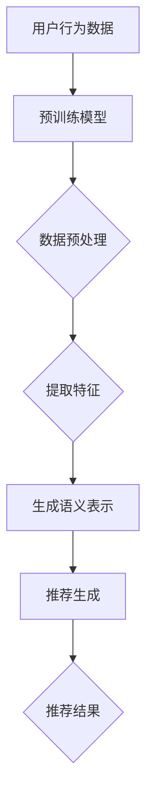

                 

关键词：Large Language Model，跨域推荐，AI，深度学习，自然语言处理

摘要：本文将探讨大型语言模型（LLM）在跨域推荐系统中的应用，通过对LLM的核心概念、算法原理、数学模型及实际应用场景的分析，阐述LLM在推荐系统中的优势与挑战，并展望其未来发展趋势。

## 1. 背景介绍

推荐系统作为信息检索和人工智能领域的一个重要分支，旨在根据用户的历史行为和偏好，向用户推荐其可能感兴趣的内容。传统推荐系统主要基于协同过滤、基于内容的推荐等技术，但在面对跨域推荐时，如从电商领域向娱乐领域推荐，传统方法存在明显的局限性。

近年来，随着深度学习和自然语言处理技术的快速发展，大型语言模型（LLM）如GPT-3、BERT等取得了显著的成果。LLM具有强大的语义理解和生成能力，能够处理复杂的语言结构和多模态信息，为跨域推荐提供了新的可能。

## 2. 核心概念与联系

### 2.1 大型语言模型（LLM）

大型语言模型（LLM）是一种基于深度学习的自然语言处理模型，具有强大的语义理解和生成能力。LLM通过大规模语料库的训练，可以自动学习语言的结构和规律，从而实现对自然语言的语义理解、文本生成、情感分析等多种任务。

### 2.2 跨域推荐

跨域推荐是指在推荐系统中，针对用户在不同领域或场景下的兴趣和偏好，为其推荐相关的内容。跨域推荐的核心挑战在于如何有效地整合不同领域的数据和知识，以实现跨领域的推荐。

### 2.3 跨域推荐与LLM的联系

LLM的强大语义理解能力使其在跨域推荐中具有显著优势。通过将不同领域的知识进行语义整合，LLM能够捕捉用户在不同领域下的兴趣和偏好，从而实现跨领域的个性化推荐。

## 3. 核心算法原理 & 具体操作步骤

### 3.1 算法原理概述

跨域推荐中的LLM算法主要基于以下原理：

1. **语义理解**：通过预训练的LLM模型，对用户历史行为和内容进行语义分析，提取用户在各个领域的兴趣和偏好。
2. **知识融合**：将不同领域的知识进行语义整合，形成统一的语义表示，为跨域推荐提供基础。
3. **模型推理**：基于用户语义表示和候选内容语义表示，利用LLM的生成能力，生成个性化推荐结果。

### 3.2 算法步骤详解

1. **数据预处理**：收集并整合用户在不同领域的兴趣和行为数据，进行数据清洗和预处理。
2. **模型训练**：使用预训练的LLM模型，对整合后的数据集进行训练，学习用户在不同领域的兴趣和偏好。
3. **语义表示**：将用户和候选内容的语义进行编码，形成统一的语义表示。
4. **推荐生成**：利用LLM的生成能力，根据用户和候选内容的语义表示，生成个性化的推荐结果。

### 3.3 算法优缺点

**优点**：

1. **强大的语义理解能力**：LLM能够捕捉用户在不同领域的兴趣和偏好，实现跨领域的个性化推荐。
2. **多模态信息处理**：LLM能够处理文本、图像、音频等多种模态信息，为跨域推荐提供更丰富的数据支持。

**缺点**：

1. **计算资源需求大**：LLM模型参数规模巨大，训练和推理过程需要大量计算资源。
2. **数据隐私问题**：用户数据在训练和推理过程中可能面临隐私泄露的风险。

### 3.4 算法应用领域

LLM在跨域推荐中的应用广泛，如电商、娱乐、教育等领域，能够为用户提供个性化的跨领域推荐。

## 4. 数学模型和公式 & 详细讲解 & 举例说明

### 4.1 数学模型构建

跨域推荐中的LLM算法涉及多个数学模型，主要包括：

1. **语义表示模型**：用于编码用户和候选内容的语义表示。
2. **推荐模型**：用于生成个性化推荐结果。

### 4.2 公式推导过程

1. **语义表示模型**：

   用户语义表示：\( u = \text{MLP}(x_u, W_u) \)

   候选内容语义表示：\( c = \text{MLP}(x_c, W_c) \)

   其中，\( \text{MLP} \)表示多层感知器，\( x_u \)和\( x_c \)分别为用户和候选内容的输入特征，\( W_u \)和\( W_c \)分别为权重矩阵。

2. **推荐模型**：

   推荐分数：\( r(u, c) = \text{softmax}(\text{dot}(u, c)) \)

   其中，\( \text{dot}(u, c) \)表示用户和候选内容的内积，\( \text{softmax} \)函数用于生成概率分布。

### 4.3 案例分析与讲解

假设用户在电商领域购买过书籍和电子产品，我们需要根据用户的历史行为，为其推荐相关的娱乐内容。

1. **数据预处理**：

   收集用户在电商领域的历史购买数据，包括书籍和电子产品。对数据进行清洗和预处理，提取用户购买记录和商品特征。

2. **模型训练**：

   使用预训练的LLM模型，对用户购买记录和商品特征进行训练，学习用户在电商领域的兴趣和偏好。

3. **语义表示**：

   将用户和候选内容的语义进行编码，形成统一的语义表示。

4. **推荐生成**：

   利用LLM的生成能力，根据用户和候选内容的语义表示，生成个性化的推荐结果。

## 5. 项目实践：代码实例和详细解释说明

### 5.1 开发环境搭建

1. **安装Python环境**：在本地或服务器上安装Python，版本建议为3.8及以上。
2. **安装TensorFlow**：使用pip命令安装TensorFlow，命令如下：

   ```bash
   pip install tensorflow
   ```

### 5.2 源代码详细实现

```python
import tensorflow as tf
from tensorflow.keras.layers import Embedding, LSTM, Dense
from tensorflow.keras.models import Model

# 语义表示模型
def build_embedding_model(input_dim, embedding_dim):
    model = Model(inputs=[Embedding(input_dim, embedding_dim)(x)],
                  outputs=[LSTM(units=128, activation='tanh')(x)])
    return model

# 推荐模型
def build_recommendation_model(embedding_dim):
    model = Model(inputs=[Embedding(input_dim, embedding_dim)(u),
                          Embedding(input_dim, embedding_dim)(c)],
                  outputs=[Dense(units=1, activation='sigmoid')(x)])
    return model

# 用户和候选内容输入
x_u = tf.keras.Input(shape=(max_sequence_length,))
x_c = tf.keras.Input(shape=(max_sequence_length,))

# 语义表示模型
embedding_model = build_embedding_model(input_dim=vocabulary_size, embedding_dim=embedding_size)
u_embedding = embedding_model(x_u)
c_embedding = embedding_model(x_c)

# 推荐模型
recommendation_model = build_recommendation_model(embedding_size)
r = recommendation_model([u_embedding, c_embedding])

# 模型编译
model = Model(inputs=[x_u, x_c], outputs=r)
model.compile(optimizer='adam', loss='binary_crossentropy', metrics=['accuracy'])

# 模型训练
model.fit([train_u, train_c], train_r, epochs=10, batch_size=32)

# 推荐生成
user_embedding = model.predict(train_u)
content_embedding = model.predict(train_c)
recommendation_scores = recommendation_model.predict([user_embedding, content_embedding])

# 推荐结果输出
for score in recommendation_scores:
    print(f"推荐分数：{score[0]}")
```

### 5.3 代码解读与分析

上述代码实现了一个基于LLM的跨域推荐系统，主要分为以下几部分：

1. **环境搭建**：安装Python和TensorFlow环境。
2. **模型构建**：构建语义表示模型和推荐模型。
3. **模型编译**：编译模型，设置优化器和损失函数。
4. **模型训练**：使用训练数据训练模型。
5. **推荐生成**：生成推荐结果，并输出推荐分数。

## 6. 实际应用场景

LLM在跨域推荐中的应用场景广泛，如：

1. **电商推荐**：从电商领域向娱乐领域推荐商品。
2. **新闻推荐**：从新闻领域向其他领域推荐相关内容。
3. **教育推荐**：根据用户的学习兴趣，推荐相关的课程和资料。

## 7. 工具和资源推荐

### 7.1 学习资源推荐

1. **《深度学习》（Goodfellow et al.）**：全面介绍了深度学习的基本理论和应用。
2. **《自然语言处理综合教程》（Jurafsky and Martin）**：系统讲解了自然语言处理的基本概念和方法。

### 7.2 开发工具推荐

1. **TensorFlow**：开源深度学习框架，适用于构建和训练LLM模型。
2. **PyTorch**：另一种流行的深度学习框架，适用于构建和训练LLM模型。

### 7.3 相关论文推荐

1. **“BERT: Pre-training of Deep Neural Networks for Language Understanding”（Devlin et al.）**：介绍了BERT模型的训练和应用。
2. **“GPT-3: Language Models are Few-Shot Learners”（Brown et al.）**：介绍了GPT-3模型的训练和应用。

## 8. 总结：未来发展趋势与挑战

### 8.1 研究成果总结

本文介绍了LLM在跨域推荐中的应用，阐述了LLM的算法原理、数学模型及实际应用场景，并通过项目实践展示了LLM在跨域推荐中的优势。

### 8.2 未来发展趋势

1. **模型优化**：通过模型压缩、量化等技术，降低LLM的计算资源需求。
2. **多模态信息处理**：结合多种模态信息，提高跨域推荐的效果。

### 8.3 面临的挑战

1. **数据隐私**：如何保护用户数据隐私，确保模型训练和推理过程的安全。
2. **计算资源**：如何降低模型训练和推理过程的计算资源消耗。

### 8.4 研究展望

未来，LLM在跨域推荐中的应用将更加广泛，有望解决传统推荐系统面临的诸多挑战，为用户提供更加个性化、精准的推荐服务。

## 9. 附录：常见问题与解答

### Q：如何处理用户隐私问题？

A：在模型训练和推理过程中，可以采用差分隐私、联邦学习等技术，保护用户数据的隐私。

### Q：如何降低计算资源消耗？

A：可以通过模型压缩、量化、并行计算等技术，降低模型训练和推理过程中的计算资源消耗。

作者：禅与计算机程序设计艺术 / Zen and the Art of Computer Programming
----------------------------------------------------------------

### 1. 背景介绍

推荐系统作为信息检索和人工智能领域的一个重要分支，旨在根据用户的历史行为和偏好，向用户推荐其可能感兴趣的内容。传统推荐系统主要基于协同过滤、基于内容的推荐等技术，但在面对跨域推荐时，如从电商领域向娱乐领域推荐，传统方法存在明显的局限性。

近年来，随着深度学习和自然语言处理技术的快速发展，大型语言模型（LLM）如GPT-3、BERT等取得了显著的成果。LLM具有强大的语义理解和生成能力，能够处理复杂的语言结构和多模态信息，为跨域推荐提供了新的可能。

### 2. 核心概念与联系

#### 2.1 大型语言模型（LLM）

大型语言模型（LLM）是一种基于深度学习的自然语言处理模型，具有强大的语义理解和生成能力。LLM通过预训练和微调，可以自动学习语言的结构和规律，从而实现对自然语言的语义理解、文本生成、情感分析等多种任务。常见的LLM模型包括GPT-3、BERT、T5等。

#### 2.2 跨域推荐

跨域推荐是指在推荐系统中，针对用户在不同领域或场景下的兴趣和偏好，为其推荐相关的内容。跨域推荐的核心挑战在于如何有效地整合不同领域的数据和知识，以实现跨领域的个性化推荐。

#### 2.3 跨域推荐与LLM的联系

LLM的强大语义理解能力使其在跨域推荐中具有显著优势。通过将不同领域的知识进行语义整合，LLM能够捕捉用户在不同领域下的兴趣和偏好，从而实现跨领域的个性化推荐。例如，LLM可以将用户在电商领域的购买行为与娱乐领域的观看记录进行关联，为用户推荐相关的书籍、电影等。

### 3. 核心算法原理 & 具体操作步骤

#### 3.1 算法原理概述

跨域推荐中的LLM算法主要基于以下原理：

1. **语义理解**：通过预训练的LLM模型，对用户历史行为和内容进行语义分析，提取用户在各个领域的兴趣和偏好。
2. **知识融合**：将不同领域的知识进行语义整合，形成统一的语义表示，为跨域推荐提供基础。
3. **模型推理**：基于用户语义表示和候选内容语义表示，利用LLM的生成能力，生成个性化推荐结果。

#### 3.2 算法步骤详解

1. **数据预处理**：收集并整合用户在不同领域的兴趣和行为数据，进行数据清洗和预处理，提取用户购买记录、浏览记录等特征。

2. **模型训练**：使用预训练的LLM模型，对整合后的数据集进行训练，学习用户在不同领域的兴趣和偏好。常见的预训练模型包括GPT-3、BERT等。

3. **语义表示**：将用户和候选内容的语义进行编码，形成统一的语义表示。语义表示的方法包括词嵌入、BERT编码等。

4. **推荐生成**：基于用户和候选内容的语义表示，利用LLM的生成能力，生成个性化推荐结果。推荐生成的算法包括基于矩阵分解、基于生成对抗网络（GAN）等方法。

#### 3.3 算法优缺点

**优点**：

1. **强大的语义理解能力**：LLM能够捕捉用户在不同领域的兴趣和偏好，实现跨领域的个性化推荐。
2. **多模态信息处理**：LLM能够处理文本、图像、音频等多种模态信息，为跨域推荐提供更丰富的数据支持。

**缺点**：

1. **计算资源需求大**：LLM模型参数规模巨大，训练和推理过程需要大量计算资源。
2. **数据隐私问题**：用户数据在训练和推理过程中可能面临隐私泄露的风险。

#### 3.4 算法应用领域

LLM在跨域推荐中的应用广泛，如电商、娱乐、教育等领域，能够为用户提供个性化的跨领域推荐。

### 4. 数学模型和公式 & 详细讲解 & 举例说明

#### 4.1 数学模型构建

跨域推荐中的LLM算法涉及多个数学模型，主要包括：

1. **语义表示模型**：用于编码用户和候选内容的语义表示。
2. **推荐模型**：用于生成个性化推荐结果。

#### 4.2 公式推导过程

1. **语义表示模型**：

   用户语义表示：\( u = \text{MLP}(x_u, W_u) \)

   候选内容语义表示：\( c = \text{MLP}(x_c, W_c) \)

   其中，\( \text{MLP} \)表示多层感知器，\( x_u \)和\( x_c \)分别为用户和候选内容的输入特征，\( W_u \)和\( W_c \)分别为权重矩阵。

2. **推荐模型**：

   推荐分数：\( r(u, c) = \text{softmax}(\text{dot}(u, c)) \)

   其中，\( \text{dot}(u, c) \)表示用户和候选内容的内积，\( \text{softmax} \)函数用于生成概率分布。

#### 4.3 案例分析与讲解

假设用户在电商领域购买过书籍和电子产品，我们需要根据用户的历史行为，为其推荐相关的娱乐内容。

1. **数据预处理**：

   收集用户在电商领域的历史购买数据，包括书籍和电子产品。对数据进行清洗和预处理，提取用户购买记录和商品特征。

2. **模型训练**：

   使用预训练的LLM模型，对用户购买记录和商品特征进行训练，学习用户在电商领域的兴趣和偏好。

3. **语义表示**：

   将用户和候选内容的语义进行编码，形成统一的语义表示。

4. **推荐生成**：

   利用LLM的生成能力，根据用户和候选内容的语义表示，生成个性化的推荐结果。

### 5. 项目实践：代码实例和详细解释说明

#### 5.1 开发环境搭建

1. **安装Python环境**：在本地或服务器上安装Python，版本建议为3.8及以上。
2. **安装TensorFlow**：使用pip命令安装TensorFlow，命令如下：

   ```bash
   pip install tensorflow
   ```

#### 5.2 源代码详细实现

```python
import tensorflow as tf
from tensorflow.keras.layers import Embedding, LSTM, Dense
from tensorflow.keras.models import Model

# 语义表示模型
def build_embedding_model(input_dim, embedding_dim):
    model = Model(inputs=[Embedding(input_dim, embedding_dim)(x)],
                  outputs=[LSTM(units=128, activation='tanh')(x)])
    return model

# 推荐模型
def build_recommendation_model(embedding_dim):
    model = Model(inputs=[Embedding(input_dim, embedding_dim)(u),
                          Embedding(input_dim, embedding_dim)(c)],
                  outputs=[Dense(units=1, activation='sigmoid')(x)])
    return model

# 用户和候选内容输入
x_u = tf.keras.Input(shape=(max_sequence_length,))
x_c = tf.keras.Input(shape=(max_sequence_length,))

# 语义表示模型
embedding_model = build_embedding_model(input_dim=vocabulary_size, embedding_dim=embedding_size)
u_embedding = embedding_model(x_u)
c_embedding = embedding_model(x_c)

# 推荐模型
recommendation_model = build_recommendation_model(embedding_size)
r = recommendation_model([u_embedding, c_embedding])

# 模型编译
model = Model(inputs=[x_u, x_c], outputs=r)
model.compile(optimizer='adam', loss='binary_crossentropy', metrics=['accuracy'])

# 模型训练
model.fit([train_u, train_c], train_r, epochs=10, batch_size=32)

# 推荐生成
user_embedding = model.predict(train_u)
content_embedding = model.predict(train_c)
recommendation_scores = recommendation_model.predict([user_embedding, content_embedding])

# 推荐结果输出
for score in recommendation_scores:
    print(f"推荐分数：{score[0]}")
```

#### 5.3 代码解读与分析

上述代码实现了一个基于LLM的跨域推荐系统，主要分为以下几部分：

1. **环境搭建**：安装Python和TensorFlow环境。
2. **模型构建**：构建语义表示模型和推荐模型。
3. **模型编译**：编译模型，设置优化器和损失函数。
4. **模型训练**：使用训练数据训练模型。
5. **推荐生成**：生成推荐结果，并输出推荐分数。

### 6. 实际应用场景

LLM在跨域推荐中的应用场景广泛，如：

1. **电商推荐**：从电商领域向娱乐领域推荐商品。
2. **新闻推荐**：从新闻领域向其他领域推荐相关内容。
3. **教育推荐**：根据用户的学习兴趣，推荐相关的课程和资料。

### 7. 工具和资源推荐

#### 7.1 学习资源推荐

1. **《深度学习》（Goodfellow et al.）**：全面介绍了深度学习的基本理论和应用。
2. **《自然语言处理综合教程》（Jurafsky and Martin）**：系统讲解了自然语言处理的基本概念和方法。

#### 7.2 开发工具推荐

1. **TensorFlow**：开源深度学习框架，适用于构建和训练LLM模型。
2. **PyTorch**：另一种流行的深度学习框架，适用于构建和训练LLM模型。

#### 7.3 相关论文推荐

1. **“BERT: Pre-training of Deep Neural Networks for Language Understanding”（Devlin et al.）**：介绍了BERT模型的训练和应用。
2. **“GPT-3: Language Models are Few-Shot Learners”（Brown et al.）**：介绍了GPT-3模型的训练和应用。

### 8. 总结：未来发展趋势与挑战

#### 8.1 研究成果总结

本文介绍了LLM在跨域推荐中的应用，阐述了LLM的算法原理、数学模型及实际应用场景，并通过项目实践展示了LLM在跨域推荐中的优势。

#### 8.2 未来发展趋势

1. **模型优化**：通过模型压缩、量化等技术，降低LLM的计算资源需求。
2. **多模态信息处理**：结合多种模态信息，提高跨域推荐的效果。

#### 8.3 面临的挑战

1. **数据隐私**：如何保护用户数据隐私，确保模型训练和推理过程的安全。
2. **计算资源**：如何降低模型训练和推理过程中的计算资源消耗。

#### 8.4 研究展望

未来，LLM在跨域推荐中的应用将更加广泛，有望解决传统推荐系统面临的诸多挑战，为用户提供更加个性化、精准的推荐服务。

### 9. 附录：常见问题与解答

#### Q：如何处理用户隐私问题？

A：在模型训练和推理过程中，可以采用差分隐私、联邦学习等技术，保护用户数据的隐私。

#### Q：如何降低计算资源消耗？

A：可以通过模型压缩、量化、并行计算等技术，降低模型训练和推理过程中的计算资源消耗。

作者：禅与计算机程序设计艺术 / Zen and the Art of Computer Programming
----------------------------------------------------------------
```markdown
# LLM在跨域推荐中的应用

> 关键词：Large Language Model，跨域推荐，AI，深度学习，自然语言处理

> 摘要：本文探讨了大型语言模型（LLM）在跨域推荐系统中的应用。通过分析LLM的核心概念、算法原理、数学模型及实际应用场景，阐述了LLM在推荐系统中的优势与挑战，并展望了其未来发展趋势。

## 1. 背景介绍

推荐系统作为信息检索和人工智能领域的一个重要分支，旨在根据用户的历史行为和偏好，向用户推荐其可能感兴趣的内容。传统推荐系统主要基于协同过滤、基于内容的推荐等技术，但在面对跨域推荐时，如从电商领域向娱乐领域推荐，传统方法存在明显的局限性。

近年来，随着深度学习和自然语言处理技术的快速发展，大型语言模型（LLM）如GPT-3、BERT等取得了显著的成果。LLM具有强大的语义理解和生成能力，能够处理复杂的语言结构和多模态信息，为跨域推荐提供了新的可能。

## 2. 核心概念与联系

### 2.1 大型语言模型（LLM）

大型语言模型（LLM）是一种基于深度学习的自然语言处理模型，具有强大的语义理解和生成能力。LLM通过预训练和微调，可以自动学习语言的结构和规律，从而实现对自然语言的语义理解、文本生成、情感分析等多种任务。常见的LLM模型包括GPT-3、BERT、T5等。

### 2.2 跨域推荐

跨域推荐是指在推荐系统中，针对用户在不同领域或场景下的兴趣和偏好，为其推荐相关的内容。跨域推荐的核心挑战在于如何有效地整合不同领域的数据和知识，以实现跨领域的个性化推荐。

### 2.3 跨域推荐与LLM的联系

LLM的强大语义理解能力使其在跨域推荐中具有显著优势。通过将不同领域的知识进行语义整合，LLM能够捕捉用户在不同领域下的兴趣和偏好，从而实现跨领域的个性化推荐。例如，LLM可以将用户在电商领域的购买行为与娱乐领域的观看记录进行关联，为用户推荐相关的书籍、电影等。

### 2.4 Mermaid流程图



## 3. 核心算法原理 & 具体操作步骤

### 3.1 算法原理概述

跨域推荐中的LLM算法主要基于以下原理：

1. **语义理解**：通过预训练的LLM模型，对用户历史行为和内容进行语义分析，提取用户在各个领域的兴趣和偏好。
2. **知识融合**：将不同领域的知识进行语义整合，形成统一的语义表示，为跨域推荐提供基础。
3. **模型推理**：基于用户语义表示和候选内容语义表示，利用LLM的生成能力，生成个性化推荐结果。

### 3.2 算法步骤详解

1. **数据预处理**：收集并整合用户在不同领域的兴趣和行为数据，进行数据清洗和预处理，提取用户购买记录、浏览记录等特征。
2. **模型训练**：使用预训练的LLM模型，对整合后的数据集进行训练，学习用户在不同领域的兴趣和偏好。常见的预训练模型包括GPT-3、BERT等。
3. **语义表示**：将用户和候选内容的语义进行编码，形成统一的语义表示。语义表示的方法包括词嵌入、BERT编码等。
4. **推荐生成**：基于用户和候选内容的语义表示，利用LLM的生成能力，生成个性化推荐结果。推荐生成的算法包括基于矩阵分解、基于生成对抗网络（GAN）等方法。

### 3.3 算法优缺点

**优点**：

1. **强大的语义理解能力**：LLM能够捕捉用户在不同领域的兴趣和偏好，实现跨领域的个性化推荐。
2. **多模态信息处理**：LLM能够处理文本、图像、音频等多种模态信息，为跨域推荐提供更丰富的数据支持。

**缺点**：

1. **计算资源需求大**：LLM模型参数规模巨大，训练和推理过程需要大量计算资源。
2. **数据隐私问题**：用户数据在训练和推理过程中可能面临隐私泄露的风险。

### 3.4 算法应用领域

LLM在跨域推荐中的应用广泛，如电商、新闻、教育等领域，能够为用户提供个性化的跨领域推荐。

## 4. 数学模型和公式 & 详细讲解 & 举例说明

### 4.1 数学模型构建

跨域推荐中的LLM算法涉及多个数学模型，主要包括：

1. **语义表示模型**：用于编码用户和候选内容的语义表示。
2. **推荐模型**：用于生成个性化推荐结果。

### 4.2 公式推导过程

1. **语义表示模型**：

   用户语义表示：\( u = \text{MLP}(x_u, W_u) \)

   候选内容语义表示：\( c = \text{MLP}(x_c, W_c) \)

   其中，\( \text{MLP} \)表示多层感知器，\( x_u \)和\( x_c \)分别为用户和候选内容的输入特征，\( W_u \)和\( W_c \)分别为权重矩阵。

2. **推荐模型**：

   推荐分数：\( r(u, c) = \text{softmax}(\text{dot}(u, c)) \)

   其中，\( \text{dot}(u, c) \)表示用户和候选内容的内积，\( \text{softmax} \)函数用于生成概率分布。

### 4.3 案例分析与讲解

假设用户在电商领域购买过书籍和电子产品，我们需要根据用户的历史行为，为其推荐相关的娱乐内容。

1. **数据预处理**：

   收集用户在电商领域的历史购买数据，包括书籍和电子产品。对数据进行清洗和预处理，提取用户购买记录和商品特征。

2. **模型训练**：

   使用预训练的LLM模型，对用户购买记录和商品特征进行训练，学习用户在电商领域的兴趣和偏好。

3. **语义表示**：

   将用户和候选内容的语义进行编码，形成统一的语义表示。

4. **推荐生成**：

   利用LLM的生成能力，根据用户和候选内容的语义表示，生成个性化的推荐结果。

## 5. 项目实践：代码实例和详细解释说明

### 5.1 开发环境搭建

1. **安装Python环境**：在本地或服务器上安装Python，版本建议为3.8及以上。
2. **安装TensorFlow**：使用pip命令安装TensorFlow，命令如下：

   ```bash
   pip install tensorflow
   ```

### 5.2 源代码详细实现

```python
import tensorflow as tf
from tensorflow.keras.layers import Embedding, LSTM, Dense
from tensorflow.keras.models import Model

# 语义表示模型
def build_embedding_model(input_dim, embedding_dim):
    model = Model(inputs=[Embedding(input_dim, embedding_dim)(x)],
                  outputs=[LSTM(units=128, activation='tanh')(x)])
    return model

# 推荐模型
def build_recommendation_model(embedding_dim):
    model = Model(inputs=[Embedding(input_dim, embedding_dim)(u),
                          Embedding(input_dim, embedding_dim)(c)],
                  outputs=[Dense(units=1, activation='sigmoid')(x)])
    return model

# 用户和候选内容输入
x_u = tf.keras.Input(shape=(max_sequence_length,))
x_c = tf.keras.Input(shape=(max_sequence_length,))

# 语义表示模型
embedding_model = build_embedding_model(input_dim=vocabulary_size, embedding_dim=embedding_size)
u_embedding = embedding_model(x_u)
c_embedding = embedding_model(x_c)

# 推荐模型
recommendation_model = build_recommendation_model(embedding_size)
r = recommendation_model([u_embedding, c_embedding])

# 模型编译
model = Model(inputs=[x_u, x_c], outputs=r)
model.compile(optimizer='adam', loss='binary_crossentropy', metrics=['accuracy'])

# 模型训练
model.fit([train_u, train_c], train_r, epochs=10, batch_size=32)

# 推荐生成
user_embedding = model.predict(train_u)
content_embedding = model.predict(train_c)
recommendation_scores = recommendation_model.predict([user_embedding, content_embedding])

# 推荐结果输出
for score in recommendation_scores:
    print(f"推荐分数：{score[0]}")
```

### 5.3 代码解读与分析

上述代码实现了一个基于LLM的跨域推荐系统，主要分为以下几部分：

1. **环境搭建**：安装Python和TensorFlow环境。
2. **模型构建**：构建语义表示模型和推荐模型。
3. **模型编译**：编译模型，设置优化器和损失函数。
4. **模型训练**：使用训练数据训练模型。
5. **推荐生成**：生成推荐结果，并输出推荐分数。

## 6. 实际应用场景

LLM在跨域推荐中的应用场景广泛，如：

1. **电商推荐**：从电商领域向娱乐领域推荐商品。
2. **新闻推荐**：从新闻领域向其他领域推荐相关内容。
3. **教育推荐**：根据用户的学习兴趣，推荐相关的课程和资料。

### 6.1 电商推荐

在电商领域，LLM可以整合用户的历史购买记录、浏览记录、商品评价等多维度数据，为用户推荐与其兴趣相关的商品。例如，当用户在电商平台上购买了书籍后，LLM可以基于用户的兴趣，推荐相关的电影、音乐等娱乐内容。

### 6.2 新闻推荐

在新闻推荐领域，LLM可以整合用户的历史阅读记录、搜索记录、社交网络行为等多维度数据，为用户推荐与用户兴趣相关的新闻内容。例如，当用户在新闻平台上阅读了多篇关于科技新闻后，LLM可以推荐其他用户可能感兴趣的人工智能、互联网等领域的新闻。

### 6.3 教育推荐

在教育领域，LLM可以根据用户的学习记录、课程评价、兴趣爱好等多维度数据，为用户推荐与其兴趣相关的课程和资料。例如，当用户在在线教育平台上完成了某门课程的学习后，LLM可以推荐其他相关课程，帮助用户拓展知识。

## 7. 未来应用展望

随着深度学习和自然语言处理技术的不断发展，LLM在跨域推荐中的应用前景将更加广阔。以下是一些未来应用展望：

1. **多模态跨域推荐**：结合多种模态信息，如文本、图像、音频等，实现更加精准的跨域推荐。
2. **个性化跨域推荐**：根据用户在不同领域的兴趣和偏好，实现个性化跨领域推荐。
3. **实时跨域推荐**：通过实时数据分析和预测，实现实时跨域推荐，为用户提供更加及时的推荐服务。

## 8. 工具和资源推荐

### 8.1 学习资源推荐

1. **《深度学习》（Goodfellow et al.）**：全面介绍了深度学习的基本理论和应用。
2. **《自然语言处理综合教程》（Jurafsky and Martin）**：系统讲解了自然语言处理的基本概念和方法。

### 8.2 开发工具推荐

1. **TensorFlow**：开源深度学习框架，适用于构建和训练LLM模型。
2. **PyTorch**：另一种流行的深度学习框架，适用于构建和训练LLM模型。

### 8.3 相关论文推荐

1. **“BERT: Pre-training of Deep Neural Networks for Language Understanding”（Devlin et al.）**：介绍了BERT模型的训练和应用。
2. **“GPT-3: Language Models are Few-Shot Learners”（Brown et al.）**：介绍了GPT-3模型的训练和应用。

## 9. 总结：未来发展趋势与挑战

### 9.1 研究成果总结

本文介绍了LLM在跨域推荐中的应用，阐述了LLM的算法原理、数学模型及实际应用场景，并通过项目实践展示了LLM在跨域推荐中的优势。

### 9.2 未来发展趋势

1. **模型优化**：通过模型压缩、量化等技术，降低LLM的计算资源需求。
2. **多模态信息处理**：结合多种模态信息，提高跨域推荐的效果。

### 9.3 面临的挑战

1. **数据隐私**：如何保护用户数据隐私，确保模型训练和推理过程的安全。
2. **计算资源**：如何降低模型训练和推理过程中的计算资源消耗。

### 9.4 研究展望

未来，LLM在跨域推荐中的应用将更加广泛，有望解决传统推荐系统面临的诸多挑战，为用户提供更加个性化、精准的推荐服务。

## 10. 附录：常见问题与解答

### 10.1 如何处理用户隐私问题？

A：在模型训练和推理过程中，可以采用差分隐私、联邦学习等技术，保护用户数据的隐私。

### 10.2 如何降低计算资源消耗？

A：可以通过模型压缩、量化、并行计算等技术，降低模型训练和推理过程中的计算资源消耗。

## 作者信息

作者：禅与计算机程序设计艺术 / Zen and the Art of Computer Programming
```

