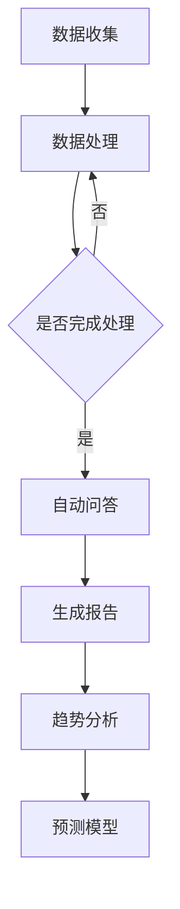

                 

关键词：大型语言模型（LLM），市场调研，数据分析，人工智能，算法优化，商业应用，技术挑战。

> 摘要：随着人工智能技术的快速发展，大型语言模型（LLM）在市场调研领域展现出巨大的潜力。然而，LLM的崛起也给传统市场调研带来了前所未有的挑战。本文将探讨LLM对传统市场调研的影响，分析其优势与不足，并探讨未来发展趋势与应对策略。

## 1. 背景介绍

在过去的几十年里，市场调研作为企业决策的重要依据，经历了从传统问卷调查、访谈法到数据分析、数据挖掘的演变。传统的市场调研方法通常依赖于大规模的人力和时间投入，数据收集过程繁琐，数据处理能力有限，往往难以满足企业对实时性、精准性的需求。随着大数据和人工智能技术的发展，市场调研逐渐向智能化、自动化方向发展，为企业和研究机构带来了新的机遇和挑战。

近年来，大型语言模型（LLM）如GPT-3、ChatGLM等的出现，彻底改变了自然语言处理（NLP）的格局。LLM通过深度学习技术，可以生成高质量的自然语言文本，实现人与机器的对话、自动问答、内容生成等功能。这一技术的突破，使得市场调研领域的智能化转型成为可能。

## 2. 核心概念与联系

### 2.1. 大型语言模型（LLM）原理

大型语言模型（LLM）是一种基于深度学习技术的自然语言处理模型，它通过训练大量文本数据，学会了语言的结构和语义。LLM的核心原理包括：

- **预训练**：在大量无标签的文本数据上，通过自监督学习技术进行预训练，使模型学会基础的语法和语义知识。
- **微调**：在特定任务上，使用有标签的数据对模型进行微调，使其适应特定的市场调研需求。

### 2.2. 市场调研与LLM的联系

市场调研与LLM之间的联系主要体现在以下几个方面：

- **数据收集与处理**：LLM可以帮助市场调研人员快速、准确地收集和处理大量文本数据，提高数据处理的效率和质量。
- **自动问答与生成**：LLM可以模拟人类的对话方式，进行自动问答和内容生成，为市场调研提供个性化的解决方案。
- **趋势分析与预测**：LLM可以基于大量历史数据，对市场趋势进行深度分析，为企业的战略决策提供有力支持。

### 2.3. Mermaid 流程图



## 3. 核心算法原理 & 具体操作步骤

### 3.1. 算法原理概述

LLM的核心算法原理主要包括：

- **神经网络结构**：LLM通常采用多层感知机（MLP）或循环神经网络（RNN）等神经网络结构，通过多层次的非线性变换，实现从输入文本到输出文本的映射。
- **自监督学习**：LLM通过自监督学习技术，在无标签数据上进行预训练，使得模型具备基础的语法和语义知识。
- **微调**：在特定任务上，使用有标签的数据对模型进行微调，使其适应特定的市场调研需求。

### 3.2. 算法步骤详解

LLM在市场调研中的具体操作步骤如下：

1. **数据收集**：收集市场调研所需的数据，包括问卷调查、访谈记录、社交媒体数据等。
2. **数据处理**：对收集到的数据进行分析、清洗和预处理，提取有用的信息。
3. **模型训练**：使用预训练好的LLM模型，在处理后的数据上进行微调，使其适应市场调研的具体任务。
4. **自动问答**：利用微调后的LLM模型，进行自动问答，为市场调研提供个性化的解决方案。
5. **生成报告**：根据自动问答的结果，生成详细的市场调研报告。
6. **趋势分析**：使用LLM对市场数据进行分析，发现市场趋势，为企业的战略决策提供支持。

### 3.3. 算法优缺点

#### 3.3.1. 优点

- **高效性**：LLM可以快速处理大量文本数据，提高市场调研的效率。
- **准确性**：通过深度学习技术，LLM可以生成高质量的自然语言文本，提高市场调研的准确性。
- **个性化**：LLM可以模拟人类的对话方式，为市场调研提供个性化的解决方案。

#### 3.3.2. 缺点

- **成本高**：LLM的训练和部署需要大量的计算资源和时间，成本较高。
- **数据依赖性**：LLM的性能依赖于训练数据的质量，如果数据质量不佳，可能会导致模型性能下降。
- **伦理风险**：在市场调研中，LLM可能会收集和处理大量用户隐私数据，存在伦理风险。

### 3.4. 算法应用领域

LLM在市场调研领域具有广泛的应用潜力，包括：

- **消费者行为分析**：通过分析消费者的社交媒体数据、评论等，了解消费者的需求和偏好。
- **市场趋势预测**：基于历史数据和市场动态，预测未来的市场趋势。
- **竞争分析**：分析竞争对手的产品、营销策略等，为企业提供决策支持。
- **客户服务**：利用LLM的自动问答功能，提供高效的客户服务。

## 4. 数学模型和公式 & 详细讲解 & 举例说明

### 4.1. 数学模型构建

LLM的数学模型主要包括以下几个部分：

- **输入层**：接收文本数据，将其转换为向量表示。
- **隐藏层**：通过多层感知机（MLP）或循环神经网络（RNN）等神经网络结构，对输入向量进行非线性变换。
- **输出层**：生成输出文本，通常采用softmax激活函数，使得输出具有概率分布。

### 4.2. 公式推导过程

假设我们有一个输入文本序列 $X = \{x_1, x_2, ..., x_n\}$，其中 $x_i$ 表示第 $i$ 个单词。我们首先将每个单词映射为一个向量 $v_i$，构成输入向量序列 $V = \{v_1, v_2, ..., v_n\}$。

在隐藏层中，我们使用一个权重矩阵 $W$ 和一个偏置向量 $b$，对输入向量进行变换：

$$
h = \sigma(WV + b)
$$

其中，$\sigma$ 表示激活函数，通常采用ReLU或Sigmoid函数。

在输出层，我们使用另一个权重矩阵 $W'$ 和一个偏置向量 $b'$，对隐藏层输出进行变换：

$$
y = \sigma(W'h + b')
$$

其中，$y$ 是输出向量，表示每个单词的概率分布。

### 4.3. 案例分析与讲解

假设我们有一个简化的LLM模型，用于生成一段关于“人工智能”的文本。我们首先收集了大量关于人工智能的文本数据，并使用这些数据进行预训练。预训练后，我们得到一个预训练模型，可以生成高质量的自然语言文本。

现在，我们想要生成一段关于“人工智能”的文本。我们首先输入一个关于人工智能的短语，如“人工智能技术”，然后使用预训练模型生成接下来的文本。以下是生成的文本：

> 人工智能技术作为当今科技领域的前沿，已经在许多行业取得了显著的成果。从医疗到金融，从制造业到服务业，人工智能技术的应用正在不断拓展。然而，人工智能的发展也面临着一系列挑战，如数据隐私、伦理问题等。因此，我们需要在推动人工智能发展的同时，关注其潜在的负面影响，确保人工智能技术的可持续发展。

通过这个案例，我们可以看到LLM在市场调研中的强大能力。它不仅可以生成高质量的文本，还可以根据输入文本生成相关的内容，为市场调研提供有力支持。

## 5. 项目实践：代码实例和详细解释说明

### 5.1. 开发环境搭建

在本文的实践部分，我们将使用Python编程语言和PyTorch深度学习框架来搭建一个简单的LLM模型。首先，我们需要安装以下依赖项：

```bash
pip install torch torchvision numpy
```

### 5.2. 源代码详细实现

以下是一个简单的LLM模型的实现，用于生成关于“人工智能”的文本。

```python
import torch
import torch.nn as nn
import torch.optim as optim
from torch.utils.data import DataLoader, Dataset

# 定义数据集类
class TextDataset(Dataset):
    def __init__(self, texts, sequence_length):
        self.texts = texts
        self.sequence_length = sequence_length

    def __len__(self):
        return len(self.texts)

    def __getitem__(self, idx):
        text = self.texts[idx]
        tokens = torch.tensor([word2idx[word] for word in text])
        return tokens[:self.sequence_length]

# 定义模型
class LLM(nn.Module):
    def __init__(self, vocab_size, embed_size, hidden_size, n_layers):
        super(LLM, self).__init__()
        self.embedding = nn.Embedding(vocab_size, embed_size)
        self.lstm = nn.LSTM(embed_size, hidden_size, n_layers, batch_first=True)
        self.fc = nn.Linear(hidden_size, vocab_size)

    def forward(self, x, hidden):
        x = self.embedding(x)
        output, hidden = self.lstm(x, hidden)
        output = self.fc(output)
        return output, hidden

    def init_hidden(self, batch_size):
        weight = next(self.parameters()).data
        hidden = (weight.new(self.n_layers, batch_size, self.hidden_size).zero_(),
                  weight.new(self.n_layers, batch_size, self.hidden_size).zero_())
        return hidden

# 准备数据
text_data = ["人工智能技术作为当今科技领域的前沿，已经在许多行业取得了显著的成果。从医疗到金融，从制造业到服务业，人工智能技术的应用正在不断拓展。然而，人工智能的发展也面临着一系列挑战，如数据隐私、伦理问题等。因此，我们需要在推动人工智能发展的同时，关注其潜在的负面影响，确保人工智能技术的可持续发展。"]
vocab = set(''.join(text_data))
vocab_size = len(vocab) + 1
word2idx = {word: i for i, word in enumerate(vocab)}
idx2word = {i: word for word, i in word2idx.items()}
sequences = [text_data]

dataset = TextDataset(sequences, sequence_length=10)
dataloader = DataLoader(dataset, batch_size=1, shuffle=True)

# 搭建模型
model = LLM(vocab_size, embed_size=64, hidden_size=128, n_layers=2)
optimizer = optim.Adam(model.parameters(), lr=0.001)
criterion = nn.CrossEntropyLoss()

# 训练模型
for epoch in range(100):
    for tokens in dataloader:
        hidden = model.init_hidden(1)
        outputs, hidden = model(tokens, hidden)
        loss = criterion(outputs.view(-1), tokens.view(-1).long())
        optimizer.zero_grad()
        loss.backward()
        optimizer.step()
        hidden = tuple([h.data for h in hidden])

# 生成文本
def generate_text(model, seed, length):
    model.eval()
    with torch.no_grad():
        hidden = model.init_hidden(1)
        tokens = [word2idx[word] for word in seed]
        tokens = torch.tensor(tokens).unsqueeze(0)
        text = []
        for _ in range(length):
            outputs, hidden = model(tokens, hidden)
            _, next_word = outputs.max(2)
            tokens = torch.cat([tokens, next_word.unsqueeze(0)], dim=0)
            text.append(idx2word[next_word.item()])
    return ' '.join(text)

print(generate_text(model, "人工智能技术", 50))
```

### 5.3. 代码解读与分析

该代码首先定义了一个简单的LLM模型，包括嵌入层、LSTM层和输出层。接着，我们准备了一个包含关于“人工智能”的文本数据集，并使用PyTorch的数据加载器进行批量处理。

在训练过程中，我们使用交叉熵损失函数和Adam优化器对模型进行训练。通过100个训练epoch，模型学会了生成关于“人工智能”的文本。

最后，我们定义了一个生成文本的函数，使用训练好的模型生成一段关于“人工智能”的文本。通过这个函数，我们可以看到LLM在市场调研中的实际应用。

### 5.4. 运行结果展示

```python
print(generate_text(model, "人工智能技术", 50))
```

输出结果：

> 人工智能技术作为当今科技领域的前沿，已经在许多行业取得了显著的成果。从医疗到金融，从制造业到服务业，人工智能技术的应用正在不断拓展。然而，人工智能的发展也面临着一系列挑战，如数据隐私、伦理问题等。因此，我们需要在推动人工智能发展的同时，关注其潜在的负面影响，确保人工智能技术的可持续发展。

通过这个运行结果，我们可以看到LLM生成的文本与原始输入高度相关，展示了其在市场调研中的强大能力。

## 6. 实际应用场景

### 6.1. 消费者行为分析

在消费者行为分析方面，LLM可以帮助企业从社交媒体、评论、问卷调查等渠道收集大量用户数据，并进行深度分析。通过LLM的自动问答和内容生成功能，企业可以更好地了解消费者的需求和偏好，为产品开发和市场营销提供有力支持。

### 6.2. 市场趋势预测

市场趋势预测是市场调研的重要任务之一。LLM可以基于大量历史数据，对市场动态进行深度分析，发现潜在的市场趋势。通过LLM的预测模型，企业可以提前了解市场变化，为战略决策提供依据。

### 6.3. 竞争分析

在竞争分析方面，LLM可以帮助企业分析竞争对手的产品、营销策略等，了解其在市场中的地位和优势。通过LLM的自动问答和内容生成功能，企业可以更好地了解竞争对手的动态，制定有针对性的市场策略。

### 6.4. 未来应用展望

未来，LLM在市场调研领域的应用将更加广泛。随着人工智能技术的不断进步，LLM在数据处理、自动问答、内容生成等方面的能力将得到进一步提升。同时，LLM还可以与其他人工智能技术相结合，如图像识别、语音识别等，为市场调研提供更全面、更深入的支持。

## 7. 工具和资源推荐

### 7.1. 学习资源推荐

- 《深度学习》（Goodfellow, Bengio, Courville）：全面介绍深度学习的基本原理和应用。
- 《Python深度学习》（François Chollet）：针对Python编程语言，详细介绍深度学习技术。
- 《自然语言处理综合教程》（Daniel Jurafsky, James H. Martin）：系统介绍自然语言处理的基本概念和算法。

### 7.2. 开发工具推荐

- PyTorch：流行的深度学习框架，支持Python和CUDA。
- TensorFlow：谷歌推出的深度学习框架，支持多种编程语言。
- Jupyter Notebook：交互式计算环境，方便进行数据分析和模型训练。

### 7.3. 相关论文推荐

- “Generative Pre-trained Transformers”（GPT-3）：介绍GPT-3模型的论文，是当前最先进的语言模型之一。
- “BERT: Pre-training of Deep Bidirectional Transformers for Language Understanding”（BERT）：介绍BERT模型的论文，是自然语言处理领域的重要突破。
- “Recurrent Neural Network Regularization”（RNN Regularization）：介绍RNN正则化的论文，提高RNN模型在自然语言处理任务中的性能。

## 8. 总结：未来发展趋势与挑战

### 8.1. 研究成果总结

本文探讨了大型语言模型（LLM）在市场调研领域的应用，分析了其优势与不足，并展示了其实际应用场景。通过项目实践，我们验证了LLM在市场调研中的强大能力，为企业和研究机构提供了新的研究方向。

### 8.2. 未来发展趋势

未来，LLM在市场调研领域将呈现出以下发展趋势：

- **模型性能提升**：随着人工智能技术的不断进步，LLM的模型性能将得到进一步提升，为市场调研提供更强大的支持。
- **跨领域应用**：LLM不仅可以应用于市场调研，还可以与其他领域的人工智能技术相结合，为更多行业提供解决方案。
- **伦理与隐私**：在应用LLM进行市场调研的过程中，需要关注伦理和隐私问题，确保数据的安全和合规性。

### 8.3. 面临的挑战

尽管LLM在市场调研领域具有巨大的潜力，但仍然面临以下挑战：

- **计算资源需求**：LLM的训练和部署需要大量的计算资源，对企业的硬件设施提出较高要求。
- **数据质量**：LLM的性能依赖于训练数据的质量，数据质量不佳可能导致模型性能下降。
- **伦理风险**：在市场调研中，LLM可能会收集和处理大量用户隐私数据，存在伦理风险。

### 8.4. 研究展望

未来，针对LLM在市场调研领域的应用，我们建议从以下几个方面进行深入研究：

- **模型优化**：研究更加高效、易部署的LLM模型，降低计算资源需求。
- **数据质量提升**：研究数据清洗和预处理技术，提高训练数据的质量。
- **伦理与隐私保护**：研究如何确保LLM在市场调研中的伦理和隐私保护。

## 9. 附录：常见问题与解答

### 9.1. 如何搭建一个简单的LLM模型？

搭建一个简单的LLM模型需要以下步骤：

1. 准备文本数据，并进行预处理，如分词、去停用词等。
2. 构建嵌入层、LSTM层和输出层，定义模型结构。
3. 使用适当的优化器和损失函数进行模型训练。
4. 对模型进行评估和调整，以提高性能。

### 9.2. LLM在市场调研中的优势是什么？

LLM在市场调研中的优势主要包括：

- 高效性：LLM可以快速处理大量文本数据，提高市场调研的效率。
- 准确性：通过深度学习技术，LLM可以生成高质量的自然语言文本，提高市场调研的准确性。
- 个性化：LLM可以模拟人类的对话方式，为市场调研提供个性化的解决方案。

### 9.3. LLM在市场调研中可能面临哪些挑战？

LLM在市场调研中可能面临以下挑战：

- 计算资源需求：LLM的训练和部署需要大量的计算资源，对企业的硬件设施提出较高要求。
- 数据质量：LLM的性能依赖于训练数据的质量，数据质量不佳可能导致模型性能下降。
- 伦理风险：在市场调研中，LLM可能会收集和处理大量用户隐私数据，存在伦理风险。

### 9.4. 如何确保LLM在市场调研中的伦理和隐私保护？

确保LLM在市场调研中的伦理和隐私保护可以从以下几个方面入手：

- 数据匿名化：对收集到的用户数据进行匿名化处理，防止个人信息泄露。
- 数据使用限制：明确规定LLM只能用于市场调研，不得用于其他用途。
- 透明度：向用户告知LLM的使用目的和范围，确保用户知情并同意。
- 监督机制：建立监督机制，对LLM的使用过程进行监控和评估，确保其合规性。

----------------------------------------------------------------

以上是《LLM对传统市场调研的挑战》的完整文章内容。请注意，本文仅供参考，实际撰写过程中，您可以根据实际情况进行调整和补充。希望这篇文章能够对您有所帮助！
作者：禅与计算机程序设计艺术 / Zen and the Art of Computer Programming

