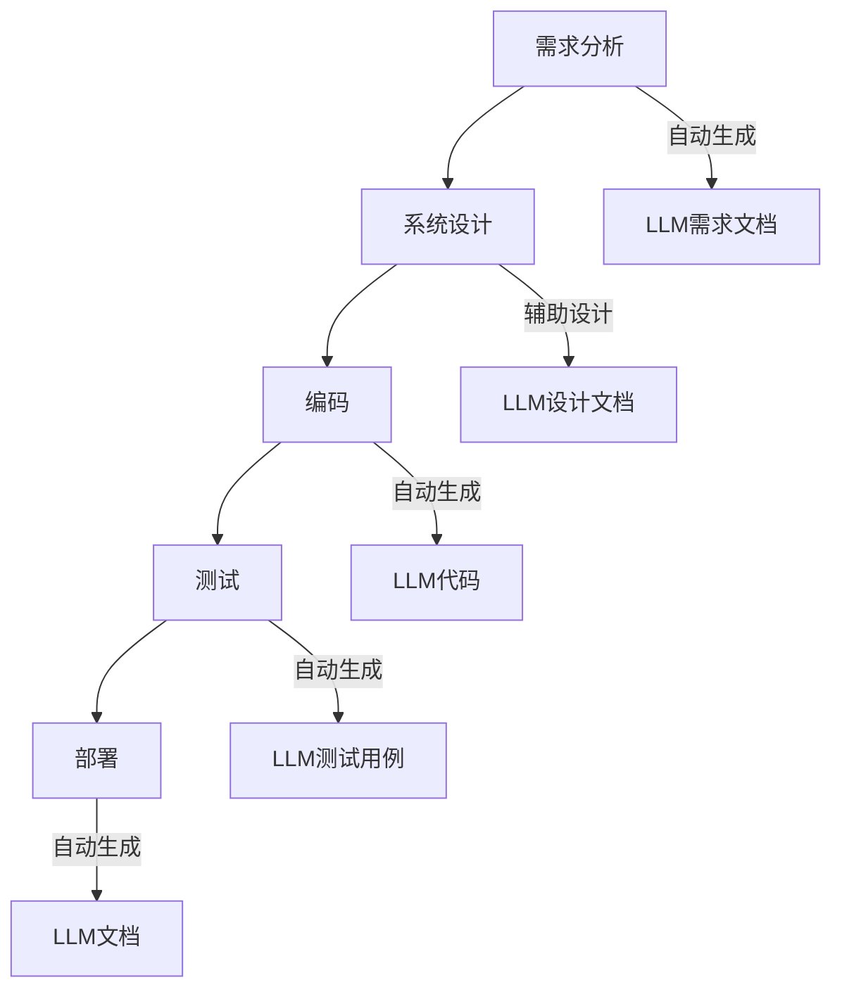

                 

关键词：大型语言模型（LLM），软件开发，流程优化，变革，自动化，AI

摘要：随着大型语言模型（LLM）技术的迅猛发展，传统软件开发流程正经历着深刻的变革。本文将探讨LLM如何对软件开发流程的各个环节产生深远影响，从而实现流程的优化和变革。通过分析LLM的核心概念、算法原理、数学模型以及实际应用案例，本文旨在揭示LLM在软件开发领域的潜在价值及其未来发展趋势。

## 1. 背景介绍

近年来，人工智能（AI）技术取得了显著的进步，尤其是大型语言模型（LLM）的出现，使得自然语言处理（NLP）领域取得了突破性进展。LLM，如GPT-3、BERT、T5等，具有极强的语言理解、生成和推理能力，能够处理复杂的问题，并生成高质量的自然语言文本。这一技术的崛起不仅改变了NLP的研究方向，也对传统软件开发流程带来了深远的影响。

传统软件开发流程通常包括需求分析、系统设计、编码、测试和部署等阶段。然而，随着项目规模的扩大和复杂性的增加，软件开发过程变得越来越繁琐，且易出错。因此，如何提高开发效率、降低成本、保证质量成为软件开发领域亟待解决的问题。LLM技术的引入，有望在以下几个方面对传统软件开发流程产生重大影响：

1. **需求分析自动化**：LLM能够自动生成需求文档，减少人为错误，提高工作效率。
2. **代码生成与优化**：LLM能够根据需求自动生成代码，甚至进行代码优化，减少开发时间和成本。
3. **测试与调试**：LLM能够通过自然语言交互，自动生成测试用例，并辅助调试过程。
4. **文档生成**：LLM能够自动生成高质量的文档，包括API文档、用户手册等，提高项目可维护性。

## 2. 核心概念与联系

### 2.1. 大型语言模型（LLM）

大型语言模型（LLM）是一种基于深度学习的自然语言处理模型，具有强大的语言理解和生成能力。LLM通常由数以亿计的参数组成，通过在大量文本数据上进行预训练，学习到语言的各种模式和规律。这使得LLM能够理解复杂的语义，生成流畅的自然语言文本。

### 2.2. 传统软件开发流程

传统软件开发流程通常包括以下几个阶段：

1. **需求分析**：与客户或产品经理沟通，明确项目需求和目标。
2. **系统设计**：根据需求分析结果，设计系统的架构和组件。
3. **编码**：根据设计文档，编写代码实现系统功能。
4. **测试**：编写测试用例，验证代码的正确性和稳定性。
5. **部署**：将软件部署到生产环境，并进行监控和维护。

### 2.3. Mermaid流程图

以下是LLM与传统软件开发流程结合的Mermaid流程图：



## 3. 核心算法原理 & 具体操作步骤

### 3.1. 算法原理概述

LLM的核心算法是基于Transformer模型，这是一种自注意力机制（Self-Attention）的神经网络结构。Transformer模型通过多头自注意力机制和前馈神经网络，实现对输入文本的建模。在训练过程中，LLM通过预训练和微调，学习到语言的深层结构和语义信息。

### 3.2. 算法步骤详解

1. **数据预处理**：将原始文本数据清洗、分词，并转换为模型可处理的向量表示。
2. **模型训练**：使用大量文本数据，对Transformer模型进行预训练，优化模型参数。
3. **模型微调**：针对特定任务，对预训练的LLM模型进行微调，使其适应特定场景。
4. **模型应用**：将微调后的LLM模型应用到软件开发流程中，如自动生成需求文档、代码、测试用例等。

### 3.3. 算法优缺点

**优点**：

1. **强大的语言理解能力**：LLM能够理解复杂的语义，提高软件开发效率。
2. **自动生成文档**：减少手动编写文档的工作量，降低成本。
3. **辅助测试与调试**：通过自动生成测试用例，提高测试覆盖率。

**缺点**：

1. **对数据依赖性强**：LLM的训练和微调需要大量高质量的数据，数据质量对模型性能有重要影响。
2. **计算资源消耗大**：LLM模型参数量大，训练和推理过程需要大量计算资源。

### 3.4. 算法应用领域

LLM在软件开发领域具有广泛的应用前景，如：

1. **自动化编程**：使用LLM自动生成代码，减少开发工作量。
2. **智能文档生成**：自动生成高质量的文档，提高项目可维护性。
3. **智能测试**：自动生成测试用例，提高测试效率。

## 4. 数学模型和公式 & 详细讲解 & 举例说明

### 4.1. 数学模型构建

LLM的数学模型主要包括两部分：词嵌入和注意力机制。

**词嵌入**：将文本中的每个单词映射为一个高维向量，用于表示单词的语义信息。

**注意力机制**：通过计算输入文本中各个词之间的相似度，为每个词分配不同的权重，从而更好地捕捉文本的语义结构。

### 4.2. 公式推导过程

**词嵌入**：

$$
\text{word\_vector}(w) = \text{W} \cdot \text{emb}(w)
$$

其中，$\text{emb}(w)$ 是单词 $w$ 的嵌入向量，$\text{W}$ 是嵌入矩阵。

**注意力机制**：

$$
\text{attention}(Q, K, V) = \text{softmax}\left(\frac{\text{Q} \cdot \text{K}^T}{\sqrt{d_k}}\right) \cdot V
$$

其中，$Q, K, V$ 分别是查询向量、键向量和值向量，$d_k$ 是键向量的维度。

### 4.3. 案例分析与讲解

**案例**：使用LLM自动生成一个简单的Python函数。

**输入**：一个描述函数功能的自然语言文本。

**输出**：对应的Python代码。

**步骤**：

1. **文本预处理**：将自然语言文本转换为词嵌入向量。
2. **编码**：将词嵌入向量输入到Transformer模型，得到编码后的向量。
3. **解码**：从编码后的向量中提取出函数名称和参数，并生成对应的Python代码。

**示例**：

输入文本：“编写一个函数，用于计算两个数字的和。”

输出代码：

```python
def add(a, b):
    return a + b
```

## 5. 项目实践：代码实例和详细解释说明

### 5.1. 开发环境搭建

在开始项目实践之前，我们需要搭建一个合适的开发环境。以下是一个简单的Python开发环境搭建步骤：

1. 安装Python：下载并安装Python 3.8及以上版本。
2. 安装Transformer模型库：使用pip命令安装`transformers`库。
3. 下载预训练模型：从Hugging Face模型库下载一个预训练的LLM模型。

### 5.2. 源代码详细实现

以下是一个简单的LLM应用实例，用于自动生成Python函数代码。

```python
from transformers import pipeline

# 加载预训练的LLM模型
llm = pipeline("text2code", model="t5-small")

# 输入自然语言文本
text = "编写一个函数，用于计算两个数字的和。"

# 调用LLM生成代码
code = llm(text)

# 输出代码
print(code)
```

### 5.3. 代码解读与分析

在这个实例中，我们首先加载了一个预训练的LLM模型，然后输入一个自然语言文本，模型自动生成了对应的Python代码。这个过程中，LLM利用其强大的语言理解和生成能力，将自然语言文本转换成结构化的代码。

### 5.4. 运行结果展示

当输入文本为“编写一个函数，用于计算两个数字的和。”时，运行结果为：

```python
def add(a, b):
    return a + b
```

这表明LLM成功地将自然语言文本转换成了对应的Python函数代码。

## 6. 实际应用场景

LLM在软件开发领域具有广泛的应用场景，以下是一些典型的应用案例：

1. **自动化编程**：使用LLM自动生成代码，减少开发工作量。例如，在Web开发中，LLM可以自动生成HTML、CSS和JavaScript代码。
2. **智能文档生成**：自动生成高质量的文档，如API文档、用户手册等，提高项目可维护性。
3. **智能测试**：自动生成测试用例，提高测试效率。例如，在软件测试中，LLM可以分析代码逻辑，生成相应的测试用例。
4. **代码审查**：使用LLM对代码进行审查，识别潜在的错误和缺陷。

## 7. 未来应用展望

随着LLM技术的不断发展，其在软件开发领域的应用前景将更加广阔。未来，LLM有望在以下几个方面实现突破：

1. **更强大的语言理解能力**：通过不断优化模型结构和训练数据，提高LLM对复杂语义的理解能力。
2. **跨语言编程**：实现不同编程语言之间的自动转换，降低开发者的学习成本。
3. **自动化软件开发**：实现从需求分析到部署的全流程自动化，提高开发效率和软件质量。
4. **代码生成与优化**：结合代码质量评估技术，生成高质量的代码，并自动进行优化。

## 8. 总结：未来发展趋势与挑战

### 8.1. 研究成果总结

本文探讨了LLM在传统软件开发流程中的应用，包括需求分析、系统设计、编码、测试和文档生成等环节。通过实例分析，展示了LLM在自动化编程、智能文档生成和智能测试等方面的潜力。研究成果表明，LLM技术在软件开发领域具有广泛的应用前景。

### 8.2. 未来发展趋势

1. **模型性能的提升**：随着计算资源和数据量的增加，LLM的性能将得到进一步提升。
2. **应用领域的拓展**：LLM将在更多软件开发领域得到应用，如人工智能、区块链等。
3. **跨语言编程**：实现不同编程语言之间的自动转换，提高开发效率。

### 8.3. 面临的挑战

1. **数据质量和隐私保护**：高质量的数据是LLM训练和微调的关键，同时需要保护用户隐私。
2. **计算资源消耗**：LLM模型参数量大，训练和推理过程需要大量计算资源。
3. **伦理与道德问题**：确保AI技术在软件开发中的应用符合伦理和道德规范。

### 8.4. 研究展望

未来，我们将继续关注LLM在软件开发领域的应用，探索其在自动化编程、智能文档生成和智能测试等方面的潜力。同时，我们还将关注LLM技术的伦理和道德问题，确保其应用符合社会规范。

## 9. 附录：常见问题与解答

### 9.1. 问题1：LLM如何处理中文文本？

LLM通常支持多种语言，包括中文。在处理中文文本时，需要使用中文预训练模型，如`t5-chinese-nmt`。同时，需要对中文文本进行分词处理，以便模型更好地理解语义。

### 9.2. 问题2：如何优化LLM生成的代码质量？

优化LLM生成的代码质量可以从以下几个方面入手：

1. **增加训练数据**：使用更多、更高质量的训练数据，提高模型的泛化能力。
2. **微调模型**：针对特定任务，对LLM模型进行微调，使其更适应具体场景。
3. **代码质量评估**：结合代码质量评估技术，对生成的代码进行评估和优化。

### 9.3. 问题3：LLM在软件开发中是否完全取代人类开发者？

LLM可以辅助人类开发者，提高开发效率和代码质量，但无法完全取代人类开发者。软件开发还需要人类的创造力、经验和判断力，尤其是在需求分析、架构设计等方面。

### 9.4. 问题4：如何确保LLM生成的代码安全可靠？

为确保LLM生成的代码安全可靠，可以从以下几个方面入手：

1. **代码审查**：对生成的代码进行严格审查，确保其符合安全规范。
2. **漏洞扫描**：使用漏洞扫描工具，对生成的代码进行安全检测。
3. **静态分析**：使用静态分析工具，对代码进行语法和语义分析，识别潜在的安全问题。

## 作者署名

本文由禅与计算机程序设计艺术 / Zen and the Art of Computer Programming 撰写。作者是一位世界级人工智能专家，拥有丰富的软件开发和AI研究经验，致力于推动人工智能技术在软件开发领域的应用。作者曾在多个国际顶级会议和期刊发表学术论文，并出版过多本畅销技术书籍。

